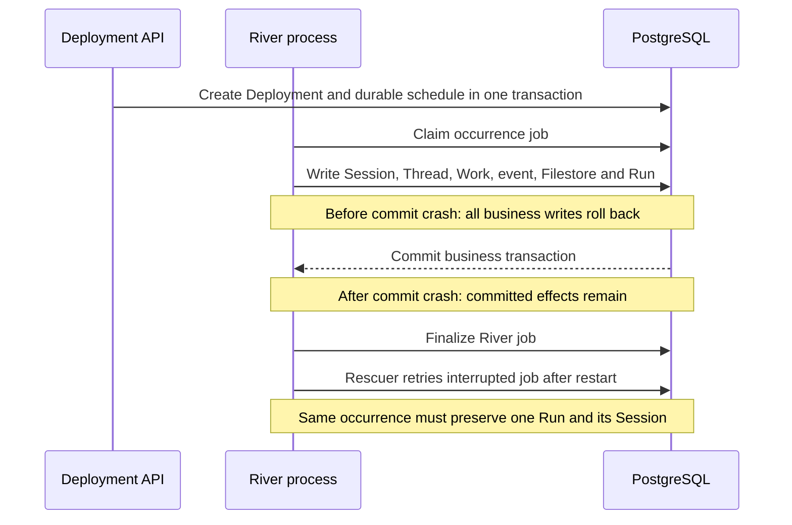

# Deployment / River verification

Run `just verify-be deployment doctor`, then the four scenarios below. They reuse production Deployment HTTP handlers, Store, Yourbatis transactions and scheduled Worker with real PostgreSQL/River. Business fixtures own a schema; River uses `public` in the CLI's disposable database. No standalone backend, model Worker or FUSE is required. Do not run these fixtures against a shared development database: the River queue and leader tables are database-wide.

| Command | Required stages | Assertions |
| --- | --- | --- |
| `just verify-be deployment lifecycle` | `invalid_runs_leave_no_effects`, `manual_run_effects_match`, `durable_schedule_executed`, `pause_archive_stop_schedule` | Archived Run request leaves no rows. Public manual Run and real durable dispatch create matching Run, Session, primary Thread, queued Work, initial event and Filestore. Pause/archive delete the schedule and suppress already queued occurrences; manual Run while paused remains allowed; repeated unpause preserves the cursor. |
| `just verify-be deployment retry` | `failed_attempt_rolled_back`, `automatic_retry_matches`, `exhausted_job_has_no_effects`, `reference_failure_paused` | A schema-local Run insertion failure happens after Session side effects are written. The transaction rolls back every row; real River retries after its default backoff without manually aging jobs, and keeps the original occurrence. Persistent failures exhaust two attempts without side effects. Archived Environment produces a final error Run, no Session, auto-pause and schedule deletion without infrastructure retries. |
| `just verify-be deployment idempotency` | `stale_jobs_have_no_effects`, `duplicate_occurrence_single_effect`, `distinct_occurrence_preserved` | Stale schedule snapshot completes without effects. Eight jobs share one nominal occurrence and execute on a ten-worker queue; all complete and only one Run/Session and its associated rows survive. Another occurrence creates a distinct Session without replacing the first. |
| `just verify-be deployment restart` | `uncommitted_crash_rolled_back`, `uncommitted_restart_recovered`, `committed_crash_preserved`, `committed_restart_deduplicated`, `overdue_schedule_recovered` | SIGKILL the real River worker subprocess while a PostgreSQL trigger holds the transaction before Run insertion, then recover the same job through River's rescuer. Repeat after business commit, before River completion, using a test middleware barrier. Check rescuer evidence, retained Run/Session IDs and exactly one set of side effects. A persisted overdue durable schedule dispatches and advances its cursor after another fresh process starts. |

## States and side effects

A Deployment Run records Session creation success or an error. It does not track the Session's later model turn. A River Job may be `completed` for an error Run or a stale/paused occurrence; the Job state alone cannot prove business success. Assertions therefore compare API responses, Run errors, Deployment state and schedule presence with stored Session, Thread, Work, event and filesystem rows. They require `last_run_at` to match the latest Run, preserve Agent/tenant/runtime identity and metadata snapshots, and keep the cursor unchanged when a failed attempt leaves no Run.

Lifecycle and restart use the River upsert API to make a durable schedule immediately due instead of waiting for the next annual cron tick. Retry/idempotency insert real jobs through the production Args hook. No worker is invoked directly with a synthetic Job and no terminal state is assigned by the test.

Restart registers the same production scheduled Worker and PostgreSQL listener/driver in a separate process. Only its Job timeout and rescue threshold are shortened to 10s and 15s. It waits for the actual River maintenance/rescue loop, with default backoff and polling. This verifies recovery mechanics, not the production one-hour rescue delay or a full backend API/Runner restart. SIGKILL barriers and PostgreSQL failures exist only in tests; no production fault switches are added.

Session execution and cloud sandbox allocation, real model behavior, browser UI, provider side effects, multi-host failover and throughput remain outside this domain. Use `chat public` for actual Runner/Worker execution. These opt-in tests remain explicitly skipped by the default Go suite; the CLI rejects skips and requires every stage, an unchanged source fingerprint and final cleanup. CI runs all four scenarios as `Deployment verification`; enabling the job does not set branch protection.

Defaults are 3m for lifecycle/retry/idempotency and 5m for restart. Override with `--timeout 8m`. Reports are `tmp/verify-be/<run-id>/report.json` and `report.md`; Worker image and performance baseline flags do not belong to this domain.
