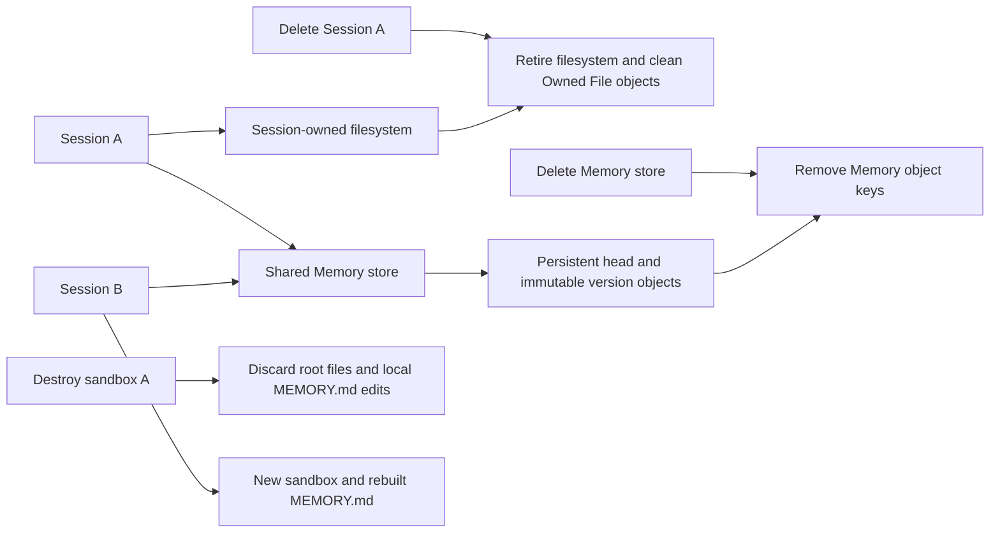

# Memory / Filestore

Run from the repository root. `just verify-be memory -h` lists the commands and deadlines. Run `just verify-be memory doctor` for common prerequisites. The five portable scenarios need PostgreSQL, Redis, NATS and MinIO, with no Worker. `just verify-be memory doctor mounts` additionally probes the configured Worker image and daemon-side FUSE/SYS_ADMIN permissions.

| Command | Production behavior and direct assertions | Required stages |
| --- | --- | --- |
| `memory integrity` | Invalid UTF-8, content over 100 KiB, unsupported TTL and traversal fail before upload. Parent/child file conflicts preserve existing bytes. Missing S3 objects reject Filestore/full REST reads without changing the head; exact repair restores reads. | `invalid_writes_rejected`, `missing_object_rejected`, `repaired_memory_matches` |
| `memory isolation` | Read-only writes/removes, unmounted stores, a different filesystem and foreign tenant access fail. Denials create no version. Archived stores reject writes while allowing reads. Session deletion revokes its token while another Session still reads shared Memory. | `readonly_and_scope_enforced`, `archived_store_readonly`, `deleted_session_token_revoked` |
| `memory cleanup` | Upload rejection preserves head/version. Metadata rejection and identical-body flush compensate unreferenced uploads, including deletion failures that enqueue durable jobs. Store deletion and version redaction enqueue cleanup in the same transaction; enqueue rejection rolls back the metadata and preserves readable source bytes. Delete plus enqueue failure during redundant-upload compensation is reported as failure. Real unversioned MinIO proves direct store deletion and cleanup retries remove all Memory object keys, preserve retained bytes during failure and remain idempotent after completion. | `deletion_cleanup_atomic`, `failed_write_compensated`, `discarded_upload_cleanup_recovered`, `cleanup_retry_persisted`, `memory_objects_removed` |
| `memory lifecycle` | Literal UTF-8/newline bytes agree across REST, Filestore and S3. Two Sessions share head updates; version actor identifies the writing Session. Identical flush creates no version or orphan. Deleting the first Session preserves shared Memory; a fresh read-only Session sees subsequent updates. Removing a Memory hides its path while historical versions remain readable. | `memory_versions_match`, `cross_session_memory_preserved`, `deleted_memory_history_preserved` |
| `memory filestore` | Ordinary output overwrite/copy/move/remove preserve exact bytes and reject forbidden overwrite. Actual Session deletion retires its filesystem; cleanup processes more than 100 owned files, removes owned objects and reduces quota to zero. Shared Memory remains readable in a new Session. | `filestore_mutations_match`, `session_owned_cleanup_completed`, `memory_survives_filesystem_cleanup` |
| `memory mounts` | Public Session creation drives the actual background Runner, local Docker provider and real rclone/FUSE. Failure after allocation while writing `MEMORY.md` removes the container and exposes no CodeSession. All five fixed and two Memory mountpoints exist. Read-only writes fail; seed bytes, literal Markdown and removal of token config are checked. A mounted write persists exact object bytes and a session actor version. After explicit container destruction, another Session reads persisted Memory, sees rebuilt Markdown and has no previous sandbox-local root file. | `mount_failure_cleaned`, `memory_mounts_ready`, `mounted_write_persisted`, `sandbox_lifecycle_matches` |

```sh
just verify-be memory doctor
just verify-be memory integrity
just verify-be memory isolation
just verify-be memory cleanup
just verify-be memory lifecycle
just verify-be memory filestore
just verify-be memory doctor mounts
just verify-be memory mounts
```

Portable deadlines are 3m; mounts has 8m. Override with `--timeout 10m`. Only `mounts` accepts `--worker-image`. Configure a private image in the ignored `.verify-be.local.json`; help never displays its resolved value. A missing prerequisite is blocked, exit 2, and never substitutes a fake mount.

The portable tests live in `tests/memory_verify_*_test.go`. They reuse existing Session/Filestore integration fixtures and production HTTP handlers, with unique PostgreSQL schemas and real MinIO. Fixture code issues scoped tokens directly; token issuance through the actual Runner is checked by `mounts` in `tests/liveworker/memory_mounts_test.go`. Portable reports state that no standalone backend or Worker was started. Ordinary full Go suites explicitly skip these opt-in tests.

Portable fixtures assert the disposable bucket has never enabled S3 versioning. Memory history uses independent object keys; deletion checks require actual reads to return NotFound. Storage faults surround real calls in test code; schema-local triggers reject queue persistence. Cleanup uses the real generic/Filestore Workers with `RunOnce` and explicitly advances retry eligibility and a rejected ordinary upload's scheduled orphan guard. The tests do not wait for automatic background backoff. Assertion failures happen before fixture cleanup; the latter removes remaining run-owned objects but cannot turn a failed assertion into success. Final CLI cleanup removes containers, volumes and private configuration; failed cleanup prevents a passing verdict.

## Resource ownership



The mounted store lives at `/mnt/memory/{slug}` and maps to the HTTP `/memory/{slug}` namespace. `/mnt/memory` itself is sandbox-local. `MEMORY.md` is generated from the current Session's attachment snapshot and may be edited locally; those edits and root scratch files do not persist to a new sandbox. Ordinary `/outputs` files are Session-owned; deleting a Session must not delete shared Memory.

These scenarios exclude cloud allocation/IAM, browser rendering, upstream model quality/tool turns, process crash windows, one-hour token renewal, concurrent editing throughput, Memory performance and automatic loop/backoff timing. `mounts` explicitly destroys a container; it does not claim cloud failure detection or automatic provider teardown on Session deletion. Same-code-session sandbox replacement is covered by separate Runner tests, not by this fresh-session scenario. Object corruption with a present key is not checked by `integrity`; its object fault is absence followed by exact repair.

The Memory CI job runs five portable scenarios; the Worker job also runs actual mounts. Follow the [Skill workflow](../SKILL.md) for source stability, report inspection and related chat regressions. Evidence is `tmp/verify-be/RUN_ID/report.json` and `report.md`, with test-side assertions in `tests.jsonl`. Reports must have no skipped tests, every required stage and successful cleanup.
