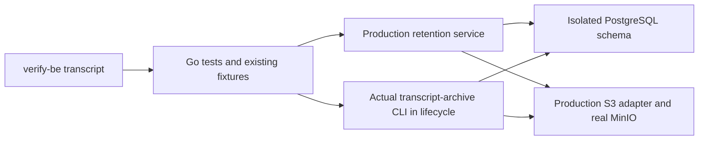

# Transcript archive verification

Run `just verify-be transcript doctor`, then these five scenarios. They use production retention services and HTTP handlers in the Go test process, isolated PostgreSQL schemas and real MinIO through the production S3 adapter. They reuse the existing `tests` fixtures; no standalone backend, Worker or FUSE is required.

| Command | Required proof stages | Assertions |
| --- | --- | --- |
| `just verify-be transcript integrity` | `missing_object_blocks_operations`, `corrupt_object_blocks_operations`, `repaired_object_recovers` | Delete or corrupt an attached object in MinIO. Export, restore and hard delete must fail without changing rows or the attached manifest. Repairing the original bytes allows recovery. |
| `just verify-be transcript recovery` | `upload_failures_recovered`, `archive_batches_recovered`, `delete_batches_recovered`, `restore_batches_recovered` | Interrupt before/after upload; preserve live rows until verification succeeds. A young missing pending object cannot be reused; cleanup expires it and retry uses a new UUID/key. PostgreSQL triggers reject later batches during soft delete, hard delete and 501-record restore; retry completes without duplicates or content loss. |
| `just verify-be transcript concurrency` | `concurrent_archive_coordinated`, `single_manifest_preserved`, `concurrent_retry_matches` | Pause one caller after real upload, let a second caller recover the pending segment, then release the first. Assert one manifest and one upload, preserved bytes and successful delete/restore. |
| `just verify-be transcript boundary` | `scope_boundaries_preserved`, `boundary_delete_preserves_reads`, `boundary_restore_matches` | Interleave foreground/subagent old events, compaction boundaries and new events. Only old events enter the correct segments. Compare HTTP-visible history and full export before and after soft delete, hard delete and restore. |
| `just verify-be transcript lifecycle` | `archive_export_matches`, `hard_delete_preserves_backup`, `blob_gc_completed`, `cli_restore_matches`, `tenant_history_isolated` | Compare full export bytes before/after archive and hard delete. Check observation-window protection, real cleanup of the old external payload, then use the actual `cmd/transcript-archive` CLI to export and restore twice. Verify HTTP bytes, append watermark and rejection of a foreign workspace scope. |

## Model and boundaries

`internal/transcriptretention` owns archive, export, restore and deletion. `internal/db` owns scoped rows and manifests; `internal/transcriptarchive` owns codec and integrity checks. The scenarios exercise `code_session_internal_events`, not public chat SSE/history. Boundary reads use the existing private `internal-events` HTTP handler. Restore is an explicit maintenance operation; the fixture disables archive scheduling while the CLI runs.

Archive follows pending registration, upload, verified readback, attachment and batched soft deletion. Hard deletion requires attached, verified coverage and the observation window. Attached archive objects remain as the recoverable copy after event rows and old payload blobs are removed. Their retention is intentional; successful cleanup does not mean deleting this copy.

Faults are test-side wrappers around the real upload or schema-local PostgreSQL triggers. They represent failures at deterministic persistence boundaries, not process kills or provider network faults. The cleanup Worker is driven with `RunOnce`; fixtures explicitly age rows instead of waiting days. Concurrent coverage uses two service calls sharing real DB/S3, not separate backend processes.

Five-minute River sweeps, automatic River retries, crash/restart recovery, provider IAM and production throughput remain unverified. Existing codec, Mapper and retention tests remain useful for narrower invariants; these scenarios add a reproducible environment and fail-closed evidence contract around them. The default full Go suite skips these opt-in scenarios and reports them as unverified; run this domain separately.

## Evidence and deadlines

Lifecycle/recovery default to five minutes; the other scenarios default to three minutes. Override with `--timeout 8m` when needed. Read `report.json` and `report.md` in the printed evidence directory. All stages, test/package success, unchanged source and final cleanup are required. No Worker image or performance baseline option belongs to this domain.
