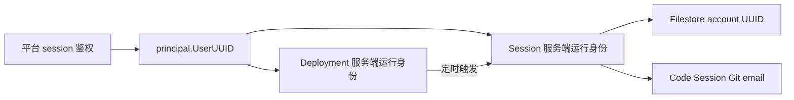

# `/v1/*` 认证路由：基于凭证而非 Host 头

> 目标：让 `/v1/*` 入口路由根据客户端实际携带的凭证类型（API key / session cookie）做分发，而不是依赖 Host 头猜测调用方身份，从而让反向代理和任意端口部署都能正确工作。

---

## 1. 问题

### 1.1 原有路由逻辑

`apiEntrypointRouter.ServeHTTP` 在 `internal/api/server.go` 中决定 `/v1/*` 请求走 service 路由还是 platform 路由：

```go
// 原有实现
func (r apiEntrypointRouter) ServeHTTP(w http.ResponseWriter, req *http.Request) {
    if isPlatformHost(req.Host) && auth.ExtractAPIKey(req) == "" {
        r.platform.ServeHTTP(w, req)  // session cookie 鉴权
        return
    }
    r.service.ServeHTTP(w, req)        // x-api-key 鉴权
}
```

`isPlatformHost` 只识别以下 host：

- `localhost:5173` / `127.0.0.1:5173` / `[::1]:5173` — Vite 前端开发服务器
- `oma.duck.ai` — 生产域名

### 1.2 触发场景

当通过以下方式访问时，Host 头不在白名单内，`/v1/*` 请求被错误路由到 service 路径（要求 `x-api-key`），返回 401：

| 访问方式 | Host 头 | 路由结果 | 预期 |
|----------|---------|----------|------|
| `http://localhost` (Caddy :80) | `localhost` | → service (401) | platform |
| `http://localhost:38080` (直连) | `localhost:38080` | → service (401) | platform |
| 任意反向代理后 | 代理域名 | → service (401) | platform |

这个问题在 docker-compose 部署中尤其突出：Caddy 监听 `:80`，前端通过 `http://localhost` 访问，所有 `/v1/*` 请求都带 session cookie 但被路由到 service auth middleware，直接返回 401。

---

## 2. 方案

### 2.1 核心思路

**不看 Host，看凭证。** `/v1` 资源只注册一次，请求携带什么凭证，就使用对应的鉴权链：

```go
func (s *Server) v1AuthMiddleware(next http.Handler) http.Handler {
    service := s.serviceAuthMiddleware(next)
    platform := s.platformAuthMiddleware(next)
    return http.HandlerFunc(func(w http.ResponseWriter, r *http.Request) {
        if auth.ExtractAPIKey(r) != "" {
            service.ServeHTTP(w, r)
            return
        }
        platform.ServeHTTP(w, r)
    })
}
```

`registerVersionedAPIRoutes` 在一个 `/v1` chi 子路由中完成组装：`codesessions.Handler` 注册 runtime 路由并执行各自的鉴权策略，privacy consent 保持开放，其余资源统一放入 `v1AuthMiddleware` 路由组。实现不再创建结构相同的 service/platform 两套路由。子路由的 `NotFound` 与 `MethodNotAllowed` fallback 也通过 `v1AuthMiddleware`，保证未知路径和已知路径上的错误 method 不会绕过 API 级鉴权边界。

### 2.2 凭证提取

三个核心函数均在 `internal/auth/auth.go` 中：

```go
// ExtractAPIKey — 从 X-Api-Key header 或 Authorization: Bearer <token> 提取
func ExtractAPIKey(r *http.Request) string

// ExtractBearerToken — 只从 Authorization: Bearer <token> 提取
func ExtractBearerToken(r *http.Request) string

// ExtractPlatformSessionKey — 从 sessionKey cookie 提取
func ExtractPlatformSessionKey(r *http.Request) string
```

`ExtractAPIKey` 只负责通用 service 入口分流。service auth 首先按 workspace API key 校验；普通 API key 未命中时，只有 `POST /v1/messages` 可以继续校验 `sk-ant-oat01-...` OAuth-compatible token。该 token 不能访问其他 `/v1/*` 资源，具体见 [messages-proxy.md](./messages-proxy.md)。Filestore 不进入这条 fallback。

worker、session ingress、OTLP 与 upstream proxy 不走通用 OAuth-compatible fallback。它们统一校验 `sk-ant-si-<JWT>` 的固定 EdDSA 算法、`kid`、签名、issuer、audience，以及 JWT `session_id` 与请求路径的绑定。新 JWT 不设置独立 `exp`，也不携带 repository/resource sources。大多数 ingress handler 把 claims 作为签名身份快照，并由对应 handler 执行 worker epoch、heartbeat grace 等状态约束；OTLP 不读取 epoch，只要求当前 worker lease 未过期。这条 code-session ingress 合同未因 Filestore 而改动。

Filestore 是显式例外：`/v1/filestore` 通过独立中间件验证 `Authorization: Bearer` 中的原始 compact JWT，只接受 Filestore 专用凭证；`X-Api-Key`、workspace API key、`sk-ant-oat01-` OAuth-compatible token 和 `sk-ant-si-` session-ingress JWT 都不会进入 Filestore。Filestore JWT 使用独立 claims 与验证器，并回查活跃的 organization、account、workspace 和单个 filesystem；`org_taints` 与 `workspace_cmek_enabled` 还必须与当前策略一致。鉴权结果被映射为资源专用的 `filestore.Principal`，通过独立 context key 传入 handler；全局 `auth.Principal` 不承载 Filestore 专属字段。Filestore 鉴权失败使用其 wire contract 要求的扁平 `{code,message}`，不使用 Anthropic error envelope；鉴权函数是 status、code 和 message 的唯一所有者，中间件只把该专用错误原样写入协议响应，不再按 HTTP status 二次生成错误语义。通过鉴权后的未知操作或错误方法也由 Filestore handler 输出同一错误外观。

### 2.3 路由决策表

| API Key | Session Cookie | 鉴权链 | 原因 |
|---------|---------------|------|------|
| ✓ | — | service | SDK/CLI 调用，token 鉴权 |
| ✓ | ✓ | **service** | API key 优先，明确的服务调用意图 |
| — | ✓ | platform | 浏览器控制台，session 鉴权 |
| — | — | platform | 默认走 platform，保留 `/v1/privacy-consents` 等无需鉴权的开放路由 |

### 2.4 向后兼容分析

| 场景 | 修复前 | 修复后 | 变化 |
|------|--------|--------|------|
| `curl -H 'x-api-key: ...' localhost:38080/v1/models` | service | service | 无 |
| 浏览器 `localhost:5173` 带 session cookie | platform | platform | 无 |
| 浏览器 `localhost:38080` 带 session cookie | service (401) | **platform** | ✅ 修复 |
| 浏览器 `localhost` (Caddy) 带 session cookie | service (401) | **platform** | ✅ 修复 |
| 无凭证请求 | host 猜测 | platform | 无开放路由影响 |

唯一的语义变化是：**session cookie 现在在任意端口/域名上都生效**，这正是本次修复的目标。

### 2.5 为什么 API key + session cookie 同时存在时选 service

当两个凭证都存在时（例如开发者用 curl 带 API key 调试，但浏览器也留下了 cookie），API key 是更强的调用意图信号 — 客户端明确选择了 service 调用方式。选择 service 鉴权链也符合最小惊讶原则。

---

## 3. 同步清理

### 3.1 认证中间件中的 `isPlatformHost` 残留

入口鉴权改为凭证驱动前，认证中间件内部仍按 `isPlatformHost(r.Host)` 判断是否清除无效 session cookie。清理这些 host 分支后，无效 session 在任意入口都返回 `401` 并清理 cookie；原有 mirror recovery 也一并删除，避免把未知 session cookie 映射到组织的 bootstrap 用户。

处理了4处相关鉴权逻辑：

| 函数 | 变更 |
|------|------|
| `platformAuthMiddleware` | 移除 `isPlatformHost`，只要有 `sessionKey` cookie 就清理 |
| `authenticated` | 同上 |
| `recoverPlatformMirrorSession` | 删除；session store 中不存在或已过期的 cookie 必须重新登录，不再按组织 bootstrap 用户重建 session |
| `platformMirrorOrganizationAlias` | 移除 `!isPlatformHost(r.Host)` 前置条件 |

### 3.2 死代码删除

`isPlatformHost` 及其依赖函数在 `/v1/*` 路由和中间件中均不再使用，全部删除：

```go
// 删除的函数
func isPlatformHost(host string) bool
func isExternalPlatformHost(host string) bool
func isLocalFrontendPlatformHost(host string) bool
func normalizedRequestHost(host string) string
func normalizedRequestHostParts(host string) (string, string)
func platformSessionRecoveryOrgID(r *http.Request) string
func isPlatformAPIRequestPath(path string) bool
```

同时移除 `net` 包导入（`normalizedRequestHostParts` 中 `net.SplitHostPort` 的唯一使用者）。

### 3.3 `sessionKey` cookie 安全加固

此前 `sessionKey` cookie 没有 `HttpOnly` 和 `SameSite` 属性。改为凭证驱动路由后，任何 `Host` 都可能携带 session cookie 访问 `/v1/*`，CSRF 与 XSS 窃取面扩大。

在 `internal/platformapi/platform_auth_routes.go` 的 `setSessionCookies` 中：

```go
// 修复后
http.SetCookie(w, &http.Cookie{
    Name:     "sessionKey",
    Value:    sessionKey,
    Path:     "/",
    MaxAge:   maxAge,
    HttpOnly: true,
    Secure:   false,          // 本地部署无 HTTPS
    SameSite: http.SameSiteLaxMode,
})
```

`lastActiveOrg` cookie 保持 `HttpOnly: false`（前端需要读取组织上下文）。

---

## 4. 兼容边界

1. **凭证路由选择** — `/v1/*` 按上述凭证规则分流；控制台 `/api/*` 仍使用平台 session。下述 workspace 鉴权规则同时适用于这两类平台请求。
2. **workspace API key 逻辑** — 原验证、权限和 scope 不变；`POST /v1/messages` 额外接受受路径、active session 与 CCR worker lease 约束的 OAuth-compatible token。`/v1/filestore` 不接受上述凭证，只接受绑定单个 filesystem 的 Filestore JWT；Code Session Ingress 与 `/v1/messages` 的既有鉴权不受影响。
3. **platform session 持久化结构** — 不变。session cookie 仍保存登录时解析出的默认 workspace 身份，不写回请求级 workspace。请求携带 `X-Workspace-ID` 或 `workspace_id` 时，鉴权层把客户端值解析为本次请求的 workspace scope；未指定或使用 `default` 时解析默认 workspace，同样验证权限。组织管理员可以访问组织内 workspace，普通用户必须具有有效的 `workspace_members` 记录。目标 workspace 不存在、已归档或用户无权访问时返回 `403`；**没有 active API key 不影响平台鉴权**。登录身份查询完全不关联 API key，已有 session 的 UUID 刷新也不以缺少 API key 为触发条件，保证停用所有 key 后仍可重新登录。不新增 `created_by_user_uuid` 列，也不通过资源创建者判断操作权限。

### 4.1 平台鉴权与资源创建者

公共平台鉴权只验证 session、组织和 workspace 权限，不把 session 内保存的旧 API-key 引用传入请求 principal。控制台创建 workspace、列出／创建／恢复 API key，以及 bootstrap 均不依赖 workspace 预先有 key；前端自动注入新 workspace 的 `X-Workspace-ID` 不会再造成“没有 key → 无法创建首个 key”的死锁。

`created_by_api_key_uuid` 只记录真实 API-key 请求。平台 session 的 principal 不携带 API key；资源创建、平台上传、deployment run 等写入通过 Mapper 将缺省创建者绑定为 SQL `NULL`，读取时在 DB 边界转换为空的领域值。删除 `platformResourceAPIKeyMiddleware`，不再查找、借用或自动创建 key。Service 请求保持原来的凭证校验和 workspace scope，即使同时携带 cookie，也只记录实际使用的 key。Memory version 使用已有的 `user_actor` 合同记录后台用户。

迁移 `00055_allow_keyless_resource_creators.sql` 放宽 12 张资源表的创建 API-key 列；已有 key 引用不变。回滚遇到无 key 的资源会拒绝恢复 NOT NULL，不删除资源或伪造 key。

部分开发数据库已经执行过同编号的旧草案：它添加了 `created_by_user_uuid` 和 14 个 `*_creator_check`，要求用户/API-key 创建者二选一。Goose 只记录版本号，不会因文件内容改变而重跑 55。新增 `00056_remove_legacy_creator_constraints.sql` 负责兼容这些数据库：只移除这 14 个旧约束，保留旧列、已有创建者及业务记录，不新增列、不生成 key，也不影响其他检查约束。全新数据库直接通过 55、56；已经使用当前 55 的数据库不会丢失新运行身份。56 是旧草案的单向归一化，Down 不恢复与当前 55 冲突的旧约束，也不撤销已迁移的运行身份。

### 4.2 与 API key 解耦的运行身份

Session 创建时从已鉴权 principal 获取 `UserUUID`，保存到 session metadata 的服务端保留键 `_oma_runtime_user_uuid`。这不是资源所有者，不参与 workspace 操作授权。DB 模型单独提供 `RuntimeUserUUID`；所有 session/deployment 查询与 RETURNING 都剔除公开 metadata 中的保留键，更新和清空 metadata 时保留原运行身份，客户端不能指定、替换或删除它。可修改的 environment work metadata 不用于身份判断。

Deployment 同样保存创建请求的运行身份，定时触发时传给新 session；手动触发则使用当前调用人的身份。异步工作和服务重启后均从持久化 session 读取，不依赖 cookie 或 key 的存在。Filestore token 签发与 code-session 的 Git email 优先读取这一身份；仅缺少运行身份的旧/API-key session 才兼容通过真实创建 key 查用户。运行身份已存在但用户失效时不得改用其他用户，Filestore 拒绝签发。



迁移会清除旧 session/deployment 中同名的公开 metadata 值，避免升级前的客户端输入被提升为可信身份。对于已经执行旧草案 55 的数据库，56 在旧 creator 约束仍存在时，用可信的 `created_by_user_uuid` 回填 session/deployment 的保留键，覆盖同名的旧客户端 metadata；没有旧用户创建者的记录移除同名值，保留实际 API-key 引用作为既有兼容路径。公开 metadata 其他字段不变，旧用户失效时仍按运行时规则拒绝签发，不换人。约束移除后再次执行 56 不会用遗留列覆盖新身份。部署时应停止旧版本写入后执行迁移并启动新版本，不支持新旧版本混写这一保留键。INSERT 中 `jsonb_build_object` 的 UUID 字符串参数需显式转为 text 以确定多态参数类型；JSON 提取出的 UUID 转换也由真实 PostgreSQL 测试覆盖。

---

## 5. 测试

### 5.1 单元测试

`internal/api/auth_test.go` — `TestV1AuthenticationSelection`（12个用例）和 `TestV1FallbacksRequireAuthentication`：

覆盖：

- API key 在任何 host 上都进 service
- Bearer token 在任何 host 上都进 service
- session cookie 在 `localhost:5173`、`localhost:38080`、`oma.duck.ai`、`api.anthropic.com` 上都进 platform
- API key + session cookie 同时存在 → API key 胜出，进 service
- 无凭证时默认进 platform（保留开放路由）
- 未知 `/v1` 路径和已知路径上的错误 method 都先鉴权，未携带凭证时返回 `401`

### 5.2 集成测试

`tests/files_api_test.go` — `TestV1AuthModes`（8个用例），已更新以匹配新的凭证路由语义：

- `success api key works on any host` — API key 在 platform host 上也返回 200（旧语义下预期 401）
- `success session cookie works on any host` — session cookie 在 API host 上也返回 200（旧语义下预期 401）

`tests/platform_email_login_api_test.go` — 验证受保护路由不会恢复 session store 中不存在的 cookie，并由 `TestPlatformWorkspaceHeaderScopesV1Resources` 验证普通用户在没有 workspace membership 时被拒绝；获得 membership 后，agent、environment 和 session 请求均落在目标 workspace，创建出的 session 即使该 workspace 已有 key，也只保存登录用户的运行身份，创建 API-key 列为 NULL。

`tests/platform_workspace_api_keys_test.go` — 使用与前端一致的 workspace header 覆盖无 key 时的权限拒绝、控制台读取和首个 key 创建、最后一个 key 停用／归档后的恢复、过期 key 的替换，以及所有 key 停用后的重新登录。资源读写均不要求 key，且不能借用默认 workspace 的 key。`tests/platform_keyless_runtime_test.go` 覆盖 12 张资源表的 NULL 创建者、客户端篡改/清空 metadata、跨 workspace 拒绝、Filestore JWT 签发、运行用户失效、code-session email 和 deployment 手动运行身份。Mapper 绑定与真实 PostgreSQL 测试共同验证 nullable 扫描和 JSON UUID 转换。`internal/db/keyless_migration_postgres_test.go` 验证升级清除旧保留键、保留真实 key、12 个可空列，以及回滚遇到 NULL 时不丢数据；使用独立测试库运行 `TEST_MIGRATION_DATABASE_URL=... go test ./internal/db -run TestKeylessResourceCreatorsMigration -count=1`。

`internal/db/legacy_creator_migration_postgres_test.go` — 模拟旧草案 55 已记录但新 55 被跳过的真实 PostgreSQL 状态，先复现 `agents_creator_check` 的 SQLSTATE 23514，再验证 56 后通过 Yourbatis 创建 agent/version、移除全部旧约束、保留旧列和其他约束、迁移旧运行用户并清除伪造 metadata。另覆盖当前 55 的运行身份保留，以及 Down/Up 后不覆盖后续写入的身份；入口为 `TEST_MIGRATION_DATABASE_URL=... go test ./internal/db -run TestLegacyCreator -count=1`。

`tests/console_invites_api_test.go` — mirrored official organization alias 仍可配合有效 session 使用，不再依赖删除 session 后的隐式恢复。

---

## 6. 与 docker-compose 部署的关系

本次修复是 docker-compose 一键部署的前置条件。Caddy 反向代理在 `:80` 提供服务，Host 头为 `localhost`（不带端口），原路由逻辑会将其误判为 service 调用。修复后，前端控制台通过 Caddy 访问时，session cookie 被正确识别，platform 路由生效。

参见：`docs/design/docker-compose-deployment.md` 第 5 节。

---

## 7. 实现文件

| 文件 | 变更 |
|------|------|
| `internal/api/server.go` | `/v1` 资源统一注册到 `registerVersionedAPIRoutes`；持有 `codesessions.Handler`，并把同一个底层 `codesessions.Service` 注入 sessions handler；`v1AuthMiddleware` 按凭证选择鉴权链并保护 NotFound/MethodNotAllowed fallback；platform 请求从客户端 workspace ID 解析并授权 workspace scope，不依赖 API key；移除双 router 入口分流；移除中间件中4处 `isPlatformHost` 检查；删除 Host 判断相关死函数 |
| `internal/db/migrations/00055_allow_keyless_resource_creators.sql` | 创建 API-key 引用允许 NULL，并清除升级前不可信的运行身份 metadata |
| `internal/db/migrations/00056_remove_legacy_creator_constraints.sql` | 兼容旧草案 55 已应用的数据库，迁移可信运行用户并移除旧 creator 约束，保留列与数据 |
| `internal/db/session_mapper.xml`、`deployment_mapper.xml` | 服务端运行身份的写入、投影隔离和 metadata 更新保护 |
| `internal/db/platform_auth_user_mapper.xml` | 登录身份查询不再关联 API key，不改变用户／组织身份绑定 |
| `internal/api/service_auth.go` | 对 `/v1/filestore` 资源命名空间启用独立 Filestore JWT，并把 claims 绑定到 organization/account/workspace/filesystem 数据库范围 |
| `internal/api/filestore_auth_test.go` | 覆盖 Filestore 路径边界、扁平鉴权错误、Bearer-only 入口、JWT/DB identity 绑定和跨凭证/跨资源拒绝 |
| `internal/api/auth_test.go` | 测试用例从 host 驱动改为凭证驱动，覆盖 API key、session cookie、双凭证、无凭证场景及两个 `/v1` 鉴权 fallback |
| `tests/files_api_test.go` | 更新2个集成测试用例：api key 在任意 host 返回 200，session cookie 在任意 host 返回 200 |
| `tests/platform_email_login_api_test.go` | 覆盖 platform session 的请求级 workspace/API-key 同步切换，并验证自定义 workspace 可以创建 session |
| `tests/console_invites_api_test.go` | 保留有效 session 下的 organization alias 兼容测试，移除 session 自动恢复预期 |
| `internal/platformapi/platform_auth_routes.go` | `sessionKey` cookie 添加 `HttpOnly: true` 和 `SameSite: Lax` |
| `docs/design/be/auth-credential-routing.md` | 本设计文档 |
