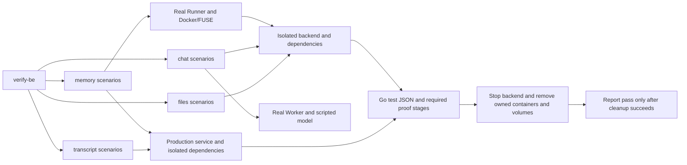

# Backend verification

`verify-be` replaces `verify-chat` with domain commands. It shares the existing isolated environment, image preflight, source fingerprint, Go test JSON verdict, reports and cleanup. `chat` retains its six scenarios and performance gate; `files` adds independent HTTP/object-store scenarios; `transcript` runs archive integration scenarios over real PostgreSQL/MinIO. `memory` adds production-handler integration scenarios and real Runner/FUSE mount coverage. `deployment` verifies production Run creation, asynchronous River execution/retry, occurrence deduplication and process recovery. No old CLI aliases are retained.

```sh
just verify-be -h
just verify-be chat doctor public
just verify-be chat roundtrip
just verify-be files doctor
just verify-be files invalid
just verify-be files isolation
just verify-be files lifecycle
just verify-be files storage
just verify-be files attachments
just verify-be files platform
just verify-be files recovery
just verify-be files doctor generated
just verify-be files generated
```

Scenario identities in reports use `chat.roundtrip`, etc., and `files.lifecycle`, `files.isolation`, `files.invalid`, `files.storage`, `files.attachments`, `files.platform`, `files.recovery`, `files.exhaustion`, `files.generated`, `files.performance`, `files.cloud-storage`, `chat.cloud-renewal`. Use `DOMAIN SCENARIO`, not `run DOMAIN.SCENARIO`. `--timeout` applies to all scenario commands. Worker flags belong to `chat`, `files generated` and `memory mounts`; baseline/backend-ref/diagnostics flags belong to both performance commands. Help does not load runtime settings. Root `doctor` checks common dependencies; a cloud-specific doctor checks only its explicit private configuration.

The implementation lives in `cmd/verify-be`; the reusable shell entry only builds/executes Go. The project Skill and maps live in `.agents/skills/verify-be/`. Local settings move to `.verify-be.local.json`, evidence to `tmp/verify-be/`, owned container labels to `oma.verify-be.run`. Old evidence directories are retained. The backend PR workflow has separate Chat, Files, Transcript, Memory and Deployment verification jobs; branch protection should require all five.



## Deployment / River verification contract

See the [Deployment feature map](../../../.agents/skills/verify-be/features/deployment.md). `deployment.lifecycle`, `deployment.retry`, `deployment.idempotency` and `deployment.restart` reuse existing Go integration fixtures with a unique business schema and the isolated environment's real PostgreSQL/River. `VERIFY_BE_DEPLOYMENT=1` is supplied only to selected scenarios; ordinary suites skip them explicitly. They start asynchronous River consumers and compare the Job terminal state with Run error, Deployment status/schedule, public API responses and Session/Thread/Work/initial event/Filestore rows. A completed River Job may mean a permanent failure Run or an intentional stale-job no-op, so completion alone is insufficient.

Retry faults reject Run insertion after Session writes, verify total transaction rollback, and wait for real default River backoff and automatic attempts without modifying retry eligibility. Persistent faults use a two-attempt budget and require discarded state with no effects. Duplicate jobs share one occurrence and run on a ten-worker queue; all must complete while preserving one business Run and associated rows. Durable dispatch is made due with River's upsert API; it still uses River leader scheduling and the production occurrence-stamping hook.

Restart launches a separate process with the production scheduled Worker, Store and PostgreSQL listener/driver. A test PostgreSQL lock holds business writes before Run insertion; a test middleware holds the process after business commit and before River completion. SIGKILL at each barrier must leave respectively zero effects or exactly the original committed effects. A fresh process must rescue and finish the same Job; the latter case preserves Run and Session IDs. Restart also verifies dispatch and cursor advancement for a durable schedule persisted while all worker processes were stopped. The test process sets Job timeout/rescue threshold to 10s/15s; the production one-hour rescue delay, full API/Runner restart, Session model execution, cloud side effects and throughput remain unverified. The other three scenarios use the production River client configuration. Deadlines are 3m, or 5m for restart.

The PR workflow adds `Deployment verification` and runs all four scenarios. Branch protection must be configured separately to require this job. Reports retain explicit boundaries, skip rejection, source identity and cleanup gates.

## Memory / Filestore verification contract

See the [Memory feature map](../../../.agents/skills/verify-be/features/memory.md). `memory.integrity`, `memory.isolation`, `memory.cleanup`, `memory.lifecycle` and `memory.filestore` select existing `tests` package fixtures with unique PostgreSQL schemas and real MinIO. They use production HTTP handlers in the test process with `DependenciesOnly`, no standalone backend or Worker. `VERIFY_BE_MEMORY=1` is supplied only to the selected scenario. Default Go suites explicitly list these scenarios as skipped.

The contracts cover invalid writes, path conflicts, missing objects and repair, read-only mounts, token/filesystem and tenant scope, archived-store rejection, old token revocation, immutable versions and Session deletion preserving shared Memory. Ordinary Filestore checks cover overwrite/copy/move/remove byte equality, more than 100 owned objects spanning cleanup batches, zero final quota and Memory survival. Cleanup checks test-side upload/delete/enqueue failures, transactional store-delete/redaction rollback on enqueue rejection, durable compensation jobs, retry attempts, retained bytes, completion idempotency and real unversioned MinIO removal of all Memory object keys. Portable fixtures assert bucket versioning is disabled; Memory history uses independent immutable object keys.

`memory.mounts` runs the actual backend and background Runner with the existing local Docker Provider and real rclone/FUSE, using public Session/resource creation. It injects failure while writing `MEMORY.md` after mounts start and verifies that the allocated sandbox is removed and no CodeSession becomes visible. Success checks all five fixed mounts, two Memory mounts, read-only rejection, literal seed bytes, literal Markdown and token-config removal. A write through FUSE must persist exact S3 bytes with a `session_actor` version. The fixture explicitly kills the first container; another Session must read those store bytes while its local root contains a rebuilt Markdown file and no first-session scratch file. No upstream model response or tool turn is used in this scenario.

The portable scenarios drive production cleanup with `RunOnce` and explicitly advance retry eligibility and a pending orphan guard created by rejected ordinary overwrite. Automatic loop/backoff timing, crash recovery, concurrent editing, performance, cloud IAM/allocation, token renewal and browser rendering remain outside coverage. Portable deadlines are 3m, `mounts` 8m. The Memory CI job runs five portable scenarios; actual mounts run in the Worker job after its FUSE preflight. The verdict collects proof stages only from the selected test or its slash-delimited descendants in the registered package; sibling prefixes cannot supply proof. Reports reject skipped tests, missing stages, source mutation or incomplete cleanup.

## Transcript verification contract

See the [Transcript feature map](../../../.agents/skills/verify-be/features/transcript.md). `transcript doctor` checks common dependencies without loading a Worker image or requiring FUSE. Scenario registration sets `DependenciesOnly`; the environment starts the disposable Compose dependencies and supplies a private configuration without building or starting a standalone backend. Reports describe this execution scope instead of claiming compiled-backend coverage. The registered tests live in the existing `tests` package and reuse its schema/session fixtures. They opt in through the CLI's child environment; ordinary `go test ./...` and `verify-be test` skip them explicitly.

`transcript lifecycle` compares export bytes through archive, hard deletion and real cleanup of an old external payload, then invokes the actual `cmd/transcript-archive` export/restore commands twice. It checks private HTTP bytes, sequence watermark and foreign workspace isolation. `boundary` interleaves foreground/subagent events and checks that their separate compaction boundaries remain visible through soft deletion, hard deletion and restore.

`recovery` injects errors before/after real upload and rejects later DB batches with schema-local triggers. It checks pending expiration/rebuild, retained manifest identity after upload, partial batch progress and idempotent retries, including the 500-record restore boundary. `concurrency` pauses an upload caller after persistence and lets another caller recover the same pending segment, checking one upload and manifest. `integrity` removes/corrupts real MinIO objects; export, restore and deletion must fail without modifying covered rows, then succeed after repair.

Attached archive objects remain the recoverable copy after source rows and old payload blobs are removed. Fixtures explicitly age rows and invoke the production cleanup Worker with `RunOnce`. Fault wrappers only surround real storage calls in test code. No production fault controls, schema migrations or archive API changes are introduced. These scenarios do not verify five-minute River sweeps, automatic River retries, process crash/restart behavior, cloud IAM or throughput. Lifecycle/recovery default to five minutes; others to three, with the shared `--timeout` override.

The PR workflow adds `Transcript verification` with all five scenarios and JSON/Markdown evidence uploads. Branch protection configuration remains an external administrative step.

## Files verification contract

See the [Files feature map](../../../.agents/skills/verify-be/features/files.md) for commands, proof stages and exact assertions. `tests/livefiles` uses public HTTP against the real compiled backend, existing DB APIs for fixtures/observations, and real MinIO for byte and object-existence checks. `files generated` lives in `tests/liveworker`, uses the real Worker/FUSE with a scripted model and requires scenario-specific preflight. Redis/NATS remain startup dependencies of the backend.

Failure cases run before success cases. Invalid uploads include authentication, beta opt-in, malformed multipart, missing file, invalid filename, 64 KiB file limit and request-body limit. A 96 KiB workspace quota allows an accepted 64 KiB object followed by an over-quota request; object listing and metadata/usage checks prove rollback. Rejection must not break the next valid upload.

Isolation covers a second workspace in the same organization and a workspace in another organization. Both uploaded and downloadable files reject foreign metadata/content/delete requests and remain absent from foreign listings including cursor queries. The owner retains the original objects and API access after these requests.

Lifecycle checks binary bytes, UTF-8 names, metadata equality, SHA-256, pagination, download bytes and object deletion. Uploads remain `downloadable=false` according to the existing Files contract. A separate downloadable record/object fixture verifies the content endpoint. The separate `generated` scenario drives the actual Worker output generation and Filestore projection with SDK-triggered Write with preallowed permission, then verifies scoped Files listing, Session resources and downloaded/object bytes.

Storage checks missing-object error translation, seeded background cleanup, real multipart abort cleanup, invalid credentials, forced TCP disconnect/recovery, exact-version deletion and removal of all versions/delete markers. The multipart case calls the actual storage adapter with a stream larger than its 16 MiB part threshold; it does not raise the HTTP file limit.

The `recovery` scenario exercises automatic compensation after both API deletion failure and over-quota rollback failure. A Go loopback reverse proxy preserves signed S3 requests and can deny selected methods beneath the isolated bucket. Tests observe two denied DELETEs per object: the HTTP compensation attempt and a background attempt. After recovery, cleanup must occur no earlier than the production one-minute retry delay. The tests do not insert, lease or expedite those jobs. The proxy closes with the environment and is never included in the production backend.

`attachments` verifies active-reference conflicts, unlink-and-delete, TTL visibility, archive retention and Session deletion cleanup without deleting shared source uploads. The output fixtures use `PutFilestoreFile`; expiry alone is not asserted to physically remove bytes. `platform` uses the real isolated development login and checks base64 validation, preview equality, thumbnail dimensions/content and derived-object cleanup.

`files exhaustion` runs the production cleanup Worker against real PostgreSQL and MinIO, expediting a scheduled fixture before each failed DELETE. A workspace-scoped Yourbatis state query reports status, attempts and run_after. Assertions cover all ten attempts, capped quadratic backoff timestamps, failed status, no implicit recovery, explicit expedite and completed-job idempotency. This accelerates the 199-minute schedule; `files recovery` separately verifies real waiting and automatic enqueue. The state query changes no write policy, HTTP API or schema.

`files performance` adds a separate versioned workload: two warmups, twenty serial rounds, 32 KiB deterministic content and a 250 ms gap. It measures upload, metadata, list, download and delete request completion. Download uses a downloadable fixture because ordinary uploads are not downloadable. Each round validates bytes and removal; final quota/list/object state must be empty. Baseline validation requires explicit backend commit, matching scenario, workload hash, image IDs, tools and host. The existing P50/P95 25% + 25 ms gate and diagnostic collection are reused. See [Files performance](../../../.agents/skills/verify-be/features/files-performance.md).

`files cloud-storage` and `chat cloud-renewal` are independent Go CLI assertions over the production provider adapters, with explicit private YAML configuration. Missing/invalid config is blocked before remote requests. Storage verifies owner/read-only access, rejected mutation, byte equality and owned-object cleanup. E2B verifies sandbox creation, production SetTimeout, observed deadline extension and deletion. Manifests retain owned keys/IDs for crash recovery; cleanup failure prevents pass. Unknown sandbox creation outcome is not reported as clean. These checks do not certify all IAM/firewall policies or the public chat tool-confirmation path. See [cloud contract](../../../.agents/skills/verify-be/features/cloud.md).

Every run rejects skips, missing proof stages, package/test failure, source mutation and cleanup failure. Files doctor resolves only common images except when explicitly selecting `generated`, which also resolves the Worker image and probes FUSE. The existing [chat design](chat-verification.md) describes chat-specific workload and performance semantics.

## Validation

`just verify-be test` runs the complete default-build Go suite against disposable dependencies, including local MinIO. It reuses the Go dependency/config/cleanup implementation, creates no standalone backend, and enables `TEST_MIGRATION_DATABASE_URL`, `TEST_EVENT_PAYLOAD_S3`, `REDIS_URL`, `TEST_TUNNEL_REDIS_ADDR` and the S3 integration environment. Inherited test targets and opt-in flags are removed. This avoids the default `just test` configuration pointing at a reused development database. It does not reset or migrate that shared database.

The JSON/Markdown report retains package/test outcomes and lists every skipped test as unverified. Missing or skipped required migration/S3/Redis integration tests fail the run. A successful Go command with optional skips uses `passed_with_skips`, not a full verification pass; exit 0 permits ordinary suite automation while preserving the incomplete coverage in its report. Live scenarios, cloud suites, additional build tags and external SDK language suites remain separate. Cleanup and source-identity checks apply to the suite as well.

Historical migration fixtures use their own schema, including the Session resources/Files unification fixture. That fixture exercises tenant UUID migration 42 before namespace unification 47 and Skill snapshots 48, checking rejected invalid references, rollback and writes after upgrading. Archive rollback tests explicitly roll back to before migration 62 and require its archive-preservation error, so later migrations cannot silently change the tested rollback. Restore and visibility tests explicitly age soft-deleted fixtures before asserting physical deletion; they do not depend on host and Docker database clocks agreeing at a zero-duration boundary. The suite also checks that child-thread pending tools do not block an otherwise idle primary thread, following the existing per-thread input contract.

The cleanup-job lifecycle fixture schedules its retry in the past before checking immediate re-leasing. The notification-driven sandbox lifecycle fixture waits for the River PostgreSQL listener before creating its due schedule; its one-hour fallback poll interval and 15-second dispatch deadline remain unchanged.

Run CLI/config/report unit tests, repository Go quality gates, all nine local Files functional scenarios, a Files performance baseline/gate and chat regression scenarios after changing shared orchestration. Reports include source/binary hashes, tools/image IDs, coverage boundaries and final cleanup status. CI runs eight Files functional scenarios independently of Worker image preparation and gates Files performance against the PR base; `generated` runs in the Worker job. Cloud checks require manual workflow input and protected environment configuration. Cloud reports and recovery IDs contain no credentials; raw configuration/logs/profiles are not uploaded.
