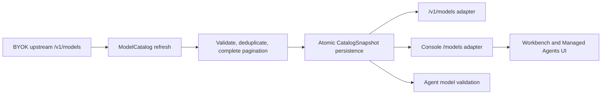

# BYOK Model Catalog

## Goal

The configured BYOK provider is the source of truth for selectable model IDs.
Open Managed Agents must not manufacture a provider-specific fallback catalog when
that provider is unavailable.

The catalog is global to an installation because the current upstream credential is
global. Tenant-specific credentials, provider routing, and cost accounting are
separate concerns and can later add catalog scopes without changing consumers.

## Domain Contract

`ModelCatalog` owns provider discovery, validation, publication, and catalog
freshness. A `CatalogSnapshot` contains only a complete provider result. `Model
Selection` is explicit: it comes from `model_catalog.default_model_id` or a user
choice. Catalog ordering is never a defaulting rule.

Model IDs are opaque strings. The catalog validates that an ID is non-empty and
stable enough to persist, but never infers a vendor, capability, or pricing tier
from its spelling.



## Refresh and Failure Semantics

The refresh worker fetches every upstream page before publishing anything. A page
error, malformed response, repeated cursor, or invalid model record rejects the
entire new result. The previous successful snapshot remains untouched.

| State | `/v1/models` | Console `/models` | New or updated Agent |
| --- | --- | --- | --- |
| Fresh snapshot | Returns the snapshot | Returns models and freshness metadata | Accepts IDs in the snapshot |
| Stale snapshot | Returns the last success | Returns models with `stale: true` | Accepts IDs in the stale snapshot |
| No successful snapshot | `503` catalog unavailable | `503` catalog unavailable | `503` catalog unavailable |
| Unknown ID | Not applicable | Not applicable | `400` invalid model selection |

Refresh attempts record their time and a safe failure category. They never store an
upstream credential, request URL query, response body, or raw transport error.

## Persistence

`model_catalog_snapshots` has one globally scoped row. It stores the most recent
successful structured model list, `last_attempt_at`, `last_success_at`, and a
sanitized `last_error` value. A successful refresh updates the list and timestamps
in one upsert. A failed refresh only updates the attempt metadata, leaving the last
successful list unchanged.

This schema intentionally uses a snapshot instead of one row per provider model:
the consumer contract is a coherent list, and a snapshot avoids presenting a mixed
result while paging or during partial provider failure. Future scoped catalogs can
add a catalog scope key without changing the public reader interface.

## API Adapters

`/v1/models` retains the Anthropic-compatible list shape and maps catalog fields
without fabricating unsupported capabilities. Console `/models` maps the same
catalog to the Workbench shape and includes catalog freshness metadata for the UI.
Neither endpoint contacts the provider directly.

The Managed Agents create and update paths validate a submitted model ID through
the catalog. Existing Agent versions and Session snapshots are read unchanged;
they are historical references, not fresh selections.

## Client Behavior

Workbench, templates, and Quickstart load the Console catalog before presenting
model choices. Templates are model-neutral. Quickstart uses the selected model for
its own request and derives the `build_agent_config` model schema from the catalog.
When no configured default exists, the UI requires a selection instead of choosing
the first result.

Provider capability fields are passed through only when supplied by the catalog.
Unknown capabilities are represented conservatively in the UI rather than derived
from a model name.

## Configuration

The catalog reuses `anthropic_upstream.base_url` and
`anthropic_upstream.api_key`, so there is one BYOK credential boundary. Its own
settings are:

```yaml
model_catalog:
  refresh_interval: 5m
  refresh_timeout: 15s
  default_model_id: ""
```

`default_model_id` is optional. It is only exposed as a default after a successful
snapshot contains exactly that opaque ID.
