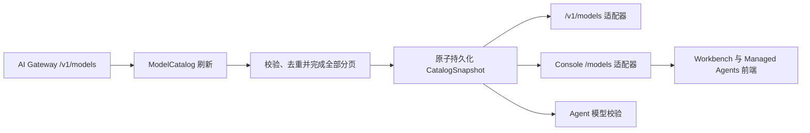

# BYOK 模型目录

## 目标

配置的 AI Gateway 是可选模型 ID 的事实来源。AI Gateway 不可用时，Open Managed Agents 不得生成特定供应商的回退模型目录。

当前上游凭证是安装级配置，因此模型目录同样作用于整套安装。租户级凭证、供应商路由和成本核算属于独立能力；未来可以在不改变消费者接口的前提下增加目录作用域。

## 领域合同

`ModelCatalog` 负责模型发现、校验、发布和目录新鲜度。`CatalogSnapshot` 只包含一次完整的 AI Gateway 返回结果。`Model Selection` 优先使用有效的 `model_catalog.default_model_id`；未配置有效默认值时，客户端使用目录第一项作为初始选择，用户仍可显式切换。对于省略模型的 Workbench 生成请求，服务端在同一快照内使用相同的目录首项回退，避免客户端状态尚未保存时出现不一致。

模型 ID 是不透明字符串。目录只校验 ID 非空且可稳定持久化，不根据其拼写推断供应商、能力或价格层级。

模型能力同样以 AI Gateway 的声明为准。目录将 `capabilities` 保存为开放字段集合，完整保留当前未知的 Gateway 扩展，同时为现有消费者提供已知能力视图，包括 Batch、引用、代码执行、上下文管理与压缩、Effort 等级、图片输入、PDF 输入、结构化输出、Thinking 类型和 Tool Use。图片、PDF、音频或视频输入是彼此独立的能力，不合并成含义模糊的“多模态”布尔值。

能力值采用三态语义：Gateway 明确返回 `supported: true` 表示支持，明确返回 `false` 表示不支持，未返回则表示未知。未知能力不得按模型 ID、供应商名称或前端默认值推断为支持或不支持。


```mermaid
flowchart LR
    U["AI Gateway /v1/models"] --> C["ModelCatalog 刷新"]
    C --> V["校验、去重并完成全部分页"]
    V --> S["原子持久化 CatalogSnapshot"]
    S --> A["/v1/models 适配器"]
    S --> W["Console /models 适配器"]
    S --> G["Agent 模型校验"]
    W --> F["Workbench 与 Managed Agents 前端"]
```

## 刷新与失败语义

刷新任务必须拉取全部上游分页后才能发布。任意分页失败、响应格式错误、游标重复或模型记录非法，都会拒绝整次新结果，并保留最近一次成功快照。

| 状态 | `/v1/models` | Console `/models` | 新建或更新 Agent |
| --- | --- | --- | --- |
| 新鲜快照 | 返回当前快照 | 返回模型与新鲜度元数据 | 接受快照内的 ID |
| 过期快照 | 返回最近一次成功快照 | 返回模型并标记 `stale: true` | 接受过期快照内的 ID |
| 从未成功同步 | 返回 `503` 目录不可用 | 返回 `503` 目录不可用 | 返回 `503` 目录不可用 |
| 未知 ID | 不适用 | 不适用 | 返回 `400` 模型选择无效 |

每次刷新会记录尝试时间和安全的失败分类，但不会持久化上游凭证、请求 URL 查询参数、响应正文或原始传输错误。

完整分页成功后返回零个模型属于有效的权威快照。该快照必须替换旧目录，确保已经从 AI Gateway 下线的模型不再可选；只有请求失败、响应非法或分页不完整时才保留旧快照并标记为过期。

## 持久化

`model_catalog_snapshots` 当前保存一条安装级记录，其中包含最近一次成功的结构化模型列表、`last_attempt_at`、`last_success_at` 和脱敏后的 `last_error`。成功刷新通过一次 upsert 同时更新模型列表和时间戳；失败刷新只更新时间和错误元数据，不修改最近一次成功列表。

这里有意采用快照，而不是为每个模型单独建行。消费者需要读取一致的完整列表，快照可以避免在分页过程中或部分失败时暴露混合状态。未来增加目录作用域时，可以扩展 catalog key，而不需要修改公开读取接口。

## API 适配器

`/v1/models` 使用命名 DTO 映射目录模型，不使用 `map[string]any` 动态拼装公开响应。列表支持 Anthropic 定义的 `limit`、`after_id` 和 `before_id`：`limit` 默认为 20，合法范围为 1–1000；游标在当前原子快照内解析。响应顺序保持 AI Gateway 顺序，因为 Anthropic 约定较新发布的模型排在前面。`GET /v1/models/{model_id}` 从同一快照读取单个模型。

公开模型对象只包含 Anthropic `ModelInfo` 字段：`id`、`type`、`display_name`、`created_at`、`max_input_tokens`、`max_tokens` 和 `capabilities`。目录内部或 Gateway 扩展的 `description` 不进入该公开响应。AI Gateway 声明 `created_at` 时必须使用 RFC 3339 字符串或 epoch 秒整数；token 上限不能为负数，`0` 作为“未知”的兼容占位值归一化为字段缺失。

当前 Anthropic 文档将 `created_at`、token 上限和完整 `capabilities` 标为必填，但 BYOK Gateway 可能只实现较早版本或兼容子集。OMA 的兼容策略是：`id` 必须存在，`display_name` 缺失时回退到 Gateway 的 `name` 或不透明 ID；其余增强字段仅在 Gateway 明确返回时透传。缺失字段不会被伪造成 epoch、0 或“不支持”，因为这些值会改变模型语义。完整实现当前 Anthropic Models API 的 Gateway 会得到完整 `ModelInfo`；兼容子集仍可用于模型选择，但客户端可以通过字段是否存在识别元数据未知。

Anthropic 当前定义的 `ModelCapabilities` 包含 Batch、引用、代码执行、上下文管理、Effort、图片输入、PDF 输入、结构化输出和 Thinking。目录对这些字段提供命名的三态视图，同时以递归的结构化 JSON 值保留未来官方字段和 Gateway 扩展；未知字段只在 Gateway、持久化和 HTTP 投影边界保持开放，不把 `json.RawMessage` 作为业务模型跨包传递。`tool_use` 当前属于 Gateway 扩展，不冒充 Anthropic 的已定义字段。

Console `/models` 将同一目录适配为 Workbench 所需结构，并向前端提供目录新鲜度元数据。两个读取接口都不会直接请求 AI Gateway。

Managed Agents 的创建和更新路径通过目录校验提交的模型 ID。既有 Agent Version 和 Session Snapshot 保持原样读取；它们是历史引用，不是新的模型选择。

Managed Agents 的 `model` 请求同时接受字符串 ID 和对象。对象支持 `speed: standard|fast`，也支持 `effort: low|medium|high|xhigh|max` 或 `{type: <level>}`；持久化响应把 effort 规范化为 `{type}`。使用对象更新同一个模型 ID 时，省略 effort 会保留已有值；传入字符串模型或切换模型 ID 时，省略 effort 则留给模型的 Gateway 默认值。OMA 不把 Anthropic 文档中的 Claude 型号枚举复制为本地白名单，模型 ID 仍由当前 BYOK 目录决定。

## 官方合同依据

截至 2026-07-25，本设计以以下 Anthropic 一手资料为准：

- [List Models API](https://platform.claude.com/docs/en/api/models/list)：列表字段、能力结构、分页参数、默认/最大 limit 及排序语义。
- [Get a Model API](https://platform.claude.com/docs/en/api/models/retrieve)：单模型读取路径和 `ModelInfo` 返回结构。
- [Create Agent API](https://platform.claude.com/docs/en/api/beta/agents/create)：Managed Agents 的 model 字符串/对象联合类型、speed 与 effort 输入形式。
- [Define your agent](https://platform.claude.com/docs/en/managed-agents/agent-setup)：Agent model 的配置语义，以及更新同模型时省略 effort 的保留规则。
- [Anthropic Go SDK 的生成类型](https://github.com/anthropics/anthropic-sdk-go/blob/main/model.go)：由官方 OpenAPI 生成的 `ModelInfo`、`ModelCapabilities` 和分页参数类型，用于交叉核对文档字段。

## 客户端行为

Workbench、模板和 Quickstart 在展示模型选项前读取 Console 模型目录。模板不携带固定模型。Quickstart 使用用户选择的模型发起请求，并根据当前目录生成 `build_agent_config` 的模型 schema。客户端优先选择目录声明的有效默认模型；未声明时选择目录第一项；空目录时保持未选择并显示目录不可用状态。

只有 AI Gateway 明确返回的能力字段才会透传。Console `/models` 同时返回完整 `capabilities` 对象和 Workbench 兼容字段；前端分别展示 Thinking、工具、图片和 PDF 等已声明能力。未知能力在前端按保守方式展示，不根据模型名称推断。

## 配置

模型目录复用 `anthropic_upstream.base_url` 和 `anthropic_upstream.api_key`，确保模型发现与模型请求使用同一个 AI Gateway 凭证边界。目录自身配置如下：

```yaml
model_catalog:
  refresh_interval: 5m
  refresh_timeout: 15s
  default_model_id: ""
```

`default_model_id` 是可选项。只有成功快照中包含完全相同的不透明 ID 时，该值才会作为安装级默认模型暴露给消费者。未暴露有效默认值时，客户端以目录第一项作为初始选择，但不会把该选择写回服务端配置。

## 组件边界

- `internal/modelcatalog` 负责上游分页、快照状态和模型领域类型；能力值使用命名的递归 JSON 类型保留未知扩展。
- `internal/db` 负责快照 SQL 和 session-scoped advisory lock。锁通过 pinned sqlx connection 获取和释放，`modelcatalog` 不直接操作 pgx pool。
- `internal/api` 在组装阶段把 catalog、upstream、persistence store 和 logger 注入 `workbenchHandler`；这些稳定依赖不放入 request context。
