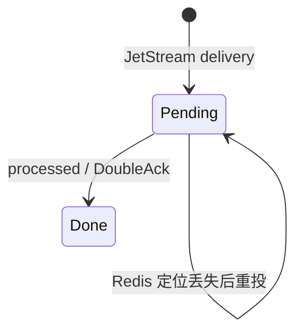

# 接口文档：Worker Events Delivery

## 概述

`POST /v1/code/sessions/{code_session_id}/worker/events/delivery` 是 worker 对 SSE
`client_event` 的应用级进度回执。HTTP/SSE 本身没有完成 ACK；只有 worker 上报 `processed` 后，
服务端才确认 JetStream 消息。

后端使用 Redis 临时定位 JetStream ACK subject，不把 delivery 状态写入 PostgreSQL。完整存储与
重投设计见 [Worker 入站投递后端设计](ccr-v2-worker-events-delivery-backend-design.md)，所有权语义见
[Worker Epoch 设计](ccr-v2-epoch-design.md)。

## 请求

Method 是 `POST`，URL 是：

```text
/v1/code/sessions/{code_session_id}/worker/events/delivery
```

请求使用 Session Ingress Bearer token 和 `Content-Type: application/json`。

```json
{
  "worker_epoch": 1,
  "updates": [
    {
      "event_id": "5e34a4de-456f-4bb5-ba2c-152cf71d3fa1",
      "status": "processing"
    }
  ]
}
```

校验规则：

- `worker_epoch` 必须存在，可以是 JSON integer 或 integer string，值必须为正 int64。
- `updates` 必须包含 1 到 64 项。
- `event_id` 必须是非空字符串，并与 SSE 帧中的 `event_id` 完全相同。
- `status` 只接受 `received`、`processing`、`processed`；`sent` 不合法。
- 请求 epoch 必须等于 PostgreSQL 中的 `current_worker_epoch`。

## 响应

成功响应：

```json
{
  "ok": true,
  "applied": 1,
  "ignored": 0
}
```

`applied` 表示找到当前 Session、当前 epoch 的 ACK subject 并执行了对应动作。`ignored` 表示 Redis
中没有该定位，常见原因是消息尚未通过 SSE 写出、键过期、Redis 重启、旧连接的延迟 ACK，或
同一 processed 回执重复到达。ignored 不是永久丢失：未 ACK 的 JetStream 消息会重投。

HTTP 状态语义：

- `200`：请求已处理；允许部分或全部 update 被 ignored。
- `400 invalid_request_error`：body、epoch、updates、event ID 或 status 非法。
- `401/403`：鉴权失败。
- `404 not_found_error`：Code Session 不存在。
- `409 conflict_error`：worker epoch 已被取代。
- `5xx`：Redis、JetStream、PostgreSQL 或其他服务端操作失败；worker 可以重试。

## 三种状态的后端行为

`received` 表示 worker 已从 SSE transport 接收事件。服务端向对应 JetStream delivery 发送
InProgress，并把 Redis ACK 映射 TTL 刷新为 20 分钟。

`processing` 表示 worker 开始处理命令。后端行为与 received 相同：发送 InProgress 并刷新 TTL。
它不写入持久状态，也不要求 received 必须先到。

`processed` 表示业务处理完成。服务端在 Yourbatis 事务内锁定 Code Session、校验当前 epoch，
持锁完成整个 delivery 批次，使 ACK 与 register/凭证轮换串行，然后：

1. 对 JetStream ACK subject 执行 DoubleAck；
2. 删除 Redis 映射；
3. 同事务更新 worker 活跃时间并释放锁；如果事件使用对象存储 payload，再把 cleanup job 提前到立即执行。

锁与 ACK 等待共享 5 秒超时，避免外部服务故障无限阻塞 epoch 接管。

如果 DoubleAck 失败，update 不计入 applied，Redis 映射保留，worker 重试时仍能重新确认。



这里的三态是调用语义，不是 PostgreSQL 状态机。服务端不再持久化
`queued → sent → received → processing → processed`，也不支持基于这些字段的 UI 查询。

## event_id 关联

SSE envelope 内部有稳定的 `csev_*` transport ID，也可能有稳定 payload UUID。服务端写 SSE 时优先把
payload UUID 作为 `event_id`；没有稳定 UUID 时才回退到 transport ID。worker 的 received、命令
lifecycle processing 和 processed 必须使用 SSE 暴露的同一个 ID。

重投会复用同一 `event_id`。业务请求以稳定 payload UUID 或 request ID 重试时，也会复用同一个
`Nats-Msg-Id` 并由 JetStream 去重。worker 不能使用 Redis key 或 JetStream ACK subject 推断 ID。

## 与 SSE 的关系

读取端点是：

```text
GET /v1/code/sessions/{code_session_id}/worker/events/stream?worker_epoch=<epoch>
```

服务端分别从该 Session 的任务和回应 durable consumer 拉取消息，完成大 payload 校验与还原，在 Redis 写入
ACK subject 后才 flush SSE。两路 consumer 各自的 `MaxAckPending=1`，因此只阻塞同一路的下一条消息。控制回应可以在
当前用户命令 processed 之前到达，解除工具审批等待；两路仍复用一条 SSE 和同一个 delivery API。

SSE 的序号保留 Stream sequence。控制回应越过排队输入时序号可能非单调，不能用最大序号
过滤尚未处理的输入。ACK 定位仍按 session、epoch 和 event ID 隔离，能够指向任一路 consumer。

SSE 断开不会删除 consumer。`from_sequence_num` 与 `Last-Event-ID` 仍接受非负整数，但不修改
JetStream ACK floor。旧 `GET /v1/code/sessions/{code_session_id}` poll 入口已经移除。

## 客户端调用建议

- SSE 回调收到每条 `client_event` 后立即异步上报 received。
- 命令开始时上报 processing；长任务应周期性重复上报 processing，避免 20 分钟 Redis TTL 过期。
- 命令真正完成后上报 processed。
- delivery uploader 应串行批量提交并对网络错误和 5xx 无限重试。
- 收到 409 时停止旧 worker，不再重试该 epoch。

## 验收

- 正整数/string epoch 与最多 64 条 update 可成功解析；非法输入返回 400。
- 当前 epoch 的 received/processing 刷新映射且不移除 JetStream 消息。
- 当前 epoch 的 processed DoubleAck 并移除消息。
- 旧 epoch 返回 409，不能 ACK 新 epoch 的消息。
- 缺失或过期 Redis 映射计入 ignored，重连后消息可重投。
- 大 payload processed 后 cleanup job 立即可执行。
