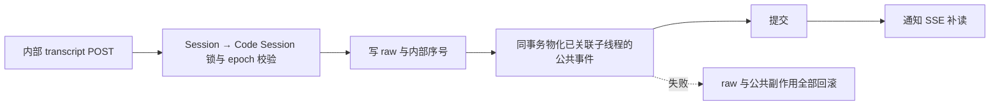

# CCR v2 Worker Internal Events 后端实现设计

本文记录 `POST/GET /v1/code/sessions/{code_session_id}/worker/internal-events` 的当前后端实现。该端点将原始 transcript 保存到私有表，供 CCR v2 resume 使用。foreground transcript 保持私有；能关联到 Session 子线程的 subagent transcript 会转换为公开事件并写入 `session_events`，供历史 API 与 SSE 共用。

相关文档：

- epoch 语义：[`ccr-v2-epoch-design.md`](ccr-v2-epoch-design.md)
- worker events delivery：[`ccr-v2-worker-events-delivery-backend-design.md`](ccr-v2-worker-events-delivery-backend-design.md)

---

## 1. 目标与边界

`/worker/internal-events` 只保存 Claude Code worker 产生的 transcript 事件：

| 能力 | 当前实现 |
|---|---|
| 私有 transcript 落库 | 是，写入 `code_session_internal_events` |
| 前端可见事件 | 已关联子线程的 subagent transcript 可物化到 `session_events`；foreground 保持私有 |
| worker output event | 否；outbound 私有日志已移除，公开输出直接进入 `session_events` |
| 前端 SSE 广播 | 公开事件提交后发送通知，SSE 从数据库有序补读 |
| CCR v2 resume 读取 | 是，配套 `GET /worker/internal-events` |
| worker epoch 写保护 | POST 在 DB 事务内校验 |

该接口当前是 CCR v2 resume 的 transcript 持久化通道，只接受可原样写回 Claude Code transcript JSONL 的 `TranscriptMessage` payload。真实 wire payload 是 `TranscriptMessage` 本体，`payload.type` 使用消息自己的 discriminator：`user` / `assistant` / `attachment` / `system`。公开 worker 输出仍走 `/worker/events`，worker delivery ACK 仍走 `/worker/events/delivery`。

协议来源以 `superduck-code` 的 TS 实现为准：

- `src/utils/sessionStorage.ts:isTranscriptMessage()` 将 transcript entry 限定为 `user` / `assistant` / `attachment` / `system`。
- `src/utils/sessionStorage.ts:persistToRemote()` 调用 `internalEventWriter('transcript', entry, ...)`。
- `src/cli/transports/ccrClient.ts:writeInternalEvent()` 构造 payload 时先写 `type: eventType`，再展开 `...payload`，因此 `entry.type` 会覆盖 `"transcript"`。
- resume 时 `hydrateFromCCRv2InternalEvents()` 会把 GET 返回的 `event.payload` 原样写回 JSONL transcript 文件。

---

## 2. 路由与鉴权

路由注册为同一个 handler：

```text
/v1/code/sessions/{code_session_id}/worker/internal-events
```

handler 支持：

| Method | 行为 |
|---|---|
| `POST` | worker 写入 transcript |
| `GET` | worker resume 读取 transcript |
| 其他 method | `405 invalid_request_error` |

本文统一使用 `code_session_id` 表示路由中的 code session external ID；数据库字段 `code_session_external_id` 存储的是同一个值。

处理入口先执行 worker/session 鉴权，再读取 `code_sessions`：

1. 鉴权失败返回 `401 authentication_error`。
2. code session 不存在返回 `404 not_found_error`。
3. 只有 `POST` 需要 body 中的 `worker_epoch`。
4. `GET` 不要求 `worker_epoch`，只做鉴权和 session 存在校验。

生产契约要求 `Authorization: Bearer <session_access_token>`。当前本地兼容层仍接受 `Authorization: Bearer <code_session_id>`，但该路径仅作为 local/non-production 兼容 shim，不是生产支持的鉴权模式。

---

## 3. POST 请求契约

### 3.1 Body

```jsonc
{
  "worker_epoch": 1,
  "events": [
    {
      "payload": {
        "uuid": "msg_01H...",
        "type": "user",
        "parentUuid": null,
        "isSidechain": false,
        "message": { "role": "user", "content": "hello" }
      },
      "is_compaction": false,
      "agent_id": "agent_01H...",
      "event_metadata": {
        "source": "sessionStorage"
      }
    }
  ]
}
```

| 字段 | 必填 | 当前校验 |
|---|---|---|
| `worker_epoch` | 是 | 必须是正整数；不匹配当前 epoch 返回 `409 conflict_error` |
| `events` | 是 | 必须是数组；允许空数组 |
| `events[].payload` | 是 | 必须是 JSON object |
| `events[].payload.type` | 是 | 必须是 `user` / `assistant` / `attachment` / `system` |
| `events[].payload.uuid` | 是 | 必须是非空字符串；作为幂等键 |
| `events[].is_compaction` | 否 | 如果存在，必须是 boolean |
| `events[].agent_id` | 否 | 如果存在，必须是 string |
| `events[].event_metadata` | 否 | 任意 JSON 值；持久化后在 GET 响应返回 |

`payload` 按 opaque JSON object 原样持久化。后端只做恢复路径必须的轻量校验，不重写 `payload.type`，也不把 transcript entry 再包一层。TS 侧 `TranscriptMessage = SerializedMessage & { parentUuid, isSidechain, agentId?... }`，常见字段包括：

| 字段 | 来源 | 说明 |
|---|---|---|
| `type` | `Message.type` | transcript discriminator，允许 `user` / `assistant` / `attachment` / `system` |
| `uuid` | `Message.uuid` | 幂等键来源 |
| `parentUuid` | `TranscriptMessage.parentUuid` | 父消息；compaction 边界可为 `null` |
| `logicalParentUuid` | `TranscriptMessage.logicalParentUuid` | session break/compaction 兼容字段，可选 |
| `isSidechain` | `TranscriptMessage.isSidechain` | 是否 sidechain |
| `agentId` | `TranscriptMessage.agentId` | subagent ID，可选；可补全顶层 `agent_id` |
| `cwd` / `userType` / `sessionId` / `timestamp` / `version` | `SerializedMessage` | Claude Code 写 transcript 时携带的 session-stamp 字段 |
| `message` / `attachment` / 其他字段 | `Message` subtype | 由具体 `type` 决定，后端不解析 |

`agent_id` 解析规则：

1. event 顶层 `agent_id` 与 `payload.agentId` 都存在时，两者必须相同，否则返回 `400 invalid_request_error`。
2. 只有顶层 `agent_id` 存在时使用顶层值。
3. 只有 `payload.agentId` 存在时兼容使用 payload 值。
4. 两者都缺失时视为 foreground transcript，数据库中 `agent_id is null`。

`events: []` 是合法请求。它在事务中校验 `worker_epoch`，不插入内部事件；与非空请求一样，在同一事务中尝试已有子线程 transcript 的公开物化，提交后返回 `{"ok": true}`。

### 3.2 响应与错误

成功响应固定为：

```json
{
  "ok": true
}
```

错误响应继续使用 `httpapi.WriteError` 的 Anthropic-compatible 形状：

| 状态码 | 场景 |
|---|---|
| `400` | JSON 非法、缺少 `events`、payload 非 object、缺少 `payload.uuid`、非 transcript entry 类型等 |
| `401` | 鉴权失败 |
| `404` | code session 不存在 |
| `409` | `worker_epoch` 不是当前 epoch、raw/公共事件身份或内容冲突、Session 已归档 |
| `413` | body 超过现有大小限制 |
| `5xx` | 数据库或服务端错误 |

---

## 4. 写入事务

HTTP 入口调用：

```go
service.CommitWorkerSessionEvents(ctx, codeSessionID, workerEpoch, nil, inputs)
```

复用现有 `ManagedAgentEventTx`，所有 Mapper 使用同一个 Yourbatis executor：

1. 锁定所属 Session，拒绝已归档或不存在的 Session。
2. 锁定该 Session 范围内的 Code Session，复验原请求 `workerEpoch`。
3. 按请求顺序插入 raw internal 记录；重复 `idempotency_key` 在同一事务内比较内容与归属，等价重试跳过，冲突返回 `409 conflict_error` 并回滚本批写入。
4. 按新记录数量推进 `last_internal_sequence_num`。
5. 读取全部分页的子线程映射，按内部序号读取完整 subagent transcript；通过公开 Session mapper 物化已能确定所属线程的事件。
6. raw、内部序号、公共事件及其状态一起提交；任何转换、幂等冲突或写入失败均一起回滚。
7. 提交后调用 `PublicEventSink.NotifyCodeSessionEvents`，通知 SSE 从数据库有序补读。



`PublicEventSink.AppendCodeSessionEvents` 只在调用方已锁定的事务内做公开转换和写入，不自行提交或提前广播。旧 worker 若在公共提交前失去 epoch，会返回 `409`，不会留下 raw 或公开状态。缺少事件 sink 时返回错误，不静默接受无法公开的写入。

没有线程映射的 transcript 暂时只保存在私有表。后续 `/worker/events` 在同一事务中先写新的线程及协调事件，再物化已有 transcript；物化失败时新线程也回滚。重复请求即使没有新 raw，仍会尝试已有 transcript，以支持升级前未物化记录的恢复。该恢复由 worker 写入触发，未新增后台补齐任务。

公共物化不采用 resume GET 的 compaction 边界：即使 compaction 先于线程映射到达，压缩前的公共消息也必须保留。raw 与 thread-created 的查询都读完分页，不以 500 条为总上限。公开历史 GET 只读已提交事件，已删除原先“子线程为空则补写”的路径；刷新不会改变事件内容或推进处理时钟。

子线程 raw `system` 与普通 worker 输出共用进度映射：`compact_boundary` 生成无原始压缩 metadata 的 `agent.thread_context_compacted`；`api_retry` / `api_error` 生成 `session.error`，`retry_status.type` 固定为 `retrying`。初始化、compacting 中间状态和其他诊断不再变成 `system.message`，raw 表与 resume GET 仍保留原始 transcript。API 重试的计数到达上限不等于已经失败耗尽，耗尽仍需单独的真实结束事实。该映射不新增 idle 或 rescheduled 状态，也不改写历史中已经存储的旧 `system.message`；升级后补物化采用带 subtype 的稳定 ID，避免把旧事件改类型。同一 subtype/source 重试仍生成同一新 ID。

### 4.1 幂等键

`payload.uuid` 是 transcript 事件的 canonical 幂等键。当前实现生成：

```text
<code_session_id>:internal:uuid:<payload.uuid>
```

raw 去重在同一个 code session 内生效，数据库只保留一条 internal event。重复写入比较 code session、事件类型、payload UUID、agent owner、compaction 标记、payload 和 metadata；payload 与 metadata 按 JSONB 语义比较，因此对象键顺序和等价数字写法不构成冲突，大整数的实际差异仍构成冲突。缺失 metadata 与已有对象不同。服务端生成的 external ID、时间、序号及原始字节 hash 不参与重试比较。

等价重试保留原记录、时间和序号；同身份不同内容返回 `409 conflict_error`，本批先前新插入的 raw、内部序号和公共副作用全部回滚，响应不包含事件正文。这替代了旧版无条件跳过的行为；worker 重试必须发送原事件。相同 payload UUID 在另一个 code session 中仍是独立事件。HTTP 是否成功还取决于同事务的公共物化，不能用“raw 是重复记录”跳过物化或吞掉错误。

### 4.2 顺序号

`sequence_num` 是 code session 级别的 internal transcript 顺序号，来源于 `code_sessions.last_internal_sequence_num + 1`。foreground 和所有 subagent 共用同一全局递增序列，因此 GET 合并流可以按 `sequence_num asc` 稳定分页。

---

## 5. 数据模型

schema 通过 goose migration：

```text
internal/db/migrations/00009_add_code_session_internal_events.sql
```

新增 `code_sessions.last_internal_sequence_num bigint not null default 0`。

新增表 `code_session_internal_events`，核心字段：

| 字段 | 含义 |
|---|---|
| `external_id` | 对外返回的 `event_id` |
| `organization_uuid` / `workspace_uuid` | 稳定的 scope 标识 |
| `code_session_uuid` / `code_session_external_id` | code session 稳定引用与协议标识 |
| `sequence_num` | code session 内 internal event 顺序 |
| `event_type` | 来自 `payload.type`，即 `user` / `assistant` / `attachment` / `system` |
| `payload_uuid` | `payload.uuid` |
| `agent_id` | null 表示 foreground；非 null 表示 subagent |
| `is_compaction` | compaction 边界标记 |
| `payload` | 原始 transcript payload |
| `payload_hash` | 保留空白、字段和编码形式的原始 JSON 内容 hash |
| `idempotency_key` | 基于 `payload.uuid` 的去重键 |
| `event_metadata` | 可选事件元数据 |
| `created_at` / `updated_at` / `deleted_at` | 标准时间字段 |

按项目 schema 规则，该表不创建 PostgreSQL foreign key。完整性由写入事务、测试和 no-FK guard 维护。

索引按当前查询路径设计，均包含 workspace/code session scope：

| 索引用途 | 查询 |
|---|---|
| sequence unique | 同一 code session 内 `sequence_num` 唯一 |
| idempotency unique | 同一 code session 内幂等插入 |
| foreground list | `agent_id is null` 的 GET 分页 |
| subagent list | `agent_id is not null` 的 GET 分页 |
| foreground compaction | foreground 最新 compaction 边界 |
| subagent compaction | 每个 subagent 最新 compaction 边界 |

---

## 6. GET 请求契约

`GET /worker/internal-events` 用于 CCR v2 resume 读取 transcript，不携带 `worker_epoch`。

Query 参数：

| 参数 | 默认 | 当前语义 |
|---|---|---|
| `subagents` | `false` | `false` 只读 foreground；`true` 只读所有 subagent 合并流 |
| `cursor` | 空 | 上一页最后一条 `sequence_num` 的十进制字符串 |

分页固定页大小为 500。`cursor` 必须是非负十进制整数，非法返回 `400 invalid_request_error`。

响应：

```jsonc
{
  "data": [
    {
      "event_id": "csev_int_...",
      "event_type": "user",
      "payload": { "uuid": "msg_01H...", "type": "user", "parentUuid": null, "isSidechain": false },
      "event_metadata": null,
      "is_compaction": false,
      "created_at": "2026-07-01T10:00:00Z",
      "agent_id": "agent_01H..."
    }
  ],
  "next_cursor": "123"
}
```

响应字段：

| 字段 | 含义 |
|---|---|
| `event_id` | internal event 的 external id |
| `event_type` | 来自 `payload.type`，与 payload 保持一致 |
| `payload` | 持久化的 transcript payload |
| `event_metadata` | POST 传入的 metadata；没有则为 `null` |
| `is_compaction` | 是否 compaction 边界 |
| `created_at` | 事件落库时间 |
| `agent_id` | subagent 事件才返回；foreground 省略 |

`next_cursor` 仅在还有下一页时返回字符串；没有更多数据时为 `null`。

---

## 7. Compaction 过滤

GET 不返回完整历史，而是从每个 scope 的最近一次 compaction 边界开始返回：

- foreground scope：`agent_id is null`，只计算 foreground 的最近 compaction。
- subagents scope：`agent_id is not null`，按每个 `agent_id` 独立计算最近 compaction，再合并返回。

边界事件本身会包含在结果中：

```text
old event
old event
compaction boundary   <- GET 包含
new event             <- GET 包含
```

原因是 compaction 边界事件携带压缩后的 resume state，worker 需要它来恢复对话上下文。

当前 list 查询通过 window function 计算 `boundary_sequence_num`：

```text
max(sequence_num) filter (where is_compaction) over (partition by agent_id)
```

然后过滤：

```text
sequence_num >= boundary_sequence_num
sequence_num > cursor
```

如果某个 scope 从未发生 compaction，则返回该 scope 的全部事件。

---

## 8. Scope 与安全过滤

读路径显式带入：

```go
WorkspaceUUID
CodeSessionExternalID
Subagents
AfterSequence
Limit
```

SQL 同时过滤：

```sql
e.workspace_uuid = CAST(:workspace_uuid AS uuid)
and e.code_session_external_id = :code_session_external_id
```

这样可以避免只按 external id 查询时误读其他 workspace 的数据，也让索引路径和迁移中的索引前缀一致。

---

## 9. 测试覆盖

当前测试覆盖点：

| 测试场景 | 期望 |
|---|---|
| POST success + GET | transcript 按顺序落库并读回 |
| private channel | foreground 不创建公开事件；已关联 subagent 物化失败会同时回滚 raw 和内部序号，重试只保存一份 |
| delayed mapping | 新线程与已有 transcript 的物化一起提交/回滚；超过 500 条映射仍能定位 owner |
| public compaction | 公开 transcript 保留压缩前消息，resume GET 仍从压缩边界开始 |
| history reads | 公开线程历史 GET 不补写记录，不推进处理时钟 |
| stale epoch | 返回 `409 conflict_error`，包括空 `events` 请求 |
| duplicate retry | 同一 `payload.uuid` 的原样/JSON 等价重试只存一条，原内容、时间、序号与公共水位不变 |
| conflicting retry | payload、大整数、类型、owner、compaction 或 metadata 变化返回 409，本批先前新记录一起回滚；另一个 code session 可复用 source UUID |
| compaction filtering | 返回最近边界事件和之后事件，排除更旧历史 |
| subagents | `subagents=true` 排除 foreground，并按每个 `agent_id` 独立 compaction |
| cursor pagination | 500 固定页大小，无重复、无缺口 |
| invalid payloads | 缺少 `events`、payload 非 object、缺少 uuid、非 transcript entry 类型等返回 400 |
| invalid cursor | 返回 400 |
| unsupported method | 返回 405 |
| schema guard | no-FK 测试包含 `code_session_internal_events` |

---

## 10. 已知实现取舍

1. raw internal 保留 `ON CONFLICT DO NOTHING`，仅命中重复键后增加同事务 JSONB/归属比较；新事件不增加预查，不新增表或索引。raw 和公开事件使用各自的身份及内容比较合同。
2. GET 的 compaction 查询先在 scoped CTE 内计算边界，再做 cursor/limit 分页。它优先保证语义清晰；如果 internal event 历史非常大，可以后续将 compaction boundary 查询拆成更窄的索引查找。
3. `created_at` 当前由 append 批次统一设置，同一批事件可能拥有相同时间戳；对外顺序以 `sequence_num` 为准。

4. 公开写入会在 Session 锁内扫描完整子线程 transcript 并幂等物化。首版优先复用现有表；仅在实际长历史负载出现时再引入持久物化游标。
