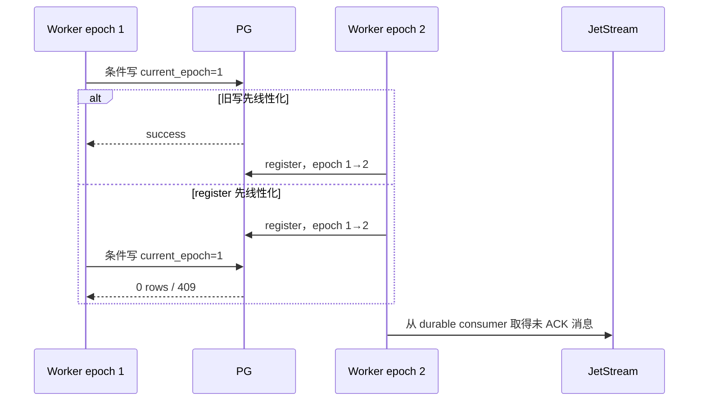

# CCR v2 Worker Epoch 后端设计

## 目标

Worker epoch 是 Code Session 的强一致所有权 fence。同一个 Code Session 可以因 Sandbox 恢复、
transport 重建或手动接管而出现多个 worker；只有 PostgreSQL 中当前 epoch 的 worker 可以写输出、
续租、消费 SSE 或确认 JetStream 消息。

核心规则：

- epoch 是每个 Code Session 独立的单调正整数。
- `code_sessions.current_worker_epoch` 是唯一事实源。
- legacy register 在行锁事务内递增 epoch；managed-agent JWT 绑定预留的精确 epoch。
- worker 写请求的 epoch 不匹配时返回 `409 conflict_error`。
- lease 过期不自动递增 epoch，只有 register 或凭证轮换改变所有权。
- Redis ACK key 和 JetStream delivery 都服从 PostgreSQL epoch，不能反向改变所有权。

## 数据模型

`code_sessions` 保存：

- `current_worker_epoch`：初始为 0；0 只表示尚未注册，worker 请求必须使用 1 以上的值。
- `worker_lease_expires_at`：当前 worker lease deadline。
- `worker_registered_at`：当前 epoch 注册时间。
- `worker_last_heartbeat_at`：最近 heartbeat。
- `worker_token_session_id`：凭证中的 Session 绑定，不保存原始 token。
- `worker_binding`：鉴权模式、subject、issuer 等非秘密元数据。

不持久化 `worker_alive`。读取时根据 lease deadline 推导，避免额外状态与 sweep 竞态。

## Register 与凭证轮换

入口是：

```text
POST /v1/code/sessions/{code_session_id}/worker/register
```

legacy register 锁定 Code Session 行，把当前值加一，同时更新 lease、binding、connected 与 activity
时间。两个并发 register 会得到连续但不同的 epoch；不同 Code Session 不互相阻塞。

managed-agent 创建时把初始 epoch 设为 1，并在 Session Ingress JWT 中写入 1。相同 JWT 的 register
只确认和刷新该 epoch，不再次递增。Sandbox 恢复时凭证轮换在一个数据库更新中替换 OAuth hash、
递增 epoch、清空旧 lease，再签发绑定新 epoch 的 JWT。旧 JWT 通常先在鉴权入口被拒绝；即使请求
在轮换前通过了解析，事务内 epoch 条件仍阻止它重新获得所有权。

成功响应：

```json
{
  "worker_epoch": "1"
}
```

## 写请求 fence

以下入口必须携带正整数 `worker_epoch`：

- `PUT /worker`；
- `POST /worker/events`；
- `POST /worker/internal-events`；
- `POST /worker/events/delivery`；
- `POST /worker/diagnostics`；
- `POST /worker/heartbeat`。

缺失、0、负数、小数或非数字返回 400；未知 Code Session 返回 404；不匹配返回 409。OTLP
入口不解析 body 中的 epoch，但会在读取 body 前验证当前 worker lease 和凭证。

不能只在 handler 开头读取一次 epoch，再无条件写数据库。新 register 可能在检查和写入之间抢占。
因此需要改变业务状态的 SQL 必须在同一次条件 update 或事务内再次匹配
`current_worker_epoch = worker_epoch`。

Worker output batch 先完成 schema 解析，再执行带 epoch 条件的 activity update。该 update 是 batch
线性化点：如果旧 worker 先更新，batch 被视为在接管前接受；如果 register 先递增，旧 batch 影响
0 行并返回 409。internal event append 同样在事务内检查 epoch。

公开 durable output 使用稳定 public event ID 幂等写入 `session_events`；ephemeral preview 使用
Core NATS，不落 PostgreSQL。工具权限产生的 `control_response` 在 Code Session 行锁内直接发布到
JetStream，等待 PubAck；稳定 message ID 由原始 request ID 派生。

## Heartbeat 与 lease

默认 lease TTL 是 60 秒。heartbeat 只在当前 epoch 上更新 heartbeat、lease、activity 与 connected
时间，不递增 epoch。0 行结果再区分 404 和 409。

同一个 Provider Sandbox 暂停后恢复不会改变所有权。Provider 恢复成功时，可以在同时匹配租户、
Code Session、活动 Work 和精确 Provider Sandbox ID 的条件下恢复当前 lease；凭证已经轮换或目标
Sandbox 不匹配时必须拒绝。创建 replacement Sandbox 时轮换凭证并递增 epoch。

## SSE 所有权

读取端点是：

```text
GET /v1/code/sessions/{code_session_id}/worker/events/stream
```

stream 优先读取显式 query/header epoch；没有显式值时使用已认证 JWT 的正 epoch。连接前先验证
epoch，再标记 connected，然后绑定该 Code Session 的稳定 JetStream durable consumer。每次发送
消息前以及连接期间每秒重新校验 epoch；新 register 接管后，旧 stream 自动关闭。

stream 断开时 disconnected update 也带 epoch 条件，旧连接不能覆盖新 worker 的 connected 状态。
断开只关闭当前 pull subscription，不删除 durable consumer。

`from_sequence_num` 和 `Last-Event-ID` 仍接受非负整数。非法 cursor 在 connected 状态写入前返回
400；合法 cursor 仅为旧客户端兼容输入，不控制 JetStream ACK floor，也不触发 PostgreSQL backlog
查询。

旧根路径 HTTP poll 和 WebSocket transport 已移除：

- `/v1/code/sessions/{code_session_id}` 不再支持 GET poll 或 WebSocket upgrade；
- `/v1/session_ingress/ws/{code_session_id}` 与 `/v2/session_ingress/ws/{code_session_id}` 不存在。

## Delivery ACK fence

SSE flush 前，服务端把 JetStream ACK subject 保存到带 Code Session、epoch 和 event ID 的 Redis key。
delivery API 在 Yourbatis 事务内锁定 Code Session，验证当前 epoch 后再查该 key：

- received/processing 发送 InProgress，并刷新 20 分钟 TTL；
- processed 执行 DoubleAck，然后删除 key；
- key 不存在时计入 ignored，消息保持未 ACK；
- 旧 epoch 在读取 key 前返回 409。

行锁覆盖整个 delivery 批次，直到 ACK 完成、worker 活跃时间使用同一事务更新并提交。
这与 register、凭证轮换和 recovery 的 epoch 更新串行化，防止“校验后被接管，旧请求仍 ACK”。
批次最多等待 5 秒；对象清理任务在释放行锁后再调度，避免在事务内另取连接。

Redis key 即使残留，也不能绕过数据库 epoch fence。新 epoch 重投同一 JetStream 消息时会建立新
key；旧 epoch 的 key 不会被新 worker使用。

## 并发时序



## Legacy 边界

以下旧 Session Ingress 路径仍可承担其原有兼容职责，但不属于 CCR v2 worker epoch 所有权面：

- `/v1/session_ingress/session/{code_session_id}`；
- `/v2/session_ingress/session/{code_session_id}`；
- 它们的 `/events` 与 `/diag_logs` 子资源；
- `/v2/sessions/{code_session_id}` Session context 入口。

旧 worker 不能再通过根路径 poll 入站消息。停机切换后必须启动使用 durable SSE 与 delivery API 的
worker。

## 验收

- 首次 legacy register 返回 1，再次 register 返回 2；managed JWT 重试保持预留 epoch。
- 同 Session 并发 register 返回连续值，不同 Session 分别从 1 开始。
- 所有受保护写入口拒绝 missing、0、非法或旧 epoch。
- 旧 worker 在预校验后被抢占，事务内写仍返回 epoch mismatch。
- heartbeat 只续当前 epoch；lease 过期不自动递增。
- 旧 SSE 在 register 接管后关闭，不能取得或 ACK 新 epoch 的消息。
- 非法 cursor 返回 400 且不改变 connected；合法 cursor 不改变 durable ACK 位置。
- 当前 epoch delivery 可 InProgress/DoubleAck；旧 epoch 409；缺失 Redis key ignored。
