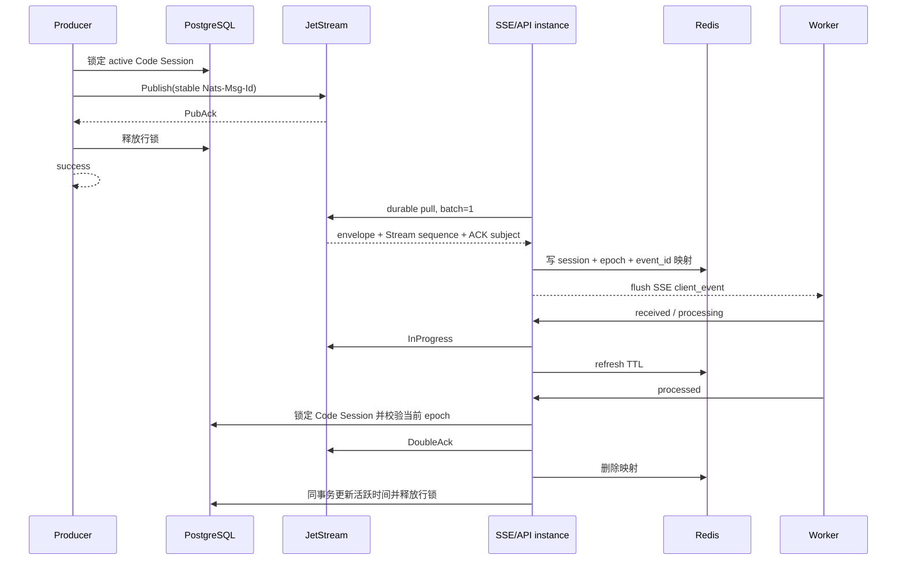

# CCR v2 Worker 入站投递后端设计

## 目标

Code Session 入站事件直接发布到共享 JetStream Stream，并通过每 Session 独立 durable consumer
实现 at-least-once、串行消费。PostgreSQL 不保存入站消息、发布记录或 delivery 状态；Redis 只保存
短期 ACK subject；大 payload 放入对象存储。

核心不变量：

- 普通入站请求只有获得 JetStream PubAck 后才成功；
- activation 只有在 initialize 和完整启动历史全部获得 PubAck 后才切换 active；
- 同一 Code Session 的直接发布与 termination 通过 Code Session 行锁串行；
- 每 Session consumer 的 `MaxAckPending=1`，当前消息 ACK 前不交付下一条；
- worker epoch 的强一致来源仍是 PostgreSQL；
- Redis 丢失、API 重启或 SSE 断开只造成重投；
- `processed` 是唯一完成 ACK，`received` 与 `processing` 只延长处理窗口。



## 直接发布与 PostgreSQL 边界

系统没有 `event_outbox`，也不使用 `last_inbound_sequence_num`。普通发布在 Yourbatis 事务中锁定
Code Session，确认状态为 active，然后在锁内直接 Publish 并等待 PubAck。事务不写入站数据；它只
防止 termination 在状态检查与 PubAck 之间清空 subject。

公开 Send Events 已经先把事件提交到 `session_events`。若随后 Publish 失败，API 返回 503，但
服务端没有后台补发记录。调用方必须重试。存在 payload UUID 或 request ID 时，服务端据此派生稳定
`csev_* Nats-Msg-Id`；PubAck 已成功但响应丢失时，JetStream 在 24 小时内去重。无稳定 ID 的调用
被视为新事件。

activation 是例外的启动编排：它锁定 Session 与 initializing Code Session，读取完整历史，逐条
Publish initialize 和历史，并在全部 PubAck 后更新 active。部分发布、模糊 PubAck 或最终 PG commit
失败都让状态保持 initializing；稳定 message ID 允许安全重试。activation 不等待 worker 消费。

此方案不提供 PostgreSQL 与 JetStream 的原子提交，也不保证并发生产请求按照 `session_events`
提交顺序获得 Code Session 发布锁。若需要服务端自主恢复或严格复现并发提交顺序，需要重新引入持久
发布日志或单写者调度。

## Stream 与顺序

`OMA_WORKER_INBOUND` 捕获 `oma.worker.inbound.v2.>`，使用 `WorkQueuePolicy`、file storage、
3 replicas、10 GiB、`DiscardNew`、1 MiB 单消息上限、24 小时 duplicate window 和 `MaxAge=0`。

每个 Code Session 的 subject 是 `oma.worker.inbound.v2.<code-session-id>`。每个 Session 创建一个
精确过滤该 subject 的 durable pull consumer：

- `DeliverAll`；
- `AckExplicit`；
- `MaxAckPending=1`；
- `MaxDeliver=-1`；
- backoff 为 1 分钟、5 分钟、15 分钟，之后保持 15 分钟；
- 单次 pull batch 为 1。

SSE 断开只关闭当前 pull subscription，不删除 consumer。新的 API 实例重新绑定同名 consumer 后继续
未 ACK 消息。

envelope 存储时的 `sequence_num` 为 0；消费时以 JetStream metadata 的 Stream sequence 覆盖它。
因此 SSE sequence 在共享 Stream 内全局单调，单个 Session 可以有间断。它用于事件标识和诊断，不是
可由客户端修改的 ACK cursor。

## Envelope

```json
{
  "version": 2,
  "code_session_id": "cse_...",
  "event_id": "csev_...",
  "payload_event_id": "stable-payload-uuid",
  "sequence_num": 42,
  "event_type": "user",
  "event_subtype": "",
  "payload": {},
  "expires_at": "2026-10-04T00:00:00Z"
}
```

`event_id` 是稳定 transport ID。`payload_event_id` 存在时，SSE 和 delivery API 优先使用它；
否则使用 transport ID。worker 必须对这个可见 ID 做业务幂等。

## Redis ACK 定位

SSE flush 前写入：

```text
code_session + worker_epoch + event_id -> ACK subject + cleanup_job_id
```

TTL 为 20 分钟。`received` 和 `processing` 向 ACK subject 发送 InProgress 并刷新 TTL；
delivery 批次在同一个 Yourbatis 事务中锁定 Code Session 并校验 PostgreSQL epoch，锁内查询
Redis、执行 InProgress 或 DoubleAck、维护 Redis key，并通过该事务更新 worker 活跃时间。
因此凭证轮换、register 和 recovery 的 epoch 更新必须等确认结束；若它们先完成，旧 epoch
在读取 Redis 前即被拒绝。整个事务（含外部 ACK 等待）最多等待 5 秒，避免故障无限阻塞接管。
`processed` 成功后的大 payload 清理调度放在释放锁后，不能在回调中通过另一 DB 连接更新 jobs。
JetStream ACK 不随 PG 事务回滚；若 ACK 已确认但后续 PG 操作失败，消息仍已完成，不能撤销 ACK。

Redis 写失败时不 flush SSE，消息保持未 ACK。Redis key 丢失或过期时 delivery update 计入
`ignored`；consumer 之后重投并建立新映射。Redis 不能决定消息完成，也不能替代 PostgreSQL 的
lifecycle 或 epoch fence。

## 大 payload

先序列化完整 envelope。超过 900 KiB 时：

1. 创建最迟在 `expires_at` 执行的 object cleanup job；
2. 把原始 payload 上传到租户隔离 key；
3. key 使用 Code Session、稳定 event ID 和随机 cleanup job ID，避免重试对象相互覆盖；
4. envelope 改存 key、size、SHA-256 与 cleanup job ID；
5. 再次校验引用 envelope 小于 1 MiB。

SSE 读取时限制为声明长度加一字节，并校验对象报告大小、实际大小和 SHA-256。缺失、截断、篡改或
读取失败都不发送、不 ACK；`MaxAckPending=1` 使后续消息继续阻塞。PubAck 失败可能是模糊成功，
所以不立即清理对象。processed 后加速清理；否则最迟 30 天清理。

对象清理任务仍存于通用 `jobs` 表，由 `internal/db/object_cleanup_jobs.go` 和独立的
`ObjectCleanupJobMapper` 负责入队、定时调度、提前执行、领取、完成和失败重试。
文件删除与入站 payload offload 共用这条访问链；`FileMapper` 不再承载这些任务 SQL。
本次拆分不改变表结构、DB 公共方法或任务执行语义，也不合并独立的 filestore 清理流程。

## 30 天逻辑期限

JetStream 不使用 `MaxAge` 静默删除。每个 envelope 带 `expires_at`，应用每分钟扫描 Stream。
发现过期消息时终止 Code Session、撤销凭证、按 subject 清空消息、删除 durable consumer、加速关联
对象清理并输出 Error 日志。单条过期或毒消息不能跳过继续执行。

## 故障语义

- active 状态检查失败：不发布；
- Publish 或容量失败：请求 503，不自动补发；
- PubAck 响应丢失：调用方以稳定 message ID 重试，JetStream 去重；
- activation 部分发布：状态仍 initializing，重试补齐并去重；
- Redis 丢失：delivery ignored，之后重投；
- S3 校验失败：不 ACK，阻塞该 Session；
- worker 断线：durable consumer 保留；
- 30 天到期：整个 Code Session 终止并清空消息；
- termination 与正在发布的请求竞争：两者通过 Code Session 行锁确定先后。

## API 与兼容

只保留：

```text
GET  /v1/code/sessions/{code_session_id}/worker/events/stream
POST /v1/code/sessions/{code_session_id}/worker/events/delivery
```

旧 poll 路由移除。`from_sequence_num` 与 `Last-Event-ID` 只做非负整数兼容校验，不改变 durable
consumer ACK floor。

## 验收

- activation 与普通发布都等待 PubAck；
- 模糊 PubAck 的稳定 ID 重试只保留一条消息；
- per-session durable consumer 重连并保持 `MaxAckPending=1`；
- 全局 Stream sequence 正确写入 SSE；
- Redis 丢失、epoch 接管、InProgress 与 DoubleAck；
- 900 KiB 边界、外置 payload 加载（loadOffloadedPayload）完整性和清理；
- 30 天到期终止与 subject 清理；
- schema 不含旧入站表、outbox 表或 PG 入站 sequence；
- 旧 poll 路由不可用，idle-stop 后新输入触发恢复。
