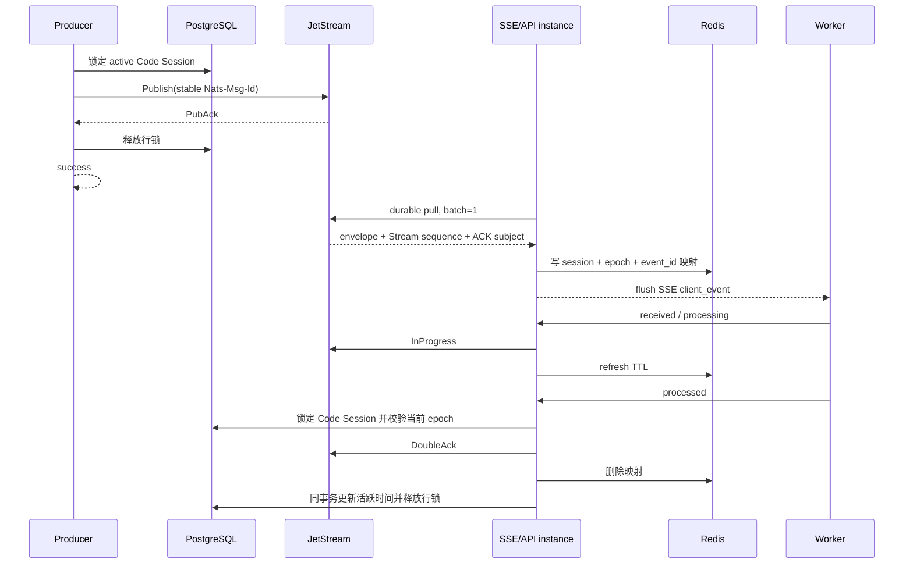
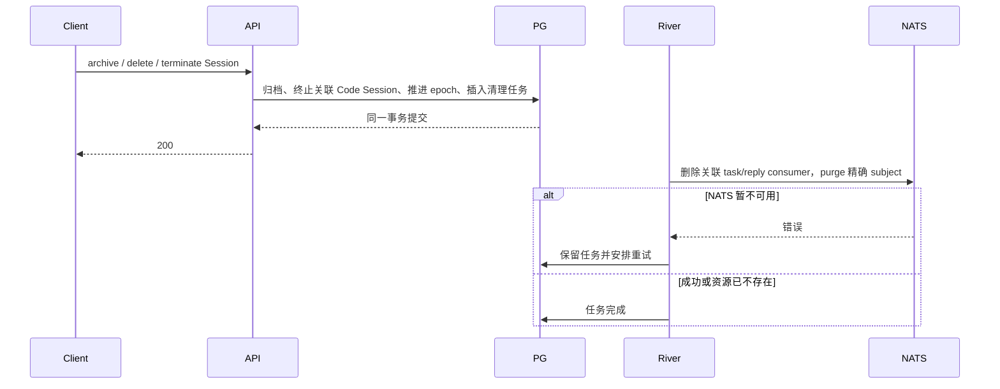

# CCR v2 Worker 入站投递后端设计

> 2026-09-10 修复：控制回应使用独立的可靠投递名额，避免与正在等待它的任务循环等待。

## 目标

Code Session 入站事件直接发布到共享 JetStream Stream，并通过每 Session 两个独立 durable consumer
实现 at-least-once、各通道内串行消费。PostgreSQL 不保存入站消息、发布记录或 delivery 状态；Redis 只保存
短期 ACK subject；大 payload 放入对象存储。

核心不变量：

- 普通入站请求只有获得 JetStream PubAck 后才成功；
- activation 只有在 initialize 和完整启动历史全部获得 PubAck 后才切换 active；
- 同一 Code Session 的直接发布与 termination 通过 Code Session 行锁串行；
- 任务与回应各自的 consumer 保持 `MaxAckPending=1`，各通道内当前消息 ACK 前不交付下一条；
- `control_response` 和 `control_request/interrupt` 进入回应通道，不受任务的未完成 ACK 阻塞；
- worker epoch 的强一致来源仍是 PostgreSQL；
- Redis 丢失、API 重启或 SSE 断开只造成重投；
- `processed` 是唯一完成 ACK，`received` 与 `processing` 只延长处理窗口。


```mermaid
sequenceDiagram
    participant Producer
    participant PG as PostgreSQL
    participant JS as JetStream
    participant API as SSE/API instance
    participant Redis
    participant Worker

    Producer->>PG: 锁定 active Code Session
    Producer->>JS: Publish(stable Nats-Msg-Id)
    JS-->>Producer: PubAck
    Producer->>PG: 释放行锁
    Producer-->>Producer: success
    API->>JS: durable pull, batch=1
    JS-->>API: envelope + Stream sequence + ACK subject
    API->>Redis: 写 session + epoch + event_id 映射
    API-->>Worker: flush SSE client_event
    Worker->>API: received / processing
    API->>JS: InProgress
    API->>Redis: refresh TTL
    Worker->>API: processed
    API->>PG: 锁定 Code Session 并校验当前 epoch
    API->>JS: DoubleAck
    API->>Redis: 删除映射
    API->>PG: 同事务更新活跃时间并释放行锁
```

## 直接发布与 PostgreSQL 边界

系统没有 `event_outbox`，也不使用 `last_inbound_sequence_num`。普通发布在 Yourbatis 事务中锁定
Code Session，确认状态为 active，然后在锁内直接 Publish 并等待 PubAck。事务不写入站数据；它只
防止 termination 在状态检查与 PubAck 之间清空 subject。
payload 转换、cleanup job 提交和 S3 上传都在该事务之前完成；进入事务后只校验状态并发布。
整个请求的发布流程最多 1 分钟，确定未尝试发布的对象在退出事务后加速清理。

公开 Send Events 已经先把事件提交到 `session_events`。若随后 Publish 失败，API 返回 503，但
服务端没有后台补发记录。调用方必须重试。存在 payload UUID 或 request ID 时，服务端据此派生稳定
`csev_* Nats-Msg-Id`；PubAck 已成功但响应丢失时，JetStream 在配置允许的去重窗口内去重，默认 24 小时。无稳定 ID 的调用
被视为新事件。

activation 是例外的启动编排：先短事务锁定 Session 与 initializing Code Session 并读取完整历史，
释放锁后准备所有对象，再重新加锁核对历史和 metadata 快照。快照改变则重新准备；未改变才逐条
Publish initialize 和历史，并在全部 PubAck 后更新 active。部分发布、模糊 PubAck 或最终 PG commit
失败都让状态保持 initializing；稳定 message ID 允许安全重试。activation 不等待 worker 消费。

此方案不提供 PostgreSQL 与 JetStream 的原子提交，也不保证并发生产请求按照 `session_events`
提交顺序获得 Code Session 发布锁。若需要服务端自主恢复或严格复现并发提交顺序，需要重新引入持久
发布日志或单写者调度。

## Stream 与顺序

`OMA_WORKER_INBOUND` 捕获 `oma.worker.inbound.v2.>`，使用 `WorkQueuePolicy`、file storage、
`nats.worker_event_stream` 可配置 `max_bytes`、`max_age`、`replicas`、`max_msg_size`，
默认分别为 256 MiB（`1 << 28`）、`0s`、3、1 MiB；字段省略时各自使用默认值。
固定使用 `DiscardNew`。duplicate window 默认 24 小时，非零 MaxAge 更短时同步缩短。
启动时创建或更新 Stream，各 API 实例须使用一致配置；完整取值限制见 [运行配置](../runtime-configuration.md)。
非零 MaxAge 会自动删除到期的未 ACK 消息，下面依赖应用过期清理的保证只适用于默认 `MaxAge=0`。

每个 Code Session 使用两条互不重叠的 subject，各创建一个精确过滤的 durable pull consumer：

- 任务：`oma.worker.inbound.v2.<code-session-id>`，consumer 为 `oma_worker_<code-session-id>`；
- 回应：`oma.worker.inbound.v2.<code-session-id>.reply`，consumer 为 `oma_worker_<code-session-id>_reply`。

`internal/workerevents/lanes.go` 集中定义分类。`control_response`（包括审批和已转换的自定义工具结果）
及 `control_request` 中 subtype 为 `interrupt` 的消息进入回应通道；initialize、启动历史、用户输入
和未知类型留在任务通道，不把所有 control_request 放行。

公共工具确认和自定义工具结果继续使用已有的控制回应转换。本次修复只改变投递通道；
`control_request/interrupt` 指已经转换成 Worker 协议的中断消息。公共 `user.interrupt`
到该协议的转换属于独立问题，不在本次修复范围内，不能据此声称停止按钮已经修复。

两路分别拉取、通过同一个有界 Subscription 交给原 SSE 单写入循环。每路最多一条未完成消息，
不会为了寻找回应而把用户输入全部预取到内存。两个 consumer 均使用：

- `DeliverAll`；
- `AckExplicit`；
- `MaxAckPending=1`；
- `MaxDeliver=-1`；
- backoff 为 1 分钟、5 分钟、15 分钟，之后保持 15 分钟；
- 单次 pull batch 为 1。

SSE 断开只关闭当前 pull subscription，不删除 consumer。新的 API 实例重新绑定同名 consumer 后继续
未 ACK 消息。

envelope 存储时的 `sequence_num` 为 0；消费时以 JetStream metadata 的 Stream sequence 覆盖它。
该 sequence 标识共享 Stream 的存储位置，单个 Session 可以有间断，跨通道的 SSE 发送顺序允许
非单调：例如用户输入 seq=2、排队输入 seq=3、审批回应 seq=4，可以按 2、4、3 发送。不能按最大
已见序号丢弃较小但尚未处理的输入；重连仍由各 durable consumer 的 ACK 状态决定重投，
`from_sequence_num` 和 `Last-Event-ID` 不参与完成判定。Worker 使用稳定 event ID 做业务幂等。

### 与 PR #340 的关系及方案选择

PR #340 将未完成消息的唯一可靠存储收敛到 JetStream，只有 Worker 上报 `processed` 才 ACK。
原来的单通道 `MaxAckPending=1` 由此形成循环等待：任务等待审批回应才完成，而审批回应必须等
任务完成 ACK 才能投递。自动批准也需要把回应送回 Worker，因此同样受影响。

本次保留 #340 的持久化、完成 ACK、epoch fencing 和每路限流，只拆开存在依赖的两类消息。
提高为任意有限窗口仍可能被排队输入占满；改成无限窗口则允许全部输入提前进入 Worker，改变
任务串行和故障隔离语义。真实 Worker 实验中，无限窗口下 20 条排队输入在原任务完成前进入下一次
模型请求；坏 payload 对照实验也显示后续输入可以越过未确认的坏消息。因此采用两路各一条，
既让回应解除等待，又保留用户输入的背压。不提前 ACK，也不重新引入 PostgreSQL outbox。

## Envelope

```json
{
  "version": 2,
  "code_session_id": "cse_...",
  "event_id": "csev_...",
  "payload_event_id": "stable-payload-uuid",
  "sequence_num": 42,
  "event_type": "user",
  "event_subtype": "",
  "payload": {},
  "expires_at": "2026-10-04T00:00:00Z"
}
```

`event_id` 是稳定 transport ID。`payload_event_id` 存在时，SSE 和 delivery API 优先使用它；
否则使用 transport ID。worker 必须对这个可见 ID 做业务幂等。

## Redis ACK 定位

SSE flush 前写入：

```text
code_session + worker_epoch + event_id -> ACK subject + cleanup_job_id
```

TTL 为 20 分钟。`received` 和 `processing` 向 ACK subject 发送 InProgress 并刷新 TTL；
delivery 批次在同一个 Yourbatis 事务中锁定 Code Session 并校验 PostgreSQL epoch，锁内查询
Redis、执行 InProgress 或 DoubleAck、维护 Redis key，并通过该事务更新 worker 活跃时间。
因此凭证轮换、register 和 recovery 的 epoch 更新必须等确认结束；若它们先完成，旧 epoch
在读取 Redis 前即被拒绝。整个事务（含外部 ACK 等待）最多等待 5 秒，避免故障无限阻塞接管。
`processed` 成功后的大 payload 清理调度放在释放锁后，不能在回调中通过另一 DB 连接更新 jobs。
JetStream ACK 不随 PG 事务回滚；若 ACK 已确认但后续 PG 操作失败，消息仍已完成，不能撤销 ACK。

Redis 写失败时不 flush SSE，消息保持未 ACK。Redis key 丢失或过期时 delivery update 计入
`ignored`；consumer 之后重投并建立新映射。Redis 不能决定消息完成，也不能替代 PostgreSQL 的
lifecycle 或 epoch fence。
SSE 写失败不删除映射：旧连接的写失败可能晚于重连重投，不能抹掉新 ACK subject；未 flush 的映射
本身不会 ACK 消息，保留到 TTL 即可。worker 的 processing 应早于首次 1 分钟 ACK 窗口，建议每
20–30 秒一次；20 分钟 TTL 不是处理心跳间隔。

## 大 payload

原始 payload 超过 16 MiB 时在存储前拒绝，与 hydrate 的大小上限一致。实现按原始 payload 的实际字节数判断 32 KiB（32768 bytes）阈值；严格超过时：

1. 创建最迟在 `expires_at` 执行的 object cleanup job；
2. 把原始 payload 上传到租户隔离 key；
3. key 使用 Code Session、稳定 event ID 和随机 cleanup job ID，避免重试对象相互覆盖；
4. envelope 改存 key、size、SHA-256 与 cleanup job ID；
5. 发布前由 Broker 校验最终 envelope 不超过配置的 `max_msg_size`，默认 1 MiB。

SSE 读取时限制为声明长度加一字节，并校验对象报告大小、实际大小和 SHA-256。缺失、截断、篡改或
读取失败都不发送、不 ACK；`MaxAckPending=1` 使同通道的后续消息继续阻塞。PubAck 失败可能是模糊成功，
所以不立即清理对象。processed 后加速清理；否则最迟 30 天清理。
确定未尝试发布的对象可以加速清理。清理调度在行锁事务外使用不继承请求取消的 5 秒上下文；失败
只告警，由上传前已提交的到期任务兜底，不能依赖已经取消的请求完成清理。

对象清理任务仍存于通用 `jobs` 表，由 `internal/db/object_cleanup_jobs.go` 和独立的
`ObjectCleanupJobMapper` 负责入队、定时调度、提前执行、领取、完成和失败重试。
文件删除与入站 payload offload 共用这条访问链；`FileMapper` 不再承载这些任务 SQL。
本次拆分不改变表结构、DB 公共方法或任务执行语义，也不合并独立的 filestore 清理流程。

## 30 天逻辑期限

JetStream 不使用 `MaxAge` 静默删除。每个 envelope 带 `expires_at`，应用每分钟扫描 Stream。
发现过期消息时先提交 Code Session 终止与凭证撤销，再删除两路 durable consumer、按两个精确 subject 清空消息、
加速关联对象清理并输出 Error 日志。PG 失败时不得先 TERM、ACK 或 purge；consumer 删除失败时
不得先 purge，否则会丢失下一轮扫描的重试依据。该批次任何终止/清理失败都不推进扫描游标。
两个 subject 的 purge 不构成原子操作；第二路失败时返回错误，重复调用可完成清理。
若触发清理的过期消息已被第一路 purge 移除，未清理的另一路仍由其自身 `expires_at` 兜底，
不能把“不推进扫描游标”理解为保证下一轮立即重试该 Session 的全部清理。

扫描按 subject 查找实际存储的下一条消息，一轮最多 512 条，已 ACK 的序号空洞不占扫描预算。
坏 JSON、版本/身份/期限无效时告警，并继续检查其他 Session。坏消息本身不 ACK；以可信 subject
定位其 Session，以 JetStream 存储时间加 30 天作为兜底期限，不使用损坏 envelope 的对象引用。
PG 记录已不存在时直接清理对应队列，不执行空租户 UUID 的终止 SQL。毒消息不能被跳过并继续执行
同一通道的后续消息；消息过期则终止整个 Code Session。

## 故障语义

- active 状态检查失败：不发布；
- Publish 或容量失败：请求 503，不自动补发；
- PubAck 响应丢失：调用方以稳定 message ID 重试，JetStream 去重；
- activation 部分发布：状态仍 initializing，重试补齐并去重；
- Redis 丢失：delivery ignored，之后重投；
- S3 校验失败：不 ACK，阻塞该 Session 同通道的后续消息；
- worker 断线：durable consumer 保留；
- 30 天到期：整个 Code Session 终止并清空消息；
- termination 与正在发布的请求竞争：两者通过 Code Session 行锁确定先后。

## API 与兼容

只保留：

```text
GET  /v1/code/sessions/{code_session_id}/worker/events/stream
POST /v1/code/sessions/{code_session_id}/worker/events/delivery
```

旧 poll 路由移除。`from_sequence_num` 与 `Last-Event-ID` 只做非负整数兼容校验，不改变 durable
consumer ACK floor。

## 验收

- activation 与普通发布都等待 PubAck；
- 模糊 PubAck 的稳定 ID 重试只保留一条消息；
- per-session 两个 durable consumer 重连并分别保持 `MaxAckPending=1`；
- 空闲或阻塞时关闭订阅、任一路解码失败，均会结束两路读取并释放 NATS 订阅，保留未 ACK 消息；
- 第二路 purge 失败后可幂等重试，残留消息仍受自身到期规则覆盖；
- Stream sequence 正确写入 SSE；控制回应越过排队输入，含重连后的较小序号输入仍可完成；
- 真实 Worker 手动/自动 allow、deny、中断和未知 request ID 回应不形成循环等待；
- Redis 丢失、epoch 接管、InProgress 与 DoubleAck；
- 32 KiB 边界、外置 payload 加载（loadOffloadedPayload）完整性和清理；
- 30 天到期终止与 subject 清理；
- schema 不含旧入站表、outbox 表或 PG 入站 sequence；
- 旧 poll 路由不可用，idle-stop 后新输入触发恢复。

## 升级边界

### Session 永久结束与 consumer 自动回收

Session 归档、删除或整体 `terminated` 的事务按 Session → Worker 的既有锁顺序完成状态转换，并终止租户范围内所有关联 Code Session（包括历史实例），清除 token/lease、推进 epoch，再通过同一个 Yourbatis SQL transaction executor 的 River 适配器持久化清理任务。入队失败则整个状态事务回滚。归档和整体终止保留公开历史；删除沿用软删除合同。Agent 归档不会触发此清理，也不会终止其已有 Session。

事件写入路径由状态应用返回“Session 本次进入 terminated”的结果，批次汇总该结果。整批事件及派生事件写完后，仅在批末状态仍为 terminated 时，事务编排显式终止关联 Worker 并入队清理，不重新扫描事件类型，也不在处理单个事件时提前推进 epoch。幂等重放和重复终态不再次触发清理；仅 Thread 终止不触发，除非派生出整个 Session 的终止转换。归档、删除与直接设置终止状态继续显式调用同一个 Worker 清理函数。


```mermaid
sequenceDiagram
    participant Client
    participant API
    participant PG
    participant River
    participant NATS
    Client->>API: archive / delete / terminate Session
    API->>PG: 归档、终止关联 Code Session、推进 epoch、插入清理任务
    PG-->>API: 同一事务提交
    API-->>Client: 200
    River->>NATS: 删除关联 task/reply consumer，purge 精确 subject
    alt NATS 暂不可用
        NATS-->>River: 错误
        River->>PG: 保留任务并安排重试
    else 成功或资源已不存在
        River->>PG: 任务完成
    end
```

事务返回后由 River 尽快执行，不把 NATS 清理放在 HTTP 请求内。任务保存稳定的租户、Session UUID 和关联 Code Session ID；排序后的参数对活跃任务去重，失败与进程重启沿用 River 的持久重试和 running job rescue。重试次数有限，耗尽后任务进入 discarded，本次没有增加自动对账扫描。已完成或已 discarded 的任务不阻止再次归档重新入队。清理重复执行安全，不依赖消息仍存在；不会 purge 共享 Stream 或其他 Session。

epoch 在永久结束事务内推进，已有 Worker SSE 会按既有一秒校验间隔退出，旧凭证无法重新订阅或注册。订阅创建后、发出 HTTP 200 前再次检查 epoch。每个关联 Session 的 Worker 订阅在开始创建时分配稳定的关闭 ID，结束时先停止读取，再检查父 Session；仅父 Session 已永久结束或查询失败时独立持久化补偿任务，正常断连与 replacement 不产生无效清理任务。订阅创建失败但已经留下 consumer 时也进入该补偿路径。任务通过组织、工作区和 Session UUID 查询包含软删除记录的永久结束状态，仅在归档、删除或整体终止时 purge；记录不存在不视为永久结束，普通 Worker replacement 不会删除新连接共用的 consumer。补偿任务独立于归档任务去重，覆盖旧请求在归档清理完成之后才创建 consumer 的窗口。无父 Session 的独立 Code Session 不入队。关闭补偿入队使用独立的五秒 context。进程在重建 consumer 后、持久化补偿前崩溃时，consumer 由 NATS inactivity 回收；该窗口中的残留消息仍依赖逻辑到期扫描，不承诺即时 purge。归档与旧消息处理并发仍受既有 epoch/Session 锁保护，不承诺跨系统瞬时原子删除。常规断连、idle/paused 与 Agent archive 不调用此清理；Redis ACK key 沿用 TTL，不即时删除。无 River 的进程内 HTTP removal 组装保留同步清理路径；生产 main 必须注入已配置的 SessionCleanup，包含事件历史写入和线程终止派生的整体终态。River kind/queue 保留 `session_archive_cleanup`，使已有持久任务可继续执行。

验收包含真实 PostgreSQL/River/NATS 的入队回滚、部分清理失败后 client 重启恢复、历史实例清理、重复归档、其他 subject 保留、已有 Worker stream 失效、延迟订阅重建后的补偿及普通 epoch replacement 保留 consumer；`chat reliability` 增加真实 Worker 完成后公开归档与两路 consumer 删除检查。

旧 subject 中可能已有被任务阻塞的控制回应。仅增加新 consumer 不会自动移动这些存量消息。
本次不提供存量迁移，也不自动恢复或删除旧对话，由用户另行处理。删除保留既有执行中禁止删除、尚未开始执行的已接收输入可取消的限制；本次不改变删除限制，也不包含停止按钮修复。
新版本发布的控制回应使用独立通道。

部署时先停止旧 API 实例，再启动新版本，避免旧实例继续写入旧 subject，或将 `.reply` subject
当作无效消息清理。不支持新旧版本混跑；此要求与是否迁移存量消息无关。

真实 Worker 验收统一使用 `tests/liveworker`。先以测试配置在 `127.0.0.1:18080` 启动独立 OMA API，
再运行：

```sh
LIVE_WORKER_REAL_CLAUDE=1 LIVE_WORKER_API_URL=http://127.0.0.1:18080 CONFIG_FILE=/path/to/test-config.yaml go test ./tests/liveworker -run '^TestRealWorkerControlDelivery$' -count=1 -v
```

测试连接真实 OMA API、PostgreSQL、Redis、JetStream，使用真实 Worker，只替换模型输出。
七种场景覆盖手动/自动 allow 与 deny、规范协议中断、未知 request ID 回应和纯文本任务。
手动批准还在等待审批时及批准后分别断开 SSE，证明更大序号的回应被处理后，较小序号的排队输入
仍能在重连后作为独立任务执行。中断与未知回应通过生产入队服务注入；不验证公共停止按钮。
需要本地已有 sandbox 镜像和 Docker，可通过 `OMA_WORKER_CONTROL_IMAGE` 固定镜像。
测试不应指向生产或有用户正在工作的环境，结束后停止专用测试 API 和依赖。


`nats.worker_event_stream.consumer_inactive_threshold` 默认 `5m`，必须为正数。两路 consumer 在创建或订阅时设置该阈值。后端启动不扫描或更新存量 consumer；旧配置在下次订阅时更新，开发环境中不再使用的旧 consumer 可另行清理。所有 API 实例必须同步配置，避免相互覆盖。

阈值衡量 consumer 的拉取活动，不衡量 Session idle 时长。仍在 Fetch 的 Worker 保持 consumer。沙箱 idle timeout 沿用现有回收流程，Worker 停止后由 NATS 处理无活动 consumer。待 ACK 的消息和 BackOff 会延后回收，`5m` 不表示断线后精确五分钟删除。

临时 consumer 回收不 purge subject。WorkQueue 保留未 ACK 消息，下一次订阅按 DeliverAll 重建 consumer，使用原 event ID 投递。已 ACK 消息已从 Stream 移除。在途消息可再次投递，Worker 必须按 event ID 保持处理幂等；该机制不提供跨进程工具副作用的 exactly-once 保证。旧 SSE 退出仅停止本地 Fetch，禁止删除新连接共享的 consumer。

新增验收覆盖两路 consumer 真实过期、未 ACK 消息及 ID 保留、重建后 ACK 排空、活跃 pull 与旧连接关闭不误删；删除/整体终态的事务回滚、历史 Worker 清理、软删除后的晚订阅补偿与子线程归档保留父会话队列。
