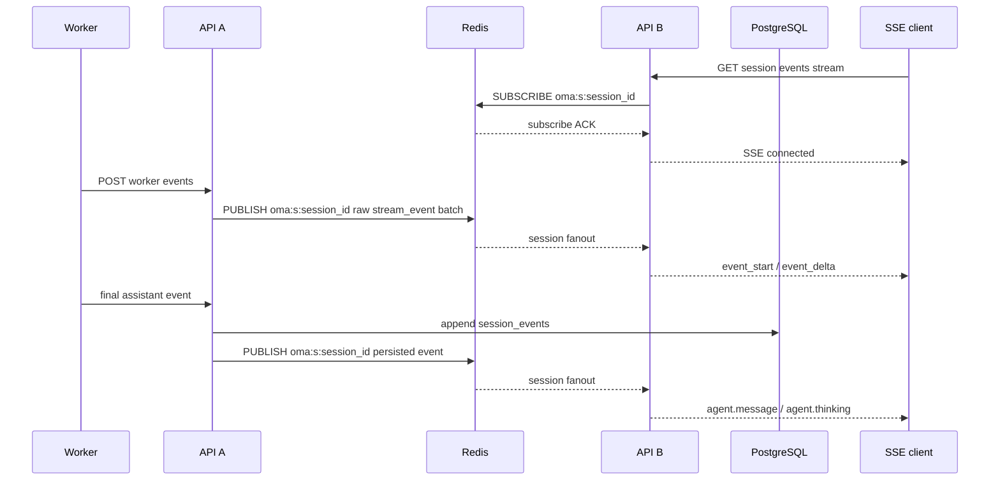

# CCR v2 Worker 事件到 Session SSE 的多实例扇出

## 结论

`POST /v1/code/sessions/{code_session_id}/worker/events` 与 Session SSE 可能落在不同 API 实例。服务端按 session 使用 Redis Pub/Sub 频道 `oma:s:<session_id>` 扇出实时事件，不新增 PostgreSQL 表：

- 应用启动时只创建一个全局 `redis.Client`；platform session store 与事件 fanout 共享该 client 及连接池。fanout 只拥有并关闭自己的 Pub/Sub subscription，全局 client 由应用组装层关闭。
- 每个 API 实例复用一条 Pub/Sub 连接，按本实例实际建立的 SSE session 动态增加订阅；不同 session 不再共享数据频道。
- Redis 收到的 Worker raw batch 在每个 API 实例转换一次，session Hub 只投递转换后的事件；每条 SSE 连接只负责线程、事件类型和 preview 生命周期过滤。
- Pub/Sub 连接初始化时订阅一个进程唯一的 `oma:i:<uuid>` 实例频道，仅用于建立连接，不承载业务事件。
- `ephemeral: true` 的 `stream_event` 只经过 Redis，不持久化。
- Worker ingress JWT 中已验证的 `session_id`、`public_session_id` 和 `workspace_uuid` 直接组成 stream route；生产端不为每批 preview 重新查询 code session、public session 或 primary thread。
- 最终公开事件仍幂等写入现有 `session_events`，事务提交后再通过对应 session 频道通知已订阅实例。
- Redis 中断时允许丢失预览；最终事件仍可通过 Sessions Events API 获取。
- Redis 只传递事件，不保存 message、block 或 SSE 连接的关联状态。



## Preview 转换

实际 Worker 协议中的 `content_block_delta` 已经是真正的增量片段，不是 full-so-far snapshot。后端不累计或比较文本：

- `message_start.message.id` 保存为当前原始 session 的 message ID。
- `content_block_start` 根据 block type 发送一次 `event_start`。
- `text_delta.text` 原样映射成 `event_delta.delta.content.text`，公开 `delta.index` 固定为 `0`。
- `thinking_delta` 不产生 `event_delta`；`agent.thinking` 只有 `event_start` 预览。
- 缺少 message start、block start 或 Redis 重连后丢失上下文时，后续 delta 直接舍弃。
- `parent_tool_use_id` 为空时归属主线程；非空时使用既有确定性 child thread ID。
- Preview SSE 的 `created_at` 使用规范化 worker payload 的创建时间，缺失或无效时回退到接收时间；`processed_at` 使用接收实例的转换时间。接收实例使用 SSE 已解析出的实际订阅线程 ID 补充 `session_thread_id`，主线程 preview 不需要在生产端查询物理 thread ID。

预览和最终事件共享确定性 ID：

```text
seed = "assistant-preview-v1"
     + NUL + message.id
     + NUL + decimal(original_content_block_index)
     + NUL + public_event_type

id = "sevt_" + first_16_bytes_hex(
    SHA-256(code_session_id + NUL + "public" + NUL + seed)
)
```

最终 assistant 包含完整 content 数组时，数组下标就是原始 block index。若 Worker 按单 block 输出，可显式携带顶层 `content_block_index`；该字段只用于映射，不能进入公开事件。

## SSE 连接语义

`event_deltas[]` 只接受 `agent.message` 和 `agent.thinking`，超过 100 个值或包含其他值返回 `400`。每个订阅者只接收自己已经见过 `event_start` 的后续 delta，避免中途连接收到孤立 delta。

建立 SSE 时先注册本机 subscriber，再订阅 `oma:s:<session_id>`，并等待 Redis 返回该频道的 `subscribe` ACK；只有 ACK 成功后才向客户端发送 `: connected`。这样 ACK 之后到达的消息不会落在本机 subscriber 注册之前。多个 SSE 连接订阅同一 session 时复用同一个 Redis 频道订阅和实例级 preview converter。

当前不维护 SSE 连接引用计数，也不在单个连接关闭时取消 Redis 订阅。session 频道订阅保留到 API 进程退出；基于 session terminated 信号的提前清理作为后续优化，避免在终止事件来源尚未统一前误退订。

Hub subscriber 只以 `workspace_uuid + session_id` 匹配转换后的 preview 或持久事件。线程范围、`event_deltas[]` 类型和 `event_start`/`event_delta` 配对由 SSE 连接自己的状态过滤。未请求 delta 的连接不会解析 Worker raw payload，也不会维护 message/block 或去重状态。单连接缓冲区为 256 个 delivery；缓冲区满时关闭连接，而不是丢弃某个中间 delta 后继续发送，从而保证客户端只看到连续前缀。

主线程 preview 在 fanout 内表示为 primary scope，不携带生产端查出的 thread ID。SSE 建立时接收实例已经确保 primary thread 存在，并在连接状态中记录 primary scope，因此可以直接匹配主线程 preview。`parent_tool_use_id` 非空时仍使用确定性 child thread ID 精确匹配，不会将主线程 preview 写入子线程 SSE。

Worker HTTP 重试可能重复发布 ephemeral 事件。每个 API 实例按 `code_session_id + worker_epoch + payload.uuid` 做有界临时去重；该状态与活动 preview 状态均不进入 PostgreSQL。同一实例上的多个 SSE 共享转换结果，不复制 message/block 状态机和去重 LRU。

实例级 converter 使用一个 mutex 保护 message/block 和去重状态；Worker JSON 在锁外解析，锁内只进行内存状态转换。转换完成并释放 converter 锁后，Hub 再获取自己的锁广播事件，两把锁不嵌套。Redis 接收中断时先清空实例 converter，再由 Hub 向所有连接投递 reset marker；连接按队列顺序清空 `activePreviewIDs`，之后缺少上下文的 delta 会被丢弃。

## 故障与发布顺序

- `/worker/events` 必须先完成整批解析和 worker epoch gate，再发布任何 preview。
- 批量与单事件入口在分类前使用同一套 payload 规范化逻辑；已通过批量协议校验的事件会补齐缺失的 `session_id`、`created_at` 和 `timestamp`，stream fanout 发布规范化后的 payload。
- 同一请求内保持原始事件顺序；连续 stream events 合并成一个 Redis envelope。
- 一批已持久化事件若包含多个 session，发布前按 session 分组，每个 envelope 只进入对应的 `oma:s:<session_id>`。
- 持久化事件的 fanout wire contract 只包含 SSE 路由与响应所需的 `external_id`、`workspace_uuid`、`session_id`、`thread_id`、`event_type`、`payload`、`processed_at` 和 `created_at`；不序列化完整数据库事件模型。
- Preview 的 fanout 序列化或 Redis publish 失败只记录结构化元数据，不记录原始 payload，也不中断同一 worker batch 中后续的 control 或持久事件。
- 应用关闭时先取消订阅上下文并关闭 Pub/Sub subscription，再等待接收协程退出；关闭 subscription 用于打断没有 read deadline 的阻塞读取，全局 Redis client 仍由应用组装层最后关闭。
- 后端可以先发布：旧 Worker 的 ephemeral stream 不影响持久化合同；包含 `message.id` 的最终 assistant 会使用新的稳定 ID。
- 不需要 migration、outbox、Redis Streams 或新的 Yourbatis Mapper。
