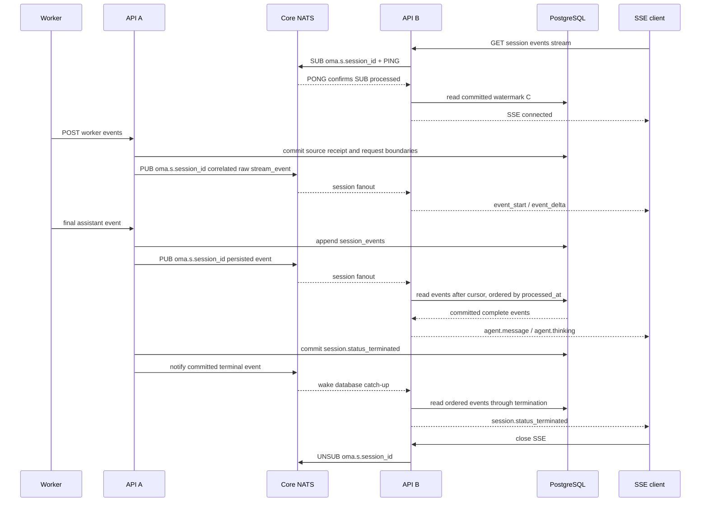

# CCR v2 Worker 事件到 Session SSE 的多实例扇出

## 结论

`POST /v1/code/sessions/{code_session_id}/worker/events` 与 Session SSE 可能落在不同 API 实例。服务端通过 `sessionfanout.EventBus` 和 Core NATS subject `oma.s.<session_id>` 按 session 扇出实时事件；完整事实与最小接收凭据存 PostgreSQL：

- NATS fanout 复用组装层的全局 `nats.Conn`，只拥有自己的订阅。每个实例按实际建立的 SSE session 动态增加普通订阅，不使用 Queue Group；所有订阅该 session 的实例各收到一份消息。不同 session 不共享业务 subject。
- 收到的每条 Worker raw stream event 在每个 API 实例转换一次，session Hub 只投递转换后的事件；每条 SSE 连接负责 preview 过滤，并从数据库按已提交处理时间补读完整事件。
- `ephemeral: true` 的 `stream_event` 正文只经过消息总线，不持久化到 PostgreSQL 或 JetStream；源 UUID、摘要与请求/块关联接收凭据在发布前写入 PostgreSQL。
- Worker ingress JWT 中已验证的 `session_id`、`public_session_id` 和 `workspace_uuid` 直接组成 stream route；原版帧在现有 Session/Code Session 事务内关联请求并记录 UUID 接收凭据；提交后使用此 route 发布 preview。
- 最终公开事件仍幂等写入现有 `session_events`。公共写入事务按 Session → Code Session 的顺序加锁，复验原 worker 请求的 epoch，并与公共状态一起提交，然后通过对应 session subject 通知已订阅实例。入口检查通过后发生 takeover 的旧 worker 仍会被事务拒绝；线程创建、可公开的内部 transcript、权限请求 metadata 和自动控制响应也在同一事务内；worker PUT 私有状态与其公共状态事件也一起提交；canonical usage 快照接入留待后续，当前不从 raw result 推算累计用量。
- 同 ID 的完整事件重试必须保持内容、事件类型和归属一致；比较忽略服务端生成的顶层时间字段，其他 JSONB 值改变时公共写入事务回滚，worker events/status HTTP 返回 409 `conflict_error`。相同内容重试保留最初时间和状态，不重新通知第二份事件。
- 消息总线中断时允许丢失预览；完整 SSE 通过每秒一次的数据库补读恢复；历史 API 使用相同顺序与序列化。
- `agent.thinking` 完整事件在公共序列化时投影为进度身份、时间与线程归属，不携带思考正文；历史和实时读取共用该投影，已有数据库 payload 保留供幂等重放。thinking `event_start` 仅保留类型和 ID，不接受 thinking 内容 delta。
- 所有 preview start/delta 都必须有可关联的事件 ID；delta 还必须对应本连接已接受的 start。旧版无 ID delta 不再直接透传，避免无法归属、去重或封口的片段进入正文。
- Worker `system` 不再通用映射为 `system.message`。`compact_boundary` 产生 `agent.thread_context_compacted`；`api_retry` / 内部 `api_error` 产生带类型、固定说明和 `retry_status: {type: retrying}` 的 `session.error`，不改变 Session 状态。初始化、compacting 中间状态和未识别诊断不生成对话内容；已有 task 生命周期继续使用其专属映射。主输出与子线程内部 transcript 复用同一进度映射，原始诊断字段不进入新公共 payload。
- 消息总线只传递事件，不保存 message、block 或 SSE 连接的关联状态。



SDK stdout 的 `api_retry.error` 是错误分类字符串，内部 transcript 的 `api_error.error` 是含 `status` 的 APIError 对象；仅在对应 subtype 解码其专属 schema，未知诊断的 error 对象不触发解析。两种形式均由运行器在等待重试前产生，不能从 attempt/max_retries 提前推断 exhausted。`task_started/task_notification` 缺少 task_id 和 tool_use_id 时返回协议错误，不再生成缺少 content 的 system.message。已明确传入的 canonical system.message 合同保持不变；旧历史不回写。

## Preview 转换

后端将 Worker `content_block_delta` 按增量片段转发，不累计或猜测文本前缀。实际沙箱原版 CLI 2.1.120 的黑盒协议验证已确认增量帧与逐块 assistant 顺序；本地 `superduck-code` 源码不能代表该二进制。该协议验证不替代真实模型对话验收。详见[一致性方案的边界](../../session-event-stream-consistency.md#升级与边界)。当前转换行为如下：

- Preview 的 `message_start.message.id` 与最终 assistant payload 的 `message.id` 都在各自 Worker JSON 解码边界修剪首尾空白，再参与确定性 ID 计算。
- `content_block_start` 根据 block type 发送一次 `event_start`。
- `text_delta.text` 原样映射成 `event_delta.delta.content.text`，公开 `delta.index` 固定为 `0`。
- `thinking_delta` 不产生 `event_delta`；`agent.thinking` 只有 `event_start` 预览。
- 缺少 message start、block start 或消息总线重连后丢失上下文时，后续 delta 直接舍弃。
- `parent_tool_use_id` 为空时归属主线程；非空时使用既有确定性 child thread ID。
- Preview SSE 保留瞬态 payload，不补 created_at、processed_at 或顶层 session_thread_id；归属继续由连接和内部 fanout route 过滤。完整事件使用数据库时间和已确定的 thread 归属，同一序列化规则同时用于 SSE、Send 与 history。

预览和最终事件共享确定性 ID：

最终 assistant content 数组中的兼容标量 block 也按 `agent.message` 和原始 block index 使用同一公式，确保 final event 能替换并清理对应 preview。

```text
seed = "assistant-preview-v1"
     + NUL + message.id
     + NUL + decimal(original_content_block_index)
     + NUL + public_event_type

id = "sevt_" + first_16_bytes_hex(
    SHA-256(code_session_id + NUL + "public" + NUL + seed)
)
```

最终 assistant 包含完整 content 数组时，数组下标就是原始 block index。若 Worker 按单 block 输出，可显式携带顶层 `content_block_index`；该字段只用于映射，不能进入公开事件。

## SSE 连接语义

`event_deltas[]` 只接受 `agent.message` 和 `agent.thinking`，超过 100 个值或包含其他值返回 `400`。每个订阅者只接收自己已经见过 `event_start` 的后续 delta，避免中途连接收到孤立 delta。

建立 SSE 时先注册本机 subscriber，再订阅 session。NATS 通过 `FlushWithContext` 等待服务端处理 SUB，确认成功后读取数据库水位 C，再向客户端发送 `: connected`。如果订阅失败，则仅依赖数据库兜底读取完整事件。确认任务最多运行 5 秒并受 fanout 生命周期约束；单个请求取消会停止自身等待，但不会取消同 subject 的共享确认。多个 SSE 连接订阅同一 session 时复用同一个 broker 订阅、确认结果和实例级 preview converter。NATS subject 的 session ID 只允许字母、数字、下划线和连字符，拒绝通配符、点号和空白；subject 路由不能替代 API 鉴权与 Hub workspace 匹配。

实例维护 `subject → subscription state` registry，只用于让同一进程内订阅同一 session 的 SSE 连接复用一个 NATS subscription、首次确认结果和引用计数。registry mutex 只保护 map、引用计数和 ready/result 等内存状态；`FlushWithContext`、publish、handler、reset callback 和 subscription unsubscribe 均不在锁内执行。第一个订阅者启动确认，其他并发订阅者等待同一个 ready 结果。

每个成功建立的 SSE 都持有一个引用，连接结束时释放；最后一个引用释放后取消对应 broker subscription。实例收到 `session.status_terminated` 后，将终态事件加入本地 SSE 队列并清理该 session 的 preview 状态；broker subscription 仍由活跃 SSE 的引用生命周期管理，避免终态强制删除后旧连接的延迟释放误伤新订阅。idle 和 thread terminated 也不会主动退订。订阅恢复和回调调度直接使用 nats.go 的既有能力，不在应用层维护 generation 或手动重订阅状态机。

Hub subscriber 只以 `workspace_uuid + session_id` 匹配转换后的 preview 或持久事件。线程范围、`event_deltas[]` 类型和 `event_start`/`event_delta` 配对由 SSE 连接自己的状态过滤。Worker raw payload 每个实例只转换一次；各 SSE 连接保存完整事件游标和活动 preview ID。预览 start 到达时检查同 ID final 是否已经持久化，避免迟到 start 重开已完成消息。单连接缓冲区为 256 个 delivery；缓冲区满时关闭连接，而不是丢弃某个中间 delta 后继续发送，避免主动选择性丢帧；没有 worker ordinal 时，仍不能保证 Core NATS 静默丢帧后的连续前缀。

同 scope 的 request start 成为当前预览边界；只有内部关联 ID 匹配当前请求的 start/delta 才被接受。request end 只关闭它所引用的当前请求，未知迟到 start、旧 end、旧连接预览均不能影响新请求。Session terminated/deleted 关闭全部 scope，thread terminated 只关闭 payload 明确指向的线程。补读扫描同 Session 全部记录以观察主流上的子线程终态控制，再按连接范围输出。新连接不重放已有 request 的预览，完整事件仍从历史恢复。

主线程 preview 在 fanout 内表示为 primary scope，不携带生产端查出的 thread ID。SSE 建立时接收实例已经确保 primary thread 存在，并在连接状态中记录 primary scope，因此可以直接匹配主线程 preview。`parent_tool_use_id` 非空时仍使用确定性 child thread ID 精确匹配，不会将主线程 preview 写入子线程 SSE。

Worker HTTP 重试可能重复发布 ephemeral 事件。每个 API 实例按 `session_id + code_session_id + worker_epoch + payload.uuid` 做有界临时去重；此 LRU 只避免重复转换；首次接收的 UUID→请求/块关联另由 migration 00060 的 receipt 持久化，防止超时旧 handler 在新请求之后执行时发生误绑定，receipt 不存 token 正文。同一实例上的多个 SSE 共享转换结果，不复制 message/block 状态机和去重 LRU。

实例级 converter 使用一个 mutex 保护 message/block 和去重状态；Worker JSON 在锁外解析，锁内只进行内存状态转换。转换完成并释放 converter 锁后，Hub 再获取自己的锁广播事件，两把锁不嵌套。连接进入 `RECONNECTING` 时，每个活跃 session 只收到一次 `reconnect` reset：清空该 session 的 converter 状态和去重键，并向该 session 的 Hub 连接投递 reset marker。连接按队列顺序清空 `activePreviewIDs`，之后缺少上下文的 delta 会被丢弃；`DISCONNECTED`、恢复后的 `CONNECTED` 等相邻状态不会重复触发 reset。

每个已订阅 session 都有一个普通异步 NATS subscription。nats.go 负责其 pending queue、回调串行执行和重连后的自动恢复；应用不再叠加第二层消息队列、消费协程、overflow reset 或 generation 过滤。恢复窗口和任一进程处理能力不足时均允许丢失预览或断开慢 SSE；这条链路不是逐 token 可靠传输，最终状态仍以 PostgreSQL 和历史 API 为准。

## 故障与发布顺序

- `/worker/events` 必须先完成整批解析和 worker epoch gate。混合批次的持久 output、状态、权限 metadata 与自动回复通过同一事务提交后，才发布本批任何 preview；持久提交失败不会发布本批 preview。纯原版 preview 批次也经过同一事务固定接收身份，不保存 token 正文；不再依赖纯内存状态推断跨批次请求。
- 批量与单事件入口在分类前使用同一套 payload 规范化逻辑；已通过批量协议校验的事件会补齐缺失的 `session_id`、`created_at` 和 `timestamp`，stream fanout 发布规范化后的 payload。
- 同一请求的持久 output 保持原始顺序，每个 output 后及时物化已能关联的 transcript；preview 之间保持原始顺序，但混合批次的 preview 统一在持久提交后发布。每个 stream event 独立发布为一个 fanout envelope，避免 Worker ingress 批次形成超大 broker 消息或让单次发布失败连带丢失同批 preview。Core NATS 保留同一发布连接的发送顺序，不承诺多个发布者之间的 session 全局顺序。
- 一批已持久化事件若包含多个 session，发布前按 session 分组，每个 envelope 只进入对应 session subject。
- 持久化事件的 fanout wire contract 只包含 SSE 路由与响应所需的 `external_id`、`workspace_uuid`、`session_id`、`thread_id`、`event_type`、`payload`、`processed_at` 和 `created_at`；不序列化完整数据库事件模型。
- Preview 的 fanout 序列化或 broker publish 失败只记录结构化元数据，不记录原始 payload，也不中断同一 worker batch 中后续的 control 或持久事件。
- 应用关闭时先取消 fanout 上下文、取消 NATS subscriptions 并等待接收协程退出，再由组装层 drain 全局 NATS 连接。
- 升级需要 migration 00059 和 00060，并停止旧 writer 后切换；旧 writer 不推进新水位，不能与新的数据库尾读混写。包含 `message.id` 的最终 assistant 继续使用既有稳定 ID。
- 复用现有 Yourbatis Mapper，migration 00059 新增一个 Session 内部处理时钟和事件索引；migration 00060 增加最小 UUID 接收凭据表，不增加 outbox 或 Redis Streams。

本版不增加 SSE `id:`/`Last-Event-ID` 合同。SSE 每秒按水位补读覆盖提交后发布前的崩溃窗口，客户端重连先建立流再获取完整历史快照并按 ID 合并。NATS envelope 中完整事件的 payload 仅作为既有内部消息格式保留，不允许直接绕过数据库游标返回。详见 [一致性方案与实施范围](../../session-event-stream-consistency.md)。

前端在 live request start 切换请求、匹配的 end/明确终态时封闭相应 preview，历史回填的旧 end 不清当前草稿；普通 EOF 先补读历史 final，再丢弃断开时仍未完成的草稿并重连。子线程 idle 的延迟收敛也按明确线程 ID 限定，不能清理主线程正文。

## 验收

- `just generate` 后运行 `go test -race ./internal/sessionfanout ./internal/sessions ./internal/natsclient -count=1`。
- NATS bus 测试覆盖非法 subject/envelope、取消、关闭共享连接边界、畸形消息日志脱敏、真实 server 重启与自动恢复、引用计数订阅复用、跨实例广播、顺序和退订再订阅。
- Sessions 集成测试使用独立 NATS 连接模拟发布实例和两个 SSE 实例，覆盖同实例多连接、preview/final/terminal 的 SSE 编码以及 workspace/session 隔离。
- `TEST_NATS_URL=nats://127.0.0.1:4222,nats://127.0.0.1:4223,nats://127.0.0.1:4224 go test ./internal/sessions -run TestNATSFanout -count=1 -v` 可复跑同一集成链路到本地 Compose 集群；测试使用唯一 session subject，不改数据库。

## 原版 CLI 接收边界

原版 2.1.120 的黑盒协议验证确认：同一模型响应可逐块发送 assistant，且缺少 content_block_index；message_stop 晚于这些完整块。服务端据 message_start.message.id 与 content_block_start.index 在事务内补齐身份。重试保持源 UUID，但会重组 POST 批次；超时旧 handler 还可能晚于其重试执行。因此接收凭据按事件 UUID 去重，不能按整个请求 body 去重，也不能用另一通道的 worker idle 代替 message_stop/result 关闭事实。

原版 source UUID 的首次关联、请求 span、完整事件同事务提交后，才发布带内部 model_request_id 的流式帧。内部恢复字段在 SSE/history 的共同序列化边界剥离。显式 canonical preview writer 需携 model_request_start_id，关联字段不进入公共 SSE。历史查询不再根据后续 child copy 隐藏已接受工具记录。

接收关联依赖已验证的原版串行上传与重试 UUID 合同；自定义发送方首次上传无关联帧时若跨请求任意乱序，必须补明确身份。恢复按 processed_at 与 event ID 回放，避免跨实例 created_at 偏差重新打开旧请求。
