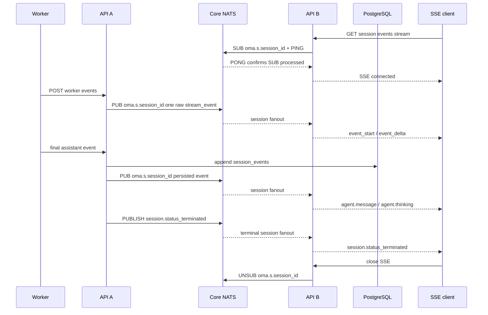

# CCR v2 Worker 事件到 Session SSE 的多实例扇出

## 结论

`POST /v1/code/sessions/{code_session_id}/worker/events` 与 Session SSE 可能落在不同 API 实例。服务端通过 `sessionfanout.EventBus` 和 Core NATS subject `oma.s.<session_id>` 按 session 扇出实时事件，不新增 PostgreSQL 表：

- NATS fanout 复用组装层的全局 `nats.Conn`，只拥有自己的订阅。每个实例按实际建立的 SSE session 动态增加普通订阅，不使用 Queue Group；所有订阅该 session 的实例各收到一份消息。不同 session 不共享业务 subject。
- 收到的每条 Worker raw stream event 在每个 API 实例转换一次，session Hub 只投递转换后的事件；每条 SSE 连接只负责线程、事件类型和 preview 生命周期过滤。
- `ephemeral: true` 的 `stream_event` 只经过消息总线，不持久化到 PostgreSQL 或 JetStream。
- Worker ingress JWT 中已验证的 `session_id`、`public_session_id` 和 `workspace_uuid` 直接组成 stream route；生产端不为每批 preview 重新查询 code session、public session 或 primary thread。
- 最终公开事件仍幂等写入现有 `session_events`，事务提交后再通过对应 session subject 通知已订阅实例。
- 消息总线中断时允许丢失预览；最终事件仍可通过 Sessions Events API 获取。
- 消息总线只传递事件，不保存 message、block 或 SSE 连接的关联状态。



## Preview 转换

实际 Worker 协议中的 `content_block_delta` 已经是真正的增量片段，不是 full-so-far snapshot。后端不累计或比较文本：

- Preview 的 `message_start.message.id` 与最终 assistant payload 的 `message.id` 都在各自 Worker JSON 解码边界修剪首尾空白，再参与确定性 ID 计算。
- `content_block_start` 根据 block type 发送一次 `event_start`。
- `text_delta.text` 原样映射成 `event_delta.delta.content.text`，公开 `delta.index` 固定为 `0`。
- `thinking_delta` 不产生 `event_delta`；`agent.thinking` 只有 `event_start` 预览。
- 缺少 message start、block start 或消息总线重连后丢失上下文时，后续 delta 直接舍弃。
- `parent_tool_use_id` 为空时归属主线程；非空时使用既有确定性 child thread ID。
- Preview SSE 没有自己的 `id`、`created_at` 或 `processed_at`；关联 ID 只在 `event_start.event.id` / `event_delta.event_id` 中。内部接收时间只用于转换与清理，不进入公开 preview envelope。

预览和最终事件共享确定性 ID：

最终 assistant content 数组中的兼容标量 block 也按 `agent.message` 和原始 block index 使用同一公式，确保 final event 能替换并清理对应 preview。

```text
seed = "assistant-preview-v1"
     + NUL + message.id
     + NUL + decimal(original_content_block_index)
     + NUL + public_event_type

id = "sevt_" + first_16_bytes_hex(
    SHA-256(code_session_id + NUL + "public" + NUL + seed)
)
```

最终 assistant 包含完整 content 数组时，数组下标就是原始 block index。若 Worker 按单 block 输出，可显式携带顶层 `content_block_index`；该字段只用于映射，不能进入公开事件。

## SSE 连接语义

`event_deltas[]` 只接受 `agent.message` 和 `agent.thinking`，超过 100 个值或包含其他值返回 `400`。每个订阅者只接收自己已经见过 `event_start` 的后续 delta，避免中途连接收到孤立 delta。

建立 SSE 时先注册本机 subscriber，再订阅 session。NATS 通过 `FlushWithContext` 等待服务端处理 SUB，确认成功后才向客户端发送 `: connected`。确认任务最多运行 5 秒并受 fanout 生命周期约束；单个请求取消会停止自身等待，但不会取消同 subject 的共享确认。多个 SSE 连接订阅同一 session 时复用同一个 broker 订阅、确认结果和实例级 preview converter。NATS subject 的 session ID 只允许字母、数字、下划线和连字符，拒绝通配符、点号和空白；subject 路由不能替代 API 鉴权与 Hub workspace 匹配。

实例维护 `subject → subscription state` registry，只用于让同一进程内订阅同一 session 的 SSE 连接复用一个 NATS subscription、首次确认结果和引用计数。registry mutex 只保护 map、引用计数和 ready/result 等内存状态；`FlushWithContext`、publish、handler、reset callback 和 subscription unsubscribe 均不在锁内执行。第一个订阅者启动确认，其他并发订阅者等待同一个 ready 结果。

每个成功建立的 SSE 都持有一个引用，连接结束时释放；最后一个引用释放后取消对应 broker subscription。实例收到 `session.status_terminated` 后，将终态事件加入本地 SSE 队列并清理该 session 的 preview 状态；broker subscription 仍由活跃 SSE 的引用生命周期管理，避免终态强制删除后旧连接的延迟释放误伤新订阅。idle 和 thread terminated 也不会主动退订。订阅恢复和回调调度直接使用 nats.go 的既有能力，不在应用层维护 generation 或手动重订阅状态机。

Hub subscriber 只以 `workspace_uuid + session_id` 匹配转换后的 preview 或持久事件。线程范围、`event_deltas[]` 类型和 `event_start`/`event_delta` 配对由 SSE 连接自己的状态过滤。Worker raw payload 每个实例只转换一次；各 SSE 连接不重复解析，也不维护 message/block 或去重状态。单连接缓冲区为 256 个 delivery；缓冲区满时关闭连接，而不是丢弃某个中间 delta 后继续发送，从而保证客户端只看到连续前缀。

主线程 preview 在 fanout 内表示为 primary scope，不携带生产端查出的 thread ID。SSE 建立时接收实例已经确保 primary thread 存在，并在连接状态中记录 primary scope，因此可以直接匹配主线程 preview。`parent_tool_use_id` 非空时仍使用确定性 child thread ID 精确匹配，不会将主线程 preview 写入子线程 SSE。

Worker HTTP 重试可能重复发布 ephemeral 事件。每个 API 实例按 `session_id + code_session_id + worker_epoch + payload.uuid` 做有界临时去重；该状态与活动 preview 状态均不进入 PostgreSQL。同一实例上的多个 SSE 共享转换结果，不复制 message/block 状态机和去重 LRU。

实例级 converter 使用一个 mutex 保护 message/block 和去重状态；Worker JSON 在锁外解析，锁内只进行内存状态转换。转换完成并释放 converter 锁后，Hub 再获取自己的锁广播事件，两把锁不嵌套。连接进入 `RECONNECTING` 时，每个活跃 session 只收到一次 `reconnect` reset：清空该 session 的 converter 状态和去重键，并向该 session 的 Hub 连接投递 reset marker。连接按队列顺序清空 `activePreviewIDs`，之后缺少上下文的 delta 会被丢弃；`DISCONNECTED`、恢复后的 `CONNECTED` 等相邻状态不会重复触发 reset。

每个已订阅 session 都有一个普通异步 NATS subscription。nats.go 负责其 pending queue、回调串行执行和重连后的自动恢复；应用不再叠加第二层消息队列、消费协程、overflow reset 或 generation 过滤。恢复窗口和任一进程处理能力不足时均允许丢失预览或断开慢 SSE；这条链路不是逐 token 可靠传输，最终状态仍以 PostgreSQL 和历史 API 为准。

## 故障与发布顺序

- `/worker/events` 必须先完成整批解析和 worker epoch gate，再发布任何 preview。
- 批量与单事件入口在分类前使用同一套 payload 规范化逻辑；已通过批量协议校验的事件会补齐缺失的 `session_id`、`created_at` 和 `timestamp`，stream fanout 发布规范化后的 payload。
- 同一请求内保持原始事件顺序；每个 stream event 独立发布为一个 fanout envelope，避免 Worker ingress 批次形成超大 broker 消息或让单次发布失败连带丢失同批 preview。Core NATS 保留同一发布连接的发送顺序，不承诺多个发布者之间的 session 全局顺序。
- 一批已持久化事件若包含多个 session，发布前按 session 分组，每个 envelope 只进入对应 session subject。
- 持久化事件的 fanout wire contract 只包含 SSE 路由与响应所需的 `external_id`、`workspace_uuid`、`session_id`、`thread_id`、`event_type`、`payload`、`processed_at` 和 `created_at`；不序列化完整数据库事件模型。
- Preview 的 fanout 序列化或 broker publish 失败只记录结构化元数据，不记录原始 payload，也不中断同一 worker batch 中后续的 control 或持久事件。
- 应用关闭时先取消 fanout 上下文、取消 NATS subscriptions 并等待接收协程退出，再由组装层 drain 全局 NATS 连接。
- 后端可以先发布：旧 Worker 的 ephemeral stream 不影响持久化合同；包含 `message.id` 的最终 assistant 会使用新的稳定 ID。
- 不需要 migration、outbox、Redis Streams 或新的 Yourbatis Mapper。

本版不增加 SSE `id:`/`Last-Event-ID` 回放，也不解决数据库提交后发布前的崩溃窗口。最终事件的可靠恢复依赖客户端通过历史 API 补拉；需要可靠通知时再引入事务 outbox。启用 JetStream 只是基础设施就绪，不会自动持久化 Core NATS 消息。

## 验收

- `just generate` 后运行 `go test -race ./internal/sessionfanout ./internal/sessions ./internal/natsclient -count=1`。
- NATS bus 测试覆盖非法 subject/envelope、取消、关闭共享连接边界、畸形消息日志脱敏、真实 server 重启与自动恢复、引用计数订阅复用、跨实例广播、顺序和退订再订阅。
- Sessions 集成测试使用独立 NATS 连接模拟发布实例和两个 SSE 实例，覆盖同实例多连接、preview/final/terminal 的 SSE 编码以及 workspace/session 隔离。
- `TEST_NATS_URL=nats://127.0.0.1:4222,nats://127.0.0.1:4223,nats://127.0.0.1:4224 go test ./internal/sessions -run TestNATSFanout -count=1 -v` 可复跑同一集成链路到本地 Compose 集群；测试使用唯一 session subject，不改数据库。

## 每次模型请求的生命周期

对于 code-session OAuth 发起的 `POST /v1/messages`，代理在调用上游前生成并持久化
`span.model_request_start`，沿用上述 PG + NATS 投递路径。每次 HTTP 尝试（包括 Worker 重试）
各自拥有一对 start/end；工具执行和整轮 `result` 不属于同一次模型请求。
start 写入失败时不转发上游请求；生命周期事件的写入错误必须返回调用方，不能静默跳过。
普通 `system`（init、hook 等）和成功 `result` 不生成公开消息；显式 `system.message` 仍保留。
失败 `result` 生成 `session.error`，使用官方 `unknown_error` / exhausted 表达无法进一步归因的执行失败，只公开已知失败类别的安全文案，不透传原始错误、结果和凭据字段。
内部 transcript 入口保持不变；不会把 stdout 诊断写入恢复用 transcript。未单独上报到内部入口的
init/hook/result 不另行持久化。`result` 不驱动 Session 状态，也不使用 `duration_api_ms` 或汇总 usage 补造 span。
接受主线程 `user.message` 时激活本轮，在同一事务内更新 Session/主线程为 running，并按
`session.status_running → session.thread_status_running` 写入、广播，沿用 Qoder 的激活顺序。用户消息同时持久化为排队记录，Worker ACK 开始处理后再广播 `user.message`。
这里 running 表示任务已激活，不表示模型 HTTP 请求已发出。事务在 Session 锁内判断当前状态，
已处于 running 时不重复写入状态对；Worker 后续上报或并发输入也复用这个去重规则。
发送接口仍只返回客户端提交的事件。idle 和无新消息的恢复执行继续由 Worker 状态上报驱动；
工具审批仍使用带 `requires_action` 原因的 idle。
Worker 初始化的 idle 不代表已接受任务执行完毕。内部字段 `worker_turn_started` 记录当前 Worker
是否已显式上报 running：注册 Worker 或接受新一轮主线程消息时清零，显式 running 置为 true。
普通 idle 只在该标记为 true 时同步公开状态；metadata-only 更新不改变标记。
完成后保留标记，保证“Worker 状态已写入、公开事件写入失败”时重试 idle 仍能补齐结束事件。
这避免启动时出现 `running → user.message → idle → running`；标记不进入公开 API。
这样 result 与 Worker idle 的先后顺序不会产生两条结束事件，迟到 result 也不会结束新一轮。
Session 与 thread 的 running/idle 事件分别表达整体任务状态和线程状态。公开事件桥接按
`session.status_running → session.thread_status_running`、`session.thread_status_idle → session.usage → session.status_idle`
生成主线程配套事件，两者共用时间戳，保留相同的 stop_reason（包括 requires_action.event_ids），
配套 ID 由原状态事件 ID 派生，重复发布保持幂等。子线程仍由 task 事件驱动。
本轮首次用户消息与前置 running 对共用接收时间；消息的 `processed_at` 在排队期间为 null，Worker processing/processed ACK 后设置，不伪造毫秒偏移。
批次写入失败时状态转换和事件一起回滚；子线程输入不激活主线程。

关联使用现有标识，不增加请求注册表：

- 代理将 start ID 作为响应 `request-id`，Worker 的 `assistant.request_id` 原样带回，
  映射为消息的 `model_request_start_id`。原上游 request ID 保留在 end 的
  `upstream_request_id` 中，供诊断使用。只有 code-session 请求覆盖响应 request ID。
- start/end 的 `request_id` 都是 start ID，end 另外通过 `model_request_start_id` 精确引用 start。
- `message_start.message.id` 加内容块索引，继续生成 preview 和最终消息共用的公开 event ID。
  end 的 `event_ids` 列出这些消息 ID；`tool_use_ids` 记录该请求产生的工具调用 ID。
- 子请求的 `x-claude-code-agent-id` 对应 `task_started.task_id`，由已持久化的
  `session.thread_created` 找到 thread。该注册表按页读取，不另设内存缓存。
  CCR 投递晚于代理请求时，代理在转发前最多等待 10 秒；超时或取消返回错误，绝不退回主线程。
  最终子消息继续通过 `parent_tool_use_id` 指向同一个确定性 thread ID。

代理逐帧观察响应，不修改 SSE body。`message_start.usage` 与 `message_delta.usage` 按字段合并，
其中输出 token 数是本次请求累计值。正常 `message_stop` 将完整 `agent.message` / 无内容的 `agent.thinking` 与 end 按顺序放入同一写入批次；provider error 只发布 end；
非流式响应完成、HTTP 错误、网络错误、缺失 stop 的 EOF 和客户端取消也会收尾。
取消后的落库使用独立 5 秒 context；持久化失败记录 start ID 和错误，不记录原始响应。
单帧、累计文本和非流式 JSON 的观察缓冲上限为 4 MiB，超过上限仍原样转发，但 end 标记
`observation_limit`（观测超过上限，不代表模型本身失败），保留已观察到的 usage。进程被强制杀死的恢复不由请求内 defer 保证。

代理先发布最终消息再发布 end；Worker 后续 echo 使用相同消息 ID，由数据库幂等写入去重。
end 使用 `model_usage` 和 `is_error`，通过 `model_request_start_id` 关联 start。
`event_ids`、`tool_use_ids` 和诊断字段仍是本地扩展，不是 CMA 保证字段。
SSE 在最终消息或 end 后关闭相应线程的预览，忽略迟到的 start/delta；不要求错误路径一定有最终消息。

历史 Events API 按 `processed_at` 排序，同一时间保留数据库写入顺序；数据库 identity 只用于 SQL
内部排序，不进入公开模型。事件游标包含 `processed_at` 与 `external_id`，查询在租户和 Session
范围内解析该事件的排序位置。`created_at[...]` 按官方定义筛选 **processed_at**。未处理记录保持 null；升序历史将其放在已处理记录后，游标支持该状态。事件批次不按随机 ID 重排，
也不再人为增加毫秒。实时缓存同时间戳保持服务端顺序，全量历史同步以分页返回顺序校正缓存。事件桥接和响应保留小数秒，代理时间截到 PostgreSQL
可保存的微秒精度。不回填或重写旧 Session 的错误 span。

验收覆盖 `tests/model_request_lifecycle_test.go`：发送前 start 持久化、并发主/子请求、晚到 task 映射、
失败/取消、单次 usage、晚到 result 不产生额外 span，以及 同时间戳写入顺序、created_at 筛选和双向分页。
Claude Code 2.1.251 和 2.1.278 的独立假网关验证确认了上述 header/task/message 关联；
这不等同于 Linux sandbox 与真实模型供应商的完整 E2E。

`tests/session_worker_status_test.go` 验证初始化/重复 idle、Worker 重注册、结束发布重试，以及正常、失败、乱序下的唯一 idle；同时覆盖真实 SSE 与历史的主线程状态顺序、公开诊断过滤和审批原因。

## 累计用量与线程状态

每个 `span.model_request_end` 仅在首次插入时累计 Session 与所属线程的实际计数。
当前报告 input/output/cache-read，以及上游确实返回的 5 分钟 / 1 小时 cache-creation 分项；
nil 保持缺失，显式 0 保留。没有来源的计费金额、active_seconds、server_tool_use 不填估计值。

每次真正发布 Session idle，紧前发布 `session.usage`，`budget` 为 null。
usage 的序列化由 sessions 资源层提供；DB 在 Session 行锁内用最新累计值生成并保存快照，
避免同批 end/idle 或并发线程读到旧值。重复 end 不重复累计，重复事件 ID 不重新推动状态。
线程状态和事件同一事务提交。仍有 running/rescheduling 线程时，仅发布线程 idle，不发布 Session usage/idle。

## 工具、输入与资源事件

- assistant 工具块和 can_use_tool 使用同一 public invocation ID，覆盖无需询问的自动放行调用。
- built-in 使用 `agent.tool_use → agent.tool_result.tool_use_id`；MCP 使用
  `agent.mcp_tool_use → agent.mcp_tool_result.mcp_tool_use_id`。
- `user.tool_confirmation` 只能引用 ask 的 built-in/MCP 调用；拒绝非 ask、错误类别、重复回复和 allow 携带 deny_message。
  子线程 owner/primary 两个投影归一到同一个待处理调用。
- 确认通过 control_response 送给 Worker，携带公共输入 ID。处理 ACK 后清理该调用的等待记录；
  还有其他调用未处理时重新发布 requires_action 的剩余集合，全部完成才恢复 running。
- AskUserQuestion 是本地 custom adapter：`agent.custom_tool_use → user.custom_tool_result`。
  不套用 permission policy；显式 disabled 仍禁用。成功结果必须是文本 JSON answers 对象，写入前验证。
- `user.interrupt` 转成 SDK interrupt control_request；发送响应 processed_at 为 null，处理后才广播。
- Worker compact_boundary 映射为 `agent.thread_context_compacted`；init/hook 继续留在内部诊断边界。
- session.updated 只含实际改变字段；no-op 不写事件。更新与事件写入同一事务，并检查并发版本。
- archive 在同一事务写 thread/session terminated；delete 成功提交后通知活动 SSE 并关闭连接。

### 当前能力边界

CMA 与 Claude Code Worker 的能力并不等同。当前 Worker 没有动态 system-prompt 更新和通用 custom-tool-result 注入协议；
`system.message` 输入、通用 custom result、self-hosted `user.tool_result` 明确返回 400，避免成功接收后无执行效果。
服务端显式输出的 system.message 仍可发布。通用 custom 声明不会伪装成可执行的 AskUserQuestion。
预算执行、initial_events 原子创建、outcome evaluator 生命周期不由这次事件适配实现；识别事件枚举不表示具备执行能力。
当前 Worker 的 idle 上报不携带失败/预算原因，因此不能仅凭与它独立投递的 result 准确补出所有 retries_exhausted/budget_reached；普通 idle 仍使用 end_turn。
要完整对齐这些 stop_reason，需要 Worker 在状态上报中提供同一轮的完成原因，不能通过延迟等待或倒推伪造。

验收：`tests/session_event_contract_test.go` 覆盖同批 end/idle 快照、重复上报不计重、线程聚合、部分确认、重复确认和 MCP 配对；
`tests/session_worker_status_test.go` 通过实际 Worker SSE + delivery ACK 比较实时与历史顺序。
