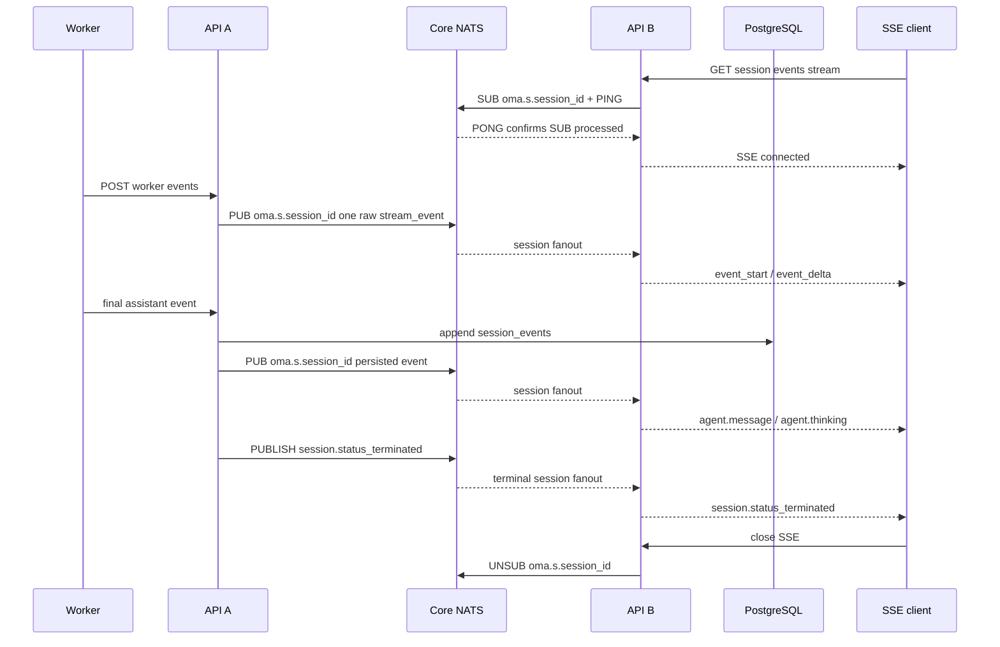
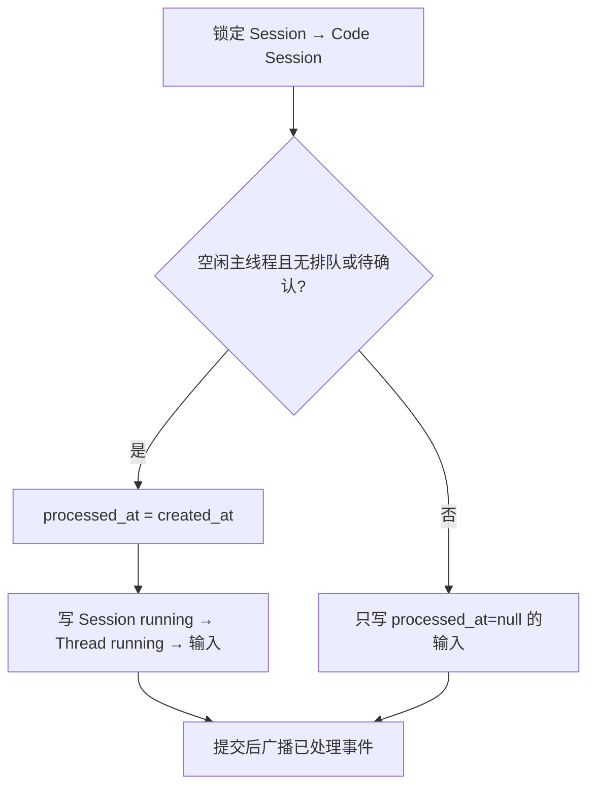

# CCR v2 Worker 事件到 Session SSE 的多实例扇出

## 结论

`POST /v1/code/sessions/{code_session_id}/worker/events` 与 Session SSE 可能落在不同 API 实例。服务端通过 `sessionfanout.EventBus` 和 Core NATS subject `oma.s.<session_id>` 按 session 扇出实时事件，不新增 PostgreSQL 表：

- NATS fanout 复用组装层的全局 `nats.Conn`，只拥有自己的订阅。每个实例按实际建立的 SSE session 动态增加普通订阅，不使用 Queue Group；所有订阅该 session 的实例各收到一份消息。不同 session 不共享业务 subject。
- 收到的每条 Worker raw stream event 在每个 API 实例转换一次，session Hub 只投递转换后的事件；每条 SSE 连接只负责线程、事件类型和 preview 生命周期过滤。
- `ephemeral: true` 的 `stream_event` 只经过消息总线，不持久化到 PostgreSQL 或 JetStream。
- Worker ingress JWT 中已验证的 `session_id`、`public_session_id` 和 `workspace_uuid` 直接组成 stream route；生产端不为每批 preview 重新查询 code session、public session 或 primary thread。
- 最终公开事件仍幂等写入现有 `session_events`，事务提交后再通过对应 session subject 通知已订阅实例。
- 消息总线中断时允许丢失预览；最终事件仍可通过 Sessions Events API 获取。
- 消息总线只传递事件，不保存 message、block 或 SSE 连接的关联状态。



## Preview 转换

实际 Worker 协议中的 `content_block_delta` 已经是真正的增量片段，不是 full-so-far snapshot。后端不累计或比较文本：

- Preview 的 `message_start.message.id` 与最终 assistant payload 的 `message.id` 都在各自 Worker JSON 解码边界修剪首尾空白，再参与确定性 ID 计算。
- `content_block_start` 根据 block type 发送一次 `event_start`。
- `text_delta.text` 原样映射成 `event_delta.delta.content.text`，公开 `delta.index` 固定为 `0`。
- `thinking_delta` 不产生 `event_delta`；`agent.thinking` 只有 `event_start` 预览。
- 缺少 message start、block start 或消息总线重连后丢失上下文时，后续 delta 直接舍弃。
- `parent_tool_use_id` 为空时归属主线程；非空时使用既有确定性 child thread ID。
- Preview SSE 的 `created_at` 使用规范化 worker payload 的创建时间，缺失或无效时回退到接收时间；`processed_at` 使用接收实例的转换时间。接收实例使用 SSE 已解析出的实际订阅线程 ID 补充 `session_thread_id`，主线程 preview 不需要在生产端查询物理 thread ID。

预览和最终事件共享确定性 ID：

最终 assistant content 数组中的兼容标量 block 也按 `agent.message` 和原始 block index 使用同一公式，确保 final event 能替换并清理对应 preview。

```text
seed = "assistant-preview-v1"
     + NUL + message.id
     + NUL + decimal(original_content_block_index)
     + NUL + public_event_type

id = "sevt_" + first_16_bytes_hex(
    SHA-256(code_session_id + NUL + "public" + NUL + seed)
)
```

最终 assistant 包含完整 content 数组时，数组下标就是原始 block index。若 Worker 按单 block 输出，可显式携带顶层 `content_block_index`；该字段只用于映射，不能进入公开事件。

## SSE 连接语义

`event_deltas[]` 只接受 `agent.message` 和 `agent.thinking`，超过 100 个值或包含其他值返回 `400`。每个订阅者只接收自己已经见过 `event_start` 的后续 delta，避免中途连接收到孤立 delta。

建立 SSE 时先注册本机 subscriber，再订阅 session。NATS 通过 `FlushWithContext` 等待服务端处理 SUB，确认成功后才向客户端发送 `: connected`。确认任务最多运行 5 秒并受 fanout 生命周期约束；单个请求取消会停止自身等待，但不会取消同 subject 的共享确认。多个 SSE 连接订阅同一 session 时复用同一个 broker 订阅、确认结果和实例级 preview converter。NATS subject 的 session ID 只允许字母、数字、下划线和连字符，拒绝通配符、点号和空白；subject 路由不能替代 API 鉴权与 Hub workspace 匹配。

实例维护 `subject → subscription state` registry，只用于让同一进程内订阅同一 session 的 SSE 连接复用一个 NATS subscription、首次确认结果和引用计数。registry mutex 只保护 map、引用计数和 ready/result 等内存状态；`FlushWithContext`、publish、handler、reset callback 和 subscription unsubscribe 均不在锁内执行。第一个订阅者启动确认，其他并发订阅者等待同一个 ready 结果。

每个成功建立的 SSE 都持有一个引用，连接结束时释放；最后一个引用释放后取消对应 broker subscription。实例收到 `session.status_terminated` 后，将终态事件加入本地 SSE 队列并清理该 session 的 preview 状态；broker subscription 仍由活跃 SSE 的引用生命周期管理，避免终态强制删除后旧连接的延迟释放误伤新订阅。idle 和 thread terminated 也不会主动退订。订阅恢复和回调调度直接使用 nats.go 的既有能力，不在应用层维护 generation 或手动重订阅状态机。

Hub subscriber 只以 `workspace_uuid + session_id` 匹配转换后的 preview 或持久事件。线程范围、`event_deltas[]` 类型和 `event_start`/`event_delta` 配对由 SSE 连接自己的状态过滤。Worker raw payload 每个实例只转换一次；各 SSE 连接不重复解析，也不维护 message/block 或去重状态。单连接缓冲区为 256 个 delivery；缓冲区满时关闭连接，而不是丢弃某个中间 delta 后继续发送，从而保证客户端只看到连续前缀。

主线程 preview 在 fanout 内表示为 primary scope，不携带生产端查出的 thread ID。SSE 建立时接收实例已经确保 primary thread 存在，并在连接状态中记录 primary scope，因此可以直接匹配主线程 preview。`parent_tool_use_id` 非空时仍使用确定性 child thread ID 精确匹配，不会将主线程 preview 写入子线程 SSE。

Worker HTTP 重试可能重复发布 ephemeral 事件。每个 API 实例按 `session_id + code_session_id + worker_epoch + payload.uuid` 做有界临时去重；该状态与活动 preview 状态均不进入 PostgreSQL。同一实例上的多个 SSE 共享转换结果，不复制 message/block 状态机和去重 LRU。

实例级 converter 使用一个 mutex 保护 message/block 和去重状态；Worker JSON 在锁外解析，锁内只进行内存状态转换。转换完成并释放 converter 锁后，Hub 再获取自己的锁广播事件，两把锁不嵌套。连接进入 `RECONNECTING` 时，每个活跃 session 只收到一次 `reconnect` reset：清空该 session 的 converter 状态和去重键，并向该 session 的 Hub 连接投递 reset marker。连接按队列顺序清空 `activePreviewIDs`，之后缺少上下文的 delta 会被丢弃；`DISCONNECTED`、恢复后的 `CONNECTED` 等相邻状态不会重复触发 reset。

每个已订阅 session 都有一个普通异步 NATS subscription。nats.go 负责其 pending queue、回调串行执行和重连后的自动恢复；应用不再叠加第二层消息队列、消费协程、overflow reset 或 generation 过滤。恢复窗口和任一进程处理能力不足时均允许丢失预览或断开慢 SSE；这条链路不是逐 token 可靠传输，最终状态仍以 PostgreSQL 和历史 API 为准。

## 故障与发布顺序

- `/worker/events` 必须先完成整批解析和 worker epoch gate，再发布任何 preview。
- 批量与单事件入口在分类前使用同一套 payload 规范化逻辑；已通过批量协议校验的事件会补齐缺失的 `session_id`、`created_at` 和 `timestamp`，stream fanout 发布规范化后的 payload。
- 同一请求内保持原始事件顺序；每个 stream event 独立发布为一个 fanout envelope，避免 Worker ingress 批次形成超大 broker 消息或让单次发布失败连带丢失同批 preview。Core NATS 保留同一发布连接的发送顺序，不承诺多个发布者之间的 session 全局顺序。
- 一批已持久化事件若包含多个 session，发布前按 session 分组，每个 envelope 只进入对应 session subject。
- 持久化事件的 fanout wire contract 只包含 SSE 路由与响应所需的 `external_id`、`workspace_uuid`、`session_id`、`thread_id`、`event_type`、`payload`、`processed_at` 和 `created_at`；不序列化完整数据库事件模型。
- Preview 的 fanout 序列化或 broker publish 失败只记录结构化元数据，不记录原始 payload，也不中断同一 worker batch 中后续的 control 或持久事件。
- 应用关闭时先取消 fanout 上下文、取消 NATS subscriptions 并等待接收协程退出，再由组装层 drain 全局 NATS 连接。
- 后端可以先发布：旧 Worker 的 ephemeral stream 不影响持久化合同；包含 `message.id` 的最终 assistant 会使用新的稳定 ID。
- 不需要 migration、outbox、Redis Streams 或新的 Yourbatis Mapper。

本版不增加 SSE `id:`/`Last-Event-ID` 回放，也不解决数据库提交后发布前的崩溃窗口。最终事件的可靠恢复依赖客户端通过历史 API 补拉；需要可靠通知时再引入事务 outbox。启用 JetStream 只是基础设施就绪，不会自动持久化 Core NATS 消息。

## 验收

- `just generate` 后运行 `go test -race ./internal/sessionfanout ./internal/sessions ./internal/natsclient -count=1`。
- NATS bus 测试覆盖非法 subject/envelope、取消、关闭共享连接边界、畸形消息日志脱敏、真实 server 重启与自动恢复、引用计数订阅复用、跨实例广播、顺序和退订再订阅。
- Sessions 集成测试使用独立 NATS 连接模拟发布实例和两个 SSE 实例，覆盖同实例多连接、preview/final/terminal 的 SSE 编码以及 workspace/session 隔离。
- `TEST_NATS_URL=nats://127.0.0.1:4222,nats://127.0.0.1:4223,nats://127.0.0.1:4224 go test ./internal/sessions -run TestNATSFanout -count=1 -v` 可复跑同一集成链路到本地 Compose 集群；测试使用唯一 session subject，不改数据库。


## 输入处理与状态事件顺序

`internal/db/session_events.go` 的 `insertSessionEventsTx` 是统一写入入口：先锁 Session，再锁 Code Session，判断本批第一条主线程 user.message 能否接纳。接纳后才生成 session.status_running → session.thread_status_running，并设置输入的 `processed_at = created_at`；三者按此顺序写入。排队消息不改变 Session/Thread 状态，不清除 `worker_turn_started`。发送接口只返回提交的用户事件。



`processed_at` 表示消息被接纳为当前轮次输入的时间，不表示模型完成回复：

- 主线程空闲、没有排队用户消息且不在等待工具确认：本批第一条主线程消息立即设置 `processed_at = created_at`，提交后广播。
- 其余用户消息：保持 `processed_at=null`，Worker processing/processed ACK 后设置时间并广播。
- 已有 `processed_at` 的消息：ACK 不修改时间、不重复广播。

接纳判断与事件写入共用 Session 事务锁，再锁定对应的 Code Session 行，读取 Worker 状态和主线程待确认请求。待确认 metadata 已写入而 Worker 尚未上报 `requires_action` 时也必须排队；并发发送只有一条能立即被接纳。

`system.message` 不需要 Worker ACK，在接收时设置处理时间并广播。工具确认和 `AskUserQuestion` 回答（`user.custom_tool_result`）生成的 `control_response` 使用顶层 `id` 携带原始公开输入 ID，`uuid` 仍标识控制响应。Worker 继续用外层 `event_id`（控制响应的 `uuid`）回 ACK，服务端通过 `id` 关联原始输入；尚未处理的输入更新处理时间并广播，已有处理时间的输入不重复广播。自动工具响应没有公开输入 ID，不触发公开输入更新。

Worker 注册和立即接纳的新一轮主线程输入清除 worker_turn_started，显式 running 上报才置为 true；初始化 idle 不结束任务。result 不再驱动 idle，结束状态由 Worker 状态上报产生。旧 result 补造模型 span 的逻辑由后续模型生命周期 PR 替换。

状态动作由同一事务生成公开事件、确定顺序、去重和更新 Session/Thread。主线程结束顺序为 thread idle → session idle；其他线程仍在运行或 rescheduling 时不结束 Session。线程状态汇总按 running、rescheduling、idle、terminated 的优先级决定 Session 状态。idle 去重同时比较 stop_reason 的 type、detail 和去重排序后的 event_ids；待确认集合变化仍写入新状态事件。状态 payload 保持内联，供事务比较原因；普通大事件仍走对象存储。

待确认工具统一调用 `managedagentsevents.PendingToolEventIDs`：SQL 只锁定并读取 metadata，不再单独实现 JSON 判断。接受旧的精确键或 `managed_agent_tool_permission_request:<public_event_id>`；请求必须具有 public_event_id、request_id、provider_tool_use_id，带后缀的键必须匹配 ID。同一 ID 的新键优先于旧键，null/空请求无效，缺省、空或 null 的 session_thread_id 都归主线程。公开 Session 等待列表包含全部线程，Thread 列表和接纳判断只看对应线程。Worker payload 中过期的 requires_action.event_ids 不覆盖已清理的 metadata。metadata 更新请求中的 null 仍表示删除该键。

历史按 processed_at 排序，同时间保留数据库写入顺序；默认 desc，未处理记录在 desc 最前、asc 最后。`created_at[gt|gte|lt|lte]` 只筛选创建时间，包含符合范围的排队输入。cursor 是不透明的处理时间和事件 ID 标记，旧版本创建时间 cursor 需要重新开始分页；ACK 会改变排序位置，跨页不保证快照一致，客户端以 SSE 更新并重新拉取历史。迁移 `00064_session_input_state.sql` 在事务内添加和回填 `worker_turn_started`，并允许 `processed_at` 为 null；回滚前用 `created_at` 填充未处理记录的 `processed_at`。独立迁移 `00065_session_input_index.sql` 使用 `NO TRANSACTION` 和 `CREATE INDEX CONCURRENTLY` 创建索引，避免索引构建期间阻塞事件写入；列变更仍需获取表锁。索引迁移先并发删除同名索引，兼容已运行旧版 00064 的环境及中断构建留下的无效索引，再重新创建；其 Down 仅并发删除索引。

验证：`tests/session_input_state_test.go` 覆盖接纳和公开等待列表的一致性、等待原因变化去重、多线程状态和时间筛选；`internal/db/code_session_input_state_postgres_test.go` 覆盖实际 JSONB 读取及并发锁。tests/session_worker_status_test.go 覆盖输入原子性、Worker 重注册、初始化 idle、结束重试，空闲/排队输入时间、并发和批量接纳、对象存储 payload，以及 ACK 前后的 SSE/history 顺序。
