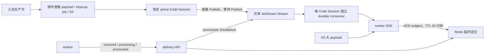

# 移除 `code_session_inbound_events`：最终决策与实现

> 状态：已按“JetStream 直接发布、无 PostgreSQL outbox”实现。

## 最终结论

删除 `code_session_inbound_events`，同时删除 `code_sessions.last_inbound_sequence_num`，不创建
`event_outbox`。PostgreSQL 不再保存 Code Session 入站消息、发布进度或入站序号。

各组件只承担一种职责：

- PostgreSQL 保存公开 `session_events`、Code Session lifecycle、worker epoch 与权限状态；
- JetStream 保存已经获得 PubAck、尚未 processed 的入站消息；
- Redis 只临时保存 `event_id → JetStream ACK subject`，丢失后依靠 JetStream 重投；
- S3 保存超过内联阈值的 payload，JetStream 保存受摘要保护的引用。



## PostgreSQL 现在提交什么

普通 Send Events 仍先把公开事件提交到 `session_events`。如果 Code Session 已 active，提交后的业务
层在 Code Session 行锁内直接向 JetStream 发布，并等待 PubAck。该事务只用行锁与 lifecycle 状态
做并发 fence，不写入站消息或 sequence。

因此，PostgreSQL 与 JetStream 之间不再有原子提交：

- `session_events` 提交成功、Publish 失败时，API 返回 `503 api_error`；
- 没有后台 publisher，也没有数据库待发布记录；
- 调用方必须重试。带 payload UUID 或 request ID 的事件会派生稳定 `Nats-Msg-Id`，处理 PubAck
  丢失造成的模糊成功；没有稳定 ID 的调用被视为新事件。

这是一项明确接受的取舍：减少表、事务和恢复进程，但把“业务已提交、消息未发布”的恢复责任交给
调用方。若将来要求服务端在调用方消失后仍自主补发，就必须重新引入 outbox 或等价的持久发布日志，
Redis 不能提供这一事务保证。

## Activation

Activation 是 Code Session 从 `initializing` 切到 `active` 的启动交接，不是等待 worker 消费。
它分为三个阶段：

1. 在短 Yourbatis 事务中依次锁定公开 Session 和 `initializing` Code Session，读取完整历史快照后释放锁；
2. 在事务外准备 initialize 和历史 envelope，提交 cleanup job、上传大 payload；
3. 重新按相同顺序锁定并读取快照。若 metadata 或历史改变，释放锁、清理未发布对象并重新准备；
   若未改变，则按顺序发布、逐条等待 PubAck，全部成功后更新 `active` 并提交。

只有 PubAck 网络等待仍持有两条行锁，保证 activation 与 realtime cutover 不交叉。大对象准备
不得在持锁事务内借用第二条 PG 连接，否则并发请求可能耗尽连接池。整个 activation（含快照重试）
最多 1 分钟；超时返回失败，保留 initializing。它不等待 worker received、processing 或 processed。

如果只发布了部分消息、PubAck 丢失或 PostgreSQL 最终提交失败，Code Session 保持
`initializing`。重试使用由 Code Session、initialize 标识或 `session_event` UUID 派生的稳定 message
ID；JetStream 在 24 小时窗口内去重，窗口外可能再次投递，但 worker 仍应按稳定 `event_id` 幂等。

## Stream、subject、consumer 与序号

所有消息进入共享 Stream `OMA_WORKER_INBOUND`，subject 为
`oma.worker.inbound.v2.<code-session-id>`。每个 Code Session 创建一个稳定、精确过滤该 subject 的
durable pull consumer。这些 filter 互不重叠，适用于 `WorkQueuePolicy`。

consumer 使用 `DeliverAll`、`AckExplicit`、`MaxAckPending=1`、无限 `MaxDeliver`，退避为 1 分钟、
5 分钟、15 分钟，之后保持 15 分钟。SSE 断开不删除 consumer。

`sequence_num` 直接取 JetStream Stream sequence，不再由 PostgreSQL 分配。它在整个共享 Stream 内
单调递增，所以单个 Code Session 看到间断序号是正常现象。`MaxAckPending=1` 保证同一 consumer
一次只交付一条，但并发生产方获得 Code Session 行锁的顺序不保证等于 `session_events` 的提交顺序。
若业务以后要求严格复现并发提交顺序，需要持久发布游标或单写者调度，当前无 outbox 方案不提供它。

## ACK、Redis 与大 payload

SSE flush 前，服务端写入带 20 分钟 TTL 的映射：

```text
code_session + worker_epoch + event_id -> JetStream ACK subject + cleanup_job_id
```

`received`、`processing` 发送 InProgress 并刷新 TTL；`processed` 校验 PostgreSQL 当前 epoch 后执行
DoubleAck。Redis 写失败时不发送 SSE；Redis 丢失时 delivery 返回 `ignored`，JetStream 之后重投。
Redis 不保存权威消息，也不能替代 PostgreSQL lifecycle/epoch fence。
20 分钟是定位缓存 TTL，不是消息的 ACK 等待时间。worker 应在一分钟首次重投窗口前持续上报
processing（建议每 20–30 秒）。SSE 写失败时保留映射直到 TTL，避免旧连接删除新重投写入的映射。

envelope 超过 900 KiB 时，payload 先上传到租户隔离的 S3 key。key 包含稳定 event ID 和随机 cleanup
job ID，避免重试对象之间互相清理。JetStream 只保存 key、size、SHA-256 和 cleanup job ID，单条
消息仍小于 1 MiB。PubAck 失败是模糊结果，因此不会立即删除对象；processed 后立即加速清理，最迟
在 30 天逻辑期限清理。

发布前拒绝超过 16 MiB 的原始 payload，与 hydrate 读取上限保持一致。普通公开输入和 control
response 也先在锁外准备对象，再锁定 active Code Session 发布。确定未尝试发布的对象可以提前清理；
已尝试 Publish 的对象必须保留，因为 PubAck 失败可能是模糊成功。提前清理使用独立的 5 秒上下文，
不受原请求取消影响，失败仍由原定到期任务兜底。

## 生命周期与失败语义

- JetStream 不可用或容量满：Publish 失败，普通请求返回 503，activation 保持 initializing；
- PubAck 成功但响应丢失：稳定 `Nats-Msg-Id` 使重试可去重；
- 调用方不重试：已提交到 `session_events` 的事件不会自动进入 JetStream；
- Redis 丢失：只导致重投，不永久丢消息；
- S3 缺失、读取失败或摘要不匹配：不发送、不 ACK，同 Session 后续消息被阻塞；
- 事件 30 天仍未 processed：终止 Code Session、撤销凭证、删除 consumer 和 subject 消息，并加速对象清理；
- Code Session 终止：与直接 Publish 通过同一行锁串行，状态更新后清空该 Session 的 consumer 和消息。

过期处置必须先成功提交 PG 终止与凭证撤销，再删除 consumer、purge subject，最后加速对象清理；
不能提前 TERM/ACK。PG 或队列清理失败时保留扫描游标以重试。PG 记录已不存在时直接清理队列，
不构造空租户 UUID 执行 SQL。扫描每轮最多读取 512 条实际存储消息，按 subject 跳过已 ACK 的序号
空洞。坏 JSON 或无效 envelope 会告警但不阻塞其他 Session 扫描；其 Session 仍不 ACK，按
JetStream 存储时间加 30 天兜底终止，不能信任坏 envelope 的身份、期限或对象引用。

扫描会先校验实际 subject 是否严格对应单个 Code Session。多余 token 等非法 subject 无法
归属合法 Session，会按实际 stream sequence 精确删除并告警，不访问 PG、不 purge 同名前缀
的 Session，也不信任正文中自称的 Session ID。删除失败保留游标重试；同批已删除消息即使
后续扫描失败也会告警。此处理不适用于合法 subject 的坏正文或损坏的 S3 对象。

idle 回收不查询 JetStream backlog。公开输入事务会清空 `idle_since`；新输入到达已经 idle-stop 的
Sandbox 时，沿用既有 recovery 流程重建 Sandbox。

## 迁移与发布

不可逆迁移 `00059_remove_code_session_inbound_events.sql`：

- 删除 `code_session_inbound_events`；
- 删除 `code_sessions.last_inbound_sequence_num`；
- 删除实验版本可能留下的 `event_outbox`，不创建替代表，也不迁移旧消息。

停机切换时先停止旧服务，清空旧 `OMA_WORKER_INBOUND` Stream/consumer，应用迁移，再启动新版本。
旧 poll worker 不兼容，存量未处理事件会丢弃，没有数据回滚链路。

## 验收范围

- activation 在全部 PubAck 后才 active，模糊 PubAck 重试不产生第二条消息；
- 普通直接发布失败返回 503，稳定 ID 重试由 JetStream 去重；
- 三节点 Stream 配置、per-session durable consumer 与 `MaxAckPending=1`；
- Stream sequence 暴露为 SSE sequence，允许单 Session 出现间断；
- Redis 丢失安全重投、epoch fence、DoubleAck；
- 大 payload 透明还原与清理；
- 30 天过期终止、旧 poll 路由移除、idle-stop 后恢复；
- schema 中不存在旧入站表、outbox 表和 PG 入站 sequence 列。

## 当前环境真实集成测试

入口为 `tests/liveworker`，必须显式指定现有 API 地址和对应配置；未指定地址时普通
`go test ./...` 会跳过，因此普通单测通过不能代替真实环境验收。

```bash
./scripts/generate-go.sh
CONFIG_FILE=/absolute/path/to/config.yaml \
LIVE_WORKER_API_URL=http://127.0.0.1:38080 \
go test -race ./tests/liveworker -run TestLiveWorkerEvents -count=1 -v -timeout=6m
```

API key 默认使用本地测试 key，也可通过 `TEST_API_KEY` 指定。配置必须与现有 API
使用相同的 PG、Redis、NATS、S3 bucket 和持久化 JWT 签名密钥。套件核对已有 Stream
配置，不执行迁移、seed、依赖重启、全局 Redis flush 或全 Stream purge。

测试以 API 创建专用 Agent/Environment，以现有 Yourbatis DB 方法创建专用
Session/Code Session；work 状态设为 `stopped`，防止共享 runner 启动 sandbox 与
协议客户端竞争消费。activation 和精确 payload 边界发布调用生产 Service，连接真实
PG/JetStream/S3；公开输入、worker register、SSE、delivery 使用现有 API 进程。
这不是实际 Claude worker 或 sandbox E2E，也不覆盖 sandbox 创建/idle recovery。

覆盖：

- 公开 HTTP 输入经 JetStream、SSE 到 processed ACK，确认消息从 Stream 删除。
- initialize、未知 ACK 的 ignored 行为、旧 poll 返回 405。
- 同 ID 发布去重、串行投递、received/processing 刷新真实 Redis TTL、durable 保留。
- 删除本次测试事件的 ACK 映射后，等待生产配置的一分钟重投，检查 ID/sequence/payload
  不变，并重建映射；超大客户端 cursor 不跳过未确认消息。
- 跨 Session token 拒绝，以及凭证轮换后旧 epoch 不能 ACK 尚存消息。
- payload 为 921087、921088、921089、1048576 字节时的外置边界、逐字节恢复和
  processed 后的真实后台对象删除。
- 仅破坏本次测试的 S3 对象，验证摘要不符时不发送 payload、不 ACK、不推进队列。
- SSE 发现过期时终止并 purge 专用 Session，其他 Session 保持 active。
- 没有 SSE 连接时，由现有服务的后台扫描器发现过期消息并清空专用 Session。

清理只作用于本次创建的资源：终止 Code Session、按 subject purge、删除对应 consumer
和 ACK keys、删除测试对象、软删除 Session/Environment、归档 Agent。PG 中会保留
终止/软删除/归档记录及 cleanup job 等审计数据，不做原生 SQL 硬删除。

`-race` 检查的是测试进程（包含本地调用的生产 Service），不是未经 race 编译的现有
后端进程。未覆盖的故障包括 PubAck/DoubleAck 响应丢失、依赖断网/重启、容量耗尽、
PG 提交失败、三节点 failover、24 小时去重窗口真实流逝和 5/15 分钟重投实测；这些
必须在独立真实部署中补测，不能通过停止当前共享依赖验证。

### 2026-09-07 当前环境执行结果

- 复用 `127.0.0.1:38080` 的现有后端及其 PG、三节点 NATS、Redis、S3；没有重启服务。
- 完整 9 个子场景带 `-race` 通过，测试主体耗时 155.82 秒。
- HTTP 输入、未知 ACK/poll、串行投递、epoch、S3 损坏、SSE 过期这 6 个短场景
  额外连续执行 3 次，18 次均通过。
- Redis 映射删除后的真实重投等待约 59.99 秒；无 SSE 连接时，现有后台扫描器约
  57.39 秒后完成测试 Session 过期处置。后者取决于扫描相位，不是固定清理 SLA。
- S3 清理断言在测试兜底删除之前观察真实后台删除成功，不能仅以 ACK HTTP 200
  作为对象清理成功证据。
- 只读 schema 核对确认 `code_session_inbound_events`、`event_outbox`、
  `last_inbound_sequence_num` 均不存在，`public` schema 外键数为 0；本轮没有执行迁移。
- `just lint`、`just dead-code`、`git diff --check` 通过。
- 已覆盖范围未复现业务缺陷；这不代表跨系统故障窗口已全部验证。没有对共享环境运行
  会创建另一套 API/内存 Broker 的全量 `just test`，也没有注入依赖级停机故障。

### PR 评论修复回归（2026-09-07）

本轮使用独立 PostgreSQL 测试库和测试 bucket 运行 `just test`，没有重启当前 API 或修改其业务库。
新增 11 个回归测试，并修正内存 ACK TTL 和 control response 测试中的失真断言：

- 单 PG 连接的大 payload 发布；activation 上传期间新增历史后的快照重试；
- PG 终止失败保留消息、purge 失败重试，以及 PG 记录不存在时清理孤立队列；
- 三节点 NATS 的稀疏序号扫描、坏 envelope 隔离、按 Session 幂等 purge；
- 旧 SSE 写失败保留新投递映射、过期 ACK 映射不能被 Refresh 复活；
- 16 MiB 写入上限、转换失败返回错误、请求取消后未发布对象仍提前清理。

上述回归的 `-race` 检查通过。`go generate ./...`、`just test`、`just lint`、`just dead-code`、
`just duplicates`、`just complexity`、`just large-files` 均通过。
这轮没有重跑现有 API 的 `tests/liveworker`：PG 行为使用真实 PostgreSQL，NATS 使用测试独占的真实
三节点集群，故障注入中的 ACK store 和对象存储使用测试实现，不等同于 Redis/S3 断网或部署故障验收。

后续 CI/评论回归补充：三节点 NATS 验证非法多段 subject（坏 JSON 和身份匹配的合法 JSON）
仅按序号删除、删除中断后重试、后续批次可达，以及正常 subject 和 consumer 保留。
worker 回归验证非法消息不进入 PG、失败时游标保留、部分成功的删除仍输出结构化告警。
live harness 的 agent 清理改走归档 API，另以本地 HTTP 测试验证 Cleanup 阶段已取消的
测试 context 不会取消归档请求；没有恢复 main 已删除的 DB 归档包装方法。

相关设计：

- [NATS 消息基础设施](../nats-messaging-foundation.md)
- [Session 启动期消息投递](../session-startup-message-delivery.md)
- [Worker delivery ACK 后端设计](ccr-v2-worker-events-delivery-backend-design.md)
- [Worker epoch 设计](ccr-v2-epoch-design.md)
- [托管沙箱的 idle 回收](../sandbox-lifecycle.md)
