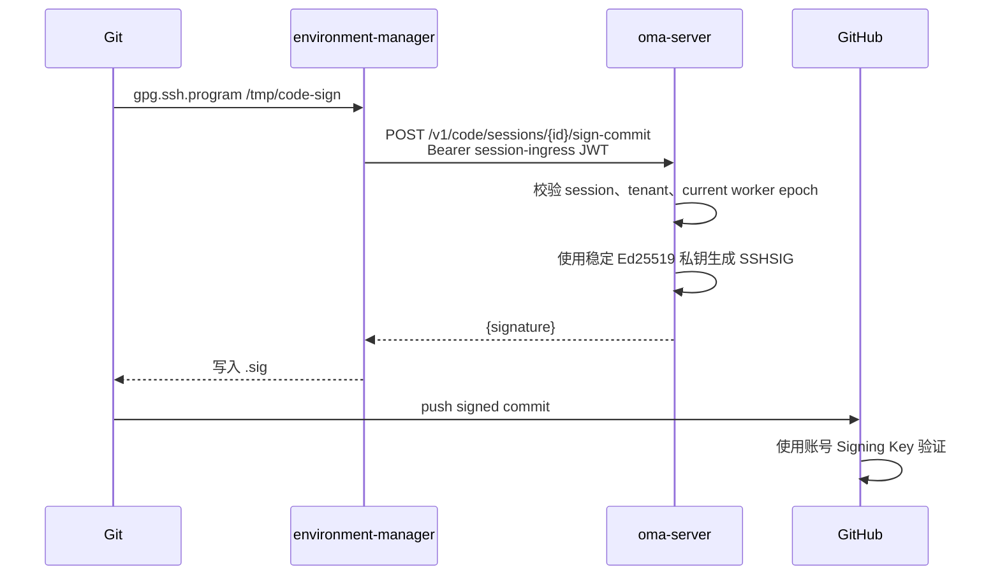

# CCRv2 Git 提交签名

## 目标与边界

CCR v2 sandbox 使用 environment-manager 的 `/tmp/code-sign` 作为 Git SSH 签名程序。私钥只保存在 oma-server；sandbox 只持有与当前 Code Session 和 worker epoch 绑定的 session-ingress JWT。当前版本只提供 `/v1/code/sessions/{code_session_id}/sign-commit`，不恢复旧版 `/v1/session_ingress/sources/sign-commit/*` 路由。

Git 提交身份继续由环境内已有的 `user.name` 和 `user.email` 决定。OMA 只证明提交由部署方注册的 Ed25519 签名密钥签署，不改写作者或提交者字段。



## HTTP 合同

请求体上限为 16 MiB：

```json
{
  "contents": "<Git 传入的原始待签名文本>",
  "source": {
    "type": "git_repository",
    "git_info": {
      "type": "github",
      "repo": "owner/repo",
      "ref": "refs/heads/main"
    }
  },
  "git_object_format": "sha1"
}
```

- `contents` 必须非空，并按解码后的原始 UTF-8 字节签名；不得修剪空白。
- `source` 可省略，仅作为已脱敏的仓库元数据，不进入签名或授权决策。提供时必须是带 provider 和 repo 的 `git_repository`。
- `git_object_format` 可省略，默认 `sha1`；可选值为 `sha1`、`sha256`。该字段描述 Git 仓库对象格式，SSHSIG 自身始终使用 SHA-512 摘要。

成功响应为 HTTP 200：

```json
{
  "signature": "-----BEGIN SSH SIGNATURE-----\n...\n-----END SSH SIGNATURE-----\n"
}
```

鉴权失败、路径 session 不匹配、旧式 epoch 0 Token 或失效 epoch 返回 401；无效请求返回 400；超限返回 413；签名器不可用返回 500。鉴权在读取请求体之前完成。

## 签名与密钥生命周期

OMA 复用 `SessionCredentials` 中由 `code_session.jwt_signing_private_key_file` 加载的 Ed25519 私钥。SSHSIG 使用 version 1、`git` namespace、空 reserved 字段、SHA-512 摘要和 `ssh-ed25519` 签名。Ed25519 对相同内容和密钥产生确定性签名，但不同提交内容必须分别签名，不能复用一段固定签名。

生产环境必须挂载稳定的 PKCS#8 私钥。可通过以下命令只导出 OpenSSH 公钥：

```bash
just print-code-session-signing-public-key \
  config/secrets/code-session-jwt-ed25519.pem
```

将输出添加到 GitHub 账号的 SSH Signing Key。轮换该私钥会同时失效现有 session-ingress JWT，并要求在 GitHub 更新 Signing Key。所有 Session 共用该部署签名身份，因此接口只接受数据库确认仍处于当前 worker epoch 的 CCRv2 Token；oma-server 运行日志只记录 session ID、内容长度和 Git object format，不记录正文、Token、source 或签名。

## environment-manager 行为

environment-manager 全局配置 `gpg.format=ssh`、`gpg.ssh.program=/tmp/code-sign`、`user.signingkey=~/.ssh/commit_signing_key.pub` 和 `commit.gpgsign=true`。Anthropic 模板仓库也保留本地 `commit.gpgsign=true`；仅模板初始提交显式使用 `--no-gpg-sign`，避免环境初始化与 codesign MCP 并行启动时发生竞态。此后的普通 `git commit` 必须获得远程签名，服务不可用时提交失败而不是降级为未签名提交。
