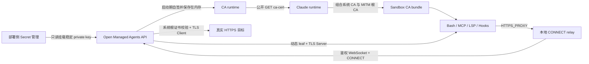
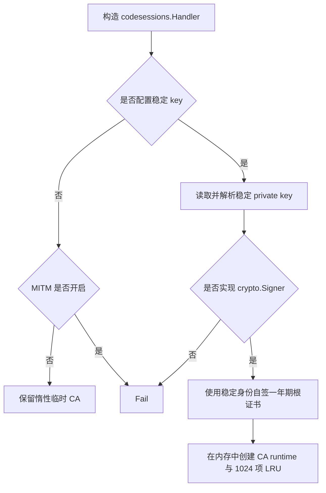
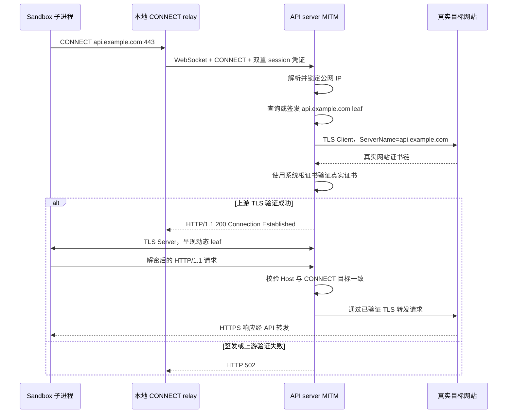
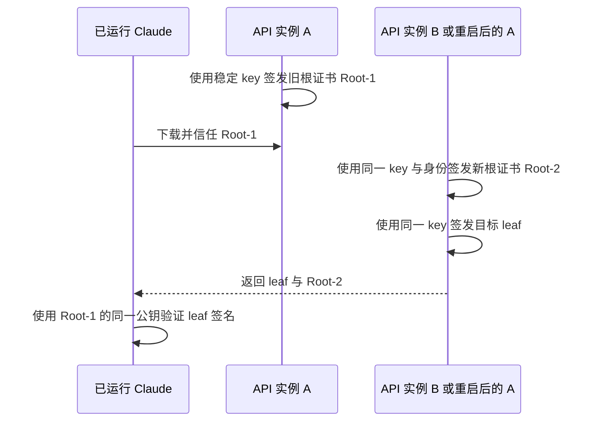

# CCRv2 MITM 证书签发设计

## 文档目的

本文专门说明 CCRv2 upstream proxy 的 HTTPS MITM 证书体系，包括稳定根私钥的部署、启动期根证书签发、sandbox 信任建立、按目标主机动态签发 leaf certificate、双向 TLS 终止以及相关安全边界。

本文描述的是当前实现，不把计划能力写成已实现行为。CCRv2 upstream proxy 的启动参数、WebSocket 协议和模型代理总览见 [《CCRv2 子进程 HTTPS 代理与模型运行时》](./upstream-proxy-and-model-runtime.md)。

## 核心结论

当前实现采用“稳定根私钥 + 启动期自签根证书 + 按目标主机惰性签发 leaf”的模型：

- 部署侧只提供长期稳定的根 CA private key，不再预生成或分发根 CA certificate。
- 每次构造 `codesessions.Handler` 时，API server 都使用该私钥及其公钥重新自签一张有效期一年的根证书，并只保存在进程内存中；不会落盘，也不会在启动时预签发所有域名。
- 每次启动生成的根证书使用稳定的 Subject 和 Subject Key Identifier（SKI），但 serial number、有效期和证书原始字节可以不同。
- 第一次收到某个目标主机的合法 CONNECT 时，API server 才为该主机生成独立私钥并签发短期 leaf certificate。
- 根 CA certificate 是公开信任材料，可以下载到 sandbox；根 CA private key 只允许存在于 API server 的受保护文件和进程内存中。
- 已运行 Claude 即使只信任上一次启动生成的旧根证书，仍可验证新 leaf；前提是新旧证书保持相同公钥与 `RawSubject` DER，旧根仍在有效期内且保留有效 CA/`CertSign` 约束。
- sandbox 到 API server、API server 到真实网站是两条独立 TLS 连接，两侧使用不同的证书验证信任域。

## 范围与非目标

本文覆盖：

- 根 CA 配置、启动签发和内存生命周期；
- 根 CA 下载与 sandbox 信任注入合同；
- DNS 名/IP leaf 的动态签发、缓存和轮换；
- CONNECT、SNI、HTTP Host 的一致性约束；
- 真实上游 TLS 验证；
- 密钥保护、失败语义和运维限制。

当前不覆盖或不支持：

- 由 API 自动生成、导出或托管生产根 CA private key；
- 通过 HTTP API 下载、导出或托管根 CA 私钥；
- 不重启服务的 CA 热加载；
- 针对私钥泄露或更换 private key 的双根过渡；
- HTTP/2 MITM、客户端证书认证（mTLS）和证书固定绕过；
- 解密后请求/响应内容的持久化审计。

## 组件与职责



| 组件 | 职责 | 不得持有的材料 |
| --- | --- | --- |
| 部署侧 Secret 管理 | 生成、保存并只读挂载长期稳定的根私钥 | 无 |
| API server | 启动时在内存中自签根证书、动态签发 leaf、终止客户端 TLS、验证真实上游 TLS | 不向外暴露根私钥 |
| Claude runtime | 下载公开根证书、构造组合 CA bundle、向子进程注入代理和 CA 环境变量 | 根 CA 私钥、leaf 私钥 |
| 本地 relay | 把子进程 CONNECT 转换为 CCRv2 WebSocket framed stream | 根 CA 私钥 |
| Claude 子进程 | 使用本地代理，并通过组合 CA bundle 验证 MITM leaf | 任意签发密钥 |

主要实现位于：

- `internal/config/config.go`：稳定私钥输入路径的配置校验；
- `internal/codesessions/handler.go`：Handler 构造阶段的根证书签发；
- `internal/codesessions/upstream_proxy_ca.go`：内存根证书签发、leaf 签发和缓存；
- `internal/codesessions/upstream_proxy.go`：CA 下载、WebSocket/CONNECT 鉴权和目标解析；
- `internal/codesessions/upstream_proxy_mitm.go`：客户端 TLS 终止、真实上游 TLS 和 HTTP 转发；
- `internal/codesessions/routes.go`：公开 CA 与鉴权 WebSocket 路由注册。

## 配置与密钥材料

启用 MITM 需要配置：

```dotenv
CODE_SESSION_UPSTREAM_PROXY_MITM_ENABLED=true
CODE_SESSION_UPSTREAM_PROXY_CA_KEY_FILE=/run/secrets/ccrv2-mitm-ca-key.pem
```

| 配置 | 内容 | 保密级别 | 用途 |
| --- | --- | --- | --- |
| `CODE_SESSION_UPSTREAM_PROXY_CA_KEY_FILE` | 长期稳定、由部署侧提供的 private key | 最高机密 | 启动期自签根证书，并作为动态 leaf 的 signer |

配置规则如下：

1. `MITM_ENABLED=true` 时 private key 路径不可为空；MITM 关闭但显式配置 private key 时，Handler 仍在启动期生成并加载该 CA。
2. private key 必须已经存在且是普通文件。
3. 建议 private key 权限为 `0600` 并以只读 Secret 挂载。
4. 根证书只保存在 API server 内存中，通过公开 CA 下载接口分发给 sandbox，不创建 certificate 输出文件。

private key 文件必须只包含一个未加密 PEM block。当前支持 PKCS#8 `PRIVATE KEY`、SEC1 `EC PRIVATE KEY` 和 PKCS#1 `RSA PRIVATE KEY`；解析后的密钥必须实现 `crypto.Signer`。加密私钥、多 PEM block 和尾随非空内容都会使服务拒绝启动。

当前配置校验不强制检查 Unix mode、文件 owner 或 Secret 来源；这些属于部署安全基线。

## 根 CA 生命周期

### 部署提供稳定私钥

生产根 CA private key 在 API server 之外生成并长期稳定保存。部署时可以使用仓库提供的脚本生成一把 ECDSA P-256、PKCS#8 PEM 私钥：

```bash
./scripts/generate-upstream-proxy-ca-key.sh /var/lib/open-managed-agents/secrets/ccrv2-mitm-ca-key.pem
```

脚本要求输出目录已经存在，生成文件权限为 `0600`；如果目标文件已经存在（包括符号链接），脚本会拒绝覆盖，避免误换长期稳定私钥。API server 自身仍不会生成、导出或轮换生产 private key。部署侧必须保证：

- private key 只读挂载到 API server，并可解析为 `crypto.Signer`；
- 所有服务于同一组 sandbox 的 API server 实例共享同一把 private key；
- private key 不进入镜像层、数据库、environment-manager payload、sandbox 或日志。

### 启动签发与内存生命周期

当配置了 private key 时，`codesessions.NewHandler` 在构造阶段立即调用 `loadUpstreamProxyCA()`。初始化使用 `sync.Once`，同一个 Handler 生命周期只签发一次；成功结果和失败结果都会被缓存。服务每次启动都会重新签发，生成的 certificate、PEM 和 signer 只保存在当前 Handler 的内存中。



启动期签发的根证书身份和有效期如下：

| 字段 | 当前值 |
| --- | --- |
| `Subject.Organization` | `Open Managed Agents` |
| `Subject.CommonName` | `Open Managed Agents CCRv2 MITM CA` |
| `SubjectKeyId` / `AuthorityKeyId` | 按 RFC 5280 从公钥 BIT STRING 派生，因此跨启动保持一致 |
| `SerialNumber` | 每次启动重新生成的随机 128-bit 正整数 |
| `NotBefore` | 启动时间减五分钟，容忍小幅时钟偏差 |
| `NotAfter` | 启动时间加 365 天 |
| `BasicConstraints` | `CA:TRUE`、path length 为零 |
| `KeyUsage` | `DigitalSignature`、`CertSign`、`CRLSign` |

SKI 计算中的 SHA-1 仅用于生成公钥标识符，不是根证书或 leaf 的签名算法。签发完成后，certificate 与 PEM 同时构造成不可变的 CA runtime，再由下载接口直接返回内存中的完整 PEM；任何 private key 解析或签名错误都会使 Handler 构造 panic，让错误在启动期暴露，而不是延迟到第一条 CONNECT 请求。

### MITM 关闭时的临时 CA

当 MITM 关闭且未配置 private key 时，`GET /v1/code/upstreamproxy/ca-cert` 仍需要满足 Claude relay 的初始化合同，因此服务会惰性创建一套进程生命周期内的临时 CA：

- ECDSA P-256；
- 128-bit 随机序列号；
- 有效期为一年，`NotBefore` 回拨五分钟；
- 只在当前 Handler 生命周期内稳定。

这套临时 CA 仅用于兼容“CA 下载接口必须成功”的透传模式，不允许作为正式 MITM 的生产信任锚。

## 根 CA 分发与 sandbox 信任

公开接口为：

```http
GET /v1/code/upstreamproxy/ca-cert
```

该接口不鉴权，因为 certificate 是公开材料，而且当前 Claude relay 下载时不会携带 code-session token。响应只包含 `certificatePEM`，不会访问或返回 signer/private key，并设置：

```http
Content-Type: application/x-pem-file
Cache-Control: no-store
```

Claude runtime 下载 certificate 后，将它追加到 sandbox 的系统 CA bundle，生成进程级组合 bundle，并向 Bash、MCP、LSP 和 hooks 等子进程注入：

```text
HTTPS_PROXY
https_proxy
SSL_CERT_FILE
NODE_EXTRA_CA_CERTS
REQUESTS_CA_BUNDLE
CURL_CA_BUNDLE
```

因此当前信任模型是“Claude 启动时下载并通过环境变量注入”，不是把根 CA 永久烘焙进 sandbox 镜像，也不是修改系统全局 trust store。不同语言运行时只有在遵守对应 CA 环境变量时才会信任 MITM leaf。

## 动态 leaf 签发

### 签发触发点

leaf 不在 API server 启动时预生成。只有以下条件全部满足后，MITM CONNECT 流程才为目标主机调用 `certificateForHost()`：

1. WebSocket bearer/API key 对应有效 code session；
2. 首个 protobuf chunk 是合法、完整的 CONNECT head；
3. CONNECT Basic username 和 password 都与当前 code session 匹配；
4. 目标格式合法且端口为 `443`；
5. DNS 解析和 SSRF 目标检查成功，并锁定实际拨号 IP。

SSRF 防护决定“目标是否允许连接”，证书签发决定“如何终止允许连接的 TLS”；两者是独立控制面。关闭 SSRF 防护不会改变证书信任模型，但会显著扩大可被 MITM 代理访问的网络范围。

### 主机名规范化

目标主机在作为 SAN、缓存 key 和 `singleflight` key 之前会规范化：

- 去除首尾空白；
- 转为小写；
- 去除末尾的根域点 `.`；
- 去除 IP 方括号；
- 将 IPv4-mapped IPv6 统一为标准 IP 文本。

例如 `API.Example.COM.` 与 `api.example.com` 共享同一张缓存 leaf；IP 地址则按 `netip` 的标准文本作为 key。

### 证书内容

每次实际签发会生成新的 ECDSA P-256 leaf private key 和随机 128-bit serial number。leaf template 为：

| 字段 | 当前值 |
| --- | --- |
| `Subject.CommonName` | 规范化目标主机，仅用于可读性和兼容性 |
| DNS 目标 | 精确写入一个 `DNSNames` SAN |
| IP 目标 | 精确写入一个 `IPAddresses` SAN |
| `NotBefore` | 当前时间减五分钟，容忍小幅时钟偏差 |
| `NotAfter` | 当前时间加 24 小时，且绝不超过根 CA `NotAfter` |
| `KeyUsage` | `DigitalSignature` |
| `ExtKeyUsage` | `ServerAuth` |
| `AuthorityKeyId` | 根 CA `SubjectKeyId` 的副本 |
| Issuer/签名器 | 本次启动生成的根 CA certificate + 长期稳定 private key |

如果根 CA 剩余有效期不足五分钟，服务拒绝继续签发。返回给 Go TLS server 的链顺序为：

```text
leaf certificate
root CA certificate
```

leaf private key 只保存在对应 `tls.Certificate` 的进程内对象中，不写磁盘、不下载到 sandbox，也不与其他主机共享。

## leaf 缓存与并发模型

动态签发包含椭圆曲线密钥生成和根 CA 签名，不应在同一主机的每次 CONNECT 上重复执行。当前缓存策略为：

- 每个 API server 进程维护一个最多 1024 项的 LRU；
- leaf X.509 最长有效 24 小时；
- 缓存只复用 12 小时，到达 `refreshAt` 后主动重新签发；
- 读取命中会更新 LRU 热度，容量满后淘汰最久未使用项；
- 同一规范化主机的并发 cache miss 由 `singleflight` 合并为一次签发；
- 不同主机使用不同 `singleflight` key，可以并行生成和签名；
- 过期项在签发闭包内以新值覆盖，避免并发请求误删另一请求刚写入的新证书。

缓存是纯进程内优化，不是证书持久化机制。重启后缓存为空。各实例生成的根证书原始字节可以不同，但必须共享同一把 private key，并保持 `RawSubject` DER、SKI 和 CA 约束一致，sandbox 才能继续用已下载的旧根证书验证新签发的 leaf。SKI 只是链候选匹配的辅助标识，不替代 issuer/subject、签名、有效期、KeyUsage 和 BasicConstraints 校验。

## MITM 双 TLS 连接



### Sandbox 侧 TLS

API server 对 sandbox 扮演 TLS server：

- 呈现目标主机对应的动态 leaf；
- 最低 TLS 版本为 1.2；
- ALPN 只声明 `http/1.1`；
- ClientHello SNI 如果非空，必须与 CONNECT 目标一致；
- TLS handshake 最长等待十秒。

### 真实网站侧 TLS

API server 对真实网站扮演独立 TLS client：

- 只拨号已经过 DNS/SSRF 检查后锁定的 IP，避免校验后重新解析带来的 DNS rebinding；
- `ServerName` 使用规范化 CONNECT 主机，保持证书 hostname 验证；
- 使用 API server 的系统根证书，不把 MITM 根 CA 注入真实上游信任；
- 最低 TLS 版本为 1.2；
- ALPN 只协商 `http/1.1`；
- TLS handshake 最长等待十秒。

只有根 CA 可用、leaf 准备完成并且真实上游 TLS 已经验证成功后，服务才向 relay 返回 `200 Connection Established`。这样客户端不会进入一个已知无法完成转发的 TLS 隧道。

## 解密后 HTTP 边界

TLS 解密后使用 `httputil.ReverseProxy` 转发 HTTP/1.1，并执行以下限制：

- 拒绝隧道中的嵌套 `CONNECT`；
- HTTP `Host` 必须与最初 CONNECT 目标一致，否则返回 `421 Misdirected Request`；
- absolute-form URL 只接受 `https`，且 URL host 仍须与 CONNECT 目标一致；
- 删除 `Proxy-Authorization` 和 `Proxy-Connection`，防止 CCR 凭证泄漏给真实网站；
- 不自动启用 HTTP/2；
- request header 读取超时 15 秒；
- idle timeout 为 2 分钟；
- 当前不记录解密后的请求 header、响应 header 或 body。

CONNECT、TLS SNI、HTTP Host 三层必须收敛到同一个规范化主机，避免客户端借一个已授权目标的隧道访问另一个目标。

## 信任与威胁模型

### 必须保护的资产

| 资产 | 泄漏影响 | 当前保护 |
| --- | --- | --- |
| 根 CA private key | 可为任意域名签发被 sandbox 信任的证书 | 只从 API server 文件读取，不经 HTTP/DB/payload 分发 |
| leaf private key | 可冒充单个主机，影响持续到 leaf 失效 | 仅进程内保存，最长 24 小时，12 小时主动轮换 |
| code-session token | 可建立该 session 的网络出口 | WebSocket bearer 与 CONNECT Basic 二次校验 |
| 解密后 HTTP 内容 | 可能包含业务凭证和敏感数据 | 当前不落盘、不输出 header/body 日志 |

### 已实现防护

- MITM 默认关闭，必须显式启用并提供稳定 private key。
- 根私钥与公开证书使用不同分发边界。
- CONNECT 需要 WebSocket credential 和 Basic credential 同时绑定同一 code session。
- 默认只允许端口 `443` 和公网目标。
- DNS 解析后锁定 IP，防止 DNS rebinding。
- SNI、HTTP Host 和 CONNECT 目标保持一致。
- 真实网站证书仍由系统根证书严格校验。
- leaf 有效期短、缓存有界、序列号随机。
- 代理鉴权 header 不进入真实上游请求。

### 已知限制

- 当前根私钥作为文件加载到 API server 内存，尚未接入 KMS/HSM 或远程 signer。
- 配置层不强制私钥文件权限和 owner，依赖部署环境保证。
- CA 下载接口公开且 `no-store`，但没有 certificate fingerprint pinning 或签名元数据接口。
- 使用同一 private key 续签证书时不需要双根信任窗口；当前不处理 private key 泄露或更换 key 的过渡。
- leaf 缓存按 API server 实例独立存在，没有跨实例共享，也不需要跨实例共享。
- 证书固定、mTLS 和只接受 HTTP/2 的目标可能无法通过 MITM。
- 启用 `CODE_SESSION_UPSTREAM_PROXY_DISABLE_SSRF_PROTECTION=true` 会允许私网、loopback、link-local 和 fake-IP 目标，只能用于受控本地排障。

## 多实例部署与证书有效期续签

所有同时服务同一组 sandbox 的 API server 实例必须只读挂载同一把长期稳定的 private key。每个实例启动时在内存中独立生成 serial number 和一年期有效期，因此证书指纹和原始字节不要求一致；共享同一公钥、完全相同的 `RawSubject` DER、SKI 和 CA 约束才是跨实例信任兼容的关键。



这解决的是根证书“有效期更新”，不是 private key 轮换：

1. 服务每次启动都会在内存中重新签发本实例 certificate，新的 `NotAfter` 是本次启动时间加 365 天。
2. 已运行 Claude 的 trust bundle 不会随服务重启更新；它仍持有旧根证书 Root-1。
3. Root-1 与 Root-2 的公钥、`RawSubject` DER、SKI 和 CA 约束相同；新 leaf 的 `RawIssuer` 因而能匹配 Root-1，签名也能由 Root-1 中的同一公钥验证。
4. Root-1 自身的 `NotAfter` 不会因此延长；到期后该 Claude 必须重启并重新下载当前根证书。

因此 code session 生命周期必须远小于一年，API server 也必须至少每年、并在当前根证书到期前计划重启。这里明确不考虑 private key 泄露或更换 key 的场景，也不设计双根分发；如果未来改变稳定 private key，必须另行设计信任迁移协议。

## 失败语义

| 阶段 | 失败场景 | 当前结果 |
| --- | --- | --- |
| 配置加载 | MITM 开启但未配置 key、key 不存在或不是普通文件 | 配置加载失败 |
| Handler 构造 | private key 解析或根证书签名失败 | 启动期 panic，服务拒绝启动 |
| CA 下载 | 临时 CA 生成失败 | HTTP `500`；Claude relay 保持禁用 |
| CONNECT 鉴权 | session token 或 Basic credential 错误 | HTTP/WS framed `401` 或 `407` |
| 目标检查 | 非 443、非法地址、受限网络 | framed `403` |
| leaf 签发 | 随机源、密钥生成、CA signer 失败或 CA 即将过期 | framed `502` |
| 真实上游 TLS | 拨号、证书链、hostname 或 handshake 失败 | framed `502`，不返回 CONNECT `200` |
| Sandbox TLS | SNI 不匹配或不信任根 CA | TLS handshake 失败 |
| 解密后 HTTP | Host/URL 跨目标 | HTTP `421` |

## 测试与验收

当前相关自动化测试覆盖：

- 稳定 private key 的解析、启动期一年根证书内存签发和公开下载；
- 同一 private key 连续签发的根证书原始字节不同，但公钥、Subject 和 SKI 保持一致，旧根可验证新 leaf；
- 动态 DNS leaf 的根信任链，以及 IP leaf 的端到端 TLS handshake；
- 1024 项 LRU 淘汰；
- 同域并发签发合并和异域并行签发；
- 12 小时主动刷新边界；
- SNI 与 CONNECT 目标不一致时拒绝；
- 解密 HTTP、保留 path/query、转发响应；
- 删除代理鉴权 header。

修改本模块后至少运行：

```bash
go test ./internal/codesessions -count=1
go test ./internal/config -count=1
go test ./... -count=1
just lint
just dead-code
just duplicates
just complexity
```

真实 sandbox 验收应同时确认：

1. `/v1/code/upstreamproxy/ca-cert` 返回本次启动生成的根证书，Subject、SKI、公钥和一年期有效期符合预期；
2. Claude 子进程存在 `HTTPS_PROXY`、`https_proxy` 和 CA bundle 环境变量；
3. `curl -v https://目标/` 的 CONNECT、sandbox TLS 和真实网站 TLS 均成功；
4. sandbox 看到的 issuer 是 CCRv2 MITM 根 CA，API server 验证的真实网站证书仍由公网 CA 签发；
5. 私钥内容不出现在响应、环境变量、日志或镜像层。

## 后续演进建议

后续能力应按风险优先级推进：

1. 增加根 CA 到期时间、SKI 和 fingerprint 的启动日志/指标，但不得记录 private key。
2. 增加 HSM/KMS `crypto.Signer` 适配，减少根私钥进入应用内存的范围。
3. 在解密 HTTP 边界增加显式策略引擎，按域名、method、path 和脱敏 header 做允许/拒绝决策。
4. 对证书固定、mTLS 等不兼容目标增加显式 pass-through policy，而不是关闭真实上游证书验证。
5. 只有在协议、流控和测试完整后再增加 HTTP/2 MITM。
