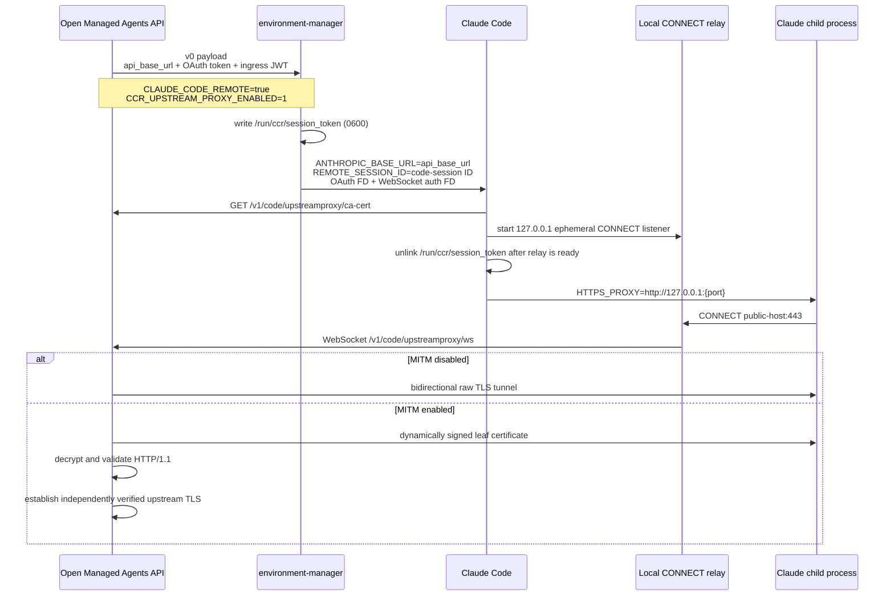
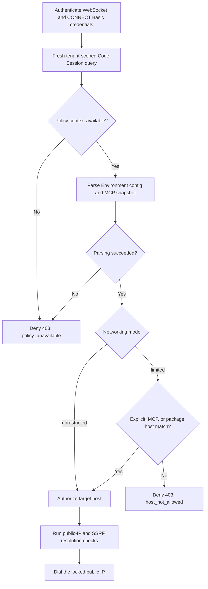

# CCRv2 子进程 HTTPS 代理与模型运行时

## 目标

Managed Agent 启动 Claude Code 后，Claude 创建的 Bash、MCP、LSP 和 hook 子进程需要继承 `HTTPS_PROXY`。当前 Claude Code 内置的 CCRv2 relay 已经负责在容器内监听本地 CONNECT 代理，但只有以下条件同时成立时才会启用：

- `CLAUDE_CODE_REMOTE=true`
- `CLAUDE_CODE_REMOTE_SESSION_ID` 是当前 code session ID
- `CCR_UPSTREAM_PROXY_ENABLED=1`
- `/run/ccr/session_token` 存在且非空
- `GET {ANTHROPIC_BASE_URL}/v1/code/upstreamproxy/ca-cert` 成功
- `WS {ANTHROPIC_BASE_URL}/v1/code/upstreamproxy/ws` 可以完成鉴权和 CONNECT 隧道

本实现不修改 Claude Code/SuperDuck。`environment-manager` 和 API server 共同补齐上述启动与服务端协议。

## 关键约束

Claude Code 当前使用同一个 `ANTHROPIC_BASE_URL` 完成两类请求：

1. 模型请求 `/v1/messages`。
2. CCRv2 CA 与 WebSocket upstream proxy 请求。

因此不能让 Claude 继续直接指向 Kimi/Anthropic，同时再为 CCRv2 指定另一个地址。运行时统一指向 Open Managed Agents API server；API server 再持有真正的上游地址和密钥，并代理模型请求。

这也建立了明确的凭证边界：上游模型密钥只存在于 API server，不能进入 sandbox 环境变量、environment-manager stdin 或 Claude 子进程。

## 启动数据流



### environment-manager payload

`buildEnvironmentManagerV0Payload()` 注入：

```text
CLAUDE_CODE_REMOTE=true
CCR_UPSTREAM_PROXY_ENABLED=1
CLAUDE_CODE_POST_FOR_SESSION_INGRESS_V2=1
CLAUDE_CODE_USE_CCR_V2=1
CLAUDE_CODE_WORKER_EPOCH=1
```

`startup_context.api_base_url` 是 sandbox 可访问的 Open Managed Agents API 地址。payload 不再注入上游 `ANTHROPIC_BASE_URL` 或 `ANTHROPIC_API_KEY`；environment-manager 使用 `api_base_url` 作为 Claude 的 `ANTHROPIC_BASE_URL` fallback。

environment-manager 启动 Claude 时还会根据 executor 的 session ID 设置 `CLAUDE_CODE_SESSION_ID` 与 `CLAUDE_CODE_REMOTE_SESSION_ID`。后者是 relay 的必要条件；缺失时 Claude 会记录 `CLAUDE_CODE_REMOTE_SESSION_ID unset; proxy disabled`，即使 token 文件和其他开关都存在也不会注入代理环境。

payload 同时提供两种用途独立的 auth：

- `session_ingress`：使用 Ed25519 签名的 `sk-ant-si-<JWT>`，通过 `CLAUDE_CODE_WEBSOCKET_AUTH_FILE_DESCRIPTOR` 供 CCR worker 与 upstream proxy relay 鉴权。
- `anthropic_oauth`：使用只保存 hash、由 CCR worker lease 决定生命周期的 `sk-ant-oat01-...` token，通过 `CLAUDE_CODE_OAUTH_TOKEN_FILE_DESCRIPTOR` 访问本地 `/v1/messages` 模型代理。

payload 不再包含 `anthropic_api` 或 `CLAUDE_CODE_SESSION_ACCESS_TOKEN`。后者会优先于 WebSocket FD，被删除是为了保证 Claude 实际读取签名 ingress JWT。`cse_...` 只作为 URL 和 session 标识，不再作为 OTLP Bearer 凭证。

Runner 把 environment-manager 作为 E2B 后台进程启动。包含双凭证的 payload 通过进程 PID 直接写入 stdin，随后显式关闭 EOF；payload 不写入沙箱文件系统。stdin 发送或关闭失败时，Runner 终止尚未完整初始化的后台进程并按沙箱启动失败处理。

environment-manager 只在 remote CCRv2 proxy 开关开启时，原子写入 `/run/ccr/session_token`。目录权限为 `0700`，文件权限为 `0600`；Claude relay 启动成功后删除文件，executor 销毁时也执行兜底清理。

## HTTP 接口

Claude worker 与 upstream proxy 端点由长生命周期的 `codesessions.Handler.RegisterV1Routes` 注册到统一的 `/v1` chi 子路由并执行 code-session 鉴权；`/v1/messages` 由 `internal/messages` 注册在通用凭据感知中间件内。`internal/api` 只负责版本路由组装、依赖注入和鉴权入口选择。

`codesessions.Handler` 持有 WebSocket、MITM CA/leaf cache 与 OTLP 文件锁等协议状态；不参与 HTTP 的 `codesessions.Service` 只持有数据库与公开事件 sink。API server 创建一个 Service，并同时注入 code-session Handler 与 sessions Handler，保证 worker 输出仍能发布到公开 session stream。environment runner 也只依赖 Service，因此不会耦合 HTTP 或 MITM 生命周期。

### `POST /v1/messages`

这是普通 SDK、platform session 与 Claude runtime 共用的模型代理，经过统一的凭据感知中间件。

1. workspace API key、platform `sessionKey` cookie 按原鉴权链处理；lifecycle-bound code-session token 只在此 `POST` 路径被接受。
2. code-session token 按 hash 查询，且 code session 必须 active、public session 未 terminated、`worker_lease_expires_at > now()`；失败返回 `401 authentication_error`。
3. 请求体通过 `http.MaxBytesReader` 边计数边流式转发，超过 32 MiB 返回 `413`；不预读、不落盘，也不解析或校验 `model`。
4. 目标为 `{anthropic_upstream.base_url}/v1/messages`。
5. 删除下游 `Authorization`、`X-Api-Key` 和所有 hop-by-hop headers。
6. 设置服务端 `anthropic_upstream.api_key` 为上游 `X-Api-Key`。
7. 原样转发上游状态、end-to-end headers 和响应流；提交状态后立即 flush，之后每次写入继续 flush，以支持 SSE。响应一旦提交，流错误只记录并终止连接，不再尝试改写 HTTP 状态。

### `GET /v1/code/upstreamproxy/ca-cert`

接口不鉴权，因为当前 Claude relay 下载 CA 时不会携带 token；CA 证书是公开材料，不包含私钥。

- MITM 关闭时，服务端忽略 `code_session.upstream_proxy_ca_key_file`，生成进程生命周期内稳定的临时 ECDSA P-256 CA，仅用于兼容 relay 初始化合同。
- MITM 开启并配置生产 CA 时，部署侧只提供长期稳定的 private key；`codesessions.Handler` 每次构造都使用该 key 重新自签一张一年期根证书，并仅保存在内存中。接口返回本次启动生成的 certificate。
- 根证书固定使用 `O=Open Managed Agents, CN=Open Managed Agents CCRv2 MITM CA`，SKI 从同一公钥稳定派生；不同启动的随机 serial number、有效期和 certificate 原始字节可以不同。
- 所有 API server 实例共享同一把只读 private key；各实例在内存中独立持有本次启动生成的 certificate。private key 不得进入数据库 API 响应、environment-manager stdin、sandbox 环境变量或 Claude 子进程。

启用配置：

```yaml
code_session:
  upstream_proxy_mitm_enabled: true
  upstream_proxy_ca_key_file: /run/secrets/upstream-proxy-ca-key.pem
```

MITM 开启时，private key 必须已经存在并以只读 Secret 挂载。Handler 构造阶段立即解析 key、自签根证书，并把 certificate、PEM 和 signer 保存在进程内存；任一解析或签名错误都会在启动期拒绝启动。MITM 关闭时不会检查或读取该路径。私钥文件永远不会由 HTTP 接口返回，根证书也不会写入本地文件。

使用相同 key、完全相同的 `RawSubject` DER、SKI 和 CA/`CertSign` 约束后，已运行 Claude 只信任旧根证书时仍可以验证服务重启或其他实例新签发的 leaf，但只能持续到旧根证书自身过期。SKI 只是链候选匹配辅助，不能替代 issuer/subject、签名、有效期和 CA 约束校验。服务端重新签发不会延长已下载旧根的 `NotAfter`，因此 code session 生命周期必须远小于一年，API server 需要至少每年、并在当前根到期前计划重启。本方案只处理证书有效期更新，不处理 private key 泄露、更换 key 或双根过渡。

### `GET /v1/code/upstreamproxy/ws`

升级前要求：

- `Authorization: Bearer sk-ant-si-<JWT>` 或同等 `X-Api-Key`。
- JWT 必须通过 EdDSA、`kid`、issuer、audience 校验，并将签名 `session_id` 绑定到 CONNECT Basic username；当前不回查数据库 session 状态或 CCR worker lease。新 JWT 不设置独立墙钟 `exp`。
- `Content-Type: application/proto`。

WebSocket payload 使用 Claude relay 的单字段 protobuf wire format：

```protobuf
message UpstreamProxyChunk {
  bytes data = 1;
}
```

首个 chunk 必须是完整 CONNECT head：

```http
CONNECT example.com:443 HTTP/1.1
Proxy-Authorization: Basic base64(code_session_id:session_ingress_jwt)
```

服务端要求 Basic username 等于 JWT 的 `session_id`，并使用常量时间比较确认 Basic password 与 WebSocket Bearer 是完全相同的 ingress JWT。空 chunk 是 keepalive，最大 chunk 为 512 KiB。

- MITM 关闭：拨号成功后返回 framed `HTTP/1.1 200 Connection Established`，后续 chunk 作为原始 TCP bytes 双向转发。
- MITM 开启：先加载 CA、动态签发目标 leaf certificate，并完成真实上游 TLS 握手；全部成功后才返回 `200`。服务端随后把 framed WebSocket 适配为 `net.Conn`，作为 TLS server 解密客户端 HTTP，并使用独立 TLS client 验证真实目标证书。

## HTTPS MITM 边界

根 CA 生命周期、动态 leaf 签发、缓存并发和有效期续签限制的完整设计见 [《CCRv2 MITM 证书签发设计》](./mitm-certificate-issuance.md)。

MITM 模式当前只协商 HTTP/1.1：

1. 动态 leaf 使用 ECDSA P-256，包含精确 DNS/IP SAN，有效期最长 24 小时。
2. leaf 由本次启动生成的根证书身份和长期稳定 private key 签发，并按规范化主机名缓存最多 12 小时。缓存采用容量为 1024 的 LRU，满载时淘汰最久未使用的域名，避免任意域名造成无界内存增长，同时保证新域名仍可进入缓存。
3. 同一主机名的并发 cache miss 通过 `singleflight` 合并为一次签发；不同主机名可以并行生成 leaf，不使用覆盖证书生成过程的全局锁。
4. TLS ClientHello SNI、HTTP `Host` 与 CONNECT 目标必须一致；不同域名返回 TLS 错误或 `421 Misdirected Request`。
5. 真实上游连接使用系统根证书、TLS 1.2+、精确 `ServerName` 并只拨号 SSRF 校验后锁定的 IP，避免 DNS rebinding。
6. HTTP 使用 `httputil.ReverseProxy` 流式转发；删除 `Proxy-Authorization` 与 `Proxy-Connection`，不把 CCR 凭证传给目标网站；请求写完后最多等待 15 秒接收真实上游响应头，收到响应头后不限制 SSE 等流式响应体时长。
7. 当前不记录请求/响应 header 或 body。后续策略引擎可以在解密后的 handler 边界按 method/path/header 决策，但必须单独定义脱敏、审计和凭证注入规则。

不兼容边界：只接受 HTTP/2 的客户端、证书固定（certificate pinning）以及客户端证书认证（mTLS）目标可能失败。此类域名后续应增加显式 pass-through 策略，而不是降低上游证书校验强度。

## 网络安全边界

upstream proxy 是 code-session 级公开网络出口，不是任意 SSRF 转发器：

- 只允许 `CONNECT host:443`。
- 拒绝 loopback、RFC1918、link-local、CGNAT、benchmark、documentation、multicast 和保留地址。
- 域名先解析，服务端只拨号已验证的 public IP，避免校验后再次解析造成 DNS rebinding。
- 不记录 bearer token、Basic header、上游 API key 或隧道内容。
- MITM 默认关闭；开启后只解密通过 code-session 双重鉴权且通过 SSRF 校验的 CONNECT 流量。
- 即使开启 MITM，也不会信任动态 CA 作为真实上游根证书；服务端到目标网站始终使用系统信任链。

本地 fake-IP/TUN DNS 可能把公网域名解析到 `198.18.0.0/15`，从而触发上述保护。仅用于临时排障时，可以设置 `code_session.upstream_proxy_disable_ssrf_protection: true` 关闭目标 IP 过滤；默认值为 `false`。该开关仍然只允许端口 `443`，但会允许 loopback、私网、link-local 与 fake-IP，因此不得在生产环境启用。

## Environment 网络策略执行

upstream proxy 是 Environment networking（`unrestricted` / `limited`）的**主要执行点**；E2B Provider 的 `SandboxNetworkOpts` 映射只作为纵深防御的薄 Adapter，策略语义以 proxy 为准（见 `docs/adr/0006`）。

### 策略来源与解析时机

- 策略模块是 `internal/networkpolicy`：纯策略深模块，不访问数据库。Environment 配置与 Session AgentSnapshot 的原始 JSON 只在加载边界出现，随后按命名 wire schema 解析为领域 `Config`，其中 allowlist 字符串只解析一次并保存为已校验、已归一化的 host/port/wildcard 值，再编译为类型化 `Policy`。proxy matcher 与 E2B provider projection 都消费这份领域值，避免 IDNA、IP、大小写和尾点语义漂移。授权函数只接收编译后策略与 CONNECT target，返回带机器可测 reason 的 `Decision`；org/workspace/environment 标识保留在 `codesessions` 上下文中用于数据库作用域与审计日志。
- proxy 在 CONNECT Basic 双重凭证校验**之后**、DNS 解析与拨号**之前**，保留经 JWT 验证的 code session ID、organization UUID 与 workspace UUID，并通过单条租户作用域查询同时校验 `CodeSession` → Environment / Session 的内部 ID、external ID、organization 和 workspace 关系，读取 Environment 当前配置与 Session AgentSnapshot。查询同时要求 Code Session 为 `active` 且 Session 未 `terminated`，使会话停止后的下一次 CONNECT 立即失效。该查询在**每次 CONNECT 新鲜执行**（不缓存）。Environment 编辑因此对存活 Sandbox 的代理出口即时生效；E2B 层仍是 Sandbox 创建时的固定快照，两层语义差异是有意取舍（收紧即时生效优先于两层严格一致）。跨 CONNECT 复用 DB 结果与编译策略需要明确 revision 与失效语义，在 [#137](https://github.com/superduck-ai/open-managed-agents/issues/137) 单独设计；本阶段不引入可能延迟权限撤销的临时缓存。
- Code Session、Environment、Session 任一读取失败，Environment 配置畸形，或 `allow_mcp_servers=true` 时 Session AgentSnapshot（包括 JSON `null`）/ 非空 MCP URL 无法解析，都必须 **fail-closed**：拒绝 CONNECT 并记录 `policy_unavailable`，绝不降级为 unrestricted 或跳过坏条目后部分放行。`networking` 对象存在但 `type` 未知（含空串）同样 fail-closed；只有顶层 `type` 为 `cloud` 的 Environment 配置才评估 networking（非 cloud Environment 没有受管 Sandbox 出口，视为 unrestricted）。整条链从已认证的 Code Session 行出发，relay 提交的任何 environment ID 或 allowlist 都不被信任，跨 workspace 借用 allowlist 在结构上不可能。



### limited 语义

`limited` 默认拒绝，三类 host 合并放行：

1. 显式 `allowed_hosts`；
2. `allow_mcp_servers=true` 时，从 Session AgentSnapshot 的 `mcp_servers[].url` **现场提取**的 MCP hosts。远程条目必须使用项目规范 `url` 类型或兼容的 `http` / `sse` transport 类型，且 URL 必须是带 host 的绝对 HTTP(S) URL；stdio 类只有在不携带 URL 时自然排除。缺失/未知类型、stdio 携带 URL、非 HTTP(S) scheme 或畸形 URL 都使整份策略 fail-closed。runner 写入 work metadata 与 proxy 授权共用同一提取函数；
3. `allow_package_managers=true` 时，共享 catalog 中的受信任 package registry 与镜像 host 并集（官方上游与国内基线镜像，版本控制在策略模块内）。catalog 不包含 `github.com` 等 VCS host：Go `goproxy.cn,direct` 的 `direct` miss 在 limited 下显式失败，这是已知限制，精细化授权留给未来的 MITM path 级策略。

Go 官方 module proxy 对较大的 module zip（例如 `github.com/aws/aws-sdk-go@v1.55.8`）会重定向到 `storage.googleapis.com/proxy-golang-org-prod/...`。为了使 `allow_package_managers=true` 对这类真实下载保持完整，本阶段把 `storage.googleapis.com` 作为 package-manager host 放行。当前 CONNECT 策略只能按 host 决策，不能把授权限制到 `proxy-golang-org-prod` path，因此这是有意接受的 host 级权限扩大：启用 package-manager 网络访问也会允许该公共 GCS host 上的其他 HTTPS 路径。若未来需要只允许 Go proxy 签名重定向路径，必须在独立的 MITM path-aware 策略中实现，不能在明文 CONNECT 层伪造路径隔离。

匹配规则：`*.example.com` 匹配任意深度子域但**不含 apex**（`example.com` 需单独列出）；带非 443 端口的条目对 proxy 惰性（CONNECT 只放行 443）；allowlist 条目在策略解析时先校验端口范围和完整 hostname label 语义，任一非法条目使整份策略 fail-closed。合法 allowlist 条目与 CONNECT target 匹配前统一归一化（小写、去尾点、IDNA→punycode）；DNS 子域与 wildcard 的字符、label 和 253 长度边界交给 Kubernetes RFC 1123 validator，不在本项目维护自制正则。IDNA lookup 保留浏览器兼容映射，Unicode host 先转 punycode 再校验。IPv4/IPv6 字面量在 IDNA 前通过 `netip` 规范化，IPv4-mapped IPv6 统一为 IPv4，带 zone 的 IPv6 不接受；IP allowlist 只做精确匹配且仍须通过 SSRF/公网 IP 检查。编译后 `Policy` 用 exact set 和按 DNS label 倒序的 wildcard 索引匹配 target，不在授权时逐条重复解析 allowlist。策略授权不替代既有 443 端口、SSRF、公网 IP、DNS rebinding 与 MITM Host/SNI 检查。

`unrestricted` 保持既有行为：允许通过 SSRF 安全检查的任意公网 `host:443`。

### 拒绝语义与观测

- 策略拒绝时在 DNS 解析/拨号之前返回 framed `403` 并关闭 tunnel；relay 只见到通用代理拒绝，**reason 不进 framed 响应**（避免向 Sandbox 内进程泄露策略结构）。
- 服务端为每次 deny 记录一条结构化审计日志：JWT 中已验签的 organization/workspace UUID、查询成功时的 organization/workspace internal ID、environment external ID、code session ID、归一化 host、reason（`explicit_host` / `mcp_host` / `package_manager_host` / `unrestricted` / `host_not_allowed` / `invalid_target` / `policy_unavailable`）。不记录 credential、URL query、header 或 body。
- 观测只依赖结构化日志（公司日志平台聚合）；server 侧 metrics 管线不在本阶段范围。

### 绕过边界（best-effort 声明）

`HTTPS_PROXY` 继承是应用层约定：Sandbox 内进程可以 unset 代理或直接 socket 出网。**在部署级出口约束（只允许 Sandbox 访问 OMA proxy/control plane、拒绝直连公网）落地之前，本机制是 best-effort proxy policy，不构成完整安全隔离。** 该约束位于独立 egress gateway、云网络 ACL 或 Provider 外部网络层，不在本仓库的 e2b-local 内复刻；落地前所有对外表述不得宣称"安全隔离"。

## 失败语义

| 场景 | 结果 |
| --- | --- |
| 模型/WS 缺少或伪造 code-session token | HTTP `401` |
| WS Content-Type 错误 | HTTP `415` |
| CONNECT/protobuf 格式错误 | framed `400` |
| Basic session/token 不匹配 | framed `407` |
| 非 443 或非公网目标 | framed `403` |
| Environment 策略拒绝（limited 未授权 host） | framed `403`（拨号前），reason 仅进服务端审计日志 |
| 策略解析失败（Code Session/Environment/Session 读取错误、配置畸形） | framed `403`，fail-closed 记 `policy_unavailable` |
| DNS、拨号失败 | framed `502` |
| CA key 不合法、路径冲突或 certificate 无法写入 | 配置加载或 Handler 构造阶段拒绝启动 |
| 真实上游 TLS 验证失败 | framed `502` |
| TLS SNI 与 CONNECT 目标不一致 | TLS 握手失败 |
| 解密后 HTTP Host 与 CONNECT 目标不一致 | HTTP `421` |
| CA 生成失败 | HTTP `500`，Claude relay fail-open 并保持禁用 |

## 验收

- environment-manager 单元测试覆盖开关判断、token 原子替换、权限和空值拒绝。
- API 单元测试覆盖 protobuf、CONNECT、Basic 双字段鉴权、私网/端口拒绝、CA 解析和二进制隧道往返。
- MITM 单元测试覆盖稳定 private key 驱动的启动期根证书签发、旧根验证新 leaf、动态 leaf 信任链、LRU 淘汰、同域并发签发合并、异域并行签发、客户端 TLS 解密、path/query 转发和代理凭证剥离。
- API 集成测试覆盖无 token、私网 CONNECT、公开 CA，以及 `/v1/messages` 的多凭证鉴权、上游密钥替换和流式转发。
- `internal/networkpolicy` 单元测试先覆盖纯策略失败场景（空 allowlist、未知类型、畸形 JSON、非法 allowed host、畸形 AgentSnapshot/MCP URL、通配符越界、未授权 host、非法 target），再覆盖成功场景（显式 host、MCP host、package catalog、unrestricted）。
- Go module redirect 合同测试覆盖 `proxy.golang.org` 到 `storage.googleapis.com` 的 host 链；设置 `TEST_GO_MODULE_PROXY_REDIRECT=1` 可额外对真实大 module zip 运行 live redirect 验证。
- `internal/codesessions` 与 DB-backed proxy 集成测试覆盖策略上下文边界：JWT org/workspace 作用域、Code Session 与 Environment/Session 绑定、不能借用另一 Environment allowlist、Environment/Session 缺失与持久化配置畸形时 fail-closed。
- proxy 集成测试证明：limited 下授权目标能进入拨号路径、未授权目标在 DNS/拨号前收到 framed `403`、unrestricted 行为与现状兼容、Environment 更新对存活 Code Session 的下一次 CONNECT 即时生效。
- linux/amd64 镜像验收通过真实 Claude CLI 和 Bash tool call 确认：relay 从 `/run/ccr/session_token` 读取 token 并启动，Claude 子进程同时具有指向同一 `127.0.0.1` relay 的 `HTTPS_PROXY`、`https_proxy`，以及 `NODE_EXTRA_CA_CERTS`、`SSL_CERT_FILE`。
