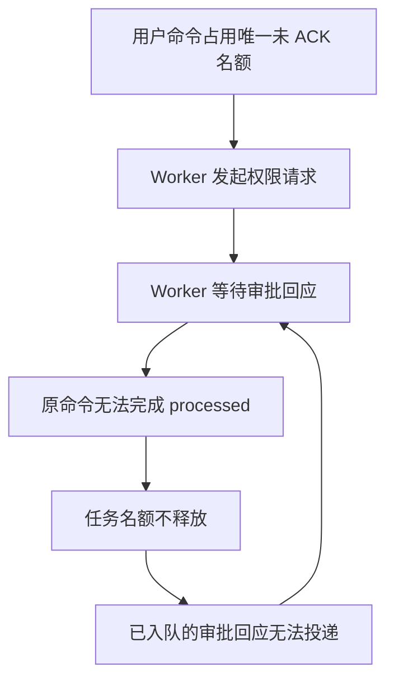
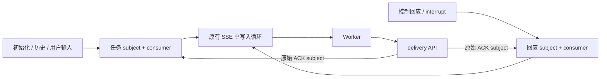

# Worker 控制回应投递阻塞调查

调查日期：2026-09-10。投递修复已通过真实 Worker 验证；本次不迁移旧消息，旧的卡住对话由用户停止后删除并新建。

## 根因

`MaxAckPending=1`、只在 `processed` 时完成 ACK，以及用户输入和控制回应共用同一个
consumer，这三个条件与真实 Worker 的命令生命周期组合后形成循环等待：用户命令
等待审批回应才能完成，审批回应却必须等用户命令完成后才能投递。



问题对应提交 `4e407449f33a64791dd23cfe7cc56f22af63c92d`（`Unify code session worker event delivery (#340)`）
中的串行投递策略。隔离实验不使用 MCP 也能复现，因此 MCP Tunnel 不是必要触发条件。
“始终允许仍需审批”的工具名匹配问题单独处理；自动 allow 也需要投递控制回应，因此仅修正权限匹配不能解除此循环。

| 代码边界 | 修复前的行为 |
| --- | --- |
| `internal/workerevents/broker.go` | 每个 Session 一个 durable consumer，`MaxAckPending=1` |
| `internal/codesessions/worker_delivery.go` | `received/processing` 调用 InProgress；`processed` 调用 DoubleAck |
| `internal/codesessions/inbound_publication.go` | 普通输入与控制回应使用相同 Session subject |
| `internal/codesessions/tool_permissions.go` | 手动、自动 allow/deny 都通过控制回应解除 Worker 等待 |

`MaxAckPending` 限制已投递但尚未确认的消息数量，达到限制时暂停继续投递，见
[NATS consumer 配置](https://docs.nats.io/learn/jetstream/pull-consumers)。
真实 Worker 在收到输入后报告 `received`，命令开始时报告 `processing`，命令结束时才报告 `processed`。

## 因果验证

本地只读调查观察到同一会话约 49 分钟未推进：用户输入 seq=2 已投递但未 ACK，审批 allow
seq=3 已存储但未投递；消费者为 `max_ack_pending=1, num_ack_pending=1, num_pending=1`。
期间原输入重投，审批仍未到达；API readiness 正常，独立的 Tunnel 命令队列没有积压。

隔离实验使用真实 Claude Code `2.1.251`、生产 Broker、独立三节点 NATS 和真实 `Write` 工具。
仅 CCR HTTP 与模型输出由测试 fixture 提供，不使用用户会话、生产凭据或真实模型供应商。

| 实验 | 实测结果 |
| --- | --- |
| 任务窗口 1，用户命令等待已入队的 allow | 审批无法到达；强制 SSE 重连后仍阻塞 |
| 同一场景仅把窗口从 1 改为 2 | allow 到达，Write 执行，原用户命令 processed，队列排空 |
| allow 前再排一条用户输入，窗口从 1 改为 2 | 第二条输入占满窗口，allow 继续阻塞 |
| 上述场景再把窗口从 2 改为 3 | allow 到达，两条用户命令均完成 |
| 纯文本对照，窗口始终为 1 | 正常完成 received、processing、processed |

工具执行以容器内文件内容为证据。扩大窗口仅用于独立实验，没有修改现场消费者配置。
这些结果说明单纯增大窗口会推迟阻塞，不能消除任务与回应之间的依赖。

## 方案选择与实现

| 方案 | 判断 |
| --- | --- |
| 增大 `MaxAckPending` | 排队用户输入仍可填满窗口，不采用 |
| `received` 时完成 ACK | 改变可靠性边界；Worker 尚未完成任务时崩溃可能丢失输入，不采用 |
| 任务与控制回应分别使用持久化 consumer | 解除依赖，同时保留完成 ACK，采用 |

同一个 `OMA_WORKER_INBOUND` Stream 内使用两个互不重叠的精确 subject：

- 任务：`oma.worker.inbound.v2.<session>`，consumer 为 `oma_worker_<session>`。
- 回应：`oma.worker.inbound.v2.<session>.reply`，consumer 为 `oma_worker_<session>_reply`。

两个 consumer 都保持 `MaxAckPending=1`、`MaxRequestBatch=1` 和现有 ACK/backoff 策略。
这种过滤方式符合 [NATS WorkQueue consumer 约束](https://docs.nats.io/learn/jetstream/retention-policies)。
请求与回应分开投递也可参考 [RabbitMQ RPC callback queue](https://www.rabbitmq.com/tutorials/tutorial-six-go)，
本项目继续使用既有 JetStream 和 delivery API。



`internal/workerevents/lanes.go` 集中分类：`control_response` 和 `control_request/interrupt`
进入回应通道。initialize、启动历史、普通用户输入与未知类型保持任务顺序；公共工具确认和
自定义工具结果沿用现有 payload 转换，不更改公共 API 合同。

两路读取使用有界 Subscription，交给原有 SSE 单写入循环；关闭或一路读取失败会取消两路。
ACK 仍按 Session、epoch 和 event ID 定位原始 ACK subject，`processed` 才完成各自消息。
MemoryBroker 同步采用两路语义；到期扫描识别 `.reply`，Session purge 删除两路 consumer 后
再清理两个精确 subject。任一 consumer 删除失败时保留消息，允许重试。

Stream sequence 继续表示存储位置，合并后的发送序号允许非单调。例如用户输入 seq=2、
排队输入 seq=3、审批回应 seq=4，可以按 2、4、3 发送。重连依据 durable consumer 的 ACK
状态；不能按最大已见序号丢弃尚未处理的输入。

## 兼容与升级范围

本次不提供启动期自动迁移或离线迁移命令，不增加扫描、转存旧控制回应的流程。
升级前已存入任务 subject 的回应仍在原位置，升级不会自动救活因此卡住的旧对话。
旧对话由用户自行停止后删除，再创建新对话；当前删除 API 拒绝 `running/rescheduling` 状态，
因此需先完成停止操作。此次修复不自动删除任何用户对话。

部署时应先停止旧 API 实例，再启动新版本，避免旧实例继续将回应写入任务 subject，或把新
`.reply` subject 当作无效消息清理。此要求与是否保留旧对话无关；不支持新旧版本混跑。

真实 CLI 兼容性验证针对 `2.1.251`，其他 CLI 版本仍需验证跨通道序号、重连与 ACK 行为。
没有修改 Worker API 路径、权限决策、epoch fencing、payload 外置和完成 ACK 的语义。

## 回归与验收

默认测试覆盖 Memory/JetStream 两路顺序、回应连续 ACK、未知类型分类、到期扫描、两路
purge 及 consumer 删除失败后保留消息。真实 Worker 的 opt-in 回归覆盖：

- 五个隔离场景：未知 request ID 回应后再审批、中断等待中的任务、普通审批、回应越过排队
  输入并重连、纯文本。审批先以较大序号到达，重连后较小序号输入仍执行完成。
- 四个完整 OMA API 场景：手动拒绝、自动拒绝、手动允许且有排队输入、自动允许。使用真实
  API、PostgreSQL、Redis、JetStream 与 Worker，仅模型输出使用 fixture；公共 tool-use ID
  经过实际审批状态映射。允许时验证文件内容，拒绝时验证文件不存在。
- 原有九个 liveworker 协议场景：覆盖真实重投、Redis ACK 丢失、旧 epoch、大 payload
  完整性与对象清理、Session 隔离及后台到期终止。

上述回归已通过，两路窗口始终保持 1。全量 `just test`、竞争检测、lint、死代码、重复代码、
复杂度和大文件检查已通过；隔离 E2E 服务、容器、网络和临时数据卷在验收后清理。

真实 Worker 验收前需有 Docker 和本地 sandbox 镜像，测试使用 `--pull=never`。
可用 `OMA_WORKER_CONTROL_IMAGE` 指定固定本地镜像 ID。测试依赖 `host.docker.internal`
访问宿主机，已在 macOS/OrbStack 验证。执行入口：

```sh
./scripts/generate-go.sh
OMA_WORKER_CONTROL_PROBE=1 go test ./internal/workerevents -run TestRealWorkerControlDelivery -count=1 -v -timeout 180s
LIVE_WORKER_REAL_CLAUDE=1 LIVE_WORKER_API_URL=http://127.0.0.1:18080 CONFIG_FILE=/path/to/test-config.yaml go test ./tests/liveworker -run TestRealWorkerToolPermissions -count=1 -v -timeout 240s
```

第一个命令使用自行创建的独立 NATS 与容器；第二个命令要求预先启动独立 OMA API、
PostgreSQL、Redis、NATS 与对象存储。不得指向生产或有用户正在工作的环境。
