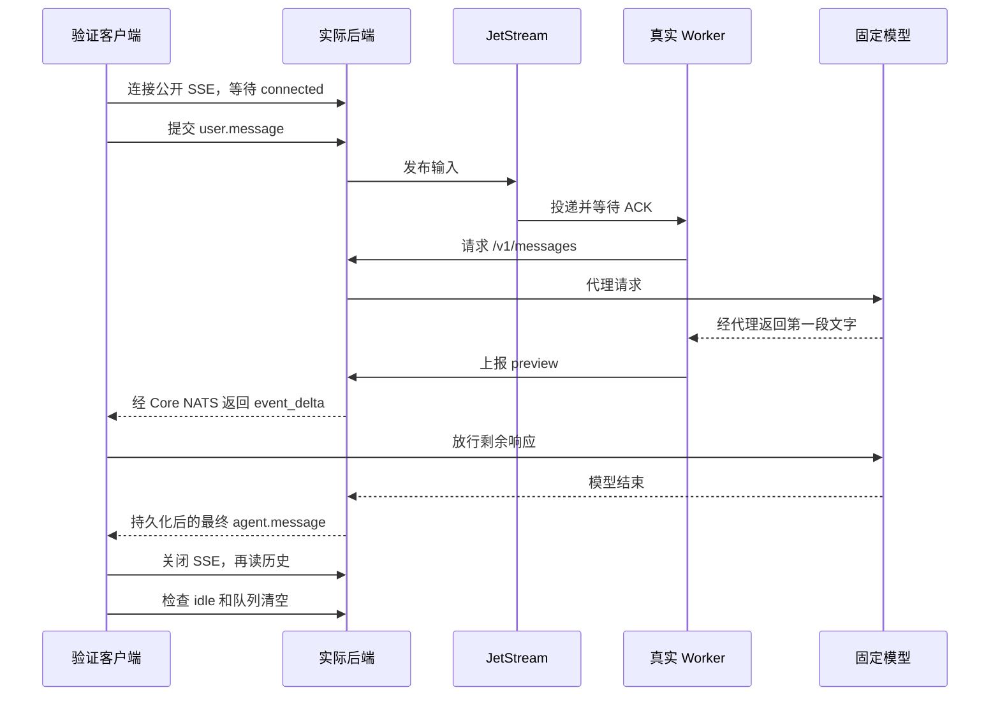
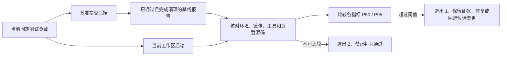

> 统一入口和 Files 验证见 [Backend verification](backend-verification.md)。本文件保留 chat 场景的设计细节。

# 聊天后端自我验证

## 范围

项目级 `.agents/skills/verify-be` 提供固定 CLI，注册 `chat.roundtrip`、`chat.tools`、
`chat.reliability`、`chat.instances`、`chat.public` 和 `chat.performance`。
CLI 实现在 `cmd/verify-be`，Skill 中的 shell 入口只负责构建和执行。环境编排、进程管理、
报告判定及其测试全部使用 Go，不依赖 Python；临时 Ed25519 密钥由 Go 标准库生成。
验证使用实际编译的后端、真实 PostgreSQL / Redis / 三节点 NATS / MinIO、真实 Claude Worker，
以及测试侧固定模型响应。Worker 的模型请求经过生产 `/v1/messages` 代理。
不修改生产 API、数据库 schema 或状态机。

除 `chat.public` 外，Session/CodeSession 通过现有 liveworker 夹具准备并 activation。
隔离后端关闭后台 Runner，避免竞争 Worker。`chat.public` 通过公开 API 创建 Session，
由实际 Runner 驱动本地 Docker Provider 分配沙箱、启动真实文件系统挂载和 environment-manager。
本版不验证云平台分配 API、自动云端故障检测、浏览器渲染或真实模型决策。



## 隔离与生命周期

CLI 不读取开发配置。每轮创建唯一 Compose project，依赖端口由 Docker 分配，后端固定绑定
`127.0.0.1:18080`。端口占用时阻止运行，不调用会终止既有监听进程的 restart 脚本。
NATS 每节点显式配置 16 GB store 上限，支持当前默认 256 MiB 三副本 stream，也支持旧基准提交的 10 GiB 配置。
所有镜像必须预先存在，报告记录解析出的 image ID，实际启动也使用这些不可变 ID；CLI 不自动拉取镜像。
同一主机上的 CLI 使用文件锁串行占用固定 E2E 端口，不删除活跃锁文件。

正常退出、测试失败、Ctrl-C 和 SIGTERM 都执行清理。Worker 使用 run label 标记归属。
清理删除该轮配置、签名密钥、二进制和容器/卷，保留 `tmp/verify-be/<run-id>/` 证据。
SIGKILL/主机崩溃后的人工恢复方法在 Skill 中记录，不能把未完成报告当作通过。

## 断言和结果

`tests/liveworker/chat_roundtrip_test.go` 验证：

- SSE 在发送输入前确认订阅就绪。
- 每段中文 preview 到达客户端后，模型才允许继续，避免仅收到最终文本也能通过。
- preview 与 final 的 ID 和文本一致；最终事件携带线程 ID，历史按该线程核对。
- 关闭 SSE 后，会话和线程历史均保留相同输入及最终响应，没有持久化 preview。
- 模型代理产生一次 start/end；Worker 最终回显不增加第二条回复。
- 本轮最终 idle，输入队列和未确认消息归零；Worker idle 后再次核对历史。

逐段放行仅用于构造确定性测试。生产路径中，模型代理可能先持久化最终响应，Worker 随后才上报
最后一段 preview；最终内容可替换此前的不完整 preview，不要求两条通道具有全局顺序。
主会话历史允许省略隐含的 `session_thread_id`；线程历史必须返回对应线程 ID。两种视图都检查
消息 ID、内容、已处理标记和唯一性，不能以缺少线程字段为由跳过历史验证。

CLI 解析 `go test -json`，要求目标测试和 package 均 pass、所有阶段证据存在、无 skip、
源代码指纹未变化且清理成功。退出码 0 为验证通过、doctor 成功或帮助，1 为失败，2 为参数错误或先决条件阻塞。
保存 Git commit、源码 SHA-256、二进制 SHA-256、工具和镜像版本以及阶段耗时。
源码指纹包含受跟踪和未忽略的新文件，使未提交实现也可核对。功能阶段耗时不作为性能门槛；
独立性能负载的基线门禁见下文。

报告和日志目录为当前用户私有。禁止直接上传原始日志；分享摘要时仅保留非敏感元数据。

## 验收入口

根目录 `AGENTS.md` 定义聊天改动何时必须使用验证 Skill；场景选择、执行顺序、基准提交选择及
交付证据要求统一维护在 `.agents/skills/verify-be/SKILL.md` 的 Agent workflow 中。
功能地图记录各场景的链路、断言和覆盖边界，避免把操作步骤复制到多个入口后产生分歧。

`chat.tools` 复用仓库已固定版本的官方 `anthropic-sdk-go`，连接本轮本地后端。SDK 发送任务、
读取 `requires_action` 和 `agent.tool_use`、提交 `user.tool_confirmation`、读取最终历史。
固定模型通过真实模型代理请求 Write，由真实 Worker 执行；SDK 本身不执行工具。
先验证拒绝，再验证允许：确认前文件必须不存在；拒绝后仍不存在；允许后文件内容必须匹配。
同时检查一次工具调用、结果、确认和最终回复，输入与回复队列都必须清空。
此场景不调用 Anthropic 云端，不需要真实模型凭据，不包含 custom tool 或 MCP 覆盖。
相关协议见 [Managed Agents tools](https://platform.claude.com/docs/en/managed-agents/tools)。

```sh
go test ./cmd/verify-be -count=1
just verify-be -h
just verify-be chat -h
just verify-be chat tools --help
.agents/skills/verify-be/scripts/verify-be chat doctor
.agents/skills/verify-be/scripts/verify-be chat roundtrip
.agents/skills/verify-be/scripts/verify-be chat tools
```

CLI 使用 Cobra 注册 `chat`、`files` 和各自场景，另有公共及分域 `doctor`，统一处理参数与错误。
根命令、子命令和具体场景均支持 `-h` / `--help`，也支持 `help [命令 [场景]]`。
帮助列出可用命令、场景说明、镜像配置优先级、示例、报告路径、退出码和覆盖范围；场景名称与
说明来自实际执行使用的同一注册表，选项帮助直接从 Cobra flag 定义生成。
`--timeout` 是全局选项；`--worker-image` 属于 `chat`；性能参数属于 `chat performance`。长选项统一使用 `--worker-image` 等双横线写法，帮助保留 `-h` 缩写。
性能专属参数仍只允许用于 `chat performance`，诊断与基线比较不能同时启用。
帮助在读取本地配置、查找 Git 根目录和连接 Docker 前返回成功；shell 入口仍需 Go 来构建 CLI。
CLI 单测覆盖参数错误、选项位置、帮助入口、场景清单和私有镜像值不回显。

Worker 镜像按 `--worker-image`、`OMA_WORKER_CONTROL_IMAGE`、仓库根目录
`.verify-be.local.json` 的 `worker_image` 字段依次解析，最后使用公共镜像
`ghcr.io/superduck-ai/managed-agent-sandbox:latest`。本地配置已加入 Git 忽略，内部仓库地址
只保存在该文件中，日常无需 export。帮助信息不展示解析后的私有配置，报告仅记录镜像 ID；
镜像检查错误也不回显实际地址。本地配置不参与源码指纹，实际运行的镜像 ID 单独记录。
Go 变更仍运行 `just lint`、`just dead-code`、`just duplicates` 和 `just complexity`。

## 可靠性场景

`chat.reliability` 在第一条模型请求输出首片段后暂停响应，验证第二条输入返回 409 和
`conflict_error`，不落库且不触发模型请求。随后断开 Worker SSE 并等待真实重连，确保运行中的
模型请求没有重复。公开 SSE 客户端在回复途中断开，模型放行后从历史恢复第一轮，空闲后重试
第二条输入必须成功，并核对两个有序回合。再销毁 Worker 容器，通过生产恢复服务
轮换凭据，验证旧凭据被拒绝，登记新 epoch，由替代 Worker 完成排队中的第三条消息。
它验证恢复执行路径，不验证云端故障自动检测，也不保证工具副作用执行到一半时的恢复。

`chat.instances` 启动第二个独立后端进程，共享本轮 DB、Redis 和 NATS。第一实例接收输入及
Worker 请求，第二实例接收 SSE 订阅与历史查询；验证预览、最终回复的 ID 和文本一致。

`chat.public` 使用实际 Runner、rclone-filestore 和 environment-manager。测试 Provider
仅把沙箱分配适配为 Docker，不伪造挂载就绪或启动结果。容器需要 `/dev/fuse`、`SYS_ADMIN`
和非受限 AppArmor 配置。凭据通过 stdin 传递，测试结束清理容器和对应工作/沙箱状态。

## 性能负载与门禁

固定合同为一个会话、串行请求、2 次预热、20 次采样。模拟模型输出两个文本片段，间隔
200 ms，不等待客户端。这段延迟是明确的负载参数，用于让预览有稳定的观察窗口。
每轮记录从提交开始到请求接收、首片段、最终回复及 idle/ACK 清空的累计毫秒数；idle
指标包含状态轮询的观察延迟。保留全部样本和 P50/P95，并验证所有回合历史与模型调用数。
当前指标衡量串行聊天延迟，不代表并发容量或真实模型延迟。



`--backend-ref REF` 将本地 Git 提交导出到本轮私有临时目录并构建后端，测试负载仍来自
当前工作区，不切换工作分支。`--baseline REPORT` 要求基线成功、清理完成、非诊断运行，
负载版本及源码哈希、机器类别、工具版本和镜像 ID 均一致。缺少样本或环境不兼容不能通过。
CLI 不自动改写基线。

初始回退门禁为任一指标 P50 或 P95 超过 `基线 × 1.25 + 25 ms` 时失败。这是初始容忍策略，
不是经生产采样建立的 SLO；后续应依据同机重复采样校准，并评审阈值变更。无基线的命令
只产生测量结果。发生退化时保留基线与候选证据，诊断后修复或回退代码，不自动放宽门禁。

`--diagnostics` 使用新增且默认关闭的 `server.diagnostics_addr`。后端在独立 HTTP listener
暴露 CPU、heap、goroutine 和 runtime trace，仅接受字面量 loopback IP，绑定失败则启动失败。
验证 CLI 分配本机临时端口，预热结束后并行采集负载期间 CPU/trace，结束时采集 heap 和
goroutine，并生成 `cpu-top.txt`。诊断会改变性能，不允许与基线比较，也不能作为基线。
profile 属于本地私有证据，CI 不上传。

## PR 验证

`.github/workflows/chat-verification.yml` 在每个 PR 执行五个功能/可靠性场景，再在同一
runner 上以当前负载分别测试 PR 基准提交和候选后端，比较性能。镜像先显式拉取，CLI 本身
仍不拉取。任一验证失败使 `Chat verification` job 失败，仅上传 JSON/Markdown 判定报告。
仓库分支保护需将该 check 标为 required；workflow 文件本身不能修改远端合并保护规则。

## 验证器的可靠性边界

`chat doctor [SCENARIO]` 检查 Go、Docker、Compose、Bash、git、tar、本地镜像及 18080 端口，
并创建短期探针检查 Docker 数据卷至少有 1 GiB 可用空间。此值是小型固定负载的最低余量，
不是容量保证；三个 NATS 节点的 16 GB 配置是各自上限，不代表必须预留 48 GB。
`chat doctor public` 还用实际 Worker 镜像打开 `/dev/fuse` 并执行 tmpfs mount/unmount，
检查 Docker daemon 的设备和挂载权限；不根据客户端操作系统推断可用性。
探针不拉取镜像，携带独立 label，成功或失败均删除容器和匿名卷。
`场景命令` 自动执行对应场景的先决检查。依赖不满足为 blocked（2），清理无法确认不能通过。

默认场景期限：roundtrip/tools/instances 为 3 分钟，reliability/performance 为 5 分钟，
public 为 6 分钟。`--timeout 8m` 可覆盖场景期限，测试辅助等待也使用该预算；
Go 测试总期限额外留 30 秒用于清理，外层命令额外留 2 分钟用于编译和退出。
构建及环境启动使用独立期限。报告区分 scenario_timeout、orchestration_timeout、
cancelled、prerequisite、baseline_incompatible、test_failure 和 performance_regression；
超时分类说明发生在哪一层，不自动断言产品有性能退化。

诊断与跨实例测试通过已绑定 TCP listener 的文件描述符启动子进程，保持端口占用直到
子进程继承。组装层支持 `OMA_HTTP_LISTENER_FD` 和 `OMA_DIAGNOSTICS_LISTENER_FD`，
要求描述符至少为 3 且实际地址与配置一致；常规部署不设置这两个变量。
诊断 Serve 的异常错误用结构化日志记录；下载拒绝空文件、非 200 响应和超过 64 MiB 的内容，
失败下载不保留为有效 profile。

公开 SSE 恢复测试在首片段后断流，完成回复后先重新订阅，再提交下一条消息，
同时按每页 2 条扫描全量历史。要求断线前 preview 和历史 final 使用同一 ID、文本完整，
重连 SSE 能收到新回合，最终历史顺序正确且无重复 ID。协议不承诺 Last-Event-ID 重放。
Go 场景验证真实后端合同；前端的合并去重算法仍由前端现有测试负责，不声称浏览器覆盖。

`chat.public` 在测试进程内启动生产 Runner.Start 循环，配置两个领取 worker。
先注入一次沙箱分配失败并确认工作停止，再通过公开 API 创建两个会话完成两个真实回合。
Runner 在 API 请求前启动，覆盖生产空闲时的 500 ms tick 及失败后继续领取；已领取的工作失败后按现有语义立即检查下一项，
不以墙钟精确断言每次 tick，也不声称覆盖云端启动配置。后端进程的 Runner 保持关闭，
避免使用云 Provider。Start 返回停止并等待循环退出的函数，生产组装和测试均在退出时调用。

Markdown 和 JSON 报告均记录验证源码提交与哈希、后端提交、二进制哈希、工具版本、
镜像 ID 和期限。基线必须具有由 `--backend-ref` 解析的完整提交 SHA；工作区自测不能作为基线。
CI 进一步要求该提交等于 PR base SHA。编排单测覆盖配置隔离、拓扑、进程取消、探针失败和
清理、证据保留、下载边界、包选择及超时分类；真实场景仍是最终集成验收。

`go test -json` 的 stdout 单独保存为 `tests.jsonl` 并严格解析；stderr 保存到
`tests.stderr.log`。Go 在冷缓存下载模块时会向 stderr 写普通文本，不允许它混入 JSON
证据流。stderr 仅用于本地诊断，不加入 CI 上传产物，也不替代测试退出码与阶段断言。
