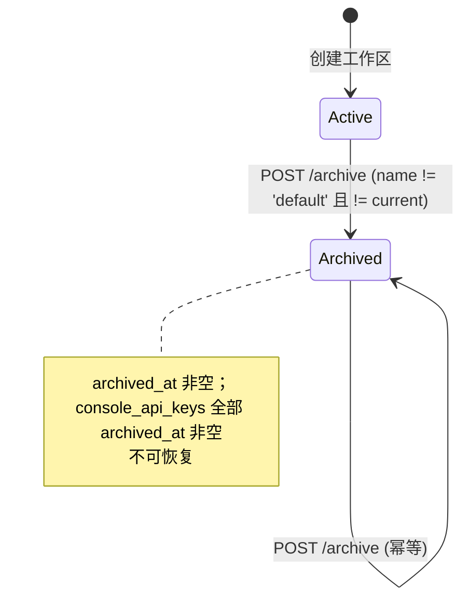
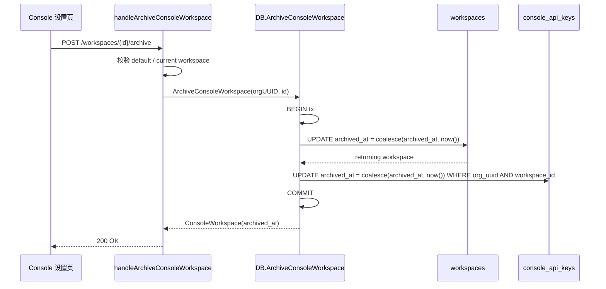

# Console Workspace 归档

本文记录工作区归档（软删除）的数据模型、级联行为、禁归档边界与 API 契约，对齐 Anthropic Console workspace 的 archive 语义：归档即停用工作区并立即吊销其下所有 API key，且不可恢复。

## 背景与语义

Anthropic Console 中，归档工作区是不可逆的软删除：工作区立即停用，其下所有 API key 立即吊销，且无法恢复。本实现对齐该语义：

- `workspaces.archived_at` 由空变为 `now()` 表示归档；归档后的工作区不再出现在工作区列表与切换器中。
- `default` 工作区是兼容 Anthropic 的回退工作区，永远不可归档。
- 归档操作在单个数据库事务内级联吊销该工作区下的所有 `console_api_keys`。

## 数据模型

归档只写两个时间戳列，不删除任何行：

- `workspaces.archived_at timestamptz`：非空即归档。
- `console_api_keys.archived_at timestamptz`：随工作区归档一并置位。

`console_api_keys.workspace_id` 存储工作区的 `external_id`（如 `default`），级联按 `org_uuid` + `workspace_id` 定位。归档写使用 `coalesce(archived_at, now())`，因此对已归档工作区重复归档是幂等的：`archived_at` 不会被改写。

## 状态机与级联





## 禁归档边界

归档端点对默认工作区与当前会话工作区做了多层防护：

| 场景 | 后端 | 前端 |
|------|------|------|
| `default` 别名 | handler `id == "default"` → 409 `cannot_archive_default_workspace` | DropdownMenu 归档项 disabled |
| 默认工作区（真实 external_id） | DB 层 `WHERE name <> 'default'` 排除，0 行 → `ErrNotFound` → 404 | 列表过滤默认工作区，前端不可达 |
| 当前会话绑定的工作区 | handler `principal.WorkspaceExternalID == id` → 409 `cannot_archive_current_workspace` | `workspace.id === activeWorkspaceId` 时归档项 disabled |

默认工作区是兼容 Anthropic 的回退工作区，永远不可归档。`workspaces` 表的 `(organization_id, name)` 唯一约束保证每个组织只有一个 `name = 'default'` 的工作区，因此 DB 层 `WHERE lower(coalesce(name, '')) <> 'default'` 精确兜底：即便调用方绕过 handler 的别名校验、直接用默认工作区的真实 external_id 调用，UPDATE 也命中 0 行而返回 `ErrNotFound`（404）。handler 的别名校验仅用于对最常见的 `"default"` 调用给出明确的 409 语义。

前端禁用是为了避免用户触发必败请求；后端校验是权威防线，防止绕过 UI 直接调用 API 造成自锁——归档当前工作区后，会话绑定的 API key 会立即被吊销。

## 包职责

- `internal/db/console_workspaces.go`
  - `ArchiveConsoleWorkspace(ctx, orgUUID, workspaceID)` 在单个事务内更新 `workspaces.archived_at` 并级联更新 `console_api_keys.archived_at`。
  - UPDATE 的 WHERE 子句带 `lower(coalesce(name, '')) <> 'default'`，把"默认工作区不可归档"作为写入路径不变量，覆盖调用方传别名或真实 external_id 的所有路径。
  - `returning` 列顺序与 `console_api_keys.go` 的 `scanConsoleWorkspace` 对齐，复用既有 scan 辅助函数；本功能不改动 `console_api_keys.go`。
- `internal/platformapi/console_workspaces.go`
  - `handleArchiveConsoleWorkspace` 负责禁归档校验（default / current）、`404`/`409` 映射与响应。
- `internal/platformapi/platform_backend_routes.go`
  - 归档路由挂在已有的 `RegisterConsoleOrganizationWorkspaceRoutes`（workspace 路由的独立入口，`server.go` 已在调用），与 `r.Get("/workspaces", ...)` 同处。
- `internal/platformapi/console_api_keys.go` 与 `internal/db/console_api_keys.go`
  - 零改动：归档功能不夹带与之无关的 select 去重或 handler 搬迁，此类重构另行开 PR。

## API 契约

```
POST /api/console/organizations/{orgUuid}/workspaces/{workspaceId}/archive
```

| 状态码 | 含义 |
|--------|------|
| 200 | 归档成功（含幂等重试），返回带 `archived_at` 的 workspace |
| 404 | 工作区不存在、不属于该组织（组织隔离），或默认工作区按真实 external_id 归档（DB 层不变量） |
| 409 | 目标是 `default` 别名，或当前会话绑定的工作区 |

归档不要求请求体。

## 前端入口

`WorkspacesSettingsPage` 每行的操作列改为 `DropdownMenu`（API keys / Webhooks / 归档），归档项打开 `ArchiveWorkspaceDialog` 二次确认。`default` 工作区与当前激活工作区的归档项被禁用，并通过 `title` 给出切换提示。归档成功后 `WorkspaceProvider` 通过 `queryClient.setQueryData` 从工作区列表移除该工作区；由于当前激活工作区已被前端禁用归档，正常路径下不会触发激活工作区收敛。

## 测试

`tests/console_workspace_archive_api_test.go` 覆盖：

- `default` 别名归档 → 409。
- 默认工作区按真实 external_id 归档 → `ErrNotFound` 且 `archived_at` 保持空（直接调用 `ArchiveConsoleWorkspace` 验证 DB 层不变量，避开 HTTP 会话的自锁校验）。
- 未知工作区 → 404。
- 组织隔离（用 A 组织凭证归档 B 组织工作区 → 404）。
- 归档成功并级联吊销 `console_api_keys`（断言 key 的 `archived_at` 非空）。
- 重复归档幂等（`archived_at` 不变）。

验证命令：

- `go test ./tests -run TestConsoleWorkspaceArchive -count=1 -v`
- `go test ./internal/db ./internal/platformapi -count=1`
- 前端：`bun run build`、`eslint --config eslint.complexity.config.js src`。
