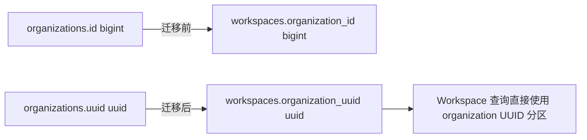
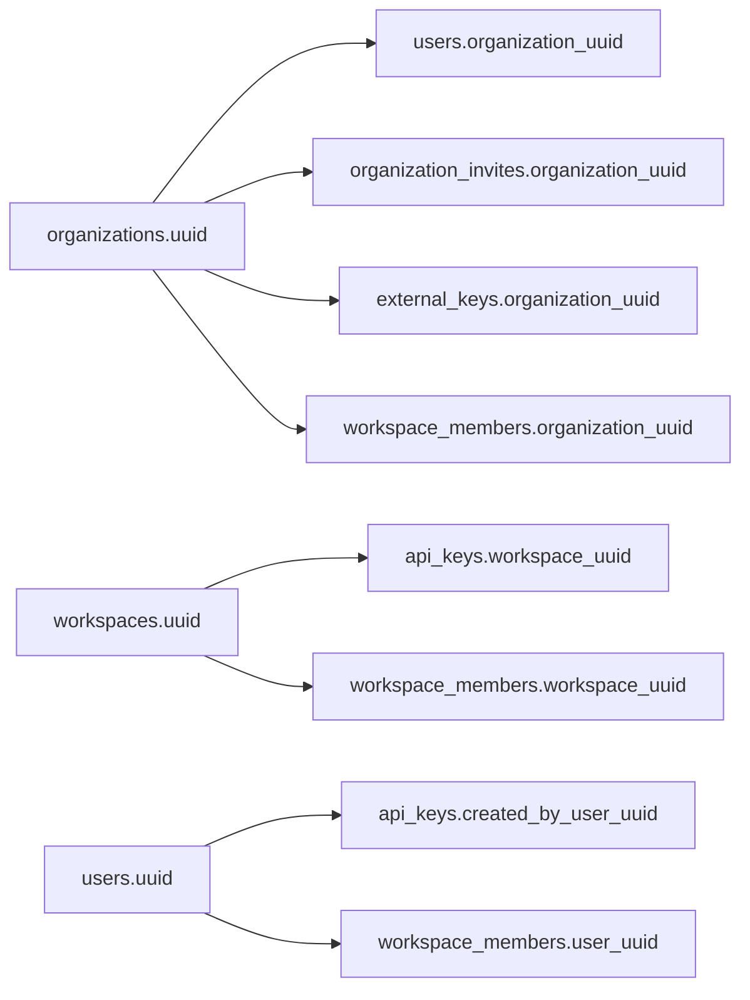

# 数据库稳定引用

## 标识符分工

多数核心业务表继续保留三类标识符：

- `id bigint generated always as identity` 只承担当前数据库内的行 identity，不作为稳定业务标识或新的跨表引用；
- `uuid uuid` 是备份恢复、租户搬迁、跨库合并和部分数据导入后仍保持稳定的业务标识；
- `external_id text` 是 Anthropic API 或其他外部协议的兼容标识，不替代内部稳定 UUID。

`organizations` 是明确的例外：组织没有必须兼容的 Anthropic 前缀 ID，迁移
`00037_drop_organization_external_id.sql` 删除 `organizations.external_id`，此后组织在数据库、
HTTP 路由、Admin 响应、Platform session 和 webhook payload 中统一使用原始 UUID。迁移不修改
任何已有 `organizations.uuid`，因此已保存的组织引用保持稳定。`organizations.id` 继续作为
数据库内部 identity，但不会进入 Admin Organization 业务模型；Organization 查询直接按 UUID
定位。

跨表持久化引用应保存目标资源的 UUID。应用仍可在查询边界把 UUID 解析为当前数据库的 bigint identity，但不能把另一个表的 identity 作为需要跨数据库保持含义的权威引用。数据库不创建 PostgreSQL 外键，引用完整性由写入查询、migration 校验和集成测试维护。

UUID 引用按资源分批迁移。在某个下游表尚未迁移前，兼容路径可以在持久化边界解析其旧 bigint
引用；已经完成迁移的表不得重新把 identity 暴露给 Admin/Console/Platform 业务模型，也不得
使用 identity 作为分页游标或稳定排序键。

## Workspace 的 Organization 引用

迁移 `00036_use_uuid_workspace_organization_reference.sql` 将：

```text
workspaces.organization_id bigint
```

替换为：

```text
workspaces.organization_uuid uuid
```

`workspaces.id` 仍是 bigint identity，`workspaces.uuid` 和 `workspaces.external_id` 的值保持不变。原有组织内名称唯一性 `(organization_id, name)` 相应改为 `(organization_uuid, name)`。

迁移前会把每条旧 `organization_id` 与 `organizations.id` 关联；存在无法解析的孤立引用时直接失败。表按最终字段顺序重建，复制时保留 workspace identity，并在重建后校准 identity sequence。回滚同样要求每个 `organization_uuid` 都能解析为当前库的 organization identity，不能把无法解析的引用静默写成空值。



## Admin 资源的 UUID 引用

迁移 `00038_use_uuid_external_key_organization_reference.sql` 和
`00039_use_uuid_admin_resource_references.sql` 完成以下替换：

| 表 | 删除的 bigint 引用 | 新的 UUID 引用 |
| --- | --- | --- |
| `external_keys` | `organization_id` | `organization_uuid` |
| `users` | `organization_id` | `organization_uuid` |
| `organization_invites` | `organization_id` | `organization_uuid` |
| `api_keys` | `workspace_id` | `workspace_uuid` |
| `api_keys` | `created_by_user_id` | `created_by_user_uuid` |
| `workspace_members` | `organization_id` | `organization_uuid` |
| `workspace_members` | `workspace_id` | `workspace_uuid` |
| `workspace_members` | `user_id` | `user_uuid` |

`api_keys.created_by_user_uuid` 与旧列相同，允许为空；其余新引用均为 `NOT NULL`。迁移在删除旧列
前解析并检查全部引用。Workspace Member 还会验证 organization、workspace 与 user 的 UUID
属于同一组织，防止把既有的跨租户脏数据固化进新结构。

这五张表仍保留自身的 bigint identity 主键，但 Admin 数据模型不再读取它们；列表分页使用资源
自身的 UUID 作为同时间戳下的稳定排序键。迁移 `00040_use_uuid_external_key_pagination.sql`
相应把 External Key 列表索引的末列从 `id` 改为 `uuid`。



## 下游资源的 UUID 引用

迁移 `00041_use_uuid_resource_references.sql` 到
`00044_use_uuid_compatibility_references.sql` 将剩余资源按依赖顺序迁移。所有目标表继续保留自己的
`id bigint generated always as identity`，但跨表列、租户隔离、分页稳定键和应用模型都改用 UUID。
迁移先通过旧 identity 关联目标表并回填 UUID；任何必填引用无法解析都会中止迁移，避免把孤立
identity 静默带入新结构。PostgreSQL schema 仍不创建外键约束。

| 批次 | 表 | UUID 引用 |
| --- | --- | --- |
| 资源目录（`00041`） | `files`、`skills`、`agents`、`environments`、`vaults`、`memory_stores`、`webhook_endpoints`、`message_batches` | organization、workspace、creator、environment 等所属资源引用 |
| 资源子表（`00041`） | `skill_versions`、`agent_versions`、`environment_keys`、`vault_credentials`、`mcp_oauth_flows`、`memories`、`memory_versions`、`message_batch_requests` | 父资源、租户、creator/user 和 current/redaction version 引用 |
| 编排与会话（`00042`） | `deployments`、`deployment_runs`、`sessions`、`session_threads`、`session_resources`、`session_events` | organization、workspace、API key、environment、agent、deployment、session、thread 引用 |
| Code Session 与 runtime（`00043`） | `code_sessions`、三个 `code_session_*_events` 表、`environment_work`、`environment_worker_polls`、`environment_sandboxes` | organization、workspace、session、environment、code session、work 引用 |
| 后台与统计（`00043`） | `jobs`、`workspace_storage_usage` | `workspace_uuid` |
| Console 与 Workbench（`00044`） | `console_api_keys`、`workbench_prompts`、`workbench_prompt_revisions`、`workbench_prompt_kv`、`workbench_evaluations`、`workbench_generated_test_cases` | organization、workspace、API key、user、prompt、revision 引用 |

例如 `skill_versions.skill_uuid`、`deployment_runs.deployment_uuid`、
`session_events.session_uuid`、`code_session_outbound_events.code_session_uuid` 和
`workbench_evaluations.revision_ref_uuid` 都直接引用父资源的稳定 UUID，不再保存父表 identity。
仅为外部协议兼容而存在的 `*_external_id` 或 `prompt_uuid` 文本字段继续保留其协议语义，但不再
承担数据库内部资源关联。

对于 nullable 引用（例如 session 的 deployment、memory 的 current version、sandbox 的 work），
迁移保留可空语义；非空旧值无法映射时仍会失败。父子关系和租户归属通过写入 SQL、迁移校验以及
集成测试保证。

## 应用查询边界

鉴权边界提供 organization identity 和 UUID，不再提供 organization external ID。其中 Organization Admin、Workspace Admin、Workspace API Key Admin 和 External Key 的 workspace 引用计数直接传递可信 `organization_uuid`，写入和租户过滤均使用：

```sql
workspaces.organization_uuid = CAST(:organization_uuid AS uuid)
```

这些路径不需要返回 organization 的其他字段，因此不得仅为 bigint identity 与 UUID 互转而 JOIN `organizations`。普通 workspace API key 鉴权仍需解析 organization identity 和 UUID；该查询保留 JOIN，并把 UUID 提供给后续 Workspace 查询。

Users、Invites、Workspace Members 和 External Keys 的组织隔离现在直接过滤各表的
`organization_uuid`。API Keys 直接通过 `workspace_uuid` 关联 Workspace，通过
`created_by_user_uuid` 关联创建者。只为把 UUID 转换成 bigint identity 而存在的
`organizations` JOIN 已删除；确实需要返回 Workspace/User 字段的 JOIN 继续保留。

资源、编排、会话、runtime 和兼容层查询同样直接使用 `organization_uuid`、`workspace_uuid`
以及父资源 UUID。只为 bigint identity 与 UUID 互转而存在的 JOIN 已删除。写入时用于校验
目标资源存在、租户归属一致或确实需要读取目标字段的 JOIN/`INSERT ... SELECT` 继续保留；
删除 JOIN 的判断依据是查询语义，而不是表中已经出现某个 UUID 列。

Platform session 现在持久化 `api_key_uuid`。读取升级前保存在 Redis 中、尚未包含该字段的 session
时，鉴权边界会按现有可信 API key 标识解析一次 UUID 并回写 session；后续业务调用不再依赖
API key identity。

Console 和 Platform 的组织路由只接受 UUID，不再用 `org_...` 或任意文本值回退查询。
`GET /v1/organizations/me` 的 `id` 以及 webhook `data.organization_id` 都直接返回相同的
organization UUID。默认 seed 不再依赖 `org_default`：升级已有数据库时，通过
`workspace_default.organization_uuid` 找回原组织；全新数据库才创建组织，因此不会因为删除
external ID 而替换已有 UUID。

## 验收

- `workspaces` 不再包含 `organization_id`；
- `organization_uuid` 是第 4 列且 PostgreSQL 类型为 `uuid`；
- `users` 和 `organization_invites` 不再包含 `organization_id`，改用 `organization_uuid uuid`；
- `api_keys` 不再包含 `workspace_id`、`created_by_user_id`，改用 `workspace_uuid uuid`、
  `created_by_user_uuid uuid`；
- `workspace_members` 不再包含 `organization_id`、`workspace_id`、`user_id`，改用对应 UUID 列；
- `external_keys` 不再包含 `organization_id`，改用 `organization_uuid uuid`；
- 上述 Admin 资源的模型、租户过滤和分页不读取自身 bigint identity；
- `organizations` 不再包含 `external_id`，已有 `uuid` 值不变；
- Admin Organization 模型和查询不读取或传递 `organizations.id`；
- Admin organization ID 和 webhook `organization_id` 返回原始 UUID；
- 默认 seed、Platform 登录、Console Workspace、Admin Workspace、API Key 鉴权、Filestore 和 Code Session 的租户关联继续通过；
- `files` 到 `message_batches` 的资源主表，以及它们的资源子表，不再保存目标表 bigint identity；
- deployments/session、Code Session/runtime、jobs/statistics、Console/Workbench 的跨表引用均为 UUID；
- 目标表的应用模型、过滤条件、父子关联与稳定排序不读取 bigint identity；
- nullable UUID 引用保留原有可空语义，必填或已有非空引用无法映射时 migration 失败；
- Platform session 持久化 API key UUID，并兼容升级前缺少该字段的已登录 session；
- schema 仍不包含 PostgreSQL 外键；
- 全量 Go 测试、lint、死代码、重复代码和复杂度门禁通过。
