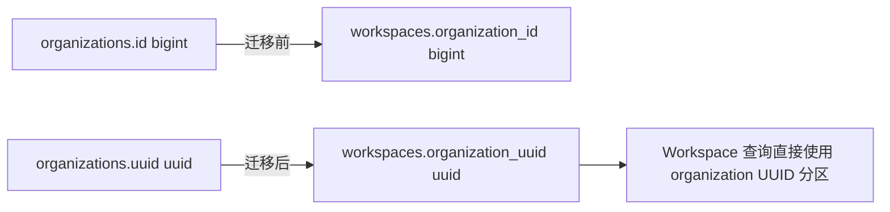

# 数据库稳定引用

## 标识符分工

多数核心业务表继续保留三类标识符：

- `id bigint generated always as identity` 是当前数据库内的内部主键，可用于事务内定位和锁；
- `uuid uuid` 是备份恢复、租户搬迁、跨库合并和部分数据导入后仍保持稳定的业务标识；
- `external_id text` 是 Anthropic API 或其他外部协议的兼容标识，不替代内部稳定 UUID。

`organizations` 是明确的例外：组织没有必须兼容的 Anthropic 前缀 ID，迁移
`00037_drop_organization_external_id.sql` 删除 `organizations.external_id`，此后组织在数据库、
HTTP 路由、Admin 响应、Platform session 和 webhook payload 中统一使用原始 UUID。迁移不修改
任何已有 `organizations.uuid`，因此已保存的组织引用保持稳定。`organizations.id` 继续作为
数据库内部 identity，但不会进入 Admin Organization 业务模型；Organization 查询直接按 UUID
定位。

跨表持久化引用应保存目标资源的 UUID。应用仍可在查询边界把 UUID 解析为当前数据库的 bigint identity，但不能把另一个表的 identity 作为需要跨数据库保持含义的权威引用。数据库不创建 PostgreSQL 外键，引用完整性由写入查询、migration 校验和集成测试维护。

## Workspace 的 Organization 引用

迁移 `00036_use_uuid_workspace_organization_reference.sql` 将：

```text
workspaces.organization_id bigint
```

替换为：

```text
workspaces.organization_uuid uuid
```

`workspaces.id` 仍是 bigint identity，`workspaces.uuid` 和 `workspaces.external_id` 的值保持不变。原有组织内名称唯一性 `(organization_id, name)` 相应改为 `(organization_uuid, name)`。

迁移前会把每条旧 `organization_id` 与 `organizations.id` 关联；存在无法解析的孤立引用时直接失败。表按最终字段顺序重建，复制时保留 workspace identity，并在重建后校准 identity sequence。回滚同样要求每个 `organization_uuid` 都能解析为当前库的 organization identity，不能把无法解析的引用静默写成空值。



## 应用查询边界

鉴权边界提供 organization identity 和 UUID，不再提供 organization external ID。其中 Organization Admin、Workspace Admin、Workspace API Key Admin 和 External Key 的 workspace 引用计数直接传递可信 `organization_uuid`，写入和租户过滤均使用：

```sql
workspaces.organization_uuid = CAST(:organization_uuid AS uuid)
```

这些路径不需要返回 organization 的其他字段，因此不得仅为 bigint identity 与 UUID 互转而 JOIN `organizations`。普通 workspace API key 鉴权仍需解析 organization identity 和 UUID；该查询保留 JOIN，并把 UUID 提供给后续 Workspace 查询。

仍需 organization 设置，或需要校验其他 bigint 租户引用的查询继续 JOIN `organizations`。删除 JOIN 的判断依据是查询语义，而不是仅依据 `workspaces` 已保存 UUID。

Console 和 Platform 的组织路由只接受 UUID，不再用 `org_...` 或任意文本值回退查询。
`GET /v1/organizations/me` 的 `id` 以及 webhook `data.organization_id` 都直接返回相同的
organization UUID。默认 seed 不再依赖 `org_default`：升级已有数据库时，通过
`workspace_default.organization_uuid` 找回原组织；全新数据库才创建组织，因此不会因为删除
external ID 而替换已有 UUID。

## 验收

- `workspaces` 不再包含 `organization_id`；
- `organization_uuid` 是第 4 列且 PostgreSQL 类型为 `uuid`；
- `organizations` 不再包含 `external_id`，已有 `uuid` 值不变；
- Admin Organization 模型和查询不读取或传递 `organizations.id`；
- Admin organization ID 和 webhook `organization_id` 返回原始 UUID；
- 默认 seed、Platform 登录、Console Workspace、Admin Workspace、API Key 鉴权、Filestore 和 Code Session 的租户关联继续通过；
- schema 仍不包含 PostgreSQL 外键；
- 全量 Go 测试、lint、死代码、重复代码和复杂度门禁通过。
