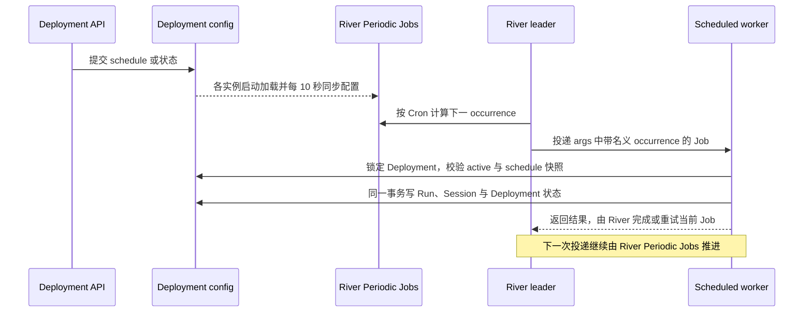

# Deployments API 合同

OMA 按照 Anthropic 文档中的规范 `/v1` 路径提供 Claude beta Deployments 和 Deployment Runs HTTP 接口：

- `POST /v1/deployments`
- `GET /v1/deployments`
- `GET|POST /v1/deployments/{deployment_id}`
- `POST /v1/deployments/{deployment_id}/archive`
- `POST /v1/deployments/{deployment_id}/pause`
- `POST /v1/deployments/{deployment_id}/unpause`
- `POST /v1/deployments/{deployment_id}/run`
- `GET /v1/deployment_runs`
- `GET /v1/deployment_runs/{deployment_run_id}`

API 密钥请求必须携带 `anthropic-version: 2023-06-01`，并在 `anthropic-beta` 中包含 `managed-agents-2026-04-01`。官方 SDK 额外发送的 `?beta=true` 查询参数仍然兼容，但不是必需项。供内部 Web 应用使用的平台会话请求可以继续通过 `?beta=true` 启用该接口。

## 请求与响应边界

- 新建 Deployment 的 ID 使用官方 `depl_` 前缀；Deployment Run 的 ID 使用 `drun_` 前缀。
- 响应中的 `description` 始终为字符串；未设置或清空后返回空字符串。
- 创建请求中的 `metadata`、`resources` 或 `vault_ids` 整体为 `null` 时返回拒绝。
- 字符串形式的 Agent 引用固定到最新版本；对象形式必须包含 `type: "agent"` 和 `id`，省略 `version` 时同样固定到最新版本。
- 元数据最多包含 16 个键；每个键最多 64 个字符，每个值最多 512 个字符。
- `user.message.content` 是至少包含一个受支持内容块的数组；`system.message` 只接受至少一个文本块，最多出现一次，并且必须作为最后一个事件紧跟在 `user.message` 之后；`user.define_outcome.rubric` 必须是文件或文本评分标准对象。
- GitHub 资源必须提供只写的 `authorization_token`；Memory Store 的 `instructions` 必须是最多 4096 个字符的字符串。
- File 资源响应会省略内部字段 `source`，并把 `mount_path` 统一映射到 `/uploads` 命名空间；请求未传 `mount_path` 时默认使用 `/uploads/<filename>`（文件名缺失时回退到 `file_id`），显式传入的挂载路径也映射为 `/uploads/<相对路径>`，与 Session 资源响应一致。
- 创建或更新 Deployment 时引用不存在的 File 返回 `404 not_found_error`。
- Deployment 更新请求中的元数据使用字符串（包括空字符串）新增或覆盖键，使用键级别的 `null` 删除键。
- Deployment 更新请求拒绝整个字段为 `metadata: null`；省略 `metadata` 时保留原值，传入 `{}` 时不做修改。
- 列表请求同时出现 `status` 和 `include_archived` 时返回拒绝，包括 `include_archived=false`。
- 已暂停的 Deployment 仍可手动运行。手动运行不会解除暂停；已归档的 Deployment 不能运行。

资源数量限制遵循官方的聚合合同，共享常量位于 `internal/sessioncontract`：

| 限制 | 常量 | Claude 合同 | OMA |
| --- | --- | ---: | ---: |
| 资源总数 | `MaxResources` | 500 | 500 |
| File 资源数量 | `MaxFileResources`（等于 `MaxResources`） | 没有单独的更低上限 | 最多 500 |

该限制作用于顶层混合类型的 `resources` 数组。OMA 不额外设置更低的 File 资源上限，Session 实体化也使用相同上限，因此包含 500 个 File 资源的 Deployment 在创建成功后仍然可以运行。File 资源的响应配置可以直接作为更新输入；替换 GitHub 资源时必须重新提供只写的 `authorization_token`。

更新请求会区分省略字段和显式清空：

| 字段 | 省略 | `null` | 空值形式 |
| --- | --- | --- | --- |
| `description` | 保留 | 清空 | `""` 清空 |
| `resources` | 保留 | 清空 | `[]` 清空 |
| `vault_ids` | 保留 | 清空 | `[]` 清空 |
| `metadata` | 保留 | 拒绝 | `{}` 不做修改 |
| `schedule` | 保留 | OMA 清空；官方未说明 | 不适用 |

公开合同没有说明的模糊行为保持不变，包括 `limit=0`、`schedule:null`、默认列表顺序，以及未记录的错误状态和幂等行为。

## Scheduled Deployment 执行

OMA 使用 River `v0.42.0` 持久执行 schedule。River 官方 migrator 在应用 PostgreSQL database 的 `public` schema 中创建并升级 `river_job`、`river_queue`、`river_leader`、`river_notification` 和 `river_migration`；应用表仍由 Goose 管理。`river_migration` 持久记录已应用版本，进程启动只检查并应用缺失版本，不会重建 River 表。`cmd/migrate up` 和开发环境自动迁移会使用同一个数据库连接配置，依次推进两套 migration。River 内部表的 DDL 不复制到应用 migration，避免升级 River 时出现两套 schema 定义。

Cron 统一由 `github.com/robfig/cron/v3` 解析和计算：

- Deployment schedule 使用五段 POSIX Cron 和必填的 IANA timezone；由 `robfig/cron/v3` 解析。DOW 接受 `0-7`，`7` 在解析前映射为 Sunday（`0`）。`L/W/#/?/@` 等扩展语法被拒绝；解析失败时返回参数错误。
- `upcoming_runs_at` 返回最多五个名义 UTC 时刻，不再使用 366 天扫描上限，因此闰日计划有效。
- spring-forward 不存在的墙上时刻不触发；fall-back 重复的墙上时刻触发两次。
- River Job 插入时把 Cron 名义 occurrence 写入 Job args；不增加私有 jitter 算法。

每个 active 且未归档、schedule 非空的 Deployment 对应一个 River Periodic Job，Periodic Job ID 使用 Deployment ID。Deployment 表是配置真源，只持久化 `schedule`，不保存应用自行推进的下一次游标或额外调度版本。Job 携带注册时的 schedule 快照；worker 读取 Deployment 后以当时的执行配置作为本次 occurrence 快照，最终事务锁行后确认 Deployment 仍为 active、schedule 和执行配置均未变化。

每个应用实例启动时从 Deployment 表加载 Periodic Jobs，并每 10 秒从数据库同步一次 registry。这样所有执行实例最终持有相同配置，进程重启不会丢失 schedule，pause/archive/清空 schedule 会移除 Periodic Job，unpause 或修改 schedule 会重新注册。同步完成前已经投递的 Job 会由 worker 根据当前状态和 schedule 快照跳过。单条确定性的存量 schedule 错误记录后跳过，数据库不可用等全局基础设施错误仍使启动失败。

River 的 leader election 保证只有 leader 根据 Cron 推进并投递 Periodic Job，应用不计算、持久化或插入“下一条 Job”。插入 Periodic Job 时把当时的 Cron occurrence 写入 Job args；worker 只用这个字段作为名义时刻。River 重试会改写 `river_job.scheduled_at` 为下次重试时间，不能当 occurrence 用。暂停或停机期间不补跑历史 occurrence，恢复注册后直接等待 Cron 的下一次。River 开源 Periodic Jobs 的调度状态主要在 leader 内存中，官方不承诺强持久性，leader 切换的极短窗口可能跳过一次 occurrence；需要严格不漏的调度时应采用 River Pro durable periodic jobs，而不是在应用层恢复一套游标链。

`deployment_runs.trigger_type` 区分 manual 与 schedule，`scheduled_at` 保存 schedule Run 的名义时刻；部分唯一索引 `(deployment_uuid, scheduled_at) WHERE trigger_type = 'schedule'` 是 River at-least-once 下的最终幂等边界。API 的 `trigger_context` 由这两列生成，数据库不重复保存同义 JSON。Run 只表示 Session 创建成功或失败，不跟踪 Session 后续执行。

失败行为按 Claude 公开合同处理：

- 根 Agent 归档会在同一数据库事务自动归档其 Deployment；根 Agent 在触发时已删除也会自动归档，且不生成 Run。
- Workspace 已归档时，最终事务拒绝创建 Session，worker 改为记录 `workspace_archived_error` 失败 Run 并自动暂停 Deployment。
- 其他引用或配置失败生成最终失败 Run。只有公开的 14 类 paused-reason error 会自动暂停；`session_rate_limited_error` 与 `session_creation_rejected_error` 不暂停，并继续下一个 occurrence。
- 数据库或进程级失败交给 River 重试；Run、Session 与 Deployment 状态在同一个 Yourbatis 事务中提交或回滚，当前 River Job 由 Worker 返回结果后交给 River 完成。occurrence 唯一索引保证业务事务提交后发生进程故障时，River 重试不会创建重复 Run。
- paused Deployment 仍允许 manual Run。
- active 或 paused Deployment 的 `upcoming_runs_at` 返回接下来最多五个名义时刻；只有 archived Deployment 返回空数组。

组织级最多保留 1,000 个未归档且 schedule 非空的 Deployment。创建以及从无 schedule 更新为有 schedule 时进行 best-effort 计数检查；并发请求可能短暂越过限制，不额外引入 organization 锁或配额计数器。

主要参考资料：

- <https://platform.claude.com/docs/en/api/beta/deployments>
- <https://platform.claude.com/docs/en/api/beta/deployment_runs>
- <https://platform.claude.com/docs/en/managed-agents/scheduled-deployments>
- <https://riverqueue.com/docs/periodic-jobs>
