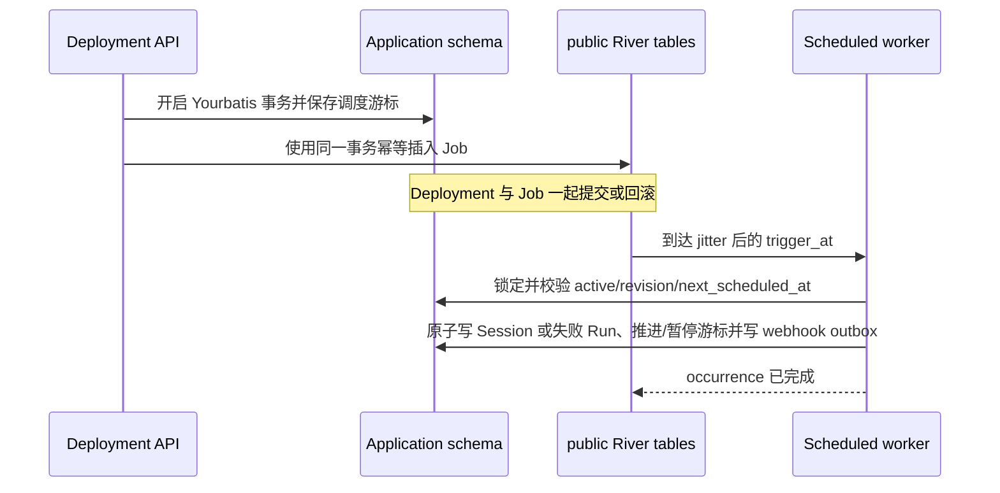

# Deployments API 合同

OMA 按照 Anthropic 文档中的规范 `/v1` 路径提供 Claude beta Deployments 和 Deployment Runs HTTP 接口：

- `POST /v1/deployments`
- `GET /v1/deployments`
- `GET|POST /v1/deployments/{deployment_id}`
- `POST /v1/deployments/{deployment_id}/archive`
- `POST /v1/deployments/{deployment_id}/pause`
- `POST /v1/deployments/{deployment_id}/unpause`
- `POST /v1/deployments/{deployment_id}/run`
- `GET /v1/deployment_runs`
- `GET /v1/deployment_runs/{deployment_run_id}`

API 密钥请求必须携带 `anthropic-version: 2023-06-01`，并在 `anthropic-beta` 中包含 `managed-agents-2026-04-01`。官方 SDK 额外发送的 `?beta=true` 查询参数仍然兼容，但不是必需项。供内部 Web 应用使用的平台会话请求可以继续通过 `?beta=true` 启用该接口。

## 请求与响应边界

- 新建 Deployment 的 ID 使用官方 `depl_` 前缀；Deployment Run 的 ID 使用 `drun_` 前缀。
- 响应中的 `description` 始终为字符串；未设置或清空后返回空字符串。
- 创建请求中的 `metadata`、`resources` 或 `vault_ids` 整体为 `null` 时返回拒绝。
- 字符串形式的 Agent 引用固定到最新版本；对象形式必须包含 `type: "agent"` 和 `id`，省略 `version` 时同样固定到最新版本。
- 元数据最多包含 16 个键；每个键最多 64 个字符，每个值最多 512 个字符。
- `user.message.content` 是至少包含一个受支持内容块的数组；`system.message` 只接受至少一个文本块，最多出现一次，并且必须作为最后一个事件紧跟在 `user.message` 之后；`user.define_outcome.rubric` 必须是文件或文本评分标准对象。
- GitHub 资源必须提供只写的 `authorization_token`；Memory Store 的 `instructions` 必须是最多 4096 个字符的字符串。
- File 资源响应会省略内部字段 `source`，并把 `mount_path` 统一映射到 `/uploads` 命名空间；请求未传 `mount_path` 时默认使用 `/uploads/<filename>`（文件名缺失时回退到 `file_id`），显式传入的挂载路径也映射为 `/uploads/<相对路径>`，与 Session 资源响应一致。
- 创建或更新 Deployment 时引用不存在的 File 返回 `404 not_found_error`。
- Deployment 更新请求中的元数据使用字符串（包括空字符串）新增或覆盖键，使用键级别的 `null` 删除键。
- Deployment 更新请求拒绝整个字段为 `metadata: null`；省略 `metadata` 时保留原值，传入 `{}` 时不做修改。
- 列表请求同时出现 `status` 和 `include_archived` 时返回拒绝，包括 `include_archived=false`。
- 已暂停的 Deployment 仍可手动运行。手动运行不会解除暂停；已归档的 Deployment 不能运行。

资源数量限制遵循官方的聚合合同，共享常量位于 `internal/sessioncontract`：

| 限制 | 常量 | Claude 合同 | OMA |
| --- | --- | ---: | ---: |
| 资源总数 | `MaxResources` | 500 | 500 |
| File 资源数量 | `MaxFileResources`（等于 `MaxResources`） | 没有单独的更低上限 | 最多 500 |

该限制作用于顶层混合类型的 `resources` 数组。OMA 不额外设置更低的 File 资源上限，Session 实体化也使用相同上限，因此包含 500 个 File 资源的 Deployment 在创建成功后仍然可以运行。File 资源的响应配置可以直接作为更新输入；替换 GitHub 资源时必须重新提供只写的 `authorization_token`。

更新请求会区分省略字段和显式清空：

| 字段 | 省略 | `null` | 空值形式 |
| --- | --- | --- | --- |
| `description` | 保留 | 清空 | `""` 清空 |
| `resources` | 保留 | 清空 | `[]` 清空 |
| `vault_ids` | 保留 | 清空 | `[]` 清空 |
| `metadata` | 保留 | 拒绝 | `{}` 不做修改 |
| `schedule` | 保留 | OMA 清空；官方未说明 | 不适用 |

公开合同没有说明的模糊行为保持不变，包括 `limit=0`、`schedule:null`、默认列表顺序，以及未记录的错误状态和幂等行为。

## Scheduled Deployment 执行

OMA 使用 River `v0.42.0` 持久执行 schedule。River 官方 migrator 在应用 PostgreSQL database 的 `public` schema 中创建并升级 `river_job`、`river_queue`、`river_leader`、`river_notification` 和 `river_migration`；应用表仍由 Goose 管理。`river_migration` 持久记录已应用版本，进程启动只检查并应用缺失版本，不会重建 River 表。`cmd/migrate up` 和开发环境自动迁移会使用同一个数据库连接配置，依次推进两套 migration。River 内部表的 DDL 不复制到应用 migration，避免升级 River 时出现两套 schema 定义。

Cron 统一由 `internal/deployments` 的 schedule 组件解析：

- 只接受五段 POSIX Cron 与有效 IANA timezone；拒绝 seconds/year、`L/W/#/?` 和 `@daily` shortcut。
- `upcoming_runs_at` 返回最多五个不含 jitter 的名义 UTC 时刻，不再使用 366 天扫描上限，因此闰日计划有效。
- spring-forward 不存在的墙上时刻不触发；fall-back 重复的墙上时刻触发两次。
- 实际 River Job 只正向延后。jitter 窗口为相邻名义 occurrence 间隔的 15%，下限 5 秒、上限 9 分钟；窗口内 offset 由 Deployment ID 与名义时刻的稳定哈希决定。这是 OMA 内部选择，不是 Claude 公开的哈希算法。

每个 Deployment 持久化 `schedule_revision` 和 `next_scheduled_at`。create、明确修改或清除 schedule、pause、unpause、archive 都使旧 revision 的 Job 失效；PATCH 未携带 schedule 时不写这三个调度字段。schedule revision 在锁定 Deployment 的事务内由数据库原子递增，避免锁外旧快照覆盖 worker 已推进的游标。unpause 只从当前时间之后的下一个 occurrence 恢复，不补暂停期间的触发。worker 成功提交一个 Run 后推进到下一个名义 occurrence。create、明确修改 schedule 和 unpause 通过 Yourbatis 公开的 `SQLTx()` 将同一个事务交给 River `InsertTx`，使游标与 Job 一起提交或回滚。worker 推进游标和启动回填后的 Job 仍由每 30 秒一次的 reconciliation 补齐，入队使用 `ByArgs` 保持幂等。启动回填或 reconciliation 遇到单条确定性的存量 schedule 解析错误时记录并跳过该 Deployment；数据库或 River 基础设施错误仍使启动失败。

`deployment_runs.trigger_type` 区分 manual 与 schedule，`scheduled_at` 保存 schedule Run 的名义时刻；部分唯一索引 `(deployment_uuid, scheduled_at) WHERE trigger_type = 'schedule'` 是 River at-least-once 下的最终幂等边界。API 的 `trigger_context` 由这两列生成，数据库不重复保存同义 JSON。Run 只表示 Session 创建成功或失败，不跟踪 Session 后续执行。

失败行为按 Claude 公开合同处理：

- 根 Agent 归档会在同一数据库事务自动归档其 Deployment 并写入 `deployment.archived` outbox；根 Agent 在触发时已删除也会自动归档并原子写入该事件，且不生成 Run。
- 其他引用或配置失败生成最终失败 Run。只有公开的 14 类 paused-reason error 会自动暂停；`session_rate_limited_error` 与 `session_creation_rejected_error` 不暂停，并继续下一个 occurrence。
- 数据库或进程级失败发生在最终 Run 提交之前时交给 River 重试；已提交成功或失败 Run 后不重试当前 occurrence。
- paused Deployment 仍允许 manual Run；manual Run 不发送 `deployment_run.*` webhook。

组织级最多保留 1,000 个未归档且 schedule 非空的 Deployment。创建以及从无 schedule 更新为有 schedule 时会先锁定 organization 并在事务内检查额度，避免并发越界。

Deployment 生命周期发送 `deployment.created/updated/paused/unpaused/archived`；scheduled Run 发送同一 Run ID 的 `deployment_run.started`，随后发送 `succeeded` 或 `failed`。自动暂停还发送以 Deployment ID 为资源 ID 的 `deployment.paused`。成功创建 Session 时继续发送现有 Session webhook。Scheduled Run 的这些 webhook delivery jobs 与 Run、Session、Deployment 状态和调度游标在同一个 Yourbatis 事务中提交；任一 outbox 写入失败都会回滚 occurrence 并交给 River 重试。

主要参考资料：

- <https://platform.claude.com/docs/en/api/beta/deployments>
- <https://platform.claude.com/docs/en/api/beta/deployment_runs>
- <https://platform.claude.com/docs/en/managed-agents/scheduled-deployments>
