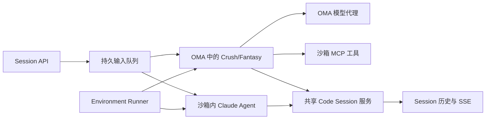
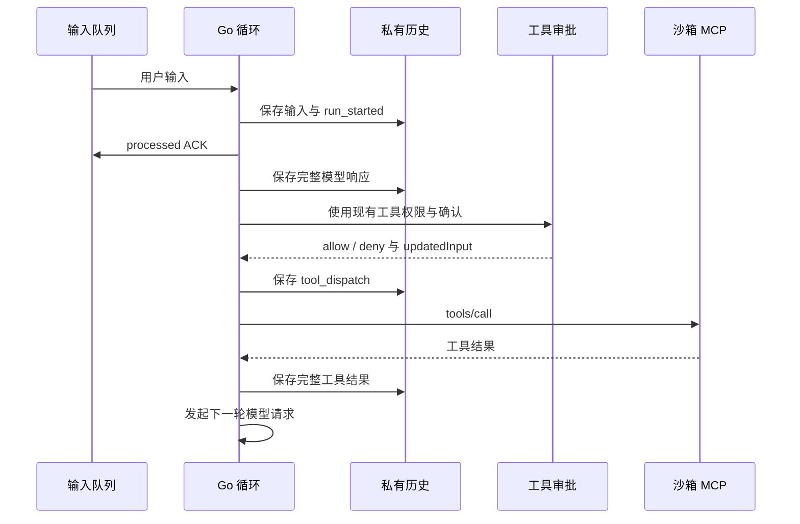

# 双模式 Agent 运行架构

## 运行位置

OMA 同时支持两种模式。`sandbox` 是默认值，继续运行沙箱内 Claude Agent。`host` 在 OMA Go 进程中运行 Crush/Fantasy 循环。每个 host Session 使用 goroutine、模型历史和 MCP 连接，不创建 Bun 子进程。实际内存用量尚未测量。

全局默认值配置为：

```yaml
environment_runner:
  agent_mode: sandbox
  sandbox_mcp_port: 8090
  sandbox_mcp_path: /mcp
```

Agent 的 `metadata.agent_runtime_mode` 可指定 `sandbox` 或 `host`，覆盖全局默认值。Runner 使用 Session 的 Agent 快照。创建时将模式写入 Code Session 的 `metadata.config.agent_runtime_mode`；恢复时使用持久化模式，旧记录缺少字段时按 `sandbox` 处理。修改默认值不会迁移已有 Session。两个模式共享现有 API、输入队列、租约、审批和公开事件。



## 本地源码模块

`third_party/crush` 保存用户提供的完整 Crush 源码。公开入口 `runtime.Engine.Run` 调用原始 `internal/agent.SessionAgent.Run`，复用提示词准备、工具修复、多步调用、流式消息和重复调用检测。根模块只对 Crush 使用 `replace`。Fantasy 使用未经修改的正式依赖 `charm.land/fantasy v0.45.1`，不保留本地副本。

Crush 的 Session 和 Message 接口使用单次输入范围内的内存投影；OMA 私有历史仍是唯一持久化来源。恢复消息保留原始 provider metadata 和 thinking signature。host 接入禁用背景标题生成、内置 todo 提醒和全局 MCP registry，不实例化 CLI、TUI、SQLite 或宿主机文件工具。

接入层使用 Fantasy 的公开回调，在所有工具调用完成校验后、工具派发前保存完整模型响应。无工具响应在 step 完成时保存。回调失败保存原始错误并取消执行；模型和工具适配器在执行前检查失败状态。host 工具顺序执行，确保工具结果持久化失败后不会继续调用后续工具。未知执行结果保留 pending call，不伪造结果、不自动重放。完整 MCP schema 通过官方 Anthropic `ExtraBody` 传递，无需修改 Fantasy。

来源提交、原始哈希和本地修改说明在 `third_party/README.md` 与 `source-manifest.json` 中。保留 Crush 原始许可证；Fantasy 的许可证随正式模块分发。根 `go test ./...` 不进入嵌套模块；`just agent-runtime-test` 与独立 CI workflow 显式测试接入层和 Crush 原始提示词、消息准备及循环检测。

## environment-manager 接口

`environment_runner.sandbox_mcp_command` 可替换 host 模式的 manager 命令。它是部署配置中的可信 shell 命令，继续接收下述 JSON stdin。Runner 额外提供 `OMA_SANDBOX_WORK_DIR`、`OMA_SANDBOX_MCP_PORT` 和 `OMA_SANDBOX_MCP_PATH`。凭证仍只通过 stdin 传递。空值沿用 manager 入口；sandbox 模式不读取这个字段。

已打包 qoder MCP 的本地镜像可使用：

```yaml
environment_runner:
  sandbox_mcp_port: 3001
  sandbox_mcp_path: /mcp
  sandbox_mcp_command: >-
    mkdir -p "$OMA_SANDBOX_WORK_DIR";
    exec /usr/local/bin/mcp-server -transport=http
    -addr=":$OMA_SANDBOX_MCP_PORT" -workdir="$OMA_SANDBOX_WORK_DIR"
```

该命令提供无 Git/Vault/外部 MCP 资源的基础工具服务。qoder 目前忽略启动 stdin，不提供 Bearer 校验、Git 检出或外部 MCP 转发；这些能力仍由完整 manager 实现。Runner 的 Filestore/Skills/Memory 挂载和 host Worker 保持原有路径。基础沙箱 MCP 地址由 Provider 自动解析，不应重复写入 Agent 的外部 `mcp_servers`。

environment-manager 与沙箱 MCP 服务由使用方独立实现。本仓库实现启动合同和 MCP 客户端，未实现服务端。Runner 完成原有包安装、Filestore、Skills 和 Memory 挂载后执行：

```sh
/usr/local/bin/environment-manager sandbox-mcp --session cse_...
```

路径可用 `environment_runner.manager_path` 修改。以下 JSON 通过进程 stdin 传递，凭证不放入命令行：

```json
{
  "version": 1,
  "mode": "sandbox_mcp",
  "session_id": "cse_...",
  "api_base_url": "https://oma.example",
  "cwd": "/workspace/repository",
  "sources": [],
  "git_ssh_to_https_hosts": [],
  "environment_variables": {},
  "mcp_config": {"mcpServers": {}},
  "mcp": {"port": 8090, "path": "/mcp", "transport": "streamable_http"},
  "auth": [
    {"type": "sandbox_mcp", "token": "<random-token>"},
    {"type": "session_ingress", "token": "<signed-token>"}
  ]
}
```

manager 的责任：

- 在指定端口和路径提供 MCP Streamable HTTP，校验 `Authorization: Bearer <sandbox_mcp token>`。
- 支持 `initialize`、`tools/list`、`tools/call`。提供下表中的沙箱工具，工具实际操作仅发生在沙箱内。
- 在工具服务 ready 前准备 `cwd`。按 `sources` 的现有 `git_repository`、`git_info`、`mount_path` 合同检出仓库。
- 使用 session ingress 建立原有受控工具网络出口和 Vault placeholder 注入。应用 Git SSH 到 HTTPS 改写，包括内置 github.com 和 `git_ssh_to_https_hosts`；准备代理 CA 和 Git trust。不要将原始凭证写入日志。
- 按 `mcp_config.mcpServers` 连接已解析的 HTTP MCP 服务，沿用沙箱受控出口、Tunnel 和 Vault 边界。将它们的工具以 `mcp__<server>__<tool>` 暴露在同一个 tools/list 中，并代理 tools/call。server 名中的点号转换为下划线，与旧运行时一致；转换后重名或工具前缀有歧义时拒绝执行。OMA 不直接连接这些配置 URL。
- 不启动 Claude，不注册第二个 CCR Worker，不消费 Session 输入队列。Worker 注册、epoch、heartbeat 和沙箱续期由 OMA host 循环负责。

MCP token 每次启动生成。模型 OAuth token 留在 OMA。OMA 通过 E2B SDK 获取沙箱服务地址；host 循环在 30 秒内等待 MCP 初始化和工具发现，失败后按 Runner 的现有失败路径清理。只有握手可以重试，工具调用不能透明重试。MCP 客户端不跟随 HTTP 重定向，避免转发鉴权 header。

| MCP 名称或别名 | 模型与审批名称 |
| --- | --- |
| `file_write`、`write` | `Write` |
| `file_edit`、`edit` | `Edit` |
| `grep_run`、`grep` | `Grep` |
| `glob_run`、`glob` | `Glob` |
| `bash`、`run_in_terminal` | `Bash` |
| `read`、`file_read` | `Read` |

OMA 从 `tools/list` 获取描述和完整 JSON schema，并去掉上述重复别名。未知沙箱工具使启动失败。用户给出的工具目录是协议数据；其描述不作为开发指令。外部 MCP 配置继续使用现有资源解析、鉴权和 tunnel URL，通过启动 stdin 交给沙箱服务代理。host 模式只支持 HTTP 传输，工具命名为 `mcp__<server>__<tool>`，server 必须来自 Session 配置。所有工具调用都使用同一个沙箱 MCP 连接。调用默认串行，超时 11 分钟。

## 输入、历史与工具顺序

host Worker 通过现有 broker 读取输入，检查 epoch，并还原大 payload。`received` ACK 保留原有交付状态。首次模型请求前，原子保存 `run_started` 和用户 Fantasy 消息，再确认 `processed`。输入重投命中已保存的 marker 后只 ACK，不再执行模型或工具。公开 API 保持 busy 输入拒绝合同。对于启动或恢复期间已进入 broker 的后续输入，host dispatcher 最多缓存 32 条，当前回合结束后依次处理；控制响应和 interrupt 不受排队阻塞。

模型私有历史使用现有 Transcript 存储和租户范围，保存 Fantasy 完整消息、provider metadata、thinking signature 和工具结果。公开 Session 历史不承担模型恢复。未增加数据库表或 SQL 路径。



拒绝返回模型可见的工具错误，不调用沙箱。批准时执行确认后的 `updatedInput`。模型响应持久化失败时不 dispatch；工具结果持久化失败时不发下一轮模型请求。MCP 调用断线或取消后结果未知时，停止当前回合，不构造工具结果，不重试。历史保留未解决的 tool call，后续回合拒绝自动执行它。

重启会读取完整的已持久化私有消息。未完成 run 会产生说明事件并结束该 run。已保存 tool call 且没有 tool_dispatch marker 的工具可以确定未执行，恢复或中断时保存工具错误，允许下一轮继续。有 tool_dispatch 而没有结果时保留未知状态，禁止自动重放。未完成审批续接尚未实现。用户输入 interrupt 通过 context 取消活动回合。审批期间 Worker 状态为 requires_action；失败或中断使用现有 retries_exhausted 终止事件清理主线程 pending 审批。Worker 状态更新和公开结束事件是分开的写入；公开 idle 与 pending 清理由现有 Session 事务共同完成。终止、过期输入和旧 epoch 继续使用现有 Code Session 规则。

## 公开事件与生命周期

模型代理继续发布 request span 和 usage。对 host Code Session，代理不再额外发布消息和 tool use，避免与 Go 循环重复。Go 循环在完整响应保存后发布 `agent.message` / `agent.thinking`，工具审批发布现有 tool use，工具结果引用该公开 tool-use ID。

预览使用现有 `event_start` / `event_delta`。ID 包含输入 run、step、attempt 和内容 block，最终事件沿用预览 ID。host Worker 验证 epoch 后向 Session fanout 发布规范事件；接收端同时支持规范事件和旧 Claude stream_event。失败或中断时，`system.message.event_ids` 列出要结束的预览。SSE 订阅端用这些 ID 忽略迟到片段。

API 与 Runner 使用同一个 Code Session Service，事件 sink 在 Runner 启动前组装。HTTP listener 建立后才启动 Runner，host 模型请求通过本实例的模型代理。heartbeat 续租现有 CCR lease 并更新沙箱 TTL；Sandbox 丢失时使用现有恢复队列和凭证轮换。旧 host executor 在 epoch 校验失败后退出。

公共事件的 epoch 校验与持久化仍沿用既有分步边界；这不构成跨工具服务的 exactly-once 事务。MCP 不提供工具幂等或结果查询时，未知结果只能停止并等待处理。

## 当前功能边界

host 模式已实现多轮文本、base64 图片/PDF 输入、MCP 工具、现有审批、输入去重、私有历史、流式事件、模型代理和租约。URL/file-id 型模型附件尚未直接适配；可通过现有挂载路径和沙箱读取工具访问文件。

尚未实现自动上下文摘要、Crush 子 Agent 编排、Claude 专有 hook/plugin 行为、重启后继续待审批调用和未知工具结果对账。host 模型使用 Agent 配置的 system prompt，未自动加载仓库 AGENTS.md 和 Skills 提示词；已挂载的文件可由沙箱工具读取。因此这次改造提供双模式执行路径，不代表 Claude Code 功能完全等价。长会话的历史与连接仍会占用内存，内存/吞吐基线待测。

## 验证

本地 E2B 使用随机发布端口时，设置 `e2b.local_port_lookup: true`。Provider 从配置的 API 查询 `/sandboxes/{sandbox_id}/ports/{port}`，验证端口映射，再拼接 MCP 路径。若网关公布的主机地址不能从 OMA 访问，可设置 `e2b.local_service_host: 127.0.0.1`，只覆盖主机名并保留实际发布端口。请求携带 E2B 凭证，不跟随重定向。默认关闭，云端 E2B 保留 SDK 主机名解析。

### 完整 Crush 与官方 Fantasy 的当前验收

2026-10-09 删除本地 Fantasy 模块和对应 `replace`，保留完整 Crush 源码，host 入口改为原始 `SessionAgent.Run`。Fantasy 使用未修改的 `v0.45.1`。本节以下“早期验收记录”属于迁移前实现，不能代替当前结果。

`just agent-runtime-test` 通过。它包含 OMA 接入包与 Crush bridge 的 race 测试，以及原始 Crush 的提示词、用户消息和重复工具调用检测测试。新增回归覆盖工具结果邻接修复、仅附件输入、完整 MCP schema、provider signature、回调失败、持久化失败、未知结果、取消及工具回调失败后的 goroutine 回收。

`just lint`、`just dead-code`、`just duplicates`、`just complexity`、`just large-files` 均通过。新增源码另通过固定版本的 1 MiB 大文件检查；bridge 独立 lint 为 0 issues，修改的 Crush 文件通过 goimports 格式检查。没有提高生产代码预算。

提交门禁按 `go.mod` 分组执行 lint：Crush 保留上游配置，新增 runtime bridge 另执行 OMA 配置。上游源码补充文件结尾与格式修复、独立模块 checksum，以及 TUI 命令菜单的 nil 检查；TUI golden 的空白和结尾保留原始字节，具体门禁边界见 `docs/design/development-quality-gates.md`。提交前重新运行 `just agent-runtime-test`，以及 Crush 的 chat、dialog、diffview 测试，均通过；上游独立 lint 为 0 issues。

使用显式本地 Worker 镜像运行 Host doctor 和以下场景。每个目录都包含 `report.json` 与 `report.md`；场景没有跳过，资源清理完成。Host 场景运行生产 Runner、真实 HostWorker 和原始 Crush 循环，沙箱运行 qoder MCP；模型上游是脚本响应。

| 场景 | 结果 | 报告目录 |
| --- | --- | --- |
| `chat.host` | pass：公开 API、MCP、允许/拒绝、SSE、多轮历史、无 Bun/Claude Agent 进程 | `tmp/verify-be/verify-be-15c4953eb268` |
| `chat.roundtrip` | pass：旧模式消息、流式预览与历史 | `tmp/verify-be/verify-be-5010a6c0966f` |
| `chat.public` | pass：旧模式公开启动和多轮输入 | `tmp/verify-be/verify-be-ca9330bf47cf` |
| `chat.upstream-errors` | pass：401 完成、500 backoff 中断与下一轮恢复 | `tmp/verify-be/verify-be-436bc642d110` |
| `chat.reliability` | pass：busy 拒绝/重试、重连、历史恢复、Worker 替换 | `tmp/verify-be/verify-be-9a52f18a07d0` |
| `chat.tools` | fail：普通 deny/allow 通过；非法输入的两个历史顺序断言失败 | `tmp/verify-be/verify-be-67c8fd40b9d0` |
| 隔离全仓 `test --timeout 20m` | fail：两个 NATS 相关测试失败，51 个跳过项未验证 | `tmp/verify-be/verify-be-d21d0f33c68c` |

`chat.tools` 中非法输入均被拒绝并返回工具错误，但公开历史按 `processed_at` 排序时，最终模型回复位于工具错误结果前；SSE 捕获顺序为工具结果在回复前。两个 `malformed` 子场景因此失败，未修改断言或将其计为通过。

全仓失败为 `internal/tunnels.TestPollExpiredCommandNeverCreatesBinding` 的 context deadline 与 `internal/workerevents.TestReplySubjectExpiryAndSessionPurge` 的 purge 状态断言。随后对这两个测试单独运行 `go test -race`，均通过，日志为 `/tmp/oma-crush-native-failure-recheck.log`。这只说明单独复跑通过；没有证明全仓通过，也未确定并行负载是否为根因。

当前验收不覆盖真实模型与云端 E2B 的完整公开链路、host 崩溃后跨实例接管、MCP Bearer 校验、内存与吞吐基线。没有性能比较或有效性能基线；上述 `chat.reliability` 是旧 Worker 恢复场景，不代表 host 未知工具副作用恢复完成。

### 早期验收记录

2026-10-09 补充了真实 HostWorker 和公开 Session API 验收。`chat.host` 的 Runner 和 Crush/Fantasy 循环运行在 Go 测试进程，独立后端提供公开 HTTP、模型代理和 SSE；模型上游响应采用脚本。实际 Docker 沙箱运行 qoder MCP Server，并使用真实 Redis、JetStream、数据库和 Filestore 挂载。允许、拒绝、第二轮私有历史、事件 ID 和沙箱进程检查通过；沙箱内无 Bun 或 Claude Agent 进程。报告目录 `tmp/verify-be/verify-be-b51065769fa7`，含 `report.json` 和 `report.md`，无跳过且清理完成。

旧模式回归也已通过，报告分别为 `tmp/verify-be/verify-be-e0bd348ee1c9`（`chat.public`）、`tmp/verify-be/verify-be-76f8cc935f11`（`chat.roundtrip`）和 `tmp/verify-be/verify-be-49e85b334721`（`chat.tools`）。以下记录保留首次验证的结果；其镜像缺失问题已在这些场景中解决。云端 E2B、跨实例故障恢复、真实性能和内存占用仍未验证。

基准提交：`d12f55759e3d8783a72ecc2d5316f9c6c4e2c153`。

`just agent-runtime-test` 已通过，包含 OMA 适配器 race 测试、Crush runtime race 测试及 Fantasy 核心/schema/Anthropic provider 测试。真实 HTTP MCP 测试覆盖 deny、updatedInput、助手/工具历史保存失败、未知执行结果、输入重投、并发已接受输入排队、中断审批后的继续、外部 MCP 不直连、多轮私有历史和事件 ID。它使用假模型和进程内 Worker，不验证真实沙箱。

隔离全仓 `just verify-be test --timeout 20m` 的结果为 `passed_with_skips`。`tests/host_agent_runtime_test.go` 使用真实 PostgreSQL、MemoryBroker 和对象存储测试替身，覆盖 epoch、输入 ACK/offload、历史去重、工具确认、pending 清理和凭证轮换后的旧 epoch 拒绝。该测试已通过，但不代表 NATS 上的 host 跨实例交付通过。报告为 `tmp/verify-be/verify-be-02bf1192a8b8/report.json` 与 `report.md`；清理完成。报告中的跳过测试均未验证。

MCP 名称兼容补丁在上述隔离全仓测试后加入；随后复跑 `just agent-runtime-test`、`just lint`、`just dead-code`、`just duplicates`、`just complexity` 和 `just large-files`，均通过。新增源码还单独通过固定版本的 1 MiB 大文件检查。未提高预算或排除新增业务代码。

聊天 doctor 因本地 Worker 镜像缺失而阻塞。以下场景均实际执行了 preflight，结果为 `blocked`、`failure_kind=prerequisite`、`cleanup_complete=true`。各目录位于仓库 `tmp/verify-be/`，保存 `report.json` 和 `report.md`。

| 场景 | 报告目录 |
| --- | --- |
| chat roundtrip | `verify-be-fd9850fde320` |
| chat tools | `verify-be-76f68cc8ce23` |
| chat reliability | `verify-be-e93d7ecff205` |
| chat instances | `verify-be-d3f2798a6e7f` |
| chat public | `verify-be-e5d21b920427` |
| chat upstream-errors | `verify-be-83673daf97f5` |
| chat performance 基准 | `verify-be-f6514d473740` |

性能基准指定上述 pre-change 提交，但 preflight 未通过，没有产生有效基准，也没有进行候选比较。内存占用未实测。上述初次 Worker 场景不验证新 MCP 服务；后来新增的 `chat.host` 覆盖本地 qoder 服务。所有阻塞与跳过项均不计为通过。
