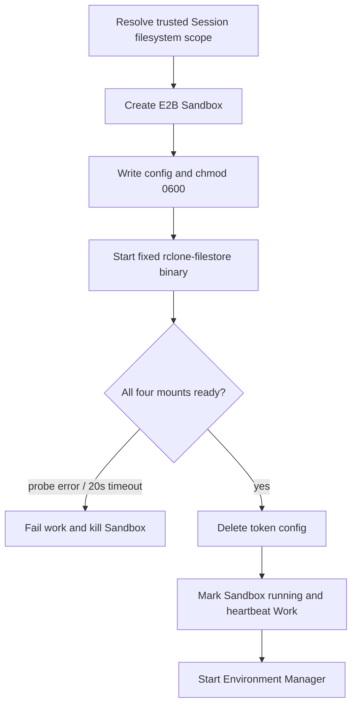

# E2B Sandbox 镜像合同

## 范围

本文定义 Open Managed Agents 的 Cloud Session 启动代码可以依赖的 E2B 镜像能力。镜像构建位于部署侧；本仓库的 Runner 只校验和消费合同，不通过配置猜测二进制位置，也不在 Sandbox 启动时下载安装运行依赖。

## 必需二进制与权限

镜像必须满足：

- `/opt/rclone/rclone-filestore` 存在、是 Linux 可执行文件，并支持 `multimount --config <path>`。
- Sandbox 具有 rclone-filestore 创建四个 FUSE mount 所需的设备、capability 和 mount namespace 权限。
- `/usr/local/bin/environment-manager` 与 `/opt/claude-code/bin/claude` 默认可执行；这两个路径仍可通过既有 Environment Runner 配置覆盖。
- 运行用户可以创建 `/mnt/user-data/outputs`、`/mnt/session/uploads`、`/mnt/transcripts`、`/mnt/user-data/tool_results` 的挂载点，并能写入 `/tmp`。

`rclone-filestore` 路径固定为 `/opt/rclone/rclone-filestore`，不提供 `rclone_filestore_path` 配置。镜像若缺失该文件或没有执行权限，后台命令启动失败或 ready marker 在 `20s` 内不会出现；Runner 会把 Sandbox 标记为失败并 Kill，不会启动 Environment Manager。

## Runner 创建的临时状态

镜像不应预置以下运行时文件：

| 路径 | 所有者 | 生命周期 |
| --- | --- | --- |
| `/tmp/rclone-mount-config.json` | Runner/rclone | E2B Files API 写入后设为 `0600`，ready 后删除 |
| `/tmp/rclone-mounts/ready` | rclone-filestore | 四个 mount 全部 ready 后创建 |

Runner 每次创建新的 Sandbox，通过 E2B 后台进程 API 启动 rclone，不在 Sandbox 中写 PID 或 exit marker。Runner 只通过 E2B Files API 每 `200ms` 探测 ready marker，最长 `20s`，不探测 rclone PID。`/tmp/rclone-mounts/ready` 必须只表示四个固定 mount 均已可用；部分就绪不能创建 marker。

## 固定文件系统视图

ready 后镜像内必须呈现：

```text
/mnt/user-data/outputs       # read-write
/mnt/session/uploads         # readonly
/mnt/transcripts             # readonly
/mnt/user-data/tool_results  # readonly
```

File resource 不新增独立 FUSE mount，也不创建逐文件软链接。`mount_path` 始终解释为 `/uploads` namespace 下的路径；resource 写事务已经在当前 Session 的 `filesystem_id` 下插入借用 Files 对象的数据库 entry，rclone 只负责把这个权威 namespace 整体只读挂载到 `/mnt/session/uploads`。例如 `/uploads/workspace/data.csv` 在 Sandbox 中通过 `/mnt/session/uploads/workspace/data.csv` 访问。镜像、Runner 和 Environment Manager 都不负责下载、复制、调和或投影单个 File resource，Runner 也不再把 `type=file` resource 转发给 Environment Manager。

同一 `filesystem_id` 的 namespace 在 mount 存活期间继续由数据库维护。运行中增删 File resource 不重建 FUSE mount；现有 Sandbox 在 `/uploads` 的 `1s` metadata cache 刷新后读取到新的 namespace 状态。

## 启动顺序合同



File resource 与 `/uploads` entry 的一致性由 resource 写事务负责，Runner 不在启动时修复 namespace。Environment Manager 不能先于 rclone ready 启动；任何身份解析、启动、ready 或配置删除错误都进入统一失败清理。

## 镜像验收

仓库中的真实 E2E 固定使用
`registry.gz.cvte.cn/oma/managed-agent-sandbox:latest`，避免测试配置静默回退到不含
`rclone-filestore` 的通用 template。部署前仍应将通过验收的镜像 digest 固化到发布系统，
不能把可变的 `latest` 当作生产可复现性边界。

发布新的 E2B template 前至少验证：

1. `test -x /opt/rclone/rclone-filestore` 成功。
2. 用临时测试 filesystem 启动固定 multimount，ready marker 在超时内出现。
3. `/mnt/user-data/outputs` 可写，另外三个 destination 拒绝写入。
4. 只通过 Files API 上传对象并给 Session 添加 File resource，不在测试侧直接写 Filestore；确认 resource 写入已创建 `/uploads/workspace/data.csv` 的数据库引用，启动后可通过 `/mnt/session/uploads/workspace/data.csv` 读取且写入失败。
5. ready 后 `/tmp/rclone-mount-config.json` 不存在，日志和进程命令行不包含 Filestore Token。
6. ready 探测失败或 `20s` 内未出现 marker 均不会启动 Environment Manager，并会终止 Sandbox。

Token 当前固定一小时有效且不刷新；长生命周期 Sandbox 的续签不属于此镜像合同。
