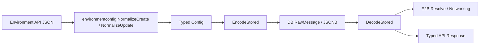

# Environment Config Schema Boundary

Environment Config 在 HTTP 与 Runtime 层使用 `internal/environmentconfig.Config` 强类型模型。PostgreSQL 继续以 JSONB 保存配置，`internal/db.Environment.Config` 的 `json.RawMessage` 只承担持久化表示，不作为业务 schema。

当前强类型模型覆盖既有 `type`、`packages`、`networking`、`init_script` 和 `environment` 字段。API 创建与更新仍保持原有默认值、整体/局部更新和错误文案；Runtime 不再针对 JSON 临时声明匿名结构。

`DecodeStored` 允许未知字段，以便已保存的 JSONB 在 schema 增加字段时仍可读取。API 请求的可接受字段与严格程度由 Environment API 合同控制；后续 Runtime Version 变更应直接演进这个模块，而不是在 Handler、Runner 或 Runtime 中增加第二套解析逻辑。
