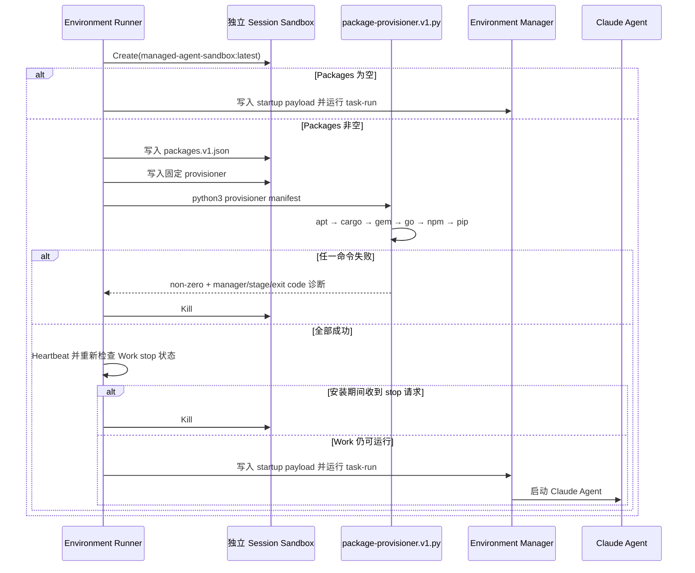

# Environment Packages 注入 Session Sandbox

## 1. 目标与边界

Cloud Environment 继续保存并回显 Claude-compatible `config.packages`，只支持 `apt`、`cargo`、`gem`、`go`、`npm`、`pip` 六个数组。OMA 不增加 Build、Artifact、Runtime Version、Secret、registry 或 init-script API；Packages 只在每个新 Session Sandbox 中安装一次。

新 Environment 默认直接使用以下本地 Docker 镜像标签，保持 e2b-local 原有的 Template 直传逻辑：

```text
managed-agent-sandbox:latest
```

部署时先拉取 `ghcr.io/superduck-ai/managed-agent-sandbox@sha256:23c4bb56a02141d3a6997c2236c8e2f43c6174c79f6f86ef72b9c8fbd3142877`，再将其标记为 `managed-agent-sandbox:latest`。OMA 不增加别名解析层，`E2B_TEMPLATE` 的值仍原样传给 e2b-local；显式的 `:latest` 是 e2b-local 对本地 Docker image reference 的格式要求。该变量仍可供有意测试其他镜像时覆盖。migration `00018` 将数据库列对新记录的默认值更新为该标签，不改写现有 Environment；Environment API 创建路径使用同一个应用默认值。

## 2. 启动顺序



空 Packages 不写 manifest/provisioner，也不运行安装命令，因此保持原启动路径。Environment 更新不会进入已创建 Sandbox；runner 在创建新 Sandbox 时读取 Environment 当前配置，所以只影响之后创建的 Sandbox。每个 Session 仍通过一次独立的 E2B `Create` 获得隔离文件系统。Packages 安装结束后，runner 必须检查 heartbeat 的 `lease_extended`；如果安装期间 work 已进入 `stopping` 或 `stopped`，则终止刚创建的 Sandbox，并且不启动 Environment Manager。

## 3. Manifest 与执行安全

OMA 写入 `/tmp/open-managed-agents/packages.v1.json`，结构为：

```json
{
  "version": 1,
  "packages": {
    "type": "packages",
    "apt": ["ffmpeg"],
    "cargo": ["ripgrep@14.1.1"],
    "gem": ["rake:13.2.1"],
    "go": ["golang.org/x/tools/cmd/goimports@v0.35.0"],
    "npm": ["typescript@5.9.3"],
    "pip": ["numpy==2.3.5"]
  }
}
```

固定 provisioner 是随 OMA 二进制 `go:embed` 的版本控制资产。runner 的 shell 命令只包含两个固定路径，不包含任何 package spec。provisioner 用 Python `subprocess.run(arguments, check=True, shell=False)` 调用包管理器，spec 只作为参数数组元素传递；scoped npm package、PEP 508 marker、extras、公开 URL、空格和 shell 元字符不会被解释成 shell 语法。由于 private registry credential 不属于本期范围，API 和 manifest 构建都会在写入 Sandbox 前拒绝 authority 中包含 userinfo 的 URL，且错误信息不会回显原始 spec。

安装命令固定为：

| 顺序 | Manager | 参数数组前缀 |
|---:|---|---|
| 1 | apt | `apt-get update`，再 `apt-get install -y -- ...` |
| 2 | cargo | `cargo install ...` |
| 3 | gem | `gem install ...` |
| 4 | go | 每个 spec 单独执行 `go install <spec>`，避免不同 module/version 的合法条目被合并后失败 |
| 5 | npm | `npm install --global -- ...` |
| 6 | pip | `pip install ...` |

空 manager 数组跳过；首个非零退出立即停止后续 manager。安装命令最长使用 `E2B_SANDBOX_TIMEOUT`，普通 Environment Manager 启动命令继续使用 `E2B_REQUEST_TIMEOUT`。

对于已有的 limited networking 配置，`allow_package_managers: true` 继续只放行受信任的 registry/CDN host。Cargo 除 `crates.io` 与 `index.crates.io` 外还需要 `static.crates.io` 下载 crate archive，因此该静态 CDN 包含在 Package Manager 白名单中；其他 limited-network Packages 策略仍不在本次设计范围内。

## 4. 失败状态与诊断

manifest 写入、provisioner 写入或安装的任一步失败都会调用统一的 `failCreatedSandbox`：

- `environment_sandboxes.state` 变为 `failed`；
- `last_error` 保存带阶段上下文的错误；
- Environment Work 被强制停止；
- 已创建的 provider Sandbox 在独立的两分钟清理 context 中被终止；
- Environment Manager startup payload 尚未写入，Claude Agent 不会启动。

provisioner 在失败时只报告 manager、阶段和非零退出码，不回显包含 package spec 的 argv，也不转发 package manager 的 stdout/stderr，避免 URL 等 spec 中的数据进入 `last_error`。部分安装不做容器内卸载回滚，因为整个 Sandbox 会被丢弃。

## 5. 验收路径

- `internal/environments/package_provisioner_test.go`：manifest 版本、空配置跳过、特殊字符保真、六类 manager 顺序与首错停止；
- `tests/environments_api_test.go`：官方 Go SDK 强类型创建、更新、读取与列出 Packages 配置；
- `tests/environments_runner_cloud_test.go`：manifest/provisioner/startup 写入顺序、固定命令不含 spec、失败 kill 且不启动 manager；
- `tests/environments_packages_lifecycle_e2e_test.go`（`e2b_integration` 与 `e2e` build tag）：在旧 Session Sandbox 安装 `six==1.16.0` 后把 Environment 更新为 `six==1.17.0`，确认旧 Sandbox 不变而新 Sandbox 使用更新后的配置，并用同一路径的不同文件内容验证两个 Session 文件系统相互隔离；
- `tests/environments_full_e2b_bridge_integration_test.go`（`e2b_integration` 与 `e2e` build tag）：通过官方 Go SDK 创建含六类 Packages 的 Environment，使用 `managed-agent-sandbox:latest` 标签，真实安装并 probe `ffmpeg`、`rg`、`rake`、来自不同 module/version 的 `goimports` 与 `addlicense`、`tsc`、`numpy`，确认 Environment Manager 已运行，并让 Claude Agent 调用已安装的 `rg` 写出版本证明。

本变更不修改公开 API、Packages schema、权限模型或数据库业务数据模型；migration 仅同步新记录的默认模板值。
