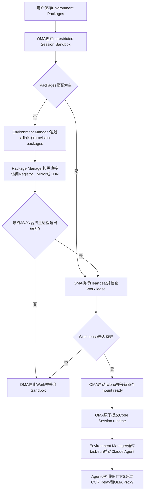
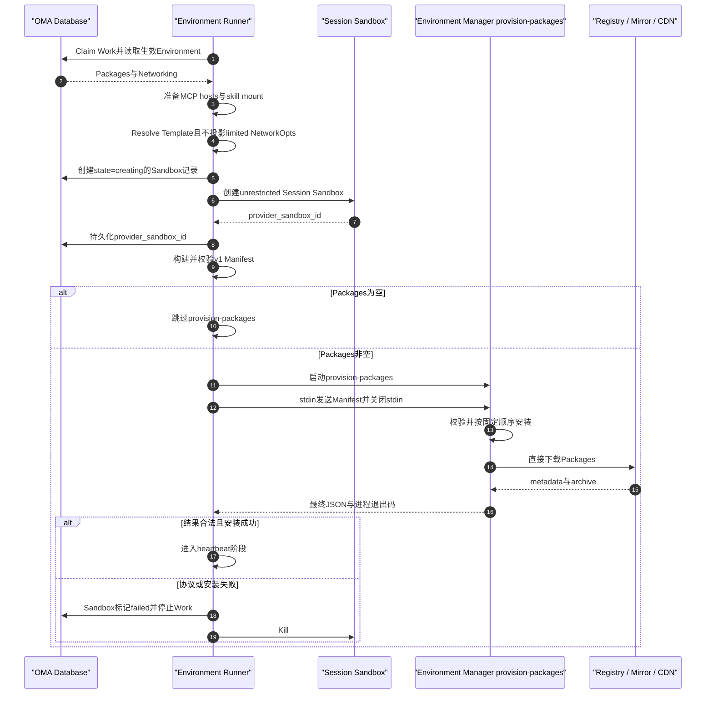
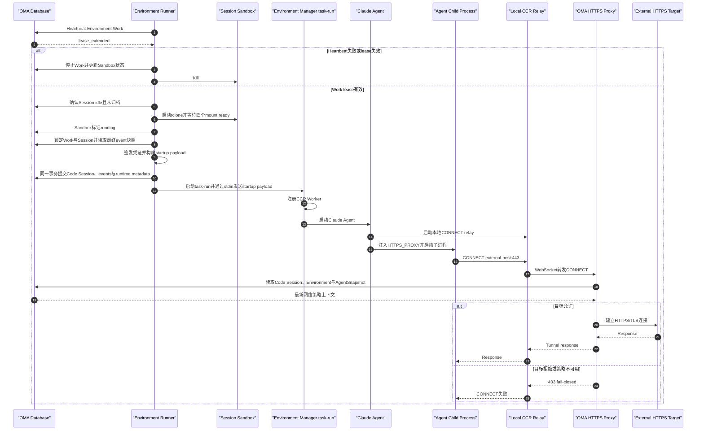

# Environment Packages Provisioning

> 状态：PR 实施设计。本文定义 Environment Packages Provisioning 的最终实现合同，包括 Environment Manager stdin 协议、OMA 调用与生命周期、Session 网络策略、镜像发布和验收路径。

## 1. 目标与边界

Cloud Environment 继续保存并回显 Claude-compatible `config.packages`，只支持 `apt`、`cargo`、`gem`、`go`、`npm`、`pip` 六个数组。用户请求的版本继续使用各 Package Manager 的原生 spec，例如：

```json
{
  "type": "packages",
  "apt": ["ffmpeg"],
  "cargo": ["ripgrep@14.1.1"],
  "gem": ["rake:13.2.1"],
  "go": ["golang.org/x/tools/cmd/goimports@v0.35.0"],
  "npm": ["typescript@5.9.3"],
  "pip": ["numpy==2.3.5"]
}
```

OMA 不创造统一的 name/version DSL，也不增加 Build、Artifact、Runtime Version、Secret、registry 或 init-script public API。

本设计把 Packages 的三个层次分开：

- OMA 拥有 Environment Packages 意图、公开 schema、规范化、manifest 构造、调用编排、Sandbox 生命周期和长期 materialization 控制面。
- Environment Manager 拥有把 v1 Packages Manifest 应用到当前 Sandbox 文件系统的 Go 实现。
- `managed-agent-sandbox` 拥有固定 runtime、Package Manager、mirror、PATH、安装前缀、root 身份和 Environment Manager binary 的镜像合同。

本 PR 在每个新 Session Sandbox 中调用 Environment Manager 安装一次 Packages。OMA 不再包含或向 Sandbox 写入 Python Provisioner、manifest 文件或其他安装 executable。长期按 ADR 0002/0003 将同一安装能力复用于 Packages Template materialization，避免再次迁移 Package Manager 实现。

| 范围 | 安装发生位置 | 安装调用方 | Session Sandbox 网络边界 |
|---|---|---|---|
| 本 PR | 每个 Session Sandbox | OMA 调用 Environment Manager `provision-packages` | 不投影 `limited` 到 E2B；运行期 HTTPS proxy 提供 best-effort 策略 |
| 后续 Template materialization | 独立 Template Build 环境 | Packages Template Worker 调用同一命令 | Session 不再安装 Packages，并恢复 E2B `NetworkOpts` 纵深防御 |

本文中的 **Provisioner** 不指一个独立部署的组件。Environment Manager 的一次性 `provision-packages` 子命令承担 Sandbox-local 安装；OMA 或后续 Template Worker 是该命令的调用方和生命周期所有者。

### 1.1 Base Template合同

新 Environment 使用以下 E2B Template 名称，保持 Provider 的 Template 直传逻辑：

```text
managed-agent-sandbox
```

本地部署拉取固定digest的`ghcr.io/superduck-ai/managed-agent-sandbox`，再标记为Docker的`managed-agent-sandbox:latest`；OMA使用裸Template名称。Hosted E2B必须在OMA上线前创建并验证同名Template，并让`default` tag指向通过验收的build。E2B将裸名称解析为`managed-agent-sandbox:default`，而不是`:latest`；OMA不增加别名解析层，YAML配置值原样传给provider，其他自定义Template不受影响。

本 PR 只更新 Template 中固定的 Environment Manager binary，不改变 Template 名称解析、默认值或自定义 Template 直传语义。

## 2. 最终架构与职责

Environment Manager 新增独立、同步、一次性退出的命令：

```text
/usr/local/bin/environment-manager provision-packages --protocol v1 --stdin
```

该命令不并入 `task-run`。同一个 Environment Manager binary 在 Session Sandbox 中执行两个相互独立的进程：

1. `provision-packages` 应用 Packages 后退出。
2. 安装成功并完成 runtime commit 后，`task-run` 启动 Claude Agent。

OMA 通过 stdin 发送 manifest，不写入中间 manifest 文件，不依赖 Python，也不掌握 Package Manager 命令细节。后续 Template Builder 复用同一个 `provision-packages` 命令。

### 2.1 责任边界

| 角色 | 负责 | 明确不负责 |
|---|---|---|
| OMA Environment API | Packages schema、规范化、spec安全校验、持久化和回显 | Sandbox命令、安装路径、Package Manager argv |
| OMA Environment Runner | Environment生效配置、manifest、同步调用、timeout/cancel、成败门禁（status与exit一致）、runtime commit和失败清理 | Package Manager argv、category/stage字段矩阵、内部安装重试 |
| Environment Manager `provision-packages`（Provisioner） | manifest校验、固定安装计划、子进程取消和稳定结果 | Environment/Session/Work、网络授权、Build Key、Template发布和retry policy |
| `managed-agent-sandbox` | runtime、Package Manager、mirror、PATH、prefix、root和固定Manager binary | Environment状态、Session生命周期和调用重试 |
| Code Session HTTPS proxy | Agent运行期CONNECT的身份、最新Environment policy、SSRF和目标拨号 | Provisioning阶段网络和安装语义 |
| 后续 OMA Packages Template Worker | durable build、lease、attempt、retry、readiness和atomic publication | Package Manager argv和Agent runtime |

“Environment Manager 负责安装”特指无状态的 Sandbox-local Packages Application，不表示它拥有 Packages materialization 控制面。

### 2.2 Environment、Session与runtime commit不变量

- Environment更新不改变已经创建的Sandbox；Runner创建新Sandbox时读取Environment生效配置，因此只影响之后的Sandbox创建，包括为旧Session重新创建Sandbox。
- 每个Session通过一次独立的E2B `Create`获得隔离文件系统。
- `mcp_allowed_hosts`与`managed_agent_skills_mount`是Sandbox创建输入，在`Resolve`/`Create`前准备；preparation只修改Runner内存中的Work，不提前持久化runtime成功状态。
- `provider_sandbox_id`在Sandbox创建后独立持久化，供失败清理使用。
- `environment_sandboxes.metadata`是一次创建尝试的输入快照，可保留MCP/skill preparation信息，但不表示runtime commit成功。
- Packages完成后，Runner必须heartbeat并检查`lease_extended`，再确认Session仍为`idle`且未归档；任一条件不满足时终止Sandbox，不创建active Code Session或凭证。
- Work与Session预检通过后，Runner启动固定rclone filestore并等待四个mount ready，再把Sandbox标记为`running`。
- rclone ready后，Runner在同一数据库事务中锁定并重新确认Work为`active`、Session为`idle`且未归档，使用Session行锁读取最终event快照，创建active Code Session，写入initialize/initial inbound events，并提交preparation与runtime identity metadata。
- initial inbound event按idempotency key去重；冲突项不占用sequence，也不回滚整个runtime事务。
- 锁前提交的Session event进入初始inbound queue；锁后event等待runtime commit后走实时转发路径。Packages安装期间的消息不能落在两条路径之间。
- 任一数据库写入或提交前凭证签发失败都会回滚runtime commit；已经创建的Sandbox仍按统一失败路径清理。

实现必须满足以下生命周期不变量：

- Packages 在 Agent 启动前安装。
- 空 Packages 跳过安装。
- Package Manager 顺序固定。
- Go spec 逐个安装，其他 manager 批量安装。
- 首错停止。
- spec 只作为 argv 元素，不经过 shell。
- 失败后不做逐包回滚，而是丢弃整个 Sandbox。
- 安装成功后重新检查 Environment Work lease，只有 lease 仍有效才提交 runtime。
- Session startup payload 和凭证只在安装成功后发送。

## 3. 整体流程

### 3.1 全局视图

先忽略数据库事务、协议字段和各Package Manager命令，整个流程只有三段：OMA创建Sandbox、Environment Manager安装Packages、安装成功后启动Agent。


```mermaid
flowchart TD
    A["用户保存Environment Packages"] --> B["OMA创建unrestricted Session Sandbox"]
    B --> C{"Packages是否为空"}
    C -->|是| F["OMA执行Heartbeat并检查Work lease"]
    C -->|否| D["Environment Manager通过stdin执行provision-packages"]
    D --> E["Package Manager按需直接访问Registry、Mirror或CDN"]
    E --> G{"最终JSON合法且进程退出码为0"}
    G -->|否| X["OMA停止Work并丢弃Sandbox"]
    G -->|是| F
    F --> H{"Work lease是否有效"}
    H -->|否| X
    H -->|是| R["OMA启动rclone并等待四个mount ready"]
    R --> I["OMA原子提交Code Session runtime"]
    I --> J["Environment Manager通过task-run启动Claude Agent"]
    J --> K["Agent运行期HTTPS经过CCR Relay和OMA Proxy"]
```

这张图只表达五个全局结论：

1. OMA拥有Sandbox和Session生命周期，Environment Manager只负责Sandbox内安装与Agent启动。
2. Packages为空时跳过安装，直接进入heartbeat。
3. Package安装阶段直接访问外部Registry，不经过OMA HTTPS proxy。
4. 只有安装结果和Work lease都成功，OMA才提交Code Session runtime并启动Agent。
5. 任一启动阶段失败都停止Work并丢弃Sandbox；只有Agent运行期HTTPS进入CCR Relay和OMA proxy。

### 3.2 Sandbox创建与Packages安装

这一阶段从Runner取得Work开始，到Packages为空或安装成功后准备执行heartbeat为止。


```mermaid
sequenceDiagram
    autonumber
    participant DB as "OMA Database"
    participant Runner as "Environment Runner"
    participant Sandbox as "Session Sandbox"
    participant Manager as "Environment Manager provision-packages"
    participant Registry as "Registry / Mirror / CDN"

    Runner->>DB: Claim Work并读取生效Environment
    DB-->>Runner: Packages与Networking
    Runner->>Runner: 准备MCP hosts与skill mount
    Runner->>Runner: Resolve Template且不投影limited NetworkOpts
    Runner->>DB: 创建state=creating的Sandbox记录
    Runner->>Sandbox: 创建unrestricted Session Sandbox
    Sandbox-->>Runner: provider_sandbox_id
    Runner->>DB: 持久化provider_sandbox_id
    Runner->>Runner: 构建并校验v1 Manifest

    alt Packages为空
        Runner->>Runner: 跳过provision-packages
    else Packages非空
        Runner->>Manager: 启动provision-packages
        Runner->>Manager: stdin发送Manifest并关闭stdin
        Manager->>Manager: 校验并按固定顺序安装
        Manager->>Registry: 直接下载Packages
        Registry-->>Manager: metadata与archive
        Manager-->>Runner: 最终JSON与进程退出码
        alt 结果合法且安装成功
            Runner->>Runner: 进入heartbeat阶段
        else 协议或安装失败
            Runner->>DB: Sandbox标记failed并停止Work
            Runner->>Sandbox: Kill
        end
    end
```

Packages为空和安装成功是这一阶段仅有的两个成功出口。stdin发送失败、结果JSON缺失或损坏、JSON与退出码不一致、Package Manager失败、timeout和cancellation都进入同一失败清理路径。

### 3.3 Runtime提交、Agent启动与HTTPS请求

这一阶段只接收“Packages为空或已经成功安装”的Sandbox。


```mermaid
sequenceDiagram
    autonumber
    participant DB as "OMA Database"
    participant Runner as "Environment Runner"
    participant Sandbox as "Session Sandbox"
    participant Manager as "Environment Manager task-run"
    participant Claude as "Claude Agent"
    participant Child as "Agent Child Process"
    participant Relay as "Local CCR Relay"
    participant Proxy as "OMA HTTPS Proxy"
    participant Target as "External HTTPS Target"

    Runner->>DB: Heartbeat Environment Work
    DB-->>Runner: lease_extended
    alt Heartbeat失败或lease失效
        Runner->>DB: 停止Work并更新Sandbox状态
        Runner->>Sandbox: Kill
    else Work lease有效
        Runner->>DB: 确认Session idle且未归档
        Runner->>Sandbox: 启动rclone并等待四个mount ready
        Runner->>DB: Sandbox标记running
        Runner->>DB: 锁定Work与Session并读取最终event快照
        Runner->>Runner: 签发凭证并构建startup payload
        Runner->>DB: 同一事务提交Code Session、events与runtime metadata
        Runner->>Manager: 启动task-run并通过stdin发送startup payload
        Manager->>Manager: 注册CCR Worker
        Manager->>Claude: 启动Claude Agent
        Claude->>Relay: 启动本地CONNECT relay
        Claude->>Child: 注入HTTPS_PROXY并启动子进程
        Child->>Relay: CONNECT external-host:443
        Relay->>Proxy: WebSocket转发CONNECT
        Proxy->>DB: 读取Code Session、Environment与AgentSnapshot
        DB-->>Proxy: 最新网络策略上下文
        alt 目标允许
            Proxy->>Target: 建立HTTPS/TLS连接
            Target-->>Proxy: Response
            Proxy-->>Relay: Tunnel response
            Relay-->>Child: Response
        else 目标拒绝或策略不可用
            Proxy-->>Relay: 403 fail-closed
            Relay-->>Child: CONNECT失败
        end
    end
```

runtime commit或`task-run`启动失败同样进入统一失败清理，不得留下可继续运行的Sandbox。Packages安装期间尚不存在Code Session、CCR relay或Agent凭证；这些对象只在安装成功且lease有效后创建。

## 4. stdin Manifest合同

OMA 直接发送 v1 manifest，不增加 request envelope：

```json
{
  "version": 1,
  "packages": {
    "type": "packages",
    "apt": ["ffmpeg"],
    "cargo": ["ripgrep@14.1.1"],
    "gem": ["rake:13.2.1"],
    "go": ["golang.org/x/tools/cmd/goimports@v0.35.0"],
    "npm": ["typescript@5.9.3"],
    "pip": ["numpy==2.3.5"]
  }
}
```

不增加以下字段：

```text
operation
attempt_id
environment_id
session_id
work_id
build_key
template_id
networking
credentials
environment variables
```

`--protocol v1`选择命令协议与输出合同；manifest中的`version: 1`声明输入schema。二者不匹配时返回manifest/protocol错误。

### 4.1 framing和严格校验

Environment Manager把stdin视为不可信跨进程输入：

- 最大1 MiB。
- 恰好一个JSON object；允许尾随空白，拒绝第二个值或非空尾随内容。
- 拒绝未知顶层字段和未知Packages字段。
- `version`必须为`1`。
- `packages`必须存在、为object且非`null`。
- `packages.type`必须为`packages`。
- 只允许`apt`、`cargo`、`gem`、`go`、`npm`、`pip`。
- manager字段缺失时视为空数组；显式`null`拒绝。
- manager字段必须是字符串数组。
- 拒绝trim后以`-`开头的spec。
- 拒绝authority含userinfo/credential的URL。
- 错误不得回显原始spec。
- 保持数组顺序和原字符串，不排序、不去重、不trim后改写。
- v1 不新增空字符串、空格或 shell 元字符限制；spec 不经过 shell，因此这些字符不具有 shell 语义。

OMA校验保护公开Environment输入，Manager校验保护进程执行seam。

## 5. Packages执行合同

### 5.1 身份、环境和凭证时序

- `provision-packages`必须以root启动；非root属于`execution_environment/preflight`。
- 六类 Package Manager 全部以 root 执行，符合 `managed-agent-sandbox` runtime 合同。
- 子进程工作目录固定为`/home/user`；目录不存在或不可访问时失败。
- `HOME`保持root合同`/root`。
- 子进程继承`managed-agent-sandbox`提供的PATH、runtime、mirror、prefix和cache环境。
- Manager不硬编码另一套runtime版本、mirror或安装前缀。
- Provisioning前不得向Sandbox注入Session、MCP、Git、模型或用户Environment secret。
- `task-run` startup payload只在Packages成功后发送。

### 5.2 固定执行计划

| 顺序 | Manager | argv |
|---:|---|---|
| 1 | apt prepare | `apt-get update` |
| 2 | apt install | `apt-get install -y -- <all specs>` |
| 3 | cargo | `cargo install <all specs>` |
| 4 | gem | `gem install <all specs>` |
| 5 | go | 每个spec单独执行`go install <spec>` |
| 6 | npm | `npm install --global -- <all specs>` |
| 7 | pip | `pip install <all specs>` |

不变量：

- 空manager跳过，apt为空时不执行`apt-get update`。
- 除Go外，同一manager的specs批量传入。
- 使用`exec.CommandContext`和argv，不使用`sh -c`、`bash -c`、script或命令拼接。
- 首错停止；不重试、不并行、不回滚、不自动跳过已安装项。
- 空Packages由OMA跳过命令；直接调用Manager时返回成功且不启动子进程。
- Manager不维护已安装状态或本地lock；调用方保证同一Sandbox不并发Provisioning。
- 失败重试必须从新的干净Sandbox或Build环境开始。

Package Manager exit code 0就是v1步骤成功。Manager不执行inventory、`pip freeze`、`npm list`、import、binary probe或版本反查。本 PR 的结果可见性由镜像集成/E2E验证；后续Artifact验证属于Template Builder。

## 6. 结果协议

stdout只属于协议，并且最多输出一个带换行的最终JSON object。Package Manager、Cobra usage、slog和人类诊断不得写入stdout。

成功：

```json
{
  "version": 1,
  "status": "succeeded",
  "package_count": 6,
  "duration_ms": 12450
}
```

Package Manager失败：

```json
{
  "version": 1,
  "status": "failed",
  "category": "package_manager",
  "manager": "npm",
  "stage": "install",
  "package_count": 6,
  "duration_ms": 12450,
  "exit_code": 1
}
```

结果字段合同：

- `version`、`status`和`duration_ms`始终存在；发生在协议handler之前、因而没有JSON的CLI错误除外。
- `package_count`在manifest通过完整校验后存在，是六个数组的spec总数，不表示已成功安装的数量。`decode`或`validate`失败时不猜测、不输出该字段。
- `duration_ms`是Environment Manager从开始读取stdin到生成最终结果的总耗时，使用单调时钟计算并取非负整数毫秒。
- 失败结果必须包含`category`和`stage`；成功结果不得包含失败字段。
- 当失败可归属到某个Package Manager时包含`manager`；`decode`、`validate`、通用`preflight`、`finalize`等非manager错误不包含该字段。
- `exit_code`只表示已成功启动但非零退出的Package Manager原始进程退出码；它与Environment Manager自身的稳定process exit code不是同一个字段。子进程未启动、被取消或Manager内部失败时不伪造该字段。
- v1不包含spec、argv、Package Manager输出、部分安装清单或逐步骤事件。OMA对stdout做严格JSON解析（拒绝未知字段与多值），校验`version`/`status`/`duration_ms`等门禁字段，并要求`status`与进程退出码一致；`category`/`stage`/`manager`字段组合的完整合同由Environment Manager拥有与测试，OMA只把它们当作有界诊断透传，不再复刻字段矩阵。

### 6.1 稳定类别和阶段

| Category | 含义 |
|---|---|
| `invalid_manifest` | stdin、JSON、schema或spec envelope无效 |
| `package_manager` | 子进程启动成功但返回非零 |
| `execution_environment` | root、目录、binary或子进程启动合同损坏 |
| `timeout` | Manager能确认context deadline |
| `cancelled` | 收到取消信号且有机会返回 |
| `internal` | Manager内部不变量或finalize失败 |

| Stage | 含义 |
|---|---|
| `decode` | 大小、framing或JSON解码 |
| `validate` | schema或spec安全校验 |
| `preflight` | root、工作目录或执行前环境 |
| `start` | binary缺失或子进程无法启动 |
| `prepare` | apt prepare步骤 |
| `install` | Package Manager安装步骤 |
| `finalize` | 结果编码、写出或收尾 |

稳定manager只有`apt`、`cargo`、`gem`、`go`、`npm`、`pip`。Environment Manager拒绝并规范化未知category、manager或stage；OMA不在Runner侧二次执行该矩阵校验。

### 6.2 Environment Manager退出码

| Exit code | 含义 |
|---:|---|
| `0` | 成功 |
| `2` | CLI、protocol或manifest无效 |
| `10` | Package Manager非零退出 |
| `11` | timeout或cancellation |
| `12` | execution environment或internal error |

JSON是精确且权威的结果；进程退出码是稳定分类和无JSON时的兜底；stderr不是协议。JSON与退出码不一致时，OMA将其视为executor/protocol failure。

新命令不能在`RunE`中直接`os.Exit`；实现返回可测试的typed exit error，由根入口只为该类型映射2/10/11/12，其他命令错误保持退出1。`provision-packages`关闭自动usage输出，并确保Cobra、logger和错误渲染只写stderr。发生在协议handler之前的未知flag等CLI错误允许没有JSON，但必须非零退出。

## 7. 日志、timeout和取消

### 7.1 日志

- Package Manager stdout/stderr被显式drain并丢弃，不能继承Manager stdout/stderr。
- 原始输出不进入result、stderr、OMA `last_error`或持久化Build记录。
- Manager stderr只允许有界、无spec诊断：manager、stage、package count、duration、exit code和状态。
- 禁止记录stdin、spec、完整argv、URL、环境变量、credential或lifecycle hook输出。
- OMA Runner在provisioning开始和结束各记录一条日志，只包含Environment Work external ID、耗时和成功标志。起始行用于识别当前占用worker slot的Work，结束行用于统计安装时长；两条都不含spec、manifest、argv或Sandbox内部输出。
- 长期受权限保护的Build Log、脱敏和保留策略另行设计。

### 7.2 timeout、取消和清理

整体timeout和cancellation只属于调用方：本 PR 是Environment Runner，后续materialization是Template Worker/Builder。Manifest和Manager CLI不携带timeout。

Environment Manager：

- 使用signal-aware context监听SIGINT和SIGTERM。
- Package Manager使用可取消context和独立process group。
- 取消时best-effort终止当前子进程组，不启动后续manager。
- stdout仍可写时返回`cancelled`与exit code 11。
- 被强制kill时允许没有完整JSON。

调用方：

- 建立整体deadline。
- 按`Start → SendStdin → CloseStdin → Wait`执行。
- context取消、发送失败、关闭失败或超时时kill command handle。
- `Wait`必须在独立goroutine中把结果写入容量为1的channel；调用方select整体deadline，不能假设`Kill`一定会让SDK的`Wait`返回。
- timeout后以有界context执行`Kill`，再只等待固定grace；grace到期主动`Disconnect`并返回timeout。即使底层handle没有关闭完成通知，Runner也不能永久阻塞。
- 只有合法`succeeded` JSON与exit code 0同时出现才允许继续。
- 其他结果都阻止runtime commit或Template publication，并丢弃Sandbox/build environment。

### 7.3 Sandbox与Work状态清理

任何Provisioning协议、stdin transport、Manager执行或结果校验失败都进入统一的`failCreatedSandbox`语义：

- `environment_sandboxes.state`变为`failed`。
- `last_error`只保存不含spec和credential的阶段上下文。
- Environment Work被强制停止。
- 已创建的provider Sandbox在独立的两分钟cleanup context中best-effort终止。
- `task-run` startup payload尚未发送，Claude Agent不会启动。

graceful stop继续采用分阶段清理：`stopping`写入与Kill使用第一个bounded context；Kill返回或该阶段超时后，Runner创建独立的post-Kill bounded context，写入`stopped`（Kill失败时为`failed`）并强制停止Environment Work。`stopping`写入失败仍必须尝试Kill，第一阶段deadline耗尽也不能复用已过期context跳过最终状态。各阶段错误继续合并返回，测试日志不得输出Manager stdin、完整launch或凭证。

### 7.4 Runner容量与Sandbox寿命预算

Provisioning在`RunOnce`内同步执行，因此它改变了两项容量特性。配置这两个值时必须按本节的语义，而不是按"同时存在多少个Sandbox"来估算。

**`environment_runner.concurrency`决定同时处理的Work数，不是同时存在的Sandbox数。** Runner为每个worker启动一个串行`loop`，`RunOnce`从领取Work一直阻塞到Environment Manager启动完成。装包期间该worker不取新Work，因此超出concurrency的Session会停在`queued`状态，连Sandbox都尚未创建，即使这些Session自身没有配置任何Packages。引入Provisioning前，单个Work占用worker slot的上限是rclone就绪的20秒量级；引入后上限变为`e2b.sandbox_timeout`。concurrency应按最慢的包安装时长估算，排队现象通过7.1的provisioning起止日志定位。

**`e2b.sandbox_timeout`同时承担两个语义，并被串行消耗。** 它既是`Create`传给E2B的Sandbox绝对寿命，也是`provision-packages`命令的deadline。装包用掉的时间直接从Agent可用的Sandbox寿命里扣除，因此该值必须覆盖"安装 + 整个会话"，而不只是覆盖其中一项。

已知限制：OMA目前不调用E2B的`POST /sandboxes/{id}/timeout`重置Sandbox寿命，所以上面两个语义无法分别配置。解除耦合有两条路径，都属于后续工作：在Provisioning成功后重置Sandbox寿命，或按第12节把安装移出Session Sandbox。后者同时消除本节的两项限制。

## 8. Session网络策略

### 8.1 Provisioning阶段

- OMA解析并保存Environment networking，但本 PR 不将`limited`投影为Session Sandbox的E2B `NetworkOpts`。
- Session Sandbox创建时允许公网egress。
- `provision-packages`、Package Manager和lifecycle hook直接访问外网。
- 此时Code Session、local CCR relay和OMA HTTPS proxy尚未启动。
- Manager manifest不接收networking或allowed hosts。

这会避免Registry、mirror、CDN、redirect、VCS和lifecycle下载被Session网络策略提前阻断，但不能保证Packages一定成功；版本不存在、编译、Registry、限流、TLS、磁盘和timeout仍可能失败。

### 8.2 Agent运行阶段

- `task-run`启动Claude后，本地CCR relay向子进程注入`HTTPS_PROXY`。
- 正常HTTPS CONNECT通过OMA Code Session HTTPS proxy。
- Proxy每次CONNECT重新读取当前Environment与AgentSnapshot并执行limited/unrestricted、MCP、Package Manager host、SSRF和目标校验。
- 直接socket、unset proxy、非HTTPS或不遵守代理环境变量的进程可能绕过该策略。

因此过渡期只能描述为best-effort HTTPS proxy policy，不能宣称不可绕过的Sandbox网络隔离；ADR 0005/0006和CCR upstream proxy设计同步记录这一边界。

## 9. 三个仓库的实现位置

### 9.1 Environment Manager

建议结构：

```text
cmd/
  cmd_provision_packages.go

internal/packages/
  manifest.go
  validate.go
  plan.go
  executor.go
  result.go
```

`cmd`只负责Cobra、stdin入口、signal context、stdout和exit mapping。`internal/packages`隐藏校验、执行计划、argv、子进程、取消和结果映射，不导入Session、runtime Manager、OMA API、MCP、Claude或Template概念。

生产执行与测试使用内部`CommandRunner` seam。现有`internal/process.Execute`只接受单一路径并面向output streaming，不适合Packages argv与纯JSON stdout合同，不强行复用。

### 9.2 OMA

新增同步stdin command adapter：

```go
type CommandRequest struct {
    Command string
    Stdin   []byte
    Timeout time.Duration
}

type CommandResult struct {
    ExitCode int
    Stdout   []byte
    Stderr   []byte
}
```

E2B实现执行`Start → SendStdin → CloseStdin → Wait`。它不能复用发送stdin后立即返回的`StartBackgroundCommand`。Packages路径不再调用`WriteFile`写manifest或Python，不依赖Python，也不解析英文stderr。

#### Packages schema边界

`environmentPackages`是六类manager的命名schema，`specsByManager()`是manager名称与顺序的唯一真相源，校验、空判断与manifest字段顺序都由它派生。两条信任边界共用同一份语义校验`validate()`，但入口不同：

- HTTP边界`normalizePackages`接收请求体的`json.RawMessage`，负责判断"是不是object"，把非数组manager值映射成`config.packages.<manager> must be an array of strings`，再补齐空数组。
- Provisioning边界`buildPackageManifest`直接把已持久化的Environment config解码成`cloudEnvironmentPackagesConfig{Packages *environmentPackages}`。存量config已经过HTTP规范化，因此这里不再二次经过`json.RawMessage`；结构非法说明数据库记录被直接改写，返回`decode environment config`，与用户输入错误区分开。

`validate()`按manager顺序拒绝空白spec、超过255字符的spec、trim后以`-`开头的manager option和authority含credential的URL。错误只包含manager名和规则，不回显spec，因此私有仓库地址与token不会进入API响应或日志。

#### 默认Template迁移

`00031_managed_agent_sandbox_default.sql`是本次唯一改动`environments.resolved_template`默认值的migration，把默认值设为裸名称`managed-agent-sandbox`；down恢复`claude-code-interpreter`。已有Environment保留各自的`resolved_template`，不做数据回写。

### 9.3 `managed-agent-sandbox`

- 从正式Environment Manager仓库构建干净的linux/amd64 binary。
- 固定revision、version和SHA-256。
- 更新`/opt/env-runner/environment-manager`，保持`/usr/local/bin/environment-manager`符号链接。
- 保持root、`/home/user`、Package Manager、runtime、mirror、PATH和prefix合同。
- `verify-sandbox-contract`验证binary版本、v1命令、所需manager和安装结果可见性。

## 10. 发布与兼容

发布必须从executor向caller推进：

1. Environment Manager实现、测试并发布新binary。
2. `managed-agent-sandbox`固定新revision/version/SHA-256并通过contract验证。
3. 发布并验收新的base image和E2B Template。
4. 确认目标部署使用的默认与自定义Template都包含新命令。
5. OMA切换到stdin协议并删除Python路径。
6. 运行真实E2E后部署OMA。

不保留Python fallback。缺少命令的旧Template返回`execution_environment`，OMA失败并清理Sandbox。fallback会长期维护两套实现并掩盖镜像发布错误。

## 11. 测试与验收

### 11.1 Environment Manager

失败场景先于成功场景：

- 空、malformed、超1 MiB、多个JSON和尾随垃圾。
- 未知字段、版本、type、manager、`null`和非字符串数组。
- manager option与URL credential不回显spec。
- 非root、缺失`/home/user`和缺失所需binary。
- 子进程无法启动、非零exit、signal取消和内部错误。
- 首错停止，后续manager不执行。
- stdout只有最终JSON，stderr和子进程输出不泄漏spec。
- JSON category、必要字段和Manager exit code一致。
- 空Packages成功且不启动子进程。
- 固定顺序、argv、Go逐条、其他批量和输入顺序保真。

### 11.2 OMA

- 空Packages跳过命令。
- stdin发送、关闭、等待和失败kill顺序。
- timeout、用户stop和context取消。
- JSON缺失、损坏、未知值或与exit code不一致。
- 安装未成功时不commit Code Session、不发送startup payload。
- 失败时Sandbox/Work状态与独立cleanup context。
- Packages路径不写manifest/Python，固定命令不含spec。
- Session Sandbox不施加limited E2B projection。
- Agent启动后Proxy仍按最新Environment策略允许/拒绝CONNECT。
- Packages安装期间提交的Session event仍进入正确的initial或realtime路径。
- preparation metadata、provider sandbox ID和runtime metadata仍按原事务边界持久化。
- 每类manager的空白spec、超长spec、manager option和URL credential都被拒绝且不回显spec。
- 已持久化config结构非法时返回`decode environment config`，语义非法时与HTTP边界共用同一条错误。
- Managed Agent启动事务的每条命名查询都能绑定参数，且不含与命名参数冲突的`::`cast。

### 11.3 Managed Sandbox与真实E2E

- binary revision、checksum和version。
- `provision-packages` v1合同。
- 六类Manager真实安装与首错停止。
- 安装后`task-run`和Claude Agent可看到binary/library。
- Provisioning可访问Registry/mirror。
- Agent运行期Proxy允许和拒绝。
- 安装失败后不遗留可运行Session。

本 PR 使用并调整以下验收入口：

- `internal/environments/package_provisioner_test.go`覆盖manifest、空配置、特殊字符、安全校验和结果解析；Package Manager执行顺序由Environment Manager仓库测试覆盖。
- `tests/environments_api_test.go`继续覆盖官方Go SDK强类型创建、更新、读取和列出Packages。
- `tests/environments_runner_cloud_test.go`调整为stdin command顺序、网络过渡、固定命令、失败/stop不创建Code Session、event handoff和清理日志。
- `tests/environments_packages_lifecycle_e2e_test.go`继续验证Environment更新只影响后续Sandbox，并保持Session文件系统隔离。
- `tests/environments_full_e2b_bridge_integration_test.go`继续通过六类真实Packages与Claude Agent probe证明安装结果可见。

CI在没有E2B凭证时仍必须编译tagged acceptance tests：

```text
go test ./tests -tags='e2b_integration e2e' -run '^$'
```

验收不变量：

1. OMA不包含或写入Sandbox-local Packages executor。
2. Manager只接收Packages Manifest，不接收控制面状态或网络策略。
3. spec永远作为argv元素，不经过shell。
4. stdout只有最终JSON；OMA不解析stderr决定结果。
5. 只有成功JSON与exit code 0同时成立，Sandbox才进入runtime commit。
6. 失败、取消、timeout或协议损坏都丢弃当前Sandbox。
7. Session credential只在Packages成功后发送。
8. 网络策略只对经过OMA Proxy的运行期CONNECT提供best-effort约束。

## 12. 后续 Packages Template materialization


```mermaid
flowchart LR
    E[Environment Packages] --> O[OMA Build Key and Queue]
    O --> W[Packages Template Worker]
    W --> B[Template Build Environment]
    B --> P[Environment Manager provision-packages]
    P --> T[Immutable Packages Template]
    T --> S[Restricted Session Sandbox]
    S --> M[Environment Manager task-run]
    M --> A[Claude Agent]
```

后续materialization生命周期仍不交给Environment Manager：

- OMA计算Build Key，维护durable build、lease、attempt、retry和readiness。
- Template Builder创建允许构建网络的Build环境并调用同一个Manager命令。
- Provisioning、验证、E2B发布和数据库Artifact记录全部完成后才ready。
- 失败只保留诊断记录，不发布部分Template。
- Session从ready Template创建，不再现场安装Packages。
- Session Sandbox恢复E2B `NetworkOpts`纵深防御；OMA HTTPS proxy继续执行每CONNECT最新策略。

Build Key标识规范化输入，不是Artifact digest，也不承诺未固定版本可完全复现。Physical Template GC、E2B image content digest、limited-network Build授权和public Build UI继续留在后续范围。

## 13. 后续文档同步

本文获批后再同步以下决策记录和外部合同：

- 更新ADR 0002，区分OMA materialization controller与Manager filesystem executor。
- 更新ADR 0006，记录本 PR 不投影E2B limited策略及其best-effort后果。
- 修正`CONTEXT.md`中Environment Manager、Sandbox root runtime与User-owned Packages layer的冲突定义。
- 在Environment Manager仓库补充命令级实现说明。
- 更新`managed-agent-sandbox` README与contract verifier说明。

这些同步必须在代码实现合并前完成，避免设计文档、领域语言和实际安全边界互相矛盾。
