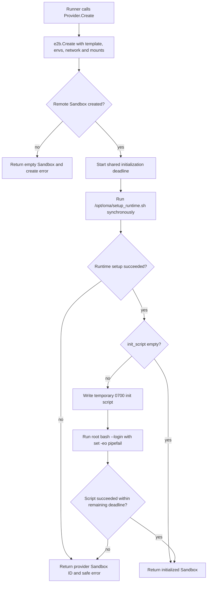
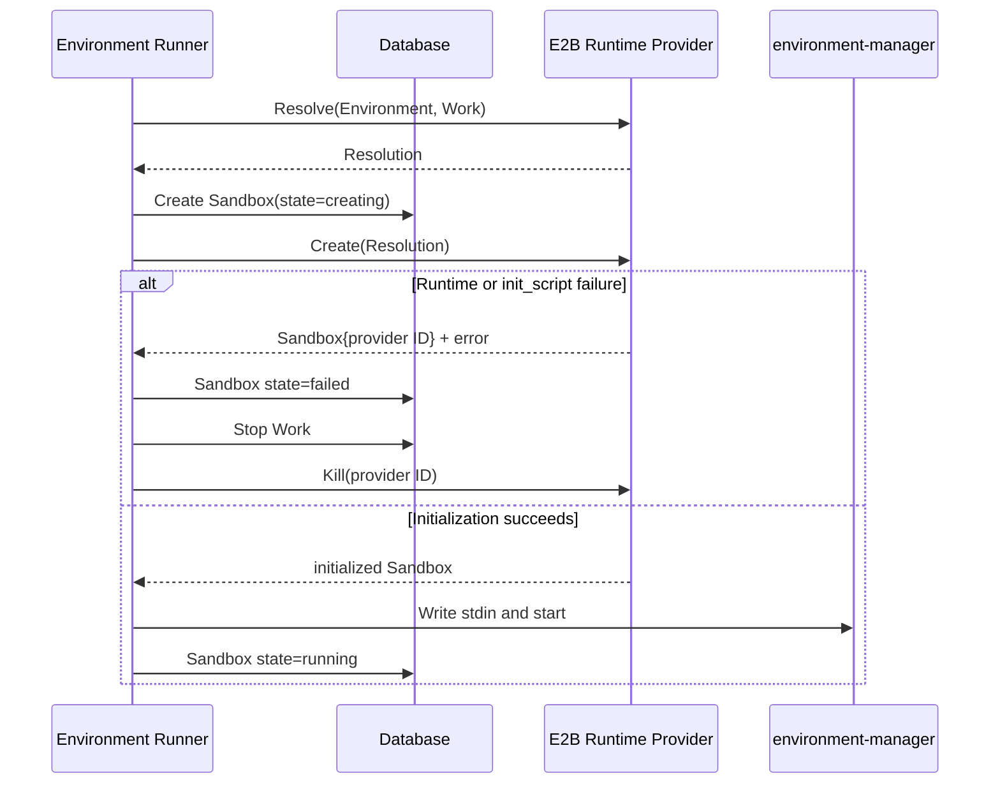

# Environment Runtime 初始化设计

> 状态：已确认设计，尚未实施
>
> 对应 Issue：[GitHub #68](https://github.com/superduck-ai/open-managed-agents/issues/68)
> 架构决策：[ADR-0001](../../adr/0001-use-runtime-version-environment-config.md)

## 1. 背景

当前 Cloud Environment Config 以 `packages`、`networking` 为主要持久化字段，响应兼容层还会补出 `init_script` 与 `environment`：

- `packages` 可以被校验、保存和回显，但 E2B Sandbox Runtime 没有消费它。
- `init_script` 与 `environment` 会出现在响应中，但正常创建路径不会持久化它们。
- E2B Runtime 当前只把 OMA 内部 ID 注入 Sandbox，不会应用语言版本或初始化脚本。
- Runner 在 Provider 创建 Sandbox 后直接启动 `environment-manager`，随后把 Sandbox 标记为 `running`。

因此，当前 API 表面上描述了执行环境，但其中多项配置不会形成可验证的 Sandbox 初始化结果。

本设计删除声明式 Packages 编排，改为通过受控 Runtime Version 变量选择镜像中已经预装的语言版本，并让 `init_script` 成为真实的同步初始化能力。Sandbox 只有在 Runtime Version 与 Initialization Script 全部成功后才可以进入 `running`。

## 2. 目标与非目标

### 2.1 目标

- Cloud Environment 使用受控 `env_vars` 选择预安装 Runtime Version。
- 空 `env_vars` 使用 OMA Sandbox 镜像的固定默认 Runtime。
- Runtime 激活后同步执行 `init_script`。
- Environment 更新只影响之后新建的 Sandbox。
- 初始化失败或超时时不留下错误的 `running` 状态或孤立远程 Sandbox。
- Runtime 初始化封装在 Sandbox Runtime Module，不扩散到 Session Handler 或 Runner。
- 提供 OMA 自己命名、构建和发布的 `oma-sandbox` 镜像。
- API、数据库配置、E2B Envs 和运行时脚本只使用中性的 `ENV_*_VERSION`。

### 2.2 非目标

- 不支持运行中 Sandbox 的 Runtime Version 或脚本热更新。
- 不引入 Environment Version、Snapshot、历史、回滚或 lockfile。
- 不支持声明式 apt、pip、npm、cargo、gem、go Packages 编排。
- 不在 Sandbox 初始化时在线下载缺失的语言 Runtime。
- 不允许任意 Environment 环境变量或 secret 注入。
- 不修改 `environment-manager` 的代码或 stdin 合同。
- 不在第一版发布 ARM64 `oma-sandbox`。
- 不在镜像发布后自动替换生产 E2B Template。

## 3. 领域边界

本设计使用以下术语：

- **Runtime Version**：Sandbox 镜像中已经存在的语言工具链版本，例如 Python 3.12 或 Node.js 22。
- **Initialization Script**：Runtime Version 激活后、Agent Session 启动前同步执行的 Environment 脚本。
- **Sandbox Initialization**：远程 Sandbox 创建后，到具备运行 Work 条件之前的阶段。

Runtime Version 选择不等于项目依赖安装。镜像提供 pip、npm、Cargo 等工具，但 OMA 不再解析或编排每一种包管理器。项目需要额外依赖时，由 `init_script` 或 Agent 按项目自身配置执行安装。

## 4. Environment API 合同

### 4.1 Cloud Config

目标结构：

```json
{
  "type": "cloud",
  "env_vars": {
    "ENV_PYTHON_VERSION": "3.12",
    "ENV_NODE_VERSION": "22"
  },
  "init_script": "python -m pip install -r requirements.txt",
  "networking": {
    "type": "limited",
    "allow_package_managers": true,
    "allow_mcp_servers": false,
    "allowed_hosts": ["github.com"]
  }
}
```

Cloud Config 只允许以下顶层字段：

- `type`
- `env_vars`
- `init_script`
- `networking`

未知字段必须返回 `400 invalid_request_error`，不能静默忽略。

### 4.2 受控 Runtime Version 变量

`env_vars` 只允许以下九个键：

| API 键 | Runtime | 镜像默认值 | 镜像内部版本管理器 |
|---|---|---:|---|
| `ENV_PYTHON_VERSION` | Python | `3.12` | pyenv |
| `ENV_NODE_VERSION` | Node.js | `22` | nvm |
| `ENV_RUBY_VERSION` | Ruby | `3.4.4` | mise |
| `ENV_RUST_VERSION` | Rust | `1.89.0` | rustup |
| `ENV_GO_VERSION` | Go | `1.25.1` | mise |
| `ENV_BUN_VERSION` | Bun | `1.2.14` | mise |
| `ENV_PHP_VERSION` | PHP | `8.4` | phpenv |
| `ENV_JAVA_VERSION` | Java | `21` | mise |
| `ENV_SWIFT_VERSION` | Swift | `6.1` | swiftly |

不允许：

- 基础镜像供应商自己的 Runtime 环境变量名称。
- `PATH`、`HOME`、代理等进程环境变量。
- `ANTHROPIC_*`、Code Session 或 E2B 内部变量。
- 用户自定义任意键。
- secret 或 credential 注入。

### 4.3 Runtime Version 值验证

API 层验证：

- 值必须是 JSON 字符串。
- 值不能为空。
- 值必须符合安全版本格式，只允许版本号所需的数字和点。
- 值不能包含空白、路径字符或 shell 元字符。

API 不维护镜像支持版本的完整枚举。格式合法的 `ENV_NODE_VERSION=99` 可以被保存；新 Sandbox 初始化时由 `oma-sandbox` 检查 Node.js 99 是否已经安装。镜像是“哪些 Runtime Version 实际可用”的唯一事实来源。

Runtime Setup 只允许选择已经安装的版本。版本不存在时必须失败，不能由 pyenv、nvm、mise、rustup、phpenv 或 swiftly 触发联网安装。

### 4.4 默认 Cloud Config

创建时省略 `config` 或传入 `null`，使用：

```json
{
  "type": "cloud",
  "env_vars": {},
  "init_script": "",
  "networking": {
    "type": "unrestricted"
  }
}
```

`env_vars: {}` 表示使用镜像默认值。API 保存和响应都保留空对象，不展开九个默认版本。固定镜像 digest 与派生镜像显式默认值共同保证默认行为可重复。

### 4.5 更新语义

| 请求 | 结果 |
|---|---|
| 更新时省略 `config` | 保留整个当前 Config |
| 更新时 `config: null` | 重置为默认 Cloud Config |
| 省略 `env_vars` | 保留当前 Runtime 选择 |
| `env_vars: null` | 清空显式选择，使用镜像默认值 |
| `env_vars: {}` | 清空显式选择，使用镜像默认值 |
| 非空 `env_vars` | 整体替换，不逐键合并 |
| 省略 `init_script` | 保留当前脚本 |
| `init_script: null` | 清空脚本 |
| `init_script: ""` | 清空脚本 |
| 非空 `init_script` | 整体替换 |

Environment 更新只改变其可复用定义。已经创建并运行的 Sandbox 继续使用创建时的 Runtime 与脚本结果。

### 4.6 Self-hosted Config

Self-hosted Environment 继续只接受：

```json
{
  "type": "self_hosted"
}
```

`env_vars` 与 `init_script` 只属于 Cloud Environment。Self-hosted 请求携带任一字段时返回 400，因为其机器和 Runtime 不由 OMA/E2B 创建，OMA 无法保证相同的初始化语义。

### 4.7 严格字段验证

允许字段集合：

| 对象 | 允许字段 |
|---|---|
| Cloud Config | `type`、`env_vars`、`init_script`、`networking` |
| Self-hosted Config | `type` |
| Limited Networking | `type`、`allow_mcp_servers`、`allow_package_managers`、`allowed_hosts` |
| Unrestricted Networking | `type` |
| Runtime `env_vars` | 九个 `ENV_*_VERSION` |

错误必须包含完整字段路径，例如：

```text
config.env_var is not supported
config.env_vars.ENV_NODE_VERISON is not supported
config.networking.allow_packages is not supported
config.packages is no longer supported; use config.env_vars and config.init_script
```

### 4.8 Breaking beta 边界

现有 `/v1/environments?beta=true` 直接切换到新 schema：

- 请求和响应删除 `config.packages`。
- 请求和响应删除旧 `config.environment`。
- 新请求继续使用旧字段时返回 400。
- 不引入第二套 beta endpoint。
- 不做新旧 schema 双写。
- 不返回空 Packages 对象伪装兼容。
- 不保证新的 Cloud Config 与当前 Anthropic SDK `BetaCloudConfig` 强类型兼容。

`environment-manager` payload 内部的 `environment` 和 `startup_context.environment_variables` 不属于这个公开 Config 字段，继续用于 Claude auth、cwd、Code Session ingress 与 OTLP 配置，不能被用户 `env_vars` 覆盖。

## 5. 数据迁移

通过新的 goose migration 修改历史数据，不修改已经应用的 `00001_init.sql` 或 `internal/db/schema.go`。

Cloud Environment Config 迁移：

1. 保留合法 `networking`。
2. 保留数据库中确实存在的 `init_script`；缺失时补空字符串。
3. 删除 `packages`。
4. 删除旧 `environment`。
5. 写入 `env_vars: {}`。
6. 不根据旧 Package 名称或任意环境变量推导 Runtime Version。

Self-hosted Config 保持 `{"type":"self_hosted"}`。

Template 迁移：

```text
resolved_template = claude-code-interpreter
→ resolved_template = oma-sandbox
```

只迁移完全匹配旧默认名称的记录；用户自定义 Template 保持原值。数据库列默认值也通过新 migration 改为 `oma-sandbox`。

该迁移会永久丢弃旧 Packages 与旧 `environment` 内容，Down migration 无法恢复原值。这个不可逆取舍由 ADR-0001 记录；回滚旧应用版本时只能得到空 Packages 占位，不能恢复历史 Package 声明。

## 6. OMA Sandbox 镜像

### 6.1 命名与目录

统一命名：

| 对象 | 名称 |
|---|---|
| GHCR 镜像 | `ghcr.io/superduck-ai/oma-sandbox` |
| E2B Template | `oma-sandbox` |
| `E2B_TEMPLATE` 默认值 | `oma-sandbox` |
| 源码目录 | `sandbox/oma/` |
| 镜像内部目录 | `/opt/oma/` |

源码目标结构：

```text
sandbox/oma/
├── Dockerfile
├── entrypoint.sh
└── setup_runtime.sh
```

根目录 `Dockerfile` 继续只构建 OMA Server，不混入 Sandbox Runtime。

### 6.2 构建来源

多阶段镜像使用两个固定 digest：

1. Universal Runtime 基础镜像作为最终基础层。
2. 旧 `ghcr.io/superduck-ai/claude-code-interpreter` 只作为二进制 donor。

从 donor 只复制：

```text
/opt/env-runner/environment-manager
/opt/claude-code/bin/claude
```

旧镜像的 Ubuntu 和语言 Runtime 层不进入最终镜像。固定 donor digest 可以在新镜像继续发布到 SuperDuck GHCR 后避免构建自引用。

最终镜像只构建 `linux/amd64`。当前 `environment-manager` 是 Linux AMD64 产物，自定义 Claude 二进制与 ARM64 Runtime 矩阵也没有完整验证；在具备对应产物前不发布表面可用、实际 `exec format error` 的 ARM64 镜像。

### 6.3 用户与目录

第一版保持：

- 默认 `HOME=/root`。
- Runtime Setup、Initialization Script、`environment-manager`、Claude 都以 root 执行。
- 创建 `user`、`claude` 两个兼容账号，并保留免密码 sudo。

不设置 `USER claude`。基础镜像的 Runtime 安装在 `/root/.pyenv`、`/root/.nvm`、`/root/.local/share/mise`、`/root/.cargo`、`/root/.rustup`、`/root/.phpenv`；直接切换用户会让 Runtime Version 选择在 Agent 进程中失效。

删除旧镜像的以下覆盖：

- `/home/claude/.npm-global` prefix。
- `/home/claude/.npm` cache。
- `/home/claude/.cache/pip`。
- 指向 `/home/claude` 的 `NODE_PATH`。
- 把 `/home/claude` npm/local bin 放在前面的 PATH。

Node.js 使用当前 NVM Runtime 自己的 npm/global 工具目录，Python 和其他语言使用基础镜像 root 布局。

### 6.4 国内镜像

最终镜像保留：

- 清华 Ubuntu apt 镜像。
- 清华 PyPI 镜像。

pip 使用系统级 `/etc/pip.conf`，使 root 与兼容账号共享相同源配置，不把配置绑定到 `/root/.config/pip` 或 `/home/claude`。

基础镜像已经预装 Runtime；国内源主要服务于 Initialization Script 和 Agent 后续安装项目依赖。

### 6.5 自有入口与 Runtime Setup

最终镜像使用：

```text
/opt/oma/entrypoint.sh
/opt/oma/setup_runtime.sh
```

不调用基础镜像原有 entrypoint 或 Runtime Setup。派生镜像删除不再使用的原入口和 Runtime Setup 文件，不输出供应商欢迎文案，不生成、接受或传递供应商前缀的 Runtime 环境变量。

许可证、SBOM 与基础镜像真实来源继续依法保留。产品/API/运行时命名中性化不意味着删除依赖来源证明。

普通 `docker run`：

```text
/opt/oma/entrypoint.sh
→ /opt/oma/setup_runtime.sh
→ 用户命令；无命令时进入 login shell
```

E2B 正确性不依赖 Docker ENTRYPOINT。每个 E2B Sandbox 创建后，Provider 都显式、同步调用幂等的 `/opt/oma/setup_runtime.sh`。

### 6.6 Runtime Setup 约束

`setup_runtime.sh`：

- 只读取九个 `ENV_*_VERSION`。
- 激活前验证请求版本已安装。
- 不联网下载缺失 Runtime。
- 平台拥有的 Runtime manager 查询不读取 workspace 配置；九种 Runtime 使用已安装的具体版本路径，并原子写入固定的 `/etc/profile.d/oma-runtime.sh`，避免项目版本文件覆盖平台选择。
- OMA profile 重复加载时先移除已选 Runtime 路径再统一前置，因此 PATH 保持幂等；它同时固定具体 Java 的 `JAVA_HOME`，使独立 Setup 后的新 login shell 与普通 entrypoint 获得相同 Runtime。
- 基础镜像的 mise shell 初始化只保留静态 shims，不启用读取 workspace `mise.toml` 的动态 `chpwd` hook；Initialization Script 或 Agent shell 后续切换目录时不能覆盖 OMA 选择。
- 每个阶段输出中性的语言名、请求版本与当前版本。
- 失败信息不包含内部环境集合或 secret。
- 重复执行产生相同结果。
- 激活后执行对应 `--version` 验证。

九个中性变量由镜像默认 ENV 或 E2B Config 提供，在整个 Sandbox 生命周期内对 Initialization Script、`environment-manager` 和 Agent shell 可见。

## 7. Runtime Module 设计

### 7.1 Resolution

目标 `Resolution` 需要表达：

```go
type Resolution struct {
    Template              string
    Metadata              map[string]string
    Envs                  map[string]string
    InitScript            string
    InitializationTimeout time.Duration
    Timeout               time.Duration
    AllowInternetAccess   bool
    Network               *e2b.SandboxNetworkOpts
}
```

字段名是目标设计示意，最终实现可以在保持职责的前提下拆出聚焦结构，避免单个类型继续膨胀。

`Resolve` 负责：

1. 解析并验证已经规范化的 Cloud Config。
2. 把显式九键 Runtime Version 复制到 `Resolution.Envs`。
3. 合并 OMA 内部 `ANTHROPIC_ENVIRONMENT_ID` 与 `ANTHROPIC_WORK_ID`。
4. 读取 `init_script`。
5. 解析 limited/unrestricted networking。
6. 设置共享 Initialization Timeout。

由于用户键只允许九个 Runtime Version 名称，它们不会与 OMA 内部 ID、auth 或 Code Session 环境变量冲突。

### 7.2 Create

`E2BProvider.Create` 负责完整 Sandbox Initialization：



如果 E2B 已经创建远程 Sandbox，但 Runtime Setup 或脚本失败，Provider 必须返回：

```text
Sandbox{ID: providerSandboxID} + error
```

这样 Runner 才能持久化 Provider ID 并执行清理。

### 7.3 Runner

Runner 只负责生命周期：



Runner 不应：

- 解析 Runtime Version。
- 拼接版本管理器命令。
- 写入或执行 Environment 初始化脚本。
- 为每个 Runtime 单独管理超时。

## 8. Initialization Script

### 8.1 持久化与限制

- API 类型为 string 或 null。
- 最大 64 KiB，按 UTF-8 字节数。
- `null` 与空字符串规范化为 `""`。
- 不是 secret 字段；API 响应会回显脚本。
- 用户不得把 credential 直接写入脚本；需要 secret 注入时必须另行设计受控能力。

### 8.2 执行方式

Provider 不把脚本文本拼进 shell 命令。执行顺序：

1. 在 Sandbox 中创建 OMA 临时目录。
2. 写入固定头部与用户脚本。
3. 文件权限设为 `0700`。
4. 以 root 执行 `bash --login <temporary-file>`。
5. 固定启用 `set -eo pipefail`，不启用 `set -u`。
6. 成功、失败或取消后都 best-effort 删除临时文件。

login Bash 确保 `/etc/profile` 中的 pyenv、nvm、mise 静态 shims、rustup、phpenv 等 PATH 初始化对脚本可见，并在最后加载 OMA 的具体 Runtime 路径。mise 不注册动态目录切换 hook，所以脚本内 `cd` 到带有 `mise.toml` 的 workspace 也不会改变平台选择。

### 8.3 超时

新增部署配置：

```text
ENVIRONMENT_INITIALIZATION_TIMEOUT=5m
```

不暴露到 Environment API。它是 Runtime Setup 与 Initialization Script 的共享总预算，不是两个独立的 5 分钟超时。

平台必须把初始化 deadline 传播到 E2B Commands 调用；不能误用普通 `E2B_REQUEST_TIMEOUT=60s`，也不能把 E2B Sandbox 生命周期配置当作业务初始化超时。

### 8.4 错误与日志

Runtime Setup 是平台控制代码，可以返回经过设计的安全错误，例如：

```text
ENV_NODE_VERSION "99" is not available in this image
```

Initialization Script 是任意用户代码。失败时只持久化：

```text
initialization script failed with exit code 1
```

超时时只持久化：

```text
initialization script timed out after 5m0s
```

不把脚本正文、stdout 或 stderr 写入 Sandbox/Work 错误、API 响应或普通 OMA 服务日志。当前通用 `RunCommand` 会把截断后的输出拼进错误，Initialization Script 不能直接复用该错误格式，需要使用专用的安全执行边界。

## 9. Networking

### 9.1 同一策略覆盖初始化与 Agent

E2B Sandbox 创建时就应用 Environment networking。Runtime Setup 不需要联网；Initialization Script 与后续 Agent 使用同一策略，不能在初始化阶段临时提升为 unrestricted。

```text
unrestricted
→ init_script 与 Agent 可以访问互联网

limited + allow_package_managers
→ 标准包仓库 + allowed_hosts

limited without allow_package_managers
→ 只有 allowed_hosts
```

### 9.2 Package Manager hosts

`allow_package_managers` 只表示网络权限，不触发包安装。内置 host：

| 生态 | Hosts |
|---|---|
| Ubuntu apt | `mirrors.tuna.tsinghua.edu.cn`、`archive.ubuntu.com`、`security.ubuntu.com` |
| Python/pip | `pypi.tuna.tsinghua.edu.cn`、`pypi.org`、`files.pythonhosted.org` |
| Node.js/npm/Bun | `registry.npmjs.org` |
| Go Modules | `proxy.golang.org`、`sum.golang.org` |
| Rust/Cargo | `crates.io`、`index.crates.io`、`static.crates.io` |
| Ruby/RubyGems | `rubygems.org` |
| PHP/Composer | `repo.packagist.org` |
| Java/Maven | `repo.maven.apache.org` |
| Gradle Plugins | `plugins.gradle.org` |

SwiftPM 通常直接访问 `Package.swift` 中声明的任意 Git 或 binary target URL，没有单一中央代理。GitHub、GitLab、企业 Git、Swift binary 下载域名必须由用户在 `allowed_hosts` 中明确列出。私有 npm、PyPI、Maven、Composer 等 registry 使用相同规则。

## 10. environment-manager 边界

`environment-manager` 在本设计中保持外部 Linux AMD64 二进制，通过 CLI 与 stdin JSON 接入。OMA 不导入其 Go package，也不修改其仓库代码。

它继续负责：

- Session startup context。
- sources、cwd、hooks、skills、MCP。
- Claude 版本检查与启动。
- auth、事件与诊断桥接。

它不负责：

- E2B Sandbox 创建与销毁。
- Environment Config 解析。
- Runtime Version 激活。
- Initialization Script 执行。
- Sandbox/Work 状态推进。
- 初始化失败清理。

Runner 只有在 Provider 完成 Sandbox Initialization 后才写入 `environment-manager` stdin 并启动它。

## 11. 镜像发布

新增目标工作流：

```text
.github/workflows/oma-sandbox-image.yml
```

职责：

1. 使用具有 Packages read/write 权限的 GitHub Token 登录 GHCR。
2. 拉取固定 digest 的 Universal Runtime 基础镜像与旧 donor 镜像。
3. 构建 `linux/amd64`。
4. 运行镜像级验证。
5. 推送 `ghcr.io/superduck-ai/oma-sandbox:sha-<commit>`。
6. 在允许的发布分支更新 `latest`。
7. 输出最终镜像 digest，供 E2B Template 部署使用。

E2B Template 发布是独立部署步骤：

```text
oma-sandbox image digest
→ build/update E2B Template named oma-sandbox
→ deployment explicitly promotes template
```

镜像构建成功不自动替换生产 Template，避免一次主分支合并立即改变所有新 Sandbox。

## 12. 测试与验收

### 12.1 API 测试

- 默认 Cloud Config。
- 九个允许键的单独与组合配置。
- 非字符串、空字符串、危险格式、未知 Runtime 键。
- Cloud、Self-hosted、Networking 未知字段。
- `packages` 与旧 `environment` 明确返回 400。
- `env_vars` 省略、null、空对象与整体替换。
- `init_script` 省略、null、空字符串、替换、64 KiB 边界与超限。
- Self-hosted 拒绝 `env_vars` 与 `init_script`。
- breaking beta 响应不再包含旧字段。

### 12.2 Migration 测试

- Cloud Config 删除 Packages 与旧 environment。
- 保留 networking 与已有 init_script。
- 缺失字段补 `env_vars: {}` 与空脚本。
- Self-hosted 不变。
- 旧默认 Template 改为 `oma-sandbox`。
- 自定义 Template 不变。

### 12.3 Runtime 单元测试

- `Resolve` 只复制九个中性 Runtime 变量。
- OMA 内部 ID 不可被覆盖。
- limited networking 加入国内镜像与标准仓库。
- Swift/私有仓库不被隐式放行。
- `Create` 严格执行 Runtime Setup → init script 顺序。
- 空 init script 跳过文件写入和脚本命令。
- Runtime、脚本、超时失败都返回 Provider Sandbox ID。
- Runner 对上述失败标记状态、停止 Work 并 kill Sandbox。
- 成功前不启动 `environment-manager`，成功后才标记 running。
- 失败错误不包含脚本正文或 stdout/stderr。

### 12.4 镜像测试

- 默认九种 Runtime 版本与预期一致。
- 每种 Runtime 至少验证一个已安装覆盖版本；Bun 在只有单版本时验证请求等于内置版本。
- 格式合法但未安装的版本返回非零且不联网下载。
- `setup_runtime.sh` 重复执行结果一致。
- 普通 entrypoint 不输出供应商品牌欢迎文案。
- Sandbox 环境只暴露中性 Runtime Version 变量。
- `environment-manager` 与 Claude 二进制路径可执行。
- `user`、`claude` 账号存在，默认执行身份仍为 root。
- apt/pip 国内镜像配置正确。
- 不存在旧 `/home/claude` npm/pip prefix 与 PATH 污染。

### 12.5 E2B 集成测试

在有 E2B 凭据和已发布 `oma-sandbox` Template 时验证：

- 空 Config 使用镜像默认 Runtime。
- 单个和多个 Runtime 覆盖生效。
- Environment 更新只影响新 Sandbox。
- invalid Runtime 使 Sandbox failed 并被清理。
- init script 可以读取已经激活的 Runtime。
- init script 非零退出与超时不留下 running 状态或孤立 Sandbox。
- limited/unrestricted、package-manager hosts 与 allowed_hosts 对 init script 生效。

## 13. 发布与回滚

推荐发布顺序：

1. 合并 API、migration、Runtime 与镜像源码。
2. 构建并验证不可变 `oma-sandbox` digest。
3. 使用该 digest 发布同名 E2B Template。
4. 部署 OMA Server，使新 API 和新 Template 同时可用。
5. 观察 Runtime 初始化失败率、超时和 Sandbox 清理。

因为 API 和数据迁移是 breaking 且丢弃旧字段，不能只回滚 Server 二进制来恢复旧 Packages 数据。回滚计划必须以恢复数据库备份或继续接受新 Config 为前提；这一限制应在发布说明中明确。

## 14. 后续文档同步

代码实施时必须同步更新：

- `docs/design/docker-compose-deployment.md` 中的 Sandbox 镜像和 Template 名称。
- Environment API 示例与 SDK 兼容说明。
- 部署环境变量文档中的 `E2B_TEMPLATE` 与 `ENVIRONMENT_INITIALIZATION_TIMEOUT`。
- 镜像发布与 E2B Template promotion 操作说明。

本文件在代码实施前描述目标设计；在实现完成后，应删除“尚未实施”标记，并根据最终代码路径、migration 编号、workflow 名称和验证命令修正细节。
