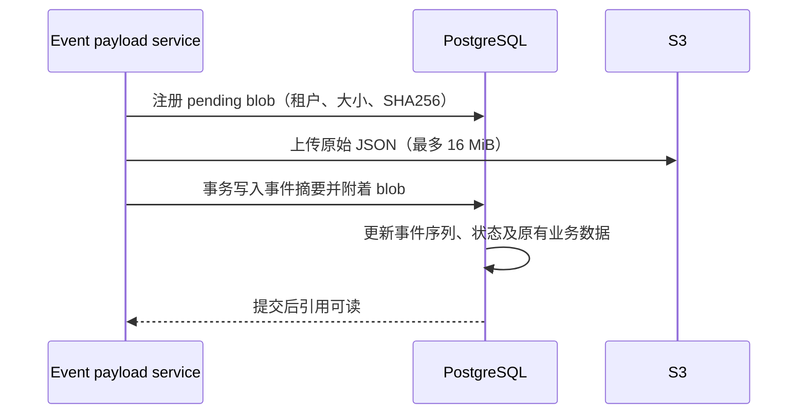

# 事件 payload 外置存储

`session_events` 和 `code_session_internal_events` 新写入的 payload 超过 32 KiB（32768 bytes）时上传到 S3。判断使用提交给存储层的原始 JSON `[]byte` 长度，等于阈值仍内联；不使用字符数、envelope 大小、压缩大小或 PostgreSQL JSONB 的物理大小。worker 入站传输使用同一阈值。

数据库 `payload` 仅保留 `{type, name, blob_ref, size, preview}`。`size` 是完整原始 JSON 的字节数；`preview` 最多取前 512 字节，并回退到完整 UTF-8 字符边界。`blob_ref` 为 `{version: 1, id: "epb_..."}`，不暴露 bucket、object key 或签名 URL。name 没有顶层字符串值时为 null。

## 写入与一致性

S3 I/O 位于 `internal/eventpayload` service 边界，DB 仅通过 Yourbatis 执行元数据事务。每次上传使用独立 UUID key，重复写入不会覆盖历史对象。私有事件的 payload hash、idempotency key 仍基于原始 payload，不能改为摘要 hash；大事件上传前按 workspace 和原始 idempotency key 检查已保存事件，并在同批次去重；已保存事件重试无需访问 S3。并发冲突仍由事务内唯一约束裁决，未插入事件的上传不附着，孤儿对象稍后清理。

`payload_blob_uuid` 是可信的外置标记。仅在该列非空时按 workspace 查询已附着 registry 并读取对象；用户提交同名 `blob_ref` 不会触发对象读取。读取校验实际长度和 SHA256，损坏或缺失返回错误，不把摘要冒充完整事件。公开事件单独保留 `tool_use_id`，维持子会话 SQL 去重规则；旧内联行仍支持从 JSON 提取。

## 读取和 UI

原有事件列表、worker 恢复、激活与公开事件投影继续获得完整 payload。激活先读取数据库快照，再在事务外还原对象，提交时继续比较原始快照及 blob UUID。

所有对外事件接口继续返回完整 payload，不新增路由或查询参数。外置是服务端存储细节：后端读取并验证 S3 对象后还原原有响应，前端沿用原有调用和展示方式。数据库仍保留 preview，但本次不向用户提供摘要模式，也不承诺列表请求避免 S3 读取。

## 生命周期与兼容

历史对象使用 `event-payload/` 前缀，不复用 worker 临时传输对象的 30 天清理策略。只要任一未删除事件引用该对象，就不自动到期。后台在 registry 超过 24 小时且两张事件表均无活跃引用时，原子标记 deleting 并创建对象清理任务。附着操作与清理通过 registry 行锁互斥，已被清理抢占的引用不能提交。删除全部对象版本；首次认领时在同一事务中只创建一个清理任务，失败沿用现有有限重试机制。deleting 墓碑不再被认领，任务完成后不再新增任务。上传超时为 2 分钟，清理前至少等待 24 小时；不额外安排延后补偿，不承诺回收首次清理后才完成的异常迟到上传。

migration 00061 添加 registry、引用列和工具关联列。既有 payload 保持内联，不自动上传历史数据；旧行继续可读。存在外置引用时禁止回滚 migration，必须先还原完整 payload。部署需保留历史对象所在 bucket/prefix，不应给该前缀配置固定 TTL。

## 验收

覆盖 32767/32768/32769 字节阈值、中文 preview 截断、伪造引用、对象长度与摘要校验；真实 PostgreSQL 验证租户隔离、事务回滚、JSONB/nullable 绑定扫描、活跃引用保留及清理抢占。验证原有完整事件接口、私有恢复和激活流程，运行 Go 测试及仓库质量门禁。

集成测试使用独立 PostgreSQL schema，覆盖 API 完整正文往返、32767/32768/32769 字节及 16 MiB 上限、UTF-8 preview、混合内联/外置分页、workspace 隔离、伪造引用、上传失败/尺寸不符、上传期间 epoch 变化导致整批回滚、并发幂等与序号一致性、对象丢失/损坏及恢复，以及真实清理 worker 的等待、活跃引用保护、任务入队失败时事务回滚、失败重试和单次任务终止。故障注入使用可控 ObjectStore，数据库和 HTTP 路由均为真实实现。

运行 `go test ./tests -run '^TestEventPayloadIntegration' -count=1`（干净 checkout 先执行 `./scripts/generate-go.sh`）。设置 `TEST_EVENT_PAYLOAD_S3=1` 可同时运行配置中的真实 S3 兼容存储往返测试；测试只删除自己登记的 UUID 对象，结束时删除临时 schema。现有 activation/worker 传输回归测试继续验证恢复时的历史变化与 32 KiB 传输边界。

## 私有 transcript 归档的 blob 合并

[Transcript 归档](transcript-archive.md) 将满足保留条件的私有事件还原为完整 payload，再逐字写入压缩段。归档使用现有 bucket 的 `transcript-archive/` 前缀；该前缀同样不得配置固定 TTL。仅在回读校验、注册表 attached 后才软删除原事件，归档段独立保留全部 payload 与恢复所需元数据。

软删除后旧 blob 不再有活跃事件引用，沿用既有 24 小时 registry 年龄与引用检查 GC，不引入新 blob 回收规则。这意味着旧 blob 可能早于 transcript 的 14 天物理删除观察期被清理。需要回滚时通过还原 CLI 从归档段重建 blob 并在事务中附着；仅设置 deleted_at=NULL 不能恢复已删除对象。公开事件 payload 的生命周期不变。
