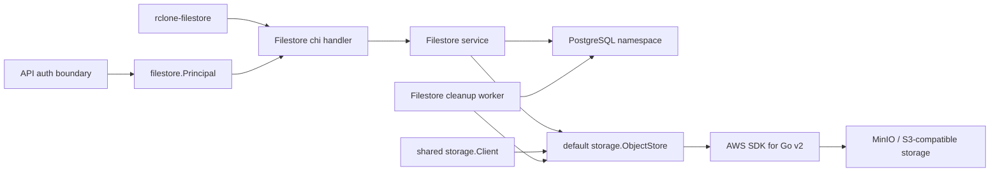
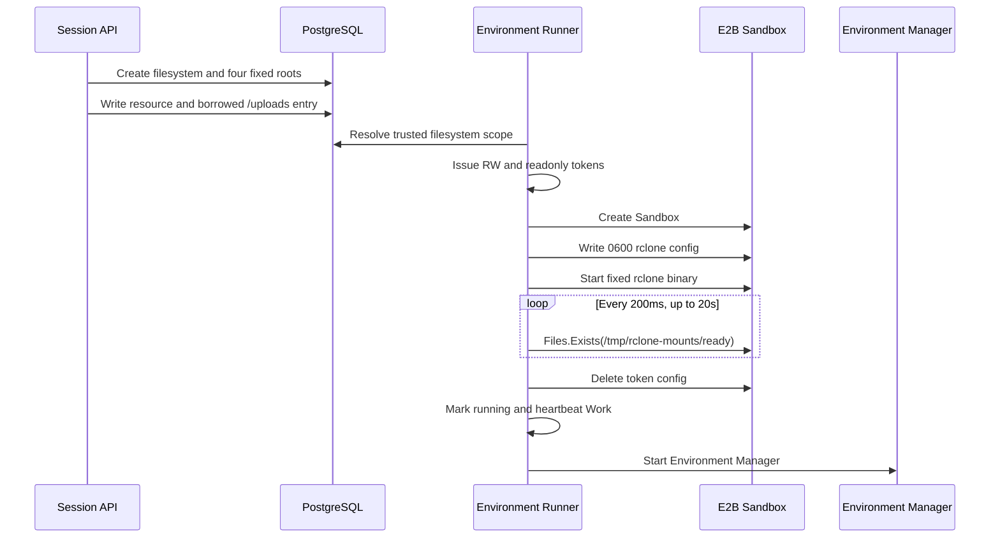
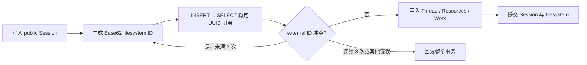
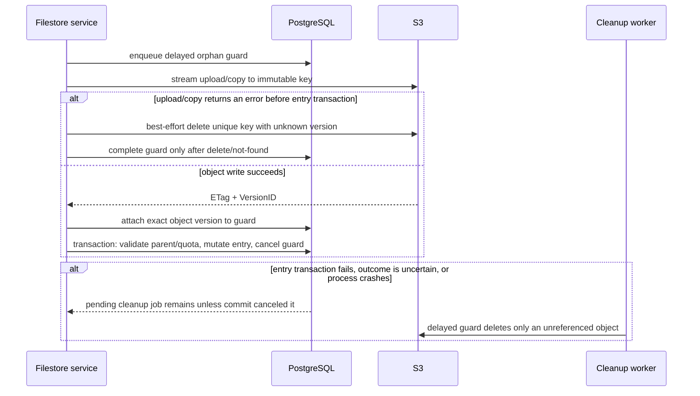

# Filestore 后端设计

## 范围

本实现提供 `rclone-filestore` 已确认调用的 10 个接口：

- `POST /v1/filestore/fs/listDirectory`
- `POST /v1/filestore/fs/makeDirectory`
- `POST /v1/filestore/fs/removeDirectory`
- `POST /v1/filestore/fs/createFile`
- `POST /v1/filestore/fs/copyFile`
- `POST /v1/filestore/fs/moveFile`
- `POST /v1/filestore/fs/moveDirectory`
- `POST /v1/filestore/fs/readFile`
- `POST /v1/filestore/fs/removeFile`
- `POST /v1/filestore/fs/readMetadata`

反向分析文档中只有 message schema、没有已确认 HTTP 路由的 FileUpload、ImportZip、MigrateFilesystem、RemoveFilesystem 等 11 组消息不在本次范围内。

## 组件和依赖边界

Filestore 是现有单体中的独立资源切片。handler 负责 wire contract 和流式 HTTP，service 负责校验及业务编排，`internal/db` 负责事务和租户范围内的持久化。对象读写、错误分类和版本清理统一交给绑定单个 bucket 的 `internal/storage.ObjectStore`；生产环境由共享 `storage.Client` 复用 AWS SDK 连接，再按名称派生轻量对象存储。

Filestore 还拥有独立的 `filestore.Principal`。API 中间件完成专用 JWT 验证与数据库回查后，只把资源所需的租户、account、filesystem 和策略范围映射到该类型，并通过 Filestore 私有的 context key 交给 handler。全局 `auth.Principal` 不保存 `filesystem_id`、`readonly`、`org_taints` 或 CMEK 等 Filestore 专属状态；Filestore handler/service 也不依赖全局 Principal。



应用启动时只创建一个 `internal/storage.Client`，再用配置中的默认 bucket 名派生并检查一个 `storage.ObjectStore`，供 Files、Skills、Batches、Memory 和 Filestore 共享。`Client.ForBucket(name)` 不新建网络连接，只生成不可变的 bucket 作用域对象存储；通用对象清理 worker 因任务本身持久化了 bucket 名，直接按每条任务选择对象存储，因此可以在同一 endpoint、region 和凭证范围内清理多个 bucket。各资源统一依赖 `storage.ObjectStore` 的 `Upload`、`Open`、`Copy` 和 `Delete` 操作，不再保留旧 `Put/Get/Delete` 方言或 Filestore 专属适配接口。`UploadOptions.Size` 区分已知长度与未知长度流；`Open` 的可选字节区间支持范围读取；`DeleteOptions` 分别表达普通删除、精确版本删除和同键全部版本清理。S3 错误分类、版本查询及删除标记清理由共享实现统一负责。

数据库访问采用渐进迁移：Files API 的创建、读取、列表/游标分页、软删除、对象清理任务和配额账本更新全部使用 `sqlx` 的命名参数与结构体映射；创建和软删除分别在一只 `sqlx.Tx` 中持有 workspace lock 并更新账本。Filestore 独立查询、目录枚举、命名空间写入、filesystem cleanup job 处理、对象清理任务状态变更及工作区用量读取也使用相同边界。Session API 与手动 Deployment Run 内嵌 Session 都复用 `insertSessionSQLXTx`，Session、filesystem、固定根目录、thread、resources、File resource 对应的 Filestore entry 和 environment work 只保留一条创建路径；手动 Run 的 deployment 锁、初始 events、run row 和 `last_run_at` 也在同一只 `sqlx.Tx` 中提交。单独新增或删除 resource 会锁定活动 Session，并在同一只 `sqlx.Tx` 中同时维护 resource 与对应的 Filestore entry，避免 API 合同和 filesystem namespace 分叉。创建、覆盖、移动和删除普通 entry 时，workspace/filesystem advisory lock、`FOR UPDATE` 校验、容量账本变更与清理任务写入全部加入同一只 `sqlx.Tx`，不会在一次业务事务中混用 `pgx.Tx` 与 `sqlx.Tx`。本期未实质修改的 Session 删除事务和 TTL 到期扫描仍保留既有原生 `pgx.Tx` 事务链。`sqlx` 通过 `pgx/stdlib` 复用应用唯一的 `pgxpool`，`database/sql` 包装层的空闲连接上限固定为 0，物理连接数量与寿命仍由 `pgxpool` 统一管理。

## 鉴权和租户边界

Filestore 是服务的固定能力，对象存储在应用启动阶段初始化并校验，HTTP 路由不会按依赖是否为 nil 选择性挂载。`/v1/filestore` 整个资源命名空间使用独立中间件并输出扁平错误 `{code,message}`；受限凭证只能进入这一命名空间，具体操作、HTTP 方法、尾斜杠和子路径是否合法由 Filestore handler 按线协议判定。路径匹配以 `/v1/filestore` 路径段为边界，不会误放行 `/v1/filestores` 等相邻资源。

Filestore 只接受 `Authorization: Bearer` 中的专用 Filestore JWT。它使用原始 compact JWT，不带 `sk-ant-si-` 前缀；验证器固定 EdDSA、`kid` 与严格 Base64URL 解码。生产环境与 session ingress 可读取同一份 Ed25519 私钥文件，但两者的 claims、token 外形和验证入口完全分离。`X-Api-Key`、workspace API key、`sk-ant-oat01-` OAuth-compatible token 与 `sk-ant-si-` session-ingress JWT 均不能访问 Filestore；Code Session Ingress 和 `/v1/messages` 的鉴权逻辑保持不变。

Filestore JWT 包含以下注册 claims 与业务 claims：

| Claim | 约束 |
|---|---|
| `iss` | 固定为 `open-managed-agents` |
| `sub` | 非空的主体标识 |
| `aud` | 必须包含 `filestore` |
| `iat` / `exp` | 签发时间与到期时间必填；当前有效期固定为 1 小时 |
| `org_uuid` | 必须匹配文件系统所属组织 |
| `account_uuid` | 必须匹配同组织内未删除账号 |
| `workspace_uuid` | 必须匹配未归档工作区 |
| `workspace_tagged_id` / `resolved_workspace_tagged_id` | 当前未引入 workspace alias，两者均必须匹配 `workspace.external_id` |
| `filesystem_id` | 绑定唯一 filesystem，请求中改用同工作区的其他 ID 也会被拒绝 |
| `org_taints` | 规范化后必须与当前组织策略一致 |
| `workspace_cmek_enabled` | 必须与当前 workspace CMEK 状态一致 |
| `readonly` | 仅第二类 token 携带，且只允许为 `true`；禁止目录、文件的所有变更操作 |

第一类读写 token 不序列化 `readonly`；第二类 token 只能通过专用的 `IssueReadonly` 入口签发，避免出现语义含混的 `readonly:false`。验证器除固定算法与 `kid` 外，还强制校验 issuer、audience、签发时间和到期时间；token 有效期内的每次请求仍会回查数据库范围和当前安全策略，因此 Session 生命周期或组织策略变更可立即撤销权限。

### 手动签发测试 token

仓库提供 `cmd/filestore-token` 命令，供受信的本地或联调环境手动签发 token。命令必须从服务配置的 `code_session.jwt_signing_private_key_file` 读取同一份持久化 Ed25519 私钥，但只调用 Filestore 专用签发器；即使服务运行在开发环境，CLI 也不会另行生成进程级临时密钥，因为两个进程各自生成的密钥无法互相验签。它不会生成或改动 code-session ingress token。签名私钥和输出 token 都属于敏感凭证，不能提交到版本库或写入共享日志。

```bash
go run ./cmd/filestore-token \
  --config ./config/config.yaml \
  --sub user_7a5ba5ee33aa4889a6faa3a5 \
  --org-uuid 75051658-a107-42ad-8707-7618924bf3d3 \
  --account-uuid 7a5ba5ee-33aa-4889-a6fa-a3a57b1850a0 \
  --workspace-uuid cc435033-51c4-4540-9b2d-8ba5b2ac971e \
  --workspace-tagged-id wrkspc_8DQcID3SPMzdSG1e8o8Wolcw \
  --filesystem-id claude_chat_01RT5CfCZf9we7Gu6cWsnvZR
```

命令只向标准输出写一行原始 compact JWT，便于直接捕获：

```bash
FILESTORE_TOKEN="$(go run ./cmd/filestore-token ...必需参数...)"
curl -H "Authorization: Bearer ${FILESTORE_TOKEN}" http://127.0.0.1:38080/v1/filestore/fs/...
```

- `--resolved-workspace-tagged-id` 默认等于 `--workspace-tagged-id`。
- 组织有多个 taint 时重复传入 `--org-taint`。
- workspace 已启用 CMEK 时传入 `--workspace-cmek-enabled`。
- 默认签发读写 Token 1；增加 `--readonly` 后签发携带 `readonly=true` 的 Token 2。
- token 自签发起 1 小时后失效；长时间 mount 或联调需要在到期前重新签发并更新客户端凭证。
- 所有身份和策略字段都必须与当前数据库一致，且 `filesystem-id` 必须已经存在，否则服务端验签后的范围回查仍会拒绝请求。

当前公开合同没有 filesystem 创建接口，Filestore 鉴权也不会根据其他凭证惰性建档。public Session 创建事务会自动建立唯一 filesystem，并在同一事务中建立 `/outputs`、`/uploads`、`/transcripts`、`/tool_results` 四个固定一级目录；JWT 在 sandbox 启动等受信边界按需签发，不持久化。请求改用同 workspace 的其他 filesystem、同名 filesystem 已被其他 Session 绑定，或数据库记录尚未创建时，都必须拒绝，不能改绑或泄露其存在性。每次鉴权还会回查所属 Session；Session 一旦归档、终止或删除，既有 JWT 立即失效。

四个一级目录是 Sandbox 运行时合同，不是普通用户目录：通用 Filestore mutation 不能移动或删除固定根、覆盖固定根，也不能把目录跨固定根边界移动；同一固定根内部的普通目录移动和删除仍按既有规则执行。这样 filesystem 的目录树始终由数据库维护，同时不会在 Session 启动时重新扫描、清空或修复 `/uploads`。

`filesystemId` 同时允许 tagged external ID 和 UUID。查询同时命中两列时必须优先选择精确 `external_id`，仅在 external ID 未命中时才按内部 UUID 解析；JWT scope 回查与资源层查询使用相同优先级，避免跨命名空间的非确定选择。

## E2B Sandbox 固定挂载

Cloud Session 的 Environment Runner 在创建 E2B Sandbox 前，从数据库读取 Session、唯一 filesystem、workspace、organization 和创建该 Session 的可信账号链。Runner 不接受客户端提供的 token claims，也不新增 Filestore HTTP 签发路由；它复用进程内唯一的 Filestore signer，分别签发当前固定一小时有效期的读写 Token 和只读 Token。

filesystem 的数据库 namespace 在 Session/resource 写事务完成时已经就绪。Runner 不扫描、不清空、不调和 `/uploads` 子树，也不复制 Files 对象；它只读取当前 Session 的可信 filesystem scope、签发挂载 Token 并创建 Sandbox。Sandbox 创建后使用下面的固定 multimount 合同：

| Source | Destination | 权限 | metadata cache |
| --- | --- | --- | --- |
| `/outputs` | `/mnt/user-data/outputs` | 读写 | 3600s |
| `/uploads` | `/mnt/session/uploads` | 只读 | 1s |
| `/transcripts` | `/mnt/transcripts` | 只读 | 10s |
| `/tool_results` | `/mnt/user-data/tool_results` | 只读 | 3s |

四个挂载统一使用 `uid=999`、`gid=1000`、目录权限 `0755`、文件权限 `0644`、`vfs_cache_mode=full` 和 `vfs_cache_max_size=1G`。`/outputs` 使用读写 Token，其余三个 source 共享只读 Token；`filesystem_id` 是当前 public Session 唯一 filesystem 的 external ID，`service_url` 直接取 `code_session.sandbox_api_base_url`。

Runner 先通过 E2B Files API 完整写入强类型 JSON，再将 `/tmp/rclone-mount-config.json` 权限设置为 `0600`。文件写入完成后才直接执行固定镜像命令，不使用 stdin bootstrap、临时文件或 shell trap：

```bash
/opt/rclone/rclone-filestore multimount --config /tmp/rclone-mount-config.json
```

Runner 启动 rclone 后只使用 E2B Files API 探测 `/tmp/rclone-mounts/ready`，每 `200ms` 一次，最长 `20s`，不执行 Sandbox shell wait 命令，也不探测进程 PID。ready 后立即删除包含 Token 的配置文件；Token 不进入 shell command、环境变量、Session metadata 或 Environment Work metadata。当前不刷新 mount Token，超过一小时的 Sandbox 行为不在本期处理。



Session 与 Deployment File resource 的公开合同固定为：

```json
{
  "type": "file",
  "file_id": "file_abc123",
  "source": "/uploads",
  "mount_path": "/workspace/data.csv"
}
```

`source` 省略时由服务端补为 `/uploads`，显式传入 `null` 或其他值均拒绝。`mount_path` 使用绝对路径形式表达 `/uploads` namespace 中的路径，不是 Sandbox 根目录中的任意目标；示例的 Filestore 路径是 `/uploads/workspace/data.csv`，Sandbox 访问路径是 `/mnt/session/uploads/workspace/data.csv`。未传 `mount_path` 时使用 `/<file_id>`，对应 `/mnt/session/uploads/<file_id>`。

Session 创建、后续添加 resource 和 Deployment 创建/更新共用同一校验：拒绝相对路径、根目录、点路径段、空路径段，以及 File resource 之间的重复路径和祖先/后代冲突，并限制每个 Session 或 Deployment 最多 100 个 File resource。后续添加 resource 时，数据库在一只 `sqlx.Tx` 内锁定活动 Session、读取当前 resources、执行同一校验，并同时插入 resource 与 `/uploads` entry，因此并发请求不能绕过路径冲突和数量上限，也不会留下只有一侧成功的状态。Deployment 手动运行把已规范化的 resource 原样写入 Session resource，不再保留旧的 `/mnt/session/uploads/<file_id>` 语义。File path 全部隔离在固定 uploads 根目录内，因此不与 Git repository、memory store 或 Sandbox 系统路径冲突。rclone ready 后整个 `/uploads` namespace 已直接可见，不再执行逐文件软链接 projection。

运行中新增或删除 File resource 直接改变同一 `filesystem_id` 下的数据库 namespace；已经挂载的 Sandbox 在 rclone 的 metadata cache 刷新后看到变化，`/uploads` 当前固定为 `1s`。这不是 Runner 热挂载或逐文件投影：FUSE mount 本身不变，变化来自其后端 namespace。API 成功响应表示 resource 与 entry 已在同一事务中提交，不需要等待下一次 Sandbox 启动。

### File resource 数据库引用

File resource 写入时，服务在当前 workspace 中解析并锁定活动 Files API 记录，然后在 Session filesystem 中插入一条借用对象的 file entry。entry 路径固定为 `source + mount_path`；例如 `source=/uploads`、`mount_path=/workspace/data.csv` 生成 `/uploads/workspace/data.csv`。entry 保存源 File 的稳定 UUID、大小、media type、SHA-256、bucket 和 object key，并以内部 `managed_by` 与 `managed_resource_external_id` 绑定创建它的 Session resource。Filestore HTTP metadata 不能伪造这些内部字段。

这个 entry 只增加数据库中的 namespace 引用，不复制 S3 对象，也不创建新的 blob key。源对象仍由 Files API 拥有并只计入 `files_bytes`；借用 entry 不计入 `filestore_bytes`，workspace 总存储因此只计算一次。工作区用量重算也必须排除带源 File 引用的 entry。

删除 File resource 时，同一事务只软删除 resource 与它拥有的精确 entry，不递归清空 `/uploads`，也不修剪数据库维护的父目录；普通 Filestore 覆盖、移动、删除和递归删除不能接管或清理这种受管理引用。删除 Session/filesystem 时可以退休引用 row，但不能为共享的 Files 对象创建 object cleanup job，也不能扣减未曾计入的 Filestore 用量。只要活动 Session filesystem 仍有引用，Files API 就拒绝删除源 File；源 File 删除与 resource 新增分别持有冲突的行锁，避免并发删除后留下悬空对象。

Environment Manager 不再接收 `type=file` resource。它只在 rclone ready 后看到已经完成的 `/uploads` 文件系统视图；File 的下载、路径投影或内容刷新均不属于 Environment Manager 职责。

Provider Sandbox 创建前的失败会停止 Environment Work，且不会创建 Sandbox；创建后的任一步失败都会把 Sandbox 标记为 `failed`、停止 Environment Work 并 Kill provider Sandbox。Environment Manager 不会在失败路径启动。ready 失败路径也会 best-effort 删除 Token 配置。错误和日志只保留阶段与脱敏原因，不包含 Token 或完整配置。

## 数据模型

迁移 `00018_add_filestore.sql` 新增：

- `filestore_filesystems`：保存自身的内部 bigint ID、稳定 UUID、workspace 内的外部 ID；组织、工作区、public session、可选 code session 与创建 API key 均以稳定 UUID 绑定，避免租户搬迁或跨库合并时依赖源库 identity 值。
- `filestore_entries`：统一保存 file/directory、规范化绝对路径、parent path、响应元数据、hash、TTL 和不可变 S3 object reference；Session File resource 的借用 entry 另保存源 File UUID 以及不可由 HTTP metadata 设置的 ownership 列。组织、工作区、filesystem 及可选创建者引用均保存对应 UUID，不冗余保存其他表的 identity 或 filesystem external ID。

迁移 `00019_add_workspace_storage_usage.sql` 新增 `workspace_storage_usage`。它按工作区分别保存 Files API 与 Filestore 的有效字节数，是配额判定的事务型投影，不是最终文件事实来源；迁移会从两类文件记录建立一次基线，后续由资源写事务按增量维护。

迁移 `00023_provision_session_filesystems.sql` 建立“同一 Session 只能拥有一个有效 filesystem”的唯一部分索引，并为历史未软删除的 Session 回填缺失记录。创建索引前会检查历史重复；发现同一 Session 存在多个有效 filesystem 时迁移直接中止，不猜测应保留哪一条。迁移 `00024_use_uuid_filestore_entry_references.sql` 进一步把 entry 的组织、工作区、filesystem 和创建者引用改为稳定 UUID；旧引用存在孤立或租户错配时同样中止迁移。迁移 `00026_validate_filestore_filesystem_reference_scopes.sql` 在最终 UUID schema 上补验 filesystem 的组织、工作区、Session、Code Session 与 API Key 归属链，弥补早期回填只核对主键和 external ID 的不足。迁移 `00027_add_filestore_entry_management.sql` 在短事务中新增内部 ownership 列及 `NOT VALID` 形状约束，`00028_validate_filestore_entry_management.sql` 再以较弱锁单独验证历史行；两列必须成对为空或成对非空。迁移 `00029_add_filestore_file_references.sql` 新增 `source_file_uuid`、活动引用索引、每个 Session resource 唯一活动 entry 约束，并为历史活动 filesystem 补齐四个固定根目录；已有同名 entry 只有在它确实是 `parent_path=/` 的普通目录时才会复用，否则迁移中止。借用 entry 允许没有 Files API 未提供的 MD5，但必须与非过期的 `session_file_resource` 管理关系双向对应。`00030_validate_filestore_file_references.sql` 再单独验证放宽后的 blob 形状和 File reference 形状两个 `NOT VALID` 约束。回滚 `00029` 时只要仍有借用引用就明确失败；四个普通目录 row 会保留，因为 schema 没有把迁移回填目录与原有用户目录做额外标记，盲目删除会破坏数据。所有这些引用都由应用维护，不增加 PostgreSQL 外键。

根目录 `/` 是由 filesystem 合成的虚拟目录，不写 marker row 或 S3 marker object；四个固定一级目录是真实 directory entry，由 filesystem 创建事务写入，历史活动 filesystem 通过迁移补齐。文件系统和目录节点的归属都使用 `organization_uuid`、`workspace_uuid`、`filesystem_uuid` 等稳定引用；entry 的创建者审计 UUID 直接继承已经过租户链校验的 filesystem 归属，不再从 Filestore 请求构造空的内部主键 actor。请求进入数据库后仍可使用当前库内部 ID 取得工作区用量锁与 filesystem 锁，但 entry 的持久化与热查询只使用 UUID 边界。schema 不创建 PostgreSQL 外键；源 File UUID 的完整性由同事务行锁、删除守卫和 E2E 测试维护。

文件对象 key 固定为：

```text
workspaces/{workspaceUUID}/filestores/{filesystemUUID}/blobs/{blobUUID}
```

覆盖、复制会写入新的 blob key；移动文件和移动目录只原子更新数据库路径。这样历史对象不会因同 key 覆盖而产生读写竞态。

## Session 归属与自动建档

public Session 是 filesystem 的生命周期归属者；Code Session 只是可重建的执行实例，调度、重试或替换 Code Session 都复用同一个 filesystem。因此新建记录的 `code_session_uuid` 固定为 `NULL`，按 Session 查询 filesystem 时也不使用 Code Session 作为所有权条件。

普通 Session 与 Deployment Session 最终都进入共享的 `insertSessionSQLXTx`。Session 行写入后，事务立即通过 `INSERT ... SELECT` 解析并保存 `organization_uuid`、`workspace_uuid`、`session_uuid` 和 `created_by_api_key_uuid`，创建四个固定一级目录，再继续写 Thread、Resources、File resource 引用 entry 与 EnvironmentWork；任一步失败都回滚整个 Session 图。

filesystem external ID 的格式为 `claude_chat_<24 位 Base62>`。生成器使用 `crypto/rand`，只接受小于 248 的随机字节，再以 `% 62` 映射字符；248 是不超过 256 的最大 62 倍数，因此不会产生取模偏差。24 位 Base62 约有 143 bit 熵、约 `1.04 × 10^43` 种组合；即使生成十亿个 ID，理论碰撞概率也约为 `4.8 × 10^-26`。随机性只降低碰撞概率，数据库仍是最终裁决者：

- `(workspace_uuid, external_id)` 唯一约束覆盖软删除记录，禁止复用历史 ID；
- 插入使用 `ON CONFLICT ON CONSTRAINT ... DO NOTHING RETURNING`，只在 external ID 冲突时重新生成，最多尝试 3 次；
- `(workspace_uuid, session_uuid) where deleted_at is null` 唯一部分索引阻止并发为同一 Session 建立两个有效 filesystem；
- 随机源失败、租户引用无效或连续 3 次碰撞都会返回错误，并由外层事务回滚 Session。



## 目录查询与键集分页

目录枚举以 PostgreSQL 中的 `filestore_entries` 为事实来源，不调用 S3 `ListObjects`。S3 只保存文件字节，目录结构、文件元数据、软删除和 TTL 可见性均由数据库决定。每个持久化节点同时保存完整 `path` 和直接父目录 `parent_path`：

| `kind` | `path` | `parent_path` |
|---|---|---|
| directory | `/docs` | `/` |
| file | `/docs/a.txt` | `/docs` |
| directory | `/docs/archive` | `/docs` |
| file | `/docs/archive/2025.pdf` | `/docs/archive` |
| file | `/docs/b.txt` | `/docs` |

根目录 `/` 不写入 `filestore_entries`，而是由 filesystem 记录投影出的虚拟目录。除根目录外，开始枚举前会先确认目标路径存在、尚未过期且 `kind = 'directory'`。完整请求依次执行以下边界检查：

1. service 根据 JWT Principal 中的 workspace 和 filesystem scope，将请求的 external ID 或 UUID 解析为内部 filesystem ID，并确认其与 token 绑定的 filesystem 一致。
2. DB 先把内部 ID 解析为已校验的 filesystem，再以其 `workspace_uuid` 与 `filesystem_uuid` 查询 entries，保证目录读取方法自身不依赖调用方隐式维持租户边界。
3. 非根路径查询对应 entry，确认目标是当前可见目录。
4. 查询这一页目录节点，并将数据库行映射为 Filestore wire payload。

### 直接子节点查询

`recursive=false` 时使用物化的 `parent_path` 精确定位直接子节点。假设请求 `/docs`、`limit=2`，核心查询等价于：

```sql
select ...
from filestore_entries
where workspace_uuid = $1
  and filesystem_uuid = $2
  and deleted_at is null
  and (expires_at is null or expires_at > now())
  and parent_path = '/docs'
order by path asc, id asc
limit 3;
```

数据库实际读取 `limit + 1` 条。以上示例按顺序得到 `/docs/a.txt`、`/docs/archive`、`/docs/b.txt` 时，响应只返回前两条；第三条只用于判定 `hasMore=true`。下一页游标保存本页最后一条的 `(path, id)`，例如 `('/docs/archive', 12)`。

下一页不使用 `OFFSET`，而是追加键集条件：

```sql
and (
  path > '/docs/archive'
  or (path = '/docs/archive' and id > 12)
)
order by path asc, id asc
limit 3;
```

这样数据库可以从上一页的排序位置继续扫描，不需要重复读取并丢弃前面所有结果，也不会因为 cursor 之前删除了一条记录而产生 `OFFSET` 位移。只有确有下一页时响应才携带 cursor；最后一页返回空 cursor，rclone 据此停止翻页。

直接子节点查询由部分索引 `(workspace_uuid, filesystem_uuid, parent_path, path, id) where deleted_at is null` 支持。索引顺序同时覆盖租户范围、目录范围和分页排序，数据库扫描到 `limit + 1` 条后即可停止。

### 递归查询

`recursive=true` 时不再限制 `parent_path`，而是查询目标路径下的全部后代。匹配包含目录分隔符，确保 `/docs` 不会误包含 `/docs-old`：

```sql
and left(
  path,
  char_length('/docs') + 1
) = '/docs/'
order by path asc, id asc
```

对于上面的示例，递归结果依次包含 `/docs/a.txt`、`/docs/archive`、`/docs/archive/2025.pdf` 和 `/docs/b.txt`，但不包含目录 `/docs` 本身。递归与非递归查询使用相同的 `(path, id)` 游标规则。直接目录查询可以完整利用 `parent_path` 索引；递归前缀表达式在超大 filesystem 上可能扫描更多活动节点，后续如成为性能热点，可改为可索引的路径上下界或 PostgreSQL `ltree`。

### Cursor 范围与一致性

cursor 是版本化的 Base64URL JSON，包含 filesystem ID、查询目录、`recursive` 模式以及最后一条 `(path, id)`。服务端要求这些查询范围与下一页请求完全一致，因此一个目录或递归模式生成的 cursor 不能直接用于另一种查询。cursor 当前不签名，也不是授权凭证；伪造 cursor 最多改变当前授权目录内的起始位置，workspace 与 filesystem 权限仍会在每次请求中重新校验。

每一页是独立 SQL 语句，因此当前语义是稳定排序下的实时遍历，而不是分页开始时的数据库快照：cursor 之后新建的节点可能出现在后续页，cursor 之前新建的节点不会补入本轮遍历；删除、过期或跨 cursor 改名也可能使节点消失、遗漏或按新路径再次出现。键集分页解决的是 `OFFSET` 位移和深页性能问题；如果未来合同要求严格快照，则需要额外引入 listing revision、长事务快照或变更序列。

## 写入、配额与清理

上传保持流式：请求 body 不落本地临时文件，AWS v2 multipart uploader 使用有限 part size 和并发度；读取过程中同时计算实际字节数、MD5 和 SHA-256。`storage.max_file_bytes` 在流式边界执行，`storage.workspace_limit_bytes` 配额同时统计 Files API 对象和 Filestore 自有对象；指向 Files API 对象的借用 entry 不重复计费。

正常配额检查只锁定并读取当前工作区的一行 `workspace_storage_usage`，成本不随文件数量增长。文件创建、覆盖、覆盖式移动、删除、递归删除和 TTL 清理分别计算字节增量，并与资源变更在同一个 PostgreSQL 事务内提交；事务失败时预留或释放的用量也一并回滚。账本列带有非负约束，避免重复扣减静默掩盖一致性问题。`ReconcileWorkspaceStorageUsage` 可在迁移校验或低频运维任务中持有同一工作区锁后重新聚合事实表并修正账本，但不进入普通请求路径。



进入 entry 写事务后，service 不根据返回的 `COMMIT` error 立即删除对象：网络型错误可能使提交结果未知。事务若实际成功，guard 已与 entry 在同一事务内取消；若没有提交，pending guard 会在延迟窗口后清理对象。只有在尚未进入该事务且能确定没有 entry 引用时（例如 upload/copy 返回错误、超出单文件上限或 guard version 绑定失败），才执行 best-effort 立即删除。对象存储返回错误时提交结果仍可能不确定，因此在 VersionID 未知时通过 `DeleteOptions.AllVersions` 清理该次写入独占的唯一 key；立即删除失败则保留 guard 供 worker 重试。

普通自有对象的覆盖、删除、递归删除和 TTL 过期在同一个数据库事务中软删除/替换 entry、更新用量账本，并写入 `filestore_object_cleanup` job。借用 Files 对象的 entry 不进入这条对象清理路径，只能由对应 resource 或 filesystem 生命周期退休数据库引用。独立 worker 复用应用级 `storage.Client`，按每条 job 持久化的 bucket 派生对象存储，再使用 AWS v2 按 key 和 VersionID 幂等删除；因此同一 endpoint、region 与凭证范围内的多个 bucket 可由同一 worker 清理。provider not-found 视为成功，bucket 解析或对象删除失败使用有界重试。完成/失败状态转换同时校验唯一 worker lease token 与未过期租约，过期 worker 不能改写被重新领取的 job。worker 在领取后崩溃或失联时，过期租约会累计独立的连续未确认次数；达到上限后任务进入 `failed`，而正常完成一批 filesystem 清理或显式记录一次业务失败都会清零该计数，因此合法的多批处理不受租约崩溃上限影响。

删除 Session 时，同一短事务只软删除 filesystem 并投递一个 `filestore_filesystem_cleanup` 父任务，不遍历全部 entry，也不调用 S3。worker 每次最多退休 100 个文件 entry：Filestore 自有对象生成精确版本的 `filestore_object_cleanup` 子任务并扣减容量，借用 Files 对象的 entry 只退休数据库 row；仍有文件时父任务重新入队，文件全部退休后再批量软删除目录并完成父任务。对象删除由既有对象清理 worker 独立重试，因此 Session 删除延迟不随文件数量或对象存储响应时间增长。

两类 Filestore cleanup job 的持久化 payload 都只保存 `workspace_uuid` 与 `filesystem_uuid`，不保存 `workspace_id`、`filesystem_id` 或冗余的 filesystem external ID。`jobs.workspace_id` 是通用任务表在当前数据库中的路由缓存，不是 Filestore 清理任务的权威归属：worker 取得租约时用 payload UUID 重新关联 workspace 与 filesystem，得到当前库的 bigint ID 后修正该缓存；整 filesystem 清理进入事务后也再次按 UUID 解析并锁定当前记录。迁移会先验证每条历史 bigint 引用都能解析且归属一致，再改写 payload；发现孤立或错配引用时直接中止，避免恢复或合库后把任务指向另一条恰好复用了相同 identity 的记录。

到达 `expires_at` 后，读路径立即隐藏文件；其字节数则在 TTL sweep 成功软删除该 entry 时释放。这个短暂的保守计费窗口由 sweep 周期限定，换来账本不依赖墙钟自行变化，并保证资源状态、清理任务和额度释放始终原子一致。

若进程在上传完成后、回填 VersionID 前退出，orphan guard 会以空 VersionID 进入清理；对启用或暂停版本控制的 bucket，清理器分页枚举该精确 key 的全部对象版本和 delete marker 后逐一删除，对未启用版本控制的 bucket 则执行普通对象删除。由于 blob key 每次写入都唯一，这不会误删其他 entry 引用的对象。

namespace 写入按 filesystem advisory lock 串行化；所有可能改变字节数的操作先获取 workspace lock，再获取 filesystem lock，从而与 Files API 共享同一配额串行点。事务内判断目标 entry 是否过期时使用 PostgreSQL 的 `now()`，避免 API 进程与数据库时钟漂移造成错误覆盖或配额差值。TTL 批处理也先按 ID 升序取得全部 workspace lock，再按 ID 升序取得 filesystem lock，维持一致锁序并避免批处理死锁。

## Wire contract

- JSON 请求按 ProtoJSON 的 lowerCamelCase 字段解析，拒绝未知字段；int64 同时接受十进制 JSON string 和整数 number 表示，响应始终编码为 string。
- `createFile` 接受顺序固定的 `params` JSON part 和 `file` 流 part。
- `readFile` 直接代理原始 body，不生成 pre-signed URL；range 由 JSON body 中的 `{offset,length}` 表达，`length=-1` 表示读到末尾，`length=0` 返回空流。
- list 使用按 path、row ID 排序且绑定 filesystem/path/recursive 参数的不透明 cursor。
- File 的 MD5 使用小写十六进制；时间使用 UTC RFC 3339 Nano。
- File 的 `workspaceTaggedId` 是上游协议对文件条目 external ID 的历史命名，不是 JWT 中的 `workspace_tagged_id`；内部 DTO 以 `EntryTaggedID` 明示这一差异。
- `authorizationMetadata.downloadable` 是普通 proto3 bool：message 存在但字段省略时取 `false`；整个 `authorizationMetadata` 省略时沿用 Filestore 的默认可下载行为。
- 所有协议错误使用扁平 `{code,message}`；逻辑 entry 存在但 blob 丢失按内部一致性错误处理，不伪装成普通 path not-found。

## 验收

自动化覆盖协议编解码、10 条路由、JWT 路由隔离、Session 自动建档与四根目录回滚、File resource 与借用 entry 的原子增删、源 File 删除并发守卫、Session 生命周期撤权、service 编排、AWS v2 请求、DB 不变量、清理重试和 TTL；用量账本另行覆盖共享限额并发、借用对象不重复计费、事务回滚、覆盖差值、覆盖式移动、递归删除与 TTL 释放。真实验收使用本地 PostgreSQL/MinIO 启动服务，再从 OrbStack 虚拟机运行 `/home/arthur/rclone-filestore`，验证目录创建、上传、列表、范围/完整读取、复制、移动、删除和 multimount 生命周期；E2B 验收另确认 Files API resource 形成的 `/uploads` 引用可以读取且不会生成第二份对象。
