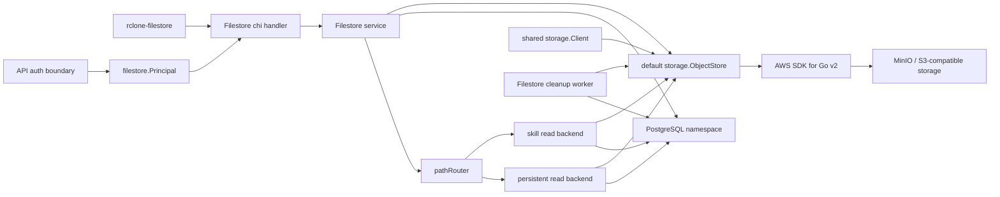
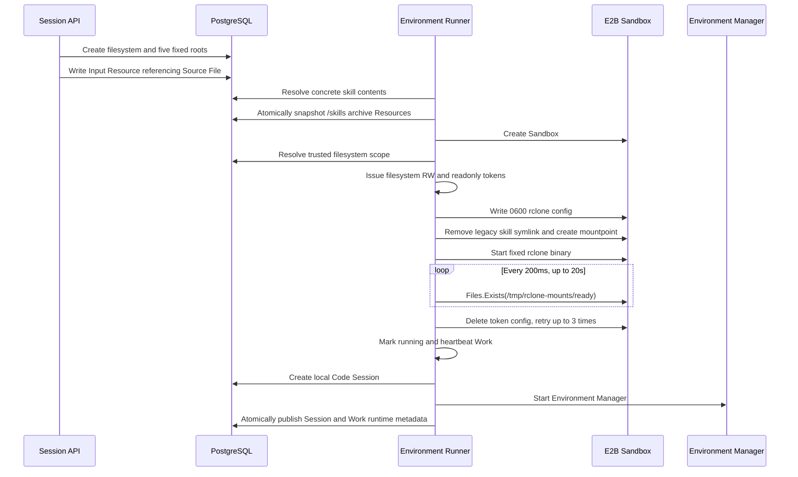
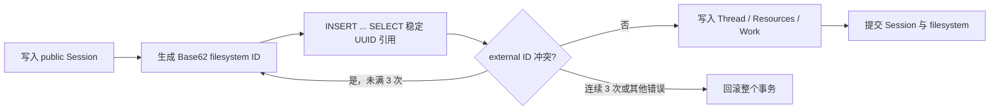
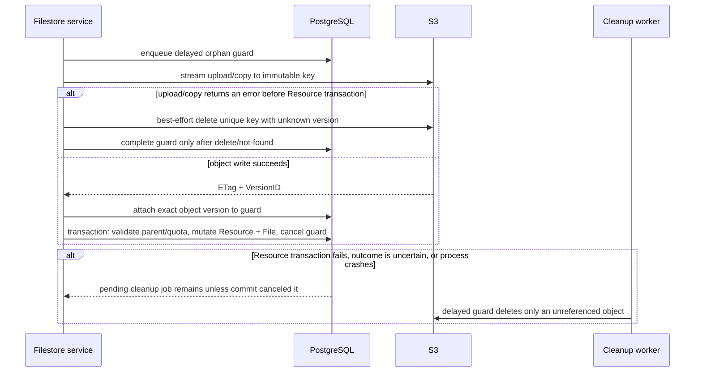

# Filestore 后端设计

> Session Resource/File 统一的最终裁决、迁移 identity 矩阵、事务不变量和 PR reviewer
> 检查清单见 [Session Resource 与 File 统一持久化评审指南](./session-resource-file-unification.md)。

## 范围

本实现提供 `rclone-filestore` 已确认调用的 10 个接口：

- `POST /v1/filestore/fs/listDirectory`
- `POST /v1/filestore/fs/makeDirectory`
- `POST /v1/filestore/fs/removeDirectory`
- `POST /v1/filestore/fs/createFile`
- `POST /v1/filestore/fs/copyFile`
- `POST /v1/filestore/fs/moveFile`
- `POST /v1/filestore/fs/moveDirectory`
- `POST /v1/filestore/fs/readFile`
- `POST /v1/filestore/fs/removeFile`
- `POST /v1/filestore/fs/readMetadata`

反向分析文档中只有 message schema、没有已确认 HTTP 路由的 FileUpload、ImportZip、MigrateFilesystem、RemoveFilesystem 等 11 组消息不在本次范围内。

## 组件和依赖边界

Filestore 是现有单体中的独立资源切片。handler 负责 wire contract 和流式 HTTP，service 负责校验及业务编排，`internal/db` 负责事务和租户范围内的持久化。对象读写、错误分类和版本清理统一交给绑定单个 bucket 的 `internal/storage.ObjectStore`；生产环境由共享 `storage.Client` 复用 AWS SDK 连接，再按名称派生轻量对象存储。

Service 在完成请求校验和 filesystem 租户鉴权后，通过 `pathRouter` 把 list、file read 和 metadata read 分发给持久化 backend 或只读虚拟 backend。普通 namespace 的读取由持久化 backend 访问数据库和对象存储，`/skills` 的 archive 索引、缓存与成员读取由独立 skill backend 处理。虚拟 backend 自己声明读取匹配范围，router 则统一拒绝对其整棵 namespace 的 mutation；普通写入仍由 Service 编排既有数据库事务和对象存储操作。这样新增只读虚拟 namespace 时只需注册新的 backend，不需要在每个 Filestore API 入口增加特例。

Filestore 还拥有独立的 `filestore.Principal`。API 中间件完成专用 JWT 验证与数据库回查后，只把资源所需的租户、account、filesystem 和策略范围映射到该类型，并通过 Filestore 私有的 context key 交给 handler。全局 `auth.Principal` 不保存 `filesystem_id`、`readonly`、`org_taints` 或 CMEK 等 Filestore 专属状态；Filestore handler/service 也不依赖全局 Principal。


```mermaid
flowchart LR
    R["rclone-filestore"] --> H["Filestore chi handler"]
    AUTH["API auth boundary"] --> P["filestore.Principal"]
    P --> H
    H --> S["Filestore service"]
    S --> PR["pathRouter"]
    PR --> PB["persistent read backend"]
    PR --> SB["skill read backend"]
    PB --> D
    PB --> T
    SB --> D
    SB --> T
    S --> D["PostgreSQL namespace"]
    S --> T["default storage.ObjectStore"]
    SC["shared storage.Client"] --> T
    T --> A["AWS SDK for Go v2"]
    A --> O["MinIO / S3-compatible storage"]
    C["Filestore cleanup worker"] --> D
    C --> T
```

应用启动时只创建一个 `internal/storage.Client`，再用配置中的默认 bucket 名派生并检查一个 `storage.ObjectStore`，供 Files、Skills、Batches、Memory 和 Filestore 共享。`Client.ForBucket(name)` 不新建网络连接，只生成不可变的 bucket 作用域对象存储；通用对象清理 worker 因任务本身持久化了 bucket 名，直接按每条任务选择对象存储，因此可以在同一 endpoint、region 和凭证范围内清理多个 bucket。各资源统一依赖 `storage.ObjectStore` 的 `Upload`、`Open`、`Copy` 和 `Delete` 操作，不再保留旧 `Put/Get/Delete` 方言或 Filestore 专属适配接口。`UploadOptions.Size` 区分已知长度与未知长度流；`Open` 的可选字节区间支持范围读取；`DeleteOptions` 分别表达普通删除、精确版本删除和同键全部版本清理。S3 错误分类、版本查询及删除标记清理由共享实现统一负责。

本次统一涉及的 Files Catalog、Session Resource/File namespace、cleanup、配额和游标分页 SQL 由 yourbatis Mapper XML 定义并生成类型化 Go Mapper；业务代码不再拼装这些 SQL 或传递 `map[string]any`。Mapper 按主要持久化表和投影职责拆分：`FileMapper` 负责 `files`，`FilestoreFilesystemMapper` 负责 `filestore_filesystems`，`SessionResourceMapper` 负责 `session_resources` 的写入与树操作，`SessionResourceFileMapper` 只读取 Resource/File 联合投影，`WorkspaceStorageUsageMapper` 负责容量账本，`SkillVersionMapper` 负责 archive 版本校验。创建 Owned File 与 Session Resource 的 CTE 仍由 `SessionResourceMapper` 作为一个 statement 执行，避免为了 mapper 归类破坏跨表原子性。

文件按职责固定拆分：`xxxxs.go`（或同一领域下聚焦的复数业务文件）只保留 `DB` 对上层暴露的 API 与事务编排，`xxx_mapper.go` 保存 Mapper 接口、参数/行结构及 `go:generate` 入口，`xxx_mapper.xml` 保存 SQL，`xxx_mapper.sqlmap.gen.go` 只保存生成代码。业务文件不再使用旧数据访问实现的专属后缀，也不保留仅转调 Mapper 的薄封装。

数据库初始化时基于 `pgx/stdlib` 暴露的同一个 `*sql.DB` 调用一次 `yourbatis.NewDB`，普通 Mapper 直接注入这个共享 Executor；事务通过 `yourbatis.DB.Transaction` 创建，并把返回的事务 Executor 注入事务内的全部 Mapper。因此 namespace mutation、Session 创建和删除都在同一事务中持有 workspace/filesystem lock，并原子维护 Resource、Owned File、账本与 cleanup job。Yourbatis 与启动期维护代码复用应用唯一的 `pgxpool`，不会新建第二个连接池或拆分事务。

Mapper runtime 与生成器统一使用 `go.mod` 固定的 `github.com/superduck-ai/yourbatis v0.1.1`；`sqlmapgen` 通过 Go `tool` 指令声明，避免运行时与生成器版本分叉。更新 XML 后使用 `just generate-yourbatis-mappers` 在本地重建并验证生成文件；`*.gen.go` 按仓库约定不纳入版本控制。Session API 与手动 Deployment Run 共用 `insertSessionTx`，Session、filesystem、固定根、Thread、公开 Resources、Input Resource 和 Environment Work 只有一条创建路径。

## 鉴权和租户边界

Filestore 是服务的固定能力，对象存储在应用启动阶段初始化并校验，HTTP 路由不会按依赖是否为 nil 选择性挂载。`/v1/filestore` 整个资源命名空间使用独立中间件并输出扁平错误 `{code,message}`；受限凭证只能进入这一命名空间，具体操作、HTTP 方法、尾斜杠和子路径是否合法由 Filestore handler 按线协议判定。路径匹配以 `/v1/filestore` 路径段为边界，不会误放行 `/v1/filestores` 等相邻资源。

Filestore 只接受 `Authorization: Bearer` 中的专用 Filestore JWT。它使用原始 compact JWT，不带 `sk-ant-si-` 前缀；验证器固定 EdDSA、`kid` 与严格 Base64URL 解码。生产环境与 session ingress 可读取同一份 Ed25519 私钥文件，但两者的 claims、token 外形和验证入口完全分离。`X-Api-Key`、workspace API key、`sk-ant-oat01-` OAuth-compatible token 与 `sk-ant-si-` session-ingress JWT 均不能访问 Filestore；Code Session Ingress 和 `/v1/messages` 的鉴权逻辑保持不变。

Filestore JWT 包含以下注册 claims 与业务 claims：

| Claim                                                  | 约束                                                                 |
| ------------------------------------------------------ | -------------------------------------------------------------------- |
| `iss`                                                  | 固定为 `open-managed-agents`                                         |
| `sub`                                                  | 非空的主体标识                                                       |
| `aud`                                                  | 必须包含 `filestore`                                                 |
| `iat` / `exp`                                          | 签发时间与到期时间必填；当前有效期固定为 1 小时                      |
| `org_uuid`                                             | 必须匹配文件系统所属组织                                             |
| `account_uuid`                                         | 必须匹配同组织内未删除账号                                           |
| `workspace_uuid`                                       | 必须匹配未归档工作区                                                 |
| `workspace_tagged_id` / `resolved_workspace_tagged_id` | 当前未引入 workspace alias，两者均必须匹配 `workspace.external_id`   |
| `filesystem_id`                                        | 绑定唯一 filesystem，请求中改用同工作区的其他 ID 也会被拒绝          |
| `org_taints`                                           | 规范化后必须与当前组织策略一致                                       |
| `workspace_cmek_enabled`                               | 必须与当前 workspace CMEK 状态一致                                   |
| `readonly`                                             | 仅第二类 token 携带，且只允许为 `true`；禁止目录、文件的所有变更操作 |

第一类读写 token 不序列化 `readonly`，并拥有其绑定 filesystem 的完整写权限；第二类 token 只能通过专用的 `IssueReadonly` 入口签发，避免出现语义含混的 `readonly:false`。Filestore 不再定义或执行路径前缀级写权限，Sandbox 中 `/uploads`、`/transcripts` 和 `/tool_results` 的只读约束由各自的 rclone 只读挂载与只读 token 保证。验证器除固定算法与 `kid` 外，还强制校验 issuer、audience、签发时间和到期时间；token 有效期内的每次请求仍会回查数据库范围和当前安全策略，因此 Session 生命周期、组织 taints 或 workspace CMEK 状态变化可立即撤销权限。

### 手动签发测试 token

仓库提供 `cmd/filestore-token` 命令，供受信的本地或联调环境手动签发 token。命令必须从服务配置的 `code_session.jwt_signing_private_key_file` 读取同一份持久化 Ed25519 私钥，但只调用 Filestore 专用签发器；即使服务运行在开发环境，CLI 也不会另行生成进程级临时密钥，因为两个进程各自生成的密钥无法互相验签。它不会生成或改动 code-session ingress token。签名私钥和输出 token 都属于敏感凭证，不能提交到版本库或写入共享日志。

```bash
go run ./cmd/filestore-token \
  --config ./config/config.yaml \
  --sub user_7a5ba5ee33aa4889a6faa3a5 \
  --org-uuid 75051658-a107-42ad-8707-7618924bf3d3 \
  --account-uuid 7a5ba5ee-33aa-4889-a6fa-a3a57b1850a0 \
  --workspace-uuid cc435033-51c4-4540-9b2d-8ba5b2ac971e \
  --workspace-tagged-id wrkspc_8DQcID3SPMzdSG1e8o8Wolcw \
  --filesystem-id claude_chat_01RT5CfCZf9we7Gu6cWsnvZR
```

命令只向标准输出写一行原始 compact JWT，便于直接捕获：

```bash
FILESTORE_TOKEN="$(go run ./cmd/filestore-token ...必需参数...)"
curl -H "Authorization: Bearer ${FILESTORE_TOKEN}" http://127.0.0.1:38080/v1/filestore/fs/...
```

- `--resolved-workspace-tagged-id` 默认等于 `--workspace-tagged-id`。
- 组织有多个 taint 时重复传入 `--org-taint`。
- workspace 已启用 CMEK 时传入 `--workspace-cmek-enabled`。
- 默认签发读写 Token 1；增加 `--readonly` 后签发携带 `readonly=true` 的 Token 2。
- token 自签发起 1 小时后失效；长时间 mount 或联调需要在到期前重新签发并更新客户端凭证。
- 所有身份和策略字段都必须与当前数据库一致，且 `filesystem-id` 必须已经存在，否则服务端验签后的范围回查仍会拒绝请求。

当前公开合同没有 filesystem 创建接口，Filestore 鉴权也不会根据其他凭证惰性建档。public Session 创建事务会自动建立唯一 filesystem，并在同一事务中建立 `/outputs`、`/skills`、`/uploads`、`/transcripts`、`/tool_results` 五个固定一级目录；JWT 在 sandbox 启动等受信边界按需签发，不持久化。请求改用同 workspace 的其他 filesystem、同名 filesystem 已被其他 Session 绑定，或数据库记录尚未创建时，都必须拒绝，不能改绑或泄露其存在性。每次鉴权还会回查所属 Session；Session 一旦归档、终止或删除，既有 JWT 立即失效。

五个一级目录是 Sandbox 运行时合同，不是普通用户目录：通用 Filestore mutation 不能移动或删除固定根、覆盖固定根，也不能把目录跨固定根边界移动；同一普通固定根内部的目录移动和删除仍按既有规则执行。`/skills` 进一步保留为全树只读命名空间，其后代由 Skill Archive Resource 动态生成，任何以 `/skills` 为 source 或 destination 的 mutation 都由服务层拒绝。

`filesystemId` 同时允许 tagged external ID 和 UUID。查询同时命中两列时必须优先选择精确 `external_id`，仅在 external ID 未命中时才按内部 UUID 解析；JWT scope 回查与资源层查询使用相同优先级，避免跨命名空间的非确定选择。

## E2B Sandbox 固定挂载

Cloud Session 的 Environment Runner 在创建 E2B Sandbox 前只读取 Session 与启动所需的可信上下文。Sandbox 创建成功后，Runner 再从数据库读取唯一 filesystem、workspace、organization 和创建该 Session 的可信账号链。Runner 不接受客户端提供的 token claims，也不新增 Filestore HTTP 签发路由；它复用进程内唯一的 Filestore signer，分别签发当前固定一小时有效期、绑定完整 filesystem 写权限的读写 Token 和只读 Token。

filesystem 的数据库 namespace 在 Session/resource 写事务完成时已经就绪。Runner 不扫描、不清空、不调和 `/uploads` 子树，也不复制 Files 对象；它只读取当前 Session 的可信 filesystem scope、签发挂载 Token 并创建 Sandbox。Sandbox 创建后使用下面的固定 multimount 合同：

| Source          | Destination                   | 权限 | metadata cache |
| --------------- | ----------------------------- | ---- | -------------- |
| `/outputs`      | `/mnt/user-data/outputs`      | 读写 | 3600s          |
| `/uploads`      | `/mnt/session/uploads`        | 只读 | 1s             |
| `/transcripts`  | `/mnt/transcripts`            | 只读 | 10s            |
| `/tool_results` | `/mnt/user-data/tool_results` | 只读 | 3s             |
| `/skills`       | `/root/.claude/skills`        | 只读 | 60s            |

五个挂载统一使用 `vfs_cache_mode=full`、`vfs_cache_max_size=1G`、`uid=999`、`gid=1000`、目录权限 `0755` 和文件权限 `0644`。`/outputs` 使用读写 Token，其余四个 source 共享只读 Token 并设置 `readonly=true`；两类 Token 都绑定当前 public Session 唯一 filesystem 的 external ID，`service_url` 直接取 `code_session.sandbox_api_base_url`。

OMA 在 Managed Agent 的 `appendSystemPrompt` 中同步声明这组公开路径与 sandbox 路径的映射：上传输入使用 `/mnt/session/uploads/<relative-path>`，用户可下载的输出使用 `/mnt/user-data/outputs/<relative-path>`。提示词为用户提到的文件名或相对路径规定固定查找顺序：先尝试 `/mnt/session/uploads/<relative-path>`，必要时调用显式设置 `path=/mnt/session/uploads` 的 Glob 递归查找，只有 uploads 未命中后才搜索工作目录；两处都检查前不得报告文件不存在。Claude 只能使用实际命中的上传路径，不截断、改名或从 `file_id` 推断文件名；写入输出挂载的文件会投影为 `/outputs/<relative-path>` 并进入该 Session 的 Files API Catalog。普通仓库编辑仍留在工作目录，只有用户交付物写入 outputs。

Runner 不执行独立的 mount preparation；`rclone-filestore multimount` 在内部对每个 destination 执行 `MkdirAll`。镜像和 Environment Manager 不得创建 skill 软链，也不会复制或解压 archive；destination 无法创建时，由 multimount 启动或 ready 阶段失败并进入统一 Sandbox 清理。

Runner 先通过 E2B Files API 完整写入强类型 JSON，再将 `/tmp/rclone-mount-config.json` 权限设置为 `0600`。文件写入完成后才直接执行固定镜像命令，不使用 stdin bootstrap、临时文件或 shell trap：

```bash
/opt/rclone/rclone-filestore multimount --config /tmp/rclone-mount-config.json
```

Runner 启动 rclone 后只使用 E2B Files API 探测 `/tmp/rclone-mounts/ready`，每 `200ms` 一次，最长 `20s`，不执行 Sandbox shell wait 命令，也不探测进程 PID。ready 后立即删除包含 Token 的配置文件；删除命令失败时最多重试三次，并用 E2B Files API 验证文件是否已经不存在。三次都无法确认删除时记录只含阶段、尝试次数与错误类型的告警，但不杀掉已经 ready 的 Sandbox；残留读写 Token 在到期前拥有所绑定 filesystem 的完整写权限，因此该告警属于安全审计信号。Token 不进入 shell command、环境变量、Session metadata 或 Environment Work metadata。当前不刷新 mount Token，超过一小时的 Sandbox 行为不在本期处理。


```mermaid
sequenceDiagram
    participant A as Session API
    participant D as PostgreSQL
    participant R as Environment Runner
    participant E as E2B Sandbox
    participant M as Environment Manager
    A->>D: Create filesystem and five fixed roots
    A->>D: Write Input Resource referencing Source File
    R->>D: Resolve concrete skill contents
    R->>D: Atomically snapshot /skills archive Resources
    R->>E: Create Sandbox
    R->>D: Resolve trusted filesystem scope
    R->>R: Issue filesystem RW and readonly tokens
    R->>E: Write 0600 rclone config
    R->>E: Remove legacy skill symlink and create mountpoint
    R->>E: Start fixed rclone binary
    loop Every 200ms, up to 20s
        R->>E: Files.Exists(/tmp/rclone-mounts/ready)
    end
    R->>E: Delete token config, retry up to 3 times
    R->>R: Mark running and heartbeat Work
    R->>D: Create local Code Session
    R->>M: Start Environment Manager
    R->>D: Atomically publish Session and Work runtime metadata
```

Session 与 Deployment File resource 的公开合同固定为：

```json
{
  "type": "file",
  "file_id": "file_abc123",
  "mount_path": "/workspace/data.csv"
}
```

公开响应不返回内部 Filestore `source` 字段，并统一将 `mount_path` 规范化为 `/uploads` 前缀。为兼容既有请求，边界仍接受省略的 `source` 并在持久化 payload 中补为 `/uploads`，显式传入 `null` 或其他值均拒绝。显式传入 `/workspace/data.csv` 时，公开响应返回 `/uploads/workspace/data.csv`，对应同名 Filestore 路径和 Sandbox 访问路径 `/mnt/session/uploads/workspace/data.csv`；已有数据库记录即使仍保存旧式 `/workspace/data.csv`，序列化时也会补齐前缀。未传 `mount_path` 时，服务端读取 Files API 记录中的原始文件名，公开响应按 Anthropic 示例返回 `/uploads/<filename>`；仅当旧数据缺少文件名时才回退到 `/uploads/<file_id>`。

GitHub Repository 未传 `mount_path` 时使用 `/workspace/<repo-name>`；仓库名从 URL 最后一个路径段派生并去掉 `.git` 后缀，无法解析时回退到 `/workspace/repository`。Session 与 Deployment 共用同一默认值函数。

Session 创建、后续添加 Resource 和 Deployment 创建/更新共用同一规范化合同。边界校验拒绝相对路径、根目录、点路径段、空路径段，并限制初始 Session 或 Deployment 最多 500 个 File Resource。规范化后的 FileSpec 只保存公开 `mount_path`；聚合冲突检查和 Session binding 在使用点派生权威 `/uploads` backing path，不额外维护可由 `mount_path` 推导的状态。数据库在一只 Yourbatis 事务内锁定活动 Session，统计容量后提交公开 payload、`/uploads` path 与 Source File UUID；两个并发请求不能把 499 个文件增加到 501 个。路径占用由同一 namespace lock、目录实体和活动路径唯一索引裁决：与其他 Input Resource 的重复或祖先/后代冲突映射为 `400`，被普通 resource 占用则映射为 `409`。rclone ready 后整个 `/uploads` namespace 已直接可见，不执行逐文件软链接。

运行中新增或删除 File Resource 直接改变同一 Session 的数据库 namespace；已经挂载的 Sandbox 在 rclone metadata cache 刷新后看到变化，`/uploads` 当前固定为 `1s`。FUSE mount 本身不变。API 成功响应表示 Resource 已提交，不需要等待下一次 Sandbox 启动。

### File resource 数据库引用

File resource 写入时，服务锁定 Session、filesystem 和当前 workspace 中的活动 Source File，然后只更新已经创建的 `session_resources` 行：

- `path` 与 `parent_path` 表示 `/uploads` namespace 位置；
- `file_uuid` 指向 Source File；
- `payload` 保留资源合同与内部 `source` 映射；Session API 在序列化 File Resource 时过滤内部 `source`，因此 `payload is not null` 同时表达该行是公开 Resource。

Input attach 不创建新的 `files` 行，不复制 File 元数据或 S3 对象，也不修改存储账本。请求与响应的 `file_id` 都是 Source File ID。同一 Source File 可以多次 attach，每次保留独立 `sesrsc_` 和 path；Attach 实例的身份由 Resource ID 表达，而不是再生成一个 `file_`。

通用 Filestore move、overwrite、copy、file remove 和包含 Input 的目录 mutation 均拒绝；`sessions.resources.delete(sesrsc_...)` 删除一次 Attach，Source File 保持不变。只要有活动 Resource 引用 Source File，`files.delete(file_...)` 就返回冲突。Source File 删除与 attach 使用同一工作区锁和 Source File 行锁，避免并发留下悬空引用。

Environment Manager 不再接收 `type=file` resource。它只在 rclone ready 后看到已经完成的 `/uploads` 文件系统视图；File 的下载、路径投影或内容刷新均不属于 Environment Manager 职责。

Provider Sandbox 创建前的失败会停止 Environment Work，且不会创建 Sandbox 或 Code Session；创建后的身份解析、rclone 启动、ready、heartbeat 或 Environment Manager 启动失败会把 Sandbox 标记为 `failed`、停止 Environment Work 并 Kill provider Sandbox。Code Session 只在 rclone ready、Sandbox running 和首次 heartbeat 成功之后创建；Environment Manager 启动或运行时 metadata 原子发布失败时，Runner 将 Code Session 标记为 `terminated`、清除 OAuth hash 与 worker lease，再 Kill Sandbox。ready 失败路径会 best-effort 删除 Token 配置；ready 后的配置删除按上面的有限重试与告警处理，不使已就绪 Sandbox 失败。对外错误保留稳定阶段 sentinel，服务日志只记录阶段和错误类型，不包含 Token 或完整配置。

## 数据模型

迁移 `00047_unify_session_resources_and_files.sql` 完成 namespace 的原子切换，迁移
`00048_snapshot_session_skills.sql` 将 Skill Archive 从 catalog version 投影转换为 Session File 快照：

`00036` 至 `00046` 保持与已发布 main 完全一致；Session Resource/File 迁移只追加到其后，不能通过重编号把新 SQL 塞入已经记录在 `goose_db_version` 的版本。这样从 main `00046` 原地升级与空库顺序执行得到相同 schema，也不会因 force-push 后复用版本号而静默跳过 namespace 切换。

- `filestore_filesystems` 继续只负责将 Filestore external ID 解析到唯一 public Session，不把 filesystem UUID 复制到 Resource。
- `session_resources` 只使用 `path`、`parent_path`、`file_uuid` 与 `expires_at` 表达 File、Directory 和 Skill Archive 节点；Skill ZIP 的大小、SHA-256、bucket 与 key 与普通文件一样保存在 `files` 行中。
- `files` 新增 detected MIME、metadata、authorization metadata、tags、MD5、ETag 与 Version ID，保存所有真实文件元数据和对象事实。
- 不新增 `attached`、`cataloged`、`namespace_role`、`filesystem_uuid`、`files.source_file_uuid` 或 ownership 列。公开 Resource 由 `payload is not null` 判断，Catalog 角色由固定根路径判断。
- Resource + File 通用投影直接读取 Resource 的 `organization_uuid/workspace_uuid/session_uuid`，不关联 `filestore_filesystems`。普通读写入口先解析一次活动 filesystem，再用其 `(workspace_uuid, session_uuid)` 查询 namespace。
- schema 不创建 PostgreSQL 外键；workspace/session/file 的引用完整性和 Skill 快照的来源真实性由带租户范围的同事务写入、删除守卫与真实 PostgreSQL 测试维护。

迁移只转换活动旧节点，软删除历史直接丢弃。Input 保留原 `sesrsc_`，把 path 与 Source File UUID 写入 Resource，并删除旧兼容 File 行；旧兼容 `file_` 不再保留，不扣配额、不登记对象清理。Output 保留原 File UUID 与 `file_`，用旧节点补齐真实 File metadata，再创建独立 Resource；其他文件转换为 Owned File + Resource，目录与固定根转换为 Resource。Skill Archive 先由 `00047` 接入统一 Resource，再由 `00048` 创建独立 File 快照、写入 `file_uuid` 并删除 Skill Version UUID；如果目标 `file_uuid` 已存在，`00048` 复用该 File，不重复插入同一 identity。切换不引入双写、双读、兼容 view、trigger、feature flag 或 reconciliation。

迁移 `00019_add_workspace_storage_usage.sql` 新增 `workspace_storage_usage`。它按工作区分别保存 Files API 与 Filestore 的有效字节数，是配额判定的事务型投影，不是最终文件事实来源；迁移会从两类文件记录建立一次基线，后续由资源写事务按增量维护。

迁移 `00023` 至 `00034` 描述统一前的 filesystem、旧 namespace、Source reference 与 scoped File 同步历史；这些结构只作为 `00047` 的一次性输入，不再是运行时模型。`00047` 成功后应用代码不再读取、写入或修复旧结构。

根目录 `/` 仍由 filesystem 合成，不写 marker row 或 S3 marker object；五个固定一级目录是 `resource_type='directory'` 的内部 Resource。每个 `/skills/<directory>` 是 `resource_type='skill_archive'` 的内部 Resource，并通过 `file_uuid` 指向一份不可变 ZIP File 快照；ZIP 成员根据 central directory 动态合成，不持久化成员，也不生成虚假 UUID 或 `fse_` ID。

文件对象 key 固定为：

```text
workspaces/{workspaceUUID}/filestores/{filesystemUUID}/blobs/{blobUUID}
```

覆盖、复制会写入新的 blob key；移动文件和移动目录只原子更新数据库路径。这样历史对象不会因同 key 覆盖而产生读写竞态。

## Session 归属与自动建档

public Session 是 filesystem 的生命周期归属者；Code Session 只是可重建的执行实例，调度、重试或替换 Code Session 都复用同一个 filesystem。因此新建记录的 `code_session_uuid` 固定为 `NULL`，按 Session 查询 filesystem 时也不使用 Code Session 作为所有权条件。

普通 Session 与 Deployment Session 最终都进入共享的 `insertSessionTx`。Session 行写入后，事务创建 filesystem 与五个固定目录 Resources，再继续写 Thread、公开 Resources、Input Resource 与 Environment Work；任一步失败都回滚整个 Session 图。

filesystem external ID 的格式为 `claude_chat_<24 位 Base62>`。生成器使用 `crypto/rand`，只接受小于 248 的随机字节，再以 `% 62` 映射字符；248 是不超过 256 的最大 62 倍数，因此不会产生取模偏差。24 位 Base62 约有 143 bit 熵、约 `1.04 × 10^43` 种组合；即使生成十亿个 ID，理论碰撞概率也约为 `4.8 × 10^-26`。随机性只降低碰撞概率，数据库仍是最终裁决者：

- `(workspace_uuid, external_id)` 唯一约束覆盖软删除记录，禁止复用历史 ID；
- 插入使用 `ON CONFLICT ON CONSTRAINT ... DO NOTHING RETURNING`，只在 external ID 冲突时重新生成，最多尝试 3 次；
- `(workspace_uuid, session_uuid) where deleted_at is null` 唯一部分索引阻止并发为同一 Session 建立两个有效 filesystem；
- 随机源失败、租户引用无效或连续 3 次碰撞都会返回错误，并由外层事务回滚 Session。


```mermaid
flowchart LR
    S["写入 public Session"] --> F["生成 Base62 filesystem ID"]
    F --> I["INSERT ... SELECT 稳定 UUID 引用"]
    I --> C{"external ID 冲突?"}
    C -- "是，未满 3 次" --> F
    C -- "否" --> G["写入 Thread / Resources / Work"]
    C -- "连续 3 次或其他错误" --> R["回滚整个事务"]
    G --> T["提交 Session 与 filesystem"]
```

## 目录查询与键集分页

目录枚举以 PostgreSQL 中的 `session_resources` 为事实来源，不调用 S3 `ListObjects`。S3 只保存文件字节，目录结构、软删除和 TTL 可见性由 Resource 决定；文件元数据通过 `file_uuid` join 真实 `files` 行。每个资源文件同时保存完整 `path` 和直接父目录 `parent_path`：

| `kind`    | `path`                   | `parent_path`   |
| --------- | ------------------------ | --------------- |
| directory | `/docs`                  | `/`             |
| file      | `/docs/a.txt`            | `/docs`         |
| directory | `/docs/archive`          | `/docs`         |
| file      | `/docs/archive/2025.pdf` | `/docs/archive` |
| file      | `/docs/b.txt`            | `/docs`         |

根目录 `/` 不写入 `session_resources`，而是由 filesystem 记录合成。除根目录外，开始枚举前会先确认目标路径存在、尚未过期且 `resource_type = 'directory'`。完整请求依次执行以下边界检查：

1. service 根据 JWT Principal 中的 workspace 和 filesystem scope，将请求的 external ID 或 UUID 解析为内部 filesystem ID，并确认其与 token 绑定的 filesystem 一致。
2. DB 先把内部 ID 解析为已校验且未退役的 filesystem，再以该结果中的 `(workspace_uuid, session_uuid)` 查询 Resource。Resource 投影不再重复关联 filesystem，但目录读取方法仍在自身入口完成租户与 filesystem 生命周期校验。
3. 非根路径查询对应 resource，确认目标是当前可见目录。
4. 查询这一页目录节点，并将数据库行映射为 Filestore wire payload。

### 直接子节点查询

`recursive=false` 时使用物化的 `parent_path` 精确定位直接子节点。假设请求 `/docs`、`limit=2`，核心查询等价于：

```sql
select ...
from session_resources
where workspace_uuid = $1
  and session_uuid = $2
  and deleted_at is null
  and (expires_at is null or expires_at > now())
  and parent_path = '/docs'
order by path asc, id asc
limit 3;
```

数据库实际读取 `limit + 1` 条。以上示例按顺序得到 `/docs/a.txt`、`/docs/archive`、`/docs/b.txt` 时，响应只返回前两条；第三条只用于判定 `hasMore=true`。下一页游标保存本页最后一条的 `(path, id)`，例如 `('/docs/archive', 12)`。

下一页不使用 `OFFSET`，而是追加键集条件：

```sql
and (
  path > '/docs/archive'
  or (path = '/docs/archive' and id > 12)
)
order by path asc, id asc
limit 3;
```

这样数据库可以从上一页的排序位置继续扫描，不需要重复读取并丢弃前面所有结果，也不会因为 cursor 之前删除了一条记录而产生 `OFFSET` 位移。只有确有下一页时响应才携带 cursor；最后一页返回空 cursor，rclone 据此停止翻页。

直接子节点查询由部分索引 `(workspace_uuid, session_uuid, parent_path, path, id) where deleted_at is null and path is not null` 支持。索引顺序同时覆盖租户范围、目录范围和分页排序，数据库扫描到 `limit + 1` 条后即可停止。

### 递归查询

`recursive=true` 时不再限制 `parent_path`，而是查询目标路径下的全部后代。匹配包含目录分隔符，确保 `/docs` 不会误包含 `/docs-old`：

```sql
and left(
  path,
  char_length('/docs') + 1
) = '/docs/'
order by path asc, id asc
```

对于上面的示例，递归结果依次包含 `/docs/a.txt`、`/docs/archive`、`/docs/archive/2025.pdf` 和 `/docs/b.txt`，但不包含目录 `/docs` 本身。递归与非递归查询使用相同的 `(path, id)` 游标规则。直接目录查询可以完整利用 `parent_path` 索引；递归前缀表达式在超大 filesystem 上可能扫描更多活动节点，后续如成为性能热点，可改为可索引的路径上下界或 PostgreSQL `ltree`。

### Cursor 范围与一致性

cursor 是版本化的 Base64URL JSON，包含 filesystem ID、查询目录、`recursive` 模式以及最后一条 `(path, id)`。服务端要求这些查询范围与下一页请求完全一致，因此一个目录或递归模式生成的 cursor 不能直接用于另一种查询。cursor 当前不签名，也不是授权凭证；伪造 cursor 最多改变当前授权目录内的起始位置，workspace 与 filesystem 权限仍会在每次请求中重新校验。

每一页是独立 SQL 语句，因此当前语义是稳定排序下的实时遍历，而不是分页开始时的数据库快照：cursor 之后新建的节点可能出现在后续页，cursor 之前新建的节点不会补入本轮遍历；删除、过期或跨 cursor 改名也可能使节点消失、遗漏或按新路径再次出现。键集分页解决的是 `OFFSET` 位移和深页性能问题；如果未来合同要求严格快照，则需要额外引入 listing revision、长事务快照或变更序列。

## Session 文件 Catalog

`files.list(scope_id=<session>)` 不读取额外的兼容 File 行，而是从活动 Resource 直接组成 Catalog：

- `/uploads` 收录 `payload is not null` 的 Input Resource；响应 ID、元数据与内容都来自 Source File。
- `/outputs` 只收录关联 Owned File 的内部 Resource；响应 ID、元数据与内容来自 Owned File。
- `/transcripts`、`/tool_results` 与 `/skills` 不进入 Files Catalog。

同一 Source File 多次 attach 时，Catalog 按 `file_uuid` 去重，只返回一个真实 File；排序位置取该 File 最新的活动 Catalog Resource，再按 Resource 的 `(created_at, id)` 分页。Resource 列表仍保留每次 Attach，因此调用方必须用各自的 `sesrsc_` 删除指定挂载。Output move 只修改 Resource path，File UUID 与 `file_` 保持稳定；移出 `/outputs` 后立即退出 Catalog，移回后恢复同一 File ID。Worker 状态上报不承担刷新职责，成功提交的 Output 在 Session 处于任意运行状态时都可立即列出。

Files metadata/download 只解析真实 File ID。Input 因而沿用 Source File 的元数据、内容与下载策略。Files delete 在删除真实 File 前检查活动 Resource 引用；删除 Attach 只能使用 Sessions Resource API。

## 写入、配额与清理

上传保持流式：请求 body 不落本地临时文件，AWS v2 multipart uploader 使用有限 part size 和并发度；读取过程中同时计算实际字节数、MD5 和 SHA-256。`storage.max_file_bytes` 在流式边界执行，`storage.workspace_limit_bytes` 配额同时统计普通 Files API 对象和 Session Owned File；Input Resource 不重复计费。

正常配额检查只锁定并读取当前工作区的一行 `workspace_storage_usage`，成本不随文件数量增长。文件创建、覆盖、覆盖式移动、删除和递归删除分别计算字节增量，并与资源变更在同一个 PostgreSQL 事务内提交；事务失败时预留或释放的用量也一并回滚。账本列带有非负约束，避免重复扣减静默掩盖一致性问题。`ReconcileWorkspaceStorageUsage` 可在迁移校验或低频运维任务中持有同一工作区锁后重新聚合事实表并修正账本，但不进入普通请求路径。


```mermaid
sequenceDiagram
	participant S as Filestore service
	participant D as PostgreSQL
	participant O as S3
	participant C as Cleanup worker
	S->>D: enqueue delayed orphan guard
	S->>O: stream upload/copy to immutable key
	alt upload/copy returns an error before Resource transaction
		S->>O: best-effort delete unique key with unknown version
		S->>D: complete guard only after delete/not-found
	else object write succeeds
		O-->>S: ETag + VersionID
		S->>D: attach exact object version to guard
		S->>D: transaction: validate parent/quota, mutate Resource + File, cancel guard
	end
	alt Resource transaction fails, outcome is uncertain, or process crashes
		D-->>S: pending cleanup job remains unless commit canceled it
		C->>O: delayed guard deletes only an unreferenced object
	end
```

进入 Resource + File 写事务后，service 不根据返回的 `COMMIT` error 立即删除对象：网络型错误可能使提交结果未知。事务若实际成功，guard 已在同一事务内取消；若没有提交，pending guard 会在延迟窗口后清理对象。只有在尚未进入事务且能确定没有 Resource 引用时，才执行 best-effort 立即删除。

Owned File 的覆盖、删除和递归删除在同一个数据库事务中软删除/替换 Resource 与 File、更新用量账本，并写入 `filestore_object_cleanup` job。Input Resource 禁止通用 mutation；删除它只退休 Resource，不进入对象清理或容量释放。独立 worker 按 job 中的 bucket、key 和 VersionID 幂等删除 Owned File 对象；provider not-found 视为成功，失败使用有界重试与租约保护。

删除 Session 时，短事务立即退休公开 Resources 与 filesystem，并投递一个 `filestore_filesystem_cleanup` 父任务，不遍历全部 Owned File，也不调用 S3。worker 每次最多退休 100 个 Owned File Resource：生成精确版本 cleanup 子任务并扣减容量；全部 Owned File 退休后再软删除内部目录、Skill Archive Resources 及其 File 快照。Skill File 只借用 catalog 对象，不生成对象清理；Input Resource 已在 Session 删除事务中退休，也不生成对象清理。

两类 Filestore cleanup job 的持久化 payload 都只保存 `workspace_uuid` 与 `filesystem_uuid`，不保存 `workspace_id`、`filesystem_id` 或冗余的 filesystem external ID。`jobs.workspace_uuid` 也是稳定的 workspace 路由引用；worker 取得租约后直接按 payload UUID 关联并锁定 filesystem，不再把 workspace identity 当作缓存写回。整 filesystem 清理进入事务后会再次按 UUID 校验当前记录。迁移会先验证每条历史 bigint 引用都能解析且归属一致，再改写引用与 payload；发现孤立或错配引用时直接中止，避免恢复或合库后把任务指向另一条恰好复用了相同 identity 的记录。

`expires_at` 只影响 Resource 和 Catalog 查询的可见性。cleanup worker 不做全局到期扫描，也不会仅因到期自动软删除 Resource、释放配额或创建对象清理任务；持久化对象继续由覆盖、递归 namespace 清理或 Session cleanup 等既有生命周期路径处理。

若进程在上传完成后、回填 VersionID 前退出，orphan guard 会以空 VersionID 进入清理。由于 blob key 每次写入都唯一，这不会误删其他 Resource 引用的对象。

namespace 写入按 filesystem advisory lock 串行化；所有可能改变字节数的操作先获取 workspace lock，再获取 filesystem lock，从而与 Files API 共享同一配额串行点。需要判断 Resource 是否过期时使用 PostgreSQL `now()`，不依赖应用进程时钟。

## Wire contract

- JSON 请求按 ProtoJSON 的 lowerCamelCase 字段解析，拒绝未知字段；int64 同时接受十进制 JSON string 和整数 number 表示，响应始终编码为 string。
- `createFile` 接受顺序固定的 `params` JSON part 和 `file` 流 part。
- `readFile` 直接代理原始 body，不生成 pre-signed URL；range 由 JSON body 中的 `{offset,length}` 表达，`length=-1` 表示读到末尾，`length=0` 返回空流。
- list 使用按 path、row ID 排序且绑定 filesystem/path/recursive 参数的不透明 cursor。
- File 的 MD5 使用小写十六进制；时间使用 UTC RFC 3339 Nano。
- File 的 `workspaceTaggedId` 是上游协议对文件条目 external ID 的历史命名，不是 JWT 中的 `workspace_tagged_id`；内部 DTO 以 `EntryTaggedID` 明示这一差异。
- `authorizationMetadata.downloadable` 是普通 proto3 bool：message 存在但字段省略时取 `false`；整个 `authorizationMetadata` 省略时沿用 Filestore 的默认可下载行为。
- 所有协议错误使用扁平 `{code,message}`；resource 存在但对象丢失按内部一致性错误处理，不伪装成普通 path not-found。

## 验收

自动化覆盖协议编解码、路由与 JWT 隔离、Session 自动建档、Input Resource 原子 attach/删除、同一 Source 多次 attach 与 Catalog 去重、Source ID metadata/download、Source protection、Input 通用 mutation 拒绝、Output create/overwrite/copy/move/delete、Catalog 分页、配额、递归删除、TTL、Session cleanup、Skill Archive 动态成员，以及 migration 后旧表、旧 Input projection 与 `fse_` identity 消失。真实验收继续覆盖官方 SDK、rclone/FUSE multimount 与 E2B `/uploads`、`/outputs` 生命周期。
