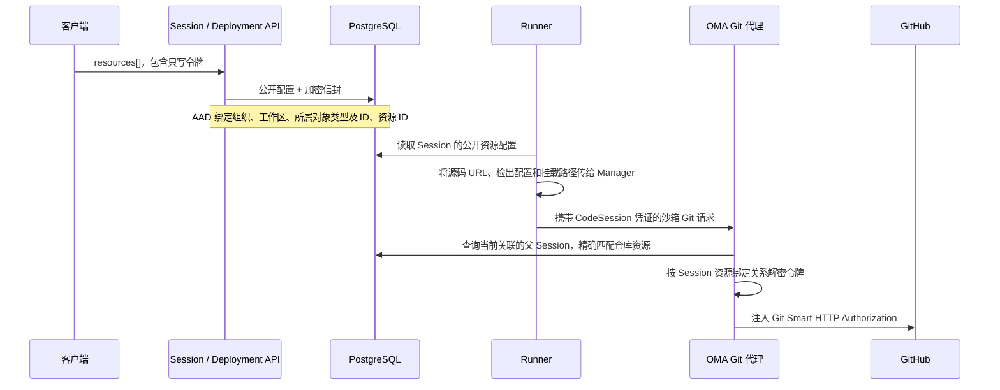

# Session 与 Deployment 的 Git 资源

第一阶段在创建 Session 时绑定 GitHub 仓库，并通过浅克隆准备工作树。Snapshot 缓存作为独立的第二阶段实现；当前不引入克隆策略注册机制或仓库管理服务。

## 对外 API 合同

Session 和 Deployment 创建接口共用以下 `resources[]` 条目格式：

```json
{
  "type": "github_repository",
  "url": "https://github.com/owner/repo",
  "authorization_token": "<write-only GitHub token>",
  "checkout": {"type": "branch", "name": "main"},
  "mount_path": "/workspace/repo"
}
```

该合同对齐官方的 [Session 创建](https://platform.claude.com/docs/en/api/beta/sessions/create)、[Deployment 创建](https://platform.claude.com/docs/en/api/http/beta/deployments/create) 和 [GitHub 资源](https://platform.claude.com/docs/en/managed-agents/github) API。省略 `checkout` 或传入 null 时使用默认分支。按提交检出时使用 `{"type":"commit","sha":"..."}`；SHA 必须为 7–64 个十六进制字符，并且在运行时能够解析为一个提交。分支名遵循 Git ref 语法，最长 255 个字符。省略挂载路径或传入 null 时，默认使用 `/workspace/<repo>`。

URL 必须采用规范格式 `https://github.com/owner/repo`，不得包含 `.git` 后缀、末尾斜杠、URL 内嵌凭证、端口、转义路径、查询参数或片段。创建和替换资源时令牌可选：省略、null 或空字符串表示匿名访问，公开仓库无需令牌；私有仓库由 GitHub 拒绝匿名请求。不增加公开/私有开关或可见性预检查。响应中不会返回令牌。Session 资源仍支持 GET 和列表查询；对已有 Git 资源发送 POST 仅修改其令牌：必须显式包含 authorization_token，null 或空字符串可清除令牌；空对象不清除现有凭证。Session 创建后不能新增或删除 Git 资源。现有 File 和 Memory Store 资源的修改行为保持不变。

更新 Deployment 时，若省略 `resources`，则保留原有资源和密文。显式传入数组会替换整个资源集合，缺少令牌的 Git 条目按匿名访问处理，不复用原密文。私有仓库替换时必须重新输入令牌；将已隐藏令牌的 GET 响应原样用于替换会清除原凭证。每次手动或定时运行都复用现有的 Session 创建原子事务。

本地实现具有明确约束：Git 工作树必须位于 `/workspace` 下，使用规范的绝对路径，不得包含路径穿越、反斜杠、控制字符，或 `.git`、`.claude`、`.oma` 目录段。不同 Git 挂载路径不能重叠。第一阶段按不区分大小写的方式比较仓库 URL，拒绝重复仓库，确保每个代理请求只对应一份资源凭证。File 资源位于独立的 `/mnt/session` 命名空间，因此即使对外路径写法与 Git 路径相同，也不会冲突。

### 匿名访问与准备事件

匿名资源沿用现有资源行，凭证为空（持久化层转换为 SQL NULL），不加密空字符串。代理先匹配所属 Session、精确仓库和活跃状态；匿名资源删除请求 Authorization 且不借用其他 Vault 的凭证。非空令牌继续通过原有密文绑定和 MITM 注入机制处理，损坏的非空密文仍报错。

Manager 复用 ActivityRecorder 上报 git_repository 的 started、ready、failed 三个准备状态。关键状态等待发送完成，使用独立五秒窗口，避免失败退出取消正在上报的事件；上报不可用只记录错误，不覆盖 Git 准备结果。控制面仅把合法 URL、挂载路径、状态投影为现有 system.message，subtype 为 git_repository；沿用原有持久化、事件流和系统消息卡片。原始日志、stderr 和其他 extra 字段不进入公开事件。ready 表示工作树准备完成（首次浅克隆或复用已有工作树），避免恢复时误报重新克隆。不增加逐行进度、事件表、后台队列或克隆策略接口。

## 凭证与持久化



复用现有 `secrets.Service` 的信封加密能力，为资源使用独立的 AAD（附加认证数据）域。Vault 的信封格式和 AAD 保持逐字节兼容。资源不会被伪装成 Vault。现有资源密钥 JSONB 列存储 `{"envelope":...}`，不新增数据库结构或明文密钥列。

Session 的 AAD 包含组织 UUID、工作区 UUID、`session`、Session 外部 ID 和资源外部 ID。Deployment 的 AAD 使用相同的租户范围，以及 `deployment`、Deployment 外部 ID 和资源在数组中的索引。创建运行时，先解密 Deployment 信封，再为新的 Session 和生成的资源标识重新加密，随后进入现有事务。密文不能在不同 Session、资源位置、Deployment、Vault 或租户之间复制使用。资源令牌轮换不会改变其公开仓库配置。

旧版明文 JSONB 不作为解密失败时的回退来源。受影响的 Session 必须轮换令牌；受影响的 Deployment 必须重新提供令牌并替换 `resources`，之后才能成功运行。这些正常写入路径会用加密信封替换旧明文。本版本不会静默迁移或继续使用历史明文。运维人员应重新提交受影响的凭证，并按照正常的保留策略删除旧备份。

令牌不会出现在 Manager 的请求载荷或运行时元数据中。代理在每次 Git 请求时都会检查当前的 CodeSession 与 Session 关联及其资源，并精确匹配 GitHub 仓库。令牌轮换立即生效；Session 终止、归档或加密绑定无效时，代理会拒绝访问。

## 验证范围

- `internal/sessionresource`：URL、分支/SHA、路径及路径重叠的错误场景；默认行为；拒绝历史明文；信封加解密往返验证。
- `internal/secrets`：租户、所属对象类型、所属对象 ID、资源及 Vault 域的隔离；现有 Vault 测试保持不变。
- `tests/git_resources_api_test.go`：通过 API 实际写入 PostgreSQL、响应隐藏令牌、Session 资源配置不可变、令牌轮换及历史数据修复；Deployment 省略/替换资源的语义，以及每次运行时重新绑定信封。
- `tests/git_resources_proxy_api_test.go`：验证通过 API 创建的资源，以及代理选择凭证时使用的真实 CodeSession/Session 数据库关联。
- 运行时和 SDK 验收还覆盖浅克隆、分支/提交、目标路径、失败清理，以及重启时不覆盖已有工作。仅通过 API 测试并不代表已验证 Sandbox 镜像或其固定的制品版本。

## 运行时通信格式与发布

Runner 输出 Manager 现有的源码描述结构，其中不包含 GitHub 令牌：

```json
{
  "type": "git_repository",
  "git_info": {
    "type": "github",
    "repo": "owner/repo",
    "host": "github",
    "url": "https://github.com/owner/repo"
  },
  "mount_path": "/workspace/repo",
  "checkout": {"type": "branch", "name": "main"}
}
```

当 `startup_context.origin = managed_agents_api` 时，Manager 会在准备源码之前启动现有的 CONNECT 中继。源码准备命令和 agent 子进程使用同一个中继及 CA 证书包，并从 `NO_PROXY` 中移除 GitHub。必须配置 OMA 的 `code_session.upstream_proxy_mitm_enabled` 和仅保存在服务端的 CA 私钥；未启用 MITM 时，Git 资源启动会提前失败。

OMA 服务端的 MITM 出口遵循 Go 标准的 `HTTPS_PROXY` / `NO_PROXY` 环境配置，支持 HTTP 和 HTTPS 代理；未配置代理时继续直连。代理收到的 CONNECT 目标仍是 OMA 已通过 DNS/SSRF 校验的 IP:443，不交给代理重新解析仓库域名；目标 TLS 仍按原域名验证证书。代理认证来自服务端环境，GitHub 资源令牌仍由 OMA 在内层 Git HTTP 请求中注入。这与 Sandbox → OMA 的 CONNECT 中继是两段独立连接。修改这些环境变量后需重启 OMA。

默认分支和指定分支均采用深度为 1、单分支、不拉取标签的浅克隆。显式指定的分支必须解析为 `refs/heads/<name>`，不能匹配同名标签。按提交检出时，先浅拉取并校验确切对象，再将 HEAD 切换到游离状态。短 SHA 仅能匹配远端通告中唯一对应的对象 ID；历史提交应使用完整 SHA。当前没有完整克隆回退或 Snapshot 缓存。

克隆先在临时位置完成，再放入目标路径，且不会替换已有路径。已有工作树保留本地改动和分支。旧版源码处理路径会先拒绝新增的、仅适用于资源的挂载/检出字段，避免进入旧版重新克隆前的删除逻辑。对应实现和测试位于 `environment-manager-rs`。

沙箱镜像必须包含更新后的 **Rust** Manager 制品。仅修改 OMA 源码不会升级镜像中固定的版本。本地候选镜像可以将已验证的二进制覆盖到兼容沙箱中进行测试；正式发布时，必须先发布制品，更新沙箱的 revision/digest/binary SHA 合同，并通过沙箱镜像校验器，再更新已部署的模板。

## 可复现的私有仓库端到端测试

`tests/git_resources_runtime_e2e_test.go` 需通过 `e2e` 构建标签显式启用。必须使用隔离的 PostgreSQL 数据库和对象存储桶，因为测试框架会重置 Provider 测试数据。需要配置启用 FUSE 的本地 E2B gateway、兼容的测试镜像和 MITM CA 私钥。测试为进程内 API 服务生成 `host.docker.internal` 入口，并明确要求 gateway API URL 使用回环地址。本地 gateway 可使用兼容 SDK 的占位密钥，例如 `e2b_0000000000000000000000000000000000000000`；它不是托管 E2B 服务的密钥。

候选测试镜像必须将已验证的 Manager 二进制复制到 `/opt/env-runner/environment-manager`，保留其兼容性符号链接，并将 `tests/fixtures/git_resources_claude.sh` 复制到 `/usr/local/bin/oma-git-test-agent`，权限设为 0755。这个行为确定的测试 agent 会报告预期的 CLI 版本，并利用继承的代理环境发起真实 Git 请求，不执行模型推理。它仅用作测试替身，不能作为发布镜像的入口。镜像中保留原始 Claude 二进制。

```bash
CONFIG_FILE=/path/to/isolated-git-test.yaml \
OMA_GIT_E2E_REPOSITORY=https://github.com/owner/private-repo \
OMA_GIT_E2E_USE_GH_AUTH=1 \
go test -tags=e2e ./tests -run '^TestGitResourcesRuntimeE2E$' -count=1 -v
```

`OMA_GIT_E2E_USE_GH_AUTH=1` 显式允许测试进程读取本地已登录的 `gh` 凭证。也可以通过进程环境变量 `OMA_GIT_E2E_TOKEN` 提供令牌。凭证只发送给 OMA API，不会作为参数或环境变量进入沙箱。

测试先确认匿名 Git 访问被拒绝，再验证默认分支和指定分支的 Session 创建、固定提交的 Deployment 运行、深度为 1、挂载位置、不含凭证的 origin URL，以及 Git 配置中没有凭证。将令牌轮换为无效值后，运行中的 agent 下一次 Git 请求必须失败；恢复有效令牌后，请求必须成功，整个过程不重启中继。测试负责删除运行时沙箱。该测试验证 Git 资源准备和代理访问，不验证模型推理或 Snapshot 恢复性能。

### 本地验收记录（2026-09-05）

- OMA 在 macOS 上运行，使用专用 Docker E2B gateway；Sandbox 和 Manager 使用 Linux ARM64 GNU。基于最终 release 模式二进制，私有 GitHub 仓库的默认分支 Session、指定分支 Session 和固定提交 Deployment 运行全部通过。通过同一个持续运行的 agent 中继验证了无效/有效令牌轮换。
- 标准 Rust 制品构建通过 fmt、clippy、486 项库测试，以及 6 项二进制/协议/审计测试。最终候选镜像通过完整的 Sandbox 运行时合同校验。未执行真实 LLM 推理。
- 最终本地 Manager OCI digest：
  `sha256:71f99fb6fe68df5e72fd1c795e64d266d38987205965a8066dea7f744e117379`；
  二进制 SHA-256：
  `61576a1fae1ce0f80403cdb56d3b353aac314ba9fc5fbae48cf0b16ca91d3249`。
  制品从 `codex/git-resources` 构建，revision 明确标记为包含未提交改动；CLI 版本仍为 `0.1.0`。这些记录仅是本地验证证据，不代表已正式发布，也不代表已更新沙箱仓库中提交的固定制品版本。
- 本功能的 Go API/集成测试，以及 lint、死代码、重复代码和复杂度检查均通过；Go 全量测试仍存在原有的示例配置断言不匹配，涉及两个 NATS 超时字段。Web 构建、功能测试和浏览器中的创建/编辑/轮换流程均通过。Bun 全量测试在 ConsoleLayout 附近以退出码 133 结束；其外部点击测试在未修改的 HEAD 上运行时也会挂起。
- 较早的测试运行中，GitHub 曾返回临时 502 响应。这些运行明确失败，且未留下目标仓库；最终三个场景全部通过，没有跳过用例。当时 OMA CONNECT 服务只支持直连上游 TLS；后续浏览器验收补充了上述服务端出口代理支持。

### 浏览器与真实模型验收（2026-09-05）

- 使用 ego-browser 从控制台创建 Git 资源 Session `sesn_G5JMq4t63jBI9Ks7keePgB08`，环境为 `env_whdHL0u3SxkxOTBB8vvA6EMD`，模板为 `oma-local/managed-agent-sandbox:git-resources-arm64`。Agent `agent_U3waTLyPCRaqgUAyMqiWzedB` 使用 DeepSeek 直连模型 `deepseek-v4-flash`，Provider Base URL 为 `https://api.deepseek.com/anthropic`；实际运行原始 Claude Code 2.1.251，不使用测试替身。
- 页面添加私有仓库 `https://github.com/superduck-ai/environment-manager-rs`，挂载 `/workspace/repo`，提交消息后产生真实的 `agent.tool_use`（Bash）、`agent.tool_result` 和最终回复，Session 返回 idle。Docker Sandbox `sbxf08d6ab62bf90c8e2e2ebf90` 独立检查与工具结果一致：HEAD `9ea729e9f789c55c5d585554c82e0cc8096e7608`、shallow `true`、提交数 `1`，origin URL 不包含凭证。
- 同一会话第二条消息要求 Agent 执行 `git -C /workspace/repo ls-remote origin HEAD`，真实 Bash 工具请求成功并返回相同 SHA，验证初次克隆完成后，Agent 仍能通过现有中继访问私有远端。
- 在宿主机上对该 Sandbox 的运行时元数据、进程参数与环境，以及 Git/Manager 运行文件进行精确令牌匹配检查，未发现本次使用的 GitHub 令牌；扫描凭证本身未传入 Sandbox。
- 用户原有 `deekseek` Agent 使用公司网关模型 `deepseek-v4-flash-0731`，请求返回 `403 Accessdenied!`，Claude 将其显示为 `Authentication error`。该模型网关问题与 GitHub 资源鉴权无关，未将更换验收 Agent 描述为修复原公司网关。
- 另两次新会话因 GitHub 直连返回 502/连接超时而失败。宿主机已有的 HTTP 代理能够访问 GitHub，补充服务端出口代理支持后，上述完整链路通过。原有 Environment 会固定模板，测试必须选择包含新 Manager 的环境，不能仅依赖后端默认模板更新。

### 公开仓库与准备事件验收（2026-09-05）

- ego-browser 实际创建 Session `sesn_mTkxcg8bLW7ktq10k8TmzwHP`，标题 `Git E2E · 公开仓库免 Token`。URL 为 `https://github.com/octocat/Hello-World`，挂载 `/workspace/public-repo`，Token 输入留空，未关联 Vault。
- 创建后、发送第一条消息前已有 started / ready 事件，刷新后仍在会话时间线显示仓库准备内容。真实 Claude Code + DeepSeek Agent 执行 Bash，返回 HEAD `7fd1a60b01f91b314f59955a4e4d4e80d8edf11d`、shallow `true`、提交数 `1`，`ls-remote origin HEAD` 返回相同 SHA。宿主机独立检查 Docker Sandbox `sbxbb1a1c9317a3e0c19e575379` 的结果一致。
- 匿名 Session、匿名 Deployment 运行、显式清除 token、错误格式 token、加密 token 轮换与作用域隔离的 Go API 回归通过。全部受影响 Go package 测试通过。Go 全量仍有 `TestConfigExampleContainsOnlyCommonFields`（NATS 示例配置）和 `TestCodeSessionWorkerEventsStreamStopsAfterEpochTakeover`（旧 worker 流未关闭）失败；没有把全量报告为通过。前端功能测试、构建、格式、命名、复杂度和重复代码检查通过。

- 最终候选 Manager artifact digest 为 `sha256:b4380422eff91c1f8c719b39da31afb599bf18d0261897b10fa51a98747e5ffc`，二进制 SHA-256 为 `a1c5dcdd14cadce4b83d537af2fd386f9199ae6411f57f9cd2cc9e8e4a61224a`。标准 ARM64 构建通过 fmt、clippy、487 项库测试及 6 项其他测试；候选镜像完整合同通过。镜像仍为本地候选，未发布或修改正式 artifact pin。
- 失败回归 Session `sesn_0THhLGqAXe7NJjVDVTTFFwkK` 不填 Token 访问私有仓库，在会话中可见 started / failed，Docker Sandbox `sbx9657de40e2c2129bd55f13ac` 没有目标仓库。第一次负向运行发现后台发送会被 Manager 退出取消；已改为关键状态等待上报，最终新镜像验证通过。
- 控制台创建手动 Deployment `depl_YHEDAnVAh2KjH26RkqqGvhLM`，公开仓库不填 Token；控制台目前没有手动 Run 按钮，通过浏览器同源认证调用现有 POST `/v1/deployments/{id}/run` 触发，返回 run `drun_gBbx0IrqTRLkOfpomG0K5i0c` 和 Session `sesn_nC0r7yfcw5d2wmEkXzICF83R`。新 Sandbox `sbxa56ec8683511e631c89aa285` 使用上述最终 Manager SHA，`/workspace/deployment-public` 的 HEAD、浅克隆标记及提交数与独立 Session 相同。

- Deployment 运行会话中同样可见 started / ready；真实 DeepSeek Agent 的两个 Bash 工具调用完成并返回上述 HEAD 与 `true`。成功和负向验收会话均保留，前后端服务继续运行供手动检查。

### 准备耗时与失败原因

Manager 使用单调时钟测量仓库准备耗时，在 ready / failed 事件上附加 duration_ms；计时不包含开始事件和结果事件的网络上报等待。恢复已有工作树时记录的是校验耗时，不称为克隆耗时。失败事件通过固定 failure_reason 枚举分类：access_denied、network_error、checkout_failed、path_conflict、timed_out、cancelled、unknown；原始 Git 输出仅用于 Manager 内部分类，不作为公开原因传输。GitHub 对不存在与无权访问的仓库可能返回相同响应，因此 access_denied 文案同时保留这两种可能，不猜测令牌是否有效。

控制面仍采用白名单投影；只接受非负耗时与已知原因码。Git 准备事件统一使用英文显示状态、秒数与完整仓库 URL，失败说明在同一文案后追加处理建议，不插入强制换行。历史事件没有这些字段时明确显示“Duration: Not recorded”和“No failure details were recorded”，不回填或推算。


### 耗时与失败原因验收（2026-09-05）

- 在控制台创建公开仓库免 Token Session `sesn_oGljdyGvO7lEkN9vpNzC8zu9`，仓库 `octocat/Hello-World`，页面显示准备完成与 1.3 秒耗时。独立检查 Sandbox `sbx1351fc9536f8dabb485f39fb` 的 `/workspace/public-repo`：HEAD 为 `7fd1a60b01f91b314f59955a4e4d4e80d8edf11d`，shallow 为 `true`。
- 匿名访问私有仓库的 Session `sesn_hZtAHrrYqKj3tXTxQiOJVznS` 显示失败与 0.5 秒耗时，并提示仓库不存在或无权访问、检查 URL 和令牌权限。
- 指定不存在分支的 Session `sesn_CfoPhYcnvJYV7QBeETU3LMhQ` 显示失败与 0.9 秒耗时，并提示无法检出指定分支或提交。以上均为真实 Sandbox 运行，保留验收会话。
- 本轮候选 Manager artifact digest 为 `sha256:ae6e6667c8537b2b6681fd671f0a6d5cbd7554f37a14112aa9b46068e4db7172`，二进制 SHA-256 为 `f2ee5ec23670d6112cb3127269fd01e2cd4355190817228503f24bb0e8cd4c68`。标准构建通过 fmt、clippy、488 项库测试及 6 项其他测试，Linux ARM64 候选镜像合同通过；尚未更新正式 artifact pin。
- Go codesessions 测试、lint、死代码、重复代码、复杂度，以及前端功能测试、构建、格式和命名检查通过。Bun 全量测试仍在 ConsoleLayout 附近异常退出（进程信号 5），未报告为全量通过。
