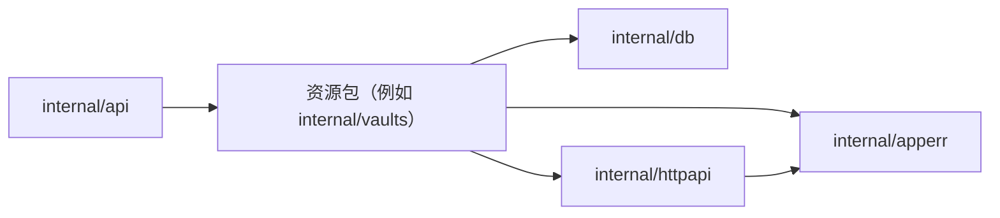

# HTTP、平台与 Workbench 包边界

本文记录后端应用错误、HTTP 公共层、平台业务路由和 Workbench 业务流的包边界，避免 `internal/httpapi` 承担业务语义。

## 包职责

- `internal/apperr`
  - 是不依赖传输层和具体功能包的叶子包，只定义稳定的错误 `Kind`、安全公开文案和私有 cause。
  - 不维护全局错误码注册表，也不决定 HTTP status、wire error type 或日志级别。
- `internal/httpapi`
  - 仅保留通用 HTTP helper，例如 Anthropic-compatible error shape、JSON 写入、请求解析等。
  - `ErrorAdapter` 在普通 JSON endpoint 的最终边界把 `apperr` 映射为 HTTP 响应，并统一记录最终的 Internal 或未知错误。
  - 不注册业务路由，不持有平台/Workbench 领域类型别名，不直接依赖具体 feature 包。
- `internal/vaults`
  - 在当前操作拥有业务语义的位置，把数据库 sentinel、加密错误和请求校验错误翻译为 `apperr`；数据库层不负责 Vault 的公开文案或 HTTP 分类。
  - 13 个普通 JSON 路由返回 `error`，由同一个 `ErrorAdapter` 收口；成功响应、Webhook 行为和数据库调用顺序保持不变。
- `internal/db`
  - 继续返回普通 Go error 或可识别 sentinel，不依赖 `apperr` 或 `httpapi`，也不构造公开错误文案。
- `internal/platformapi`
  - 承载平台/console 相关 HTTP route registration、请求解析、响应映射和轻量业务编排。
  - 继续依赖 `internal/platform` 的领域类型与错误，并在 HTTP 边界完成 JSON shape 映射。
  - 负责目录、登录、组织 profile/SSO、console workspace/API key/member/invite、billing/usage、environment token，以及管理后台独立的 platform Messages proxy。
- `internal/messages`
  - 承载共享的 Anthropic-compatible `POST /v1/messages` handler、敏感 header 清洗、上游凭证注入与 JSON/SSE 响应转发。
  - 服务 service API 和 platform `/v1`；不替代管理后台的 organization-scoped platform proxy，也不负责入口鉴权。
- `internal/workbench`
  - 承载 Workbench HTTP route registration、prompt/revision/evaluation/KV 业务流，以及上游 Anthropic 代理调用。
  - 只通过 `RegisterOrgWorkbenchRoutes` 暴露路由挂载入口给 `internal/api`；入口接收窄化后的 `AnthropicUpstreamConfig`，Workbench 上游地址和 API key 与其他 Messages 入口统一来自 YAML，不读取 `ANTHROPIC_*` 凭证或地址环境变量。
- `internal/codesessions`
  - `Handler` 是 code-session 的 HTTP/协议边界，负责 chi 路由注册、请求鉴权、CCR worker ingress、upstream proxy、MITM CA 生命周期与 OTLP 文件日志锁。
  - `Service` 是可跨入口复用的业务边界，只依赖数据库并负责编排 code-session 创建、事件队列、worker 输出映射、tool permission 与公开 session 事件发布。
  - `Handler`、`sessions.Handler` 共享同一个 `Service` 实例；这样 worker 输出与公开 session stream 使用同一个 `PublicEventSink`，不会因拆分而中断事件发布。

## 路由组装

`internal/api/server.go` 仍负责顶层 chi router、全局 middleware、鉴权入口选择和资源挂载：

- `registerVersionedAPIRoutes` 统一挂载 `/v1`、`/v2`；`/v1` 通用资源只注册一次，并由凭据感知中间件选择 service API key 或 platform session 鉴权链。
- `/v1` platform privacy consent 路由从 `platformapi` 注册；code-session worker、ingress 与 upstream proxy 路由由 `codesessions.Handler` 注册，并在 handler 内执行专用鉴权。
- `/v1/messages` 进入通用凭据感知中间件；code-session Messages token 只在 service auth 的这个 `POST` 路径被接受。
- `registerPlatformConsoleRoutes` 将 `/api`、`/auth`、`/oauth`、`/web-api` 的平台 console 路由直接注册到根 chi router，不再通过成对的精确路径和 wildcard handler 转发到第二个 router。
- `/api/organizations/{orgUuid}` 下的 Workbench 子路由从 `workbench` 注册，并由 `internal/api` 注入 `anthropic_upstream` 配置。

路径、middleware 顺序、鉴权入口和响应结构在本次迁移中保持不变。

## 依赖方向

- `internal/api` 可以依赖 `internal/httpapi`、`internal/messages`、`internal/platformapi`、`internal/workbench`。
- `internal/platformapi` 和 `internal/workbench` 可以依赖 `internal/httpapi` 的公共 helper；`internal/workbench` 还可以依赖只包含进程配置类型的 `internal/config`，但只接收自身需要的 `AnthropicUpstreamConfig`，不接收根 `Config`。
- `internal/httpapi` 不依赖 `internal/platformapi`、`internal/workbench` 或具体业务 handler。
- `internal/platform` 保持领域类型/错误包，不引入 HTTP handler，避免与 `internal/db` 形成反向依赖或 import cycle。
- `internal/api` 只保存 `codesessions.Handler` 作为 HTTP 资源入口；需要创建 code session 或发布事件的 `sessions`、`environments` 依赖 `codesessions.Service`，不依赖 HTTP handler。
- `codesessions.Service` 不持有 `config.Config`、WebSocket/CA cache 或 HTTP client。协议状态只能由长生命周期的 `codesessions.Handler` 持有。

## 应用错误与最终 HTTP 边界

- 默认映射覆盖 `InvalidArgument`、`Unauthenticated`、`Billing`、`PermissionDenied`、`NotFound`、`Conflict`、`RateLimited`、`Timeout`、`Internal` 和 `Overloaded`，对应 Anthropic 的标准 HTTP status 与 `error.type`。
- 只有 Kind 和安全公开文案都合法的应用错误才采用该映射。未知 Kind、空文案和普通 error 一律返回通用 500，避免意外泄漏内部错误。
- 响应遵循 Anthropic error shape，只包含既有的 `error.type` 和 `error.message`，不增加 feature error code。
- 已知 4xx 不写 Error 日志。Internal、Timeout、Overloaded 和未知错误只在 adapter 记录一次，稳定字段为 `request_id`、`method`、`path`、`error_kind`、`error`；`path` 不包含 query string。
- `ErrorAdapter.Wrap` 只用于尚未提交响应的普通 JSON endpoint。SSE、流式下载或其他已经提交响应后仍可能失败的 handler 不使用该 wrapper，应沿用其协议专属的结束与日志策略。
- Filestore、Messages proxy，以及已经存在特殊 status/type 合同的 handler 暂不接入默认 adapter。它们只有在逐项确认默认映射不会改变公开协议后才可迁移。

## 兼容与测试

本次拆分是保持行为不变的机械迁移。验证重点：

- `go test ./internal/apperr ./internal/httpapi ./internal/vaults -count=1`
- `go test ./internal/httpapi ./internal/platformapi ./internal/workbench -count=1`
- `go test ./internal/codesessions ./internal/sessions ./internal/environments -count=1`
- `go test ./internal/api -count=1`
- `go test ./... -count=1`

若全量测试失败，应先区分是否来自既有 platform-host 分流/会话恢复问题，避免把行为修复混入包边界迁移。

Workbench 上游测试必须同时覆盖 YAML base URL/API key 的实际请求注入，以及同名旧环境变量不会改变请求目标或凭证。
