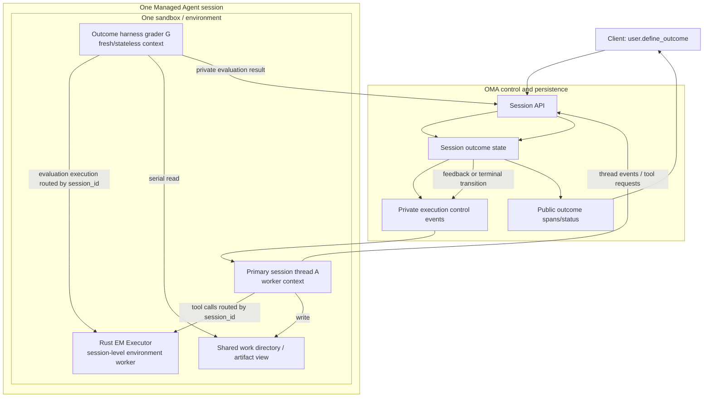
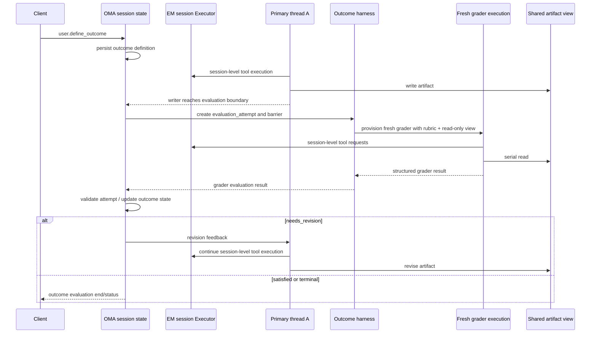

# Managed Agent Outcome Grader 架构设计

> 状态：已确定总体方案，尚未实现
>
> 范围：实现 Anthropic 托管的 **cloud Managed Agents** 行为，不是 self-hosted sandbox worker。`environment-manager-rs` 是云 sandbox 内被 OMA/Control Plane 启动的 environment manager；OMA 负责 session、thread、outcome 的控制面协议，以及 sandbox 内 runtime/tool execution 的对接。
>
> 设计基线：OMA `e43888edc0f7dff91616896f9cc3714a280fa37b`；environment-manager-rs `544e59ed9e3c7c862d0b8c1a70c58e6c6c18d890`。

## 1. 结论

目标拓扑确定为：一个 Managed Agents session 对应一个 sandbox；一个 session 内可以有 primary thread 和多个 child session thread；Outcome Grader 则是由 harness 按 evaluation iteration 临时 provision 的独立、无状态 evaluator execution，不是普通 child thread。所有 execution 共享同一个 sandbox/environment，但只有 persistent thread 才进入 session thread 资源模型。

```text
Managed session S
├── Primary session thread A: worker
├── Child session threads: optional multi-agent workers
├── Outcome harness
│   └── Fresh grader execution G₀/G₁/G₂ per evaluation iteration
└── One sandbox / environment
    └── environment-manager-rs Executor
        └── session-level CCR / tool execution
```

A 和普通 child agent 是 session thread；grader 是 harness 内部的 ephemeral evaluation execution。它们都复用同一个 sandbox/environment，但 grader 每轮拥有 fresh context，不继承上一轮 grader history，也不需要公开 `session_thread_id`。经过对官方 Managed Agents session/thread、Outcome Grader、CCR 语义、Go/Rust EM 生命周期和共享 sandbox 状态的综合调研，将这些逻辑 execution 分别承载为多个 OS process 判定为不优先且不太可行的方案；本设计不采用它作为实现路径。OMA 不实现第二套模型或工具循环，也不新增独立的 `OutcomeOrchestrator` 服务。OMA 继续持有 thread/outcome 的持久化状态和公开事件语义；EM 继续负责 session-level environment execution。

实现顺序调整为：

1. 先确认并保持一个 session → 一个 sandbox/Executor 的 session-level EM 合同；不因为 thread 或 grader 先新增 1:N executor，也不预先把 roster/outcome 塞进 EM；
2. 在 OMA/Control Plane 侧确认 coordinator roster、`agent_toolset_20260401` 到 child-thread delegation 的真实接线；sandbox 内 runtime 产生的 child-thread 事件继续由 OMA 接收、持久化和路由；
3. 再接入 outcome harness 的 evaluation attempt、barrier、fresh grader 和官方 outcome events，不把 grader 当作普通 public thread。只有私有 cloud runtime 合同证明需要时，才增加 EM 的专用透传字段。

这里的“先做 EM”不是先臆造一个完整的 OMA 内部协议，而是先依据本文定义的最小 execution contract 建立可复用的运行时能力。OMA 的 outcome 状态合同和 EM 的控制消息合同必须先共同确定，再分别实现。

## 2. 官方依据与推理边界

本节只引用 Claude Platform Managed Agents 范围内的官方页面。官方产品合同和本项目的内部实现合同分开记录。

### 2.1 同一个 sandbox 可以承载多个独立 agent context

官方 [Multiagent orchestration](https://platform.claude.com/docs/en/managed-agents/multiagent-orchestration#how-it-works) 原文：

> “All agents share the same sandbox, filesystem, and vault credentials, but each agent runs in its own session thread.”

官方同一段还说明每个 agent 有自己的 conversation history；下一段说明每个 agent 可以使用自己的 model、system prompt、tools、MCP servers 和 skills。

官方 Multiagent 页面标题本身是“Coordinate multiple agents within a single session”，并进一步说明：

> “The coordinator reports activity in the primary thread ... additional threads are spawned at runtime when the coordinator delegates work.”

由此可以推出：

1. 一个 Managed session 对应一个 sandbox/environment；
2. 一个 Managed session 内可以有 primary thread 和多个 child session thread；
3. thread 是独立的 context-isolated event stream/history，不是新的 Managed session，也不是新的 sandbox；
4. Outcome Grader 共享 session sandbox，但不表现为普通 persistent session thread；
5. 官方要求的是 context/history/config 的独立性，没有规定每个 thread 或 grader 使用独立 OS process；
6. 将这些逻辑 execution 分别放入多个 Claude Code process 不是本项目的目标方案。综合调研表明它会重复引入 session identity、CCR worker registration、token、tunnel、history、cleanup 和共享文件一致性问题，难以复用官方 session/environment 能力。

### 2.2 Claude Code 的 agent、runtime 和 OS process 不是同一层次

为了避免把官方概念错误映射到 EM，本设计采用以下分层：

```text
Claude Code runtime/process
└── agent session/context
    ├── agent loop
    ├── context window
    ├── system prompt / tools / permissions
    └── event and result state
```

Claude Code 官方文档明确说明普通 subagent：

> “Each subagent runs in its own context window...”

并且：

> “Subagents work within a single session.”

官方 Agent Teams 文档又明确说明：

> “Each teammate has its own context window.”

同时提供两种运行模式：默认的 `in-process` 和 `split panes`。`in-process` 模式下所有 teammate 在主 terminal/runtime 内运行；`split panes` 模式才会为 teammate 提供独立 pane 和独立 Claude Code process。官方还将 teammate 描述为：

> “Each teammate is a full, independent Claude Code session.”

来源：[Create custom subagents](https://code.claude.com/docs/en/sub-agents)、[Orchestrate teams of Claude Code sessions](https://code.claude.com/docs/en/agent-teams)。

这些资料不能直接证明 Managed Agents 的 hidden grader 就是通过公开 Agent Teams 实现的，也不能覆盖 Managed Agents 自己的 session-thread object model。它们只能补充说明：agent/context 与 OS process 是不同层次。Managed Agents 的正式抽象仍然是 session thread：

```text
一个 Managed session
├── primary session thread: worker context
└── child session thread: grader context
    └── 共享同一个 sandbox/environment
```

因此本设计不再把“启动多个 OS process”作为 1:N agent 支持的定义。第一优先级是 session thread 的独立 context/event stream/history，以及它们到同一个 session environment 的路由；多个 OS process 方案不作为本项目实现路径。

### 2.3 对 Managed Agents hidden grader 的推理边界

新的官方 Cookbook 进一步明确了 Outcome Grader 与普通 session thread 的区别：Outcome grader 是由 platform/harness 自动 provision 的 evaluator；每次 writer turn 后，平台启动一个 fresh grader，grader 重新读取 rubric 和 artifact，返回逐项 verdict。Cookbook 将其称为 stateless grader，并明确说明每一轮都会重新检查完整 artifact。

因此本设计采用以下工作判断：

```text
Primary / child session thread
  = persistent, addressable agent execution entity

Outcome grader
  = harness-internal, ephemeral, stateless evaluation execution
```

这不是公开 API 对内部对象名称的证明，但它与公开行为高度一致：普通 child thread 有 `session_thread_id`、独立 thread stream、interrupt/archive API；Outcome Grader 对外只暴露 `outcome_id`、evaluation iteration 和 `span.outcome_evaluation_*`，没有公开 grader thread resource。

### 2.4 outcome 会自动产生独立 grader

官方 [Define outcomes](https://platform.claude.com/docs/en/managed-agents/define-outcomes) 原文：

> “When you define an outcome, the harness automatically provisions a grader to evaluate the artifact against a rubric.”

官方紧接着说明 grader 使用 separate context window，返回 explanation，并将 feedback 交回 agent 进行下一轮迭代。官方 Cookbook 的可执行示例进一步说明：平台在每个 writer turn 后启动 fresh grader，grader 使用与 writer 相同的 model/tools，读取同一个 session artifact，并且每轮 grader 都是 stateless。

由此可以推出：

1. grader 的启动不能依赖 writer A 自愿调用某个工具；
2. grader 不应建模为普通 persistent child session thread，也不应在 OMA 中公开创建 grader thread resource；
3. grader 每轮只需要 evaluation attempt、iteration、rubric 和 artifact view，不需要持久化上一轮 grader conversation；
4. grader 的结果和 explanation 回到 OMA outcome state，再由 OMA 决定是否向 primary thread 注入 revision feedback；
5. EM 只处理同一个 Managed session 的 environment/tool execution，不需要知道 grader 的 thread ID 或 evaluator 内部 identity。

### 2.7 本项目明确实现 cloud Managed Agents，而不是 self-hosted worker

本项目不采用 self-hosted sandbox 文档中的“控制面在 Anthropic、外部 worker 只执行工具”作为整体拓扑。该文档描述的是另一种部署形态；它不能否定本项目要复现的 cloud Managed Agents sandbox 内部实现。

cloud environment 官方页面明确说明：

> “Environments define the sandbox configuration where your agent runs.”

并且：

> “each session gets its own isolated sandbox (a fresh Linux container).”

官方 Managed Agents overview 又把 environment 定义为：

> “Configuration for where sessions run: an Anthropic-managed cloud sandbox, or a self-hosted sandbox on your own infrastructure”

来源：[Cloud environment setup](https://platform.claude.com/docs/en/managed-agents/environments)、[Managed Agents overview](https://platform.claude.com/docs/en/managed-agents/overview)。

因此本项目采用以下边界：

```text
OMA / Managed Agents Control Plane
├── public session API and event history
├── primary / child session-thread semantics
├── coordinator multiagent roster
└── outcome harness and grader lifecycle

Anthropic-compatible cloud sandbox
└── environment-manager-rs
    ├── sandbox filesystem / mounts
    ├── Claude Code runtime adapter
    ├── CCR / session ingress
    └── local tool execution
```

这里的关键不是复制 self-hosted worker 的公开 SDK，而是保持 cloud Managed Agents 的公开行为：一个 session 一个云 sandbox；thread/context/history 由 Managed Agents runtime 管理；EM 负责 sandbox 内实际 runtime 和工具执行。

### 2.8 cloud Managed Agents 下 child thread 的真实创建边界

官方 multiagent 文档把 child thread 的创建放在 coordinator delegation 内：

> “additional threads are spawned at runtime when the coordinator delegates work.”

同时 agent 定义通过 `multiagent.agents` 声明 coordinator roster；创建 session 时只引用 coordinator agent：

```text
agent definition
  └── multiagent.agents roster
session create(agent=coordinator)
  └── coordinator delegates
      └── Control Plane provisions child session thread
```

这说明 OMA 不需要新增一个“客户端主动创建 child thread”的公开 API。OMA 需要实现的是：

1. agent definition 中的 coordinator/roster 配置；
2. session 创建时保留并传入该配置；
3. 接收 Control Plane/Claude runtime 产生的 thread lifecycle events；
4. 将 thread event 正确投影到已有 `session_threads` 模型。

当前 OMA 已经具备第 4 项和大部分事件投影能力，但当前源码尚未证明第 1、2 项已经接入 runtime；因此第二阶段应先审计 agent/session config contract，而不是实现 `POST /sessions/{id}/threads`。

### 2.5 `user.define_outcome` 是 public session event，不等于 worker inbound event

官方 outcome 页面给出的调用方式是向 session events 发送 `user.define_outcome`。官方原文：

> “The agent begins work immediately. No additional user message event is required.”

官方还将 `user.define_outcome` 描述为启动 outcome 的 user event，并规定 outcome evaluation 的公开输出为：

- `span.outcome_evaluation_start`；
- `span.outcome_evaluation_ongoing`；
- `span.outcome_evaluation_end`。

官方没有公开 harness 到 environment worker 的 grader 内部传输协议，也没有公开 `grader.request` 或 `grader.feedback` 这种 worker wire event。因此本设计不把 `user.define_outcome` 强行加入 OMA 当前普通 worker event allowlist。它在 OMA 侧首先是 session/outcome 状态变更；EM 需要的命令属于私有 OMA↔EM execution contract。

这不是声称官方明确规定“不能转发给 worker”。准确边界是：官方没有公开该内部传输方式；OMA 当前的首次 outcome 通过启动上下文携带，当前 allowlist 排除 outcome 与这一设计一致。链式 outcome 的运行中传递仍需在后续 OMA 接入阶段按真实 runtime contract 验证，不能用 allowlist 现状冒充已完成。

### 2.6 官方公开的评价生命周期

官方定义的 `span.outcome_evaluation_end.result` 包括 `satisfied`、`needs_revision`、`max_iterations_reached`、`failed` 和 `interrupted`。官方还说明评价完成前，session 查询中的 result 可以是 `pending`、`running` 或 `evaluating`。

官方原文分别是：

> “Emitted once the grader starts an evaluation over one iteration loop.”

> “Until an evaluation completes, `result` reports `pending`, `running`, or `evaluating`.”

这些原文直接支持两个实现约束：grader 的启动和 evaluation 状态是独立生命周期；普通 worker 的结束或 session idle 不能直接替代 outcome evaluation 状态。

因此，OMA 不能用一个普通 Claude result 或 `session.status_idle` 直接代替 outcome evaluation end。EM 返回的是 execution 结果，OMA 负责将它转换为 outcome 生命周期中的合法状态。

### 2.9 grader 的执行边界：控制面由 harness 持有，实际 sandbox execution 应经过 EM

这里需要把“谁决定评估”与“谁执行评估”分开。官方文档明确说 harness 自动 provision grader，并且 grader 使用独立 context；但 cloud environment 的定义是“the sandbox configuration where your agent runs”，而 outcome grader 需要读取 session artifact、使用模型完成 rubric 推理，并可能使用与 agent 相同的工具能力。

因此对本项目的高置信度推断是：

```text
OMA / harness
  ├── 决定 evaluation start、iteration、rubric、feedback 和终态
  └── 发起 fresh grader execution
        ↓ 私有 session-level execution command
environment-manager-rs
  ├── 在同一个 cloud sandbox 中提供文件视图和工具执行
  ├── 复用已有 Claude Code/runtime adapter 能力
  └── 返回 grader execution result / usage / failure
```

这并不意味着 EM 应该拥有 outcome 状态机，也不意味着 grader 必须对应一个新的 public `session_thread_id`。EM 的复用边界应是“执行一个 fresh、context-isolated 的 grader turn”，而不是“实现 grader 调度”。

这是基于官方职责划分、当前 EM 的实际职责以及代码复用性的推断，不是官方公开的私有 wire contract。官方公开文档没有说明该命令的字段、是否由同一 Claude Code OS process 承载、或 grader 的模型请求在哪一层发起；这些仍需从 cloud runtime 逆向行为确认。

## 3. 当前源码事实

### 3.1 OMA 的 sandbox 和文件布局

OMA 先通过 provider 创建 sandbox，再由 runner 在 sandbox 中启动 environment manager：

- [runner.go](/Users/yueqi/Coding/Agent/open-managed-agents/internal/environments/runner.go#L259) 调用 `provider.Create`；
- [runner.go](/Users/yueqi/Coding/Agent/open-managed-agents/internal/environments/runner.go#L330) 启动 environment manager；
- [managed_agent_runtime_resources.go](/Users/yueqi/Coding/Agent/open-managed-agents/internal/environments/managed_agent_runtime_resources.go#L28) 从 session resources 决定工作目录，默认 `/home/user`。

当前 filestore 是 sandbox 级挂载：

- `/mnt/user-data/outputs` 可写；
- `/mnt/session/uploads` 只读；
- `/mnt/transcripts` 只读；
- `/mnt/user-data/tool_results` 只读；
- `/root/.claude/skills` 只读。

实现见 [rclone_filestore.go](/Users/yueqi/Coding/Agent/open-managed-agents/internal/environments/rclone_filestore.go#L101)。这些挂载解决的是文件可见性和持久化，不自动提供按 Claude process 划分的上下文或写权限。

### 3.2 当前 EM 是单 executor 装配

当前 `Manager::run` 一次创建一个 executor，并围绕它执行和清理：

- [manager.rs](/Users/yueqi/Coding/Agent/environment-manager-rs/src/internal/manager/manager.rs#L455) 只调用一次 executor factory；
- [manager.rs](/Users/yueqi/Coding/Agent/environment-manager-rs/src/internal/manager/manager.rs#L751) executor 返回后取消共享 run token；
- [types.rs](/Users/yueqi/Coding/Agent/environment-manager-rs/src/internal/claude/types.rs#L121) 的 `Executor` 接口描述的是单个 Claude session execution。

因此当前 EM 尚未实现 session 内 1:N execution supervisor。这是当前代码能力的结论，不是 sandbox 或 Claude 平台只能运行一个 agent 的结论。

### 3.3 当前启动方式不能由外部 harness 直接创建 session thread

当前 OMA 的启动链路是：provider 创建 sandbox，runner 在 sandbox 中启动一个 environment manager；EM 从启动上下文得到一个 `session_id`，再创建一个 Claude Code executor。现有启动上下文和 CCR worker 通道没有公开一个“创建 Managed session child thread”的外部命令接口。

因此，当前 OMA **不能仅靠向现有 worker 转发一条普通事件**，就让已经运行的 Claude Code runtime 创建一个官方意义上的独立 Managed Agents session thread。当前实现中还缺少至少一层：

```text
OMA private grader/thread command
        ↓
OMA session-thread controller
        ↓
Managed session child thread
        ↓
same EM session environment
```

这不是说 Claude Code runtime 没有类似能力；官方 Claude Code 文档已经证明 subagent/teammate 可以拥有独立 context。当前 OMA 确实能把 Claude Code 已经产生的 `system.task_started`/`task_notification` 和内部 subagent event 投影为公开 thread event（见 3.4），但这是“runtime 已经启动任务后的事件投影”，不是 OMA 已经拥有一个可发送的 Managed Agents child-thread 创建命令。Managed Agents 的正式对象是 session thread，不能直接把 teammate API 当成 Managed Agents contract。准确结论是：**当前 OMA→EM→Claude Code 的启动和事件接口已具备部分事件投影，但没有被源码证明已经完成原生 coordinator → child-thread delegation 的控制闭环。**

这也是为什么第一阶段不应先把 EM 改造成多 executor：目标是保持一个 session-level Executor/environment worker，让 primary/child thread 以及 ephemeral grader 的工具调用都落到同一个 session environment。只有源码证据表明本地 Claude Code agent loop 必须由 EM 承载时，才进一步调整 EM 的 runtime adapter；当前证据更支持 EM 只处理 session-level tool execution。

### 3.4 OMA 当前已经具备 session thread 的持久化和事件投影基础

对当前 OMA 源码的检查结果是：OMA 不是只有概念上的 thread 字段，而是已经建立了 session-thread 资源、持久化、事件投影和路由基础：

- `session_threads` 表保存 `session_external_id`、`external_id`、parent thread 和 status；对应 [session_thread_mapper.xml](/Users/yueqi/Coding/Agent/open-managed-agents/internal/db/session_thread_mapper.xml#L1) 和 migration 定义；
- `session.thread_created` 会调用 `ensureSessionThread`，thread status 会更新 thread，并通过 `projectAggregatedSessionStatus` 聚合回 session status；见 [event_effects.go](/Users/yueqi/Coding/Agent/open-managed-agents/internal/sessions/event_effects.go#L17)；
- OMA 已有 thread 级 API：读取 thread、archive thread、读取 thread events、stream thread events；见 [transport.go](/Users/yueqi/Coding/Agent/open-managed-agents/internal/sessions/transport.go#L60)；
- worker 输出中的 Claude task/subagent 事件会映射成 `session.thread_created`、`session.thread_status_running`、`session.thread_status_idle/terminated` 以及 thread message 事件；见 [mapper.go](/Users/yueqi/Coding/Agent/open-managed-agents/internal/codesessions/mapper.go#L569)；
- 这些 Claude task thread ID 当前由 `code_session_id + tool_use_id/task_id` 稳定派生；见 [identity.go](/Users/yueqi/Coding/Agent/open-managed-agents/internal/managedagentsevents/identity.go#L16)；
- OMA 还会基于 `session.thread_created` 建立 agent/task 到 thread 的映射；见 [service.go](/Users/yueqi/Coding/Agent/open-managed-agents/internal/codesessions/service.go#L562)。
- OMA 的 worker output schema 能解析 `session_thread_id`、`thread_id` 和 `agent_id`，包括 `control_request` 的 permission routing；见 [worker_output_schema.go](/Users/yueqi/Coding/Agent/open-managed-agents/internal/codesessions/worker_output_schema.go#L44)。这些字段在 OMA 的 worker-output/public-event 边界解析，`environment-manager-rs` 的 `SessionEvent` 仍作为 opaque payload 按 session-level CCR 上报。

因此 OMA 当前的真实状态可以概括为：

```text
已具备：
  session thread persistence
  thread event projection
  thread API / stream
  parent/status/aggregation
  worker-output → thread-event mapping

尚未证明已具备：
  Managed Agents 原生 coordinator → child thread creation
  outcome harness → ephemeral grader provisioning
  grader execution result → OMA outcome state 的完整合同
  thread-level tool execution contract
```

这说明 OMA 的 thread 模型方向是对的，但目前更像“从 worker 输出投影 public thread”，还不是完整的 Managed Agents child-thread orchestration。后续应在现有模型上补齐控制和幂等，不应另造一套 `AgentSession` 或 `ClaudeRuntime` 资源模型。

### 3.7 第二轮合同审计：OMA 已有 multiagent 配置，不证明它应传给 EM

本轮审计发现，不能再把“OMA 尚未支持 multiagent 配置”作为结论。OMA 的 Agent API 已经实现了 `multiagent` 配置：

- [agents/handler.go](/Users/yueqi/Coding/Agent/open-managed-agents/internal/agents/handler.go#L558) 校验 `type: coordinator`；
- roster 限制为 1–20 个 entry；
- 支持 `agent` 和 `self` 引用；
- 会解析并固定被引用 agent version；
- deployment 会检查 roster 中被引用 agent 是否存在、未归档；
- `agent_toolset_20260401` 也已进入 tool 配置校验。

这已经覆盖了官方 [Multiagent orchestration](https://platform.claude.com/docs/en/managed-agents/multiagent-orchestration) 中的 agent-definition 层合同。

此前把“`managedAgentSessionConfig` 没有传递 `multiagent`”直接判断为启动链缺口，这个判断过强，需要修正。官方公开合同只要求：

1. agent definition 保存 coordinator 和 `multiagent.agents` roster；
2. session 引用 coordinator agent；
3. coordinator 的 agent tool 在 Control Plane/runtime 内部触发 delegation；
4. Control Plane 生成 child session-thread events。

官方没有要求 environment manager 接收完整 roster，也没有公开 `multiagent` 从 Control Plane 传入 sandbox runtime 的字段。

源码证据：

- [environment_manager.go](/Users/yueqi/Coding/Agent/open-managed-agents/internal/environments/environment_manager.go#L45)；
- [ingress.go](/Users/yueqi/Coding/Agent/open-managed-agents/internal/codesessions/ingress.go#L662)；
- [environment-manager-rs config types](/Users/yueqi/Coding/Agent/environment-manager-rs/src/internal/config/types.rs#L251)。

当前源码事实是：`managedAgentSessionConfig` 和 Rust `StartupContext` 都没有 roster 字段；但这本身不能被判定为 bug。`multiagent` 很可能是 OMA/Control Plane 的配置，而不是 sandbox 内 Claude Code 的启动参数。尤其当前 OMA 已经将 `agent_toolset_20260401` 放入 session tools，并且基于 session 的 agent snapshot 做权限解析；这更符合“runtime 调用 Control Plane agent tool，由 Control Plane 根据 roster 创建 thread”的分层。

因此当前可以确定：**OMA 已有 multiagent public/config contract；不能确定、也不能臆断 roster 必须传给 EM。** 在找到官方 cloud EM 私有 payload 或真实 runtime 证据前，不应新增 roster 透传字段。

正确的运行路径应是：

```text
Agent API
  └── agent.multiagent.agents
      ↓ snapshot
OMA / Control Plane session
  ├── agent_toolset + resolved roster
  └── coordinator delegation
      └── session.thread_created / child thread events
          ↓
environment-manager-rs
  └── session-level sandbox/tool execution
```

这里仍然不需要 OMA 创建 `/threads`，也没有证据要求 EM 接收 roster。OMA 需要确保 Control Plane 的 agent-tool/delegation path 能使用 session snapshot；EM 只接收其实际需要的 sandbox/session execution 配置。

### 3.8 第二轮合同审计：Managed outcome 不应默认塞进 Rust Git outcome model

OMA 的 cloud launch config 当前将 `session.OutcomeEvaluations` 放在名为 `outcomes` 的启动字段中，并有回归测试保证 description、rubric、max_iterations 被保留：

- [environment_manager.go](/Users/yueqi/Coding/Agent/open-managed-agents/internal/environments/environment_manager.go#L49)；
- [environment_manager_test.go](/Users/yueqi/Coding/Agent/open-managed-agents/internal/environments/environment_manager_test.go#L676)。

但是 Rust EM 的 `OutcomeField` 当前只定义 Git outcome：

```text
type = git_repository
git_info.repo
git_info.branches
```

并且 V0/V1 parser 只把 `git_repository` 转换为 Git branch outcome；Managed outcome 的 rubric 等字段不会进入 Rust grader/evaluation 执行路径：

- [types.rs](/Users/yueqi/Coding/Agent/environment-manager-rs/src/internal/config/types.rs#L224)；
- [v0_parser.rs](/Users/yueqi/Coding/Agent/environment-manager-rs/src/internal/input/v0_parser.rs#L195)；
- [v1_parser.rs](/Users/yueqi/Coding/Agent/environment-manager-rs/src/internal/input/v1_parser.rs#L145)。

此前据此得出“必须扩展 EM 以传递 Managed outcome”的结论也过强。更准确的判断是：

> Managed outcome 的定义和 grader 状态归 OMA/Control Plane 所有；不能把它继续误解释成 Rust 的 Git branch outcome。是否需要把 outcome 定义传入 EM，必须由官方 cloud runtime 私有合同证明；当前公开 Managed Agents 文档并不要求这样做。

这也不意味着需要从 OMA 启动配置中删除该字段：当前字段可能兼容既有 Git outcome 初始化路径。但在 Rust EM 未识别 Managed outcome 的情况下，不能声称它已经参与 grader；也不能为了它实现 EM 内部 grader loop。

### 3.9 仍需在实现前确认的最小未知项

本轮已经排除了“OMA 是否要创建 thread”和“是否需要 1:N Executor”这两个误区。剩余未知项已收敛为实现合同问题：

1. **Control Plane agent-tool 到 runtime delegation 的真实接线**：OMA 已有 roster 和工具配置，但当前源码搜索没有发现完整的 agent-tool → child-thread execution handler；需要确认该路径是否由 worker/Claude runtime 外部协议承载。
2. **Managed outcome 是否需要进入 EM**：当前公开合同不要求；Go/Rust EM 的 Git outcome 解析也不能证明需要。只有官方 cloud EM 私有 payload 或真实闭环证据才能决定。
3. **writer evaluation barrier 的精确信号**：官方公开了 evaluation start/ongoing/end，但没有公开内部 barrier 命令。需要确认 writer turn 完成、artifact 可读、无 in-flight tool 的实际事件边界。
4. **grader 经过 EM 的私有执行命令和边界**：结合 cloud environment 的职责和本项目复现目标，grader 的实际模型/tool turn 应经过 sandbox 内的 EM；尚未确定的是 EM 接收 fresh grader context 的具体私有命令、结果格式和 barrier/read-view 字段，而不是“grader 是否经过 EM”本身。

这四项是现在唯一还没有被源码或官方公开合同完全确定的事项。它们不再影响总体拓扑，只影响 cloud runtime adapter 的字段和调用方式。

### 3.10 本轮源码审计后的进一步收敛

本轮继续检查了 OMA 的 worker-output、subagent internal event 和 outcome 状态路径，得到三个需要写死在设计判断中的结论：

1. **OMA 已有 Claude Code 任务事件到 thread projection 的能力，但这不是完整的 Managed delegation controller。** `workerSystemOutputPayload` 能读取 `task_started`/`task_notification`，并将其映射为 `session.thread_created`、thread status 和 `agent.thread_message_sent`；`CodeSessionInternalEvent` 还保存 `AgentID`，再按 task/agent 映射到 child thread。这证明当前 OMA 能承载 runtime 已经产生的 subagent/task context 事件，但不能证明 `agent_toolset_20260401` 已经真正驱动了 coordinator → child Managed session thread 的创建。因而“已有投影”不能被误报成“已有控制闭环”。
2. **OMA 当前对 outcome 的实现主要是定义持久化和事件分类，不是 grader 完成状态机。** `user.define_outcome` 会被规范化为 `OutcomeEvaluations` 中的 `pending` 项并持久化；`span.outcome_evaluation_start/ongoing/end` 会被识别为合法 worker output/persisted event，但当前 event projection 没有发现根据 `span.outcome_evaluation_end.result` 更新 outcome evaluation 状态的完整路径。当前代码还会在定义 outcome 后立即排入 `session.outcome_evaluation_ended` webhook，这只能说明已有兼容/占位行为，不能当作官方“grader 已完成”的语义。真正的 `evaluating → satisfied/needs_revision/...` 闭环仍未实现或未被本仓库证明。
3. **grader 的控制面和执行面必须分开：OMA/harness 负责何时评估、rubric、iteration、状态和 feedback；EM 负责实际 sandbox 内的 grader model/tool execution。** 这是基于职责和复用性的高置信度判断：官方定义 grader 为 harness 自动 provision，但 environment 又被定义为 agent 运行的 sandbox；本项目中只有 EM 掌握该 sandbox 的进程、文件和工具执行能力。因此不能把 grader 说成“由 OMA 直接读取文件并完成推理”，也不能把 grader loop 塞进 EM。EM 应提供与 writer 复用的 session-level runtime execution 能力，并支持 fresh context/attempt；OMA 只通过私有命令驱动它。
4. **因此 EM 现在不应因为 OMA 已有 `outcomes` 字段就直接承担 outcome 状态机。** 该字段确实存在于 cloud launch config，但 Rust EM 的 `OutcomeField` 仍是 Git outcome。需要新增的是经证据确认后的“fresh grader execution”私有输入/输出适配，而不是把 Managed outcome 映射成 Git outcome，或在 EM 内维护 `satisfied/needs_revision` 状态。

这三点把“当前已实现”“当前有投影”“当前尚未证明”分开，避免把源码中的事件识别、数据库字段或兼容 webhook 误当成官方 grader orchestration 已经完成。

### 3.5 第一轮 EM 代码审计结论：不需要为 thread/grader 改成 1:N executor，但需要扩展启动配置

对 `environment-manager-rs` 当前代码的第一轮审计结论是：**围绕 Managed Agents 的 session/thread/grader 语义，当前没有理由新增多个 Executor、多个 Claude Code process、多个 CCR worker 或 thread ID 路由。**

证据链如下：

- `Manager::run` 从启动配置读取一个 `session_id`，按该 session 获取 environment；
- 一个 `Manager::run` 只创建一次 lease runtime、一次 executor factory、一次 tunnel，并在同一个 session cancellation 下执行和清理；见 [manager.rs](/Users/yueqi/Coding/Agent/environment-manager-rs/src/internal/manager/manager.rs#L123) 和 [manager.rs](/Users/yueqi/Coding/Agent/environment-manager-rs/src/internal/manager/manager.rs#L455)；
- CCR backend 的所有路径都是 `/v1/code/sessions/{session_id}/worker/...`，register、events、diagnostics、OTLP 都只绑定 `session_id` 和 `worker_epoch`，没有 `session_thread_id`；见 [ccr_backend.rs](/Users/yueqi/Coding/Agent/environment-manager-rs/src/internal/api/ccr_backend.rs#L80)；
- SessionIngress backend 同样只绑定一个 `session_id`，发送的是 session events，而不是 thread-specific worker registration；见 [session_ingress_backend.rs](/Users/yueqi/Coding/Agent/environment-manager-rs/src/internal/api/session_ingress_backend.rs#L15)；
- `Executor` 的职责是执行一个 session-level Claude execution 并在结束时清理；其取消和 destroy 语义不能被复制为多个 grader/worker executor；见 [types.rs](/Users/yueqi/Coding/Agent/environment-manager-rs/src/internal/claude/types.rs#L119)。

因此，不修改 EM 的顶层生命周期和 CCR 合同，但不能继续把“EM 不需要改动”扩展成“EM 完全不需要改动”。当前 EM 代码确实会在 sandbox 内启动一个 Claude Code child process，这是现有官方恢复实现的执行方式；但这不等于我们需要再启动一个 grader process，也不等于 EM 需要理解 session thread。

本轮新增的最小 EM 改动范围是：先保持现有 session-level executor、CCR worker 和 session contract 不变；是否扩展启动上下文以保留 coordinator/multiagent 或 Managed outcome 配置，必须由后续恢复出的 cloud runtime 私有合同决定。不新增 1:N executor，不新增多个 CCR worker，不把 grader 变成第二个 public session。这样不会在证据不足时制造一个与官方 cloud contract 不一致的 EM 协议。

需要保留一个边界说明：当前 EM 不只是抽象的“纯工具 worker”，它实际负责启动 Claude Code executor；这是本项目对 cloud Managed Agents runtime 的本地复现路径，而不是 self-hosted worker 的公开合同。后续调整应集中在启动配置、runtime adapter 和 session-level result routing，不应把 self-hosted `EnvironmentWorker` 直接移植成 cloud 实现。

### 3.6 直接复制当前 executor 不能得到独立 context

当前 Claude Code executor：

- 用同一个 `session_id` 构造 SDK/resume URL，[claude_code_executor.rs](/Users/yueqi/Coding/Agent/environment-manager-rs/src/internal/claude/claude_code_executor.rs#L566)；
- 将同一个 session id 写入 `CLAUDE_CODE_SESSION_ID` 和 `CLAUDE_CODE_REMOTE_SESSION_ID`，[claude_code_executor.rs](/Users/yueqi/Coding/Agent/environment-manager-rs/src/internal/claude/claude_code_executor.rs#L738)；
- 使用固定 `/home/claude/.claude/remote/.session_ingress_token`，[claude_code_executor.rs](/Users/yueqi/Coding/Agent/environment-manager-rs/src/internal/claude/claude_code_executor.rs#L68)；
- `destroy` 会清理这个固定 token 文件，[claude_code_executor.rs](/Users/yueqi/Coding/Agent/environment-manager-rs/src/internal/claude/claude_code_executor.rs#L1125)。

因此不能通过复制当前 executor 来创建 A/G：它会重复创建或争用 session-level CCR、token、relay、tunnel 和 cancellation 生命周期。正确做法是保留一个 session-level Executor/environment worker；A/G 的 thread/context identity 和事件流由 session/thread 控制面管理，并路由到同一个 Executor。不同 PID 只能说明进程不同，不能证明 context 已经独立。

## 4. 目标架构



OMA 仍然负责 durable state、幂等和公开语义；这里的 `Internal` 不是一个新的微服务，而是 OMA 现有 session/code-session 控制边界需要补充的私有命令和结果处理。

## 5. 第一阶段：确认并保持 session-level EM contract

第一阶段的目标不是给 EM 增加 1:N public agent/process 管理，而是让当前 EM 在保持 session-level CCR contract 的前提下，能够执行一个由 OMA/harness 请求的 fresh、context-isolated grader turn。它不新增“每个 public thread 一个 CCR worker”的路径，也不把 grader 的 outcome 状态机放进 EM；但 EM 确实需要增加“多个逻辑 execution context 的串行承载/复用”能力，否则 grader 无法经过 sandbox execution。它不把 Managed outcome 业务状态塞入 Rust 的 Git outcome model；是否需要新的 Managed outcome wire model，要等 cloud runtime 私有合同证明 EM 必须消费该字段后再决定。

### 5.1 Session supervisor

不替换当前 `Manager` 或 `Executor` 的公共职责。Go 版恢复实现和 Rust 重构都表明 `Executor` 是一个 code session 的执行边界，负责 Claude Code runtime、CCR、tunnel 和 session 级生命周期。第一阶段应保持该边界。根据当前 OMA/EM 合同，EM 不需要感知 `session_thread_id`；thread 的 context、事件流和生命周期由 OMA/Managed session 控制面管理。当前没有证据证明 EM 必须接收 coordinator/multiagent roster 或 Managed outcome 定义，因此不把它们预先写成 EM 的必选启动字段，也不把它们变成 EM 自己维护的 thread/grader registry：

```text
OMA Managed session / thread control
├── Primary thread A: worker
└── Child thread G: grader
        │ session_id = S
        ▼
Manager / session lifecycle
└── Executor                         # 保留现有官方对齐边界
    ├── One sandbox environment
    ├── CCR worker / tunnel / lease
    └── session-level tool/event routing
```

EM 第一阶段不新增 public `AgentSession` 或 `AgentSessionController` 资源模型。session thread 和 outcome grader 的逻辑身份由 OMA/Managed runtime 管理；EM 增加的是内部 execution-context 生命周期，接收 session-level environment/tool execution 合同：

| EM 需要管理的对象 | 作用 |
|---|---|
| `session_id` | 唯一定位 Managed session 的 sandbox/environment |
| session-level CCR worker | 注册和上报该 session 的环境执行事件 |
| lease / tunnel / auth | 共享 session 级资源 |
| tool request/result | 在同一个 sandbox 中执行工具和进程 |
| fresh grader execution context | 在 writer barrier 后串行执行 grader 的模型/tool turn |
| session cancellation | 收敛整个 session 的环境资源 |

OMA/Managed runtime 继续管理 `session_thread_id`、agent name、context/history、thread event stream、thread status 和 grader evaluation attempt。EM 不维护 thread registry，也不解析 grader 的内部 identity；所有 primary/child thread 以及 ephemeral grader 的工具执行都绑定到同一个 `session_id`。

### 5.2 Shared artifact 和 evaluator read view

Primary/child thread 以及每轮 grader 必须共享需要被评价的 artifact，但不能共享彼此的 conversation context。grader 每轮使用 fresh context，不保留上一轮 grader conversation。默认不人为复制或拆分 Claude Code 的 HOME；普通 in-process teammate 可能依赖 runtime 管理的共享 team/task/mailbox 状态。实现需要区分 runtime 的共享协调状态、persistent thread context 和 ephemeral grader context：

```text
session root
├── work/                         # 共享 artifact，A 写，G 串行读取
├── .claude/teams/                # runtime 管理的共享 team coordination state
├── .claude/tasks/                # runtime 管理的共享 task state
└── session/                      # session 级 lease、控制和诊断资源
```

目录名只是设计语义，不是对 Claude Code 内部实际路径的预先承诺。实现时必须验证 runtime 如何区分 A/G 的 context/history，以及哪些 team/task/mailbox 文件是有意共享的；不能通过人为拆 HOME 破坏官方 in-process teammate 的运行机制，也不能通过共享普通 conversation state 造成上下文串线。

### 5.3 串行评价和共享工作目录

第一阶段采用串行评价：

```text
A writes
  → A reaches evaluation boundary
  → OMA/harness marks evaluation start
  → fresh grader reads the same artifact view
  → grader returns structured result
  → OMA resumes A or ends the attempt
```

不复制整个 artifact 目录。这样复用当前 sandbox 的工作目录和 filestore，减少复制成本，也符合官方“共享 sandbox/filesystem、独立 context/history”的组合模型。

但 FUSE 只说明文件系统可以被多个进程看到，不能单独证明：

- G 自动拥有只读权限；
- A 没有后台子进程继续写入；
- G 读取期间文件不会发生变化；
- G 使用的 Claude runtime 状态与 A 分离。

因此不复制 artifact 的实现前提是：OMA/harness 建立 writer barrier，并为 evaluator 提供实际的只读访问边界。若底层 sandbox 无法为 G 建立只读视图，则必须在实现阶段选择等价的受控读取方案；不能用 prompt 中的“请勿写文件”代替权限隔离。artifact snapshot 作为无法建立只读视图时的后备方案保留，但不作为默认路径。

### 5.4 生命周期和失败边界

以下取消范围必须分别实现：

| 操作 | 影响范围 |
|---|---|
| cancel writer execution | 只取消 A 当前 execution |
| cancel grader execution | 只取消 G 当前 evaluation attempt |
| cancel evaluation attempt | 停止 G，保留 A/session 状态 |
| cancel managed session | 停止 A、G 及 session 级资源 |

G 完成不能触发整个 session 的共享 cancellation。A 的一次 turn 结束也不能自动清理 G 或 session 级 token。清理必须按照资源所有权执行，避免一个 execution 删除另一个 execution 正在使用的 token、relay 或 runtime 目录。

## 6. 第二阶段：OMA 的 outcome 事件驱动接入

### 6.1 不修改 public event 的含义

OMA 继续接受官方定义的 `user.define_outcome`，将其作为 session/outcome 状态变更持久化。当前 `shouldForwardPublicEventToWorker` 不应简单加入该事件，因为官方没有公开它到 environment worker 的内部传输方式，且首次 outcome 已经通过 startup context 携带。

OMA 需要新增的是内部 execution contract，例如：

```text
OutcomeEvaluationRequested
GraderExecutionStarted
GraderExecutionCompleted
GraderExecutionFailed
AgentRevisionRequested
```

这些是 OMA 内部状态处理或私有 code-session 控制消息，不应伪装成 Anthropic public event，也不应让 Rust EM 解析完整的 public session history。

链式 outcome 是单独的验收点：官方允许在上一 outcome 的 terminal `span.outcome_evaluation_end` 后发送新的 `user.define_outcome`。当前 OMA 可以持久化该事件，但它未进入活跃 worker allowlist；接入阶段必须验证如何让已运行的 EM 获得新的 outcome 定义，不能直接假设现有启动配置足够。

### 6.2 不新增独立 OutcomeOrchestrator 服务

OMA 现有 session/outcome resource、数据库事务、event/outbox 和 code-session 控制边界承载以下职责：

- 持久化 outcome 和 evaluation attempt；
- 判断 writer 是否到达可评价边界；
- 发出私有 grader execution command；
- 校验 `attempt_id`、`iteration`、worker epoch 和幂等键；
- 处理 grader result、usage 和错误；
- 推进 `pending/running/evaluating/satisfied/needs_revision/max_iterations_reached/failed/interrupted`；
- 生成公开 outcome span/status 和反馈。

这是一组必须存在的编排职责，但不要求新增一个独立进程。把它放在 OMA 现有状态边界，可以复用已有 session event 持久化、worker epoch、ACK 和租户权限边界。

EM 的职责保持在 execution/session 层：

- 管理 A/G agent session/context，以及必要时的 runtime/process；
- 管理私有 runtime namespace；
- 执行串行 barrier 和 G 的读取视图；
- 传输受控输入；
- 返回结构化 execution result。

A/G 之间允许使用 sandbox 内部 IPC 传递执行层信号，但 IPC 不是 outcome 状态权威。最终结果必须回到 OMA 持久化，否则 EM 崩溃后无法恢复 attempt，也无法保证公开事件顺序。

### 6.3 私有 execution contract

下面的字段是本项目内部合同候选，不是 Anthropic 官方公开 wire format：

```json
{
  "type": "grader_execution_requested",
  "session_id": "session_...",
  "outcome_id": "outc_...",
  "evaluation_attempt_id": "attempt_...",
  "agent_instance_id": "grader_...",
  "iteration": 0,
  "artifact_view": {
    "root": "/path/to/shared/work",
    "access": "read_only",
    "version": "barrier_..."
  },
  "rubric": {"type": "text", "content": "..."},
  "idempotency_key": "...",
  "worker_epoch": 1
}
```

EM 返回的私有结果至少需要区分：

```json
{
  "type": "grader_execution_result",
  "evaluation_attempt_id": "attempt_...",
  "status": "completed",
  "result": "satisfied",
  "explanation": "...",
  "usage": {},
  "worker_epoch": 1,
  "idempotency_key": "..."
}
```

`result` 的枚举和公开 outcome 状态必须由 OMA 在边界校验；EM 不应把任意 Claude 文本直接当成 `satisfied`。执行失败、基础设施失败、rubric 不适用和 grader 判定未满足需要保留不同错误语义。

## 7. 状态与时序



评价触发必须依赖可证明的 writer 边界，不直接使用普通 `session.status_idle`。如果 A 有权限等待、custom tool、后台 child 或未确认的 in-flight work，OMA/EM 必须继续等待或按明确策略拒绝启动 G。

## 8. 实现拆分与验收

### 8.1 第一阶段：补齐 cloud runtime 启动合同，保持 EM session-level 生命周期

实现顺序：

1. 保留现有 `Manager`、`Executor` factory、CCR worker、tunnel 和 session-level lease 边界；
2. 确认 OMA 的 agent snapshot、`agent_toolset` 和 Control Plane delegation path 的责任边界；
3. 不把 `multiagent` roster 或 Managed outcome 强行加入 Rust EM，除非恢复出的官方 cloud runtime contract 明确要求；
4. 确认 primary/child thread 和 outcome harness execution 的 sandbox 资源归属，不要求 EM 解析 `session_thread_id`；
5. 保持 session 级 lease、认证归属和全局取消边界；
6. 不新增多个 Executor、多个 CCR worker 或每个 agent 一个 OS process；
7. 只有恢复出的官方 cloud runtime contract 证明需要额外入口时，才实现最小兼容 adapter。

第一阶段不在 Rust EM 中实现 grader loop，不修改 Anthropic public session event schema，也不把 Rust 现有 Git `OutcomeField` 伪装成 grader 引擎。当前也不预设 Managed outcome 或 roster 必须到达 EM；先确认它们是否属于 OMA/Control Plane 内部合同。

### 8.2 第二阶段：OMA outcome harness 与事件闭环

实现顺序：

1. 把 outcome definition、evaluation attempt、agent instance 和 artifact barrier 关联起来；
2. 在 OMA 事务内生成内部调度记录，保证重复请求不会创建重复 attempt；
3. 不主动创建 public child thread；消费 runtime 产生的 thread lifecycle 和 grader outcome events；
4. 将 runtime/harness result 映射为官方公开 outcome span/status；
5. 接通 needs revision 反馈、max iterations、interrupt、失败和恢复；
6. 单独验收链式 `user.define_outcome`；
7. 保证 grader private output 不泄漏为普通 writer transcript；
8. 保证旧 worker epoch 的迟到结果不能推进新 attempt。

### 8.3 验收矩阵

| 验收项 | 通过条件 |
|---|---|
| 1 Managed session : N threads + ephemeral graders | OMA 维护 primary/child threads，EM 只维护一个 session-level Executor；每轮 grader 共享同一 sandbox、不创建第二个 session/Executor |
| context isolation | primary/child thread context 独立，且每轮 grader 使用 fresh/stateless context；不以不同 HOME 或 OS process 作为证明 |
| shared artifact | G 能读取 A 在评价边界前写出的文件 |
| serial barrier | G 启动时 A 及受管 child 不再修改评价视图 |
| read boundary | G 无法通过其工具配置或工作目录写入评价视图；若无法保证则验收失败 |
| session resource ownership | thread 生命周期不重复创建或删除 session-level token、relay、tunnel、lease |
| grader lifecycle | 每轮 grader 可独立开始/结束；EM 仍只执行 session-level environment execution，不持久化 grader thread |
| session cancellation | session 取消能收敛 A、G 和 session 级资源 |
| OMA idempotency | 重复 result、迟到 result、旧 epoch result 不重复推进状态 |
| official output mapping | 对外产生合法的 pending/running/evaluating 和 evaluation end 结果 |
| chained outcomes | 上一 outcome terminal 后的新 define event 能被活动 runtime 正确消费 |

## 9. 非目标和风险

- 不实现 OMA 自己的模型采样、工具循环或通用 agent scheduler。
- 不因为两个 agent session 就创建两个 sandbox 或两个 public Managed Agents session；agent session 与 code-session/CCR identity 的映射必须以实际协议证据确定，不能在本设计中臆造。
- 不把 hidden workflow 入口作为本设计前提；它只保留为未来执行机制研究，不进入第一阶段依赖。
- 不把不同 PID、不同 CWD 或 prompt 中的只读要求单独当作 context/file isolation 证明。
- 不把 FUSE 共享挂载当作天然 snapshot 或天然 read-only。
- 不在没有真实 Claude runtime 证据时猜测 Claude history/cache 的具体路径；实现必须先验证并固定这些路径的 ownership。

## 10. 参考资料

官方资料（限定 Managed Agents scope）：

1. [Define outcomes](https://platform.claude.com/docs/en/managed-agents/define-outcomes)
2. [Multiagent orchestration](https://platform.claude.com/docs/en/managed-agents/multiagent-orchestration)
3. [Session event stream](https://platform.claude.com/docs/en/managed-agents/events-and-streaming)
4. [Self-hosted sandboxes](https://platform.claude.com/docs/en/managed-agents/self-hosted-sandboxes)
5. [Outcomes: agents that verify their own work](https://platform.claude.com/cookbook/managed-agents-cma-verify-with-outcome-grader)：官方 Cookbook 明确描述 fresh/stateless grader、每轮重新读取 artifact、使用 rubric 产生 verdict 并反馈给 writer。

Claude Code 官方运行模型补充证据：

6. [Create custom subagents](https://code.claude.com/docs/en/sub-agents)：subagent 拥有独立 context window，但工作在单个 session 内。
7. [Orchestrate teams of Claude Code sessions](https://code.claude.com/docs/en/agent-teams)：teammate 是 full independent Claude Code session；默认 `in-process`，也支持 `split panes`。

这两页不是 Managed Agents 的公开 wire contract，因此只用于确定“agent/context 与 OS process 解耦”的运行时抽象，不用于证明 hidden grader 的内部调用实现。

本仓库和 EM 证据：

- [outcomes-grader-em-review.md](/Users/yueqi/Coding/Agent/open-managed-agents/docs/design/be/outcomes-grader-em-review.md)：研究记录与源码证据链；本设计文档是当前已确定方案。
- [outcomes-link-and-grader.md](/Users/yueqi/Coding/Agent/open-managed-agents/docs/design/be/outcomes-link-and-grader.md)：OMA outcome API 局部实现和未完成边界。
- [environment-manager-rs manager.rs](/Users/yueqi/Coding/Agent/environment-manager-rs/src/internal/manager/manager.rs#L455)：当前单 executor 装配。
