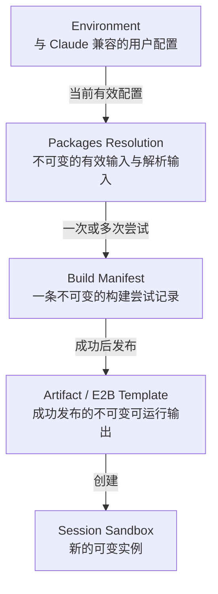
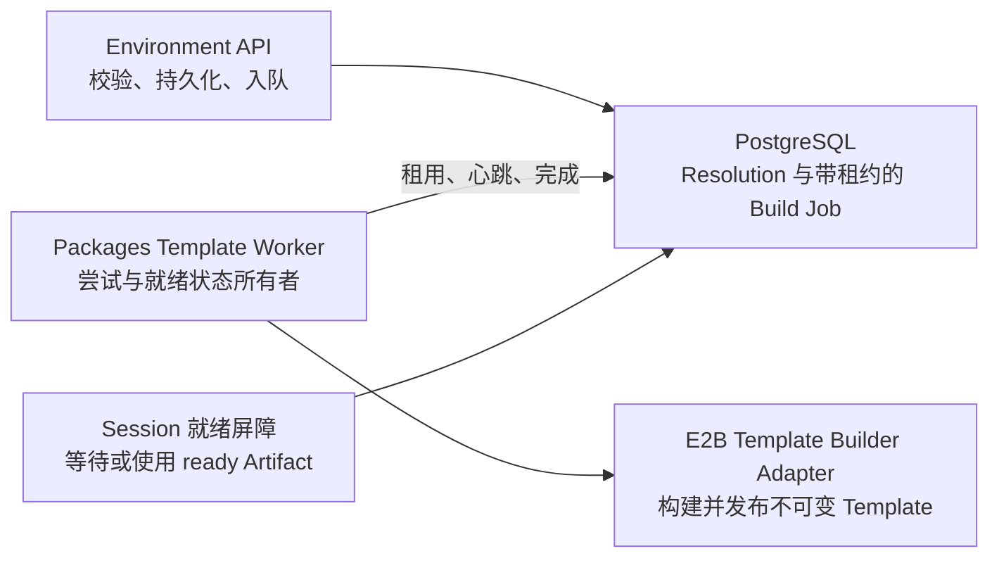

# Managed Agent Sandbox 镜像

## 目标

构建一个紧凑、运行时版本固定的 Sandbox 镜像：在使用源自 `openai/codex-universal` 源码配方、经过精选的现代开发基线的同时，保持与 Claude 兼容的 Environment Packages 合同。

最终镜像对每一种受支持的运行时都只包含一个版本。Environment 配置只会在这个基线中安装软件包，绝不会选择或安装其他运行时版本。

## 支持的运行时

| 运行时 | 精选版本 | 状态 |
| --- | --- | --- |
| Python | 3.13.14 | 已确认 |
| Node.js | 24.18.0 LTS | 已确认 |
| Go | 1.26.5 | 已确认 |
| Java | Eclipse Temurin JDK 25.0.3+9 LTS | 已确认 |
| PHP | 8.5.8 | 已确认 |
| C/C++ | GCC/G++ 14.2.0 | 已确认 |
| Bun | 1.3.14（`linux-x64-baseline`） | 已确认 |
| Rust | 1.97.0 stable | 已确认 |
| Ruby | 3.4.10 stable | 已确认 |

镜像包含 Rust 和 Ruby，使与 Claude 兼容的 `packages.cargo` 和 `packages.gem` 字段具备真实的运行时语义。Bun 是预装的 OMA 运行时，但不会新增非标准的 Environment Packages 字段。

## 版本策略

- 为每个运行时固定一个明确的稳定版本，以及不可变的下载校验和或源码 revision。
- 存在成熟 LTS 版本线时，优先选择 LTS。
- 否则使用当前稳定版本；但如果新主版本仍存在显著的生态兼容性风险，则不采用。
- 不使用预发布版、nightly、snapshot 或浮动版本。
- 升级运行时必须构建、验证、发布并有意识地部署一个新的不可变 OMA 镜像。

## 镜像谱系

使用 `openai/codex-universal` revision `47f4f0eb5337083e2f610db0d15558932cb4901d` 及其 Dockerfile 和安装方式作为源码配方，但不把它发布的多版本镜像作为父层。OMA 负责精简后的运行时矩阵，以及最终镜像的验证、发布和部署。

Codex Universal 只提供开发镜像配方和安装实践。它不会改变 Managed Agent 执行引擎，也不表示镜像中安装了 Codex CLI。继续由 Sandbox Base Template（而不是 OMA Server 镜像）包含独立发布的 Environment Manager 二进制文件 `/usr/local/bin/environment-manager`、单独固定版本的 Claude Agent 二进制文件 `/opt/claude-code/bin/claude`，以及 OMA/E2B 入口点和验证合同。Environment Manager 仍然是 Session Worker 边界，并按当前方式启动 Claude Agent。

### 仓库与所有权边界

[`superduck-ai/environment-manager`](https://github.com/superduck-ai/environment-manager) 是一个独立项目，负责 Environment Manager 的源码、构建、发布和版本治理。它发布的二进制文件是 Base Template 组装流程所消费的 Sandbox 运行时依赖；该二进制文件既不编译进 OMA Server 镜像，也不从 OMA Server 镜像中运行。

Issue #68 不会修改 Environment Manager，也不规定该项目如何发布制品。它要求 Sandbox Base Template 的组装与部署流水线在 `/usr/local/bin/environment-manager` 提供可执行文件，并保持 OMA 现有的 payload 和 `task-run` 启动合同。Packages Resolution、安装、Manifest 记录以及派生 E2B Template 发布仍由 OMA/E2B 构建路径负责，并且必须在 Environment Manager 启动前完成。

将 Claude Agent 固定为 `2.1.120`，直接安装原生 `@anthropic-ai/claude-code-linux-x64` 软件包，而不是调用 npm wrapper 解析或 postinstall 脚本。这是 OMA 现有 Environment Manager 集成合同使用的固定版本：它接受指回 OMA code-session ingress 的自托管 `--sdk-url`。我们评估过 Claude Code 2.1.211，但它会在连接前拒绝非 Anthropic Remote Control 主机；如果不采用不受支持的 endpoint 冒充，它就无法满足 issue #75 保持该合同的要求。OMA 启动时会验证 `/opt/claude-code/bin/claude --version` 与配置版本完全一致；不匹配时拒绝启动。

首个 OMA Sandbox 镜像仅支持 `linux/amd64`。构建必须使用特定平台的 Ubuntu 24.04 manifest，不能使用浮动 tag 或多平台 index：

```dockerfile
FROM ubuntu@sha256:52df9b1ee71626e0088f7d400d5c6b5f7bb916f8f0c82b474289a4ece6cf3faf
```

对应的 Ubuntu 多平台 index digest 是 `sha256:4fbb8e6a8395de5a7550b33509421a2bafbc0aab6c06ba2cef9ebffbc7092d90`，但它不是构建输入。新增 `linux/arm64` 时，必须单独设计、构建、验证并发布对应平台变体。Ubuntu 安全更新同样需要显式更新 digest，并生成一个经过重新验证的 OMA 镜像。

## 不可变的运行时来源

| 运行时 | 制品 | SHA-256 |
| --- | --- | --- |
| Go 1.26.5 | `go1.26.5.linux-amd64.tar.gz` | `5c2c3b16caefa1d968a94c1daca04a7ca301a496d9b086e17ad77bb81393f053` |
| Java 25.0.3+9 LTS | `OpenJDK25U-jdk_x64_linux_hotspot_25.0.3_9.tar.gz` | `69264a7a211bf5029830d07bc3370f879769d62ebc5b5488e90c9343a2da0e1f` |
| PHP 8.5.8 | `php-8.5.8.tar.xz` | `58910198d19e873048fe87cdfe16bc790025417ede3d1651bfa1c4b533d573f2` |
| Bun 1.3.14 | `bun-linux-x64-baseline.zip` | `a063908ae08b7852ca10939bbdc6ceed3ddabce8fb9402dce83d65d73b36e6c7` |
| Rust 1.97.0 | `rust-1.97.0-x86_64-unknown-linux-gnu.tar.xz` | `1cf17e4905b841d4c8e3f76467ac148d55fb3f54bf213c86f0d287a36471d904` |
| Ruby 3.4.10 | `ruby-3.4.10.tar.xz` | `6f32ad662baafc228d12030dbcd284f83b034dd4337b300dc84ac74d11a1eb68` |
| Claude Agent 2.1.120 | `@anthropic-ai/claude-code-linux-x64-2.1.120.tgz` | `5d1c7dd861d8d8fff0593a4fc9e8f163c2e4c01cca914c159ef25591b4740131` |
| Environment Manager `1e71969` | 来自 `1e719698d8fdb84500bd0c6b356914a4800312e6` 的干净 Linux AMD64 制品 | `f9823cdc138628891427113817a760f299868e1df9aa45b94a775fb113747045` |

Rust 以一个精确的 `x86_64-unknown-linux-gnu` 工具链安装：`rustc`、Cargo、目标平台标准库、rustfmt、Clippy、rust-analyzer 和 LLVM tools。这些组件全部来自同一份 Rust 1.97.0 AMD64 发行包，并由同一个 SHA-256 保护。不安装 `rustup` 或历史工具链，因此构建过程不会解析浮动的 `stable` channel，同时保留单一固定版本的完整常用 Rust 开发能力。

## 预装的软件包管理器

完整对齐 Claude Cloud Sandboxes 文档中的软件包管理器矩阵，而不是逐个选择管理器：

| 运行时 | 预装的软件包管理器和构建入口 | 状态 |
| --- | --- | --- |
| Python | pip、uv | 已确认 |
| Node.js | npm、Yarn、pnpm | 已确认 |
| Go | Go modules | 已确认 |
| Rust | Cargo | 已确认 |
| Java | Maven、Gradle | 已确认 |
| Ruby | Bundler、RubyGems（`gem`） | 已确认 |
| PHP | Composer | 已确认 |
| C/C++ | Make、CMake | 已确认 |

Yarn 和 pnpm 不通过 `npm install` 在构建时解析 registry metadata。它们使用 `versions.env` 中固定的 npmmirror tarball URL 与仓库信任的 SHA-256，校验通过后直接解包到兼容的 `/home/claude/.npm-global` 布局：Yarn 1.22.22 的 SHA-256 为 `c17d3797fb9a9115bf375e31bfd30058cac6bc9c3b8807a3d8cb2094794b51ca`，pnpm 10.12.1 的 SHA-256 为 `889bac470ec93ccc3764488a19d6ba8f9c648ad5e50a9a6e4be3768a5de387a3`。版本号、tarball 坐标或内容任一变化都必须同步更新受审查的镜像合同；镜像构建不会把 registry 当次返回的 integrity metadata 作为信任根，也不会静默接受同一版本号下的不同字节。

此矩阵不包含 Codex Universal 额外提供的 pipx 或 Poetry。如果某个 Environment 需要额外的项目专用管理器，在适用时可以通过受支持、与 Claude 兼容的 Packages 字段在运行时安装。

Bun 保留固定 Bun 运行时内置的软件包管理器，但不会引入非标准的 `packages.bun` Environment 字段。与 Claude 兼容的 `packages.npm` 字段仍然使用 npm。

## 预装实用工具

以一个统一基线对齐 Claude Cloud Sandboxes 文档中的数据库客户端和通用工具：

| 类别 | 预装工具 |
| --- | --- |
| 数据库客户端 | SQLite、PostgreSQL `psql`、Redis `redis-cli` |
| 系统工具 | Git、curl、wget、jq、tar、zip、unzip、SSH、SCP、tmux、screen |
| 开发工具 | Make、CMake、Docker CLI、ripgrep（`rg`）、tree、htop |
| Rust 开发工具 | rustfmt、Clippy、rust-analyzer、Rust LLVM tools |
| 文本处理 | sed、awk、grep、Vim、nano、diff、patch |

Docker 基线仅包含客户端。镜像不运行 Docker daemon，也不承诺支持 Docker-in-Docker。只有当 E2B Sandbox 显式提供受支持的 daemon 或 socket 时，Docker 命令才能管理容器；否则出现正常的 daemon 连接失败属于预期行为。

## 镜像范围边界

默认镜像只包含 Claude 软件包管理器和实用工具基线，以及精选运行时和与 Claude 兼容的 Packages 安装所必需的系统库与构建基础设施。它不会继承 Codex Universal 中每一种语言级开发工具。

排除的 Codex Universal 附加工具包括：

- pipx、Poetry、Ruff、Black、MyPy、Pyright、isort 和 pytest；
- 全局安装的 Prettier、ESLint 和 TypeScript；
- 独立的系统级 LLVM/Clang 工具链、clang-tidy、clang-format、cpplint、cmakelang、ccache、Ninja、NASM 和 Yasm；Rust 1.97.0 自带的固定 LLVM tools 仍然保留；
- Bazel/Bazelisk、golangci-lint、Bazaar、Protocol Buffers 编译器、universal-ctags、Swift、Erlang 和 Elixir 工具链。

镜像仍然包含 `packages.apt`、`packages.cargo`、`packages.gem`、`packages.go`、`packages.npm` 和 `packages.pip` 所需的原生编译基础设施，包括 CA 证书、GCC/G++、libc 开发文件、Make、CMake、pkg-config，以及选定的压缩、TLS、FFI、数据库和原生扩展开发库。项目专用工具仍可通过适用的、与 Claude 兼容的 Packages 字段安装。

独立拥有的 Environment Manager 二进制文件、Session Worker 行为、入口点和运行时用户设置等 Sandbox 运行时组件，不属于本次实用工具范围决策。特别是，issue #68 不负责 Environment Manager 的源码、构建、发布或版本治理。

## 国内镜像策略

针对中国大陆的软件包安装优化官方 OMA Sandbox 镜像。只要相关生态存在可信且持续维护的镜像，就默认使用国内 HTTPS 镜像，包括：Python 软件包使用 TUNA，Go modules 使用 Goproxy.cn，Rust 使用 RSProxy，以及 Node.js、Maven/Gradle、RubyGems、Composer 和 Ubuntu 软件包对应的国内镜像。

镜像选择属于镜像与部署的供应链策略，不属于与 Claude 兼容的 Environment 合同。不要向 `config.packages` 添加 registry 或 mirror 字段。不能仅仅因为使用国内 HTTPS 镜像就禁用 TLS 验证或添加 `trusted-host`。必须在镜像配置和软件包安装设计中明确规定具体 endpoint 和上游 fallback 行为。

| 生态 | 默认国内来源 |
| --- | --- |
| Ubuntu APT | TUNA Ubuntu 镜像 |
| pip 和 uv | `https://pypi.tuna.tsinghua.edu.cn/simple` |
| Go modules | `https://goproxy.cn` |
| Cargo sparse registry | `sparse+https://rsproxy.cn/index/` |
| Rustup distributions | `https://rsproxy.cn`，update root 为 `https://rsproxy.cn/rustup` |
| npm、Yarn、pnpm 和 Bun | `https://registry.npmmirror.com` |
| Maven | 阿里云 Maven Central/public 仓库 |
| Gradle | 阿里云 Maven 仓库和 Gradle Plugin 镜像 |
| RubyGems 和 Bundler | `https://mirrors.cloud.tencent.com/rubygems/` |
| Composer | 阿里云 Composer 镜像 |

### 镜像回退

镜像构建可以从国内镜像回退到不可变的官方制品来源。每个制品仍必须匹配其固定的 SHA-256 或源码 revision，因此更改下载 endpoint 不会改变构建可接受的内容。

Sandbox 运行时安装 Environment Packages 时，将配置的国内 registry 视为权威来源，不会静默重试官方 registry，也不会混用官方 registry。镜像缺失、同步延迟或服务中断会产生明确的软件包安装失败；错误应指出软件包管理器、已配置镜像、失败阶段、可安全报告的上游状态和重试建议。尤其是，pip 不得使用 `extra-index-url` 混合 TUNA 与 PyPI。

Node.js 生态不能只依赖各工具显示的配置值判断实际来源。npm、pnpm 和 Yarn Classic 共同读取 `/etc/npmrc` 中的 npmmirror registry；Yarn Classic 的 `yarn config get registry` 仍可能显示自身默认值，因此合同通过一次隔离缓存的真实依赖解析确认请求实际到达 npmmirror。Bun 不读取 `NPM_CONFIG_USERCONFIG`，必须另外设置 `BUN_CONFIG_REGISTRY=https://registry.npmmirror.com`。RubyGems 读取共享 `.gemrc`，Bundler 则通过 `BUNDLE_USER_CONFIG=/home/user/.bundle/config` 读取独立的 `mirror.https://rubygems.org` 映射；两者均使用腾讯云 RubyGems 镜像。Bundler 不设置 `fallback_timeout`，因此镜像失败时不会自动请求 `rubygems.org`。TUNA RubyGems compact-index endpoint 当前会重定向到官方站点，不满足“运行时不混用官方 registry”的合同，故不用于 Bundler。

Go 是有意设置的例外，使用其原生 proxy-chain 语义：

```text
GOPROXY=https://goproxy.cn,direct
```

Go checksum database 保持启用。不要设置 `GOSUMDB=off` 或全局 `GONOSUMDB=*`。

## Environment Packages 物化

将每一种不同的、与 Claude 兼容的 `config.packages` 配置物化为一个不可变 E2B Template，该 Template 派生自运行时固定的 OMA 基础镜像。Session Sandbox 从已经解析的派生 Template 启动；它不会在每次 Sandbox 启动时重新安装该 Environment 的完整软件包集合。

软件包必须在 Environment Manager 或 Agent 启动前，按照 Claude 定义的管理器顺序安装：

```text
apt → cargo → gem → go → npm → pip
```

确定性的 Packages Build Key 至少包含：

- 运行时固定的基础镜像 digest；
- Sandbox 平台；
- 运行时矩阵 revision；
- 国内镜像策略 revision；
- 规范化 Packages JSON；当软件包数组顺序可能影响安装语义时，必须保留该顺序。

有效输入相同的不同 Environment 可以复用同一个派生 Template。每个 Session 仍然会获得具有独立可变文件系统状态的新 Sandbox；只有不可变的软件包结果会被共享。Environment Packages 更新会为之后的每个 Sandbox 解析出一个新 key，绝不会修改正在运行的 Sandbox。即使软件包字符串没有变化，基础镜像、运行时矩阵或镜像策略更新也同样会使之前的派生 Template key 失效。

### 来源追踪模型

将用户意图、解析后的构建输入、构建证据和可运行制品分离：



**Environment** 是公开且与 Claude 兼容的资源，保存用户请求的 `config.packages`。它始终表示当前可变配置，不暴露内部构建状态。

**Packages Resolution** 是不可变的内部代际记录，包含 Packages Build Key、规范化的 Packages 输入、基础镜像与平台、运行时和镜像策略 revision、所选来源，以及为浮动规格选定的精确直接依赖版本。具有相同有效输入的多个 Environment 可以引用同一个 Resolution。更新 Environment 或重要构建输入 revision 时，会创建新的 Resolution，而不是修改旧 Resolution。

**Build Manifest** 是某个 Resolution 的一条不可变构建尝试记录。它记录 builder 身份、有序步骤状态、时间戳和退出结果、脱敏诊断日志引用、来源 endpoint、由软件包管理器报告的轻量级已安装清单，以及成功时发布的制品身份。一个 Resolution 可以有多次失败尝试，但失败的 Manifest 不会发布 Artifact，也永远不能运行。

**Artifact / E2B Template** 是不可变的成功输出，由 E2B Template ID 和 Build UUID 标识。处于 ready 状态的 Artifact 可以跨 Environment 复用，但每个 Session 都会获得一个新的 Sandbox。Session 执行元数据记录实际使用的 Resolution 和 Artifact，因此后续 Environment 修改无法重写历史。

Packages Build Key 标识期望输入；E2B Template ID 和 Build UUID 标识已发布输出。Issue #68 不要求 E2B 提供镜像内容 digest，也不要求对生成的镜像进行 Docker 专用检查。

这些来源追踪层是 issue #68 的内部实现模型。它们要求持久化存储、脱敏日志、运维指标，并在 Session 执行元数据中记录实际使用的 Resolution 和 Artifact；但不会向与 Claude 兼容的 Environment API 添加字段或资源，也不要求在本 issue 中提供专用的构建可观测性控制台。公开/管理员构建 API 或 UI 属于后续范围。

Issue #68 不生成或保留 SBOM，不扫描 Packages Artifact 的漏洞，不应用 CVE 严重性门禁，也不引入漏洞例外和审批策略。已安装清单只是六个软件包管理器安装步骤已报告的轻量级证据，并非完整文件系统证明。SBOM 和漏洞管理能力延后实现，不阻塞 Packages 物化。

### 物化时机

创建和更新 Environment 时，系统校验并持久化与 Claude 兼容的配置，返回正常 Environment 资源而不添加公开构建状态，并将尽力执行的异步 Packages Template 预热任务入队。创建 Session 时计算当前 key，并在启动 Environment Manager 前强制执行就绪屏障：

- ready Template 立即使用；
- 并发调用方加入同一个 key 的单个进行中构建；
- 缺失或之前失败的 Template 启动一次受控构建尝试；
- 必需构建失败时，Session 启动失败，而不是在缺少已配置 Packages 的情况下启动 Agent；
- 空 Packages 配置直接使用运行时固定的基础 Template。

内部 Template Build 记录可以使用 `queued`、`building`、`ready` 和 `failed` 状态，但这些状态不会扩展与 Claude 兼容的 Environment 响应。若预热在 Session 请求前完成，它会从正常 Session 启动路径中移除软件下载、依赖解析和原生编译耗时；但不会消除 E2B Sandbox 供应和进程启动延迟。

### 构建执行边界

OMA 通过专用的 `packagetemplates` 垂直模块负责 Packages 物化。创建或更新 Environment 时，系统持久化 Environment 和 Resolution，然后写入持久化 Packages Build Job；HTTP handler 永远不执行实际 Template Build。创建 Session 时调用同一个模块的就绪服务，使用 ready Artifact，或者等待与该 Packages Build Key 对应的唯一构建。



Packages Build Job 队列与面向 Session 的 Environment Work 相互独立。它持久化 claim lease、heartbeat、尝试调度和终态结果，使 OMA 重启不会丢失进行中的决策，也不会重复执行。Packages Template Worker 初始运行在 OMA Server 进程中，沿用仓库现有的持久化后台 Worker 部署方式。由于队列和 Worker 合同是持久化的，之后可以把同一个 Worker 移到独立部署中，而无需更改公开 Environment API、Packages 来源追踪记录或 Session 就绪合同。

E2B Template Builder adapter 与现有 Sandbox Runtime Provider 相互独立。前者物化并发布不可变 Template；后者创建、连接、在其中运行命令并销毁可变的 Session Sandbox。Environment Manager 和 Environment Runner 都不安装 Environment Packages：Environment Manager 仍然是独立拥有的进程，仅在就绪后启动；Environment Runner 只使用选定的 ready Template 供应 Session Sandbox。

### 延后的 Template 生命周期能力

派生 Template 镜像的物理删除、保留策略、持久化删除状态，以及 E2B 镜像内容 digest 暴露，都不属于 issue #68。API 层面不存在 Template，不得解释为物理镜像已经删除。这些后续能力不阻塞 Template 构建、状态轮询、复用或 Session 就绪。

### 原子发布

只有在所有已配置管理器都按规定顺序成功完成后，Packages Template 才可复用。第一个失败的管理器会终止后续链路；之后的管理器不再运行，不发布部分 Template，Agent 也不能从该结果启动。重试必须从干净、运行时固定的基础 Template 开始，不能接着使用已经部分修改的文件系统。失败的 Template Build 记录保留脱敏诊断信息，但永远不能用于创建 Sandbox。

### 失败分类与重试

只自动重试被归类为瞬时网络或构建基础设施问题的失败，例如临时 DNS 或连接失败、请求超时、HTTP 408/429/502/503/504，或者 E2B builder 不可用/丢失。重试次数有上限，采用带抖动的指数退避，遵守 `Retry-After`，为每次完整尝试保留一条 Build Manifest，并始终处于该 Packages Build Key 的 single-flight 操作内。

不要自动重试无效软件包规格、缺失的软件包或版本、HTTP 400/401/403/404/410、依赖冲突、编译器或软件包管理器的确定性失败、无法满足的 APT 版本、容量耗尽或构建超时。校验和、签名和 TLS 验证失败属于不可重试的供应链失败，绝不能回退到禁用验证。瞬时重试耗尽后，Resolution 不会拥有 ready Artifact，并阻止 Agent 启动。具体尝试次数和总墙钟时间预算应在 E2B 构建基准测试后确定，而不是在设计阶段猜测。

### 软件包规格合同

每个 Packages 数组使用 Claude 文档规定的管理器原生软件包规格。OMA 不添加通用软件包对象，也不添加单独的版本字段。

| 字段 | 可接受的合同示例 | 管理器操作 |
| --- | --- | --- |
| `apt` | `ffmpeg`、`name=version` | `apt-get install` |
| `cargo` | `ripgrep`、`ripgrep@14.1.1` | `cargo install` |
| `gem` | `rails`、`rails:7.1.0` | RubyGems 安装 adapter |
| `go` | `golang.org/x/tools/cmd/goimports@v0.35.0`、`path@latest` | `go install` |
| `npm` | `typescript`、`typescript@6.0.0`、`@scope/name@version` | 全局 npm 安装 |
| `pip` | `pandas`、`pandas==3.0.0`、有效的 pip/PEP 508 requirement | `python -m pip install` |

OMA 只验证安全的请求 envelope：值必须非空、不能以 option 前缀开头、不能包含 NUL/换行符/控制字符，并且必须符合以下请求资源限制：

| 限制 | 最大值 |
| --- | ---: |
| 单个软件包管理器数组中的条目数 | 128 |
| 六个软件包管理器数组的条目总数 | 256 |
| 单个软件包规格，按 UTF-8 字节计量 | 2 KiB |
| 完整 `config.packages` 对象的规范 JSON 编码 | 64 KiB |

创建或更新 Environment 时，会在创建 Packages Resolution 或启动 Template Build 前拒绝超限请求。响应使用与 Claude 兼容的 `400 invalid_request_error` 结构，并指出相关 `config.packages` 字段；OMA 永远不会截断或静默忽略软件包条目。这些是服务端运维保护措施，而不是额外的 Environment 请求或响应字段，因此 Anthropic SDK 软件包类型保持不变。

OMA 不尝试重新实现六种软件包规格语法。通过安全 envelope 的值仍可能被其原生软件包管理器拒绝；这种拒绝属于原子 Template Build 失败。

使用结构化参数数组或等效的非 shell 执行边界调用管理器。绝不能把软件包字符串拼接到 `sh -c` 中；在有效软件包规格内有意义的字符，包括 scoped package 的 `@`、PEP 508 marker、URL、extras 和空格，都必须保持为数据，不能成为 shell 语法。

未固定版本的规格在其 Packages Template 首次成功物化时，解析为已配置国内镜像中可见的最新版本。成功解析结果不可变并可复用，不会因为 registry 后来发布新版本而漂移。新的有效 Environment 配置，或者镜像/运行时/镜像策略 revision，会产生新的物化机会。

### Issue #68 的网络范围

Issue #68 不改变或扩展 Environment 网络行为。OMA 已经会在缺少网络配置时默认使用 `{"type":"unrestricted"}`；本 issue 的 Packages 物化假定构建出口不受限制，并使用已配置的国内镜像和经过验证的构建来源 fallback，不依赖每个 Environment 的网络字段。

现有 Session Sandbox 网络标准化和强制执行保持不变。受限网络、`allow_package_managers`、`allowed_hosts`、直接 URL 或 VCS 软件包规格、国内镜像主机分类和 ready Artifact 复用之间的交互，延后到专门的后续 issue。#68 的 Packages 验收测试使用默认的 unrestricted Environment，避免把这项延后的策略误认为已经完成受限网络兼容。

## 运行时账户

沿用旧 Sandbox 镜像的运行方式，以 `root` 作为默认运行时账户，同时保留当前 OMA 工作目录和 Claude 共享工具布局：

```text
user:    root
home:    /root
workdir: /home/user
shell:   /bin/bash
```

E2B 使用镜像默认身份启动命令时，Environment Manager 及其 Claude 子进程继承 `root` 身份；OMA 的 Managed Agent 工作目录仍固定为 `/home/user`，不会因为 `HOME=/root` 而改变工作区位置。镜像同时保留 UID/GID 1000 的 `user` 账户，以及旧运行合同使用的 `claude` 兼容账户：后者 UID/GID 固定为 1001，home 为 `/home/claude`，shell 为 Bash。旧 Claude 运行布局中有行为意义的 `/home/claude/.npm-global`、`/home/claude/.local/bin`、pip cache、Node 全局模块、`.claude` 状态目录和 `project` 目录继续保留。`user` 和 `claude` 加入彼此的附加组，两个 home 使用保留属主的 setgid 组写权限；这样显式降权到任一兼容账户时仍能访问 Claude 共享路径和 `/home/user` 工作目录，而无需使用全局可写权限。

最终镜像明确使用 `USER root`、`HOME=/root` 和 `WORKDIR /home/user`。`root` 默认身份是本镜像的运行合同，不是 E2B 协议兼容分支，也不依赖额外入口点切换用户。镜像预先创建仅 root 可访问的 `/root/.claude`，并以合法空 JSON 初始化 `/root/.claude.json`；这使 Claude Code 的首次配置锁和持久化路径在进程启动前就存在，同时不把用户状态烘焙进镜像。

`user` 和 `claude` 兼容账户仍拥有免密码 sudo，与现有开发 Sandbox 行为一致：

```sudoers
user ALL=(ALL) NOPASSWD:ALL
claude ALL=(ALL) NOPASSWD:ALL
```

OMA 在受控软件包供应阶段仍显式以 root 执行 `packages.apt`。免密码 sudo 用于交互式开发和诊断；它不是软件包供应器的提权机制，也不会绕过 E2B 网络策略。镜像不包含 Docker daemon 或宿主机 Docker socket。

镜像级环境还保留旧运行布局中的 `PIP_ROOT_USER_ACTION=ignore`、`PIP_CACHE_DIR=/home/claude/.cache/pip`、`PIP_CONFIG_FILE=/etc/pip.conf`、`PYTHONUNBUFFERED=1`、`IS_SANDBOX=yes` 和 `NODE_PATH=/home/claude/.npm-global/lib/node_modules`。`PATH` 优先暴露 `/home/claude/.npm-global/bin` 与 `/home/claude/.local/bin`，随后才是固定运行时和位于 `/home/user` 的稳定语言前缀。pip 配置使用所有账号均可读取的 `/etc/pip.conf`，不恢复旧镜像对 `/root/.config/pip/pip.conf` 的单账号依赖。Maven、Gradle、RubyGems 和 Composer 也通过显式环境变量继续读取 `/home/user` 下已经固定的国内镜像配置，避免默认身份改为 `root` 后悄然回退到 `/root` 下的空配置。

## Environment Packages 安装布局

默认运行身份为 `root`，因此 `packages.apt` 和语言软件包管理器都以 `root` 执行；语言管理器不使用 `/root` 作为安装前缀，而是通过镜像环境继续写入在 Environment Manager 启动前已经生效的稳定共享前缀：

| Packages 字段 | 身份 | 安装前缀或二进制目录 |
| --- | --- | --- |
| `apt` | `root` | Ubuntu 系统目录 |
| `cargo` | `root` | `/home/user/.cargo/bin` |
| `gem` | `root` | `/home/user/.local/share/gem` |
| `go` | `root` | `/home/user/go/bin` |
| `npm` | `root` | `/home/claude/.npm-global` |
| `pip` | `root` | `/home/user/.local/share/oma/python`；cache 为 `/home/claude/.cache/pip` |

设置派生镜像环境，使已安装 Python 软件包无需手动激活即可导入，已安装 CLI 工具可以直接执行。环境包括对应的 `PATH`、`VIRTUAL_ENV`、`NODE_PATH`、`GOBIN`、Cargo install root 和 RubyGems 路径。除有意保留兼容合同的 npm 全局前缀和 pip cache 外，不要把 Environment Packages 安装到 `/root` 或其他 `/home/claude` 子目录；默认进程已经是 `root`，不需要再通过 sudo 包装语言管理器。

发布 Artifact 前，删除 APT lists 和 archives，以及运行时不需要的 pip/uv、Cargo、Go、npm/Yarn/pnpm、RubyGems、Maven/Gradle 和 Composer 下载或构建缓存。保留已安装的软件包和二进制文件、由软件包管理器报告的轻量级已安装清单，以及 Build Manifest 引用。构建系统缓存可以放在已发布 Artifact 之外，以加速后续构建而不增加运行时体积。

## 运行时固定基础镜像的实现

Issue #75 在 `images/sandbox-base/` 下实现独立镜像；仓库根目录 Dockerfile 仍然是 OMA Server 镜像。`scripts/sandbox-image.sh` 是本地和 CI 进行来源验证、Buildx 组装、镜像检查及运行时合同执行的统一入口。`justfile` 提供对应的 `sandbox-image-check`、`sandbox-image-build` 和 `sandbox-image-test` 命令。

`images/sandbox-base/versions.env` 是可执行镜像合同中平台、runtime、package manager、工具、制品下载坐标、校验和和 revision 的唯一值来源。wrapper 从一个受检查的参数名列表生成 BuildKit 参数，Dockerfile 对应 `ARG` 不包含重复默认值。构建会把同一文件复制为 `/etc/oma-sandbox-versions.env`，运行时 verifier 直接读取该合同来形成预期版本。测试本地镜像时，wrapper 先把仓库当前 `versions.env` 的 SHA-256 与镜像内副本比较，再比较 verifier 脚本的 SHA-256；因此旧 tag 不能只用自己携带的旧版本合同和旧 verifier 相互验证后假通过。版本化安装目录通过 `/opt/<runtime>/current` 稳定链接暴露，Dockerfile 环境、登录 profile 和 verifier 因而不再复制具体版本路径。

同一合同还固定 Ubuntu snapshot 时间点、带日期的 curl CA extract 及其 SHA-256、带版本路径的 Composer phar 及其 SHA-256，以及 Yarn/pnpm 的 npmmirror tarball 坐标与 SHA-256。所有 Dockerfile 构建 stage 继承固定的 Ubuntu 官方 snapshot，从而保证固定 GCC/G++ 包版本与其他 APT 输入不会随滚动索引变化；最终 runtime stage 在完成安装后把 source 恢复为 TUNA，保持 `packages.apt` 的国内镜像策略。Composer 直接安装经过校验的 phar，不执行内容会独立变化的在线 installer；Yarn/pnpm 直接解包经过校验且没有外部依赖的 npm tarball，不使用实时 registry metadata 进行全局安装。

由 containerd 支持的引擎可能会在新加载的层首次挂载前暂时报告零大小，因此最终体积测量会先运行一个不执行实际操作的 `/bin/true` 容器，在不修改镜像的情况下强制生成解包元数据。随后读取两次 `docker image history --human=false`，并拒绝不稳定结果。它从 `RootFS.Layers` 推导权威的非空文件系统层数，减去 OCI 标准空 tar DiffID 出现次数，并要求 history 在汇总精确字节数前，恰好包含这么多非零大小条目。这样既会拒绝普通截断，也会拒绝那种虽然稳定、且返回的总条目数至少等于 RootFS 层数，但仍发生截断的结果。合同不假定 `docker image inspect .Size` 在每一种存储后端上含义相同。三 GiB（`3,221,225,472` 字节）只作为当前体积目标进行报告，不作为强制上限；超过目标的镜像标记为 `size_target_status=above_target`，并继续执行平台和运行时合同。inspect 值单独作为存储大小报告。在执行镜像内合同前，本地测试还会把其 SHA-256 与仓库 verifier 比较，防止陈旧镜像通过其内嵌的旧脚本满足更新后的测试。2026-07-18 验证的最终本地构建是镜像 `sha256:39a12caa2057ef88e98cda1b8163bc7cdc53708946f2667c5112e8e180fdc06f`。它包含 `3,426,467,840` 字节的未压缩层数据，比参考目标高 `205,242,368` 字节；OrbStack 的 containerd 存储报告为 `1,271,599,304` 字节。与只安装 `rustc`、Cargo 和标准库的旧构建相比，保留单版本 rustfmt、Clippy、rust-analyzer 和 LLVM tools 使未压缩镜像增加 `285,638,656` 字节（约 272.4 MiB）；随后加入 `claude` 兼容账号、两个 home 的共享权限、sudoers 及旧 Claude 目录布局合计只再增加 `40,960` 字节（40 KiB），其中恢复 npm/pip/状态目录和 Environment Manager 链接布局只比账号版本增加 `4,096` 字节。切换为 root、补充稳定的 `claude`/`cc`/`c++` 命令和对应合同验证后，未压缩数据相对上一版增加 `28,672` 字节；为 root 初始化 Claude 配置路径又增加 `4,096` 字节；引入镜像内版本合同和固定 runtime 的 `current` 链接后又增加 `32,768` 字节；把 Yarn/pnpm 从实时 `npm install` 改为仓库固定 tarball 后增加 `24,879,104` 字节（约 23.7 MiB）。这些实测成本被接受，不会触发硬性失败。多阶段组装不会把源码树和下载归档带入运行时镜像。基础层禁用 Ubuntu 的 `docker-clean` hook，并启用 `APT::Keep-Downloaded-Packages`，使 BuildKit cache mount 能够保留软件包归档而不提交进最终镜像；独立 stage 和 GitHub Actions layer cache 可以在输入未变化时保留昂贵的运行时构建结果。仅运行时使用的构建参数在首次使用的位置声明，因此更改 Claude Agent 元数据不会使之前的 APT 和语言运行时层失效。每个固定制品下载都会重试部分传输、HTTP/2 stream 失败和其他瞬时错误，然后才由校验和门禁判定 stage 失败；来源合同会检查 Dockerfile 和 workflow 中每一次 `curl` 下载，而不是只抽查一个代表。Python 使用 PGO 和 LTO 提升运行时性能，Rust 保留单一固定版本下的完整常用开发组件。

Environment Manager 二进制文件通过命名 BuildKit context 进入构建。`versions.env` 固定源码 revision `1e719698d8fdb84500bd0c6b356914a4800312e6`、干净版本 `1e71969` 和制品 SHA-256 `f9823cdc138628891427113817a760f299868e1df9aa45b94a775fb113747045`。其 Go 构建元数据以 `vcs.modified=false` 记录相同 VCS revision；两次重复的干净 Linux AMD64 构建产生相同的固定校验和。调用方只能提供这些完全一致的字节——本地构建和 CI 都不能把允许的 hash 与任意二进制文件一起覆盖。wrapper 在调用 BuildKit 前验证字节，Dockerfile 会再次验证安装到 `/opt/env-runner/environment-manager` 的实体文件，并由 `/usr/local/bin/environment-manager` 符号链接提供稳定命令路径。二进制文件绝不会提交到本仓库，OMA 既不重新编译它，也不改变其协议。镜像合同检查 Environment Manager 的固定版本、兼容符号链接和必需的 `task-run` flags，但不在 OMA 仓库中实现针对某一 E2B 服务的启动、Template 注册或 Sandbox 生命周期兼容层。

最终镜像默认使用 `USER root`、`HOME=/root` 和 `WORKDIR /home/user`。容器环境变量和 `/etc/profile.d/oma-sandbox.sh` 通过 `current` 稳定链接暴露相同的固定运行时、Claude 兼容路径与软件包管理器路径。直接 Docker 验证会先读取 `/etc/oma-sandbox-versions.env`，再确认默认 root 身份和工作目录，并分别以 `user` 和 `claude` 创建、删除 Claude 共享路径中的探针文件，防止 root 自身可写掩盖兼容账号的权限问题。验证还要求 `cc`、`c++` 和 `claude` 稳定命令存在，并实际编译运行一个无外部依赖的最小 Cargo 项目。对于仅检查配置文件不足以证明真实来源的 Yarn、Bun 和 Bundler，verifier 使用临时项目和隔离缓存执行最小依赖解析，要求日志出现配置的国内镜像，并拒绝出现对应官方 registry 请求。

## 验证与发布流程

验证分为三层：

1. 来源合同测试断言固定的平台、digest、Ubuntu snapshot、版本、校验和、禁止工具、外部 Environment Manager 输入以及 Dockerfile 有效性；同时检查每个构建参数都来自 `versions.env`、Dockerfile 不复制默认版本值、动态下载坐标使用对应参数、第三方 Actions 固定到 commit SHA、checkout 不持久化凭据、profile 只使用稳定 runtime 路径，以及 verifier 读取镜像内同一版本合同。该层在相关 Pull Request 上执行，不需要完整重建镜像即可阻止版本合同漂移。
2. 本地镜像验证检查 `linux/amd64`，按照 3 GiB 报告目标测量并分类未压缩体积，记录本地镜像 ID，比较仓库与镜像内的版本合同和 verifier 校验和，并使用镜像默认 `root` 账户运行 `/usr/local/bin/verify-sandbox-contract`。运行时合同包含 Yarn、Bun 和 Bundler 的真实镜像请求探针，因此需要能够访问配置的国内镜像。
3. 只有在来源和本地镜像合同都通过后，手动触发的 GitHub Actions workflow 才可以发布。它推送经过精确测试的 daemon 镜像，将已发布 OCI index 的 descriptor 或单 manifest 的 config digest 与对应的已测试本地身份进行验证，并记录不可变 registry manifest digest。

发布 workflow 不包含 E2B 部署步骤。发布经过验证的 GHCR 镜像与替换生产 E2B Base Template 是两个独立操作；提升时必须显式使用记录的 `image@sha256:...` 身份。
