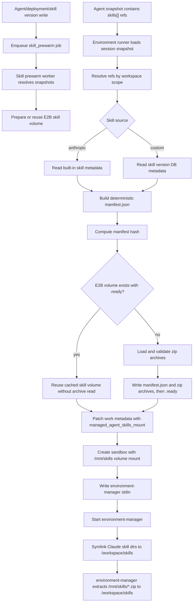

# Managed Agent Skills Runtime

## 背景

Managed Agents API 已经支持 `skills` 字段和 Skills API：

- custom skill 上传时会被规范化为单顶层目录 zip，并存入对象存储。
- built-in skill 来自 `SKILLS_BUILTIN_DIR` 下的 `.skill` archive。
- agent 只保存 `{type, skill_id, version}` 引用，并把它们写入 agent version / session snapshot。

Claude Code 的 skill 发现边界仍然是本地文件系统目录。Managed Agents 运行时的目标不是让 Claude Code 读取 API/DB，而是给 sandbox 提供一个稳定的 `/mnt/skills` 视图，由 `environment-manager` 负责把其中的 skill archives 解压到 sandbox 内的统一目录。

## 运行时挂载策略

Environment runner 在启动云端 managed agent session 时执行以下步骤：

1. 从 session 的 agent snapshot 读取 `skills[]`。
2. 对 `type=anthropic`，从 built-in catalog 读取 archive 元数据。
3. 对 `type=custom`，按 workspace scope 从 DB 解析 `latest` 或指定版本，并读取 skill version 元数据。
4. 生成确定性的 `manifest.json`，其中列出每个 skill 的 source、id、resolved version、directory、filename、sha256 和 size。`requested_version` 不进入 manifest/hash，因此 `latest` 与同一个 resolved version 的显式引用会复用同一个 volume。
5. 用 manifest hash 生成 E2B volume 名称；如果同 hash volume 已有 `.ready` 标记，则直接复用，不读取对象存储 archive。
6. volume miss 时才读取对应 zip archive，并校验 archive 大小、checksum、解压总大小、单顶层目录和顶层 `SKILL.md`，然后把 `manifest.json` 和所有 zip 写入该 volume。
7. 把 mount 信息写入 environment work metadata，sandbox create 时挂载到 `/mnt/skills`。
8. runner 只写入 `environment-manager` stdin，不再把 skill zip 写进 sandbox 临时目录，也不在启动 shell 中解压 skill。

`/mnt/skills` 的约定视图：

```text
/mnt/skills/
  manifest.json
  anthropic__xlsx__builtin__<sha>.zip
  custom__skill_...__1__<sha>.zip
  .ready
```

`environment-manager` 会在 environment 初始化前把 Claude Code 的 skill discovery 目录软链到 `/workspace/skills`，再在 Claude Code 启动前把 `/mnt/skills/*.zip` 解压到 `/workspace/skills`。`manifest.json` 和 `.ready` 当前由 runner/E2B volume 侧用于确定性缓存和冷启动复用；environment-manager 暂不强依赖 manifest/checksum。

## 当前流程



## 异步 prewarm

Agent create/update、deployment create/update 和 custom skill version create 会 best-effort 写入 `jobs.type = 'skill_prewarm'` outbox。API 请求只做轻量 enqueue，enqueue 使用短超时 context；失败只记录日志，不影响主请求响应。

enqueue 的短超时属于 handler/resource 边界，而不是 `skillprewarm.Enqueuer` 的内部策略。这样 agents、deployments、skills handler 只依赖本包定义的最小接口，只有 `internal/api` 组合根依赖 `internal/skillprewarm` 具体实现。当前三处 handler 使用相同的 3 秒 best-effort 超时；如果后续需要集中配置，应抽到中性的运行时 policy/config，而不是让资源 handler 重新依赖 prewarm 实现包。

触发条件：

- agent create：`skills` 非空时 enqueue snapshot。
- agent update：仅当 `skills` 变化且更新后非空时 enqueue snapshot。
- deployment create：`agent_snapshot.skills` 非空时 enqueue snapshot。
- deployment update：仅当 `agent_snapshot.skills` 变化且更新后非空时 enqueue snapshot；agent 的 name、description、tools、metadata 等非 skill 变化不会触发。
- custom skill version create：enqueue fanout。

`skills` 的 enqueue 判定只把非空数组视为需要预热。缺失 `skills`、`skills:null` 和 `skills:[]` 都视为无 skills，不触发 prewarm；实际 session 启动时仍由 runtime resolver 解析 snapshot，作为最终正确性兜底。

`skill_prewarm` job 分两类：

- `snapshot`：包含 agent snapshot、source、source_id 和 trigger；worker 复用 runtime resolver 解析 `skills[]`，再调用同一套 `PrepareSkillMount` 创建或复用 manifest hash 对应的 E2B volume。
- `fanout`：由 custom skill version 创建触发，分页扫描引用该 custom skill 且 version 为 `latest` 或缺省的 agent/deployment snapshot，再生成 `snapshot` jobs。payload 中包含触发的 skill version，因此同一 agent snapshot 在不同 latest version 发布后仍会重新预热。

prewarm 只是冷启动优化，不是正确性边界。即使 job 丢失、失败或延迟，session 启动路径仍会在 sandbox create 前执行 lazy prepare，并把最终 mount metadata 写入 environment work。

worker 失败时沿用 jobs 表的 retry 状态机，并在 payload 中记录 `last_error` 和 `last_error_at` 供排查；达到最大尝试次数后进入 `failed`。

## 版本与组合语义

`version:"latest"` 在 session launch 时解析成当时的 active latest。已经启动的 Claude Code session 使用当次 manifest 对应的挂载视图，不会因为后续 skill 上传新版本而变化。

多个 skill 组合由 manifest hash 唯一标识，因此相同 resolved skill 组合可复用同一个 volume，减少重复写入。manifest hash 不包含调用方请求的 `latest`/显式版本文本，只包含最终 resolved version 和 archive 元数据。若多个 archive 使用同一个顶层目录，runner 会在启动前失败；Claude Code 的 filesystem discovery 以目录为单位，目录冲突无法无歧义表达。

## 实现边界与后续优化

runtime resolver 返回的是 skill 元数据和懒加载 archive loader。`BuildMountManifest` 只能读取元数据，不允许触发 archive 下载；`PrepareSkillMount` 命中已有 `.ready` volume 时也必须直接返回，保持零对象存储 archive IO。只有 volume miss 写入阶段才调用 `RuntimeSkill.LoadArchive`，并再次校验 archive 大小、checksum、解压总大小和目录结构。

`RuntimeSkill.LoadArchive` 当前会返回 defensive copy，保证调用方不会意外修改 resolver/cache 持有的字节。热路径每个 miss 只调用一次，额外复制成本可接受。若以后调用点变多，可以在明确所有 loader 都返回调用方独占字节后再放松该约束。

`RuntimeSkill.archiveLoader` 是私有字段，导出的 `RuntimeSkill` 字面量如果没有 loader，只适合测试 fake 或已经带 `Archive` 字节的场景；真实 custom/built-in skill 应由 `RuntimeResolver` 构造。后续若有外部包需要安全构造 loader，应优先增加 constructor 或 option setter，而不是直接暴露字段。

E2B volume 当前通过 `ListVolumes` 做 name 到 id 的映射，create 失败后会再 list 一次处理并发创建。正确性依赖 manifest hash volume name 和 `.ready` marker，不依赖本地缓存。若 workspace volume 数量变大，可优先使用 SDK 的按名称查询能力；如果 SDK 暂无该能力，再在 provider 内增加短 TTL name cache，并保留 create-conflict 后重新查询的兜底路径。

## API 与数据模型

本实现不新增公开 API，也不新增 DB schema 或 migration。

原因是上传后的 custom skill zip 已经存入对象存储，agent/session snapshot 已经持久化 skill 引用；运行时只需要解析这些引用并生成 sandbox mount metadata。异步 prewarm 复用现有 `jobs` 表作为 outbox，不改变 agent、deployment、session 或 skill 的公开数据模型。

## Environment Manager 契约

`environment-manager` 需要在 Claude Code executor 启动前处理 `/mnt/skills`：

- 如果 `/mnt/skills` 不存在或没有 `*.zip`，视为无 managed agent skills。
- 当前只扫描 `*.zip`，不读取 `manifest.json`，也不校验 `.ready`。
- 每个 archive 仍需是单顶层目录并包含顶层 `SKILL.md`，同时拒绝路径逃逸、symlink 和解压大小超限。
- environment 初始化前，将当前用户和 `/home/claude` 的 `.claude/skills` 目录软链到 `/workspace/skills`。
- 解压目标为 `/workspace/skills`，因此 Claude Code 通过原 discovery 目录即可看到 mounted skills。
- manifest/checksum 校验后置；需要时可在 environment-manager 中升级为读取 `manifest.json` 并校验 sha256、directory 和 ready marker。

## 非目标

- 不在创建 agent 时为每个 agent 打包组合 zip。
- 不提前安装所有 skills。
- 不把 DB 层改成对象存储读取方。
- 不要求 sandbox 内部知道 custom skill 的 API/DB 身份；sandbox 只看到 `/mnt/skills` 文件视图。
