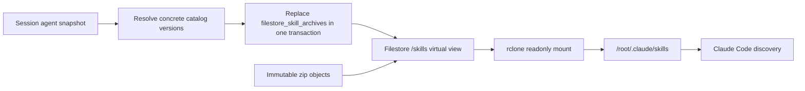

# Managed Agent Skills Runtime

## 背景与目标

Managed Agents API 的 agent snapshot 只保存 `{type, skill_id, version}` 引用。custom skill 和
built-in skill 的每个具体版本都已经是一个规范化的不可变 zip，并由 catalog version row
记录对象存储 bucket、key、大小、SHA-256 和顶层目录。

Claude Code 需要在本地 discovery 目录中看到解包后的目录树。运行时因此把 zip 内容作为
Filestore 的虚拟只读目录直接映射到 `/root/.claude/skills`，不再建立 E2B skill volume，
也不再由 Runner 或 Environment Manager 预热、复制或解压文件。

## 启动流程

Environment Runner 在创建 cloud managed-agent Sandbox 前完成：

1. 从 Session 的 agent snapshot 严格解析 `skills[]`。
2. `type=anthropic` 从 `builtin_skills` / `builtin_skill_versions` 解析版本；`type=custom`
   在当前 workspace 内从 `skills` / `skill_versions` 解析版本。
3. `latest` 在启动时解析为具体 active version row。后续 catalog 的 latest 变化不会改变
   已启动 Session 的视图。
4. 在一只 `sqlx.Tx` 中锁定 Session filesystem 和 namespace，确保 `/skills` 固定根存在，
   并原子替换该 filesystem 的 `filestore_skill_archives` 投影集合。
5. 创建 Sandbox 后，Runner 删除遗留的 `/root/.claude/skills` 软链（如果它确实是软链），
   创建同名目录，再启动 rclone-filestore 的五个固定 mount。
6. `/skills` 使用只读 Filestore Token，直接挂载到 `/root/.claude/skills`。rclone ready
   后才启动 Environment Manager；Environment Manager 不再处理 skill。

每条 `filestore_skill_archives` row 对应一个具体 skill version zip，保存：

- organization、workspace、filesystem 的稳定 UUID；
- source 和具体 skill version UUID；
- 唯一虚拟目录 `/skills/<directory>`；
- archive 的 bucket、key、size 和 SHA-256。

同一 filesystem 内，虚拟目录和 `source + skill_version_uuid` 都唯一。Snapshot 中两个 skill
若声明相同目录但不是同一具体版本，启动失败，不能让后一个静默覆盖前一个。


```mermaid
flowchart LR
    A["Session agent snapshot"] --> B["Resolve concrete catalog versions"]
    B --> C["Replace filestore_skill_archives in one transaction"]
    C --> D["Filestore /skills virtual view"]
    E["Immutable zip objects"] --> D
    D --> F["rclone readonly mount"]
    F --> G["/root/.claude/skills"]
    G --> H["Claude Code discovery"]
```

## 虚拟目录合同

Filestore 对外呈现的是 archive 成员，而不是 zip 文件本身：

```text
/skills/
  pdf/
    SKILL.md
    references/
      forms.md
  xlsx/
    SKILL.md
```

Sandbox 中同一棵树直接位于：

```text
/root/.claude/skills/
  pdf/SKILL.md
  xlsx/SKILL.md
```

`/skills` 是真实的固定一级 directory entry；每个 skill 目录及其成员是根据投影和 zip
内容合成的虚拟节点，不写入 `filestore_entries`，不复制对象，也不计入 `filestore_bytes`。
虚拟文件 UUID 由 filesystem、source、具体 version UUID 和成员路径确定，Runner 重试不会
改变同一节点的身份。

List、metadata 和 ranged read 都由 Filestore 服务实现。对 `/skills` 本身、其后代，以及
以 `/skills` 为 source 或 destination 的任意 mutation 均返回 `403 permission_denied`。
HTTP 只读 Token、rclone `readonly=true`、目录权限 `0555` 和文件权限 `0444` 共同构成
Sandbox 的只读边界。

## archive 校验与缓存

Filestore 在第一次访问某个具体 archive 时按需下载并建立内存索引：

- 压缩 archive 最大 8 MiB，并同时校验 DB size 和 SHA-256；
- 必须是有效 zip，且只有与投影目录一致的单一顶层目录；
- 顶层必须包含 `SKILL.md`；
- 拒绝绝对路径、反斜杠、NUL、空段、`.`、`..`、重复路径、文件/目录冲突和 symlink；
- 解压大小按 archive header 累加并限制为 500 MiB；
- 读取单个成员时流式解压；range offset 通过丢弃前缀实现，不把解压结果整体缓存。

进程内以 `bucket + key + sha256` 为 key 使用 64 MiB 有界 LRU 缓存压缩 archive 和目录索引。
投影仍是每次请求的授权事实来源；Session 投影删除后，缓存中残留的字节无法再通过
Filestore 路径访问。

## 生命周期与对象保留

Session filesystem 删除后沿用现有有界 cleanup job。最后一批文件和目录退休时，同一事务
删除该 filesystem 的 `filestore_skill_archives` rows；这些 row 只是借用 catalog archive，
不会产生 Filestore 对象清理任务或容量扣减。

删除 custom skill/version 或用 `seed-builtin-skills --prune` 软删除 built-in catalog row 时，
不立即删除 archive 对象，也不创建通用 `object_cleanup` job。原因是已经启动的 Session
可能仍通过具体 version UUID 投影借用该对象。物理 GC 必须先确认没有任何活动投影引用，
属于独立的 reference-aware catalog GC；当前实现选择保留对象，优先保证运行中 Session
的快照稳定性。

## 移除的旧链路

本方案删除以下运行时机制：

- `skill_prewarm` job、fanout、worker 和启动组合；
- E2B skill volume、manifest hash、`manifest.json` 和 `.ready`；
- Environment Work 中的 `managed_agent_skills_mount` metadata；
- Runner 启动时下载/校验 zip 并写 volume；
- `/mnt/skills`、`/workspace/skills` 解压目录，以及 Claude skill discovery 软链；
- Environment Manager 的 managed-agent skill 解压职责。

迁移 `00032_add_filestore_skill_archives.sql` 创建投影表、为历史活动 filesystem 补齐
`/skills` 根并清除遗留的 `skill_prewarm` jobs。迁移
`00033_validate_filestore_skill_archive_checksum.sql` 把持久化 checksum 收紧为 64 位
小写十六进制。两张 catalog version 表仍是 archive 所有权来源，投影表不创建 PostgreSQL
外键。

## 验收重点

- resolver 只读取 DB metadata，不在 Session 启动路径下载 archive；
- `latest` 被钉住为具体 version，投影替换是全量且原子的；
- `/skills` list、recursive list、metadata 和 ranged read 返回 archive 成员；
- checksum、路径穿越、缺少 `SKILL.md` 等损坏 archive fail closed；
- 所有 `/skills` mutation 被拒绝；
- rclone 第五个 mount 直达 `/root/.claude/skills`，启动前只移除遗留软链；
- Runner 不写 legacy mount metadata，E2B runtime 不创建 skill volume；
- catalog soft delete/prune 不破坏活动 Session 投影；
- Session filesystem cleanup 会删除投影 row，但不删除借用的 catalog object。
