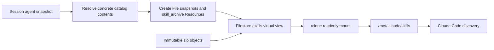

# Managed Agent Skills Runtime

## 背景与目标

Managed Agents API 的 agent snapshot 只保存 `{type, skill_id, version}` 引用。custom skill 和
built-in skill 的每个具体版本都已经是一个规范化的不可变 zip，并由 catalog version row
记录对象存储 bucket、key、大小、SHA-256 和顶层目录。

Claude Code 需要在本地 discovery 目录中看到解包后的目录树。运行时因此把 zip 内容作为
Filestore 的虚拟只读目录直接映射到 `/root/.claude/skills`，不再建立 E2B skill volume，
也不再由 Runner 或 Environment Manager 预热、复制或解压文件。

## 启动流程

Environment Runner 在创建 cloud managed-agent Sandbox 前完成：

1. 从 Session 的 agent snapshot 严格解析 `skills[]`。
2. `type=anthropic` 从 `builtin_skills` / `builtin_skill_versions` 解析版本；`type=custom`
   在当前 workspace 内从 `skills` / `skill_versions` 解析版本。
3. `latest` 在启动时解析为具体 active version row。后续 catalog 的 latest 变化不会改变
   已启动 Session 的视图。
4. 在一只 Yourbatis 事务中通过生成的 Session Resource/File Mapper 锁定 filesystem 和 namespace，确保 `/skills` 固定根存在，
   并原子替换该 Session 中 `resource_type=skill_archive` 的内部 Resource 集合。
   替换时旧的 Resource 与 File 快照统一写入 `deleted_at`；每个新 Resource 通过 `file_uuid`
   指向一条固化解析结果的 ZIP File。
5. 创建 Sandbox 后，Runner 直接启动 rclone-filestore 的五个固定 mount；multimount
   在内部对 destination 执行 `MkdirAll`，Runner 不执行独立 mount preparation。
6. `/skills` 使用只读 Filestore Token，直接挂载到 `/root/.claude/skills`。rclone ready
   后才启动 Environment Manager；Environment Manager 不再处理 skill。

每条 Skill Archive Resource 对应一份解析后的 skill zip File 快照：

- Resource 保存 organization、workspace、Session identity、唯一路径 `/skills/<directory>`
  和通用 `file_uuid`；
- File 保存独立 UUID/`file_` identity、ZIP filename、bucket、key、size 与 SHA-256；
- 具体 Skill Version UUID 只存在于 Resolver 的瞬时解析结果，不写入 Resource 或 File。

同一 Session 内路径唯一。Snapshot 中两个 Skill 声明相同目录时启动失败，不能让后一个
静默覆盖前一个；同一个具体版本也不能被重复投影。


```mermaid
flowchart LR
    A["Session agent snapshot"] --> B["Resolve concrete catalog contents"]
    B --> C["Create File snapshots and skill_archive Resources"]
    C --> D["Filestore /skills virtual view"]
    E["Immutable zip objects"] --> D
    D --> F["rclone readonly mount"]
    F --> G["/root/.claude/skills"]
    G --> H["Claude Code discovery"]
```

## 虚拟目录合同

Filestore 对外呈现的是 archive 成员，而不是 zip 文件本身：

```text
/skills/
  pdf/
    SKILL.md
    references/
      forms.md
  xlsx/
    SKILL.md
```

Sandbox 中同一棵树直接位于：

```text
/root/.claude/skills/
  pdf/SKILL.md
  xlsx/SKILL.md
```

`/skills` 是内部 directory Resource；每个 `/skills/<directory>` 是通过 `file_uuid` 引用
ZIP File 快照的 `skill_archive` Resource。成员根据 zip central directory 动态合成，不逐个
持久化，也不生成虚假 UUID 或 `fse_` external ID。Skill File 不复制物理对象，不进入 Files
Catalog，也不计入 `filestore_bytes`。

List、metadata 和 ranged read 都由 Filestore 服务实现。对 `/skills` 本身、其后代，以及
以 `/skills` 为 source 或 destination 的任意 mutation 均返回 `403 permission_denied`。
HTTP 只读 Token 和 rclone `readonly=true` 构成 Sandbox 的只读边界；`/skills` 与其他
只读 mount 统一使用目录权限 `0755` 和文件权限 `0644`。

非递归列举 `/skills` 时，Filestore 直接使用 Skill Archive Resource 的 `path` 返回一级 skill
目录，不下载 archive。递归列举或访问具体 skill 子树时，才按需加载并校验对应 archive。

## archive 校验与缓存

Filestore 在第一次访问某个具体 archive 时按需下载并建立内存索引：

- 压缩 archive 最大 8 MiB，并同时校验 DB size 和 SHA-256；
- 必须是有效 zip，且只有与投影目录一致的单一顶层目录；
- 顶层必须包含 `SKILL.md`；
- 拒绝绝对路径、反斜杠、NUL、空段、`.`、`..`、重复路径、文件/目录冲突和 symlink；
- 解压大小按 archive header 累加并限制为 500 MiB；
- 读取单个成员时流式解压；range offset 通过丢弃前缀实现，不把解压结果整体缓存。

进程内以 `bucket + key + sha256 + archive path` 为 key，使用最多 20 个 archive 的有界
LRU 缓存压缩 archive 和目录索引。单个压缩 archive 最大 8 MiB，因此缓存中的压缩数据
理论上最多为 160 MiB，另有目录索引开销。同一个 key 的并发 cache miss 通过 singleflight
合并，只有一个共享任务下载、校验并建立索引。共享任务使用独立的 30 秒服务端超时，不继承
首个请求的取消信号，避免 leader 断开导致其他等待者一起失败；每个调用者通过自己的 context
独立等待，取消只会结束该调用者，不会终止或 Forget 仍可服务其他请求的共享任务。所有调用者
都取消后，共享任务仍允许在超时内完成并填充缓存。失败结果不写缓存，后续请求可以重新加载。
Skill Archive Resource 仍是每次请求的授权事实来源；Resource 删除后，缓存中残留的字节无法再通过
Filestore 路径访问。

## 生命周期与对象保留

Session filesystem 删除后沿用现有有界 cleanup job。最后一批 Owned File 退休后，同一事务
软删除该 Session 的内部 directory、Skill Archive Resources 及其 File 快照。Skill File 借用
catalog 中的不可变对象，不会产生 Filestore 对象清理任务或容量扣减。

Runner 每次全量替换 `/skills` Resources 时，会在同一事务中软删除旧 Resource/File 集合并
插入新集合。活动读取只考虑 `deleted_at is null` 的记录；历史 Skill File 不拥有 catalog
archive，也不会触发对象回收。

删除 custom skill/version 或用 `seed-builtin-skills --prune` 软删除 built-in catalog row 时，
不立即删除 archive 对象，也不创建通用 `object_cleanup` job。原因是已经启动的 Session
可能仍通过 File 快照中的 bucket、key 与 SHA-256 读取该对象。读路径不再查询 catalog version，
也不把 catalog 列表可见性当成 Session 快照可见性。物理 GC 必须先确认没有任何活动 Resource 引用，
属于独立的 reference-aware catalog GC；当前实现选择保留对象，优先保证运行中 Session
的快照稳定性。

## 移除的旧链路

本方案删除以下运行时机制：

- `skill_prewarm` job、fanout、worker 和启动组合；
- E2B skill volume、manifest hash、`manifest.json` 和 `.ready`；
- Environment Work 中的 `managed_agent_skills_mount` metadata；
- Runner 启动时下载/校验 zip 并写 volume；
- `/mnt/skills`、`/workspace/skills` 解压目录，以及 Claude skill discovery 软链；
- Environment Manager 的 managed-agent skill 解压职责。

迁移 `00047_unify_session_resources_and_files.sql` 把活动的旧 Archive 节点转换为
`resource_type='skill_archive'` 的内部 Resource。迁移 `00048_snapshot_session_skills.sql`
随后从 catalog version 创建 ZIP File 快照、回填 Resource 的通用 `file_uuid`，并删除 Skill
Version UUID。Resource + File 成为 Session 内唯一的 Skill 快照事实；schema 不创建
PostgreSQL 外键。

## 验收重点

- resolver 只读取 DB metadata，不在 Session 启动路径下载 archive；
- `latest` 在启动时解析成具体内容，Skill File + Resource 快照替换是全量且原子的；
- `/skills` list、recursive list、metadata 和 ranged read 返回 archive 成员；
- checksum、路径穿越、缺少 `SKILL.md` 等损坏 archive fail closed；
- 所有 `/skills` mutation 被拒绝；
- rclone 第五个 mount 直达 `/root/.claude/skills`，destination 由 multimount 内部创建；
- Runner 不写 legacy mount metadata，E2B runtime 不创建 skill volume；
- catalog soft delete/prune 不破坏活动 Session Skill File，读取路径不 JOIN version 表；
- Session filesystem cleanup 会软删除 Skill Archive Resource 与 File 快照，但不删除 catalog object。
