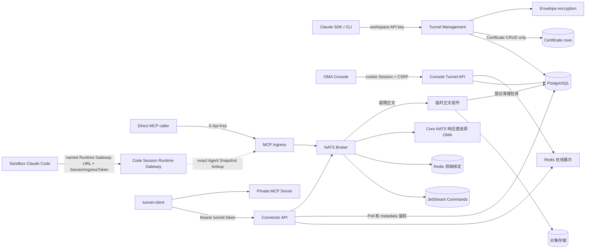
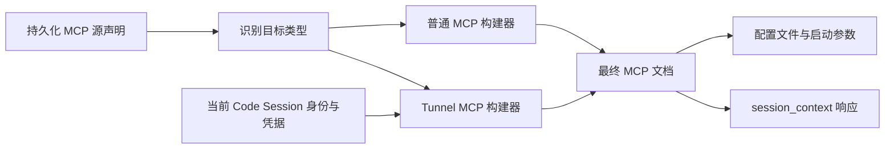
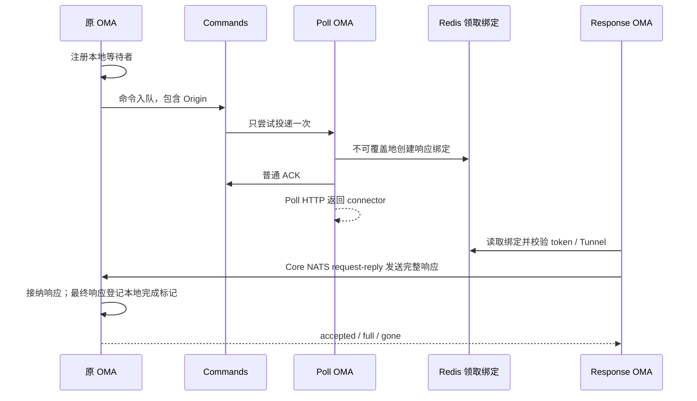
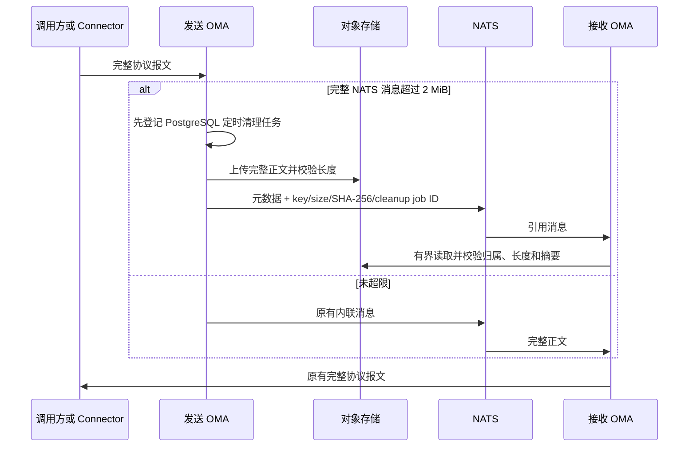
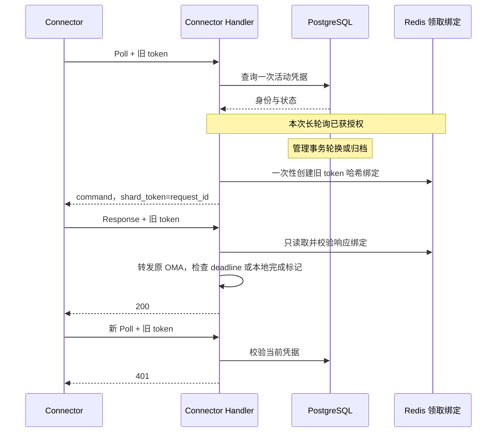

# MCP Tunnel 后端设计

跨管理面、Agent Runtime Gateway、NATS Broker 与原版 `tunnel-client` 的端到端导读见
[《MCP Tunnel 实现与端到端流程》](../mcp-tunnel-developer-guide.md)。

## 目标与协议合同

MCP Tunnel 允许运行在云端 sandbox 中的 Managed Agent 或直接 MCP 调用方访问只能由私有网络触达的
MCP Server。私网内运行 `tunnel-client`，仅向 OMA 发起出站 HTTPS 长轮询；OMA 不要求私网开放入站
端口。

管理面采用 Claude Tunnels API 的路由和数据合同：

- 路由使用 `/v1/tunnels`；
- 公开 beta 版本为 `mcp-tunnels-2026-06-22`；
- 请求、响应、分页和错误信封保持 Claude SDK 可识别；
- OMA 使用现有 workspace API key，不实现 Anthropic WIF issuer；
- Certificate 完整实现 Create/Get/List/Archive SDK 合同并持久化，但暂不参与 Connector、Broker、
  Ingress、Tunnel 健康状态或 MCP 数据面鉴权。

Tunnel 在所有边界统一使用 `tunnel_<32 位小写十六进制>`：管理 API、Connector、MCP Ingress、
Console、Managed Agent Snapshot 与数据库使用同一个 ID。Claude SDK/CLI 通过管理路由、beta header、
请求参数、JSON 结构和错误信封访问资源。
canonical URL 识别还要求 ID 严格匹配 `^tunnel_[0-9a-f]{32}$`，canonical 与 hostname-alias channel 都匹配
`[a-z0-9_-]{1,64}`。已指向受控 origin/suffix 的畸形 URL 返回 recognized error 并 fail-closed，不作为普通
remote MCP 继续处理。

Tunnel 的实际稳定入口是 `/v1/mcp/{tunnel_id}`。生产部署必须把 `tunnel.public_base_url` 配成 MCP
调用方可访问的 HTTPS origin；Console、OAuth discovery 和 Agent Snapshot 都以该 origin 生成稳定 URL，
Runtime Gateway 也只把 origin 与该配置完全一致的 canonical path 识别为本进程 Tunnel，防止任意同路径
URL 被误路由。开发环境未配置时 Console 可回退请求 origin，但这种回退不满足生产 Agent 调用条件。

Claude 响应中的 `domain` 使用创建时生成且永不复用的
hostname alias：后缀来自可选配置 `tunnel.domain_suffix`，默认是 RFC 保留且不可解析的
`tunnel.invalid`。需要 hostname 入口的生产部署可配置真实后缀，并在服务外配置匹配的 wildcard
DNS/TLS；未配置时 SDK 仍可读取 `domain`，但调用使用 canonical path。

Connector API 使用 OpenAI `tunnel-client` 的 metadata/poll/response HTTP 协议；客户端只连接 OMA HTTP 入口，无需访问 NATS。
Console YAML 原样输出管理 API 返回的 Tunnel ID；metadata、poll、response、MCP、OAuth、stdio、HTTP
和调度均使用同一个 ID。

## 组件与依赖

`internal/api` 只挂载路由和注入依赖。`internal/tunnels` 持有 Tunnel 管理面、Console 管理面、Connector API、MCP Ingress、
协议类型、错误合同与 Broker。`internal/db` 是唯一 SQL 边界。Code Session 在消费方 package
定义 `TunnelInvoker` 接口，生产组装传入 Tunnel DataPlane，避免 OMA 对自身 public URL 发起 HTTP 回环。

Tunnel 复用 `main` 创建的进程级 NATS 连接。Broker 自行关闭订阅，连接由组装层 drain。

HTTP 依赖在 `internal/api/tunnels.go` 集中组装：管理 Service 通过构造函数接收共享 Broker，
Connector 与 Ingress 使用同一 Broker，Ingress 注入 Code Session 的 `TunnelInvoker`。
目录探测与 Console workspace scope 的跨资源适配也放在该 API 组装边界。生产启动必须成功创建
DB 和 Broker；轻量路由测试可以省略依赖，缺少 DB 时不挂载 Tunnel 资源，有 DB 而缺少 Broker
时保留管理入口，但不挂载 Connector 和直接 MCP 数据入口。
NATS 必须启用 JetStream、提供三副本，所有节点 `max_payload` 至少为 2 MiB。

## 路由与鉴权

| 边界                  | 路由                                                                           | 凭据                                                          | 授权范围                                                      |
| --------------------- | ------------------------------------------------------------------------------ | ------------------------------------------------------------- | ------------------------------------------------------------- |
| 管理面                | `/v1/tunnels...`                                                               | `X-Api-Key` 或 Bearer workspace API key                       | Principal 的 organization + workspace                         |
| Console 管理面        | `/api/console/organizations/{orgUuid}/workspaces/{workspaceId}/mcp_tunnels...` | 平台 cookie Session；写请求携带现有 `X-CSRF-Token`            | 可见 organization + 归属该 organization 的 workspace          |
| MCP Ingress           | `/v1/mcp/{tunnel_id}[/{channel}]`                                              | 只读取 `X-Api-Key`                                            | Principal 的 organization + workspace                         |
| Connector metadata    | `GET /connector/v1/tunnels/{tunnel_id}`                                        | Bearer tunnel token                                           | token 所属 tunnel                                             |
| Connector 数据面      | `/connector/v1/tunnels/{tunnel_id}/poll`、`response`                           | Bearer tunnel token                                           | token 所属 tunnel                                             |
| Agent Runtime Gateway | `/v2/ccr-sessions/{code_session_id}/mcp/{server_name}`                         | SessionIngressToken（session-scoped JWT）                     | token 中的 Code Session + Agent Snapshot 中的精确 server name |
| OAuth discovery       | `/.well-known/oauth-protected-resource/v1/mcp/...` 或 Runtime Gateway 对应路径 | direct 使用 workspace API key；Agent 使用 SessionIngressToken | 与对应 MCP resource 相同                                      |

两个管理面都不增加 tunnel-specific RBAC。`/v1` 使用 active workspace API key；Console API 复用
`platformAuthMiddleware`、organization 可见性和 Console workspace scope 解析，不引入第二套鉴权授权。
组织不匹配、workspace 不属于当前组织、或 Tunnel 不属于请求 scope 时统一按不可见资源处理。
所有 PostgreSQL 查询和写入都必须同时绑定 `organization_uuid`、`workspace_uuid` 和 Tunnel 标识。
Token Mapper 的单条查询使用 `(记录, found, error)` 区分不存在与数据库故障，DB 公共方法将
`found=false` 映射为 `db.ErrNotFound`，真实查询错误向上传递；读取活动 Token 时也不能把父 Tunnel
的查询故障当作资源不存在。
`rotate_token` 接受 Claude SDK/CLI 的可选 `reason` 字段；在项目建立统一的管理面审计事件框架前，
服务端不持久化也不记录该字段，避免形成 Tunnel 独有且难以演进的审计模型。

Certificate 子路由通过父 Tunnel 解析 organization/workspace 与 `tunnel_uuid`，以保证租户隔离和
SDK 路径一致；这个引用只是资源归属，不是运行时绑定。创建、查询、列表或归档 Certificate 都不读写
NATS，不变更 Tunnel，也不限制 Connector 或 MCP 流量。Tunnel 归档同样不级联归档 Certificate；
Certificate 只有在显式调用它自身的 Archive API 时才变更状态。

MCP Ingress 不消费 `Authorization`；它仅用 `X-Api-Key` 完成 OMA 鉴权，并把允许的
`Authorization` 作为下游 MCP 凭据。Tunnel token 永远不被 MCP Ingress 接受。

Console 列表返回基础 Tunnel 字段、canonical `mcp_url` 和连接快照，不返回 token。plaintext token 只由
`reveal_token` 与 `rotate_token` 响应返回，并使用 `Cache-Control: no-store`。Console 错误使用现有扁平
`{error, message}` 风格，不要求 `anthropic-beta` header。

只有 `/api/console/organizations/{orgUuid}/workspaces/{workspaceId}/mcp_tunnels...` 的非安全方法校验
bootstrap 返回的 session-bound `X-CSRF-Token`。中间件挂载在 Tunnel Console 子路由，不扩大到既有
Console API；这是本功能的写请求保护边界。

Connector metadata 与 poll 使用同一 Bearer tunnel token 校验：错误 token、retired token、归档 token
或归档 Tunnel 均拒绝。metadata 返回 `{id, name, description}`；`name` 优先使用 `display_name`，为空时
回退 Tunnel ID，当前 `description` 固定为空字符串，不增加持久化字段。

## Managed Agent Runtime Gateway

Agent 版本和 Code Session metadata 保存原始 `mcp_servers`、工具声明及 canonical MCP URL，不持久化本次运行的 Gateway 地址或凭据。运行时按以下顺序构建配置：

1. `managedAgentSessionConfig` 准备源声明；Runner 创建或恢复 Code Session，取得当前 SessionIngressToken；
2. `codesessions.BuildMCPRuntimeConfig` 使用与 Tunnel Ingress 相同的 `tunnels.RecognizeTarget` 规则识别目标，再分别交给普通 MCP 与 Tunnel MCP 构建器；
3. 普通 MCP 按自身声明生成连接配置，保留 URL、Header、工具权限和扩展选项；普通 SSE 地址仍使用 SSE 传输；
4. Tunnel MCP 独立生成完整连接配置：固定 `type: "http"`，URL 为
   `{code_session.sandbox_api_base_url}/v2/ccr-sessions/{code_session_id}/mcp/{server_name}`，认证使用当前 SessionIngressToken。
   `main`、`sse`、`stdio` 都只是 Tunnel Channel 名称，不决定 Sandbox 到 Gateway 的传输协议；
5. Environment 层将最终文档封装为权限 `0600` 的 MCP config file 和启动参数，顶层源 `mcp_servers` 保持原样；
6. Runtime Gateway 验证 SessionIngressToken 和 worker epoch 后，按 name 从该 Session 固定的 Agent Snapshot
   解析原始 URL，再执行 exact URL 与 environment network policy 授权；请求不能通过 query 参数选择目标；
7. named Runtime Gateway 只接受 Tunnel，交由进程内 `TunnelInvoker` 进入 NATS Broker；解析到普通 MCP 时返回 404。

目标识别与配置构建位于 `internal/codesessions/mcp_runtime_config.go`，工具权限映射位于
`mcp_runtime_tools.go`；`internal/environments/managed_agent_mcp_config.go` 只负责配置文件和启动字段封装。
Code Session 的显式 `mcp_config` 文档也是受支持的输入边界：普通条目保留原始配置，Tunnel 条目的连接字段由
Tunnel 构建器生成，非连接选项继续保留。已知字段使用命名 schema，未知字段通过原始 JSON 保留，避免数字精度丢失。

`session_context` 在通过 Session ingress 鉴权后，使用当前请求凭据和同一构建器返回 MCP 文档，并设置
`Cache-Control: no-store`。启动、恢复和上下文读取都从源配置构建，不复用上一次运行的 Token。
配置解析或编码错误向上返回，由 Runner 统一处理启动失败：新建的 Code Session 执行终止清理，恢复中的已有 Session 保留。

Snapshot policy 的 server name 索引使用原始精确值并拒绝首尾空白；重复或非规范名称、畸形 MCP URL 都会
使策略编译 fail-closed。运行时构建同样拒绝无效声明，不把坏配置当作普通 MCP 留给 sandbox。

MCP Gateway 路径中的 Code Session ID 与凭据中的 Session ID 精确比较，不修剪路径 ID；带首尾空白
的 ID 不会被当作有效 Session。Token 由 HTTP Header 提取边界读取，命名 Gateway 复用 Session ingress 鉴权，并要求正数 worker epoch。

因此 sandbox 无需访问 `127.0.0.1`、宿主机 loopback 或 Tunnel 私网；`sandbox_api_base_url` 只需是
sandbox 能访问的 OMA Runtime Gateway origin。同一 SessionIngressToken 可用于 MCP Gateway 和
session worker/relay 接口，各入口分别执行业务授权；转发前会删除入口凭据。普通 remote MCP 保留原始 URL，经
Sandbox HTTP(S) Proxy/MITM 由 Vault 注入凭据，不进入 named Runtime Gateway。TunnelInvoker 当前不经过该
transport，Tunnel 私网 MCP 凭据应由 `tunnel-client` 的本地静态 Header、mTLS 或目标 MCP 自身支持的机制提供。

整个 Managed Agent 运行环境被视为同一个 Session 执行主体。MCP 配置中的 SessionIngressToken
也具有该 Session 的 ingress 身份权限，因此配置文件按运行凭据保护（0600），不得写回 Agent Snapshot
或记录到日志。命名 Gateway 和其 discovery 入口要求正数 worker epoch，并校验数据库中的活动 epoch；
无 epoch 的历史 ingress 凭据不被这两个入口接受。Session ID、租户、Snapshot server name 和目标网络策略
仍分别校验；持有有效 Session Token 不等于可以访问任意 MCP 目标。

Runtime Gateway 与 direct Tunnel ingress 都支持 RFC 9728 protected-resource discovery。Connector 使用专用
`oauth_discovery` command，OMA 不转发来访凭据，并把 metadata `resource` 与 MCP 401 challenge 的
`resource_metadata` 重写成调用方实际可达的 public/runtime URL。该规则同时适用于成功和 4xx discovery
响应；失败响应也不能泄漏 Private MCP 地址。

## 持久化模型

`mcp_tunnels` 保存稳定资源：内部 identity、UUID、唯一 external ID、organization/workspace UUID、
display name、全局唯一 domain 和 active/archive 时间。external ID 在应用层由 16 字节密码学随机数编码，
数据库以 `^tunnel_[0-9a-f]{32}$` 约束兜底；应用生成值只使用小写十六进制。

`mcp_tunnel_token_versions` 独立保存 token version：

- `external_id` 是 Claude token ID；
- `token_hash` 用于 Bearer token 验证；
- token plaintext 只在签发或 reveal 期间存在；
- ciphertext、nonce、wrapped DEK 和 key metadata 复用 `internal/secrets` envelope encryption；
- 每个 Tunnel 只能有一个未 retired、未 archived 的 active token；
- token 轮换时立即清除旧版本的 envelope 字段，只保留 hash、version 与状态作为凭据历史；
- retired token 不能发起新 Poll，但可凭 Redis 中领取时绑定的 token 哈希完成在途请求。

`mcp_tunnel_certificates` 作为独立管理资源保存 `tcrt_<32 位小写十六进制>`、organization UUID、
Tunnel UUID/展示 ID、原始 CA PEM、DER SHA-256 fingerprint、X.509 到期时间与 create/archive 时间。
Create 边界要求 PEM 不超过 8 KiB、只含一个 X.509 CA Certificate 且不含其他 PEM block。List 使用与
Tunnel 相同的不透明 offset cursor，默认排除 archived 记录。该表不建立 PostgreSQL 外键，也不被任何数据面读取。

Schema 由 `internal/db/migrations` 中的 Goose migration 管理，数据库应应用当前 checkout 包含的全部 migration。

项目不创建 PostgreSQL 外键，跨表引用统一使用 UUID。

## Broker 单次投递与响应绑定

请求直接入队，不读取在线状态，不设置每 Tunnel 的 pending 数量或字节额度。无人领取时等待；
Connector 在 deadline 前上线即可领取，始终无人领取则超时。调用方断开只释放本地等待者，
不取消已入队或已执行的命令，不承诺撤销远端副作用。

命令 Stream 为 `OMA_TUNNEL_COMMANDS_V1`，subject 为 `oma.tunnel.command.v1.<Tunnel UUID 摘要>.<channel>.shared`。
它使用 R3 FileStorage、WorkQueuePolicy、DiscardNew 和有限 MaxAge。同 Tunnel/channel 共享 durable consumer，
`MaxDeliver=1`；未 ACK、断连或 NAK 都不会使该 consumer 再次投递。consumer 无活动超过 request timeout 加一分钟才回收，
避免在命令仍有效时自动重建而重新读取。运维不得在有在途命令时删除重建 consumer。

入队时不访问 Redis。领取后在 Redis `oma:tunnel:request:v1:<requestId 摘要>` String key 中使用 `SET NX PX` 一次性创建不可覆盖的绑定，
字段为对外 Tunnel ID、领取 token SHA-256、channel、命令类型、deadline、Origin 和正文清理所需的组织/workspace UUID。每条绑定最多 4 KiB；
不保存重复 requestId、Tunnel UUID、明文 token、执行状态或响应正文。每次 Response 使用 GET 读取；不查询 PostgreSQL 当前凭据。
一次性创建是防止覆盖凭据的原子写入，不存在读取 revision、状态转换或冲突重试。
绑定失败、结果不确定或 ACK 本地发送失败时不交付该命令；其他已成功绑定的命令仍可返回。
普通 ACK 后才写 Poll HTTP，不等待 ACK 回执；ACK 只用于队列清理，不表示 connector 收到或工具执行成功。
OMA 崩溃或 Poll 连接丢失会损失这次执行机会；Tunnel 不补投，由调用方决定是否重试。发布结果不确定时不盲目重发。

Response 不查询 PostgreSQL 凭据；大正文暂存会写入现有对象清理任务：按绑定验证 URL Tunnel ID、token 哈希、channel 和响应类型，哈希用常量时间比较，
不返回、不写日志。`shard_token=request_id` 保留 wire 合同；`X-Tunnel-Shard-Token` 必须等于响应 requestId。
原等待实例通过 deadline 拒绝新结果；缺少绑定表示未领取或记录已过期。

通知和最终响应正文都通过 `oma.tunnel.response.v1.<进程随机摘要>` 定向 request-reply 发送到原 OMA。
原 OMA 接纳后才确认；不再保存终态、发送空唤醒信号或定时查询 Redis。Origin 不可达或回执超时返回 503，不后台重试。
每请求保留 16 条、2 MiB 的通知缓冲，全实例 64 MiB；慢 HTTP 写入仍占预算。
最终响应使用独立本地槽位，不被通知条数阻塞，但计入全局字节预算。满载在接受前返回 429。
最终响应前排空已接受通知，同一个请求仅接受一个最终响应。

最终响应被接纳时，原实例在同一互斥区登记仅含 key/到期时间的本地完成标记，到 `deadline + tombstone_ttl`
删除，不保存正文、不在重启后恢复。合法重复响应在标记有效期间返回 200、不再次交付、不延长 TTL；
deadline 后仅允许确认已有完成标记。等待者与标记均不存在返回 404；旧 Origin 因重启不可达返回 503。
缺少 Bearer 为 401，格式错误为 400，绑定不符/未领取/过期未完成为 404，基础设施故障为 503。

Commands Stream 显式设置 `MaxMsgs=-1`，Redis 绑定和本地等待者也没有请求数量准入，不引入替代计数器或额度释放补偿。
命令总字节预算固定为每节点 513 MiB（537919488 字节），R3 合计约 1.50 GiB；不再通过请求数推导，不新增容量配置。
预算不随 MCP 正文上限扩大。既有 Worker Stream 的 10 GiB 预算不变。请求超时、ACK 和本地等待者关闭负责释放资源；TTL 不能限制突发流量的峰值内存。
绑定创建后保留 `request_timeout + tombstone_ttl`（默认 7 分钟），读取、重复创建和重复响应均不续期，完成或取消也不主动删除。
所有 OMA 实例必须使用一致的 Redis 和配置。Redis 数据丢失会使部分在途请求失败，不新增恢复、补投或 NATS KV 回退。
绑定存储复用应用 Redis 客户端，与在线展示组件分开；每次操作最长 2 秒且受调用方 context 约束，不增加应用层重试。
缺少 key 返回 404；连接、超时和解码故障返回 503。写入失败或结果不确定不交付该命令，其他成功绑定的命令仍可返回。
在线展示写失败仍可忽略，领取绑定失败不可忽略。readiness 分别报告 `tunnel_nats` 和 `tunnel_redis`。
部署应避免提前淘汰有效绑定，建议使用 `noeviction`；本次不自动修改共享 Redis 的配置、持久化或高可用拓扑。
Redis 默认异步复制意味着故障切换可能丢失已确认绑定，不能等同于之前的 JetStream R3 存储保障。

### 超过 NATS 消息上限的正文

NATS 和 Commands Stream 的消息上限保持 2 MiB。编码后的完整消息（命令包含 NATS headers）不超过该上限时沿用内联路径，不读写对象存储，也不登记清理任务。超过上限时仅外置 `jsonrpc` / `resp_json`，引用消息再次校验大小；不采用历史事件的 32 KiB 外置阈值。

对象使用 `tunnel-payload/` 独立前缀，按组织、workspace、requestId 的组合摘要隔离，每次上传使用唯一 job ID。上传前登记现有对象清理任务，统一在原 deadline 后 5 分钟开始删除所有版本；不提前删除，发布结果不确定也保留到清理时间。实际删除受现有 worker 重试影响。无新表、migration、历史 blob 注册或请求状态机。

Poll 在现有绑定与 ACK 之后、构造客户端命令之前恢复正文，仍按原有整批编码和客户端 limit 返回；失败不重投，沿用现有错误与超时路径。对象读取受 Poll 取消和请求 deadline 约束。

Response 校验领取绑定后才暂存正文；原实例队列保存内联内容或对象引用，按原有顺序逐条恢复，不在 NATS 回调或全局锁内下载。通知与最终结果同样处理，不分片、不重放。Connector 的 200 仍表示原 OMA 已接纳交付，不表示调用方已读完；接纳后对象读取失败按原有等待错误处理，已开启 SSE 则关闭流。

背压数量和字节常量不变，字节统计仍按收到的 NATS envelope（内联消息或引用）计算；临时恢复的单条正文另受正文上限约束，本次未增加内存额度系统。合法的过期大响应重复提交只查询原实例已有完成回执，不再上传对象；不会把省略正文的查询当作新结果交付。

不修改 tunnel-client：它仍完整读取 Poll 批次、完整提交 Response，对象暂存只解决 OMA 内部 NATS 消息大小限制，不提供客户端分片或无限大小传输。

### 单次 Poll 授权与管理操作

PostgreSQL 是凭据权威来源。Poll 与 metadata 的凭据查询只投影身份及状态，不读取加密 token envelope。
Poll 在入口校验一次活动 token；通过后，本次长轮询期限内继续有效，不在交付前重新查询。
轮换、归档仅执行现有 PostgreSQL 事务，不依赖 NATS 或 Redis，不再暂停、激活或恢复 Broker 状态。
归档或轮换之后的新 Poll 被拒绝；之前通过鉴权的 Poll 仍可领取，领取的请求均可在原 deadline 内回传。

MCP Tunnel 尚未正式上线，本次直接调整实现，保留 Commands Stream 名称，停止创建 Request KV，不涉及 PostgreSQL schema 变更。

## 实时连接快照

独立 `ConnectorPresence` 复用应用 Redis 客户端，分别注入 Connector Handler 与 Console Handler；Broker 不依赖它。
每个 Tunnel UUID 使用一个 `oma:tunnel:presence:<uuid>` Hash，字段为 connector instance ID，值为完整声明的
channel 名称 JSON 列表。鉴权及格式校验成功的 Poll 用 Redis 8 [`HSETEX`](https://redis.io/docs/latest/commands/hsetex/) 原子更新字段及 TTL，即使 Poll
仅请求其中某个 channel 也保存全部声明。`PresenceTTL` 默认 60 秒，每个实例独立过期。

列表按已知 Tunnel UUID 批量 pipeline `HGETALL`，不扫描 Redis 全库。聚合实例总数、channel 名称及各自实例数；
不返回 instance ID 或 `process_affinity`。没有记录为 `disconnected`，有记录为 `connected`。
读写各自使用最多 500ms deadline，共享 Redis 客户端开启 context deadline 支持；不启动后台重试。
写失败仅记录安全告警，Poll 仍继续；读失败返回 `unknown`，不伪装成离线。

轮换不修改在线记录；旧实例不再成功 Poll 后自然过期。归档 Tunnel 在 Console 直接显示离线，不再读取其 Redis 记录。
连接快照仅表示近期活动，不用于鉴权、入队、领取或响应判断，也不能证明完整 MCP 调用成功。

## Channel、长轮询与超时

- channel 匹配 `[a-z0-9_-]{1,64}`，每个 Tunnel 最多 32 个；
- channel 在 Connector 声明、Broker claim/enqueue、Ingress 和 probe 每个可信边界校验，拒绝重复名称与路径逃逸；
- Connector 在 poll 中声明 channel allowlist；默认 channel 取 server-info，缺失时为 `main`；
- server-info v1/v2 继续解析 channel 名称；`proc_affinity`、`stateless` 只在 wire 解析边界接受，不存储、不比较、不据此调度；
- 每个 channel 使用共享 durable consumer，没有实例定向 subject、固定 owner、代理 Session ID 或本地模拟会话关闭；
- 同一 token 的多个 Connector 可以互换领取与回传；实例 ID 仅用于在线统计，保留格式检查，缺省为 `legacy`；
- 保留普通 MCP Header、initialize 和 DELETE 的透传，不升级 MCP 协议，不承诺支持依赖特定 Connector 进程的 Server；
- Poll 不再使用持续预取的 `Consume`。先按轮换顺序对每个 channel 做一次 `FetchNoWait`，申请数不超过客户端剩余 limit；完成这一轮后，有命令即返回，不等待凑满；
- 无命令且允许长轮询时，每轮选 `min(limit, channel 数量)` 个 channel，各拉取一条、最多等待 100ms，并受 Poll 剩余期限约束。本轮全部收束后一起返回有效命令；空轮轮换 channel 继续等待；
- 拉取前分配接收名额，不超过客户端 limit；不再根据累计大小截断或 NAK 退回。SDK 按拉取数量分配内存，每次 `FetchNoWait` 最多申请 256 条以限制单次 SDK 预分配；不存在全局请求条数上限，也没有单次 Poll 恢复正文的累计字节预算。Commands Stream 的 513 MiB 预算只约束 NATS 消息存储，不包含对象存储中的正文，不能作为 Poll 恢复正文的内存上限；
- connector 的 Poll HTTP 连接断开时，停止发起新拉取，排空本轮有限拉取并终止已收但无法交付的消息，不后台预取、不重投；SDK 网络等待有界，收尾不依赖 ACK 的服务端回执；
- OMA 不设置实例级活动 Poll 名额。consumer 的 `MaxAckPending=32`、`MaxWaiting=128` 继续作为每路由的 NATS 资源约束；
- limit 省略时为 25，显式值为正整数，不再设置服务端 25 条上限；timeout 默认及最大值为 30 秒。`timeout_ms=0` 只读当前可用命令。正常空轮询返回 204，没有可交付命令且发生基础设施故障返回 503；
- MCP 默认总 deadline 为 2 分钟，可配置范围为 1 秒到 10 分钟；
- OAuth protected-resource metadata 与其他 Tunnel command 共用上述 `tunnel.request_timeout` 统一 deadline；
- `response_timeout` 是统一 deadline 的剩余时间，不启动新的计时窗口；HTTP 编码前再次检查，跳过收束期间已经过期的命令；
- MCP 调用方断开或 deadline 到期时只释放原 OMA 本地等待者，不写 canceled 元数据；尚未交付的命令仍可在 deadline 前执行，响应无人等待时返回 404。

MCP Ingress 不提供独立的 GET SSE 连接，`GET /v1/mcp/{tunnel_id}[/{channel}]` 明确返回 405。
POST 请求可在同一个响应内以 SSE 传递 Connector 的非终态 notification，DELETE 用于终止 MCP session。
没有 `Mcp-Session-Id` 的 DELETE 在 Ingress 返回 400。

Connector wire 把上游 MCP 的 JSON 值规范化为 `resp_json`，因此 terminal response 即使来自
`text/event-stream` 上游也不会保留原始 SSE framing。Ingress 根据最终响应的 `Content-Type` 恢复传输语义：
JSON 响应直接写入 body，SSE 响应把每个 notification 和 terminal JSON 值重新编码为标准
`event: message` / `data: ...` frame，并设置 `Cache-Control: no-cache`。不得出现“声明为
`text/event-stream`、实际返回裸 JSON”的响应，否则 Claude Code 等 Streamable HTTP 客户端会一直等待
完整事件并在初始化阶段超时。

## Header 与资源边界

请求 denylist 包含 hop-by-hop、Cookie、`X-Api-Key`、proxy credential、Tunnel token 以及 OMA 内部
header；保留下游 `Authorization`、MCP header 和允许的自定义 header。响应只允许显式协议 header；
Connector transport 的 `Content-Length` 和 `Date` 不向调用方透传，因为 body 已经过 wire 规范化，原值会
失效。OAuth discovery 除通用安全响应头外只允许缓存、版本、重试和重定向相关 header，仍拒绝
`Set-Cookie`、hop-by-hop header 与任何凭据。

默认限制：

- 请求及单条 Response（包括 SSE notification）的 MCP JSON body：默认 16 MiB，包含 Base64 内容；Connector Response 外层读取预算为 `max_body_bytes + 6 * max_header_bytes + 16384`，正文和 Header 分别校验；
- header 总量：32 KiB，单值 8 KiB；
- tombstone_ttl：5 分钟；请求记录的实际保留期为 request_timeout 加 tombstone_ttl；
- presence：60 秒；仅为 Redis 在线展示字段 TTL。

Ingress 超限 body/header 返回 413，Connector response 格式或内容限制错误返回 400；全局队列/通知背压返回 429。
无人领取时等待统一 deadline，超时返回 504；NATS 不可用返回 503。

启动时仅要求正文上限为正数，并校验 Header 与元数据预算可装入 2 MiB；完整正文可以通过对象引用转发。发送前验证实际编码后的 NATS 消息大小，命令还包含 `Nats-Msg-Id` header 的字节开销。

运行日志禁止记录 API key、tunnel token、下游 Authorization、Cookie、shard token 和原始 body。

创建、轮换、归档和成功 probe 事件复用 `slog`、HTTP request ID 和现有 access log，记录 organization、workspace、
Tunnel 与 actor 的安全标识。rotate 的 `reason` 不持久化也不记录。`/readyz` 同时检查 PostgreSQL 与
Tunnel 的 NATS/JetStream stream（`tunnel_nats`）及领取绑定 Redis（`tunnel_redis`）；`/healthz` 仅表示进程存活。Tunnel 结构化日志用于运维追踪。

## Console MCP 探测

`POST /api/console/organizations/{orgUuid}/workspaces/{workspaceId}/mcp_tunnels/{tunnel_id}/probe`
使用现有 Console Session、workspace scope 和 CSRF。服务端直接通过 Broker 对指定 channel 执行
`initialize`、`notifications/initialized`、`tools/list`，有 session ID 时 best-effort DELETE，最长 30 秒。
响应只包含协议版本、MCP server name/version 与工具元数据，不包含 Tunnel token、Connector instance ID
或请求正文。该探测验证 Connector 与私有 MCP 数据面，不替代真实 Managed Agent Session 验收。

## 验收

实现至少覆盖：Claude SDK 管理面契约、Console Session、CSRF 与 organization/workspace 越权、Connector metadata、
token rotate 与在途 drain、NATS 并发派发与三副本故障、presence 快照与故障降级、重复/错误 shard response、取消与
过期、header 清理、Connector notification/terminal wire、OAuth discovery、无 Connector 入队等待、迟到上线领取与超时，以及
Web 创建、probe、reveal、轮换、归档、Agent 选择器与可见性轮询。最终还必须用真实 tunnel-client 和
Managed Agent Session 验证 sandbox → Runtime Gateway → TunnelInvoker → Broker → Connector → private MCP
的完整链路；仅 `/readyz`、Connector presence 或 Console probe 成功都不能单独证明 Agent 链路完成。
可复现的本地步骤见[《MCP Tunnel 手动验收》](../../zh/mcp-tunnel-manual-acceptance.md)。

自动化验收按以下层次组织：

| 范围           | 覆盖与边界                                                                                                                                                                     |
| -------------- | ------------------------------------------------------------------------------------------------------------------------------------------------------------------------------ |
| Broker 与通知  | 单次投递、不可覆盖绑定、客户端 limit、多 channel 有限拉取、本地取消、重复响应和通知背压                                                                                   |
| 三副本故障     | 独立 Broker 连接验证 Commands 三副本、原实例已接收结果不依赖存储恢复、失去 quorum 后拒绝入队                                                                                        |
| 原版 Connector | `TestOfficialTunnelClientIntegration` 使用 DB 鉴权 fixture 和 Go MCP SDK，执行 HTTP JSON、HTTP SSE、stdio 工具调用，以及 v2 声明兼容；HTTP fixture 为无状态 MCP                    |
| Claude 客户端  | `TestClaudeClientsTunnelIntegration` 分别运行 TypeScript/Python Claude Agent SDK 和 Claude Code CLI，每个客户端覆盖 HTTP JSON、HTTP SSE、stdio，以私有工具随机标记校验真实执行 |
| Managed Agent  | `TestManagedAgentNATSTunnelE2E` 使用真实 DB、E2B Sandbox、Runtime Gateway、三副本 NATS 和原版 Connector，验证 `sse` Channel 的 HTTP 连接；文件对象存储为内存 fixture           |

部署验收还应覆盖两个完整 OMA 实例的崩溃、响应 POST 结果不确定、网络分区和代表性容量负载。
使用 Harpoon 时，需独立验证完整的自包含工具与 OAuth 流程；路由仍按同 Tunnel/channel 共享领取。

### Session Gateway 凭据验收

`go test -tags=e2e ./tests -run '^TestManagedTunnelGatewayCredentials$' -count=1 -v` 使用独立临时
PostgreSQL 数据库覆盖命名 Gateway 及 discovery 的跨 Session、跨租户、缺失 epoch 和旧 epoch 拒绝，
以及当前凭据仍受 Snapshot server name 授权限制；同时验证 `session_context` 拒绝旧 epoch、返回当前凭据生成的混合 MCP 配置，并设置 `no-store`。该测试不调用模型或 sandbox。
`TestManagedAgentMCPLaunchUsesRuntimeConfigWithoutPersistingCredentials` 同时覆盖创建和恢复时
MCP 配置与启动认证共用当前 SessionIngressToken，源配置保持不变。
真实客户端和 Managed Agent 的验收仍使用开发指南中的完整链路，不能用凭据单测替代。

### Console 授权与工具发现边界

Console Tunnel 的共享 scope 入口以 URL 中的工作区作为操作目标，复用平台现有的组织管理员/工作区成员授权规则。
Header 或 Query 中的工作区不能代替 URL 目标的成员校验；该检查覆盖列表、详情、创建、归档、探测、查看和轮换 Token。

Probe 在同一个初始化会话及总超时内按 `nextCursor` 完整读取 `tools/list`，游标原样传递。
与普通 MCP 工具目录一致，最多 20 页、512 个工具；空页带游标仍继续读取，重复游标、超限或任一页失败则整体失败，
不把部分结果保存为成功目录。会话清理覆盖分页成功和失败路径。
