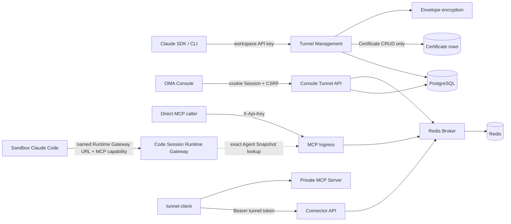
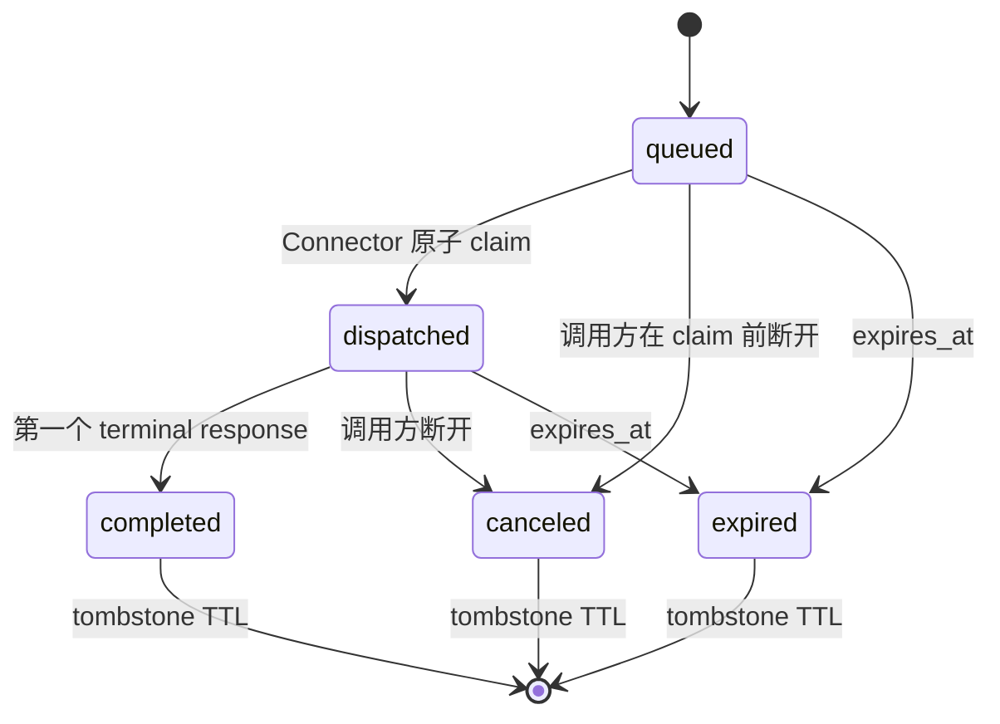

# MCP Tunnel 后端设计

跨管理面、Agent Runtime Gateway、Redis Broker 与原版 `tunnel-client` 的端到端导读见
[《MCP Tunnel 实现与端到端流程》](../mcp-tunnel-developer-guide.md)。

## 目标与兼容边界

MCP Tunnel 允许运行在云端 sandbox 中的 Managed Agent 或直接 MCP 调用方访问只能由私有网络触达的
MCP Server。私网内运行 `tunnel-client`，仅向 OMA 发起出站 HTTPS 长轮询；OMA 不要求私网开放入站
端口。

管理面兼容 Claude Tunnels API：

- 路由使用 `/v1/tunnels`；
- 公开 beta 版本为 `mcp-tunnels-2026-06-22`；
- 服务端额外接受 `mcp-tunnels-2026-05-19` 作为无文档兼容别名；
- 请求、响应、分页和错误信封保持 Claude SDK 可识别；
- OMA 使用现有 workspace API key，不实现 Anthropic WIF issuer；
- Certificate 完整实现 Create/Get/List/Archive SDK 合同并持久化，但暂不参与 Connector、Broker、
  Ingress、Tunnel 健康状态或 MCP 数据面鉴权。

Tunnel 在所有边界统一使用 `tunnel_<32 位小写十六进制>`：管理 API、Connector、MCP Ingress、
Console、Managed Agent Snapshot 与数据库不再做 ID 转换，也不保留 `tnl_...` 兼容层。Claude SDK/CLI
兼容范围是路由、beta header、请求参数、JSON 结构和错误信封，不依赖文档示例中的资源 ID 前缀。
canonical URL 识别还要求 ID 严格匹配 `^tunnel_[0-9a-f]{32}$`，canonical 与 hostname-alias channel 都匹配
`[a-z0-9_-]{1,64}`。已指向受控 origin/suffix 的畸形 URL 返回 recognized error 并 fail-closed，不作为普通
remote MCP 继续处理。

Tunnel 的实际稳定入口是 `/v1/mcp/{tunnel_id}`。生产部署必须把 `tunnel.public_base_url` 配成 MCP
调用方可访问的 HTTPS origin；Console、OAuth discovery 和 Agent Snapshot 都以该 origin 生成稳定 URL，
Runtime Gateway 也只把 origin 与该配置完全一致的 canonical path 识别为本进程 Tunnel，防止任意同路径
URL 被误路由。开发环境未配置时 Console 可回退请求 origin，但这种回退不满足生产 Agent 调用条件。

Claude 响应中的 `domain` 使用创建时生成且永不复用的
hostname alias：后缀来自可选配置 `tunnel.domain_suffix`，默认是 RFC 保留且不可解析的
`tunnel.invalid`。需要 hostname 入口的生产部署可配置真实后缀，并在服务外配置匹配的 wildcard
DNS/TLS；未配置时 SDK 仍可读取 `domain`，但调用使用 canonical path。

Connector wire 与配置直接兼容原版 OpenAI `tunnel-client` 的 poll/response 合同，不要求维护 OMA fork。
Console YAML 原样输出管理 API 返回的 Tunnel ID；metadata、poll、response、MCP、OAuth、stdio、HTTP
和调度均使用同一个 ID。

## 组件与依赖

`internal/api` 只挂载路由和注入依赖。`internal/tunnels` 持有 Claude 兼容管理面、Console 管理面、Connector API、MCP Ingress、
协议类型、错误合同与 Broker。`internal/db` 继续作为唯一 SQL 边界。Code Session 在消费方 package
定义 `TunnelInvoker` 接口，生产组装传入 Tunnel DataPlane，避免 OMA 对自身 public URL 发起 HTTP 回环。

进程只创建一个 Redis client，由 `main` 持有并关闭；Platform Session 与 Tunnel Broker 共享连接池，
但使用互不重叠的 key namespace。

## 路由与鉴权

| 边界                  | 路由                                                                           | 凭据                                                     | 授权范围                                                      |
| --------------------- | ------------------------------------------------------------------------------ | -------------------------------------------------------- | ------------------------------------------------------------- |
| 管理面                | `/v1/tunnels...`                                                               | `X-Api-Key` 或 Bearer workspace API key                  | Principal 的 organization + workspace                         |
| Console 管理面        | `/api/console/organizations/{orgUuid}/workspaces/{workspaceId}/mcp_tunnels...` | 平台 cookie Session；写请求携带现有 `X-CSRF-Token`       | 可见 organization + 归属该 organization 的 workspace          |
| MCP Ingress           | `/v1/mcp/{tunnel_id}[/{channel}]`                                              | 只读取 `X-Api-Key`                                       | Principal 的 organization + workspace                         |
| Connector metadata    | `GET /connector/v1/tunnels/{tunnel_id}`                                        | Bearer tunnel token                                      | token 所属 tunnel                                             |
| Connector 数据面      | `/connector/v1/tunnels/{tunnel_id}/poll`、`response`                           | Bearer tunnel token                                      | token 所属 tunnel                                             |
| Agent Runtime Gateway | `/v2/ccr-sessions/{code_session_id}/mcp/{server_name}`                         | 独立、session-scoped MCP capability JWT                  | token 中的 Code Session + Agent Snapshot 中的精确 server name |
| OAuth discovery       | `/.well-known/oauth-protected-resource/v1/mcp/...` 或 Runtime Gateway 对应路径 | direct 使用 workspace API key；Agent 使用 MCP capability | 与对应 MCP resource 相同                                      |

两个管理面都不增加 tunnel-specific RBAC。`/v1` 继续使用 active workspace API key；Console API 复用
`platformAuthMiddleware`、organization 可见性和 Console workspace scope 解析，不引入第二套鉴权授权。
组织不匹配、workspace 不属于当前组织、或 Tunnel 不属于请求 scope 时统一按不可见资源处理。
所有 PostgreSQL 查询和写入都必须同时绑定 `organization_uuid`、`workspace_uuid` 和 Tunnel 标识。
`rotate_token` 接受 Claude SDK/CLI 的可选 `reason` 字段；在项目建立统一的管理面审计事件框架前，
服务端不持久化也不记录该字段，避免形成 Tunnel 独有且难以演进的审计模型。

Certificate 子路由仍通过父 Tunnel 解析 organization/workspace 与 `tunnel_uuid`，以保证租户隔离和
SDK 路径一致；这个引用只是资源归属，不是运行时绑定。创建、查询、列表或归档 Certificate 都不读写
Redis，不变更 Tunnel，也不限制 Connector 或 MCP 流量。Tunnel 归档同样不级联归档 Certificate；
Certificate 只有在显式调用它自身的 Archive API 时才变更状态。

MCP Ingress 不消费 `Authorization`；它仅用 `X-Api-Key` 完成 OMA 鉴权，并把允许的
`Authorization` 作为下游 MCP 凭据。Tunnel token 永远不被 MCP Ingress 接受。

Console 列表返回基础 Tunnel 字段、canonical `mcp_url` 和连接快照，不返回 token。plaintext token 只由
`reveal_token` 与 `rotate_token` 响应返回，并使用 `Cache-Control: no-store`。Console 错误使用现有扁平
`{error, message}` 风格，不要求 `anthropic-beta` header。

只有 `/api/console/organizations/{orgUuid}/workspaces/{workspaceId}/mcp_tunnels...` 的非安全方法校验
bootstrap 返回的 session-bound `X-CSRF-Token`。中间件挂载在 Tunnel Console 子路由，不扩大到既有
Console API；这是本功能的写请求保护边界。

Connector metadata 与 poll 使用同一 Bearer tunnel token 校验：错误 token、retired token、归档 token
或归档 Tunnel 均拒绝。metadata 返回 `{id, name, description}`；`name` 优先使用 `display_name`，为空时
回退 Tunnel ID，当前 `description` 固定为空字符串，不增加持久化字段。

## Managed Agent Runtime Gateway

Agent 版本长期保存 canonical MCP URL，不能保存某个 sandbox 或某次 Session 的临时地址。Session 启动时按以下顺序投影：

1. 先创建或恢复 Code Session，签发与 session ingress JWT 不同 issuer、audience 和 token prefix 的 MCP capability；
2. 使用与 Tunnel Ingress 相同的规则识别 canonical Tunnel URL；普通 Directory/自定义 MCP 不参与投影；
3. 只为已识别的 Tunnel 按 Agent Snapshot 的 `mcp_servers[].name` 生成
   `{code_session.sandbox_api_base_url}/v2/ccr-sessions/{code_session_id}/mcp/{server_name}`；
4. 混合 MCP config file 中，Tunnel 使用 Gateway URL 和 capability，普通 MCP 保留原始 URL、Header 和工具配置；
   启动 payload 顶层 `mcp_servers` 继续按原合同完整保留；
5. Runtime Gateway 验证 MCP capability 和 worker epoch 后，按 name 从该 Session 固定的 Agent Snapshot
   解析原始 URL，再执行 exact URL 与 environment network policy 授权；请求不能通过 query 参数选择目标；
6. named Runtime Gateway 只接受 Tunnel，交由进程内 `TunnelInvoker` 进入 Redis Broker；解析到普通 MCP 时返回 404。

Snapshot policy 的 server name 索引使用原始精确值并拒绝首尾空白；重复或非规范名称、畸形 MCP URL 都会
使策略编译 fail-closed。Runner 对非空 MCP URL 的解析错误同样直接终止投影，不把坏配置当作普通 MCP
留给 sandbox。

因此 sandbox 无需访问 `127.0.0.1`、宿主机 loopback 或 Tunnel 私网；`sandbox_api_base_url` 只需是
sandbox 能访问的 OMA Runtime Gateway origin。session ingress token 不能调用 MCP Gateway，MCP capability
也不能调用 session worker/relay 接口；转发前会删除该 capability。普通 remote MCP 保留原始 URL，继续经
Sandbox HTTP(S) Proxy/MITM 由 Vault 注入凭据，不进入 named Runtime Gateway。TunnelInvoker 当前不经过该
transport，Tunnel 私网 MCP 凭据应由 `tunnel-client` 的本地静态 Header、mTLS 或目标 MCP 自身支持的机制提供。

Runtime Gateway 与 direct Tunnel ingress 都支持 RFC 9728 protected-resource discovery。Connector 使用专用
`oauth_discovery` command，OMA 不转发来访凭据，并把 metadata `resource` 与 MCP 401 challenge 的
`resource_metadata` 重写成调用方实际可达的 public/runtime URL。该规则同时适用于成功和 4xx discovery
响应；失败响应也不能泄漏 Private MCP 地址。

## 持久化模型

`mcp_tunnels` 保存稳定资源：内部 identity、UUID、唯一 external ID、organization/workspace UUID、
display name、全局唯一 domain 和 active/archive 时间。external ID 在应用层由 16 字节密码学随机数编码，
数据库以 `^tunnel_[0-9a-f]{32}$` 约束兜底；应用生成值只使用小写十六进制。

`mcp_tunnel_token_versions` 独立保存 token version：

- `external_id` 是 Claude token ID；
- `token_hash` 用于 Bearer token 验证；
- token plaintext 只在签发或 reveal 期间存在；
- ciphertext、nonce、wrapped DEK 和 key metadata 复用 `internal/secrets` envelope encryption；
- 每个 Tunnel 只能有一个未 retired、未 archived 的 active token；
- token 轮换时立即清除旧版本的 envelope 字段，只保留 hash、version 与状态供已领取请求完成响应；
- retired token 不能 poll，但可凭领取时绑定的 token version 和 shard 完成在途请求。

`mcp_tunnel_certificates` 作为独立管理资源保存 `tcrt_<32 位小写十六进制>`、organization UUID、
Tunnel UUID/展示 ID、原始 CA PEM、DER SHA-256 fingerprint、X.509 到期时间与 create/archive 时间。
Create 边界要求 PEM 不超过 8 KiB、只含一个 X.509 CA Certificate 且不含其他 PEM block。List 使用与
Tunnel 相同的不透明 offset cursor，默认排除 archived 记录。该表不建立 PostgreSQL 外键，也不被任何数据面读取。

Tunnel 旧实现从未投入使用，因此只通过一个 `00059_rebuild_mcp_tunnels.sql` 一次性重建。旧 Tunnel
schema 在版本 45 形成当前结构；同步后的共享主线已经包含 migration 46–58，因此 Tunnel 重建顺延为 59：
清空旧 Tunnel、明文 token 和 certificate 数据，删除旧 token version 表，重建 Tunnel 与加密 token
version 表，但保留 certificate 表结构。当前 Certificate CRUD 直接复用该结构，不需要新增 schema migration。
`Down` 回到共享版本 58，并恢复版本 59 之前的旧 Tunnel schema，
不会也无法恢复 `Up` 删除的数据。若本地数据库曾执行本分支早期开发版 53，或曾在同步本次主线前执行
旧编号的 Tunnel migration 57，其 Goose 版本记录会分别与上游正式 migration 53 或 sandbox lifecycle
migration 57 冲突。该状态只允许在停止 Server 和 Connector、确认 Tunnel 数据可清空并清理对应 Redis UUID
namespace 后做一次性手工校正，再补齐上游 53–58 与最终 59，不重建整个 PostgreSQL 数据库。干净数据库必须
直接按共享 migration 1–58、Tunnel migration 59 的顺序执行。

项目不创建 PostgreSQL 外键，跨表引用统一使用 UUID。

## Broker 状态机

请求仅在存在 live Connector 时入队。领取操作把 instance ID、shard token 和 token version 原子绑定
到请求。一旦请求进入 `dispatched`，Broker 不做自动重投；Connector 崩溃时请求等待统一 deadline
并过期。notification 不终结请求，第一个 terminal response 完成请求。重复 terminal response 在
tombstone 期内幂等返回成功；response 必须匹配领取时绑定的 instance、shard、token version、channel
和 command type；未知、过期、已取消或绑定不匹配返回 404。

Ingress 在请求入队前先建立 response Pub/Sub 订阅，避免极快 Connector 的首条 notification 落在
“已入队、尚未订阅”的窗口；terminal response 仍写入 request state，因此不依赖 Pub/Sub 可靠性。
订阅接收失败时，等待方先读取持久终态，再重建共享订阅，并在重订阅后再次读取终态；这样终态无论发生在
故障前还是重订阅窗口中都不会被误报为请求失败。只有确认没有持久终态且重订阅也失败时才返回 Broker 错误。
terminal 转换会立即移除原请求 body、header、deadline 与 payload 计量字段；调用方取得 completed response
后再原子清除 response，只保留 instance、shard、token version、channel、command type 和终态等幂等校验
所需的小型 tombstone。canceled/expired 同样立即压缩，避免已释放 pending budget 的大 payload 在 tombstone
TTL 内随吞吐无界累积。
Broker 另存 active token version：claim Lua 必须同时匹配该版本。暂停状态使用对应旧版本的负值哨兵，
因此已鉴权的旧长轮询不能把暂停解除；经过数据库 active-token 鉴权的更高版本可在首次 poll 时单调推进
Redis，从数据库已提交但 Redis 激活暂时失败的窗口自动恢复。rotate/archive 先暂停该版本、清除
Connector presence 并唤醒长轮询，数据库事务成功后只为新 token 激活版本；原版本仍可按已绑定的
instance、shard 和 token version 提交已 dispatched 请求。该在途 drain 只适用于 rotate；archive
提交后 Tunnel 与所有 token 都拒绝 Connector 请求。rotate 在暂停前先用数据库 active version
对齐可能由上一次失败遗留的 Redis 状态，数据库事务使用 expected version 拒绝并发覆盖，Redis 激活只
允许版本单调前进，因此乱序完成的并发请求不能把 Broker 降回旧版本。暂停后的操作失败时不盲目恢复
请求开始时的旧版本，而是重新读取数据库 active token 并激活；数据库无法确认 active token 时保持暂停。

Redis 使用 Sorted Set 保存 channel queue、request state 保存持久终态、Lua 完成原子转换、Pub/Sub
负责唤醒 poll 和转发非终态 notification。Broker 使用单一 pattern subscription 接收所有 Tunnel response，
再按精确 response channel 分发到有界请求缓冲；在途请求数不会线性增加 Redis TCP 连接或接收 goroutine，
缓冲过载时保留最新消息以确保 terminal 不会被 notification backlog 阻塞。进程亲和 owner 同时写入 Hash 与过期 Sorted Set，Broker
在请求清理和 claim 时批量移除过期 owner，避免未显式 DELETE 的历史 MCP session 造成无界增长。请求与
owner 清理会循环执行有界的 512 条批次，直到当次到期集合排空，避免单批上限留下 pending budget。

当前部署合同只支持单实例 Redis，不支持 Redis Cluster。key 中的 `{tunnel_uuid}` hash tag 用于明确同一
Tunnel 的原子状态边界和为未来演进保留布局，不代表当前动态 key Lua 已满足 Cluster 的 key 声明要求。

## 实时连接快照

Console 列表从 Redis presence 构造只读快照。读取时先删除每个 channel 已过期的 presence，再按
instance ID 去重：至少一个 live instance 时为 `connected`，没有 live instance 时为 `disconnected`。
快照返回 channel 名称、`process_affinity`、每个 channel 的 instance 数量和 Tunnel 级去重 instance
总数，不返回 instance ID。

Redis 不可用时，Console API 仍返回 Tunnel 资源，仅将连接状态降级为 `unknown` 并记录安全的结构化
告警；连接状态读取不得阻塞创建、reveal、rotate 或 archive。

## Channel、长轮询与超时

- channel 匹配 `[a-z0-9_-]{1,64}`，每个 Tunnel 最多 32 个；
- channel 在 Connector 声明、Broker register/claim/enqueue、Ingress 和 probe 每个可信边界校验，拒绝重复名称与路径逃逸；
- Connector 在 poll 中声明 channel allowlist；默认 channel 取 server-info，缺失时为 `main`；
- `proc_affinity` 使用短期 owner lease，只影响后续领取，不允许重放已 dispatched 请求；声明亲和 channel
  的 poll 必须携带非空且无首尾空白的 Connector instance ID，无亲和 channel 的旧客户端仍使用 legacy 身份兼容；
- `max_pending_requests` 配置范围为 `1..512`；claim 每个 channel 只加载至多该预算数量的队列头，并在
  Lua 内用游标继续扫描，既避免每成功领取一条就反复全量 `ZRANGE`，也不会因队头属于其他 affinity owner
  而让预算范围内的后续可运行请求永久饥饿；
- poll limit 默认及最大值为 25，timeout 默认及最大值为 30 秒，空结果返回 204；
- MCP 默认总 deadline 为 2 分钟，可配置范围为 1 秒到 10 分钟；
- OAuth protected-resource metadata 与其他 Tunnel command 共用上述 `tunnel.request_timeout` 统一 deadline；
- `response_timeout` 是统一 deadline 的剩余时间，不启动新的计时窗口；
- 调用方断开或统一 deadline 到期时立即取消 Broker 请求；dispatch 前移出队列，dispatch 后拒绝迟到响应，
  两者都只保留压缩后的 canceled tombstone。

MCP Ingress 不提供独立的 GET SSE 连接，`GET /v1/mcp/{tunnel_id}[/{channel}]` 明确返回 405。
POST 请求仍可在同一个响应内以 SSE 传递 Connector 的非终态 notification，DELETE 继续用于终止 MCP session；
这不会扩展 OpenAI Connector 的 poll/response wire。

Connector wire 把上游 MCP 的 JSON 值规范化为 `resp_json`，因此 terminal response 即使来自
`text/event-stream` 上游也不会保留原始 SSE framing。Ingress 根据最终响应的 `Content-Type` 恢复传输语义：
JSON 响应直接写入 body，SSE 响应把每个 notification 和 terminal JSON 值重新编码为标准
`event: message` / `data: ...` frame，并设置 `Cache-Control: no-cache`。不得出现“声明为
`text/event-stream`、实际返回裸 JSON”的响应，否则 Claude Code 等 Streamable HTTP 客户端会一直等待
完整事件并在初始化阶段超时。

## Header 与资源边界

请求 denylist 包含 hop-by-hop、Cookie、`X-Api-Key`、proxy credential、Tunnel token 以及 OMA 内部
header；保留下游 `Authorization`、MCP header 和允许的自定义 header。响应只允许显式协议 header；
Connector transport 的 `Content-Length` 和 `Date` 不向调用方透传，因为 body 已经过 wire 规范化，原值会
失效。OAuth discovery 除通用安全响应头外只允许缓存、版本、重试和重定向相关 header，仍拒绝
`Set-Cookie`、hop-by-hop header 与任何凭据。

默认限制：

- request 或 terminal response body：1 MiB；
- header 总量：32 KiB，单值 8 KiB；
- 每 Tunnel pending request：256；
- 每 Tunnel pending payload：32 MiB；
- completed tombstone：5 分钟；
- presence/affinity lease：60 秒。

超限 body/header 返回 413，队列预算超限返回 429，无 Connector 或 Redis 不可用返回 503，统一
deadline 到期返回 504。Redis 故障时不回退到进程内队列。

运行日志禁止记录 API key、tunnel token、下游 Authorization、Cookie、shard token 和原始 body。

创建、轮换、归档和成功 probe 事件复用 `slog`、HTTP request ID 和现有 access log，记录 organization、workspace、
Tunnel 与 actor 的安全标识。rotate 的 `reason` 不持久化也不记录。`/readyz` 同时检查 PostgreSQL 与
Tunnel 使用的共享 Redis；`/healthz` 仅表示进程存活。本阶段没有通用应用 metrics exporter，也不新增
Tunnel 私有 metrics、审计表或事件模型；这些结构化日志用于运维追踪，不宣称为合规审计。

## Console MCP 探测

`POST /api/console/organizations/{orgUuid}/workspaces/{workspaceId}/mcp_tunnels/{tunnel_id}/probe`
使用现有 Console Session、workspace scope 和 CSRF。服务端直接通过 Broker 对指定 channel 执行
`initialize`、`notifications/initialized`、`tools/list`，有 session ID 时 best-effort DELETE，最长 30 秒。
响应只包含协议版本、MCP server name/version 与工具元数据，不包含 Tunnel token、Connector instance ID
或请求正文。该探测验证 Connector 与私有 MCP 数据面，不替代真实 Managed Agent Session 验收。

## 验收

实现至少覆盖：Claude SDK 管理面契约、Console Session、CSRF 与 organization/workspace 越权、Connector metadata、
token rotate 与在途 drain、Redis 并发 claim、presence 快照与故障降级、重复/错误 shard response、取消与
过期、header 清理、Connector notification/terminal wire、OAuth discovery、无 Connector 快速失败，以及
Web 创建、probe、reveal、轮换、归档、Agent 选择器与可见性轮询。最终还必须用真实 tunnel-client 和
Managed Agent Session 验证 sandbox → Runtime Gateway → TunnelInvoker → Broker → Connector → private MCP
的完整链路；仅 `/readyz`、Connector presence 或 Console probe 成功都不能单独证明 Agent 链路完成。
可复现的本地步骤见[《MCP Tunnel 手动验收》](../../zh/mcp-tunnel-manual-acceptance.md)。
