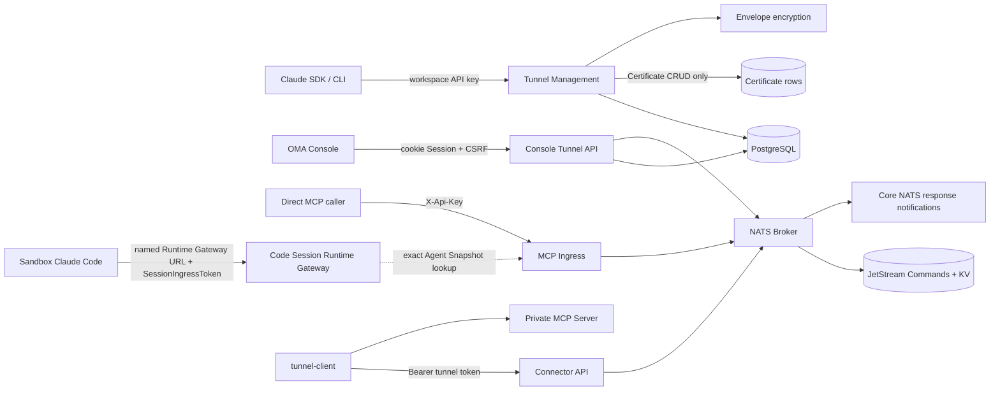
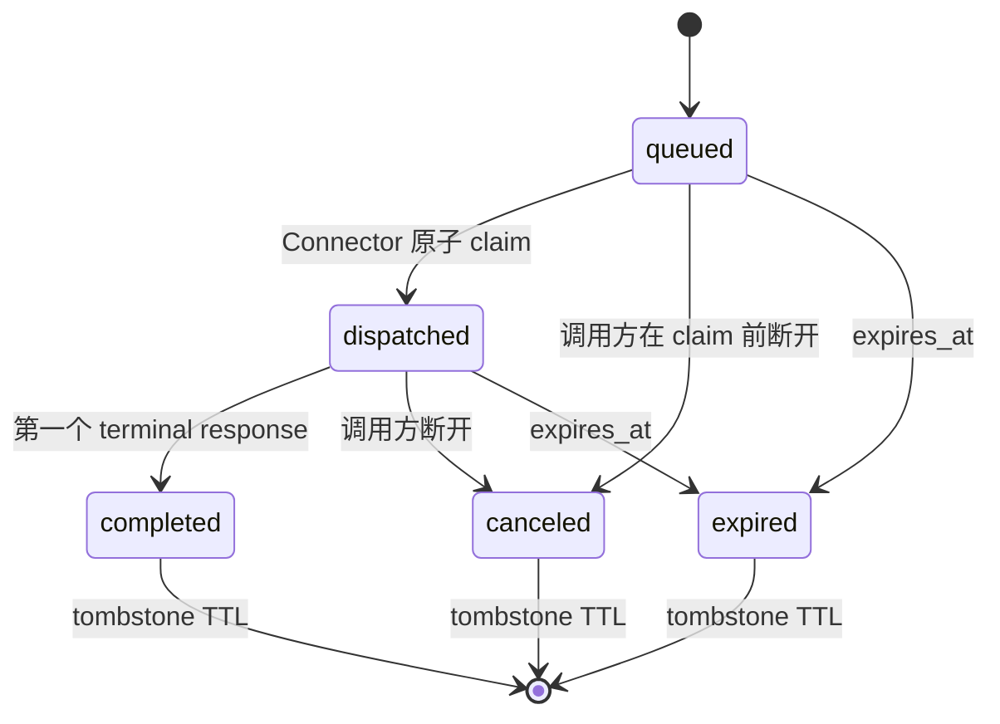

# MCP Tunnel 后端设计

跨管理面、Agent Runtime Gateway、NATS Broker 与原版 `tunnel-client` 的端到端导读见
[《MCP Tunnel 实现与端到端流程》](../mcp-tunnel-developer-guide.md)。

## 目标与协议合同

MCP Tunnel 允许运行在云端 sandbox 中的 Managed Agent 或直接 MCP 调用方访问只能由私有网络触达的
MCP Server。私网内运行 `tunnel-client`，仅向 OMA 发起出站 HTTPS 长轮询；OMA 不要求私网开放入站
端口。

管理面采用 Claude Tunnels API 的路由和数据合同：

- 路由使用 `/v1/tunnels`；
- 公开 beta 版本为 `mcp-tunnels-2026-06-22`；
- 请求、响应、分页和错误信封保持 Claude SDK 可识别；
- OMA 使用现有 workspace API key，不实现 Anthropic WIF issuer；
- Certificate 完整实现 Create/Get/List/Archive SDK 合同并持久化，但暂不参与 Connector、Broker、
  Ingress、Tunnel 健康状态或 MCP 数据面鉴权。

Tunnel 在所有边界统一使用 `tunnel_<32 位小写十六进制>`：管理 API、Connector、MCP Ingress、
Console、Managed Agent Snapshot 与数据库使用同一个 ID。Claude SDK/CLI 通过管理路由、beta header、
请求参数、JSON 结构和错误信封访问资源。
canonical URL 识别还要求 ID 严格匹配 `^tunnel_[0-9a-f]{32}$`，canonical 与 hostname-alias channel 都匹配
`[a-z0-9_-]{1,64}`。已指向受控 origin/suffix 的畸形 URL 返回 recognized error 并 fail-closed，不作为普通
remote MCP 继续处理。

Tunnel 的实际稳定入口是 `/v1/mcp/{tunnel_id}`。生产部署必须把 `tunnel.public_base_url` 配成 MCP
调用方可访问的 HTTPS origin；Console、OAuth discovery 和 Agent Snapshot 都以该 origin 生成稳定 URL，
Runtime Gateway 也只把 origin 与该配置完全一致的 canonical path 识别为本进程 Tunnel，防止任意同路径
URL 被误路由。开发环境未配置时 Console 可回退请求 origin，但这种回退不满足生产 Agent 调用条件。

Claude 响应中的 `domain` 使用创建时生成且永不复用的
hostname alias：后缀来自可选配置 `tunnel.domain_suffix`，默认是 RFC 保留且不可解析的
`tunnel.invalid`。需要 hostname 入口的生产部署可配置真实后缀，并在服务外配置匹配的 wildcard
DNS/TLS；未配置时 SDK 仍可读取 `domain`，但调用使用 canonical path。

Connector API 使用 OpenAI `tunnel-client` 的 metadata/poll/response HTTP 协议；客户端只连接 OMA HTTP 入口，无需访问 NATS。
Console YAML 原样输出管理 API 返回的 Tunnel ID；metadata、poll、response、MCP、OAuth、stdio、HTTP
和调度均使用同一个 ID。

## 组件与依赖

`internal/api` 只挂载路由和注入依赖。`internal/tunnels` 持有 Tunnel 管理面、Console 管理面、Connector API、MCP Ingress、
协议类型、错误合同与 Broker。`internal/db` 是唯一 SQL 边界。Code Session 在消费方 package
定义 `TunnelInvoker` 接口，生产组装传入 Tunnel DataPlane，避免 OMA 对自身 public URL 发起 HTTP 回环。

Tunnel 复用 `main` 创建的进程级 NATS 连接。Broker 自行关闭订阅，连接由组装层 drain。

HTTP 依赖在 `internal/api/tunnels.go` 集中组装：管理 Service 通过构造函数接收共享 Broker，
Connector 与 Ingress 使用同一 Broker，Ingress 注入 Code Session 的 `TunnelInvoker`。
目录探测与 Console workspace scope 的跨资源适配也放在该 API 组装边界。生产启动必须成功创建
DB 和 Broker；轻量路由测试可以省略依赖，缺少 DB 时不挂载 Tunnel 资源，有 DB 而缺少 Broker
时保留管理入口，但不挂载 Connector 和直接 MCP 数据入口。
NATS 必须启用 JetStream、提供三副本，所有节点 `max_payload` 至少为 2 MiB。

## 路由与鉴权

| 边界                  | 路由                                                                           | 凭据                                                     | 授权范围                                                      |
| --------------------- | ------------------------------------------------------------------------------ | -------------------------------------------------------- | ------------------------------------------------------------- |
| 管理面                | `/v1/tunnels...`                                                               | `X-Api-Key` 或 Bearer workspace API key                  | Principal 的 organization + workspace                         |
| Console 管理面        | `/api/console/organizations/{orgUuid}/workspaces/{workspaceId}/mcp_tunnels...` | 平台 cookie Session；写请求携带现有 `X-CSRF-Token`       | 可见 organization + 归属该 organization 的 workspace          |
| MCP Ingress           | `/v1/mcp/{tunnel_id}[/{channel}]`                                              | 只读取 `X-Api-Key`                                       | Principal 的 organization + workspace                         |
| Connector metadata    | `GET /connector/v1/tunnels/{tunnel_id}`                                        | Bearer tunnel token                                      | token 所属 tunnel                                             |
| Connector 数据面      | `/connector/v1/tunnels/{tunnel_id}/poll`、`response`                           | Bearer tunnel token                                      | token 所属 tunnel                                             |
| Agent Runtime Gateway | `/v2/ccr-sessions/{code_session_id}/mcp/{server_name}`                         | SessionIngressToken（session-scoped JWT）                  | token 中的 Code Session + Agent Snapshot 中的精确 server name |
| OAuth discovery       | `/.well-known/oauth-protected-resource/v1/mcp/...` 或 Runtime Gateway 对应路径 | direct 使用 workspace API key；Agent 使用 SessionIngressToken | 与对应 MCP resource 相同                                      |

两个管理面都不增加 tunnel-specific RBAC。`/v1` 使用 active workspace API key；Console API 复用
`platformAuthMiddleware`、organization 可见性和 Console workspace scope 解析，不引入第二套鉴权授权。
组织不匹配、workspace 不属于当前组织、或 Tunnel 不属于请求 scope 时统一按不可见资源处理。
所有 PostgreSQL 查询和写入都必须同时绑定 `organization_uuid`、`workspace_uuid` 和 Tunnel 标识。
Token Mapper 的单条查询使用 `(记录, found, error)` 区分不存在与数据库故障，DB 公共方法将
`found=false` 映射为 `db.ErrNotFound`，真实查询错误向上传递；读取活动 Token 时也不能把父 Tunnel
的查询故障当作资源不存在。
`rotate_token` 接受 Claude SDK/CLI 的可选 `reason` 字段；在项目建立统一的管理面审计事件框架前，
服务端不持久化也不记录该字段，避免形成 Tunnel 独有且难以演进的审计模型。

Certificate 子路由通过父 Tunnel 解析 organization/workspace 与 `tunnel_uuid`，以保证租户隔离和
SDK 路径一致；这个引用只是资源归属，不是运行时绑定。创建、查询、列表或归档 Certificate 都不读写
NATS，不变更 Tunnel，也不限制 Connector 或 MCP 流量。Tunnel 归档同样不级联归档 Certificate；
Certificate 只有在显式调用它自身的 Archive API 时才变更状态。

MCP Ingress 不消费 `Authorization`；它仅用 `X-Api-Key` 完成 OMA 鉴权，并把允许的
`Authorization` 作为下游 MCP 凭据。Tunnel token 永远不被 MCP Ingress 接受。

Console 列表返回基础 Tunnel 字段、canonical `mcp_url` 和连接快照，不返回 token。plaintext token 只由
`reveal_token` 与 `rotate_token` 响应返回，并使用 `Cache-Control: no-store`。Console 错误使用现有扁平
`{error, message}` 风格，不要求 `anthropic-beta` header。

只有 `/api/console/organizations/{orgUuid}/workspaces/{workspaceId}/mcp_tunnels...` 的非安全方法校验
bootstrap 返回的 session-bound `X-CSRF-Token`。中间件挂载在 Tunnel Console 子路由，不扩大到既有
Console API；这是本功能的写请求保护边界。

Connector metadata 与 poll 使用同一 Bearer tunnel token 校验：错误 token、retired token、归档 token
或归档 Tunnel 均拒绝。metadata 返回 `{id, name, description}`；`name` 优先使用 `display_name`，为空时
回退 Tunnel ID，当前 `description` 固定为空字符串，不增加持久化字段。

## Managed Agent Runtime Gateway

Agent 版本长期保存 canonical MCP URL，不能保存某个 sandbox 或某次 Session 的临时地址。Session 启动时按以下顺序投影：

1. 先创建或恢复 Code Session，签发本次运行共用的 SessionIngressToken，供 worker/relay 和 MCP Gateway 使用；
2. 使用与 Tunnel Ingress 相同的规则识别 canonical Tunnel URL；普通 Directory/自定义 MCP 不参与投影；
3. 只为已识别的 Tunnel 按 Agent Snapshot 的 `mcp_servers[].name` 生成
   `{code_session.sandbox_api_base_url}/v2/ccr-sessions/{code_session_id}/mcp/{server_name}`；
4. 混合 MCP config file 中，Tunnel 使用 Gateway URL 和 SessionIngressToken，普通 MCP 保留原始 URL、Header 和工具配置；
   启动 payload 顶层 `mcp_servers` 完整保留；
5. Runtime Gateway 验证 SessionIngressToken 和 worker epoch 后，按 name 从该 Session 固定的 Agent Snapshot
   解析原始 URL，再执行 exact URL 与 environment network policy 授权；请求不能通过 query 参数选择目标；
6. named Runtime Gateway 只接受 Tunnel，交由进程内 `TunnelInvoker` 进入 NATS Broker；解析到普通 MCP 时返回 404。

MCP 配置组装位于 `internal/environments/managed_agent_mcp_config.go`，与运行时资源转换和
rclone 配置准备一样，作为 `environments` 包内的聚焦模块。`managedAgentSessionConfig` 调用它
生成基础 MCP 配置；Runner 创建或恢复 Code Session 后，传入当前身份与 SessionIngressToken，生成
本次启动使用的配置副本。`environment_manager.go` 负责将配置封装为启动 payload 和命令。

生成的 MCP Server、工具权限和配置文件使用命名 schema；运行时投影只覆盖 Tunnel 的 URL、
认证 Header 及 MCP 启动字段，其他 JSON 字段以原始 JSON 保留。配置编码错误向上返回，
由 Runner 统一处理启动失败：新建的 Code Session 执行终止清理，恢复中的已有 Session 保留。

Snapshot policy 的 server name 索引使用原始精确值并拒绝首尾空白；重复或非规范名称、畸形 MCP URL 都会
使策略编译 fail-closed。Runner 对非空 MCP URL 的解析错误同样直接终止投影，不把坏配置当作普通 MCP
留给 sandbox。

MCP Gateway 路径中的 Code Session ID 与凭据中的 Session ID 精确比较，不修剪路径 ID；带首尾空白
的 ID 不会被当作有效 Session。Token 由 HTTP Header 提取边界读取，命名 Gateway 复用 Session ingress 鉴权，并要求正数 worker epoch。

因此 sandbox 无需访问 `127.0.0.1`、宿主机 loopback 或 Tunnel 私网；`sandbox_api_base_url` 只需是
sandbox 能访问的 OMA Runtime Gateway origin。同一 SessionIngressToken 可用于 MCP Gateway 和
session worker/relay 接口，各入口分别执行业务授权；转发前会删除入口凭据。普通 remote MCP 保留原始 URL，经
Sandbox HTTP(S) Proxy/MITM 由 Vault 注入凭据，不进入 named Runtime Gateway。TunnelInvoker 当前不经过该
transport，Tunnel 私网 MCP 凭据应由 `tunnel-client` 的本地静态 Header、mTLS 或目标 MCP 自身支持的机制提供。

整个 Managed Agent 运行环境被视为同一个 Session 执行主体。MCP 配置中的 SessionIngressToken
也具有该 Session 的 ingress 身份权限，因此配置文件按运行凭据保护（0600），不得写回 Agent Snapshot
或记录到日志。命名 Gateway 和其 discovery 入口要求正数 worker epoch，并校验数据库中的活动 epoch；
无 epoch 的历史 ingress 凭据不被这两个入口接受。Session ID、租户、Snapshot server name 和目标网络策略
仍分别校验；持有有效 Session Token 不等于可以访问任意 MCP 目标。

Runtime Gateway 与 direct Tunnel ingress 都支持 RFC 9728 protected-resource discovery。Connector 使用专用
`oauth_discovery` command，OMA 不转发来访凭据，并把 metadata `resource` 与 MCP 401 challenge 的
`resource_metadata` 重写成调用方实际可达的 public/runtime URL。该规则同时适用于成功和 4xx discovery
响应；失败响应也不能泄漏 Private MCP 地址。

## 持久化模型

`mcp_tunnels` 保存稳定资源：内部 identity、UUID、唯一 external ID、organization/workspace UUID、
display name、全局唯一 domain 和 active/archive 时间。external ID 在应用层由 16 字节密码学随机数编码，
数据库以 `^tunnel_[0-9a-f]{32}$` 约束兜底；应用生成值只使用小写十六进制。

`mcp_tunnel_token_versions` 独立保存 token version：

- `external_id` 是 Claude token ID；
- `token_hash` 用于 Bearer token 验证；
- token plaintext 只在签发或 reveal 期间存在；
- ciphertext、nonce、wrapped DEK 和 key metadata 复用 `internal/secrets` envelope encryption；
- 每个 Tunnel 只能有一个未 retired、未 archived 的 active token；
- token 轮换时立即清除旧版本的 envelope 字段，只保留 hash、version 与状态供已领取请求完成响应；
- retired token 不能 poll，但可凭领取时绑定的 token version 和 shard 完成在途请求。

`mcp_tunnel_certificates` 作为独立管理资源保存 `tcrt_<32 位小写十六进制>`、organization UUID、
Tunnel UUID/展示 ID、原始 CA PEM、DER SHA-256 fingerprint、X.509 到期时间与 create/archive 时间。
Create 边界要求 PEM 不超过 8 KiB、只含一个 X.509 CA Certificate 且不含其他 PEM block。List 使用与
Tunnel 相同的不透明 offset cursor，默认排除 archived 记录。该表不建立 PostgreSQL 外键，也不被任何数据面读取。

Schema 由 `internal/db/migrations` 中的 Goose migration 管理，数据库应应用当前 checkout 包含的全部 migration。

项目不创建 PostgreSQL 外键，跨表引用统一使用 UUID。

## Broker 状态机

请求仅在存在 live Connector 时入队。领取操作把 instance ID、shard token 和 token version 原子绑定
到请求。一旦请求进入 `dispatched`，Broker 不做自动重投；Connector 崩溃时请求等待统一 deadline
并过期。notification 不终结请求，第一个 terminal response 完成请求。重复 terminal response 在
tombstone 期内幂等返回成功；response 必须匹配领取时绑定的 instance、shard、token version、channel
和 command type；未知、过期、已取消或绑定不匹配返回 404。

Ingress 在入队前注册本实例的响应等待者。命令 body 只保存在独立的
`OMA_TUNNEL_COMMANDS_V1`，使用 FileStorage、3 replicas、WorkQueuePolicy、DiscardNew 和有限 MaxAge。
普通 channel 使用共享 durable consumer；亲和 channel 使用实例定向 subject 与精确过滤 consumer。
消息绑定成功后先确认交付许可，再通过 DoubleAck 确认命令 ACK，最后写 poll HTTP。绑定后崩溃会失败或超时，不自动重执行。
NATS ACK 只确认命令交付，不代表工具执行成功；调用取消也不回滚远端已经产生的副作用。
发布结果不确定时不更换 request ID 盲目重发；enqueue 返回失败并 best-effort 取消，崩溃遗留状态通过 deadline/TTL 收敛。

请求状态与完整终态保存在 `OMA_TUNNEL_REQUESTS_V1` KV，History=1。`queued -> dispatched`、
取消与完成都使用同一个请求 key 的 revision 条件更新。缺失或暂时不可读的请求在 deadline 内不派发、不直接 ACK 丢弃，而是 NAK 后有界重新检查；
读取走 stream leader API，条件写决定并发胜者。终态先保存，再通过 Core NATS 定向唤醒原始实例；
信号丢失时等待方每 250 ms 有界读取恢复。节点切换期间的断连、重连缓冲拒绝和暂时不可用错误，在原请求超时内继续读取终态。基础设施读取失败不能映射为 Connector 的 404。

`OMA_TUNNEL_CONTROL_V1` 每个 Tunnel 保存一个有界控制记录：active token version、暂停状态、
channel 声明、自包含请求主实例、presence 和 pending 准入。派发许可与令牌暂停条件更新同一个 key，
因此暂停之前已发放的许可可以继续在途，暂停之后不会发放旧版本新许可。该控制记录不使用 TTL，
防止暂停状态消失后被迟到的已鉴权 poll 重新创建。PostgreSQL 是资源与凭据的权威来源。
rotate/archive 先暂停，再执行 DB 事务；事务失败后从 DB 恢复控制状态；更高 active-token 的有效 poll
可单调修复激活失败。旧 token 仅能完成已绑定的在途响应，archive 后拒绝所有 Connector 请求。
poll 在写出非空命令批次前再次查询 PostgreSQL 凭据状态；长轮询期间发生轮换或归档，
或并发管理请求留下迟到的 Broker 激活时，拒绝交付并有界取消已领取但尚未写出的命令。

响应通道每个 OMA 实例只有一个 Core NATS subscription。非终态通知在原始等待实例接收进有界缓冲后，
response POST 才返回 200；满缓冲在接受前返回 429，结果不确定时不盲目重发。终态信号不占通知缓冲，
最终返回前停止接受新通知并先排空已经确认的通知。每请求最多 16 条、2 MiB 通知，全实例最多 64 MiB，
正在写给慢 HTTP 读者的通知仍占全局预算；HTTP 写出受 deadline 限制。

全局 `max_stored_requests`（默认 4096，范围为 `max_pending_requests..65536`）通过请求 KV stream 的 MaxMsgs 在记录创建时原子限制，
包括排队、执行中、保留终态与亲和会话。每个 slot 为最大 2 MiB 结果及存储/更新开销预留容量，不能用小 queued
记录占满可供结果使用的空间。现有 key 在记录数达到上限时仍可更新；新 key 被拒绝。记录在最后一次
状态写入后的 `request_timeout + tombstone_ttl` 内由 JetStream 回收；读取和重复响应不续期。
这项全局限制独立于每 Tunnel 的 pending 数量/字节预算，终态释放 pending 预算但仍占全局 slot。

控制 KV 最多 4096 个 Tunnel 记录，每记录 256 KiB、每 channel 最多 64 个 live instance。
资源容量与保留配置必须在所有实例保持一致；启动使用幂等 Create 验证既有 stream 合同，不在实例启动时
暂时解除准入上限或静默覆盖与配置合同不一致的配置。

## 实时连接快照

Console 列表从 NATS 控制记录中的 presence 构造只读快照。读取时过滤每个 channel 已过期的 presence，再按
instance ID 去重：至少一个 live instance 时为 `connected`，没有 live instance 时为 `disconnected`。
快照返回 channel 名称、`process_affinity`、每个 channel 的 instance 数量和 Tunnel 级去重 instance
总数，不返回 instance ID。

NATS 不可用时，Console API 仍返回 Tunnel 资源，仅将连接状态降级为 `unknown` 并记录安全的结构化
告警；连接状态读取不得阻塞创建、reveal、rotate 或 archive。

## Channel、长轮询与超时

- channel 匹配 `[a-z0-9_-]{1,64}`，每个 Tunnel 最多 32 个；
- channel 在 Connector 声明、Broker register/claim/enqueue、Ingress 和 probe 每个可信边界校验，拒绝重复名称与路径逃逸；
- Connector 在 poll 中声明 channel allowlist；默认 channel 取 server-info，缺失时为 `main`；
- server-info 严格区分 v1/v2 schema，支持独立的 `stateless` 与 `proc_affinity` 声明；
- `proc_affinity` 的 initialize 在执行前预留代理会话 KV，确定 instance；成功响应先保存下游 session ID 与 ready，再保存可见终态。Core 与 KV 恢复读取都只看到映射完成后的结果；
- 对外 `Mcp-Session-Id` 是 OMA 的不透明代理 ID。后续请求查映射，发给同一进程并还原下游 ID；stdio 没有下游 ID 时删除该 header。只对亲和 channel 应用映射，普通 HTTP MCP 保持透传；
- 亲和进程消失后旧会话返回 404，调用方在同一 Tunnel 重新 initialize 可选择新的 live instance，不迁移旧会话或重执行已交付工具。原版客户端每次重启生成新 instance ID；
- 代理会话占同一全局 KV 准入 slot，按 `request_timeout + tombstone_ttl` 的空闲期限过期，活动请求刷新；仅在 initialize 执行前创建 slot，保存下游 ID 不额外占用 slot。DELETE 没有下游 session 时本地关闭代理会话，有下游 ID 时先执行下游 termination，再关闭映射并保存终态；
- v2 自包含请求如果完全不使用 initialize/session header，使用 channel 的固定 owner，避免迁移进程内 catalog；该路径的 owner 永久退出后需重新配置 Tunnel；
- 亲和 poll 必须携带非空且无首尾空白的 instance ID；
- `max_pending_requests` 范围为 `1..512`，默认 256，pending bytes 默认 32 MiB；准入与释放使用控制记录 CAS，
  崩溃遗留的 pending 项在原 deadline 后清理，不依赖额外的跨 key 计数器；
- 每个 HTTP Poll 独立管理各 Channel 的 JetStream `Consume()` 消费过程，复用按 Tunnel、Channel 和亲和 Instance 划分的 durable Consumer。订阅在本次请求有效期内持续消费；
- 首条有效命令就绪后，只合并当时已经可接收的命令，不设置组批等待时间；单次返回还受约 2 MiB 的总字节限制，可以少于 limit；
- OMA 不设置实例级活动 Poll 数量或等待消费名额。每个 Channel 每次只拉取一条消息，通过无缓冲汇总通道交给领取逻辑，未交出当前消息前不继续拉取；消息大小、pending 请求及存储预算仍约束实际工作量。Consumer 的 `MaxAckPending`、`MaxWaiting` 是单个路由的 JetStream 资源约束，不是 OMA 实例可连接的 Tunnel 数量限制；
- 批次返回、超时或 HTTP 取消时停止本次消费，后台 drain 并归还已获取但尚未绑定的消息，HTTP 返回不等待退订的网络确认；已绑定请求不重新派发。Consumer 无活动超过命令最长有效期再回收；
- poll limit 默认及最大值为 25，timeout 默认及最大值为 30 秒。`timeout_ms=0` 使用 `FetchNoWait` 查询当前可用消息，不等待未来的新命令；仍需 NATS 查询和领取绑定的网络往返。空队列或正常等待超时返回 204，基础设施故障返回 503；
- MCP 默认总 deadline 为 2 分钟，可配置范围为 1 秒到 10 分钟；
- OAuth protected-resource metadata 与其他 Tunnel command 共用上述 `tunnel.request_timeout` 统一 deadline；
- `response_timeout` 是统一 deadline 的剩余时间，不启动新的计时窗口；
- 调用方断开或统一 deadline 到期时立即取消 Broker 请求；dispatch 前移出队列，dispatch 后拒绝迟到响应，
  两者都保留用于拒绝迟到结果的 canceled 元数据直到 TTL 回收。

MCP Ingress 不提供独立的 GET SSE 连接，`GET /v1/mcp/{tunnel_id}[/{channel}]` 明确返回 405。
POST 请求可在同一个响应内以 SSE 传递 Connector 的非终态 notification，DELETE 用于终止 MCP session。
没有 `Mcp-Session-Id` 的 DELETE 在 Ingress 返回 400。

Connector wire 把上游 MCP 的 JSON 值规范化为 `resp_json`，因此 terminal response 即使来自
`text/event-stream` 上游也不会保留原始 SSE framing。Ingress 根据最终响应的 `Content-Type` 恢复传输语义：
JSON 响应直接写入 body，SSE 响应把每个 notification 和 terminal JSON 值重新编码为标准
`event: message` / `data: ...` frame，并设置 `Cache-Control: no-cache`。不得出现“声明为
`text/event-stream`、实际返回裸 JSON”的响应，否则 Claude Code 等 Streamable HTTP 客户端会一直等待
完整事件并在初始化阶段超时。

## Header 与资源边界

请求 denylist 包含 hop-by-hop、Cookie、`X-Api-Key`、proxy credential、Tunnel token 以及 OMA 内部
header；保留下游 `Authorization`、MCP header 和允许的自定义 header。响应只允许显式协议 header；
Connector transport 的 `Content-Length` 和 `Date` 不向调用方透传，因为 body 已经过 wire 规范化，原值会
失效。OAuth discovery 除通用安全响应头外只允许缓存、版本、重试和重定向相关 header，仍拒绝
`Set-Cookie`、hop-by-hop header 与任何凭据。

默认限制：

- request 或 terminal response 的 MCP JSON body：1 MiB；Connector response 的外层协议包限制为 2 MiB，正文和 Header 分别校验；
- header 总量：32 KiB，单值 8 KiB；
- 每 Tunnel pending request：256；
- 每 Tunnel pending payload：32 MiB；
- tombstone_ttl：5 分钟；请求记录的实际保留期为 request_timeout 加 tombstone_ttl；
- presence：60 秒；代理会话不随 owner 消失转移。

超限 body/header 返回 413，队列预算超限返回 429，无 Connector 或 NATS 不可用返回 503，统一
deadline 到期返回 504。

启动时验证 `max_body_bytes + 6 * max_header_bytes + 16384 <= 2 MiB`，预留 Header JSON 转义及内部元数据空间；超出时拒绝启动，保证合法结果可保存。

运行日志禁止记录 API key、tunnel token、下游 Authorization、Cookie、shard token 和原始 body。

创建、轮换、归档和成功 probe 事件复用 `slog`、HTTP request ID 和现有 access log，记录 organization、workspace、
Tunnel 与 actor 的安全标识。rotate 的 `reason` 不持久化也不记录。`/readyz` 同时检查 PostgreSQL 与
Tunnel 的 NATS/JetStream stream（`tunnel_nats`）；`/healthz` 仅表示进程存活。Tunnel 结构化日志用于运维追踪。

## Console MCP 探测

`POST /api/console/organizations/{orgUuid}/workspaces/{workspaceId}/mcp_tunnels/{tunnel_id}/probe`
使用现有 Console Session、workspace scope 和 CSRF。服务端直接通过 Broker 对指定 channel 执行
`initialize`、`notifications/initialized`、`tools/list`，有 session ID 时 best-effort DELETE，最长 30 秒。
响应只包含协议版本、MCP server name/version 与工具元数据，不包含 Tunnel token、Connector instance ID
或请求正文。该探测验证 Connector 与私有 MCP 数据面，不替代真实 Managed Agent Session 验收。

## 验收

实现至少覆盖：Claude SDK 管理面契约、Console Session、CSRF 与 organization/workspace 越权、Connector metadata、
token rotate 与在途 drain、NATS 并发派发与三副本故障、presence 快照与故障降级、重复/错误 shard response、取消与
过期、header 清理、Connector notification/terminal wire、OAuth discovery、无 Connector 快速失败，以及
Web 创建、probe、reveal、轮换、归档、Agent 选择器与可见性轮询。最终还必须用真实 tunnel-client 和
Managed Agent Session 验证 sandbox → Runtime Gateway → TunnelInvoker → Broker → Connector → private MCP
的完整链路；仅 `/readyz`、Connector presence 或 Console probe 成功都不能单独证明 Agent 链路完成。
可复现的本地步骤见[《MCP Tunnel 手动验收》](../../zh/mcp-tunnel-manual-acceptance.md)。

自动化验收按以下层次组织：

| 范围 | 覆盖与边界 |
| --- | --- |
| Broker 与通知 | 并发领取、绑定后重投不重执行、缺失记录恢复、撤销与取消、最大终态容量、通知背压与丢失唤醒恢复 |
| 三副本故障 | 两个 Broker 使用独立连接，验证请求 KV leader 退出后的终态恢复和失去 quorum 后拒绝新准入 |
| 原版 Connector | `TestOfficialTunnelClientIntegration` 使用 DB 鉴权 fixture 和 Go MCP SDK，执行 HTTP JSON、HTTP SSE、stdio 工具调用，以及 stdio 重启后的会话失效与重新初始化 |
| Claude 客户端 | `TestClaudeClientsTunnelIntegration` 分别运行 TypeScript/Python Claude Agent SDK 和 Claude Code CLI，每个客户端覆盖 HTTP JSON、HTTP SSE、stdio，以私有工具随机标记校验真实执行 |
| Managed Agent | `TestManagedAgentNATSTunnelE2E` 使用真实 DB、E2B Sandbox、Runtime Gateway、三副本 NATS 和原版 Connector；文件对象存储为内存 fixture |

部署验收还应覆盖两个完整 OMA 实例的崩溃、响应 POST 结果不确定、网络分区和代表性容量负载。
使用 Harpoon 时，需独立验证完整的自包含工具与 OAuth 流程；无 session 路径遵循固定 owner 的运行边界。

### Session Gateway 凭据验收

`go test -tags=e2e ./tests -run '^TestManagedTunnelGatewayCredentials$' -count=1 -v` 使用独立临时
PostgreSQL 数据库覆盖命名 Gateway 及 discovery 的跨 Session、跨租户、缺失 epoch 和旧 epoch 拒绝，
以及当前凭据仍受 Snapshot server name 授权限制。该测试不调用模型或 sandbox。
`TestManagedAgentMCPLaunchUsesRuntimeConfigWithoutPersistingCredentials` 同时覆盖创建和恢复时
MCP 配置与启动认证共用当前 SessionIngressToken，源配置保持不变。
真实客户端和 Managed Agent 的验收仍使用开发指南中的完整链路，不能用凭据单测替代。

### Console 授权与工具发现边界

Console Tunnel 的共享 scope 入口以 URL 中的工作区作为操作目标，复用平台现有的组织管理员/工作区成员授权规则。
Header 或 Query 中的工作区不能代替 URL 目标的成员校验；该检查覆盖列表、详情、创建、归档、探测、查看和轮换 Token。
