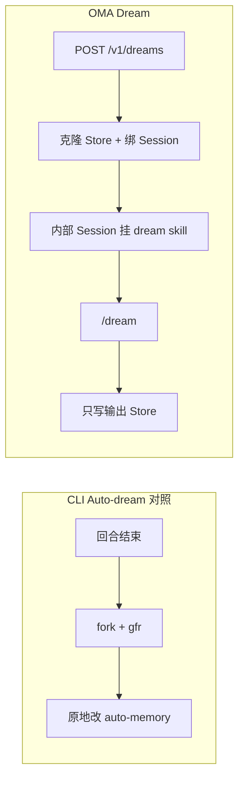
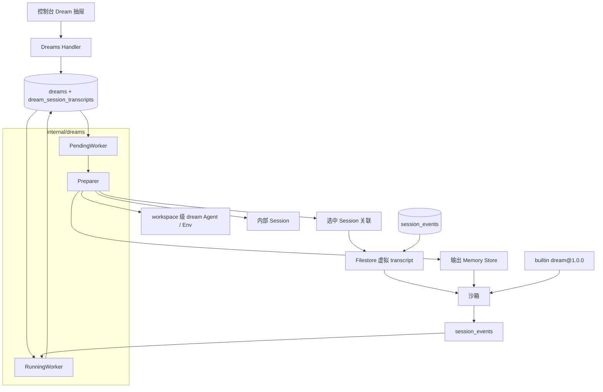
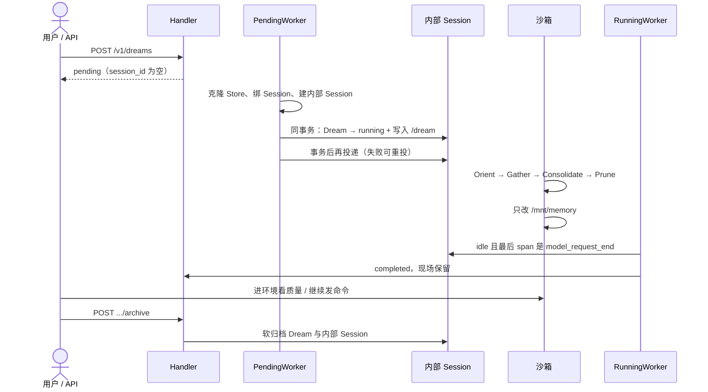
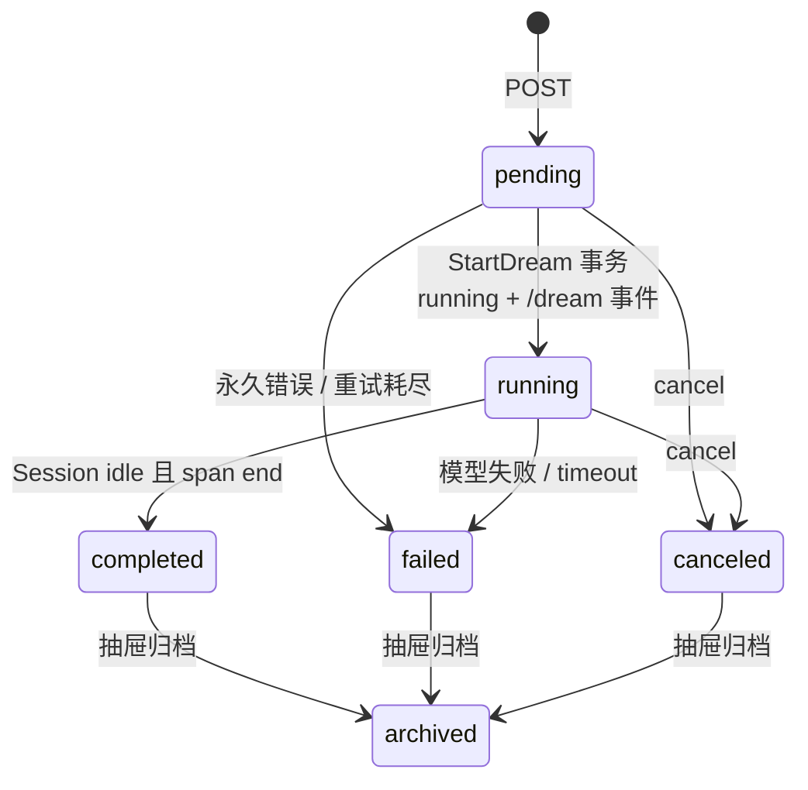

# OMA Dream

- 状态：已实现
- 日期：2026-09-20
- 公开合同：[Anthropic Dreams](https://platform.claude.com/docs/zh-CN/managed-agents/dreams) / [docs/zh/dreams.mdx](../../zh/dreams.mdx)
- 相关：[memory-store.md](./memory-store.md)、[filestore.md](./filestore.md)、[Dreaming 抽屉](../fe/dreaming-drawer.md)
- 细节：[状态机](../../yangys/oma-dream-state-machine.md)、[JSONL 与 skill](../../yangys/oma-jsonl-dream-review.md)

一次 Dream = **一个异步作业 + 一场内部巩固 Session**。读一个已有 Memory Store 和 1～100 场选中 Session，产出**另一个新 Store**。输入永不被改。

---

## 1. 关键设计点

| # | 决定 | 为什么 |
| --- | --- | --- |
| 1 | 输入 Store **不挂进沙箱**；先克隆再写克隆 | 官方合同：输入不可变。失败/取消也不回滚已产出的输出 Store |
| 2 | 输入 Session **不落 JSONL 文件**；Filestore 按需从 `session_events` 渲染只读视图 | 多租户、分页、SSE、Dream 共用一份真相，避免文件和库两套数据 |
| 3 | 巩固说明书做成平台 `dream` skill，内部 Session 起来后发 `/dream` | 与 CLI Auto-dream 共用四阶段，但触发走官方作业 API，过程留在本场 Session |
| 4 | 公开五态 + 内部 `execution_state`；转换全是带 WHERE 的 CAS | 对外对齐 Anthropic；对内能从崩溃点续跑，写不出非法组合 |
| 5 | `running` 与 `/dream` 事件同一事务提交，提交后再投递 | 先有可恢复的命令，再碰沙箱；投递失败不回滚，按持久化事件重投 |
| 6 | 终态先留现场；抽屉归档 Dream 才归档内部 Session | 用户要进环境看整理质量，并继续发命令。删除 Session 是用户另一步 |
| 7 | 每 workspace 一份系统私有 Agent / Environment | 所有 Dream 复用；列表不可见、不可选、不可改 |

CLI Auto-dream 是本地回合结束后**原地改同一份记忆**。OMA 是云上作业：**克隆新 Store，只写克隆**。



---

## 2. 模块



| 模块 | 职责 |
| --- | --- |
| `handler.go` | 创建 / 查询 / cancel / archive；校验 1～100 场 Session、`instructions` ≤ 4096 |
| `preparer.go` | 克隆 Store、写关联、确保系统 Agent/Env、建内部 Session |
| `PendingWorker` | 认领 pending、准备资源、`StartDream`、瞬时错误重试 |
| `RunningWorker` | 观察内部 Session → completed / failed / timeout；重投 `/dream` 与 interrupt |
| `filestore/dream_transcripts.go` | `/transcripts/dream/sesn_*.jsonl` 只读虚拟视图 |
| `ArchiveDream` | 用户归档 Dream 时：软归档 Dream + 内部 Session，再停 Work |

`keep_runtime: false` 才启用 `reclaimer` / `archiver`（终态自动杀沙箱并归档 Session）。默认 `true`。

---

## 3. 沙箱里有什么

```text
/mnt/memory/                 输出 Store，可写；也是 auto-memory 根
/mnt/transcripts/dream/      只读虚拟 JSONL，一场选中 Session 一个文件
/root/.claude/skills/dream/  平台 skill，只读
```

没有输入 Store、没有用户仓库、没有用户 MCP。Skill 只写 `/mnt/memory`。

Transcript 不是预先写好的文件：内部 Session → Dream → `dream_session_transcripts`，按需从 PG 拉主线程事件压成 JSONL。未绑定的 `sesn_` 直接 404。上限 5000 事件 / 2 MiB；截断时首行 `dream.transcript_truncated`。

---

## 4. 一次 Dream 怎么走



完成判定不能只看 Session `idle`：工具回合之间也会 idle。必须 **idle 且最后一个模型 span 是 `end`**。timeout 从 `started_at` 起算（默认 6h），先判完成再判超时。

---

## 5. 状态

对外五态对齐官方。对内 `execution_state` 只给 worker 用。



`archived` 不是第六个 `status`，只是 `archived_at`。pending / running 不能归档，须先 cancel。

| 时机 | Session / 沙箱 |
| --- | --- |
| 终态 | 默认保留，可进入、可继续发命令 |
| 归档 Dream | 软归档内部 Session，请求停 Work |
| 删除 Session | 用户在会话列表自己操作 |

cancel / timeout 会发稳定 ID 的 `user.interrupt` 停掉还在跑的 `/dream`，但不因此归档 Session。

---

## 6. Skill

`internal/skills/product/dream/SKILL.md`（当前 `1.0.0`）嵌入二进制，启动时 upsert 进 builtin catalog。改正文必须同时 bump `version`。

四阶段：**Orient** 看已有记忆 → **Gather** 先扫全部 `user.message` 再窄 grep → **Consolidate** 合并、latest-wins、≥2 场才升格为模式 → **Prune** 重写 `MEMORY.md`，本场没证据不等于过时。

相对 CLI `gfr` 的差异是有意的：OMA 没有 `logs/`、没有仓库、`team/` 也不适用。说明书按 OMA 沙箱改过。细节见 [JSONL 与 skill](../../yangys/oma-jsonl-dream-review.md)。

---

## 7. 公开合同（摘要）

Beta：`anthropic-version: 2023-06-01`，且 `anthropic-beta` 同时含 `managed-agents-2026-04-01` 与 `dreaming-2026-04-21`。

| 方法 | 路径 | 要点 |
| --- | --- | --- |
| POST | `/v1/dreams` | 立刻 `pending`；`inputs` 为 memory_store + sessions（1～100） |
| GET | `/v1/dreams`、`/{id}` | 列表默认不含已归档 |
| POST | `/{id}/cancel` | pending/running → canceled；已 canceled 幂等 |
| POST | `/{id}/archive` | 仅终态；软归档 Dream 与内部 Session |

`pending` 时 `session_id` / `outputs` 对外为空。`running` 起才公开内部 Session `session_id` 和输出 Store。`error.type`：`input_memory_store_unavailable`、`input_session_unavailable`、`output_memory_store_unavailable`、`timeout`、`internal_error`。

---

## 8. 还没做的

- 克隆中途失败留下的半成品 Store：带 `dream_id` metadata，暂不自动回收
- 工作区 Store 数量不限额（每场 Dream 都会新建一个输出 Store）
- `keep_runtime: false` 的自动回收仍保留给运维，不是产品默认路径
