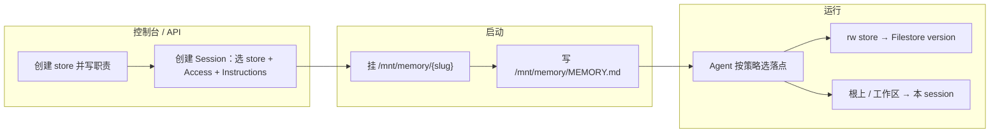
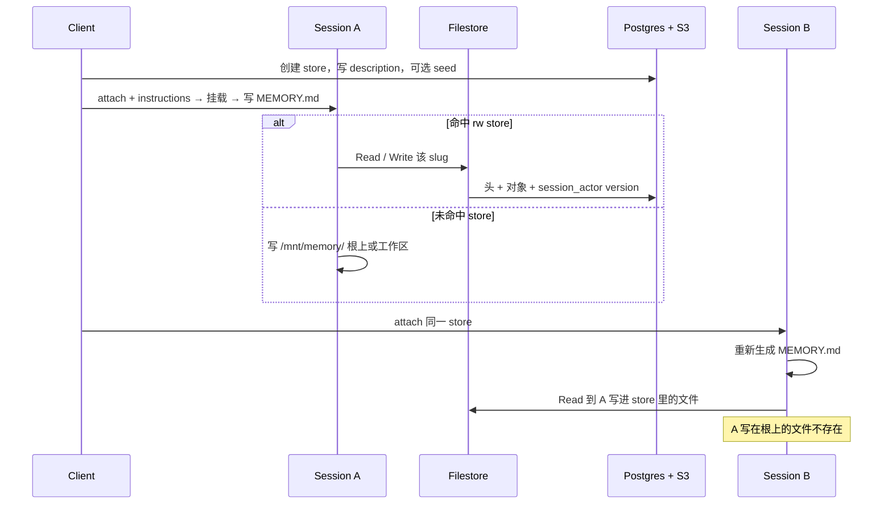
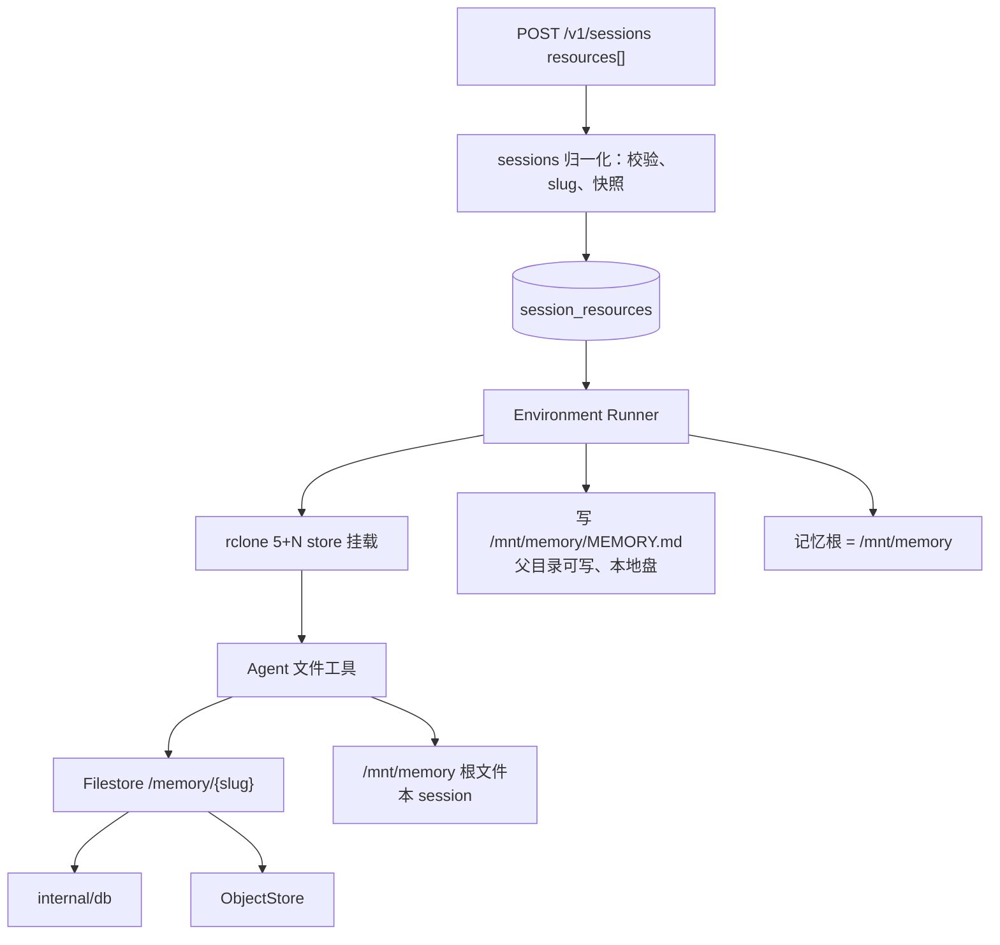

# Memory Store 运行时

- 状态：已实现（Attach 合同、Filestore `/memory/{slug}` 写回、Sandbox 挂载与 `MEMORY.md`）
- 日期：2026-08-27
- 官方 HTTP 合同：[Using agent memory](https://platform.claude.com/docs/en/managed-agents/memory)

CRUD、三张表、S3 正文、控制台列表/详情已落地。本文只补运行时：**挂载、写回 version、把 store 目录的含义交给 Agent**。

**方案**：每个 attach 的 store 挂到 `/mnt/memory/{slug}`。Agent 用普通文件工具读写；Filestore 把这些操作变成 Postgres 元数据 + S3 正文 + 不可变 version。

`/mnt/memory/` 是记忆根目录。启动时在此写入 `MEMORY.md`（一行一个 store：路径、权限、description、instructions）。平台只配 store 和策略，不替 Agent 选落点，也不禁止 Agent 在 store 外写文件。

跨会话能不能留下，由**写到哪里**决定，不由策略禁写：

- 写进已挂的 `rw` store → 进 Filestore，下一次 Session attach 同一 store 仍在。
- 写到 `/mnt/memory/` 根上、工作区或其他未挂载路径 → 只在本沙箱有效，重启后消失。

父目录保持可写，但是沙箱本地盘，不是 Filestore。`instructions` 上限 **500** 字。不把策略追加进 `appendSystemPrompt`，不把各 store 文件清单灌进模型上下文。

---

## 1. 问题

Session 默认没有跨会话记忆。需要：

1. 沙箱里能看见并读写已 attach 的 store。
2. 写入立刻成为可审计的 version，下一 Session attach 同一 store 能读到。
3. Agent 知道每块盘在哪、记什么、何时记；把记忆放到它认为合适的地方。

控制台预置、Agent 边做边记、事后 Dreams 整理是三层，本文只做前两层。Dreams 非目标。

职责切开：

| 谁 | 做什么 |
| --- | --- |
| 平台 / 开发者 | 建 store、attach、写 description / instructions / access；启动时挂盘并生成 `MEMORY.md` |
| Agent | 读 `MEMORY.md`，按职责把记忆写到合适的地方。命中 `rw` store 则跨会话；未命中则本 session 有效 |

平台不把 Agent 关进预设目录。没 attach 的 store 不存在；`ro` store 文件系统不让写。这两条是挂载硬边界，不是策略禁令。

---

## 2. 方案

### 2.1 挂载

每个 store 一条 rclone 挂载：

| access | Filestore | 沙箱 | token | 只读位 |
| --- | --- | --- | --- | --- |
| `read_write` | `/memory/{slug}` | `/mnt/memory/{slug}` | 读写 | 否 |
| `read_only` | `/memory/{slug}` | `/mnt/memory/{slug}` | 只读 | 是 |

父目录 `/mnt/memory` **不是** Filestore 上的 store。启动时在沙箱本地创建该目录、写入 `MEMORY.md`，再把各 store 挂成子目录。父目录和 `MEMORY.md` **保持可写**。根上新建文件成功，但不进任何 store；沙箱销毁后随本地盘一起丢掉。未挂载的子路径同样不是持久记忆。

ready = 五个固定 mount + 全部 memory store mount + `MEMORY.md` 已就位。任一失败则启动失败并清理 sandbox。删除 memory payload 对 environment-manager 的透传。

### 2.2 持久化

只有写到 `/mnt/memory/{slug}/...` 且该 slug 已挂、`access=read_write` 的内容会进 store。沙箱无物化副本，读写穿透 Filestore：

- 读：查头 + S3 GetObject。
- 写：新 S3 对象 + `session_actor` version（带 `session_id`）+ 更新头。
- 限额：单条 100KB，每个 store 2000 条。
- 沙箱同 path：last-writer-wins；REST update 带 `content_sha256` 对不上则 409。
- 不保证协同编辑，无推送。其他沙箱穿过 VFS 缓存后可见（可写约 1–3s）。新 Session 一挂上就是最新头。

写到 `/mnt/memory/user_xxx.md` 这类根路径：本地文件成功，Filestore 不认领，API / 控制台看不到，下一 Session 不存在。

### 2.3 策略：`/mnt/memory/MEMORY.md`

Claude 启动前，runner 写入 `/mnt/memory/MEMORY.md`。模型会加载该文件，看到的是 store 目录段（路径、权限、description、instructions），不是寿命引导。`appendSystemPrompt` 只保留 uploads/outputs 环境说明，不追加记忆段落。

这是本 Session 的启动产物，**不是**某个 store 里的 `mem_`。每次启动按本次 attach 快照整文件重写。控制台各 store 详情里看不到它。运行中 Agent 可以改它（自动记忆常会追加本 session 的索引）；这些改动和根上散文件一样，不进 store，下次启动被整份覆盖。

文件格式：一个 store 一行，禁止换行。固定引导（寿命、优先写 store、不要改目录段）**先不写入** `MEMORY.md`，只注入 `<!-- oma-stores -->` 和 store 行。落盘规则仍见 §2.4，不靠这段进上下文。Agent 可在 marker 后追加本 session 临时索引；不要改 `<!-- oma-stores -->` 这一段。

```text
<!-- oma-stores -->
- [user-preferences](/mnt/memory/user-preferences) rw — 用户的饮食与语言偏好。问饮食或语言先读此目录；有新偏好就更新对应文件。
- [oma-project](/mnt/memory/oma-project) rw — 架构决策。开始任务前先读；新结论写入 decisions/。
- [team-playbook](/mnt/memory/team-playbook) ro — 团队规范，只读，不得修改。
```

| 项 | 合同 |
| --- | --- |
| 路径 | `/mnt/memory/MEMORY.md`（父目录可写；本文件可被 Agent 改，下次启动覆盖） |
| 何时写 | store mount ready 之后、Claude 起来之前 |
| 怎么写 | runner 写本地文件，不走 Memory Store API |
| 内容 | `<!-- oma-stores -->` + 一行一个 store；不写固定引导；每次启动整文件替换 |
| 一行 | `[name](mount_path) access — description。instructions`；`description`/`instructions` 为空时省掉对应分隔符，不留悬空的 `— 。`；`name` 里的 `[` `]` `\` 转义，防止链接被名字截断 |
| `instructions` | ≤ **500** 字（Unicode 码点）。超限 **400**，不截断 |
| `description` | store 本体仍 ≤ 1024；挂载时快照进这一行 |
| 不写什么 | 各 store 文件清单、记忆正文。正文靠 Agent Read `/mnt/memory/{slug}/...` |

无 store 时：不写 `MEMORY.md`，不设 §2.5 后两个环境变量，不创建记忆根。此时没有自动记忆目录，本 session 草稿也只能落在工作区等普通沙箱路径，同样随重启丢掉。

加载该文件有 200 行 / 约 25,000 字上限。500 字 × 8 个 store 远低于此；入口拒绝超限，生成时不再截断策略。运行中 Agent 若把 `MEMORY.md` 撑过上限，超出部分本 session 后续加载可能被截断；下次启动仍按快照重写。

用户说「记住」或模型打算自动记下时：Agent 对照上表自行选择。有匹配的 `rw` store 就写入该 store；没有合适的 store 就写在根上或其他本地路径。平台不指定默认 store。选错 store（把个人口味写进项目 store）是策略写得含糊或模型判断失误，用 description / instructions 收紧，不用资源顺序兜底。

### 2.4 落盘规则

| 情况 | 行为 |
| --- | --- |
| 有匹配的 `rw` store | 写入该 store `mount_path` 下，进 Filestore / version，跨会话 |
| 没有匹配的 store，或只有 `ro` | 允许写在 `/mnt/memory/` 根上或工作区；本 session 有效，不进 store |
| 未挂任何 store | 不建记忆根；写入工作区等本地路径，本 session 有效 |
| 一次性任务、能从代码推出的事实 | 引导仍建议不要记进 store；记到根上也不跨会话 |
| 写 `ro` store | 文件系统拒绝 |

### 2.5 运行时配置（有 store 时）

```text
CLAUDE_CODE_REMOTE=true
CLAUDE_CODE_REMOTE_MEMORY_DIR=/mnt/memory
CLAUDE_COWORK_MEMORY_PATH_OVERRIDE=/mnt/memory
```

后两个无 store 则不设。写允许覆盖 `/mnt/memory/` 及其下路径；各 `read_only` store 仍靠挂载只读位拒绝写入。沙箱关闭会跳过 `MEMORY.md` 加载的实验开关（`tengu_moth_copse`）。

### 2.6 一次请求里有什么

```text
POST /v1/sessions     挂载 + 写 /mnt/memory/MEMORY.md。模型看不见。
POST /v1/messages
├── system：人设 + uploads/outputs 说明（无记忆段落）
├── tools：Read / Write / Edit / Glob（无 Memory 工具）
└── messages[0]：含 MEMORY.md（store 目录段，无固定引导）
    其后：对话；各 store 正文只出现在 Read 的 tool_result
```

---

## 3. 目标与非目标

**做**

- attach 的 store 出现在 `/mnt/memory/{slug}`，文件工具可按 access 读写。
- 写到可写挂载点则产生 `session_actor` version；下一 Session attach 同一 store 读到最新头。
- 启动写入 `/mnt/memory/MEMORY.md`；父目录可写但不持久。
- Agent 按策略选 store；未命中 store 的写入本 session 有效，沙箱重启后消失。
- 与 `/v1/memory_stores` 共用 `internal/db`。

**不做**

- 指定「默认 store / 第一个 store」承接自动记忆。
- 用策略禁止 Agent 在 store 外写文件。
- 把父目录上的主题文件或索引做成跨会话持久。
- 语义检索、Dreams、version 清理 UI、CRDT、向正在跑的 Agent 推送变更。
- 启动物化拷贝；OMA 走 live 挂载。
- 把各 store 文件清单或正文灌进启动上下文。
- 把记忆策略追加进 `appendSystemPrompt`。

---

## 4. 决策

| # | 决策 |
| --- | --- |
| 1 | 可写虚拟 namespace；不拷贝；不把 memory payload 透传 environment-manager |
| 2 | `mount_path` / `name` / `description` 服务端权威；请求携带 → 400 |
| 3 | store 的 access 双层强制：只读 token + mount 只读位 + 服务端拒写。父目录是沙箱本地盘，可写、不进 Filestore |
| 4 | 并发 = last-writer-wins + version 审计（仅 store 内路径） |
| 5 | 挂载时快照 name / description / mount_path / access / instructions；运行中改名不影响已启动 Session |
| 6 | fail-closed：任一 memory mount 未就绪或 `MEMORY.md` 未写好则启动失败 |
| 7 | 策略只在 `/mnt/memory/MEMORY.md`；`appendSystemPrompt` 仅环境说明 |
| 8 | 启动上下文只含这一份 `MEMORY.md`；记忆正文 opt-in Read |
| 9 | 落到哪个 store 由 Agent 按策略判断；平台不指定默认 store，也不禁写 store 外 |
| 10 | 跨会话寿命 = 是否写进已挂 `rw` store。根上与工作区随沙箱重置 |

`mount_path` 是沙箱目录 `/mnt/memory/{slug}`；memory `path` 是 store 内文档路径（如 `notes/a.txt`）。快照冻的是标签，store 内正文按 store UUID 实时读。

---

## 5. 流程



控制台字段去向：

| 字段 | 去向 |
| --- | --- |
| store name / description | 快照 → `MEMORY.md` 那一行 |
| Add memory 的 path / content | PG + S3；Agent Read |
| 资源卡：store / Access / Instructions | 挂哪块盘；职责写进该行。顺序不决定落盘 |

提示开发者：把 store 的职责写清楚。没有可写、职责匹配的 store，「记住」可以留在本 session，但不要指望跨会话还在。

跨 Session：A 写入某个 store → 容器销毁 → B attach 同一 `memory_store_id` → 读到 A 的最新头。B 的 `MEMORY.md` 按 B 的 attach 快照整份生成，不继承 A 在父目录上的任何文件，也不继承 A 对 `MEMORY.md` 的运行时改动。



---

## 6. 架构



| 包 | 职责 |
| --- | --- |
| `internal/sessions` | 校验（≤8、不重复、access、instructions ≤500、禁止客户端 mount_path/name/description）；slug；快照。Deployment run 共用 `insertSessionTx` |
| `internal/environments` | 创建可写的 `/mnt/memory`；multimount 5→5+N；写 `MEMORY.md`（不锁父目录）；ready 含 store mount 与该文件；删透传；有 store 时设 §2.5 环境变量；写允许覆盖记忆根，`ro` store 除外 |
| runner / `internal/codesessions` | `appendSystemPrompt` 仅 uploads/outputs |
| `internal/filestore` | 可写虚拟 namespace `/memory/{slug}`；每请求回查授权。不认领父目录 |
| `internal/db` | filesystem UUID → 本 Session 的 slug / store / access / 归档。不缓存、不进 JWT |
| 控制台 | Create session / deployment：选 store、Access、Instructions（500 字）。列表/详情/Add memory 已有 |

filestore 只 import `internal/db`。`sessions` / `environments` 不碰 memory 三表。

---

## 7. 合同

### 7.1 Attach

- 最多 8 个 store，不得重复。Create Session 请求体与 `POST /resources` 都强制这两条；`CreateSessionResource` 在锁定 Session 行后的同一事务里再次检查，并发附加不会写出重复 `memory_store_id` 或第 9 个 store。冲突返回 `invalid_request_error`。
- `access` 缺省 `read_write`；仅 `read_write` / `read_only`。这是本次挂载权限，不是 store 属性。
- `instructions` ≤ 500 字，允许空。Session 与 Deployment 共用该上限。
- 请求携带 `mount_path` / `name` / `description` → 400。
- 不存在 → 404；已归档 → 400。
- slug = name 小写，非字母数字折叠为 `-`，去首尾；空则回退 external id；同 Session 冲突追加 `-2`。
- 错误集中 `internal/sessions/errors.go`。
- 资源顺序不影响落盘。

### 7.2 Filestore 写

每请求实时回查：未挂载 → not found；`read_only` 写 → 403；归档 → 拒 mutation；>100KB 拒写；第 2001 条拒新建。

| 操作 | 语义 |
| --- | --- |
| 新建 / 覆盖 | `created` / `modified`，`session_actor` + session_id |
| 删除 | 软删，`deleted` version |
| 重命名 | `modified`；目标 path 已存在时，在同一事务里软删目标再改源 path |
| mkdir / rmdir | 不持久化 / 空 no-op、非空拒绝 |
| 跨 namespace copy/move | 拒绝 |
| `ttlSeconds` | 非 0 拒绝。Memory 没有 Filestore 过期；成功写入是跨 Session 永久记忆 |
| 非 UTF-8 正文 | 上传对象存储前拒绝。REST `content` 是 JSON string，本身已是 UTF-8；Filestore/FUSE 写回是唯一能注入非法字节的入口 |
| 相同正文 flush | 不新建 version，丢弃刚上传、未被引用的 object |

S3 key：

```text
workspaces/{workspace_uuid}/memory_stores/{store_uuid}/memories/{memory_uuid}/versions/{version_uuid}/content
```

父目录上的本地文件不走本表，不产生 version，不占用 100KB / 2000 条限额。

### 7.3 归档 / 删除

| 操作 | 已挂 Session |
| --- | --- |
| 删一条 memory | 路径消失；历史 version 仍可 API 读 |
| 归档 store | mutation 全拒 |
| 删整个 store | fail-closed 拒访问 |

Agent 可以改运行中的 `MEMORY.md`。下一 Session 按快照重建，不保留这些改动。

---

## 8. 安全

- 可写 store 里的内容会被后续 Session 当记忆读。不可信输入不要写入可写 store；共享规范用 `read_only`。
- 启动只灌 `MEMORY.md`，不灌各 store 目录。
- 根上乱写进不了 store；寿命止于本沙箱。
- JWT 不含 slug 授权；每请求回查 `session_resources`。
- `MEMORY.md` 每次启动整份覆盖，策略以本次快照为准。平台只写 `<!-- oma-stores -->` 段；被改乱只影响本 session。

---

## 9. 验收

1. Agent 读到 seed；写入可写挂载后 API 立刻查到同一 path，`created_by.type=session_actor` 带 session_id。无透传、无启动物化拷贝。
2. 响应含服务端 `mount_path`；请求携带 `mount_path` / `name` / `description` → 400。
3. `read_only` 写失败且无 version；`read_write` 写有 version。
4. 双 Session 同 path：后写为头；后启动的 B 读到 A 已提交的写。
5. 运行中改 store 名：已启动 Session 的 `mount_path` 与启动时写入的 `MEMORY.md` store 目录段不变（Agent 运行时改动除外）。
6. 任一 memory mount 失败或 `MEMORY.md` 未写好 → 启动失败并清理 sandbox。
7. 有 store：存在可写的 `/mnt/memory/` 与 `/mnt/memory/MEMORY.md`，一行一个 store；启动上下文含该文件；`appendSystemPrompt` 无记忆段落；写 `/mnt/memory/` 根下的文件成功，API / 控制台查不到该 path。
8. 无 store：不设 §2.5 后两个环境变量；不写 `MEMORY.md`；不创建记忆根。
9. 控制台能选 store、Access、Instructions；提交体不含 mount_path / name / description。
10. 控制台 Add memory 的文件，Session 内 Agent 能 Read 到；Agent 写入匹配的 `rw` store 后详情页能看到。父目录和各 store 详情都没有平台 `MEMORY.md`。
11. `instructions` 501 字 → 400；500 字通过。
12. 有 store 但无匹配职责时，用户要求「记住」可以在根上留下文件；该文件不出现在任何 store；下一 Session 不存在。未挂任何 store 时不产生 store 文件。
13. Session A 写根文件并改 `MEMORY.md` 索引 → 销毁 → Session B attach 同一批 store：B 只有按快照重建的 `MEMORY.md`，没有 A 的根文件。

测试先失败再成功。sessions / filestore（真 PostgreSQL）/ runner / 控制台 / E2E（A 写指定 store → B 读；A 写根 → B 看不到；`ro` store 写失败）各盖上表。

合入时已同步：[e2b-sandbox-image-contract.md](./e2b-sandbox-image-contract.md)、[filestore.md](./filestore.md)、[messages-proxy.md](./messages-proxy.md)、[deployments-api-contract.md](./deployments-api-contract.md)（instructions 4096→500）。
