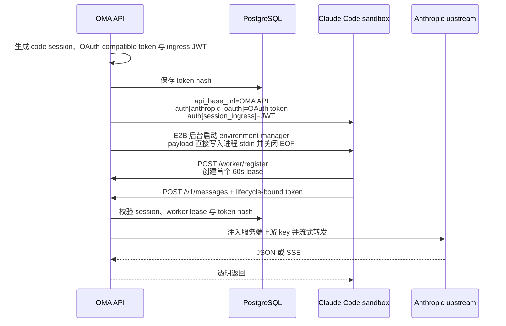

# 统一 Messages 代理与 Claude Code 沙箱凭证

## 目标

服务对外提供 Anthropic 兼容的 `POST /v1/messages`，供普通 SDK/API 调用和 Claude Code 沙箱使用。上游 `anthropic_upstream.api_key` 只存在于服务端配置，不再写入沙箱环境或 `environment-manager` 启动 payload。

Claude Code 仍要求 OAuth 形态的 Anthropic 凭证。environment-manager 通过 `auth[type=anthropic_oauth]` 和 `CLAUDE_CODE_OAUTH_TOKEN_FILE_DESCRIPTOR` 向 Claude 传入 OMA 本地签发的 `sk-ant-oat01-...` lifecycle-bound token，并使用 `startup_context.api_base_url` 作为 `ANTHROPIC_BASE_URL` fallback。该 token 只在 OMA 本地代理生效，不是真实 Anthropic OAuth token；payload 不注入 `ANTHROPIC_API_KEY`、真实上游地址或明文 OAuth 环境变量。

## HTTP 契约

规范入口为：

```text
POST /v1/messages
```

handler 不解析 JSON，直接流式转发请求 body、query 和 Anthropic 合同 header，并执行以下边界处理：

- 删除调用方的 `Authorization`、`X-Api-Key`、`Cookie`、组织/workspace 内部 header 和 hop-by-hop header；
- 由服务端注入 `anthropic_upstream.api_key`；
- 将请求发往 `anthropic_upstream.base_url/v1/messages`；
- 透传上游状态码、响应 body、SSE 数据和限流等响应 header；
- SSE 响应逐块 flush，并关闭代理缓冲；
- 请求 body 上限为 32 MiB。

管理后台继续使用原平台路径 `POST /api/organizations/{orgUuid}/proxy/v1/messages`。该路由及其独立代理实现不作为 `/v1/messages` 的兼容别名，也不承载 Claude Code 的 session-scoped token。它在 `anthropic_upstream.model_mappings` 命中请求顶层 `model` 时把该逻辑模型 ID 替换为配置的上游模型 ID。Messages 的已知改写字段通过命名 DTO 解析；只有为保留第三方未知字段而使用的 request envelope 在该 HTTP 边界保留 `json.RawMessage`，不会把动态 JSON 结构传入内部领域模型。Quickstart Builder 返回的 Agent config 在前端的命名配置归一化边界解析模型字段，Agent 写入边界再执行防御性解析。未配置、未命中或请求体无法按 JSON object 解析时，请求体保持不变并交给上游处理。公共 `POST /v1/messages` 继续透明流式转发请求体，不应用该 Console 映射。

服务端不提供 `/v1/code/sessions/{code_session_id}/bridge`。managed-agent 在创建 code session 时直接获得 OAuth FD、WebSocket FD 和初始 worker epoch；后续 worker 所有权切换统一使用 `/worker/register`。

## 鉴权与权限

| 凭证                                | 可访问 `POST /v1/messages` | 其他 `/v1/*`  | 模型约束   |
| ----------------------------------- | -------------------------- | ------------- | ---------- |
| workspace API key                   | 是                         | 按原 API 权限 | 无额外约束 |
| platform `sessionKey` cookie        | 是                         | 按原平台权限  | 无额外约束 |
| code-session OAuth-compatible token | 是                         | 否            | 无额外约束 |

code-session token 只有在以下条件全部满足时才通过鉴权：

- token SHA-256 hash 命中 `code_sessions.oauth_access_token_hash`；
- public session 未终止、未删除，code session 为 `active` 且未删除；
- CCR v2 `worker_lease_expires_at > now()`；
- 请求方法和路径严格对应 `POST /v1/messages`。

environment-manager 在启动 Claude Code 前调用 `/worker/register`，建立首个 60 秒 lease；Claude 之后每 20 秒调用 `/worker/heartbeat` 续租。Claude 异常退出时不再续租，OAuth-compatible Messages 凭证最多在最后一个 lease TTL 内继续有效。session-ingress JWT 统一只校验签名、固定 claims 和请求路径绑定；register、heartbeat 及其他 ingress 请求不在 JWT 鉴权阶段回查 session 或 lease。worker epoch、heartbeat grace 和 OTLP lease 仍由各自 handler 的状态机判断。

code-session 请求来自受信任的沙箱调用方，handler 不解析或校验 `model`。请求体由上游按照 Anthropic Messages 合同校验；本服务只负责入口鉴权、请求大小限制、header 清洗和流式代理。因此代理不需要为了读取 JSON 字段而将整个 body 放入内存。

## 凭证生命周期与持久化

创建 managed-agent code session 时生成随机 `sk-ant-oat01-...` token。数据库只保存 hash，不保存明文或独立过期时间：

- `oauth_access_token_hash text`；
- 未删除记录的非空 hash 具有唯一索引。

OAuth-compatible token 没有 11 分钟或 8 小时墙钟上限，但每次 `/v1/messages` 鉴权仍复核 active code session、未 terminated 的 public session 和 worker lease。managed-agent 启动时签发的 session-ingress JWT 也不写入独立 `exp`，当前仅验证密码学身份与请求路径，不因 session 终止或 lease 到期而自动撤销；后续如需撤销语义，应单独引入明确的 token version、denylist 或状态复核策略。

进程启动时只创建一份 `SessionCredentials`，并显式注入 API server、environment runner 和 code-session service。这些组件的构造器不自行读取密钥或生成临时签名器；密钥配置错误由启动组合根处理，避免构造组件时发生隐式 panic，也保证签发端与验签端始终使用同一套密钥。

## 启动与调用流程



`environment-manager` 的 `auth[type=anthropic_oauth]` 使用 lifecycle-bound OAuth-compatible token；`auth[type=session_ingress]` 使用自包含的 `sk-ant-si-<JWT>`。前者只访问 `/v1/messages`，后者供 worker、relay 与 upstream proxy 使用。启动 payload 不再包含 `auth[type=anthropic_api]` 或 `CLAUDE_CODE_SESSION_ACCESS_TOKEN`，避免环境变量遮蔽 WebSocket FD。Runner 先把 sandbox 标记为 `running` 并建立首个 environment work heartbeat，再通过 E2B 后台进程 API 启动 environment-manager、按 PID 直接发送并关闭 stdin；environment-manager 在启动 Claude 前 register CCR worker。work heartbeat 只维护 environment 租约，不参与 code-session token 鉴权。payload 不写入沙箱文件系统，发送或关闭失败时终止未完整初始化的进程。

## 错误语义

- 未配置上游 key：`503 api_error`；
- 上游地址或网络不可用：`502 api_error`；
- 请求超过 32 MiB：`413 request_too_large`；
- token 无效、session 终止、worker lease 过期或用在其他资源：`401 authentication_error`；
- 上游返回的非 2xx 状态和 body：原样透传。

所有本地生成的错误继续通过 `internal/httpapi.WriteError` 返回 Anthropic 兼容结构。

## 验收覆盖

- `tests/messages_api_test.go`：缺少上游 key、跨资源使用、未 register、lease 过期、public session 终止、长时间运行、普通 API key、平台 cookie、header 清洗与响应 header 透传；
- `tests/platform_proxy_directory_api_test.go`：管理后台原有独立路径的 JSON 与 SSE 转发；
- `internal/environments/environment_manager_test.go`：沙箱 payload 不含上游 key 或 Claude 凭证环境变量，api base URL 和 lifecycle-bound token auth 正确，启动 payload 会被删除；
- `tests/environments_runner_cloud_test.go`：真实 runner 组装出的 runtime payload 使用 session-scoped token。
