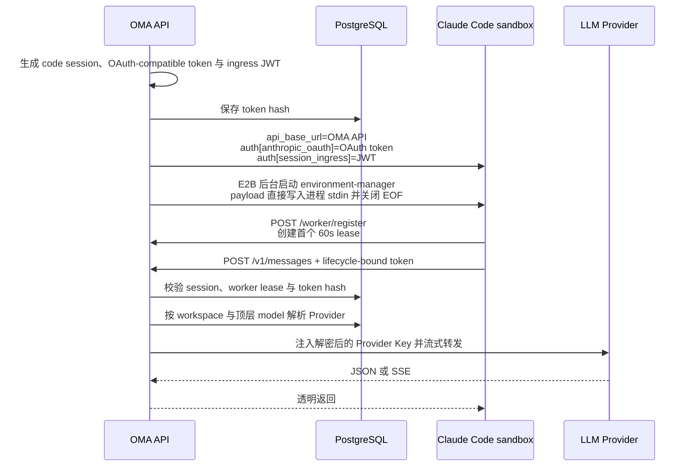

# Workspace BYOK 与 Messages 代理

## 配置模型

LLM 上游不是进程级 YAML。每个 workspace 可以配置多个 Provider；每个 Provider 保存：

- `name`
- `base_url`
- Vault 信封加密的 `api_key`
- 零个或多个真实 `model_ids`

同一 workspace 内，模型 ID 只能属于一个 Provider。模型 ID 是上游真实 ID，OMA 不映射、不改写，也不提供 `claude-*` 别名或默认 Anthropic 回退。

进程 YAML 不再包含 `anthropic_upstream`。上游地址和 Key 只来自 workspace Provider。

控制台入口为「LLM 模型」，API 为：

```text
GET    /api/console/organizations/{orgUuid}/workspaces/{workspaceId}/llm_providers
POST   /api/console/organizations/{orgUuid}/workspaces/{workspaceId}/llm_providers
PUT    /api/console/organizations/{orgUuid}/workspaces/{workspaceId}/llm_providers/{providerId}
DELETE /api/console/organizations/{orgUuid}/workspaces/{workspaceId}/llm_providers/{providerId}
```

这些 Provider 控制台接口只允许组织管理员访问。读取接口只返回 `has_api_key` 与 `api_key_last4`，不返回明文 Key。更新时省略或留空 `api_key` 表示保留原 Key。

控制台在「获取模型列表」时可通过下列接口向该网关请求模型列表，而不会把 Key 回写到响应里：

```text
POST   /api/console/organizations/{orgUuid}/workspaces/{workspaceId}/llm_providers/preview_models
POST   /api/console/organizations/{orgUuid}/workspaces/{workspaceId}/llm_providers/{providerId}/models/sync
```

`preview_models` 用请求里的 `base_url` 和 `api_key` 调用上游 `{base_url}/v1/models`，只返回 `model_ids`。请求同时带 `X-Api-Key`、`Authorization: Bearer` 和 `anthropic-version`，兼容 Anthropic 与智谱等只认 Bearer 的网关。`data: []` 是合法空列表；缺少 `data`、`success:false` 或带 `error` 的信封视为失败。

`models/sync` 解密已保存的 Key，并按以下顺序更新：始终保留该 Provider 已保存的模型；仅从上游新发现的 ID 中过滤已被其他 Provider 占用的项；过滤后再去重、合并并应用 100 个模型的上限。响应通过 `skipped_model_ids` 返回因冲突跳过的 ID。上游失败返回 `502`，不改写现有配置。

Provider 控制台错误响应包含稳定的 `code`，前端不得依赖英文 `message` 判断错误。模型冲突还返回结构化的 `model_id`。例如：

```json
{
  "error": "invalid_request",
  "code": "model_conflict",
  "message": "model_id is already configured by another provider: glm-4.7",
  "model_id": "glm-4.7"
}
```

`base_url` 必须是绝对 HTTP 或 HTTPS URL，且不得包含 userinfo、query 或 fragment。允许 localhost、私网地址和自定义端口，因为这是 workspace 管理员配置的网关，不是沙箱选择的任意目标。Code-session CONNECT 代理仍使用独立的公网 SSRF 边界。代理客户端不跟随重定向，避免把 Provider Key 发到另一个主机。

## HTTP 契约

规范入口为：

```text
POST /v1/messages
```

handler 通过 `http.MaxBytesReader` 把请求体限制为 32 MiB，并在转发前将这段有界请求体读入内存。完整扫描顶层对象可以确认 `model` 恰好出现一次，避免不同 JSON 解析器对重复键取值不同而绕过 Provider 白名单；校验后仍按原始字节转发，不改写模型 ID 或其他字段。响应 body 继续逐块流式转发，不做整包缓冲。

顶层 `model` 必须是没有首尾空白的非空字符串；服务端不会通过 trim 把另一个输入静默归一化为已配置模型。

同时执行以下边界处理：

- 删除调用方的 `Authorization`、`X-Api-Key`、`Cookie`、组织/workspace 内部 header 和 hop-by-hop header；
- 解密该模型所属 Provider 的 Key，同时注入为上游 `X-Api-Key` 和 `Authorization: Bearer`；
- 将请求发往 `{provider.base_url}/v1/messages`；
- 透传上游状态码、响应 body、SSE 数据和限流等响应 header；
- SSE 响应逐块 flush，并关闭代理缓冲；
- 请求 body 上限为 32 MiB。

管理后台继续使用原平台路径 `POST /api/organizations/{orgUuid}/proxy/v1/messages`。该路由及其独立代理实现不作为 `/v1/messages` 的兼容别名，也不承载 Claude Code 的 session-scoped token。它与公共 Messages 入口走同一条 Provider 解析、唯一顶层 `model` 校验和 32 MiB 请求上限，也不改写请求体。

`GET /v1/models` 保留 Anthropic 列表信封的 `data`、`has_more`、`first_id` 与 `last_id`。列表内容来自当前 workspace 配置的真实模型 ID；由于 Provider 配置不维护能力目录，`display_name` 使用模型 ID，`created_at` 使用 Unix epoch，token 上限与 `capabilities` 显式返回 `null`。已有 Provider 但尚无模型时返回 `200`、`data: []` 和空游标；未配置 Provider 时返回 `503` 与英文消息 `This workspace has no LLM provider configured`；配置读取失败时返回 `500` 与英文消息 `Workspace model configuration is unavailable`。不额外返回机器可读 `error.code`。

服务端不提供 `/v1/code/sessions/{code_session_id}/bridge`。managed-agent 在创建 code session 时直接获得 OAuth FD、WebSocket FD 和初始 worker epoch；后续 worker 所有权切换统一使用 `/worker/register`。

## 鉴权与权限

| 凭证                                | 可访问 `POST /v1/messages` | 其他 `/v1/*`  | 模型约束   |
| ----------------------------------- | -------------------------- | ------------- | ---------- |
| workspace API key                   | 是                         | 按原 API 权限 | 无额外约束 |
| platform `sessionKey` cookie        | 是                         | 按原平台权限  | 无额外约束 |
| code-session OAuth-compatible token | 是                         | 否            | 无额外约束 |

code-session token 只有在以下条件全部满足时才通过鉴权：

- token SHA-256 hash 命中 `code_sessions.oauth_access_token_hash`；
- public session 未终止、未删除，code session 为 `active` 且未删除；
- CCR v2 `worker_lease_expires_at > now()`；
- 请求方法和路径严格对应 `POST /v1/messages`。

environment-manager 在启动 Claude Code 前调用 `/worker/register`，建立首个 60 秒 lease；Claude 之后每 20 秒调用 `/worker/heartbeat` 续租。Claude 异常退出时不再续租，OAuth-compatible Messages 凭证最多在最后一个 lease TTL 内继续有效。session-ingress JWT 校验签名、固定 claims 和请求路径绑定；managed-agent JWT 还携带 `worker_epoch`，入口会按租户回查 active Code Session 的 `current_worker_epoch`。heartbeat grace 和 OTLP lease 仍由各自 handler 的状态机判断。

code-session 请求来自受信任的沙箱调用方。公共 Messages 入口完整扫描有界请求体的顶层对象，只读取唯一的 `model` 以选择 Provider；其余字段仍由上游按 Anthropic Messages 合同校验。本服务负责入口鉴权、请求大小限制、header 清洗、Provider 解析和响应流式代理。

Claude Code 所需的 `ANTHROPIC_MODEL` 等变量名保留，但值为 Agent 保存的真实模型 ID；Provider Key 不进入 sandbox。

Agent PATCH 只有在请求显式携带 `model` 时才校验新模型；只修改名称、描述等字段时原样保留旧模型，即使管理员已经从 Provider 删除了该模型。这样旧 Agent 仍可通过后续 PATCH 切换到有效模型；实际运行仍按当前 Provider 配置失败关闭。

## 凭证生命周期与持久化

创建 managed-agent code session 时生成随机 `sk-ant-oat01-...` token。数据库只保存 hash，不保存明文或独立过期时间：

- `oauth_access_token_hash text`；
- 未删除记录的非空 hash 具有唯一索引。

OAuth-compatible token 没有 11 分钟或 8 小时墙钟上限，但每次 `/v1/messages` 鉴权仍复核 active code session、未 terminated 的 public session 和 worker lease。managed-agent 启动时签发的 session-ingress JWT 也不写入独立 `exp`；它复用现有 worker epoch 支持 fencing：Code Session 终止或 Sandbox 恢复递增 epoch 后，携带旧 epoch 的 JWT 在下一次请求时失效。worker lease 是否有效仍由具体 ingress handler 判断，不在 JWT 鉴权阶段统一要求。

进程启动时只创建一份 `SessionCredentials`。启动组合根把它注入 API server，并用它构造 environment runner 所需的 code-session service；Runner 通过 `RunnerDependencies` 接收这个最终 service，不自行读取密钥或生成临时签名器。密钥配置错误和 Runner 缺少依赖都会在 worker 启动前返回错误，保证签发端与验签端使用同一套密钥。

## 启动与调用流程


```mermaid
sequenceDiagram
    participant API as OMA API
    participant DB as PostgreSQL
    participant Sandbox as Claude Code sandbox
    participant Upstream as LLM Provider

    API->>API: 生成 code session、OAuth-compatible token 与 ingress JWT
    API->>DB: 保存 token hash
    API->>Sandbox: api_base_url=OMA API<br/>auth[anthropic_oauth]=OAuth token<br/>auth[session_ingress]=JWT
    API->>Sandbox: E2B 后台启动 environment-manager<br/>payload 直接写入进程 stdin 并关闭 EOF
    Sandbox->>API: POST /worker/register<br/>创建首个 60s lease
    Sandbox->>API: POST /v1/messages + lifecycle-bound token
    API->>DB: 校验 session、worker lease 与 token hash
    API->>DB: 按 workspace 与顶层 model 解析 Provider
    API->>Upstream: 注入解密后的 Provider Key 并流式转发
    Upstream-->>API: JSON 或 SSE
    API-->>Sandbox: 透明返回
```

`environment-manager` 的 `auth[type=anthropic_oauth]` 使用 lifecycle-bound OAuth-compatible token；`auth[type=session_ingress]` 使用自包含的 `sk-ant-si-<JWT>`。前者只访问 `/v1/messages`，后者供 worker、relay 与 upstream proxy 使用。启动 payload 不再包含 `auth[type=anthropic_api]` 或 `CLAUDE_CODE_SESSION_ACCESS_TOKEN`，避免环境变量遮蔽 WebSocket FD。Runner 创建 Cloud Session Sandbox 后，先等待固定 rclone-filestore 四挂载 ready，并最多重试三次删除临时 Token 配置；其中 `/uploads` namespace 已整体只读挂载到 `/mnt/session/uploads`，不执行逐文件 projection。随后把 sandbox 标记为 `running`、建立首个 environment work heartbeat，才创建 local Code Session 并通过 E2B 后台进程 API 启动 environment-manager、按 PID 直接发送并关闭 stdin。environment-manager 启动失败时 Runner 立即终止该 Code Session；启动成功后才以一个数据库事务把 runtime metadata 发布到 Session 和 Environment Work。environment-manager 在启动 Claude 前 register CCR worker。work heartbeat 只维护 environment 租约，不参与 code-session token 鉴权。payload 不写入沙箱文件系统，发送或关闭失败时终止未完整初始化的进程。

Managed Agent 的 initialize 控制事件把 Agent snapshot 中的 `system` 原样映射为 `systemPrompt`，并通过 `appendSystemPrompt` 追加 OMA 管理的 sandbox 文件合同。追加提示只描述环境，不替代 Agent 角色；它告诉 Claude 使用真实 sandbox 路径访问上传文件、把用户交付物写入输出挂载，并明确禁止根据 `file_id` 猜测或重建文件路径。该合同是所有 Session 共用的静态文本，不拼接资源清单、文件 ID 或其他 Session 数据，以保持稳定的 prompt cache 前缀；它由 OMA 的 Session 启动配置统一注入，不依赖 CCRv2 模式切换。

## 失败语义

- workspace 没有 Provider：`503 api_error`，英文消息 `This workspace has no LLM provider configured`；
- 请求模型未配置：`400 invalid_request_error`；
- 重复模型、Key 解密失败、Provider 数据损坏或配置读取失败：`500 api_error`，英文消息 `Workspace model configuration is unavailable`；失败关闭，不回退；
- 上游地址或网络不可用：`502 api_error`；
- 请求超过 32 MiB：`413 request_too_large`；
- token 无效、session 终止、worker lease 过期或用在其他资源：`401 authentication_error`；
- 上游返回的非 2xx 状态和 body：原样透传。

所有本地生成的错误继续通过 `internal/httpapi.WriteError` 返回 Anthropic 兼容结构。

## 最小实现边界

- 不建独立 Model 表；`model_ids` 直接存 Provider JSON 数组。创建和更新 Provider 时通过 workspace 级 PostgreSQL transaction advisory lock 串行化“检查模型归属 + 写入”，保证同一模型不会被并发分配给多个 Provider。
- Provider 的所有读写都同时绑定 `organization_uuid` 和 `workspace_uuid`。
- 不加缓存；删除或修改 Provider 立即生效。
- 不建立只有单实现的 Resolver 接口；调用方直接使用 `internal/llmproviders`。

## 验收覆盖

- `tests/messages_api_test.go`：缺少 Provider、未配置模型、跨资源使用、未 register、lease 过期、public session 终止、长时间运行、普通 API key、平台 cookie、header 清洗与响应 header 透传；
- `internal/messages/handler_test.go`：有界缓冲后保留原始请求体，并拒绝重复顶层 `model`；
- `tests/llm_providers_api_test.go`：workspace Provider CRUD、空模型转换、Key 加密、模型发现、冲突与解析；
- `tests/models_api_test.go`：`GET /v1/models` 返回已配置的真实模型 ID，并区分空 Provider 列表与空模型列表；
- `tests/platform_proxy_directory_api_test.go`：管理后台原有独立路径的 JSON 与 SSE 转发；
- `internal/environments/environment_manager_test.go`：沙箱 payload 不含上游 key 或 Claude 凭证环境变量，api base URL 和 lifecycle-bound token auth 正确，启动 payload 会被删除；
- `tests/environments_runner_cloud_test.go`：真实 runner 组装出的 runtime payload 使用 session-scoped token，并在 initialize 事件中携带 Agent system prompt 与 OMA append system prompt；
- `tests/environments_full_e2b_bridge_integration_test.go`：真实 E2B 中验证 Files API 上传、只读 uploads 挂载、Agent 生成 outputs、session 文件 Catalog 和 Files API 下载闭环。
